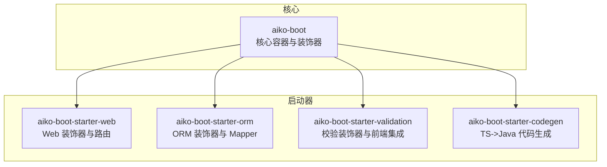
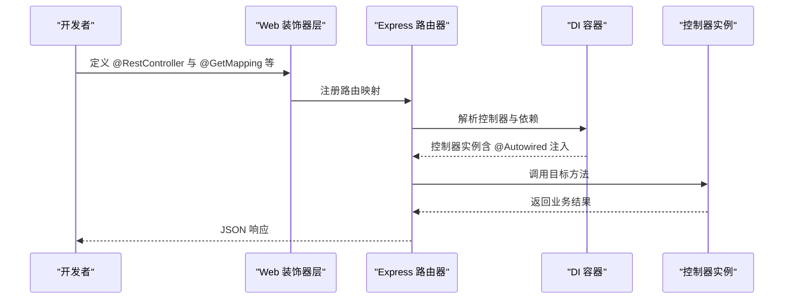
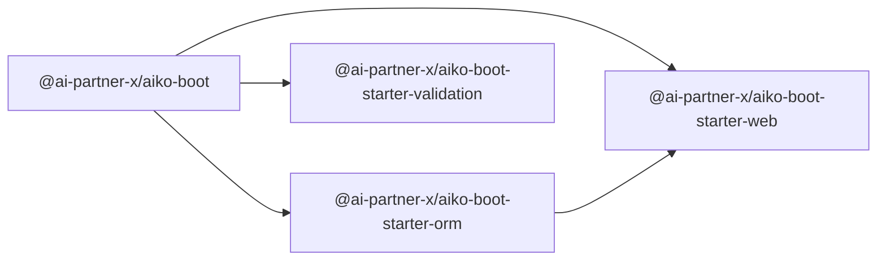

# API 参考手册

<cite>
**本文档引用的文件**
- [packages/aiko-boot/src/index.ts](file://packages/aiko-boot/src/index.ts)
- [packages/aiko-boot/src/decorators.ts](file://packages/aiko-boot/src/decorators.ts)
- [packages/aiko-boot/src/di/decorators.ts](file://packages/aiko-boot/src/di/decorators.ts)
- [packages/aiko-boot/src/types.ts](file://packages/aiko-boot/src/types.ts)
- [packages/aiko-boot/src/config-types.ts](file://packages/aiko-boot/src/config-types.ts)
- [packages/aiko-boot-starter-web/src/decorators.ts](file://packages/aiko-boot-starter-web/src/decorators.ts)
- [packages/aiko-boot-starter-web/src/express-router.ts](file://packages/aiko-boot-starter-web/src/express-router.ts)
- [packages/aiko-boot-starter-orm/src/decorators.ts](file://packages/aiko-boot-starter-orm/src/decorators.ts)
- [packages/aiko-boot-starter-orm/src/base-mapper.ts](file://packages/aiko-boot-starter-orm/src/base-mapper.ts)
- [packages/aiko-boot-starter-validation/src/index.ts](file://packages/aiko-boot-starter-validation/src/index.ts)
- [packages/aiko-boot/package.json](file://packages/aiko-boot/package.json)
- [packages/aiko-boot-starter-web/package.json](file://packages/aiko-boot-starter-web/package.json)
- [packages/aiko-boot-starter-orm/package.json](file://packages/aiko-boot-starter-orm/package.json)
- [packages/aiko-boot-starter-validation/package.json](file://packages/aiko-boot-starter-validation/package.json)
</cite>

## 目录
1. [简介](#简介)
2. [项目结构](#项目结构)
3. [核心组件](#核心组件)
4. [架构总览](#架构总览)
5. [详细组件分析](#详细组件分析)
6. [依赖关系分析](#依赖关系分析)
7. [性能考虑](#性能考虑)
8. [故障排除指南](#故障排除指南)
9. [结论](#结论)
10. [附录](#附录)

## 简介
本参考手册面向 Aiko Boot 框架的使用者与维护者，系统性地梳理并规范以下装饰器与 API 的使用方法：
- 核心装饰器：@Service、@Component、@Autowired、@Inject、@Transactional
- ORM 启动器装饰器：@Entity、@TableId、@TableField、@Mapper
- Web 启动器装饰器：@RestController、@GetMapping、@PostMapping、@PutMapping、@DeleteMapping、@PatchMapping、@RequestMapping、@PathVariable、@RequestParam/@QueryParam、@RequestBody
- 验证启动器装饰器：基于 class-validator 的各类校验装饰器与集成工具
- 类型定义与接口文档：统一配置类型、服务选项、Web 请求映射选项等
- 最佳实践与注意事项：参数说明、返回值类型、使用示例与常见问题排查

## 项目结构
Aiko Boot 采用多包分层设计，核心能力通过独立 starter 包按需启用：
- aiko-boot：核心容器与装饰器（DI、配置、生命周期、异常处理等）
- aiko-boot-starter-web：Web 层装饰器与 Express 路由集成
- aiko-boot-starter-orm：ORM 装饰器与 BaseMapper 抽象
- aiko-boot-starter-validation：校验装饰器与前端表单集成
- aiko-boot-starter-codegen：TypeScript 到 Java 的代码生成器（可选）

图表来源
- [packages/aiko-boot/package.json](file://packages/aiko-boot/package.json#L1-L61)
- [packages/aiko-boot-starter-web/package.json](file://packages/aiko-boot-starter-web/package.json#L1-L60)
- [packages/aiko-boot-starter-orm/package.json](file://packages/aiko-boot-starter-orm/package.json#L1-L55)
- [packages/aiko-boot-starter-validation/package.json](file://packages/aiko-boot-starter-validation/package.json#L1-L41)

章节来源
- [packages/aiko-boot/package.json](file://packages/aiko-boot/package.json#L1-L61)
- [packages/aiko-boot-starter-web/package.json](file://packages/aiko-boot-starter-web/package.json#L1-L60)
- [packages/aiko-boot-starter-orm/package.json](file://packages/aiko-boot-starter-orm/package.json#L1-L55)
- [packages/aiko-boot-starter-validation/package.json](file://packages/aiko-boot-starter-validation/package.json#L1-L41)

## 核心组件
本节聚焦 aiko-boot 核心装饰器与类型定义，涵盖依赖注入、组件标注、事务控制与应用配置。

- 装饰器导出入口
  - 通过统一入口导出核心装饰器与 DI 能力，便于集中管理与版本对齐
  - 典型导出项：@Component、@Service、@Transactional、@Autowired、@Inject、@AutoRegister、@Injectable、@Singleton、@Scoped、@inject 等

- 装饰器实现要点
  - @Component：通用组件标注，自动注册至 DI 容器，支持构造函数与属性注入
  - @Service：领域服务标注，行为与 @Component 类似，语义上更偏向业务层
  - @Transactional：方法级事务标注，围绕目标方法包裹事务逻辑（开启/提交/回滚）
  - @Autowired：属性注入，支持显式类型与反射类型推断
  - @Inject：依赖注入令牌，对应 TSyringe 的 inject
  - @AutoRegister：自动注册装饰器，支持生命周期策略（singleton/scoped/transient）

- 类型定义
  - ServiceOptions：服务选项（名称、描述）
  - AppConfig/LoggingConfig/LoggingLevelConfig：统一配置类型，支持模块增强扩展

章节来源
- [packages/aiko-boot/src/index.ts](file://packages/aiko-boot/src/index.ts#L1-L64)
- [packages/aiko-boot/src/decorators.ts](file://packages/aiko-boot/src/decorators.ts#L1-L158)
- [packages/aiko-boot/src/di/decorators.ts](file://packages/aiko-boot/src/di/decorators.ts#L1-L110)
- [packages/aiko-boot/src/types.ts](file://packages/aiko-boot/src/types.ts#L1-L14)
- [packages/aiko-boot/src/config-types.ts](file://packages/aiko-boot/src/config-types.ts#L1-L76)

## 架构总览
下图展示 Web 启动器如何将控制器装饰器映射为 Express 路由，并结合 DI 容器完成依赖解析与参数注入。

图表来源
- [packages/aiko-boot-starter-web/src/decorators.ts](file://packages/aiko-boot-starter-web/src/decorators.ts#L1-L196)
- [packages/aiko-boot-starter-web/src/express-router.ts](file://packages/aiko-boot-starter-web/src/express-router.ts#L1-L171)

章节来源
- [packages/aiko-boot-starter-web/src/decorators.ts](file://packages/aiko-boot-starter-web/src/decorators.ts#L1-L196)
- [packages/aiko-boot-starter-web/src/express-router.ts](file://packages/aiko-boot-starter-web/src/express-router.ts#L1-L171)

## 详细组件分析

### 核心装饰器 API 规范（@Service、@Component、@Autowired、@Inject、@Transactional）
- @Component(options?)
  - 参数：name（可选）
  - 行为：标记组件，自动注册到 DI 容器；构造函数参数与属性支持注入
  - 返回：包装后的构造函数（保留原型与元数据）
  - 示例路径：[packages/aiko-boot/src/decorators.ts](file://packages/aiko-boot/src/decorators.ts#L20-L66)

- @Service(options?)
  - 参数：ServiceOptions（name、description）
  - 行为：领域服务标注，自动注册与注入，支持 @Autowired 属性注入
  - 返回：包装后的构造函数
  - 示例路径：[packages/aiko-boot/src/decorators.ts](file://packages/aiko-boot/src/decorators.ts#L70-L118)

- @Autowired(type?)
  - 参数：type（可选，显式指定注入类型）
  - 行为：标记属性为注入点，支持运行时解析与递归注入
  - 工具函数：getAutowiredProperties、injectAutowiredProperties
  - 示例路径：[packages/aiko-boot/src/di/decorators.ts](file://packages/aiko-boot/src/di/decorators.ts#L30-L84)

- @Inject / @inject
  - 行为：TSyringe 的注入令牌，配合 TSyringe 的容器进行依赖解析
  - 示例路径：[packages/aiko-boot/src/di/decorators.ts](file://packages/aiko-boot/src/di/decorators.ts#L15-L19)

- @Transactional()
  - 行为：方法级事务装饰，围绕目标方法执行（日志提示），捕获异常并回滚
  - 返回：修改后的属性描述符
  - 示例路径：[packages/aiko-boot/src/decorators.ts](file://packages/aiko-boot/src/decorators.ts#L120-L143)

- @AutoRegister(options?)
  - 参数：lifecycle（singleton/scoped/transient）
  - 行为：自动注册到容器，按生命周期策略管理
  - 示例路径：[packages/aiko-boot/src/di/decorators.ts](file://packages/aiko-boot/src/di/decorators.ts#L86-L107)

- 类型定义
  - ServiceOptions：name、description
  - 示例路径：[packages/aiko-boot/src/types.ts](file://packages/aiko-boot/src/types.ts#L8-L13)

章节来源
- [packages/aiko-boot/src/decorators.ts](file://packages/aiko-boot/src/decorators.ts#L1-L158)
- [packages/aiko-boot/src/di/decorators.ts](file://packages/aiko-boot/src/di/decorators.ts#L1-L110)
- [packages/aiko-boot/src/types.ts](file://packages/aiko-boot/src/types.ts#L1-L14)

### ORM 启动器装饰器 API 规范（@Entity、@TableId、@TableField、@Mapper）
- @Entity(options?) / @TableName
  - 参数：table/tableName、schema、description
  - 行为：标记实体类，存储表名与类名等元数据
  - 返回：原构造函数
  - 示例路径：[packages/aiko-boot-starter-orm/src/decorators.ts](file://packages/aiko-boot-starter-orm/src/decorators.ts#L65-L85)

- @TableId(options?)
  - 参数：type（AUTO/INPUT/ASSIGN_ID/ASSIGN_UUID）、column
  - 行为：标记主键字段，记录主键类型与列名
  - 返回：void
  - 示例路径：[packages/aiko-boot-starter-orm/src/decorators.ts](file://packages/aiko-boot-starter-orm/src/decorators.ts#L89-L105)

- @TableField(options?) / @Column
  - 参数：column、exist、fill、select、jdbcType
  - 行为：标记普通字段，记录列名与字段特性
  - 返回：void
  - 示例路径：[packages/aiko-boot-starter-orm/src/decorators.ts](file://packages/aiko-boot-starter-orm/src/decorators.ts#L107-L128)

- @Mapper(entity?)
  - 参数：entity（关联实体类）
  - 行为：标记 Mapper 接口，自动注册到 DI 容器；在数据库初始化后自动设置适配器
  - 返回：包装后的构造函数（若提供 entity）
  - 示例路径：[packages/aiko-boot-starter-orm/src/decorators.ts](file://packages/aiko-boot-starter-orm/src/decorators.ts#L132-L193)

- BaseMapper<T> 与适配器接口
  - 提供标准 CRUD 与分页接口，适配器模式解耦具体数据库实现
  - 关键方法：selectById/selectBatchIds/selectOne/selectList/selectPage/selectCount、insert/insertBatch、updateById/update、deleteById/deleteBatchIds/delete、Wrapper 查询/更新/删除
  - 适配器接口：IMapperAdapter<T> 定义 findById/findList/count/insert/update/delete 等方法
  - 示例路径：[packages/aiko-boot-starter-orm/src/base-mapper.ts](file://packages/aiko-boot-starter-orm/src/base-mapper.ts#L39-L384)

- 元数据辅助函数
  - getEntityMetadata/getTableIdMetadata/getTableFieldMetadata/getMapperMetadata
  - 示例路径：[packages/aiko-boot-starter-orm/src/decorators.ts](file://packages/aiko-boot-starter-orm/src/decorators.ts#L195-L224)

章节来源
- [packages/aiko-boot-starter-orm/src/decorators.ts](file://packages/aiko-boot-starter-orm/src/decorators.ts#L1-L224)
- [packages/aiko-boot-starter-orm/src/base-mapper.ts](file://packages/aiko-boot-starter-orm/src/base-mapper.ts#L1-L384)

### Web 启动器装饰器 API 规范（@RestController、@GetMapping、@PostMapping 等）
- @RestController(options?)
  - 参数：RestContrllerOptions（path、description）
  - 行为：标记控制器类，自动注册 DI 并支持 @Autowired 属性注入
  - 返回：包装后的构造函数
  - 示例路径：[packages/aiko-boot-starter-web/src/decorators.ts](file://packages/aiko-boot-starter-web/src/decorators.ts#L46-L88)

- @GetMapping/@PostMapping/@PutMapping/@DeleteMapping/@PatchMapping
  - 参数：path（默认空串）、description（可选）
  - 行为：快捷映射 HTTP 方法
  - 示例路径：[packages/aiko-boot-starter-web/src/decorators.ts](file://packages/aiko-boot-starter-web/src/decorators.ts#L90-L123)

- @RequestMapping(options)
  - 参数：RequestMappingOptions（path、method、description）
  - 行为：通用请求映射装饰器
  - 示例路径：[packages/aiko-boot-starter-web/src/decorators.ts](file://packages/aiko-boot-starter-web/src/decorators.ts#L125-L135)

- @PathVariable/@RequestParam/@QueryParam/@RequestBody
  - 参数：@PathVariable(name?)、@RequestParam(name?, required?)、@RequestBody()
  - 行为：声明参数来源（路径变量、查询参数、请求体）
  - 示例路径：[packages/aiko-boot-starter-web/src/decorators.ts](file://packages/aiko-boot-starter-web/src/decorators.ts#L137-L173)

- Express 路由集成
  - createExpressRouter(controllers, options?)
  - 参数：controllers（类数组或模块对象）、ExpressRouterOptions（instances、prefix、verbose）
  - 行为：自动扫描控制器与方法映射，注入 @Autowired 属性，注册为 Express 路由
  - 示例路径：[packages/aiko-boot-starter-web/src/express-router.ts](file://packages/aiko-boot-starter-web/src/express-router.ts#L54-L171)

- 元数据辅助函数
  - getControllerMetadata/getRequestMappings/getPathVariables/getRequestParams/getRequestBody
  - 示例路径：[packages/aiko-boot-starter-web/src/decorators.ts](file://packages/aiko-boot-starter-web/src/decorators.ts#L175-L196)

章节来源
- [packages/aiko-boot-starter-web/src/decorators.ts](file://packages/aiko-boot-starter-web/src/decorators.ts#L1-L196)
- [packages/aiko-boot-starter-web/src/express-router.ts](file://packages/aiko-boot-starter-web/src/express-router.ts#L1-L171)

### 验证启动器装饰器 API 规范
- 装饰器重导出
  - 重导出 class-validator 与 class-transformer 的全部装饰器与工具函数，保持 API 兼容
  - 示例路径：[packages/aiko-boot-starter-validation/src/index.ts](file://packages/aiko-boot-starter-validation/src/index.ts#L33-L114)

- validateDto(dtoClass, data)
  - 功能：将原始数据转换为 DTO 实例并执行校验，返回成功或错误集合
  - 返回：ValidationResult<T>
  - 示例路径：[packages/aiko-boot-starter-validation/src/index.ts](file://packages/aiko-boot-starter-validation/src/index.ts#L117-L142)

- createResolver(dtoClass)
  - 功能：为 react-hook-form 创建 resolver，将校验结果映射为表单错误
  - 返回：resolver 函数
  - 示例路径：[packages/aiko-boot-starter-validation/src/index.ts](file://packages/aiko-boot-starter-validation/src/index.ts#L162-L196)

- Java 映射常量（用于代码生成）
  - JAVA_VALIDATION_MAPPING：TS 装饰器到 Jakarta Validation 注解的映射
  - 示例路径：[packages/aiko-boot-starter-validation/src/index.ts](file://packages/aiko-boot-starter-validation/src/index.ts#L198-L230)

章节来源
- [packages/aiko-boot-starter-validation/src/index.ts](file://packages/aiko-boot-starter-validation/src/index.ts#L1-L242)

### 类型定义与接口文档
- 统一配置类型（AppConfig）
  - 字段：logging（日志配置）、其他自定义配置（通过模块增强）
  - 示例路径：[packages/aiko-boot/src/config-types.ts](file://packages/aiko-boot/src/config-types.ts#L69-L76)

- 日志配置（LoggingConfig）
  - 字段：level（日志级别）、file（文件名）、pattern（控制台/文件格式）
  - 示例路径：[packages/aiko-boot/src/config-types.ts](file://packages/aiko-boot/src/config-types.ts#L30-L46)

- 日志级别配置（LoggingLevelConfig）
  - 字段：root（根级别）、包级别映射
  - 示例路径：[packages/aiko-boot/src/config-types.ts](file://packages/aiko-boot/src/config-types.ts#L23-L28)

- Web 装饰器选项
  - RestControllerOptions：path、description
  - RequestMappingOptions：path、method、description
  - 示例路径：[packages/aiko-boot-starter-web/src/decorators.ts](file://packages/aiko-boot-starter-web/src/decorators.ts#L23-L43)

- ORM 装饰器选项
  - EntityOptions：table/tableName、schema、description
  - TableIdOptions：type、column
  - TableFieldOptions：column、exist、fill、select、jdbcType
  - MapperOptions：entity
  - 示例路径：[packages/aiko-boot-starter-orm/src/decorators.ts](file://packages/aiko-boot-starter-orm/src/decorators.ts#L23-L61)

- BaseMapper 与 Wrapper
  - PageParams/PageResult、QueryCondition、OrderBy
  - 示例路径：[packages/aiko-boot-starter-orm/src/base-mapper.ts](file://packages/aiko-boot-starter-orm/src/base-mapper.ts#L13-L36)

章节来源
- [packages/aiko-boot/src/config-types.ts](file://packages/aiko-boot/src/config-types.ts#L1-L76)
- [packages/aiko-boot-starter-web/src/decorators.ts](file://packages/aiko-boot-starter-web/src/decorators.ts#L23-L43)
- [packages/aiko-boot-starter-orm/src/decorators.ts](file://packages/aiko-boot-starter-orm/src/decorators.ts#L23-L61)
- [packages/aiko-boot-starter-orm/src/base-mapper.ts](file://packages/aiko-boot-starter-orm/src/base-mapper.ts#L13-L36)

## 依赖关系分析
- 包间依赖
  - aiko-boot-starter-web 依赖 aiko-boot 与 aiko-boot-starter-orm
  - aiko-boot-starter-orm 依赖 aiko-boot 与底层数据库驱动
  - aiko-boot-starter-validation 依赖 aiko-boot 与 class-validator/class-transformer
  - aiko-boot-starter-codegen 为独立 CLI 工具

图表来源
- [packages/aiko-boot-starter-web/package.json](file://packages/aiko-boot-starter-web/package.json#L32-L37)
- [packages/aiko-boot-starter-orm/package.json](file://packages/aiko-boot-starter-orm/package.json#L24-L29)
- [packages/aiko-boot/package.json](file://packages/aiko-boot/package.json#L35-L38)

章节来源
- [packages/aiko-boot-starter-web/package.json](file://packages/aiko-boot-starter-web/package.json#L1-L60)
- [packages/aiko-boot-starter-orm/package.json](file://packages/aiko-boot-starter-orm/package.json#L1-L55)
- [packages/aiko-boot/package.json](file://packages/aiko-boot/package.json#L1-L61)

## 性能考虑
- DI 解析与属性注入
  - 构造函数参数注入与 @Autowired 属性注入在实例化时完成，避免重复解析
  - 递归注入时使用访问集合防止循环依赖导致的无限递归
- 路由注册与参数绑定
  - 路由注册在应用启动阶段完成，运行时仅做参数映射与方法调用
  - 参数绑定按索引映射，减少运行时反射开销
- ORM 适配器
  - Mapper 通过适配器接口抽象不同数据库实现，避免在业务层感知具体驱动
  - BaseMapper 提供常用 CRUD 与分页方法，减少重复实现

## 故障排除指南
- @RestController 未注册为路由
  - 检查是否正确使用 @RestController 标注类，确认控制器类被传入 createExpressRouter
  - 确认控制器方法使用了 @GetMapping/@PostMapping 等映射装饰器
  - 参考路径：[packages/aiko-boot-starter-web/src/express-router.ts](file://packages/aiko-boot-starter-web/src/express-router.ts#L102-L171)

- @Autowired 注入失败
  - 确认被注入类型已在 DI 容器中注册（@Service/@Component/@AutoRegister）
  - 若使用 @AutoRegister，请检查生命周期配置
  - 参考路径：[packages/aiko-boot/src/di/decorators.ts](file://packages/aiko-boot/src/di/decorators.ts#L67-L84)

- @Mapper 未设置适配器
  - 确认数据库已初始化，且 Mapper 类在构造时被包装以自动设置适配器
  - 手动调用 setAdapter 或确保 @Mapper(entity) 使用了实体类型
  - 参考路径：[packages/aiko-boot-starter-orm/src/decorators.ts](file://packages/aiko-boot-starter-orm/src/decorators.ts#L158-L173)

- 校验失败但错误信息不明确
  - 使用 validateDto 获取标准化错误结构，检查 constraints 字段
  - 在前端使用 createResolver 将错误映射到表单字段
  - 参考路径：[packages/aiko-boot-starter-validation/src/index.ts](file://packages/aiko-boot-starter-validation/src/index.ts#L117-L196)

章节来源
- [packages/aiko-boot-starter-web/src/express-router.ts](file://packages/aiko-boot-starter-web/src/express-router.ts#L102-L171)
- [packages/aiko-boot/src/di/decorators.ts](file://packages/aiko-boot/src/di/decorators.ts#L67-L84)
- [packages/aiko-boot-starter-orm/src/decorators.ts](file://packages/aiko-boot-starter-orm/src/decorators.ts#L158-L173)
- [packages/aiko-boot-starter-validation/src/index.ts](file://packages/aiko-boot-starter-validation/src/index.ts#L117-L196)

## 结论
本参考手册系统性地整理了 Aiko Boot 框架的核心装饰器、Web 路由映射、ORM 装饰器与验证装饰器的 API 规范，并提供了类型定义、最佳实践与故障排除建议。建议在实际项目中：
- 优先使用 @Service 与 @Component 标注业务与通用组件
- 通过 @Autowired 与 @Inject 实现清晰的依赖关系
- 在 Web 层使用 @RestController 与 @GetMapping 等装饰器快速构建 REST API
- 在 ORM 层使用 @Entity/@TableId/@TableField/@Mapper 统一数据模型与 Mapper 接口
- 在验证层使用 class-validator 装饰器与 createResolver 提升开发效率与一致性

## 附录
- 最佳实践
  - 装饰器组合：@Service + @Autowired 组合用于业务层；@Component + 构造函数注入用于通用组件
  - Web 层：控制器类使用 @RestController，方法使用具体 HTTP 映射装饰器；参数使用 @PathVariable/@RequestParam/@RequestBody 明确来源
  - ORM 层：实体类使用 @Entity，主键使用 @TableId，普通字段使用 @TableField；Mapper 使用 @Mapper 并继承 BaseMapper
  - 验证层：DTO 使用 class-validator 装饰器，前端使用 createResolver 绑定表单
- 注意事项
  - 确保 reflect-metadata 已导入，装饰器元数据才能正确工作
  - DI 容器中的类型必须已注册，否则 @Autowired 注入会失败
  - ORM 适配器需在数据库初始化后设置，或确保手动设置
  - Web 路由前缀与控制器基路径组合遵循预期路径拼接规则