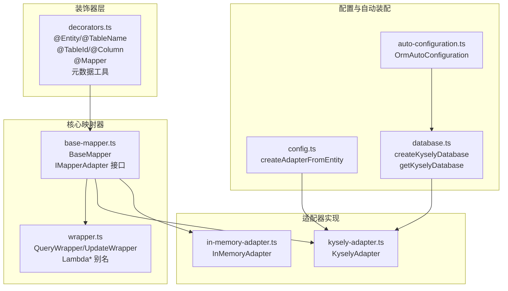
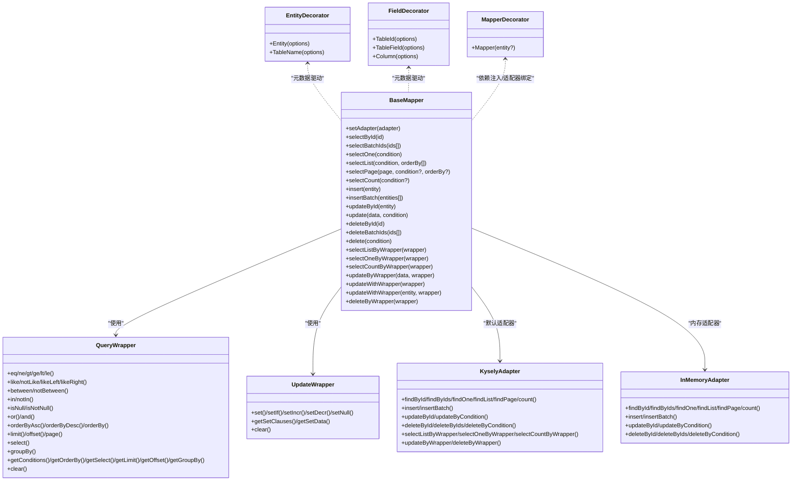
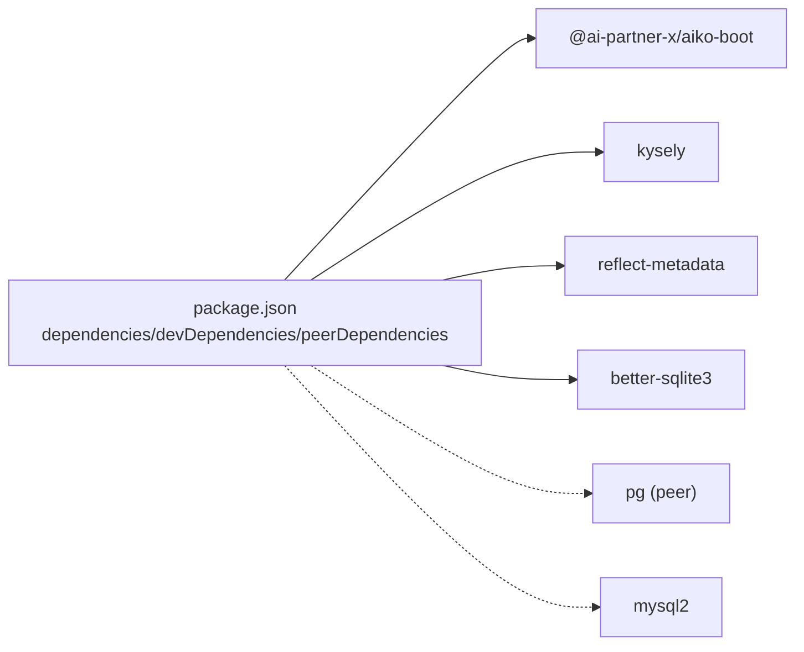
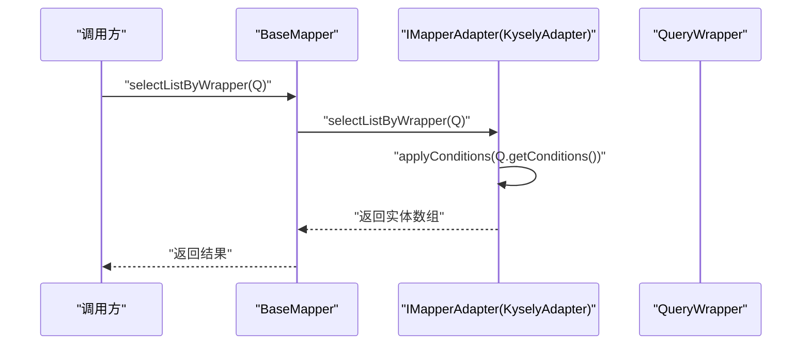

# ORM 启动器 API

<cite>
**本文引用的文件**
- [packages/aiko-boot-starter-orm/src/decorators.ts](file://packages/aiko-boot-starter-orm/src/decorators.ts)
- [packages/aiko-boot-starter-orm/src/base-mapper.ts](file://packages/aiko-boot-starter-orm/src/base-mapper.ts)
- [packages/aiko-boot-starter-orm/src/wrapper.ts](file://packages/aiko-boot-starter-orm/src/wrapper.ts)
- [packages/aiko-boot-starter-orm/src/config.ts](file://packages/aiko-boot-starter-orm/src/config.ts)
- [packages/aiko-boot-starter-orm/src/database.ts](file://packages/aiko-boot-starter-orm/src/database.ts)
- [packages/aiko-boot-starter-orm/src/adapters/kysely-adapter.ts](file://packages/aiko-boot-starter-orm/src/adapters/kysely-adapter.ts)
- [packages/aiko-boot-starter-orm/src/adapters/in-memory-adapter.ts](file://packages/aiko-boot-starter-orm/src/adapters/in-memory-adapter.ts)
- [packages/aiko-boot-starter-orm/src/auto-configuration.ts](file://packages/aiko-boot-starter-orm/src/auto-configuration.ts)
- [packages/aiko-boot-starter-orm/examples/user-crud.ts](file://packages/aiko-boot-starter-orm/examples/user-crud.ts)
- [packages/aiko-boot-starter-orm/examples/test-manual.mjs](file://packages/aiko-boot-starter-orm/examples/test-manual.mjs)
- [packages/aiko-boot-starter-orm/package.json](file://packages/aiko-boot-starter-orm/package.json)
</cite>

## 目录
1. [简介](#简介)
2. [项目结构](#项目结构)
3. [核心组件](#核心组件)
4. [架构总览](#架构总览)
5. [详细组件分析](#详细组件分析)
6. [依赖关系分析](#依赖关系分析)
7. [性能考量](#性能考量)
8. [故障排查指南](#故障排查指南)
9. [结论](#结论)
10. [附录](#附录)

## 简介
本文件为 ORM 启动器 API 的权威参考文档，覆盖以下主题：
- 实体装饰器系统：@Entity、@TableName、@TableId、@TableField、@Column、@Mapper 的完整 API 规范与行为说明
- 基础映射器 BaseMapper 的公共方法与接口定义
- 查询包装器 QueryWrapper 的链式调用 API 与条件构造方法
- 数据库配置、连接池设置与多数据库支持
- 实体映射规则、字段类型转换与关系映射
- 使用示例与最佳实践

## 项目结构
该包位于 packages/aiko-boot-starter-orm，核心源码组织如下：
- 装饰器层：decorators.ts
- 基础映射器：base-mapper.ts
- 条件构造器：wrapper.ts
- 配置与自动装配：config.ts、auto-configuration.ts、database.ts
- 适配器实现：adapters/kysely-adapter.ts、adapters/in-memory-adapter.ts
- 示例：examples/user-crud.ts、examples/test-manual.mjs
- 包配置：package.json

图表来源
- [packages/aiko-boot-starter-orm/src/decorators.ts](file://packages/aiko-boot-starter-orm/src/decorators.ts#L1-L224)
- [packages/aiko-boot-starter-orm/src/base-mapper.ts](file://packages/aiko-boot-starter-orm/src/base-mapper.ts#L1-L384)
- [packages/aiko-boot-starter-orm/src/wrapper.ts](file://packages/aiko-boot-starter-orm/src/wrapper.ts#L1-L476)
- [packages/aiko-boot-starter-orm/src/config.ts](file://packages/aiko-boot-starter-orm/src/config.ts#L1-L77)
- [packages/aiko-boot-starter-orm/src/database.ts](file://packages/aiko-boot-starter-orm/src/database.ts#L1-L134)
- [packages/aiko-boot-starter-orm/src/adapters/kysely-adapter.ts](file://packages/aiko-boot-starter-orm/src/adapters/kysely-adapter.ts#L1-L420)
- [packages/aiko-boot-starter-orm/src/adapters/in-memory-adapter.ts](file://packages/aiko-boot-starter-orm/src/adapters/in-memory-adapter.ts#L1-L174)
- [packages/aiko-boot-starter-orm/src/auto-configuration.ts](file://packages/aiko-boot-starter-orm/src/auto-configuration.ts#L1-L135)

章节来源
- [packages/aiko-boot-starter-orm/src/decorators.ts](file://packages/aiko-boot-starter-orm/src/decorators.ts#L1-L224)
- [packages/aiko-boot-starter-orm/src/base-mapper.ts](file://packages/aiko-boot-starter-orm/src/base-mapper.ts#L1-L384)
- [packages/aiko-boot-starter-orm/src/wrapper.ts](file://packages/aiko-boot-starter-orm/src/wrapper.ts#L1-L476)
- [packages/aiko-boot-starter-orm/src/config.ts](file://packages/aiko-boot-starter-orm/src/config.ts#L1-L77)
- [packages/aiko-boot-starter-orm/src/database.ts](file://packages/aiko-boot-starter-orm/src/database.ts#L1-L134)
- [packages/aiko-boot-starter-orm/src/adapters/kysely-adapter.ts](file://packages/aiko-boot-starter-orm/src/adapters/kysely-adapter.ts#L1-L420)
- [packages/aiko-boot-starter-orm/src/adapters/in-memory-adapter.ts](file://packages/aiko-boot-starter-orm/src/adapters/in-memory-adapter.ts#L1-L174)
- [packages/aiko-boot-starter-orm/src/auto-configuration.ts](file://packages/aiko-boot-starter-orm/src/auto-configuration.ts#L1-L135)

## 核心组件
- 装饰器系统：提供实体、字段、主键与 Mapper 的声明式元数据标注
- BaseMapper：提供 CRUD 与分页、统计、Wrapper 查询/更新/删除等 API
- QueryWrapper/UpdateWrapper：链式条件构造器，支持比较、范围、模糊、NULL、OR/AND 组合、排序、分页、选择字段、聚合
- 适配器：KyselyAdapter（PostgreSQL/SQLite/MySQL）、InMemoryAdapter（内存）
- 配置与自动装配：数据库连接工厂、自动配置、适配器创建

章节来源
- [packages/aiko-boot-starter-orm/src/decorators.ts](file://packages/aiko-boot-starter-orm/src/decorators.ts#L65-L193)
- [packages/aiko-boot-starter-orm/src/base-mapper.ts](file://packages/aiko-boot-starter-orm/src/base-mapper.ts#L39-L383)
- [packages/aiko-boot-starter-orm/src/wrapper.ts](file://packages/aiko-boot-starter-orm/src/wrapper.ts#L49-L476)
- [packages/aiko-boot-starter-orm/src/adapters/kysely-adapter.ts](file://packages/aiko-boot-starter-orm/src/adapters/kysely-adapter.ts#L24-L419)
- [packages/aiko-boot-starter-orm/src/adapters/in-memory-adapter.ts](file://packages/aiko-boot-starter-orm/src/adapters/in-memory-adapter.ts#L9-L173)
- [packages/aiko-boot-starter-orm/src/config.ts](file://packages/aiko-boot-starter-orm/src/config.ts#L42-L76)
- [packages/aiko-boot-starter-orm/src/database.ts](file://packages/aiko-boot-starter-orm/src/database.ts#L47-L133)
- [packages/aiko-boot-starter-orm/src/auto-configuration.ts](file://packages/aiko-boot-starter-orm/src/auto-configuration.ts#L61-L134)

## 架构总览
ORM 启动器采用“装饰器 + 映射器 + 适配器”的分层设计：
- 装饰器层负责在编译期或运行期收集实体元数据
- BaseMapper 作为统一入口，屏蔽不同适配器差异
- 适配器将通用 API 转换为具体数据库方言（Kysely 支持 PostgreSQL/SQLite/MySQL）
- 自动装配根据配置文件创建数据库连接与适配器

图表来源
- [packages/aiko-boot-starter-orm/src/decorators.ts](file://packages/aiko-boot-starter-orm/src/decorators.ts#L65-L193)
- [packages/aiko-boot-starter-orm/src/base-mapper.ts](file://packages/aiko-boot-starter-orm/src/base-mapper.ts#L55-L352)
- [packages/aiko-boot-starter-orm/src/wrapper.ts](file://packages/aiko-boot-starter-orm/src/wrapper.ts#L49-L476)
- [packages/aiko-boot-starter-orm/src/adapters/kysely-adapter.ts](file://packages/aiko-boot-starter-orm/src/adapters/kysely-adapter.ts#L24-L419)
- [packages/aiko-boot-starter-orm/src/adapters/in-memory-adapter.ts](file://packages/aiko-boot-starter-orm/src/adapters/in-memory-adapter.ts#L9-L173)

## 详细组件分析

### 装饰器系统 API 规范
- @Entity(EntityOptions) 与 @TableName(EntityOptions)
  - 作用：标记实体类，解析表名、Schema、描述等
  - 默认表名规则：若未提供 table/tableName，则使用类名小写加复数形式
  - 元数据键：aiko-boot:entity
- @TableId(TableIdOptions)
  - 作用：标记主键字段
  - 主键类型：AUTO、INPUT、ASSIGN_ID、ASSIGN_UUID（默认 AUTO）
  - 元数据键：aiko-boot:tableId
- @TableField(TableFieldOptions) 与 @Column(TableFieldOptions)
  - 作用：标记普通字段
  - 列名映射：未显式指定则与属性名相同
  - 选项：exist（是否存在于数据库）、fill（INSERT/UPDATE/INSERT_UPDATE）、select（是否参与查询）、jdbcType（JDBC 类型）
  - 元数据键：aiko-boot:tableField
- @Mapper(MapperOptions)
  - 作用：标记 Mapper 类，自动注入依赖、注册为单例，并在数据库初始化后尝试自动设置适配器
  - 自动设置适配器：基于实体类元数据创建 KyselyAdapter
  - 元数据键：aiko-boot:mapper

元数据辅助函数：
- getEntityMetadata(target)
- getTableIdMetadata(target)
- getTableFieldMetadata(target)
- getMapperMetadata(target)

章节来源
- [packages/aiko-boot-starter-orm/src/decorators.ts](file://packages/aiko-boot-starter-orm/src/decorators.ts#L23-L61)
- [packages/aiko-boot-starter-orm/src/decorators.ts](file://packages/aiko-boot-starter-orm/src/decorators.ts#L65-L193)
- [packages/aiko-boot-starter-orm/src/decorators.ts](file://packages/aiko-boot-starter-orm/src/decorators.ts#L197-L224)

### 基础映射器 BaseMapper API
- 适配器管理
  - setAdapter(adapter: IMapperAdapter<T>): void
  - protected getAdapter(): IMapperAdapter<T>
- 查询操作
  - selectById(id: number|string): Promise<T|null>
  - selectBatchIds(ids: (number|string)[]): Promise<T[]>
  - selectOne(condition: Partial<T>): Promise<T|null>
  - selectList(condition?: Partial<T>, orderBy?: OrderBy[]): Promise<T[]>
  - selectPage(page: PageParams, condition?: Partial<T>, orderBy?: OrderBy[]): Promise<PageResult<T>>
  - selectCount(condition?: Partial<T>): Promise<number>
- 插入操作
  - insert(entity: Omit<T,'id'> & {id?: number|string}): Promise<number>
  - insertBatch(entities: (Omit<T,'id'> & {id?: number|string})[]): Promise<number>
- 更新操作
  - updateById(entity: T): Promise<number>
  - update(data: Partial<T>, condition: Partial<T>): Promise<number>
- 删除操作
  - deleteById(id: number|string): Promise<number>
  - deleteBatchIds(ids: (number|string)[]): Promise<number>
  - delete(condition: Partial<T>): Promise<number>
- Wrapper 查询/更新/删除
  - selectListByWrapper(wrapper: QueryWrapper<T>): Promise<T[]>
  - selectOneByWrapper(wrapper: QueryWrapper<T>): Promise<T|null>
  - selectCountByWrapper(wrapper: QueryWrapper<T>): Promise<number>
  - updateByWrapper(data: Partial<T>, wrapper: QueryWrapper<T>): Promise<number>
  - updateWithWrapper(wrapper: UpdateWrapper<T>): Promise<number>
  - updateWithWrapper(entity: T|null, wrapper: UpdateWrapper<T>): Promise<number>
  - deleteByWrapper(wrapper: QueryWrapper<T>): Promise<number>

IMapperAdapter 接口（适配器需实现）：
- 查询：findById/findByIds/findOne/findList/findPage/count
- 插入：insert/insertBatch
- 更新：updateById/updateByCondition
- 删除：deleteById/deleteByIds/deleteByCondition
- Wrapper 查询/更新/删除（可选）：selectListByWrapper/selectOneByWrapper/selectCountByWrapper/updateByWrapper/deleteByWrapper

章节来源
- [packages/aiko-boot-starter-orm/src/base-mapper.ts](file://packages/aiko-boot-starter-orm/src/base-mapper.ts#L55-L352)
- [packages/aiko-boot-starter-orm/src/base-mapper.ts](file://packages/aiko-boot-starter-orm/src/base-mapper.ts#L362-L383)

### 查询包装器 QueryWrapper 与 UpdateWrapper API
- QueryWrapper<T>
  - 比较条件：eq/ne/gt/ge/lt/le
  - 模糊查询：like/notLike/likeLeft/likeRight
  - 范围查询：between/notBetween
  - 集合查询：in/notIn
  - NULL 判断：isNull/isNotNull
  - 逻辑组合：or(cb)/and(cb)
  - 排序：orderByAsc/orderByDesc/orderBy
  - 分页：limit/offset/page
  - 字段选择：select
  - 聚合：groupBy
  - 结果访问：getConditions/getOrderBy/getSelect/getLimit/getOffset/getGroupBy/clear
- UpdateWrapper<T>
  - set()/setIf()/setIncr()/setDecr()/setNull()
  - getSetClauses()/getSetData()/clear()

章节来源
- [packages/aiko-boot-starter-orm/src/wrapper.ts](file://packages/aiko-boot-starter-orm/src/wrapper.ts#L49-L476)

### 数据库配置、连接池与多数据库支持
- 支持数据库类型：postgres、sqlite、mysql
- 连接配置：
  - PostgreSQL：host、port、user、password、database
  - SQLite：filename（支持内存模式 ":memory:"）
  - MySQL：host、port、user、password、database
- 连接工厂：
  - createKyselyDatabase(config): Promise<Kysely<any>>
  - getKyselyDatabase(): Kysely<any>
  - getKyselyDatabaseConfig(): DatabaseConnectionConfig
  - closeKyselyDatabase(): Promise<void>
  - isDatabaseInitialized(): boolean
- 自动装配：
  - OrmAutoConfiguration：根据配置文件自动初始化数据库连接与关闭
  - 配置项：database.type、database.filename、database.host、database.port、database.user、database.password、database.database

章节来源
- [packages/aiko-boot-starter-orm/src/database.ts](file://packages/aiko-boot-starter-orm/src/database.ts#L11-L133)
- [packages/aiko-boot-starter-orm/src/auto-configuration.ts](file://packages/aiko-boot-starter-orm/src/auto-configuration.ts#L34-L134)

### 实体映射规则、字段类型转换与关系映射
- 表名解析：优先使用 @Entity 的 table/tableName，否则按默认规则生成
- 字段映射：@TableField/@TableId 的 column 与属性名不一致时建立映射；适配器内部进行 TS 字段名与数据库列名双向转换
- 类型转换：适配器在实体与行之间转换时，依据字段映射进行键名转换
- 关系映射：当前版本专注于单表映射，未提供实体关联关系的装饰器；复杂关系建议通过原生 SQL 或自定义适配器扩展

章节来源
- [packages/aiko-boot-starter-orm/src/config.ts](file://packages/aiko-boot-starter-orm/src/config.ts#L42-L76)
- [packages/aiko-boot-starter-orm/src/adapters/kysely-adapter.ts](file://packages/aiko-boot-starter-orm/src/adapters/kysely-adapter.ts#L41-L65)

### 使用示例与最佳实践
- 示例一：完整 CRUD 与分页、统计、条件查询
  - 参考：examples/user-crud.ts
- 示例二：手动装饰器语法与内存适配器
  - 参考：examples/test-manual.mjs
- 最佳实践：
  - 使用 @Entity/@TableId/@TableField 明确表与字段映射
  - 优先使用 Wrapper 进行复杂查询，提升可维护性
  - 在生产环境使用 KyselyAdapter 并配置合适的连接池
  - 使用分页查询处理大数据集
  - 对需要非数据库字段的场景，使用 exist:false 或在实体外补充 DTO

章节来源
- [packages/aiko-boot-starter-orm/examples/user-crud.ts](file://packages/aiko-boot-starter-orm/examples/user-crud.ts#L1-L155)
- [packages/aiko-boot-starter-orm/examples/test-manual.mjs](file://packages/aiko-boot-starter-orm/examples/test-manual.mjs#L1-L87)

## 依赖关系分析
- 运行时依赖
  - @ai-partner-x/aiko-boot：DI、自动装配注解
  - kysely：SQL 查询构建与数据库方言支持
  - reflect-metadata：装饰器元数据反射
  - better-sqlite3：SQLite 驱动
  - pg/mysql2：PostgreSQL/MySQL 驱动（可选 peer）

图表来源
- [packages/aiko-boot-starter-orm/package.json](file://packages/aiko-boot-starter-orm/package.json#L24-L44)

章节来源
- [packages/aiko-boot-starter-orm/package.json](file://packages/aiko-boot-starter-orm/package.json#L1-L55)

## 性能考量
- 分页查询：优先使用 Wrapper 的 limit/offset 或 page，避免一次性加载大量数据
- 条件查询：尽量使用索引列作为条件，减少全表扫描
- 批量操作：使用 insertBatch 与 deleteBatchIds 提升吞吐
- 适配器选择：生产环境使用 KyselyAdapter 并确保数据库连接池参数合理
- 内存适配器：仅用于测试与开发，不适合生产

## 故障排查指南
- 适配器未设置
  - 现象：调用 BaseMapper 方法抛出“适配器未设置”异常
  - 处理：通过 @Mapper 装饰器或手动 setAdapter 注入适配器
- 数据库未初始化
  - 现象：createAdapterFromEntity 抛出“数据库未初始化”异常
  - 处理：先调用 createKyselyDatabase 初始化数据库
- Wrapper 功能不可用
  - 现象：某些适配器不支持 Wrapper 查询/更新/删除
  - 处理：检查适配器是否实现对应方法；或回退到普通查询
- 字段映射不生效
  - 现象：实体字段与数据库列名不一致导致查询异常
  - 处理：使用 @TableField/@TableId 的 column 指定正确列名

章节来源
- [packages/aiko-boot-starter-orm/src/base-mapper.ts](file://packages/aiko-boot-starter-orm/src/base-mapper.ts#L61-L73)
- [packages/aiko-boot-starter-orm/src/config.ts](file://packages/aiko-boot-starter-orm/src/config.ts#L42-L47)
- [packages/aiko-boot-starter-orm/src/adapters/kysely-adapter.ts](file://packages/aiko-boot-starter-orm/src/adapters/kysely-adapter.ts#L177-L244)

## 结论
本 ORM 启动器以装饰器驱动、适配器抽象为核心，提供与 MyBatis-Plus 风格一致的 API，覆盖实体映射、CRUD、分页、统计与条件构造等常用能力。通过 KyselyAdapter 支持多数据库，结合自动装配与元数据工具，开发者可快速搭建稳定的数据访问层。

## 附录

### 调用序列示例：Wrapper 查询流程

图表来源
- [packages/aiko-boot-starter-orm/src/base-mapper.ts](file://packages/aiko-boot-starter-orm/src/base-mapper.ts#L222-L230)
- [packages/aiko-boot-starter-orm/src/adapters/kysely-adapter.ts](file://packages/aiko-boot-starter-orm/src/adapters/kysely-adapter.ts#L177-L200)