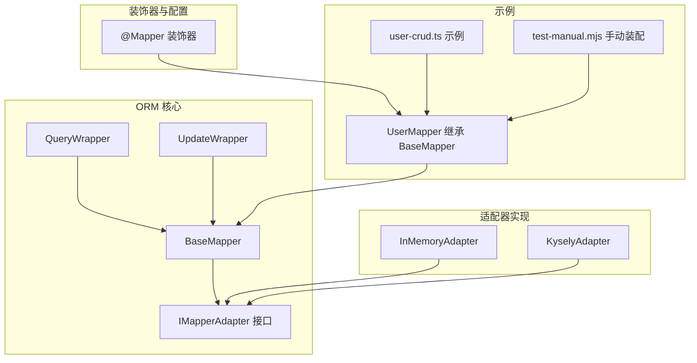
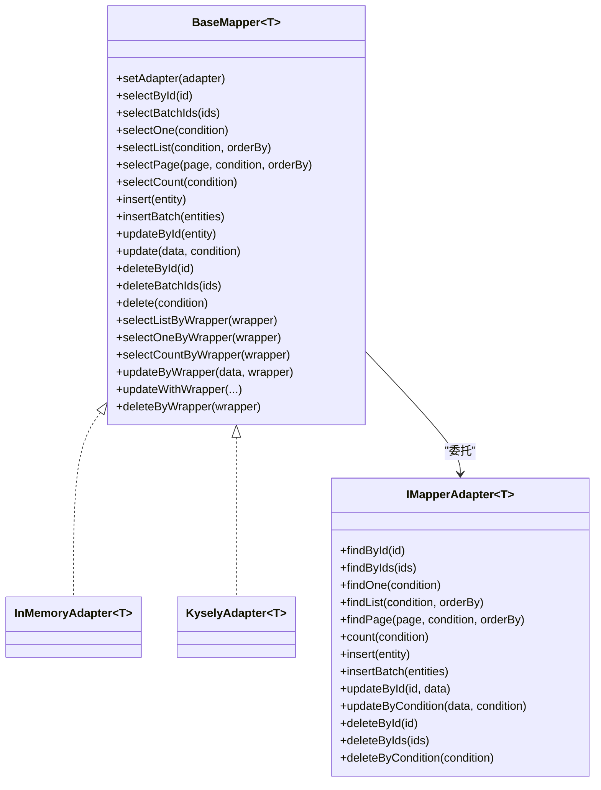
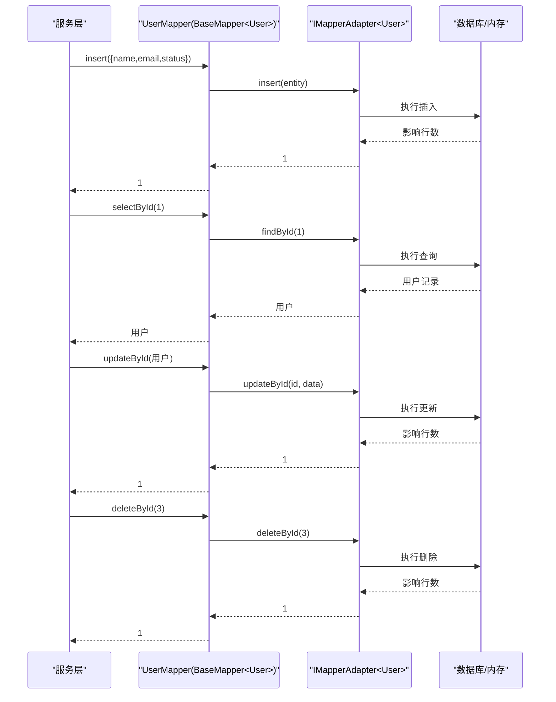
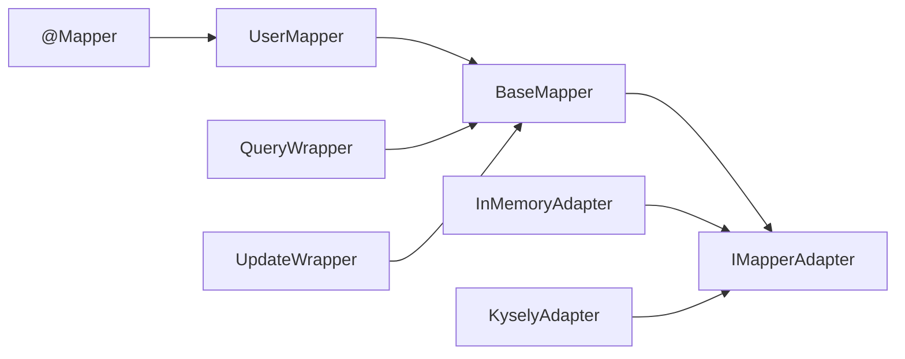

# 基础映射器 API

<cite>
**本文引用的文件**
- [packages/aiko-boot-starter-orm/src/base-mapper.ts](file://packages/aiko-boot-starter-orm/src/base-mapper.ts)
- [packages/aiko-boot-starter-orm/src/decorators.ts](file://packages/aiko-boot-starter-orm/src/decorators.ts)
- [packages/aiko-boot-starter-orm/src/wrapper.ts](file://packages/aiko-boot-starter-orm/src/wrapper.ts)
- [packages/aiko-boot-starter-orm/src/adapters/in-memory-adapter.ts](file://packages/aiko-boot-starter-orm/src/adapters/in-memory-adapter.ts)
- [packages/aiko-boot-starter-orm/src/adapters/kysely-adapter.ts](file://packages/aiko-boot-starter-orm/src/adapters/kysely-adapter.ts)
- [app/examples/user-crud/packages/api/src/mapper/user.mapper.ts](file://app/examples/user-crud/packages/api/src/mapper/user.mapper.ts)
- [packages/aiko-boot-starter-orm/examples/test-manual.mjs](file://packages/aiko-boot-starter-orm/examples/test-manual.mjs)
- [packages/aiko-boot-starter-orm/examples/user-crud.ts](file://packages/aiko-boot-starter-orm/examples/user-crud.ts)
</cite>

## 目录
1. [简介](#简介)
2. [项目结构](#项目结构)
3. [核心组件](#核心组件)
4. [架构总览](#架构总览)
5. [详细组件分析](#详细组件分析)
6. [依赖关系分析](#依赖关系分析)
7. [性能考虑](#性能考虑)
8. [故障排查指南](#故障排查指南)
9. [结论](#结论)
10. [附录](#附录)

## 简介
本文件为基础映射器 BaseMapper 的全面 API 参考文档，面向希望使用 MyBatis-Plus 风格的类型安全 ORM 访问层的开发者。BaseMapper 提供标准 CRUD 操作，并通过适配器模式对接不同数据库实现（如内存适配器、Kysely 适配器）。文档涵盖：
- 泛型类型参数与类型安全
- 所有公共方法的签名、行为与异常处理
- 继承 BaseMapper 的自定义 Mapper 实现示例
- 方法链式调用、批量操作与事务处理最佳实践
- 与数据库适配器的集成方式与性能优化建议

## 项目结构
围绕 BaseMapper 的相关模块组织如下：
- base-mapper.ts：定义 BaseMapper 抽象类、适配器接口、分页与查询类型
- wrapper.ts：提供 QueryWrapper、UpdateWrapper 等链式条件构造器
- adapters/*：适配器实现（内存适配器、Kysely 适配器）
- decorators.ts：@Mapper 等装饰器，负责依赖注入与适配器自动装配
- 示例：user-crud 示例展示实体与 Mapper 的使用；manual 测试脚本展示手动装配流程

图表来源
- [packages/aiko-boot-starter-orm/src/base-mapper.ts](file://packages/aiko-boot-starter-orm/src/base-mapper.ts#L39-L383)
- [packages/aiko-boot-starter-orm/src/wrapper.ts](file://packages/aiko-boot-starter-orm/src/wrapper.ts#L49-L476)
- [packages/aiko-boot-starter-orm/src/adapters/in-memory-adapter.ts](file://packages/aiko-boot-starter-orm/src/adapters/in-memory-adapter.ts#L9-L174)
- [packages/aiko-boot-starter-orm/src/adapters/kysely-adapter.ts](file://packages/aiko-boot-starter-orm/src/adapters/kysely-adapter.ts#L24-L420)
- [packages/aiko-boot-starter-orm/src/decorators.ts](file://packages/aiko-boot-starter-orm/src/decorators.ts#L140-L193)
- [app/examples/user-crud/packages/api/src/mapper/user.mapper.ts](file://app/examples/user-crud/packages/api/src/mapper/user.mapper.ts#L5-L16)
- [packages/aiko-boot-starter-orm/examples/user-crud.ts](file://packages/aiko-boot-starter-orm/examples/user-crud.ts#L65-L66)
- [packages/aiko-boot-starter-orm/examples/test-manual.mjs](file://packages/aiko-boot-starter-orm/examples/test-manual.mjs#L25-L40)

章节来源
- [packages/aiko-boot-starter-orm/src/base-mapper.ts](file://packages/aiko-boot-starter-orm/src/base-mapper.ts#L1-L384)
- [packages/aiko-boot-starter-orm/src/wrapper.ts](file://packages/aiko-boot-starter-orm/src/wrapper.ts#L1-L476)
- [packages/aiko-boot-starter-orm/src/adapters/in-memory-adapter.ts](file://packages/aiko-boot-starter-orm/src/adapters/in-memory-adapter.ts#L1-L174)
- [packages/aiko-boot-starter-orm/src/adapters/kysely-adapter.ts](file://packages/aiko-boot-starter-orm/src/adapters/kysely-adapter.ts#L1-L420)
- [packages/aiko-boot-starter-orm/src/decorators.ts](file://packages/aiko-boot-starter-orm/src/decorators.ts#L1-L224)
- [app/examples/user-crud/packages/api/src/mapper/user.mapper.ts](file://app/examples/user-crud/packages/api/src/mapper/user.mapper.ts#L1-L17)
- [packages/aiko-boot-starter-orm/examples/test-manual.mjs](file://packages/aiko-boot-starter-orm/examples/test-manual.mjs#L1-L87)
- [packages/aiko-boot-starter-orm/examples/user-crud.ts](file://packages/aiko-boot-starter-orm/examples/user-crud.ts#L1-L154)

## 核心组件
- BaseMapper<T>：提供标准 CRUD 与分页查询能力，内部委托给 IMapperAdapter<T> 执行具体数据库操作。
- IMapperAdapter<T>：适配器接口，定义 findById/findList/count/insert/update/delete 等方法。
- QueryWrapper<T>/UpdateWrapper<T>：链式条件构造器，支持比较、范围、模糊、NULL 判定、OR/AND 组合、排序、分页、SET 字段等。
- @Mapper 装饰器：自动注册到 DI 容器并尝试自动注入适配器。

章节来源
- [packages/aiko-boot-starter-orm/src/base-mapper.ts](file://packages/aiko-boot-starter-orm/src/base-mapper.ts#L39-L383)
- [packages/aiko-boot-starter-orm/src/wrapper.ts](file://packages/aiko-boot-starter-orm/src/wrapper.ts#L49-L476)
- [packages/aiko-boot-starter-orm/src/decorators.ts](file://packages/aiko-boot-starter-orm/src/decorators.ts#L140-L193)

## 架构总览
BaseMapper 通过适配器模式解耦业务与数据库实现，支持多数据库后端（内存/真实数据库）。装饰器负责生命周期管理与依赖注入。

图表来源
- [packages/aiko-boot-starter-orm/src/base-mapper.ts](file://packages/aiko-boot-starter-orm/src/base-mapper.ts#L39-L383)
- [packages/aiko-boot-starter-orm/src/adapters/in-memory-adapter.ts](file://packages/aiko-boot-starter-orm/src/adapters/in-memory-adapter.ts#L9-L174)
- [packages/aiko-boot-starter-orm/src/adapters/kysely-adapter.ts](file://packages/aiko-boot-starter-orm/src/adapters/kysely-adapter.ts#L24-L420)

## 详细组件分析

### BaseMapper<T> API 参考
- 泛型约束与类型安全
  - T 限制为包含可选 id 字段的对象，id 类型为 number|string，确保 updateById/deleteById 等方法的类型安全。
  - 插入参数使用 Omit<T,'id'> & {id?: number|string}，避免在插入时强制传入 id。
  - 查询条件使用 Partial<T>，支持按实体字段的任意组合进行过滤。
- 适配器管理
  - setAdapter(adapter)：显式设置适配器。
  - protected getAdapter()：若未设置则抛出错误，防止误用。

章节来源
- [packages/aiko-boot-starter-orm/src/base-mapper.ts](file://packages/aiko-boot-starter-orm/src/base-mapper.ts#L55-L73)
- [packages/aiko-boot-starter-orm/src/base-mapper.ts](file://packages/aiko-boot-starter-orm/src/base-mapper.ts#L139-L151)

#### 查询操作
- selectById(id: number|string): Promise<T|null>
  - 返回单条记录或 null。
  - 异常：适配器未设置时抛错。
- selectBatchIds(ids: (number|string)[]): Promise<T[]>
  - 批量 ID 查询。
- selectOne(condition: QueryCondition<T>): Promise<T|null>
  - 单条匹配记录。
- selectList(condition?: QueryCondition<T>, orderBy?: OrderBy[]): Promise<T[]>
  - 列表查询，支持排序。
- selectPage(page: PageParams, condition?: QueryCondition<T>, orderBy?: OrderBy[]): Promise<PageResult<T>>
  - 分页查询，返回 records/total/pageNo/pageSize/totalPages。
- selectCount(condition?: QueryCondition<T>): Promise<number>
  - 统计满足条件的记录数。

章节来源
- [packages/aiko-boot-starter-orm/src/base-mapper.ts](file://packages/aiko-boot-starter-orm/src/base-mapper.ts#L82-L129)

#### 插入操作
- insert(entity: Omit<T,'id'> & {id?: number|string}): Promise<number>
  - 返回受影响行数（通常为 1）。
- insertBatch(entities: (Omit<T,'id'> & {id?: number|string})[]): Promise<number>
  - 批量插入，返回总受影响行数。

章节来源
- [packages/aiko-boot-starter-orm/src/base-mapper.ts](file://packages/aiko-boot-starter-orm/src/base-mapper.ts#L139-L151)

#### 更新操作
- updateById(entity: T): Promise<number>
  - 要求 entity.id 存在，否则抛错。
- update(data: Partial<T>, condition: QueryCondition<T>): Promise<number>
  - 按条件批量更新。

章节来源
- [packages/aiko-boot-starter-orm/src/base-mapper.ts](file://packages/aiko-boot-starter-orm/src/base-mapper.ts#L161-L175)

#### 删除操作
- deleteById(id: number|string): Promise<number>
- deleteBatchIds(ids: (number|string)[]): Promise<number>
- delete(condition: QueryCondition<T>): Promise<number>

章节来源
- [packages/aiko-boot-starter-orm/src/base-mapper.ts](file://packages/aiko-boot-starter-orm/src/base-mapper.ts#L185-L205)

#### Wrapper 查询与更新（MyBatis-Plus 风格）
- selectListByWrapper(wrapper: QueryWrapper<T>): Promise<T[]>
  - 若适配器不支持，则回退到普通查询（警告日志）。
- selectOneByWrapper(wrapper: QueryWrapper<T>): Promise<T|null>
  - 通过 limit(1) 回退实现。
- selectCountByWrapper(wrapper: QueryWrapper<T>): Promise<number>
  - 通过 selectListByWrapper 计算长度。
- updateByWrapper(data: Partial<T>, wrapper: QueryWrapper<T>): Promise<number>
  - 适配器需实现对应方法，否则抛错。
- updateWithWrapper(wrapper: UpdateWrapper<T>): Promise<number>
  - 仅使用 UpdateWrapper 的 set 条件。
- updateWithWrapper(entity: T|null, wrapper: UpdateWrapper<T>): Promise<number>
  - 合并 entity 与 wrapper.set 的数据后执行。
- deleteByWrapper(wrapper: QueryWrapper<T>): Promise<number>
  - 适配器需实现对应方法，否则抛错。

章节来源
- [packages/aiko-boot-starter-orm/src/base-mapper.ts](file://packages/aiko-boot-starter-orm/src/base-mapper.ts#L222-L351)

### 类型定义与复杂度
- PageParams/PageResult：分页参数与结果结构。
- QueryCondition<T>：Partial<T>，支持任意字段组合过滤。
- OrderBy：字段与排序方向（asc/desc）。
- Wrapper 条件结构：Condition[]，支持 compare/between/in/null/or/and/nested 等类型。

章节来源
- [packages/aiko-boot-starter-orm/src/base-mapper.ts](file://packages/aiko-boot-starter-orm/src/base-mapper.ts#L14-L35)
- [packages/aiko-boot-starter-orm/src/wrapper.ts](file://packages/aiko-boot-starter-orm/src/wrapper.ts#L28-L40)

### 继承 BaseMapper 的自定义 Mapper 示例
- 继承 BaseMapper 并使用 @Mapper 装饰器标记，框架会自动注入适配器（若数据库已初始化）。
- 示例：UserMapper 继承 BaseMapper<User>，并添加基于条件的便捷查询方法（如按用户名/邮箱查询）。

章节来源
- [app/examples/user-crud/packages/api/src/mapper/user.mapper.ts](file://app/examples/user-crud/packages/api/src/mapper/user.mapper.ts#L5-L16)
- [packages/aiko-boot-starter-orm/src/decorators.ts](file://packages/aiko-boot-starter-orm/src/decorators.ts#L140-L193)

### 方法链式调用与批量操作
- 链式调用：QueryWrapper/UpdateWrapper 支持 eq/ne/gt/ge/lt/le/like/notLike/likeLeft/likeRight/between/notBetween/in/notIn/isNull/isNotNull/or/and/orderBy/limit/offset/page/select/groupBy 等。
- 批量操作：insertBatch、deleteBatchIds。
- 事务处理：BaseMapper 不直接管理事务；建议在服务层使用数据库事务包装多个 Mapper 操作，或在适配器层实现事务控制（例如 KyselyAdapter 依赖外部事务上下文）。

章节来源
- [packages/aiko-boot-starter-orm/src/wrapper.ts](file://packages/aiko-boot-starter-orm/src/wrapper.ts#L59-L350)
- [packages/aiko-boot-starter-orm/src/base-mapper.ts](file://packages/aiko-boot-starter-orm/src/base-mapper.ts#L149-L151)
- [packages/aiko-boot-starter-orm/src/base-mapper.ts](file://packages/aiko-boot-starter-orm/src/base-mapper.ts#L194-L196)

### 与数据库适配器的集成
- InMemoryAdapter：内存存储，适合测试与开发，支持排序与分页回退。
- KyselyAdapter：将 Wrapper 条件转换为 Kysely 查询，支持 PostgreSQL/SQLite/MySQL 等。
- 装饰器自动装配：@Mapper 装饰器在实例化时尝试创建适配器并注入。

章节来源
- [packages/aiko-boot-starter-orm/src/adapters/in-memory-adapter.ts](file://packages/aiko-boot-starter-orm/src/adapters/in-memory-adapter.ts#L9-L174)
- [packages/aiko-boot-starter-orm/src/adapters/kysely-adapter.ts](file://packages/aiko-boot-starter-orm/src/adapters/kysely-adapter.ts#L24-L420)
- [packages/aiko-boot-starter-orm/src/decorators.ts](file://packages/aiko-boot-starter-orm/src/decorators.ts#L159-L193)

### API 调用序列示例（插入-查询-更新-删除）

图表来源
- [packages/aiko-boot-starter-orm/src/base-mapper.ts](file://packages/aiko-boot-starter-orm/src/base-mapper.ts#L82-L205)
- [packages/aiko-boot-starter-orm/src/adapters/kysely-adapter.ts](file://packages/aiko-boot-starter-orm/src/adapters/kysely-adapter.ts#L327-L418)
- [packages/aiko-boot-starter-orm/src/adapters/in-memory-adapter.ts](file://packages/aiko-boot-starter-orm/src/adapters/in-memory-adapter.ts#L68-L128)

## 依赖关系分析
- BaseMapper 依赖 IMapperAdapter<T> 接口，通过组合而非继承实现数据库无关性。
- Wrapper 与 BaseMapper 解耦，BaseMapper 通过适配器判断是否支持 Wrapper 查询/更新。
- @Mapper 装饰器负责生命周期与依赖注入，自动设置适配器。

图表来源
- [packages/aiko-boot-starter-orm/src/decorators.ts](file://packages/aiko-boot-starter-orm/src/decorators.ts#L140-L193)
- [packages/aiko-boot-starter-orm/src/base-mapper.ts](file://packages/aiko-boot-starter-orm/src/base-mapper.ts#L39-L383)
- [packages/aiko-boot-starter-orm/src/wrapper.ts](file://packages/aiko-boot-starter-orm/src/wrapper.ts#L49-L476)
- [packages/aiko-boot-starter-orm/src/adapters/in-memory-adapter.ts](file://packages/aiko-boot-starter-orm/src/adapters/in-memory-adapter.ts#L9-L174)
- [packages/aiko-boot-starter-orm/src/adapters/kysely-adapter.ts](file://packages/aiko-boot-starter-orm/src/adapters/kysely-adapter.ts#L24-L420)

章节来源
- [packages/aiko-boot-starter-orm/src/decorators.ts](file://packages/aiko-boot-starter-orm/src/decorators.ts#L140-L193)
- [packages/aiko-boot-starter-orm/src/base-mapper.ts](file://packages/aiko-boot-starter-orm/src/base-mapper.ts#L39-L383)
- [packages/aiko-boot-starter-orm/src/wrapper.ts](file://packages/aiko-boot-starter-orm/src/wrapper.ts#L49-L476)
- [packages/aiko-boot-starter-orm/src/adapters/in-memory-adapter.ts](file://packages/aiko-boot-starter-orm/src/adapters/in-memory-adapter.ts#L9-L174)
- [packages/aiko-boot-starter-orm/src/adapters/kysely-adapter.ts](file://packages/aiko-boot-starter-orm/src/adapters/kysely-adapter.ts#L24-L420)

## 性能考虑
- 分页查询：优先使用 Wrapper 的 limit/offset 或 page，避免一次性加载大量数据。
- 排序与索引：在高基数字段上建立索引，减少排序与过滤成本。
- 批量操作：insertBatch/deleteBatchIds 可显著降低网络往返次数。
- 适配器选择：生产环境推荐 KyselyAdapter 并结合连接池与只读副本。
- 缓存策略：对热点查询结果进行缓存（如 Redis），减少数据库压力。
- 日志与监控：开启慢查询日志与执行计划分析，定位性能瓶颈。

## 故障排查指南
- 适配器未设置
  - 现象：调用任何方法抛出“适配器未设置”错误。
  - 处理：使用 @Mapper 装饰器或手动 setAdapter(...) 注入适配器。
- Wrapper 方法不可用
  - 现象：调用 selectListByWrapper/selectCountByWrapper/updateByWrapper/deleteByWrapper 抛错。
  - 处理：确认适配器实现是否支持相应方法；否则回退到普通查询或自行实现。
- updateById 缺少 id
  - 现象：抛出“实体必须包含 id”错误。
  - 处理：确保传入实体包含 id 字段。
- Wrapper 回退警告
  - 现象：日志出现“适配器不支持 QueryWrapper，回退到简单查询”的警告。
  - 处理：为适配器实现对应方法，或简化条件为普通查询。

章节来源
- [packages/aiko-boot-starter-orm/src/base-mapper.ts](file://packages/aiko-boot-starter-orm/src/base-mapper.ts#L68-L73)
- [packages/aiko-boot-starter-orm/src/base-mapper.ts](file://packages/aiko-boot-starter-orm/src/base-mapper.ts#L222-L230)
- [packages/aiko-boot-starter-orm/src/base-mapper.ts](file://packages/aiko-boot-starter-orm/src/base-mapper.ts#L162-L166)
- [packages/aiko-boot-starter-orm/src/base-mapper.ts](file://packages/aiko-boot-starter-orm/src/base-mapper.ts#L281-L287)

## 结论
BaseMapper 提供了与 MyBatis-Plus 风格一致的类型安全访问层抽象，配合装饰器与适配器模式，既能在开发阶段快速迭代，也能在生产环境灵活切换数据库实现。遵循本文的 API 使用规范、链式条件构造与批量操作实践，以及性能优化建议，可有效提升开发效率与系统稳定性。

## 附录

### 常见用法示例路径
- 手动装配示例（无装饰器语法）
  - [packages/aiko-boot-starter-orm/examples/test-manual.mjs](file://packages/aiko-boot-starter-orm/examples/test-manual.mjs#L25-L87)
- 装饰器驱动示例（实体+Mapper）
  - [packages/aiko-boot-starter-orm/examples/user-crud.ts](file://packages/aiko-boot-starter-orm/examples/user-crud.ts#L34-L66)
  - [app/examples/user-crud/packages/api/src/mapper/user.mapper.ts](file://app/examples/user-crud/packages/api/src/mapper/user.mapper.ts#L5-L16)

### Wrapper 使用要点
- QueryWrapper：支持 eq/ne/gt/ge/lt/le/like/notLike/likeLeft/likeRight/between/notBetween/in/notIn/isNull/isNotNull/or/and/orderBy/limit/offset/page/select/groupBy。
- UpdateWrapper：在 QueryWrapper 基础上增加 set/setIf/setIncr/setDecr/setNull，并提供 getSetData 合并数据。

章节来源
- [packages/aiko-boot-starter-orm/src/wrapper.ts](file://packages/aiko-boot-starter-orm/src/wrapper.ts#L59-L476)