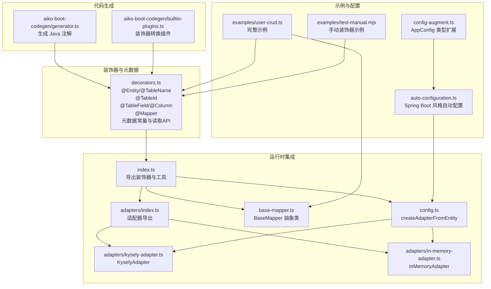
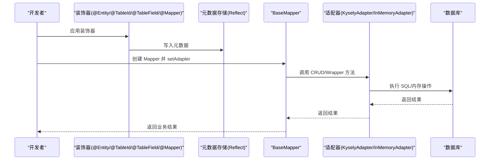
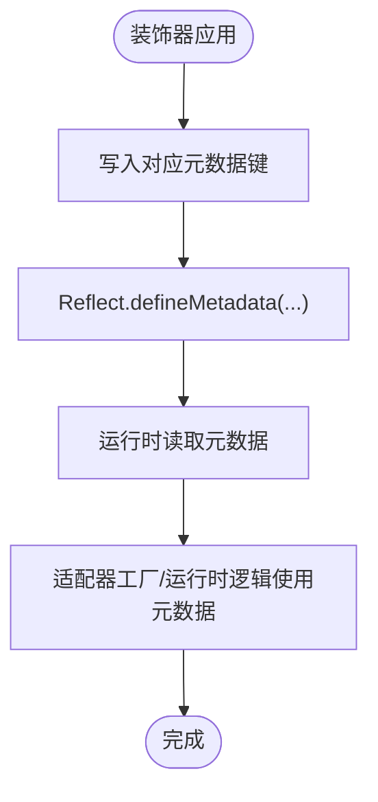
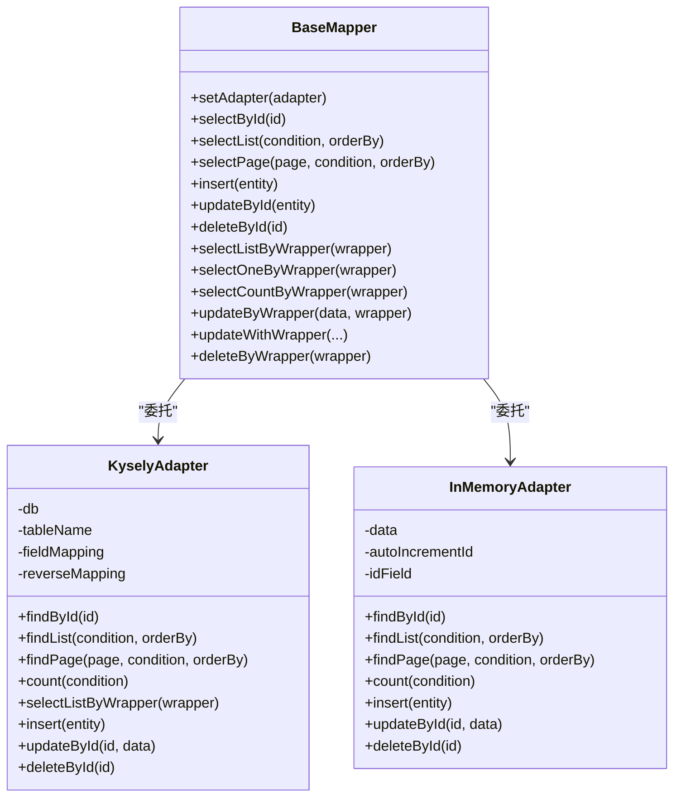
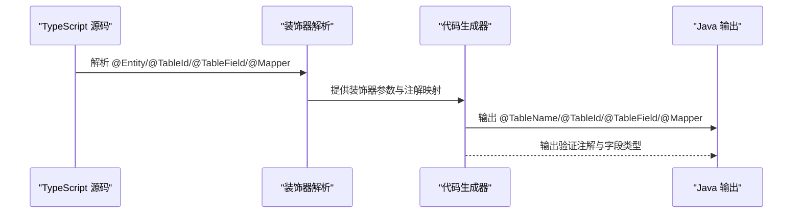
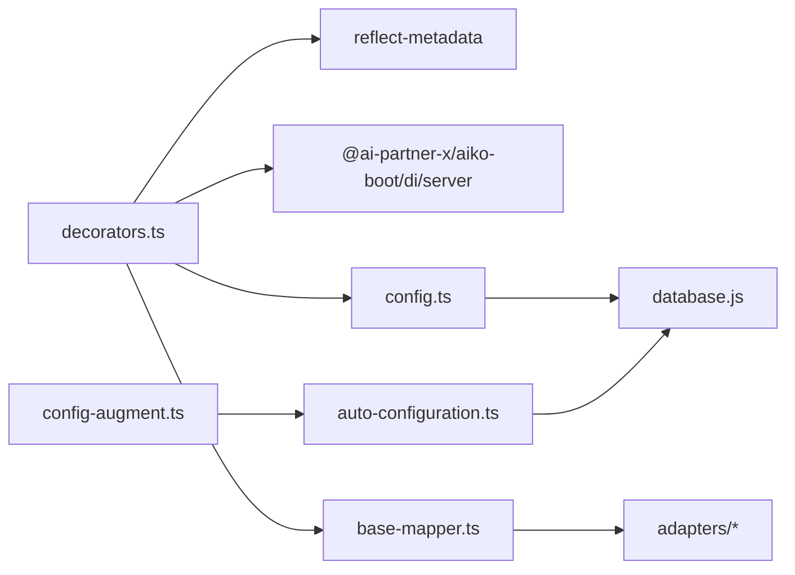

# 实体装饰器 API

<cite>
**本文档引用的文件**
- [packages/aiko-boot-starter-orm/src/decorators.ts](file://packages/aiko-boot-starter-orm/src/decorators.ts)
- [packages/aiko-boot-starter-orm/src/index.ts](file://packages/aiko-boot-starter-orm/src/index.ts)
- [packages/aiko-boot-starter-orm/src/config.ts](file://packages/aiko-boot-starter-orm/src/config.ts)
- [packages/aiko-boot-starter-orm/src/base-mapper.ts](file://packages/aiko-boot-starter-orm/src/base-mapper.ts)
- [packages/aiko-boot-starter-orm/src/adapters/index.ts](file://packages/aiko-boot-starter-orm/src/adapters/index.ts)
- [packages/aiko-boot-starter-orm/src/adapters/kysely-adapter.ts](file://packages/aiko-boot-starter-orm/src/adapters/kysely-adapter.ts)
- [packages/aiko-boot-starter-orm/src/adapters/in-memory-adapter.ts](file://packages/aiko-boot-starter-orm/src/adapters/in-memory-adapter.ts)
- [packages/aiko-boot-starter-orm/examples/user-crud.ts](file://packages/aiko-boot-starter-orm/examples/user-crud.ts)
- [packages/aiko-boot-starter-orm/examples/test-manual.mjs](file://packages/aiko-boot-starter-orm/examples/test-manual.mjs)
- [packages/aiko-boot-starter-orm/src/auto-configuration.ts](file://packages/aiko-boot-starter-orm/src/auto-configuration.ts)
- [packages/aiko-boot-starter-orm/src/config-augment.ts](file://packages/aiko-boot-starter-orm/src/config-augment.ts)
- [packages/aiko-boot-codegen/src/generator.ts](file://packages/aiko-boot-codegen/src/generator.ts)
- [packages/aiko-boot-codegen/src/builtin-plugins.ts](file://packages/aiko-boot-codegen/src/builtin-plugins.ts)
</cite>

## 目录
1. [简介](#简介)
2. [项目结构](#项目结构)
3. [核心组件](#核心组件)
4. [架构总览](#架构总览)
5. [详细组件分析](#详细组件分析)
6. [依赖分析](#依赖分析)
7. [性能考虑](#性能考虑)
8. [故障排除指南](#故障排除指南)
9. [结论](#结论)
10. [附录](#附录)

## 简介
本文件为实体装饰器系统的详细 API 参考文档，覆盖以下装饰器与相关类型：
- @Entity 与 @TableName：实体类装饰器，用于声明表名与描述等元信息
- @TableId：主键字段装饰器，支持主键生成策略与列名映射
- @TableField 与 @Column：普通字段装饰器，支持列名、存在性、填充策略与 JDBC 类型等
- @Mapper：Mapper 装饰器，用于标记数据访问层并注入依赖与适配器

文档同时说明：
- 各装饰器的参数选项、使用方法与配置规则
- 元数据存储机制与反射 API
- 运行时行为与与适配器的集成
- 与代码生成器的互操作（TypeScript → Java MyBatis-Plus 注解）
- 最佳实践与常见问题排查

## 项目结构
该功能位于 aiko-boot-starter-orm 包中，核心文件包括：
- 装饰器定义与元数据 API：decorators.ts
- 导出入口：index.ts
- 适配器与数据库集成：adapters/*、config.ts、base-mapper.ts
- 示例与手动测试：examples/*
- 自动配置与类型扩展：auto-configuration.ts、config-augment.ts
- 代码生成器插件与转换逻辑：aiko-boot-codegen/src/*

图表来源
- [packages/aiko-boot-starter-orm/src/decorators.ts](file://packages/aiko-boot-starter-orm/src/decorators.ts#L1-L224)
- [packages/aiko-boot-starter-orm/src/index.ts](file://packages/aiko-boot-starter-orm/src/index.ts#L1-L91)
- [packages/aiko-boot-starter-orm/src/config.ts](file://packages/aiko-boot-starter-orm/src/config.ts#L38-L76)
- [packages/aiko-boot-starter-orm/src/base-mapper.ts](file://packages/aiko-boot-starter-orm/src/base-mapper.ts#L1-L384)
- [packages/aiko-boot-starter-orm/src/adapters/index.ts](file://packages/aiko-boot-starter-orm/src/adapters/index.ts#L1-L3)
- [packages/aiko-boot-starter-orm/src/adapters/kysely-adapter.ts](file://packages/aiko-boot-starter-orm/src/adapters/kysely-adapter.ts#L1-L200)
- [packages/aiko-boot-starter-orm/src/adapters/in-memory-adapter.ts](file://packages/aiko-boot-starter-orm/src/adapters/in-memory-adapter.ts#L1-L174)
- [packages/aiko-boot-starter-orm/examples/user-crud.ts](file://packages/aiko-boot-starter-orm/examples/user-crud.ts#L1-L155)
- [packages/aiko-boot-starter-orm/examples/test-manual.mjs](file://packages/aiko-boot-starter-orm/examples/test-manual.mjs#L1-L27)
- [packages/aiko-boot-starter-orm/src/auto-configuration.ts](file://packages/aiko-boot-starter-orm/src/auto-configuration.ts#L1-L134)
- [packages/aiko-boot-starter-orm/src/config-augment.ts](file://packages/aiko-boot-starter-orm/src/config-augment.ts#L1-L25)
- [packages/aiko-boot-codegen/src/generator.ts](file://packages/aiko-boot-codegen/src/generator.ts#L488-L520)
- [packages/aiko-boot-codegen/src/builtin-plugins.ts](file://packages/aiko-boot-codegen/src/builtin-plugins.ts#L1-L45)

章节来源
- [packages/aiko-boot-starter-orm/src/decorators.ts](file://packages/aiko-boot-starter-orm/src/decorators.ts#L1-L224)
- [packages/aiko-boot-starter-orm/src/index.ts](file://packages/aiko-boot-starter-orm/src/index.ts#L1-L91)

## 核心组件
本节概述装饰器系统的核心组成与职责：
- 装饰器层：定义 @Entity、@TableName、@TableId、@TableField、@Column、@Mapper 及其选项接口
- 元数据层：通过 reflect-metadata 存储与读取装饰器元数据
- 运行时层：BaseMapper 提供 CRUD 与包装器查询；适配器负责具体数据库操作
- 适配器工厂：基于实体元数据自动创建适配器
- 代码生成：将 TypeScript 装饰器转换为 Java MyBatis-Plus 注解

章节来源
- [packages/aiko-boot-starter-orm/src/decorators.ts](file://packages/aiko-boot-starter-orm/src/decorators.ts#L14-L224)
- [packages/aiko-boot-starter-orm/src/base-mapper.ts](file://packages/aiko-boot-starter-orm/src/base-mapper.ts#L39-L384)
- [packages/aiko-boot-starter-orm/src/config.ts](file://packages/aiko-boot-starter-orm/src/config.ts#L38-L76)

## 架构总览
装饰器系统采用“装饰器 + 元数据 + 适配器”的分层架构：
- 装饰器阶段：在编译期或运行期为类与字段添加元数据
- 运行时阶段：通过 BaseMapper 与适配器执行数据库操作
- 适配器工厂：根据实体元数据动态创建适配器
- 代码生成：将 TypeScript 装饰器映射为 Java 注解

图表来源
- [packages/aiko-boot-starter-orm/src/decorators.ts](file://packages/aiko-boot-starter-orm/src/decorators.ts#L68-L193)
- [packages/aiko-boot-starter-orm/src/base-mapper.ts](file://packages/aiko-boot-starter-orm/src/base-mapper.ts#L55-L352)
- [packages/aiko-boot-starter-orm/src/adapters/kysely-adapter.ts](file://packages/aiko-boot-starter-orm/src/adapters/kysely-adapter.ts#L24-L200)
- [packages/aiko-boot-starter-orm/src/adapters/in-memory-adapter.ts](file://packages/aiko-boot-starter-orm/src/adapters/in-memory-adapter.ts#L9-L174)

## 详细组件分析

### 装饰器 API 规范

#### @Entity 与 @TableName
- 作用：标记实体类，声明表名、描述与 Schema 等
- 参数选项（EntityOptions）
  - table?: string：显式表名
  - tableName?: string：表名别名
  - description?: string：实体描述
  - schema?: string：Schema 名称
- 默认行为：若未提供 table 或 tableName，则默认使用类名小写加复数形式作为表名
- 别名：TableName 与 Entity 等价

章节来源
- [packages/aiko-boot-starter-orm/src/decorators.ts](file://packages/aiko-boot-starter-orm/src/decorators.ts#L23-L33)
- [packages/aiko-boot-starter-orm/src/decorators.ts](file://packages/aiko-boot-starter-orm/src/decorators.ts#L68-L80)
- [packages/aiko-boot-starter-orm/src/decorators.ts](file://packages/aiko-boot-starter-orm/src/decorators.ts#L82-L85)

#### @TableId
- 作用：标记实体主键字段
- 参数选项（TableIdOptions）
  - type?: 'AUTO' | 'INPUT' | 'ASSIGN_ID' | 'ASSIGN_UUID'：主键生成策略，默认 AUTO
  - column?: string：数据库列名（未提供时默认与字段名一致）
- 运行时行为：将主键元数据存储于类级元数据中，键为字段名字符串

章节来源
- [packages/aiko-boot-starter-orm/src/decorators.ts](file://packages/aiko-boot-starter-orm/src/decorators.ts#L35-L41)
- [packages/aiko-boot-starter-orm/src/decorators.ts](file://packages/aiko-boot-starter-orm/src/decorators.ts#L92-L105)

#### @TableField 与 @Column
- 作用：标记普通实体字段
- 参数选项（TableFieldOptions）
  - column?: string：数据库列名（未提供时默认与字段名一致）
  - exist?: boolean：是否存在于数据库（可用于非持久化字段）
  - fill?: 'INSERT' | 'UPDATE' | 'INSERT_UPDATE'：字段填充策略（用于自动填充）
  - select?: boolean：是否参与查询（大字段控制）
  - jdbcType?: string：JDBC 类型（用于 Java 生成）
- 别名：Column 与 TableField 等价
- 运行时行为：将字段元数据存储于类级元数据中，键为字段名字符串

章节来源
- [packages/aiko-boot-starter-orm/src/decorators.ts](file://packages/aiko-boot-starter-orm/src/decorators.ts#L43-L55)
- [packages/aiko-boot-starter-orm/src/decorators.ts](file://packages/aiko-boot-starter-orm/src/decorators.ts#L110-L123)
- [packages/aiko-boot-starter-orm/src/decorators.ts](file://packages/aiko-boot-starter-orm/src/decorators.ts#L125-L128)

#### @Mapper
- 作用：标记 Mapper 类，自动注入依赖、注册为单例，并尝试自动设置适配器
- 参数选项（MapperOptions）
  - entity?: Function：关联的实体类
- 运行时行为：
  - 写入 Mapper 元数据（包含 entity、entityName、className）
  - 自动注入构造函数依赖（通过 DI 装饰器）
  - 若数据库已初始化且实例具备 setAdapter 方法，尝试基于实体元数据创建适配器并注入
  - 包装构造函数以保留原类元数据与原型链

章节来源
- [packages/aiko-boot-starter-orm/src/decorators.ts](file://packages/aiko-boot-starter-orm/src/decorators.ts#L57-L61)
- [packages/aiko-boot-starter-orm/src/decorators.ts](file://packages/aiko-boot-starter-orm/src/decorators.ts#L140-L193)

### 元数据存储机制与反射 API
- 元数据键（字符串，便于跨 ESM 模块共享）
  - ENTITY_METADATA：实体元数据
  - TABLE_ID_METADATA：主键字段元数据
  - TABLE_FIELD_METADATA：普通字段元数据
  - MAPPER_METADATA：Mapper 元数据
- 读取 API
  - getEntityMetadata(target: Function)
  - getTableIdMetadata(target: Function)
  - getTableFieldMetadata(target: Function)
  - getMapperMetadata(target: Function)

图表来源
- [packages/aiko-boot-starter-orm/src/decorators.ts](file://packages/aiko-boot-starter-orm/src/decorators.ts#L16-L19)
- [packages/aiko-boot-starter-orm/src/decorators.ts](file://packages/aiko-boot-starter-orm/src/decorators.ts#L200-L223)

章节来源
- [packages/aiko-boot-starter-orm/src/decorators.ts](file://packages/aiko-boot-starter-orm/src/decorators.ts#L14-L224)

### 适配器与运行时行为
- BaseMapper：提供标准 CRUD 与包装器查询方法，内部委托适配器执行
- 适配器工厂：createAdapterFromEntity(entityClass) 基于实体元数据创建适配器
- 适配器实现：
  - KyselyAdapter：基于 Kysely 的数据库适配器，支持字段映射与复杂查询
  - InMemoryAdapter：内存适配器，用于测试与演示

图表来源
- [packages/aiko-boot-starter-orm/src/base-mapper.ts](file://packages/aiko-boot-starter-orm/src/base-mapper.ts#L55-L352)
- [packages/aiko-boot-starter-orm/src/adapters/kysely-adapter.ts](file://packages/aiko-boot-starter-orm/src/adapters/kysely-adapter.ts#L24-L200)
- [packages/aiko-boot-starter-orm/src/adapters/in-memory-adapter.ts](file://packages/aiko-boot-starter-orm/src/adapters/in-memory-adapter.ts#L9-L174)

章节来源
- [packages/aiko-boot-starter-orm/src/base-mapper.ts](file://packages/aiko-boot-starter-orm/src/base-mapper.ts#L39-L384)
- [packages/aiko-boot-starter-orm/src/config.ts](file://packages/aiko-boot-starter-orm/src/config.ts#L38-L76)
- [packages/aiko-boot-starter-orm/src/adapters/index.ts](file://packages/aiko-boot-starter-orm/src/adapters/index.ts#L1-L3)

### 代码生成与互操作（TypeScript → Java MyBatis-Plus）
- 生成器逻辑：遍历实体字段，依据装饰器生成 Java 注解（如 @TableId、@TableField）
- 插件转换：
  - entityPlugin：将 @Entity 转换为 @TableName
  - mapperPlugin：将 @Mapper(User) 转换为 @Mapper()（Java 通过泛型推断实体）

图表来源
- [packages/aiko-boot-codegen/src/generator.ts](file://packages/aiko-boot-codegen/src/generator.ts#L488-L520)
- [packages/aiko-boot-codegen/src/builtin-plugins.ts](file://packages/aiko-boot-codegen/src/builtin-plugins.ts#L13-L26)

章节来源
- [packages/aiko-boot-codegen/src/generator.ts](file://packages/aiko-boot-codegen/src/generator.ts#L488-L520)
- [packages/aiko-boot-codegen/src/builtin-plugins.ts](file://packages/aiko-boot-codegen/src/builtin-plugins.ts#L1-L45)

### 使用示例与最佳实践
- 完整示例：用户实体与 Mapper 的定义与 CRUD 使用
- 手动装饰器示例：不使用装饰器语法的手动应用方式
- 最佳实践：
  - 显式声明表名与列名，避免默认推断导致的歧义
  - 主键字段使用 @TableId 并明确主键策略
  - 非数据库字段使用 exist: false
  - Mapper 使用 @Mapper({ entity: Entity }) 并确保数据库初始化后再实例化
  - 在开发/测试环境使用 InMemoryAdapter，生产环境使用 KyselyAdapter

章节来源
- [packages/aiko-boot-starter-orm/examples/user-crud.ts](file://packages/aiko-boot-starter-orm/examples/user-crud.ts#L21-L155)
- [packages/aiko-boot-starter-orm/examples/test-manual.mjs](file://packages/aiko-boot-starter-orm/examples/test-manual.mjs#L1-L27)

## 依赖分析
- 装饰器依赖 reflect-metadata 进行元数据存储
- Mapper 装饰器依赖 DI 容器（Injectable、Singleton、inject）进行依赖注入
- 适配器工厂依赖数据库初始化状态与适配器创建逻辑
- 自动配置模块扩展 AppConfig 类型并按配置初始化数据库

图表来源
- [packages/aiko-boot-starter-orm/src/decorators.ts](file://packages/aiko-boot-starter-orm/src/decorators.ts#L9-L12)
- [packages/aiko-boot-starter-orm/src/config.ts](file://packages/aiko-boot-starter-orm/src/config.ts#L1-L8)
- [packages/aiko-boot-starter-orm/src/auto-configuration.ts](file://packages/aiko-boot-starter-orm/src/auto-configuration.ts#L17-L27)
- [packages/aiko-boot-starter-orm/src/config-augment.ts](file://packages/aiko-boot-starter-orm/src/config-augment.ts#L20-L25)

章节来源
- [packages/aiko-boot-starter-orm/src/decorators.ts](file://packages/aiko-boot-starter-orm/src/decorators.ts#L9-L12)
- [packages/aiko-boot-starter-orm/src/auto-configuration.ts](file://packages/aiko-boot-starter-orm/src/auto-configuration.ts#L17-L27)
- [packages/aiko-boot-starter-orm/src/config-augment.ts](file://packages/aiko-boot-starter-orm/src/config-augment.ts#L20-L25)

## 性能考虑
- 元数据读取：通过 Reflect.getMetadata 访问，建议在应用启动阶段缓存常用元数据
- 适配器选择：生产环境优先使用 KyselyAdapter，内存适配器仅用于测试
- 字段映射：合理使用 fieldMapping 减少列名转换开销
- 查询优化：利用 Wrapper 的条件拼接与分页限制，避免一次性加载大量数据

## 故障排除指南
- 数据库未初始化：在使用适配器前确保数据库已初始化，否则会抛出异常
- 适配器未设置：BaseMapper 需要 setAdapter 或通过 @Mapper 自动注入
- 主键策略不匹配：确认 @TableId 的 type 与数据库自增策略一致
- 列名不一致：确保 @TableField/@TableId 的 column 与数据库列名一致

章节来源
- [packages/aiko-boot-starter-orm/src/config.ts](file://packages/aiko-boot-starter-orm/src/config.ts#L42-L47)
- [packages/aiko-boot-starter-orm/src/base-mapper.ts](file://packages/aiko-boot-starter-orm/src/base-mapper.ts#L55-L73)

## 结论
实体装饰器系统提供了与 MyBatis-Plus 风格兼容的 TypeScript ORM 能力，结合装饰器元数据、适配器与代码生成，实现了从开发到部署的一体化体验。遵循本文档的 API 规范与最佳实践，可在保证类型安全的同时提升开发效率。

## 附录

### 装饰器与接口一览
- @Entity / @TableName：EntityOptions
- @TableId：TableIdOptions
- @TableField / @Column：TableFieldOptions
- @Mapper：MapperOptions
- 元数据读取 API：getEntityMetadata、getTableIdMetadata、getTableFieldMetadata、getMapperMetadata

章节来源
- [packages/aiko-boot-starter-orm/src/decorators.ts](file://packages/aiko-boot-starter-orm/src/decorators.ts#L23-L61)
- [packages/aiko-boot-starter-orm/src/decorators.ts](file://packages/aiko-boot-starter-orm/src/decorators.ts#L197-L223)
- [packages/aiko-boot-starter-orm/src/index.ts](file://packages/aiko-boot-starter-orm/src/index.ts#L22-L42)