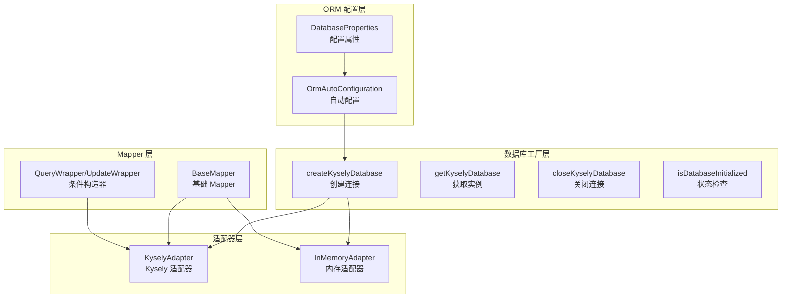
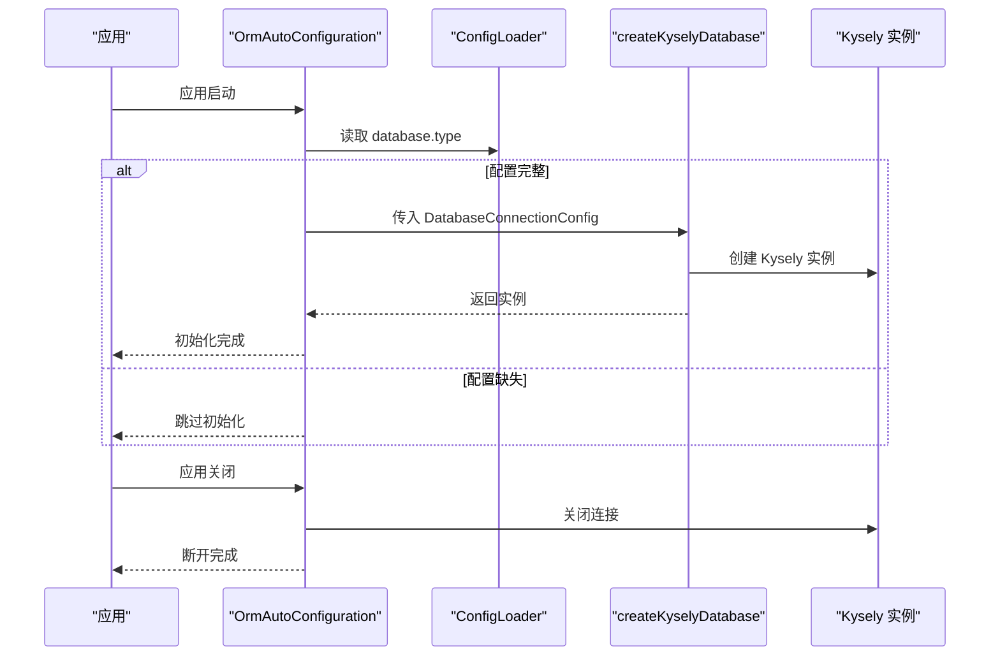
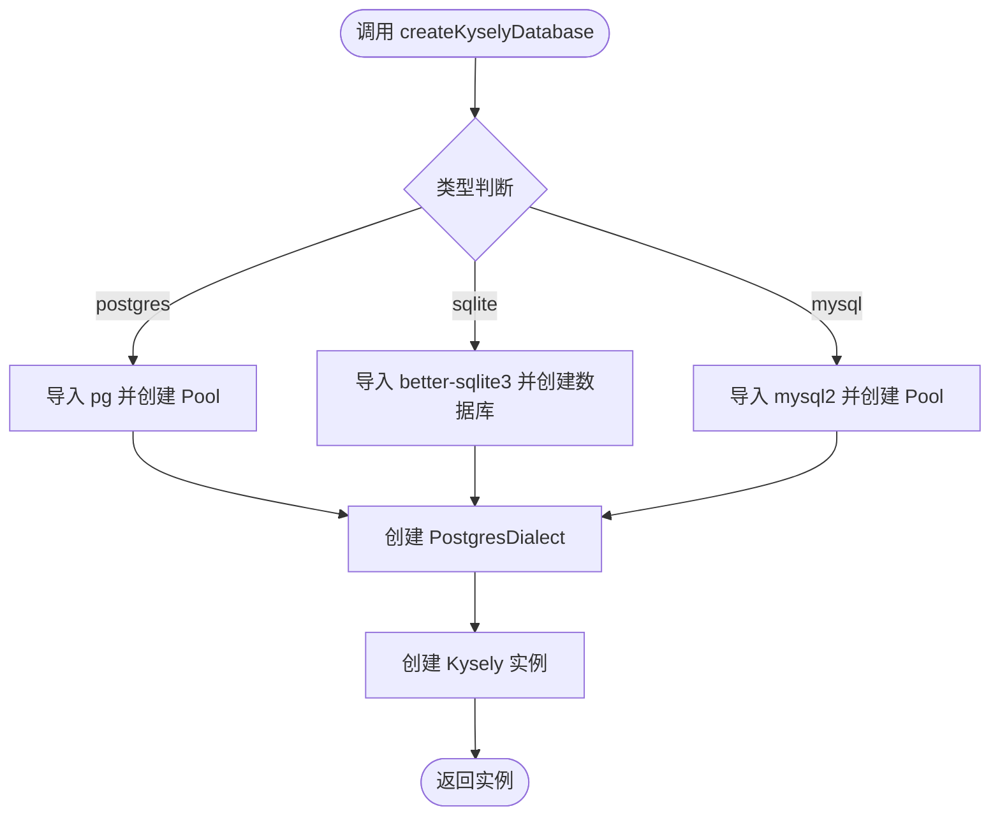
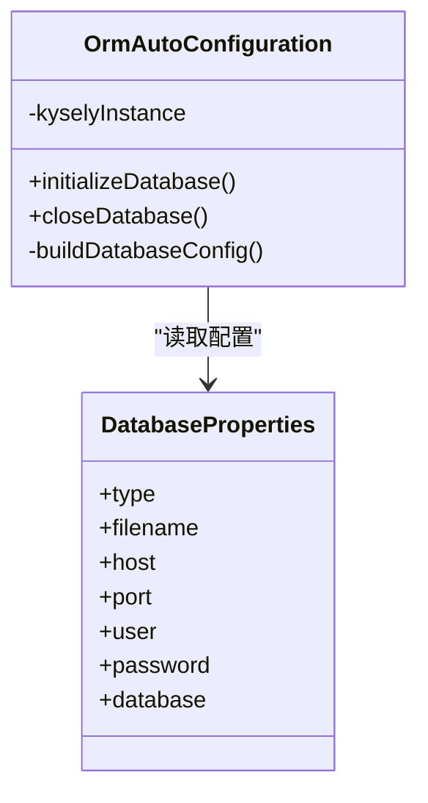
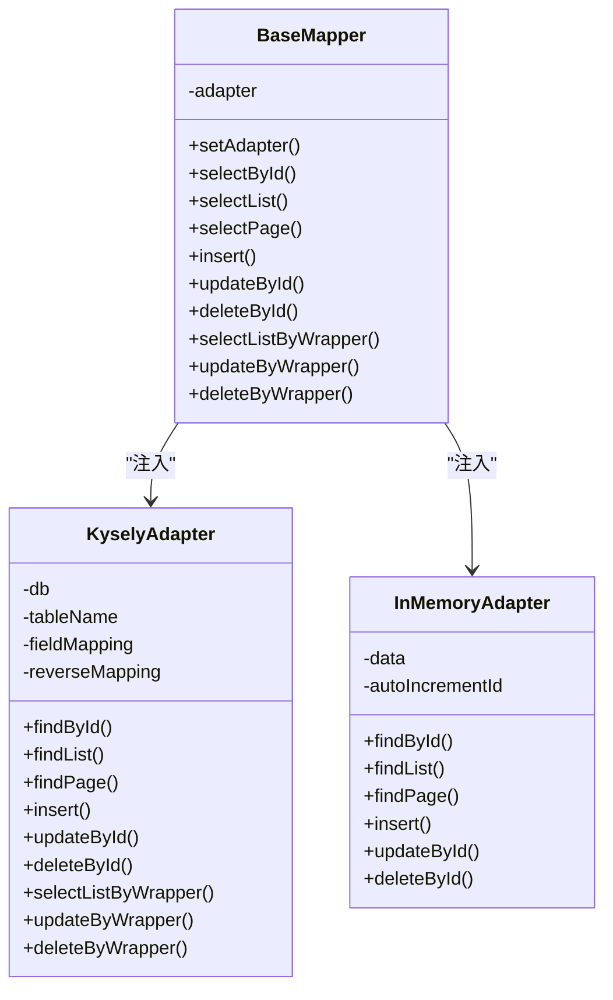
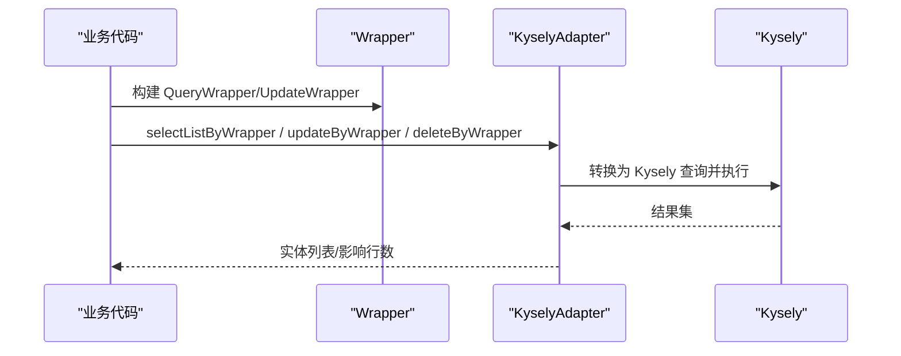
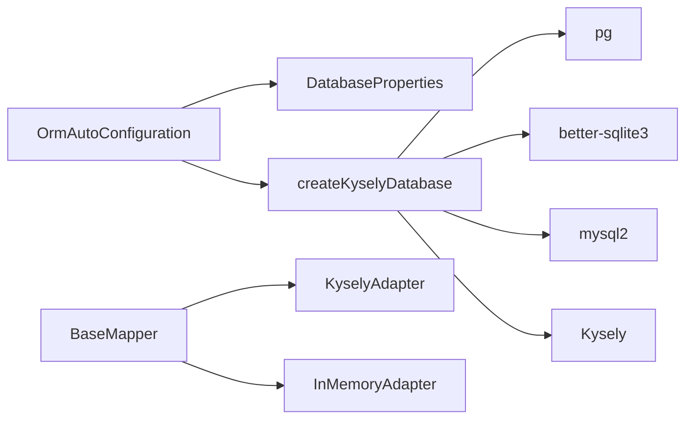

# 数据库配置 API

<cite>
**本文引用的文件**
- [packages/aiko-boot-starter-orm/src/database.ts](file://packages/aiko-boot-starter-orm/src/database.ts)
- [packages/aiko-boot-starter-orm/src/auto-configuration.ts](file://packages/aiko-boot-starter-orm/src/auto-configuration.ts)
- [packages/aiko-boot-starter-orm/src/config-augment.ts](file://packages/aiko-boot-starter-orm/src/config-augment.ts)
- [packages/aiko-boot-starter-orm/src/adapters/index.ts](file://packages/aiko-boot-starter-orm/src/adapters/index.ts)
- [packages/aiko-boot-starter-orm/src/adapters/kysely-adapter.ts](file://packages/aiko-boot-starter-orm/src/adapters/kysely-adapter.ts)
- [packages/aiko-boot-starter-orm/src/adapters/in-memory-adapter.ts](file://packages/aiko-boot-starter-orm/src/adapters/in-memory-adapter.ts)
- [packages/aiko-boot-starter-orm/src/base-mapper.ts](file://packages/aiko-boot-starter-orm/src/base-mapper.ts)
- [packages/aiko-boot-starter-orm/src/wrapper.ts](file://packages/aiko-boot-starter-orm/src/wrapper.ts)
- [packages/aiko-boot-starter-orm/examples/user-crud.ts](file://packages/aiko-boot-starter-orm/examples/user-crud.ts)
</cite>

## 目录
1. [简介](#简介)
2. [项目结构](#项目结构)
3. [核心组件](#核心组件)
4. [架构总览](#架构总览)
5. [详细组件分析](#详细组件分析)
6. [依赖关系分析](#依赖关系分析)
7. [性能考量](#性能考量)
8. [故障排查指南](#故障排查指南)
9. [结论](#结论)
10. [附录](#附录)

## 简介
本文件为数据库配置系统的 API 参考文档，聚焦于基于 Kysely 的 ORM 配置与使用，涵盖以下主题：
- 数据库连接配置选项（连接字符串、连接池参数、超时设置等）
- 多数据库支持的配置方法与切换机制
- 数据库适配器的注册与使用方式
- 不同数据库类型（PostgreSQL、SQLite、MySQL）的具体配置示例
- 数据库初始化、迁移管理与连接状态监控的 API
- 配置文件的加载顺序与优先级规则
- 生产环境下的数据库配置最佳实践与性能调优建议

## 项目结构
该数据库配置系统位于 aiko-boot-starter-orm 包中，核心文件组织如下：
- 数据库工厂与连接配置：database.ts
- Spring Boot 风格自动配置：auto-configuration.ts
- @ai-partner-x/aiko-boot 类型扩展：config-augment.ts
- 适配器集合与实现：adapters/index.ts、kysely-adapter.ts、in-memory-adapter.ts
- Mapper 抽象与适配器接口：base-mapper.ts
- 条件构造器（QueryWrapper/UpdateWrapper）：wrapper.ts
- 示例：examples/user-crud.ts

图表来源
- [packages/aiko-boot-starter-orm/src/auto-configuration.ts](file://packages/aiko-boot-starter-orm/src/auto-configuration.ts#L64-L134)
- [packages/aiko-boot-starter-orm/src/database.ts](file://packages/aiko-boot-starter-orm/src/database.ts#L47-L95)
- [packages/aiko-boot-starter-orm/src/adapters/index.ts](file://packages/aiko-boot-starter-orm/src/adapters/index.ts#L1-L2)
- [packages/aiko-boot-starter-orm/src/base-mapper.ts](file://packages/aiko-boot-starter-orm/src/base-mapper.ts#L55-L384)
- [packages/aiko-boot-starter-orm/src/wrapper.ts](file://packages/aiko-boot-starter-orm/src/wrapper.ts#L49-L350)

章节来源
- [packages/aiko-boot-starter-orm/src/database.ts](file://packages/aiko-boot-starter-orm/src/database.ts#L1-L134)
- [packages/aiko-boot-starter-orm/src/auto-configuration.ts](file://packages/aiko-boot-starter-orm/src/auto-configuration.ts#L1-L135)
- [packages/aiko-boot-starter-orm/src/config-augment.ts](file://packages/aiko-boot-starter-orm/src/config-augment.ts#L1-L25)
- [packages/aiko-boot-starter-orm/src/adapters/index.ts](file://packages/aiko-boot-starter-orm/src/adapters/index.ts#L1-L2)
- [packages/aiko-boot-starter-orm/src/base-mapper.ts](file://packages/aiko-boot-starter-orm/src/base-mapper.ts#L1-L384)
- [packages/aiko-boot-starter-orm/src/wrapper.ts](file://packages/aiko-boot-starter-orm/src/wrapper.ts#L1-L476)

## 核心组件
- 数据库工厂与连接配置
  - createKyselyDatabase(config): 根据配置创建 Kysely 实例，支持 postgres、sqlite、mysql
  - getKyselyDatabase(): 获取全局 Kysely 实例
  - getKyselyDatabaseConfig(): 获取当前数据库配置
  - closeKyselyDatabase(): 关闭连接并清理全局状态
  - isDatabaseInitialized(): 检查数据库是否已初始化
- Spring Boot 风格自动配置
  - DatabaseProperties: 定义配置键 database.*
  - OrmAutoConfiguration: 条件初始化数据库连接，应用生命周期回调
- 适配器体系
  - KyselyAdapter: 基于 Kysely 的数据库适配器，支持字段映射与 QueryWrapper
  - InMemoryAdapter: 内存适配器，用于测试与开发
- Mapper 抽象与条件构造器
  - BaseMapper: 提供 CRUD 与分页等标准操作
  - QueryWrapper/UpdateWrapper: MyBatis-Plus 风格的条件与更新构造器

章节来源
- [packages/aiko-boot-starter-orm/src/database.ts](file://packages/aiko-boot-starter-orm/src/database.ts#L47-L134)
- [packages/aiko-boot-starter-orm/src/auto-configuration.ts](file://packages/aiko-boot-starter-orm/src/auto-configuration.ts#L34-L134)
- [packages/aiko-boot-starter-orm/src/adapters/kysely-adapter.ts](file://packages/aiko-boot-starter-orm/src/adapters/kysely-adapter.ts#L24-L420)
- [packages/aiko-boot-starter-orm/src/adapters/in-memory-adapter.ts](file://packages/aiko-boot-starter-orm/src/adapters/in-memory-adapter.ts#L9-L174)
- [packages/aiko-boot-starter-orm/src/base-mapper.ts](file://packages/aiko-boot-starter-orm/src/base-mapper.ts#L55-L384)
- [packages/aiko-boot-starter-orm/src/wrapper.ts](file://packages/aiko-boot-starter-orm/src/wrapper.ts#L49-L476)

## 架构总览
数据库配置系统采用“自动配置 + 工厂 + 适配器”的分层设计：
- 自动配置层根据配置文件动态初始化数据库连接
- 工厂层负责创建与管理 Kysely 实例，并暴露统一的获取/关闭接口
- 适配器层屏蔽不同数据库方言差异，向上提供一致的 Mapper API
- Mapper 层面向业务，提供 CRUD、分页、条件查询与批量操作

图表来源
- [packages/aiko-boot-starter-orm/src/auto-configuration.ts](file://packages/aiko-boot-starter-orm/src/auto-configuration.ts#L70-L93)
- [packages/aiko-boot-starter-orm/src/database.ts](file://packages/aiko-boot-starter-orm/src/database.ts#L47-L95)

章节来源
- [packages/aiko-boot-starter-orm/src/auto-configuration.ts](file://packages/aiko-boot-starter-orm/src/auto-configuration.ts#L64-L134)
- [packages/aiko-boot-starter-orm/src/database.ts](file://packages/aiko-boot-starter-orm/src/database.ts#L47-L134)

## 详细组件分析

### 数据库工厂与连接配置
- 支持数据库类型：postgres、sqlite、mysql
- 连接配置结构：
  - PostgresConnectionConfig：host、port、user、password、database
  - SqliteConnectionConfig：filename（支持 ":memory:" 内存数据库）
  - MysqlConnectionConfig：host、port、user、password、database
- 工厂方法：
  - createKyselyDatabase(config): 动态导入对应驱动，创建连接池或本地数据库实例
  - getKyselyDatabase()/getKyselyDatabaseConfig(): 获取全局实例与配置
  - closeKyselyDatabase(): 销毁实例并清空全局状态
  - isDatabaseInitialized(): 快速判断初始化状态

图表来源
- [packages/aiko-boot-starter-orm/src/database.ts](file://packages/aiko-boot-starter-orm/src/database.ts#L47-L95)

章节来源
- [packages/aiko-boot-starter-orm/src/database.ts](file://packages/aiko-boot-starter-orm/src/database.ts#L9-L134)

### Spring Boot 风格自动配置
- DatabaseProperties 映射配置键 database.type、database.filename、database.host、database.port、database.user、database.password、database.database
- OrmAutoConfiguration 在应用启动时按条件初始化数据库，在应用关闭时关闭连接
- 构建配置时对各类型进行必要字段校验，确保配置完整性

图表来源
- [packages/aiko-boot-starter-orm/src/auto-configuration.ts](file://packages/aiko-boot-starter-orm/src/auto-configuration.ts#L34-L134)

章节来源
- [packages/aiko-boot-starter-orm/src/auto-configuration.ts](file://packages/aiko-boot-starter-orm/src/auto-configuration.ts#L34-L134)

### 适配器注册与使用
- 适配器导出入口：adapters/index.ts 导出 KyselyAdapter 与 InMemoryAdapter
- KyselyAdapter：支持字段映射、QueryWrapper/UpdateWrapper、分页、统计等
- InMemoryAdapter：用于测试与开发，提供内存存储与排序、分页能力
- Mapper 使用：通过 BaseMapper.setAdapter 注入适配器，即可获得一致的 CRUD 能力

图表来源
- [packages/aiko-boot-starter-orm/src/base-mapper.ts](file://packages/aiko-boot-starter-orm/src/base-mapper.ts#L55-L384)
- [packages/aiko-boot-starter-orm/src/adapters/kysely-adapter.ts](file://packages/aiko-boot-starter-orm/src/adapters/kysely-adapter.ts#L24-L420)
- [packages/aiko-boot-starter-orm/src/adapters/in-memory-adapter.ts](file://packages/aiko-boot-starter-orm/src/adapters/in-memory-adapter.ts#L9-L174)

章节来源
- [packages/aiko-boot-starter-orm/src/adapters/index.ts](file://packages/aiko-boot-starter-orm/src/adapters/index.ts#L1-L2)
- [packages/aiko-boot-starter-orm/src/adapters/kysely-adapter.ts](file://packages/aiko-boot-starter-orm/src/adapters/kysely-adapter.ts#L24-L420)
- [packages/aiko-boot-starter-orm/src/adapters/in-memory-adapter.ts](file://packages/aiko-boot-starter-orm/src/adapters/in-memory-adapter.ts#L9-L174)
- [packages/aiko-boot-starter-orm/src/base-mapper.ts](file://packages/aiko-boot-starter-orm/src/base-mapper.ts#L55-L384)

### 条件构造器与查询封装
- QueryWrapper/UpdateWrapper 提供与 MyBatis-Plus 一致的链式 API，支持比较、模糊、范围、NULL 判断、逻辑组合、排序、分页、选择字段等
- KyselyAdapter 将 QueryWrapper/UpdateWrapper 转换为 Kysely 查询，实现跨数据库方言的一致性

图表来源
- [packages/aiko-boot-starter-orm/src/wrapper.ts](file://packages/aiko-boot-starter-orm/src/wrapper.ts#L49-L476)
- [packages/aiko-boot-starter-orm/src/adapters/kysely-adapter.ts](file://packages/aiko-boot-starter-orm/src/adapters/kysely-adapter.ts#L177-L244)

章节来源
- [packages/aiko-boot-starter-orm/src/wrapper.ts](file://packages/aiko-boot-starter-orm/src/wrapper.ts#L49-L476)
- [packages/aiko-boot-starter-orm/src/adapters/kysely-adapter.ts](file://packages/aiko-boot-starter-orm/src/adapters/kysely-adapter.ts#L177-L244)

### 多数据库支持与切换机制
- 配置层面：通过 database.type 切换数据库类型；不同类型的必要配置项见“核心组件”小节
- 运行时：createKyselyDatabase 根据配置动态选择方言与连接池实现
- 切换建议：
  - 开发阶段：使用 sqlite 或内存适配器
  - 测试阶段：使用 sqlite 文件或专用测试数据库
  - 生产阶段：使用 postgres 或 mysql，并结合连接池参数优化

章节来源
- [packages/aiko-boot-starter-orm/src/database.ts](file://packages/aiko-boot-starter-orm/src/database.ts#L47-L95)
- [packages/aiko-boot-starter-orm/src/auto-configuration.ts](file://packages/aiko-boot-starter-orm/src/auto-configuration.ts#L98-L133)

### 数据库初始化、迁移管理与连接状态监控
- 初始化：OrmAutoConfiguration 在应用启动时自动初始化数据库连接
- 关闭：应用关闭时自动关闭连接
- 状态监控：isDatabaseInitialized() 用于快速判断连接状态
- 迁移管理：当前仓库未提供专门的迁移工具 API，建议结合外部迁移工具或在应用启动流程中集成迁移逻辑

章节来源
- [packages/aiko-boot-starter-orm/src/auto-configuration.ts](file://packages/aiko-boot-starter-orm/src/auto-configuration.ts#L70-L93)
- [packages/aiko-boot-starter-orm/src/database.ts](file://packages/aiko-boot-starter-orm/src/database.ts#L128-L134)

### 配置文件加载顺序与优先级规则
- 配置键前缀：database.*
- 加载顺序与优先级（基于自动配置实现）：
  1) 读取 database.type
  2) 根据类型读取相应字段：
     - sqlite: database.filename
     - postgres/mysql: database.host、database.port、database.user、database.database（password 可选）
  3) 若任一必要字段缺失，则跳过初始化
- 类型扩展：通过模块增强为 @ai-partner-x/aiko-boot 的 AppConfig 注入 database 配置字段

章节来源
- [packages/aiko-boot-starter-orm/src/auto-configuration.ts](file://packages/aiko-boot-starter-orm/src/auto-configuration.ts#L98-L133)
- [packages/aiko-boot-starter-orm/src/config-augment.ts](file://packages/aiko-boot-starter-orm/src/config-augment.ts#L20-L25)

### 不同数据库类型的配置示例
- SQLite
  - 配置键：database.type=sqlite，database.filename
  - 示例：参见示例文件中的实体与 Mapper 使用方式
- PostgreSQL
  - 配置键：database.type=postgres，database.host、database.port、database.user、database.password、database.database
- MySQL
  - 配置键：database.type=mysql，database.host、database.port、database.user、database.password、database.database

章节来源
- [packages/aiko-boot-starter-orm/src/auto-configuration.ts](file://packages/aiko-boot-starter-orm/src/auto-configuration.ts#L34-L54)
- [packages/aiko-boot-starter-orm/examples/user-crud.ts](file://packages/aiko-boot-starter-orm/examples/user-crud.ts#L34-L66)

## 依赖关系分析
- 组件耦合与内聚
  - OrmAutoConfiguration 与 DatabaseProperties 高内聚，负责配置读取与初始化
  - 数据库工厂与具体驱动解耦，通过类型分支实现多数据库支持
  - Mapper 与适配器通过接口解耦，便于替换与扩展
- 外部依赖
  - Kysely 及各数据库方言（PostgresDialect、SqliteDialect、MysqlDialect）
  - 运行时动态导入驱动（pg、better-sqlite3、mysql2）

图表来源
- [packages/aiko-boot-starter-orm/src/auto-configuration.ts](file://packages/aiko-boot-starter-orm/src/auto-configuration.ts#L27-L27)
- [packages/aiko-boot-starter-orm/src/database.ts](file://packages/aiko-boot-starter-orm/src/database.ts#L7-L8)
- [packages/aiko-boot-starter-orm/src/base-mapper.ts](file://packages/aiko-boot-starter-orm/src/base-mapper.ts#L55-L384)

章节来源
- [packages/aiko-boot-starter-orm/src/auto-configuration.ts](file://packages/aiko-boot-starter-orm/src/auto-configuration.ts#L18-L27)
- [packages/aiko-boot-starter-orm/src/database.ts](file://packages/aiko-boot-starter-orm/src/database.ts#L7-L8)
- [packages/aiko-boot-starter-orm/src/base-mapper.ts](file://packages/aiko-boot-starter-orm/src/base-mapper.ts#L55-L384)

## 性能考量
- 连接池参数
  - PostgreSQL：通过 pg.Pool 创建连接池，可在应用启动时根据并发需求调整池大小与超时参数
  - MySQL：通过 mysql2.createPool 创建连接池，注意 maxIdle、queueLimit、timeout 等参数
  - SQLite：better-sqlite3 为本地文件数据库，适合开发与轻量场景；高并发写入建议评估 WAL 模式与锁策略
- 查询性能
  - 使用 QueryWrapper/UpdateWrapper 构建高效 SQL，避免 N+1 查询
  - 合理使用分页与排序，避免一次性加载大量数据
- 适配器选择
  - 生产环境优先使用 KyselyAdapter，充分利用字段映射与条件构造器
  - 测试与开发可使用 InMemoryAdapter，但注意其不持久化特性

## 故障排查指南
- 初始化失败
  - 症状：控制台提示跳过初始化或抛出“未初始化”错误
  - 排查：确认 database.type 与必要字段是否齐全；检查配置加载顺序
- 连接异常
  - 症状：连接超时、拒绝连接
  - 排查：核对主机、端口、用户名、密码与数据库名；检查网络连通性与防火墙
- 适配器未设置
  - 症状：调用 Mapper 抛出“适配器未设置”错误
  - 排查：确保在使用前调用 setAdapter 注入适配器
- 内存适配器数据丢失
  - 症状：重启后数据消失
  - 说明：InMemoryAdapter 为临时存储，适用于测试；生产请使用 KyselyAdapter

章节来源
- [packages/aiko-boot-starter-orm/src/auto-configuration.ts](file://packages/aiko-boot-starter-orm/src/auto-configuration.ts#L72-L76)
- [packages/aiko-boot-starter-orm/src/base-mapper.ts](file://packages/aiko-boot-starter-orm/src/base-mapper.ts#L68-L73)
- [packages/aiko-boot-starter-orm/src/database.ts](file://packages/aiko-boot-starter-orm/src/database.ts#L100-L104)

## 结论
本数据库配置系统通过 Spring Boot 风格的自动配置与工厂模式，实现了对 PostgreSQL、SQLite、MySQL 的统一接入；配合适配器与条件构造器，提供了与 MyBatis-Plus 一致的开发体验。生产环境下建议明确区分开发/测试/生产的配置文件，合理设置连接池参数与查询策略，并通过状态监控与日志及时发现潜在问题。

## 附录
- 示例参考：examples/user-crud.ts 展示了实体定义、Mapper 使用与 CRUD 流程
- 适配器导出：adapters/index.ts 提供 KyselyAdapter 与 InMemoryAdapter 的统一入口

章节来源
- [packages/aiko-boot-starter-orm/examples/user-crud.ts](file://packages/aiko-boot-starter-orm/examples/user-crud.ts#L34-L155)
- [packages/aiko-boot-starter-orm/src/adapters/index.ts](file://packages/aiko-boot-starter-orm/src/adapters/index.ts#L1-L2)