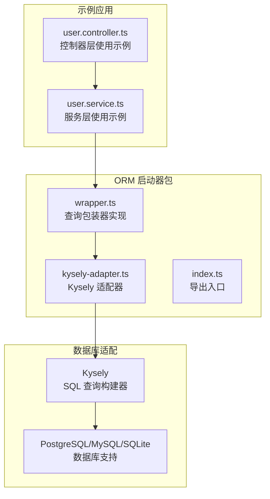
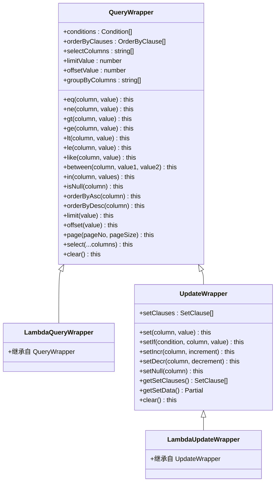
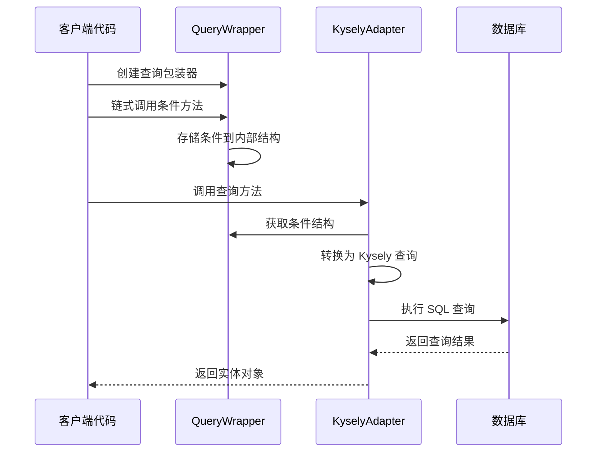
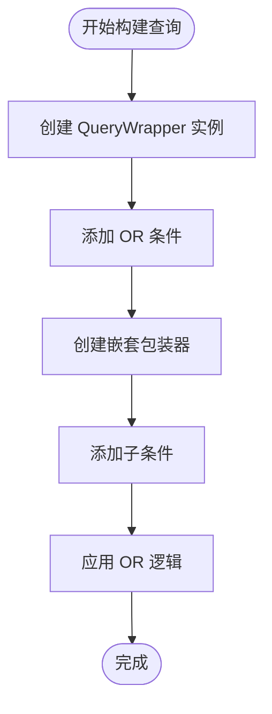
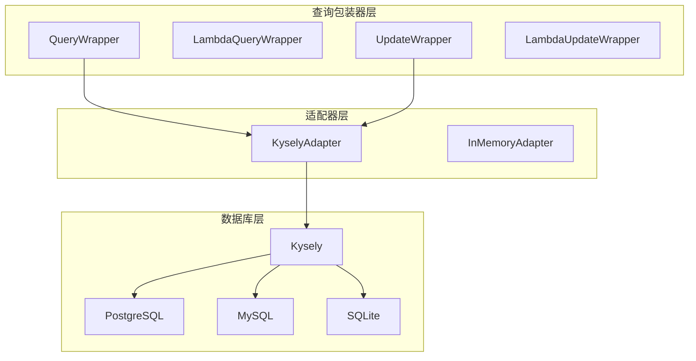

# 查询包装器 API

<cite>
**本文档引用的文件**
- [wrapper.ts](file://packages/aiko-boot-starter-orm/src/wrapper.ts)
- [kysely-adapter.ts](file://packages/aiko-boot-starter-orm/src/adapters/kysely-adapter.ts)
- [index.ts](file://packages/aiko-boot-starter-orm/src/index.ts)
- [user.service.ts](file://app/examples/user-crud/packages/api/src/service/user.service.ts)
- [user.controller.ts](file://app/examples/user-crud/packages/api/src/controller/user.controller.ts)
</cite>

## 目录
1. [简介](#简介)
2. [项目结构](#项目结构)
3. [核心组件](#核心组件)
4. [架构概览](#架构概览)
5. [详细组件分析](#详细组件分析)
6. [依赖关系分析](#依赖关系分析)
7. [性能考虑](#性能考虑)
8. [故障排除指南](#故障排除指南)
9. [结论](#结论)

## 简介

查询包装器（QueryWrapper）是本框架提供的 MyBatis-Plus 风格的条件构造器，用于构建动态 SQL 查询。它提供了链式调用的查询构建方法，支持各种比较操作符、逻辑组合、排序、分页等功能，并通过适配器模式将条件转换为具体的数据库查询。

该查询包装器完全兼容 MyBatis-Plus 的 API 设计，为开发者提供了熟悉的查询构建体验，同时利用 TypeScript 的类型系统确保编译时的安全性。

## 项目结构

查询包装器位于 ORM 启动器包中，采用模块化设计：

**图表来源**
- [wrapper.ts](file://packages/aiko-boot-starter-orm/src/wrapper.ts#L1-L50)
- [kysely-adapter.ts](file://packages/aiko-boot-starter-orm/src/adapters/kysely-adapter.ts#L1-L50)
- [index.ts](file://packages/aiko-boot-starter-orm/src/index.ts#L54-L64)

**章节来源**
- [wrapper.ts](file://packages/aiko-boot-starter-orm/src/wrapper.ts#L1-L50)
- [index.ts](file://packages/aiko-boot-starter-orm/src/index.ts#L54-L64)

## 核心组件

查询包装器系统由以下核心组件构成：

### 主要类结构

**图表来源**
- [wrapper.ts](file://packages/aiko-boot-starter-orm/src/wrapper.ts#L49-L350)
- [wrapper.ts](file://packages/aiko-boot-starter-orm/src/wrapper.ts#L394-L476)

### 数据结构定义

查询包装器使用以下核心数据结构：

| 结构类型 | 字段 | 类型 | 描述 |
|---------|------|------|------|
| Condition | type | 'compare' \| 'between' \| 'in' \| 'null' \| 'or' \| 'and' \| 'nested' | 条件类型 |
| Condition | column | string | 数据库列名 |
| Condition | operator | CompareOperator | 操作符 |
| Condition | value | unknown | 单值参数 |
| Condition | values | unknown[] | 多值参数 |
| Condition | conditions | Condition[] | 嵌套条件数组 |
| OrderByClause | column | string | 排序列名 |
| OrderByClause | direction | 'asc' \| 'desc' | 排序方向 |
| SetClause | column | string | 更新列名 |
| SetClause | value | unknown | 更新值 |

**章节来源**
- [wrapper.ts](file://packages/aiko-boot-starter-orm/src/wrapper.ts#L28-L44)
- [wrapper.ts](file://packages/aiko-boot-starter-orm/src/wrapper.ts#L26-L35)

## 架构概览

查询包装器采用适配器模式，将 MyBatis-Plus 风格的 API 转换为具体的数据库查询：

**图表来源**
- [wrapper.ts](file://packages/aiko-boot-starter-orm/src/wrapper.ts#L177-L200)
- [kysely-adapter.ts](file://packages/aiko-boot-starter-orm/src/adapters/kysely-adapter.ts#L249-L300)

### SQL 生成规则

适配器将查询包装器的条件转换为 SQL 时遵循以下规则：

| 条件类型 | SQL 生成规则 | 示例 |
|---------|-------------|------|
| compare | `column operator value` | `age > 18` |
| between | `column >= value1 AND column <= value2` | `age BETWEEN 18 AND 60` |
| in | `column IN (value1, value2, ...)` | `status IN (1, 2, 3)` |
| null | `column IS NULL` 或 `column IS NOT NULL` | `email IS NOT NULL` |
| or | `(condition1 OR condition2)` | `(username LIKE '%test%' OR email LIKE '%test%')` |
| and | `(condition1 AND condition2)` | `(age >= 18 AND age <= 60)` |

**章节来源**
- [kysely-adapter.ts](file://packages/aiko-boot-starter-orm/src/adapters/kysely-adapter.ts#L249-L300)

## 详细组件分析

### 比较条件方法

查询包装器提供了丰富的比较操作符支持：

#### 基本比较操作符

| 方法 | 参数 | 支持的操作符 | SQL 生成 | 用途示例 |
|------|------|-------------|----------|----------|
| eq | (column: string, value: unknown) | = | `column = value` | `user.eq('status', 1)` |
| ne | (column: string, value: unknown) | != | `column != value` | `user.ne('status', 0)` |
| gt | (column: string, value: unknown) | > | `column > value` | `user.gt('age', 18)` |
| ge | (column: string, value: unknown) | >= | `column >= value` | `user.ge('age', 18)` |
| lt | (column: string, value: unknown) | < | `column < value` | `user.lt('age', 60)` |
| le | (column: string, value: unknown) | <= | `column <= value` | `user.le('age', 60)` |

#### 模糊查询方法

| 方法 | 参数 | 支持的操作符 | SQL 生成 | 用途示例 |
|------|------|-------------|----------|----------|
| like | (column: string, value: string) | LIKE | `column LIKE %value%` | `user.like('username', 'admin')` |
| notLike | (column: string, value: string) | NOT LIKE | `column NOT LIKE %value%` | `user.notLike('username', 'test')` |
| likeLeft | (column: string, value: string) | LIKE | `column LIKE %value` | `user.likeLeft('username', 'admin')` |
| likeRight | (column: string, value: string) | LIKE | `column LIKE value%` | `user.likeRight('username', 'user')` |

#### 范围查询方法

| 方法 | 参数 | 支持的操作符 | SQL 生成 | 用途示例 |
|------|------|-------------|----------|----------|
| between | (column: string, value1: unknown, value2: unknown) | BETWEEN | `column BETWEEN value1 AND value2` | `user.between('age', 18, 60)` |
| notBetween | (column: string, value1: unknown, value2: unknown) | NOT BETWEEN | `column NOT BETWEEN value1 AND value2` | `user.notBetween('age', 18, 60)` |
| in | (column: string, values: unknown[]) | IN | `column IN (value1, value2, ...)` | `user.in('status', [1, 2, 3])` |
| notIn | (column: string, values: unknown[]) | NOT IN | `column NOT IN (value1, value2, ...)` | `user.notIn('status', [0, -1])` |

#### NULL 判断方法

| 方法 | 参数 | 支持的操作符 | SQL 生成 | 用途示例 |
|------|------|-------------|----------|----------|
| isNull | (column: string) | IS NULL | `column IS NULL` | `user.isNull('deletedAt')` |
| isNotNull | (column: string) | IS NOT NULL | `column IS NOT NULL` | `user.isNotNull('email')` |

**章节来源**
- [wrapper.ts](file://packages/aiko-boot-starter-orm/src/wrapper.ts#L59-L207)

### 逻辑组合方法

查询包装器支持复杂的条件组合：

#### OR 条件组合

**图表来源**
- [wrapper.ts](file://packages/aiko-boot-starter-orm/src/wrapper.ts#L211-L231)

#### AND 条件组合

AND 条件与 OR 条件类似，但使用 AND 逻辑连接多个条件。

**章节来源**
- [wrapper.ts](file://packages/aiko-boot-starter-orm/src/wrapper.ts#L211-L231)

### 排序功能

查询包装器提供灵活的排序支持：

| 方法 | 参数 | 功能 | 用途示例 |
|------|------|------|----------|
| orderByAsc | (column: string) | 升序排序 | `user.orderByAsc('createdAt')` |
| orderByDesc | (column: string) | 降序排序 | `user.orderByDesc('createdAt')` |
| orderBy | (column: string, direction: 'asc' \| 'desc') | 指定排序方向 | `user.orderBy('createdAt', 'desc')` |

**章节来源**
- [wrapper.ts](file://packages/aiko-boot-starter-orm/src/wrapper.ts#L235-L260)

### 分页功能

查询包装器支持多种分页方式：

| 方法 | 参数 | 功能 | 用途示例 |
|------|------|------|----------|
| limit | (value: number) | 设置限制数量 | `user.limit(10)` |
| offset | (value: number) | 设置偏移量 | `user.offset(20)` |
| page | (pageNo: number, pageSize: number) | 设置分页参数 | `user.page(2, 10)` |

**章节来源**
- [wrapper.ts](file://packages/aiko-boot-starter-orm/src/wrapper.ts#L264-L290)

### 字段选择和聚合

| 方法 | 参数 | 功能 | 用途示例 |
|------|------|------|----------|
| select | (...columns: string[]) | 选择特定字段 | `user.select('id', 'name')` |
| groupBy | (...columns: string[]) | 分组查询 | `user.groupBy('status', 'type')` |

**章节来源**
- [wrapper.ts](file://packages/aiko-boot-starter-orm/src/wrapper.ts#L294-L310)

## 依赖关系分析

查询包装器的依赖关系清晰明确：

**图表来源**
- [wrapper.ts](file://packages/aiko-boot-starter-orm/src/wrapper.ts#L49-L350)
- [kysely-adapter.ts](file://packages/aiko-boot-starter-orm/src/adapters/kysely-adapter.ts#L24-L37)

### 导出接口

查询包装器通过统一的入口导出：

**章节来源**
- [index.ts](file://packages/aiko-boot-starter-orm/src/index.ts#L54-L64)

## 性能考虑

### SQL 注入防护

查询包装器通过以下机制防止 SQL 注入：

1. **参数化查询**：所有用户输入都作为参数传递，而非直接拼接到 SQL 字符串中
2. **类型安全**：利用 TypeScript 类型系统，在编译时检查参数类型
3. **字段映射**：通过字段映射表验证列名的有效性

### 查询优化建议

1. **索引优化**：为常用查询条件建立适当的数据库索引
2. **选择性过滤**：将选择性高的条件放在前面
3. **避免 SELECT ***：使用 select() 方法只选择需要的字段
4. **合理分页**：使用 page() 方法进行分页，避免一次性加载大量数据
5. **条件组合**：合理使用 AND/OR 组合，避免过于复杂的嵌套条件

### 批量操作

对于批量操作，建议使用专门的批量方法而不是循环单个操作：

**章节来源**
- [kysely-adapter.ts](file://packages/aiko-boot-starter-orm/src/adapters/kysely-adapter.ts#L339-L352)

## 故障排除指南

### 常见问题及解决方案

#### 1. 编译错误

**问题**：TypeScript 编译时报错
**原因**：类型不匹配或参数类型错误
**解决**：检查列名是否正确，确保传入的值类型与数据库字段类型匹配

#### 2. 查询结果异常

**问题**：查询结果不符合预期
**原因**：条件组合逻辑错误或参数值问题
**解决**：检查条件的 AND/OR 组合，验证传入的参数值

#### 3. SQL 注入风险

**问题**：担心 SQL 注入攻击
**解决**：查询包装器自动处理参数化查询，无需手动处理

**章节来源**
- [wrapper.ts](file://packages/aiko-boot-starter-orm/src/wrapper.ts#L338-L350)

## 结论

查询包装器（QueryWrapper）为开发者提供了强大而易用的动态查询构建能力。通过链式调用的方式，开发者可以轻松构建复杂的查询条件，同时享受 TypeScript 的类型安全保证。

主要优势包括：
- **API 兼容性**：完全兼容 MyBatis-Plus 的 API 设计
- **类型安全**：利用 TypeScript 确保编译时的类型检查
- **灵活性**：支持各种复杂的查询条件组合
- **性能优化**：自动参数化查询，防止 SQL 注入
- **多数据库支持**：通过适配器模式支持多种数据库

通过合理使用查询包装器的各种方法，开发者可以构建高效、安全、可维护的数据库查询逻辑。