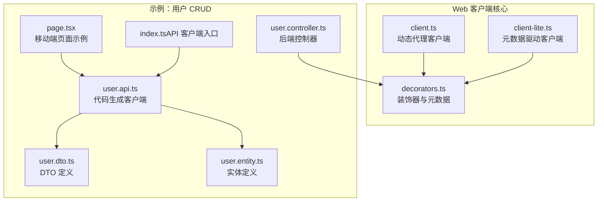
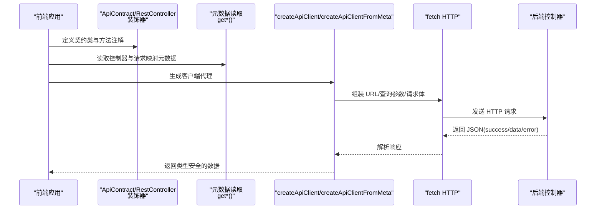
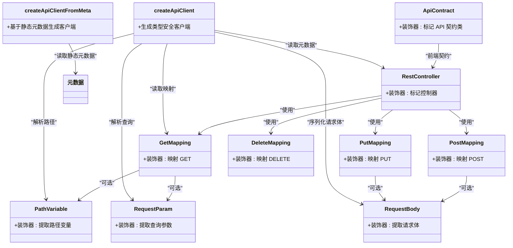
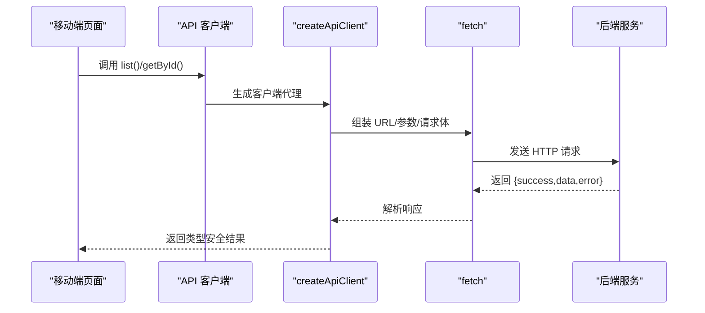
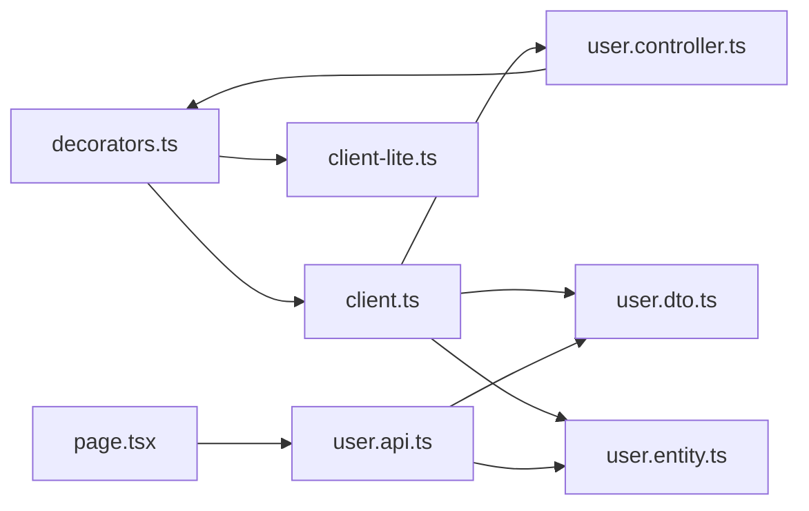

# API 客户端

<cite>
**本文引用的文件**
- [client.ts](file://packages/aiko-boot-starter-web/src/client.ts)
- [client-lite.ts](file://packages/aiko-boot-starter-web/src/client-lite.ts)
- [decorators.ts](file://packages/aiko-boot-starter-web/src/decorators.ts)
- [user.controller.ts](file://app/examples/user-crud/packages/api/src/controller/user.controller.ts)
- [user.api.ts](file://app/examples/user-crud/packages/api/dist/client/user.api.ts)
- [index.ts（API 客户端入口）](file://app/examples/user-crud/packages/api/dist/client/index.ts)
- [page.tsx（移动端首页示例）](file://app/examples/user-crud/packages/mall-mobile/src/app/page.tsx)
- [user.dto.ts](file://app/examples/user-crud/packages/api/dist/client/user.dto.ts)
- [user.entity.ts](file://app/examples/user-crud/packages/api/dist/client/user.entity.ts)
- [package.json](file://package.json)
</cite>

## 目录
1. [简介](#简介)
2. [项目结构](#项目结构)
3. [核心组件](#核心组件)
4. [架构总览](#架构总览)
5. [组件详解](#组件详解)
6. [依赖关系分析](#依赖关系分析)
7. [性能考量](#性能考量)
8. [故障排查指南](#故障排查指南)
9. [结论](#结论)
10. [附录](#附录)

## 简介
本文件为基于 Feign 风格的 TypeScript API 客户端参考文档，覆盖以下主题：
- 客户端接口定义：URL 模板、HTTP 方法与参数绑定
- 类型安全的调用机制：请求参数序列化与响应反序列化
- 客户端配置：基础 URL、请求头、SSR 元数据模式
- 异步调用与 Promise 处理最佳实践
- 认证集成、拦截器与请求头管理
- 客户端元数据管理与动态代理实现
- 完整使用示例与常见问题解答

## 项目结构
本仓库采用多包工作区组织，API 客户端相关的核心代码位于 web 启动器包中，示例工程位于 examples/user-crud 中，演示了前后端共享契约、代码生成与客户端消费。

图表来源
- [client.ts](file://packages/aiko-boot-starter-web/src/client.ts#L1-L233)
- [client-lite.ts](file://packages/aiko-boot-starter-web/src/client-lite.ts#L1-L107)
- [decorators.ts](file://packages/aiko-boot-starter-web/src/decorators.ts#L1-L196)
- [user.controller.ts](file://app/examples/user-crud/packages/api/src/controller/user.controller.ts#L1-L170)
- [user.api.ts](file://app/examples/user-crud/packages/api/dist/client/user.api.ts#L1-L131)
- [index.ts（API 客户端入口）](file://app/examples/user-crud/packages/api/dist/client/index.ts#L1-L9)
- [user.dto.ts](file://app/examples/user-crud/packages/api/dist/client/user.dto.ts#L1-L43)
- [user.entity.ts](file://app/examples/user-crud/packages/api/dist/client/user.entity.ts#L1-L13)
- [page.tsx（移动端首页示例）](file://app/examples/user-crud/packages/mall-mobile/src/app/page.tsx#L1-L46)

章节来源
- [package.json](file://package.json#L1-L32)

## 核心组件
- 动态代理客户端：基于装饰器反射元数据生成类型安全的 fetch 客户端
- 元数据驱动客户端：在 SSR 环境下无需装饰器，直接使用静态元数据
- 装饰器层：提供与 Spring Boot 对齐的 MVC 注解能力
- 示例控制器与客户端：展示完整端到端用法

章节来源
- [client.ts](file://packages/aiko-boot-starter-web/src/client.ts#L47-L144)
- [client-lite.ts](file://packages/aiko-boot-starter-web/src/client-lite.ts#L7-L106)
- [decorators.ts](file://packages/aiko-boot-starter-web/src/decorators.ts#L26-L196)

## 架构总览
下图展示了从“契约类”到“运行时客户端”的生成与调用流程，以及与后端控制器的对应关系。

图表来源
- [client.ts](file://packages/aiko-boot-starter-web/src/client.ts#L73-L144)
- [client-lite.ts](file://packages/aiko-boot-starter-web/src/client-lite.ts#L47-L106)
- [decorators.ts](file://packages/aiko-boot-starter-web/src/decorators.ts#L177-L196)

## 组件详解

### 客户端接口定义与参数绑定
- URL 模板与路径变量
  - 控制器基路径与方法路径拼接，路径变量通过装饰器声明并按序替换
- 查询参数
  - 使用查询参数装饰器声明，未传入或为 null 的值不会出现在查询串中
- 请求体
  - 使用请求体装饰器声明，自动进行 JSON 序列化
- HTTP 方法
  - 通过映射注解声明，如 GET/POST/PUT/DELETE/PATCH

章节来源
- [client.ts](file://packages/aiko-boot-starter-web/src/client.ts#L88-L141)
- [client-lite.ts](file://packages/aiko-boot-starter-web/src/client-lite.ts#L57-L103)
- [decorators.ts](file://packages/aiko-boot-starter-web/src/decorators.ts#L93-L135)
- [decorators.ts](file://packages/aiko-boot-starter-web/src/decorators.ts#L140-L173)

### 类型安全的调用机制
- 请求参数序列化
  - 路径变量：按名称替换模板占位符，并对值进行编码
  - 查询参数：仅在值非 undefined 且非 null 时加入
  - 请求体：JSON 字符串化
- 响应反序列化
  - 统一期望后端返回包含 success/data/error 的结构；当 success 为假时抛出错误
- 类型推断
  - 客户端方法签名与契约类保持一致，确保编译期类型安全

章节来源
- [client.ts](file://packages/aiko-boot-starter-web/src/client.ts#L92-L140)
- [client-lite.ts](file://packages/aiko-boot-starter-web/src/client-lite.ts#L62-L102)
- [user.api.ts](file://app/examples/user-crud/packages/api/dist/client/user.api.ts#L10-L131)

### 客户端配置选项
- 基础 URL
  - 通过客户端选项传入，作为所有请求的基础前缀
- 请求头
  - 支持额外请求头合并，便于统一注入认证令牌等
- SSR 元数据模式
  - 在 SSR 场景下可使用元数据驱动版本，避免装饰器反射依赖

章节来源
- [client.ts](file://packages/aiko-boot-starter-web/src/client.ts#L47-L52)
- [client.ts](file://packages/aiko-boot-starter-web/src/client.ts#L77-L78)
- [client.ts](file://packages/aiko-boot-starter-web/src/client.ts#L173-L177)
- [client-lite.ts](file://packages/aiko-boot-starter-web/src/client-lite.ts#L7-L12)
- [client-lite.ts](file://packages/aiko-boot-starter-web/src/client-lite.ts#L52-L53)

### 异步调用与 Promise 处理最佳实践
- 所有客户端方法均返回 Promise，建议使用 async/await
- 错误处理
  - 当响应 success 为假时抛出错误，调用方需捕获并处理
  - 建议在 UI 层统一拦截并提示
- 并发与重试
  - 可在调用方封装重试逻辑或引入中间件（见“拦截器与请求头管理”）

章节来源
- [client.ts](file://packages/aiko-boot-starter-web/src/client.ts#L133-L139)
- [client.ts](file://packages/aiko-boot-starter-web/src/client.ts#L221-L227)
- [client-lite.ts](file://packages/aiko-boot-starter-web/src/client-lite.ts#L95-L101)
- [client-lite.ts](file://packages/aiko-boot-starter-web/src/client-lite.ts#L221-L227)

### 认证集成、拦截器使用与请求头管理
- 认证令牌注入
  - 通过客户端选项 headers 注入 Authorization 等头部
- 拦截器模式
  - 可在调用方包装客户端，实现统一的鉴权、日志、重试等横切逻辑
- 请求头管理
  - 建议集中维护默认请求头，避免分散设置

章节来源
- [client.ts](file://packages/aiko-boot-starter-web/src/client.ts#L77-L78)
- [client.ts](file://packages/aiko-boot-starter-web/src/client.ts#L124-L131)
- [client.ts](file://packages/aiko-boot-starter-web/src/client.ts#L212-L219)
- [client-lite.ts](file://packages/aiko-boot-starter-web/src/client-lite.ts#L86-L93)

### 客户端元数据管理与动态代理实现
- 动态代理
  - 读取控制器与请求映射元数据，为每个方法生成 fetch 调用
- 元数据来源
  - 装饰器反射（开发环境）
  - 静态元数据（SSR/构建产物）
- 与后端契约对齐
  - 前端通过 ApiContract 或与后端相同的注解定义契约，保证一致性

图表来源
- [client.ts](file://packages/aiko-boot-starter-web/src/client.ts#L33-L43)
- [client.ts](file://packages/aiko-boot-starter-web/src/client.ts#L73-L144)
- [client.ts](file://packages/aiko-boot-starter-web/src/client.ts#L173-L232)
- [client-lite.ts](file://packages/aiko-boot-starter-web/src/client-lite.ts#L47-L106)
- [decorators.ts](file://packages/aiko-boot-starter-web/src/decorators.ts#L50-L88)
- [decorators.ts](file://packages/aiko-boot-starter-web/src/decorators.ts#L93-L135)
- [decorators.ts](file://packages/aiko-boot-starter-web/src/decorators.ts#L140-L173)

### 完整使用示例
- 前端直接使用代码生成客户端
  - 通过入口导出的类实例化并调用
- 前端使用动态代理客户端
  - 使用与后端相同的注解定义契约类，再通过工厂函数生成客户端
- SSR 环境
  - 使用元数据驱动版本，避免装饰器反射

图表来源
- [page.tsx（移动端首页示例）](file://app/examples/user-crud/packages/mall-mobile/src/app/page.tsx#L1-L46)
- [user.api.ts](file://app/examples/user-crud/packages/api/dist/client/user.api.ts#L10-L131)
- [client.ts](file://packages/aiko-boot-starter-web/src/client.ts#L73-L144)

章节来源
- [index.ts（API 客户端入口）](file://app/examples/user-crud/packages/api/dist/client/index.ts#L1-L9)
- [user.controller.ts](file://app/examples/user-crud/packages/api/src/controller/user.controller.ts#L30-L169)
- [user.api.ts](file://app/examples/user-crud/packages/api/dist/client/user.api.ts#L1-L131)
- [page.tsx（移动端首页示例）](file://app/examples/user-crud/packages/mall-mobile/src/app/page.tsx#L1-L46)

## 依赖关系分析
- 客户端核心依赖装饰器层提供的元数据读取能力
- 示例控制器与客户端共享 DTO/Entity，保证前后端契约一致
- 移动端页面直接消费 API 客户端，形成清晰的分层

图表来源
- [client.ts](file://packages/aiko-boot-starter-web/src/client.ts#L14-L22)
- [client-lite.ts](file://packages/aiko-boot-starter-web/src/client-lite.ts#L1-L107)
- [decorators.ts](file://packages/aiko-boot-starter-web/src/decorators.ts#L1-L196)
- [user.controller.ts](file://app/examples/user-crud/packages/api/src/controller/user.controller.ts#L1-L170)
- [user.api.ts](file://app/examples/user-crud/packages/api/dist/client/user.api.ts#L1-L131)
- [user.dto.ts](file://app/examples/user-crud/packages/api/dist/client/user.dto.ts#L1-L43)
- [user.entity.ts](file://app/examples/user-crud/packages/api/dist/client/user.entity.ts#L1-L13)
- [page.tsx（移动端首页示例）](file://app/examples/user-crud/packages/mall-mobile/src/app/page.tsx#L1-L46)

章节来源
- [client.ts](file://packages/aiko-boot-starter-web/src/client.ts#L14-L22)
- [client-lite.ts](file://packages/aiko-boot-starter-web/src/client-lite.ts#L1-L107)
- [decorators.ts](file://packages/aiko-boot-starter-web/src/decorators.ts#L1-L196)

## 性能考量
- 请求体序列化
  - 仅在存在值时进行 JSON 序列化，避免不必要的开销
- 查询参数过滤
  - 自动跳过 undefined/null 值，减少无效查询串长度
- 建议
  - 对高频接口考虑缓存策略（如内存缓存/弱引用缓存）
  - 在 SSR 环境优先使用元数据驱动版本，降低运行时反射成本

章节来源
- [client.ts](file://packages/aiko-boot-starter-web/src/client.ts#L198-L201)
- [client.ts](file://packages/aiko-boot-starter-web/src/client.ts#L118-L121)
- [client-lite.ts](file://packages/aiko-boot-starter-web/src/client-lite.ts#L74-L80)

## 故障排查指南
- 常见错误
  - 响应 success 为假：检查后端返回结构是否符合约定
  - 参数未生效：确认装饰器使用正确，路径变量/查询参数/请求体是否按序传入
  - SSR 报错：在 SSR 环境改用元数据驱动版本
- 调试建议
  - 在调用方包裹一层拦截器，打印请求 URL/方法/参数与响应状态
  - 统一错误处理：将错误转换为用户可理解的消息

章节来源
- [client.ts](file://packages/aiko-boot-starter-web/src/client.ts#L135-L139)
- [client.ts](file://packages/aiko-boot-starter-web/src/client.ts#L223-L227)
- [client-lite.ts](file://packages/aiko-boot-starter-web/src/client-lite.ts#L97-L101)
- [client-lite.ts](file://packages/aiko-boot-starter-web/src/client-lite.ts#L221-L227)

## 结论
本 API 客户端系统以装饰器与元数据为核心，实现了与 Spring Boot 风格高度一致的契约定义与类型安全调用。通过动态代理与元数据驱动两种模式，既能满足开发期的强类型体验，也能在 SSR 环境下稳定运行。配合统一的错误与请求头管理，可快速构建健壮的前端 API 调用层。

## 附录

### API 定义与调用速查
- 控制器注解
  - 控制器基路径：通过控制器注解配置
  - 方法映射：GET/POST/PUT/DELETE/PATCH
  - 参数绑定：路径变量、查询参数、请求体
- 客户端生成
  - 动态代理：基于装饰器反射
  - 元数据驱动：基于静态元数据
- 调用约定
  - 成功标志：success 字段
  - 数据字段：data
  - 错误信息：error

章节来源
- [decorators.ts](file://packages/aiko-boot-starter-web/src/decorators.ts#L50-L88)
- [decorators.ts](file://packages/aiko-boot-starter-web/src/decorators.ts#L93-L135)
- [decorators.ts](file://packages/aiko-boot-starter-web/src/decorators.ts#L140-L173)
- [client.ts](file://packages/aiko-boot-starter-web/src/client.ts#L73-L144)
- [client.ts](file://packages/aiko-boot-starter-web/src/client.ts#L173-L232)
- [client-lite.ts](file://packages/aiko-boot-starter-web/src/client-lite.ts#L47-L106)