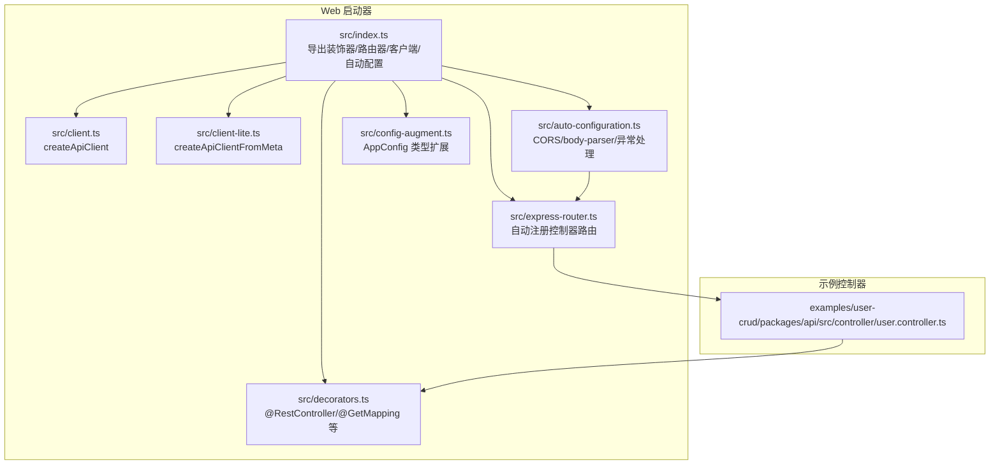
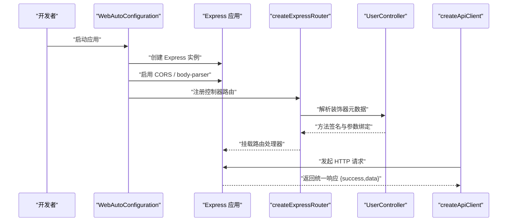
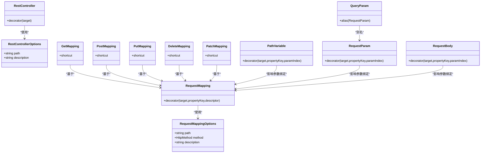
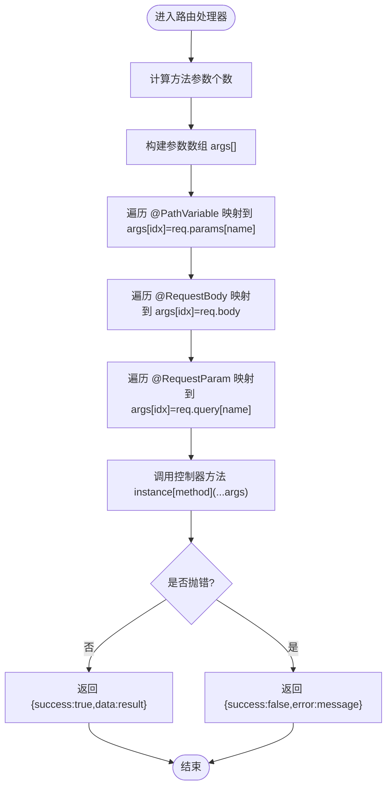
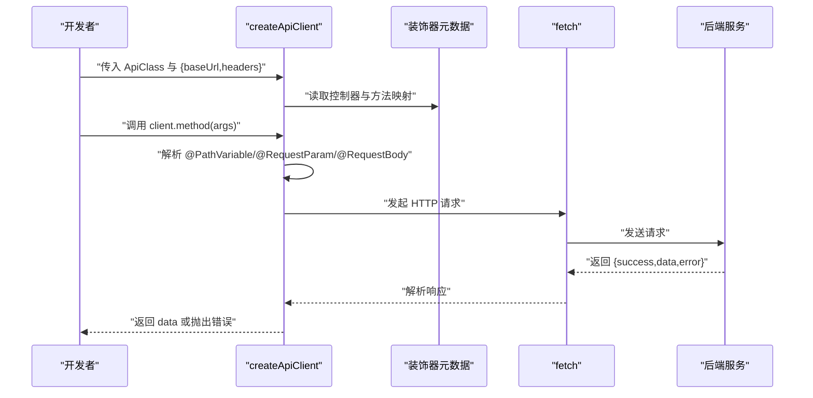
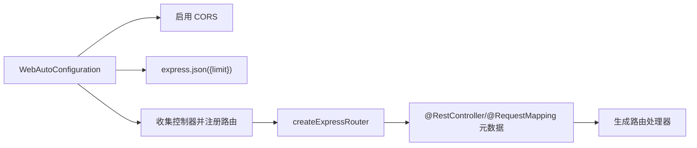
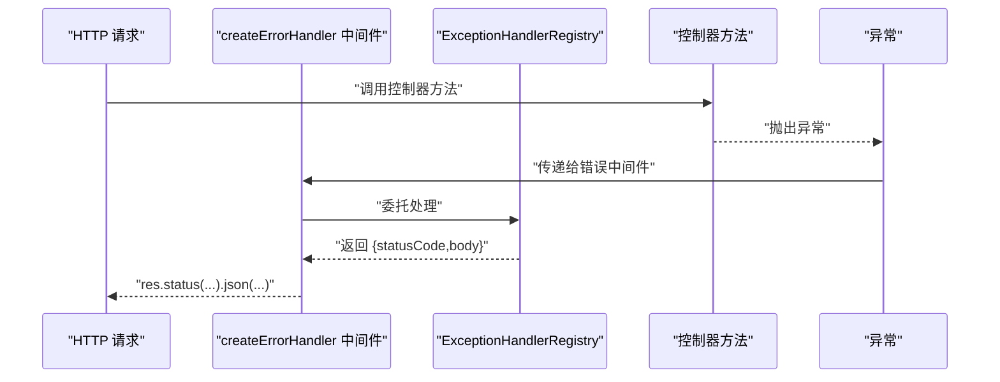
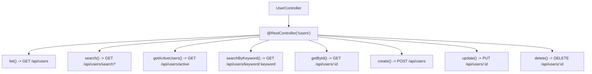
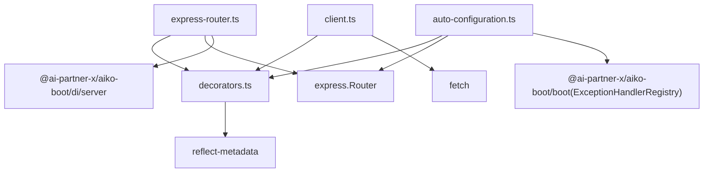

# Web 启动器 API

<cite>
**本文引用的文件**
- [packages/aiko-boot-starter-web/src/index.ts](file://packages/aiko-boot-starter-web/src/index.ts)
- [packages/aiko-boot-starter-web/src/decorators.ts](file://packages/aiko-boot-starter-web/src/decorators.ts)
- [packages/aiko-boot-starter-web/src/express-router.ts](file://packages/aiko-boot-starter-web/src/express-router.ts)
- [packages/aiko-boot-starter-web/src/client.ts](file://packages/aiko-boot-starter-web/src/client.ts)
- [packages/aiko-boot-starter-web/src/client-lite.ts](file://packages/aiko-boot-starter-web/src/client-lite.ts)
- [packages/aiko-boot-starter-web/src/auto-configuration.ts](file://packages/aiko-boot-starter-web/src/auto-configuration.ts)
- [packages/aiko-boot-starter-web/src/config-augment.ts](file://packages/aiko-boot-starter-web/src/config-augment.ts)
- [app/examples/user-crud/packages/api/src/controller/user.controller.ts](file://app/examples/user-crud/packages/api/src/controller/user.controller.ts)
- [app/examples/user-crud/packages/api/app.config.ts](file://app/examples/user-crud/packages/api/app.config.ts)
- [packages/aiko-boot/src/boot/exception.ts](file://packages/aiko-boot/src/boot/exception.ts)
</cite>

## 目录
1. [简介](#简介)
2. [项目结构](#项目结构)
3. [核心组件](#核心组件)
4. [架构总览](#架构总览)
5. [详细组件分析](#详细组件分析)
6. [依赖关系分析](#依赖关系分析)
7. [性能考量](#性能考量)
8. [故障排查指南](#故障排查指南)
9. [结论](#结论)
10. [附录](#附录)

## 简介
本文件为 Web 启动器 API 的权威参考文档，覆盖以下主题：
- 控制器装饰器 API：@RestController、@GetMapping、@PostMapping、@PutMapping、@DeleteMapping、@PatchMapping、@RequestMapping、@PathVariable、@RequestParam/@QueryParam、@RequestBody
- 路由参数绑定、请求体解析与统一响应处理
- API 客户端：基于装饰器的类型安全调用（createApiClient），以及无反射元数据的轻量版客户端（createApiClientFromMeta）
- 中间件集成、异常处理与 CORS 配置
- 完整控制器示例与路由配置说明
- 性能优化与安全最佳实践

## 项目结构
Web 启动器位于 packages/aiko-boot-starter-web，核心导出入口为 src/index.ts，主要子模块包括：
- 装饰器层：decorators.ts（控制器与参数装饰器）
- Express 路由层：express-router.ts（自动注册控制器为路由）
- 客户端层：client.ts（基于装饰器的类型安全客户端）、client-lite.ts（无反射的 SSR 友好客户端）
- 自动配置层：auto-configuration.ts（CORS、body-parser、路由注册、异常处理）
- 类型扩展：config-augment.ts（向 AppConfig 注入 server.* 配置）

**图表来源**
- [packages/aiko-boot-starter-web/src/index.ts](file://packages/aiko-boot-starter-web/src/index.ts#L1-L73)
- [packages/aiko-boot-starter-web/src/decorators.ts](file://packages/aiko-boot-starter-web/src/decorators.ts#L1-L196)
- [packages/aiko-boot-starter-web/src/express-router.ts](file://packages/aiko-boot-starter-web/src/express-router.ts#L1-L171)
- [packages/aiko-boot-starter-web/src/client.ts](file://packages/aiko-boot-starter-web/src/client.ts#L1-L233)
- [packages/aiko-boot-starter-web/src/client-lite.ts](file://packages/aiko-boot-starter-web/src/client-lite.ts#L1-L107)
- [packages/aiko-boot-starter-web/src/auto-configuration.ts](file://packages/aiko-boot-starter-web/src/auto-configuration.ts#L1-L160)
- [packages/aiko-boot-starter-web/src/config-augment.ts](file://packages/aiko-boot-starter-web/src/config-augment.ts#L1-L27)
- [app/examples/user-crud/packages/api/src/controller/user.controller.ts](file://app/examples/user-crud/packages/api/src/controller/user.controller.ts#L1-L170)

**章节来源**
- [packages/aiko-boot-starter-web/src/index.ts](file://packages/aiko-boot-starter-web/src/index.ts#L1-L73)

## 核心组件
- 控制器装饰器：@RestController、@GetMapping、@PostMapping、@PutMapping、@DeleteMapping、@PatchMapping、@RequestMapping
- 参数绑定装饰器：@PathVariable、@RequestParam/@QueryParam、@RequestBody
- Express 路由器：createExpressRouter，自动扫描控制器并注册路由
- API 客户端：createApiClient（基于装饰器元数据）、createApiClientFromMeta（静态元数据）
- 自动配置：WebAutoConfiguration，负责 CORS、body-parser、路由注册与全局异常处理
- 配置扩展：向 AppConfig 注入 server.* 配置项

**章节来源**
- [packages/aiko-boot-starter-web/src/decorators.ts](file://packages/aiko-boot-starter-web/src/decorators.ts#L1-L196)
- [packages/aiko-boot-starter-web/src/express-router.ts](file://packages/aiko-boot-starter-web/src/express-router.ts#L1-L171)
- [packages/aiko-boot-starter-web/src/client.ts](file://packages/aiko-boot-starter-web/src/client.ts#L1-L233)
- [packages/aiko-boot-starter-web/src/client-lite.ts](file://packages/aiko-boot-starter-web/src/client-lite.ts#L1-L107)
- [packages/aiko-boot-starter-web/src/auto-configuration.ts](file://packages/aiko-boot-starter-web/src/auto-configuration.ts#L1-L160)
- [packages/aiko-boot-starter-web/src/config-augment.ts](file://packages/aiko-boot-starter-web/src/config-augment.ts#L1-L27)

## 架构总览
Web 启动器采用“装饰器 + 自动配置”的 Spring Boot 风格设计：
- 开发者通过装饰器声明控制器与路由
- 自动配置阶段加载 server.* 配置，启用 CORS、body-parser，并注册控制器路由
- Express 路由器根据装饰器元数据将方法调用映射为 HTTP 请求处理
- 客户端通过装饰器或静态元数据生成类型安全的 API 调用

**图表来源**
- [packages/aiko-boot-starter-web/src/auto-configuration.ts](file://packages/aiko-boot-starter-web/src/auto-configuration.ts#L104-L146)
- [packages/aiko-boot-starter-web/src/express-router.ts](file://packages/aiko-boot-starter-web/src/express-router.ts#L102-L170)
- [packages/aiko-boot-starter-web/src/client.ts](file://packages/aiko-boot-starter-web/src/client.ts#L73-L144)
- [app/examples/user-crud/packages/api/src/controller/user.controller.ts](file://app/examples/user-crud/packages/api/src/controller/user.controller.ts#L30-L170)

## 详细组件分析

### 装饰器 API 规范
- @RestController(options)
  - 作用：标记类为 REST 控制器，支持基路径与描述
  - 选项：path（基路径）、description（描述）
  - 行为：自动注入构造函数依赖与 @Autowired 属性；注册为单例
- @GetMapping/@PostMapping/@PutMapping/@DeleteMapping/@PatchMapping
  - 作用：快捷声明 HTTP 方法映射
  - 参数：路径与描述（可选）
- @RequestMapping(options)
  - 通用映射装饰器，支持 path、method、description
- @PathVariable(name?)
  - 从 URL 路径中提取参数，支持命名
- @RequestParam(name?, required?)
  - 从查询字符串提取参数，支持命名与必填校验
- @QueryParam
  - @RequestParam 的别名
- @RequestBody()
  - 将整个请求体作为参数注入

**图表来源**
- [packages/aiko-boot-starter-web/src/decorators.ts](file://packages/aiko-boot-starter-web/src/decorators.ts#L26-L173)

**章节来源**
- [packages/aiko-boot-starter-web/src/decorators.ts](file://packages/aiko-boot-starter-web/src/decorators.ts#L26-L173)

### 路由参数绑定、请求体解析与统一响应
- 参数绑定顺序与规则
  - @PathVariable：按参数索引映射到 req.params[name]
  - @RequestBody：将整个 req.body 注入对应参数位置
  - @RequestParam/@QueryParam：按参数索引映射到 req.query[name]
- 统一响应格式
  - 成功：{ success: true, data: 返回值 }
  - 失败：{ success: false, error: 错误信息 }

**图表来源**
- [packages/aiko-boot-starter-web/src/express-router.ts](file://packages/aiko-boot-starter-web/src/express-router.ts#L126-L169)

**章节来源**
- [packages/aiko-boot-starter-web/src/express-router.ts](file://packages/aiko-boot-starter-web/src/express-router.ts#L126-L169)

### API 客户端：类型安全调用
- createApiClient(ApiClass, options)
  - 读取 @ApiContract 或 @RestController 的装饰器元数据
  - 生成类型安全的客户端方法，自动拼接 baseUrl + /api + basePath + path
  - 支持 @PathVariable、@RequestParam、@RequestBody 的参数映射
  - 统一响应解析：当 success=false 时抛出错误
- createApiClientFromMeta(meta, ApiClass, options)
  - 基于静态元数据对象创建客户端（无装饰器依赖）
  - 适合 SSR 环境（如 Next.js）

**图表来源**
- [packages/aiko-boot-starter-web/src/client.ts](file://packages/aiko-boot-starter-web/src/client.ts#L73-L144)
- [packages/aiko-boot-starter-web/src/client-lite.ts](file://packages/aiko-boot-starter-web/src/client-lite.ts#L47-L106)

**章节来源**
- [packages/aiko-boot-starter-web/src/client.ts](file://packages/aiko-boot-starter-web/src/client.ts#L73-L144)
- [packages/aiko-boot-starter-web/src/client-lite.ts](file://packages/aiko-boot-starter-web/src/client-lite.ts#L47-L106)

### Express 路由器与自动配置
- createExpressRouter(controllers, options)
  - 支持传入控制器类数组或模块导出对象
  - options: prefix（默认 /api）、verbose（是否输出注册日志）、instances（DI 失败回退）
  - 自动解析控制器实例（优先 DI，失败则直接实例化）
- WebAutoConfiguration
  - 读取 server.servlet.contextPath（默认 /api）、server.maxHttpPostSize（默认 10mb）
  - 默认启用 CORS，配置 express.json({ limit })，注册控制器路由
  - 注册全局异常处理中间件

**图表来源**
- [packages/aiko-boot-starter-web/src/auto-configuration.ts](file://packages/aiko-boot-starter-web/src/auto-configuration.ts#L104-L146)
- [packages/aiko-boot-starter-web/src/express-router.ts](file://packages/aiko-boot-starter-web/src/express-router.ts#L59-L82)

**章节来源**
- [packages/aiko-boot-starter-web/src/express-router.ts](file://packages/aiko-boot-starter-web/src/express-router.ts#L59-L82)
- [packages/aiko-boot-starter-web/src/auto-configuration.ts](file://packages/aiko-boot-starter-web/src/auto-configuration.ts#L104-L146)

### 异常处理与中间件集成
- 全局异常处理
  - WebAutoConfiguration 在自动配置阶段注册 createErrorHandler 中间件
  - 异常处理流程：捕获异常 -> 交由 ExceptionHandlerRegistry 处理 -> 统一返回 {statusCode, body}
- 异常装饰器与注册
  - @ExceptionHandler(exceptionTypes, options)：在控制器中声明异常处理器
  - ExceptionHandlerRegistry.initialize()：初始化并排序所有处理器
  - createErrorHandler()：Express 错误处理中间件工厂

**图表来源**
- [packages/aiko-boot-starter-web/src/auto-configuration.ts](file://packages/aiko-boot-starter-web/src/auto-configuration.ts#L140-L146)
- [packages/aiko-boot/src/boot/exception.ts](file://packages/aiko-boot/src/boot/exception.ts#L114-L131)
- [packages/aiko-boot/src/boot/exception.ts](file://packages/aiko-boot/src/boot/exception.ts#L246-L250)
- [packages/aiko-boot/src/boot/exception.ts](file://packages/aiko-boot/src/boot/exception.ts#L382-L388)

**章节来源**
- [packages/aiko-boot-starter-web/src/auto-configuration.ts](file://packages/aiko-boot-starter-web/src/auto-configuration.ts#L140-L146)
- [packages/aiko-boot/src/boot/exception.ts](file://packages/aiko-boot/src/boot/exception.ts#L114-L131)
- [packages/aiko-boot/src/boot/exception.ts](file://packages/aiko-boot/src/boot/exception.ts#L246-L250)
- [packages/aiko-boot/src/boot/exception.ts](file://packages/aiko-boot/src/boot/exception.ts#L382-L388)

### CORS 配置
- 默认启用 CORS 中间件（使用 cors 模块）
- 可通过 server.servlet.contextPath 配置上下文路径
- 若需定制 CORS 行为，可在自动配置之外自行添加 CORS 中间件

**章节来源**
- [packages/aiko-boot-starter-web/src/auto-configuration.ts](file://packages/aiko-boot-starter-web/src/auto-configuration.ts#L120-L122)

### 完整控制器示例与路由配置
- 示例控制器：UserController
  - 基路径：/users
  - 方法：list、search、getActiveUsers、searchByKeyword、getById、create、update、delete
  - 参数绑定：@PathVariable、@RequestBody、@RequestParam
- 示例配置：app.config.ts
  - server.port、server.servlet.contextPath、server.shutdown 等

**图表来源**
- [app/examples/user-crud/packages/api/src/controller/user.controller.ts](file://app/examples/user-crud/packages/api/src/controller/user.controller.ts#L30-L170)

**章节来源**
- [app/examples/user-crud/packages/api/src/controller/user.controller.ts](file://app/examples/user-crud/packages/api/src/controller/user.controller.ts#L30-L170)
- [app/examples/user-crud/packages/api/app.config.ts](file://app/examples/user-crud/packages/api/app.config.ts#L9-L17)

## 依赖关系分析
- 装饰器依赖 reflect-metadata，用于运行时读取控制器与方法元数据
- Express 路由器依赖 express.Router 与 @ai-partner-x/aiko-boot 的容器与注解能力
- 客户端依赖 fetch 与装饰器元数据（或静态元数据）
- 自动配置依赖 @ai-partner-x/aiko-boot 的配置加载与异常处理机制

**图表来源**
- [packages/aiko-boot-starter-web/src/decorators.ts](file://packages/aiko-boot-starter-web/src/decorators.ts#L5-L6)
- [packages/aiko-boot-starter-web/src/express-router.ts](file://packages/aiko-boot-starter-web/src/express-router.ts#L25-L27)
- [packages/aiko-boot-starter-web/src/client.ts](file://packages/aiko-boot-starter-web/src/client.ts#L13-L22)
- [packages/aiko-boot-starter-web/src/auto-configuration.ts](file://packages/aiko-boot-starter-web/src/auto-configuration.ts#L29-L31)

**章节来源**
- [packages/aiko-boot-starter-web/src/decorators.ts](file://packages/aiko-boot-starter-web/src/decorators.ts#L5-L6)
- [packages/aiko-boot-starter-web/src/express-router.ts](file://packages/aiko-boot-starter-web/src/express-router.ts#L25-L27)
- [packages/aiko-boot-starter-web/src/client.ts](file://packages/aiko-boot-starter-web/src/client.ts#L13-L22)
- [packages/aiko-boot-starter-web/src/auto-configuration.ts](file://packages/aiko-boot-starter-web/src/auto-configuration.ts#L29-L31)

## 性能考量
- 路由注册日志
  - Express 路由器支持 verbose 输出，生产环境建议关闭以减少日志开销
- 请求体大小限制
  - 通过 server.maxHttpPostSize 控制 express.json 的大小限制
- 统一响应与错误处理
  - 通过全局异常处理中间件集中处理错误，避免重复 try/catch
- 客户端缓存策略
  - 建议在客户端侧对 GET 请求进行缓存（如使用 HTTP 缓存头或业务层缓存）
- 参数绑定复杂度
  - 参数绑定为 O(n) 遍历，建议控制每个方法的参数数量，保持清晰的 DTO 设计

[本节为通用指导，无需特定文件来源]

## 故障排查指南
- 控制器未注册
  - 确认类上存在 @RestController 装饰器
  - 确认控制器被自动配置收集（在 ApplicationContext 的 controller 组件集合中）
- 路由未生效
  - 检查 server.servlet.contextPath 与 prefix 组合是否正确
  - 确认已调用 createExpressRouter 并挂载到 Express 应用
- 参数绑定异常
  - 检查 @PathVariable/@RequestParam/@RequestBody 的参数索引与名称是否匹配
  - 确认请求体为合法 JSON，且 Content-Type 为 application/json
- CORS 问题
  - 默认已启用 CORS，若遇到跨域问题，检查浏览器网络面板与服务端响应头
- 异常未被捕获
  - 确认已注册全局异常处理中间件
  - 检查 @ExceptionHandler 的异常类型是否匹配

**章节来源**
- [packages/aiko-boot-starter-web/src/express-router.ts](file://packages/aiko-boot-starter-web/src/express-router.ts#L102-L170)
- [packages/aiko-boot-starter-web/src/auto-configuration.ts](file://packages/aiko-boot-starter-web/src/auto-configuration.ts#L120-L146)
- [packages/aiko-boot/src/boot/exception.ts](file://packages/aiko-boot/src/boot/exception.ts#L382-L388)

## 结论
Web 启动器 API 提供了与 Spring Boot 风格一致的装饰器驱动开发体验，结合自动配置与类型安全客户端，能够快速搭建 REST API 并在前后端共享契约。通过统一的参数绑定、请求体解析与响应格式，配合 CORS 与全局异常处理，可显著提升开发效率与系统稳定性。

[本节为总结性内容，无需特定文件来源]

## 附录

### API 客户端使用要点
- createApiClient
  - 适用于前后端共享装饰器元数据的场景
  - 自动解析 @ApiContract/@RestController 的元数据
- createApiClientFromMeta
  - 适用于 SSR 或无法使用装饰器的场景
  - 通过静态元数据对象生成客户端

**章节来源**
- [packages/aiko-boot-starter-web/src/client.ts](file://packages/aiko-boot-starter-web/src/client.ts#L73-L144)
- [packages/aiko-boot-starter-web/src/client-lite.ts](file://packages/aiko-boot-starter-web/src/client-lite.ts#L47-L106)

### 配置项参考（AppConfig.server.*）
- server.port：服务端口
- server.servlet.contextPath：上下文路径（默认 /api）
- server.shutdown：关闭模式（graceful/immediate）
- server.maxHttpPostSize：请求体大小限制（默认 10mb）

**章节来源**
- [packages/aiko-boot-starter-web/src/auto-configuration.ts](file://packages/aiko-boot-starter-web/src/auto-configuration.ts#L48-L60)
- [app/examples/user-crud/packages/api/app.config.ts](file://app/examples/user-crud/packages/api/app.config.ts#L10-L17)