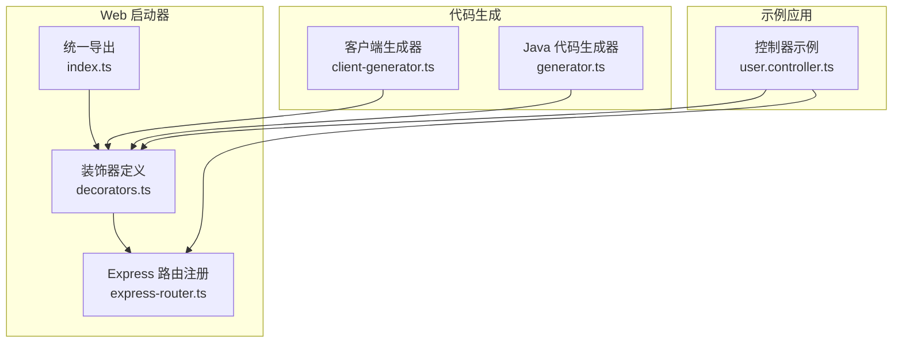
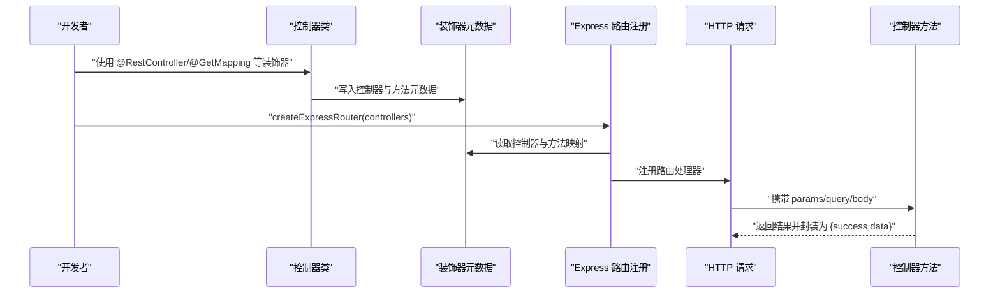
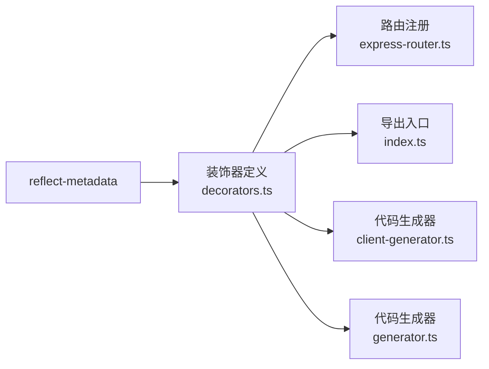

# 控制器装饰器

<cite>
**本文档引用的文件**
- [packages/aiko-boot-starter-web/src/decorators.ts](file://packages/aiko-boot-starter-web/src/decorators.ts)
- [packages/aiko-boot-starter-web/src/express-router.ts](file://packages/aiko-boot-starter-web/src/express-router.ts)
- [packages/aiko-boot-starter-web/src/index.ts](file://packages/aiko-boot-starter-web/src/index.ts)
- [app/examples/user-crud/packages/api/src/controller/user.controller.ts](file://app/examples/user-crud/packages/api/src/controller/user.controller.ts)
- [packages/aiko-boot-codegen/src/client-generator.ts](file://packages/aiko-boot-codegen/src/client-generator.ts)
- [packages/aiko-boot-codegen/src/generator.ts](file://packages/aiko-boot-codegen/src/generator.ts)
</cite>

## 目录
1. [简介](#简介)
2. [项目结构](#项目结构)
3. [核心组件](#核心组件)
4. [架构总览](#架构总览)
5. [详细组件分析](#详细组件分析)
6. [依赖关系分析](#依赖关系分析)
7. [性能考量](#性能考量)
8. [故障排除指南](#故障排除指南)
9. [结论](#结论)
10. [附录](#附录)

## 简介
本文件为控制器装饰器的详细 API 参考文档，覆盖以下装饰器与配套机制：
- 控制器类装饰器：@RestController
- HTTP 方法装饰器：@GetMapping、@PostMapping、@PutMapping、@DeleteMapping、@PatchMapping
- 通用映射装饰器：@RequestMapping
- 参数绑定装饰器：@PathVariable、@RequestParam/@QueryParam、@RequestBody
- 运行时元数据与路由注册：装饰器元数据读取与 Express 路由自动装配

目标是帮助开发者理解每个装饰器的参数选项、使用方法、配置项以及在实际项目中的最佳实践。

## 项目结构
本仓库中与控制器装饰器相关的核心位置如下：
- 装饰器定义与元数据：packages/aiko-boot-starter-web/src/decorators.ts
- Express 路由自动注册：packages/aiko-boot-starter-web/src/express-router.ts
- 统一导出入口：packages/aiko-boot-starter-web/src/index.ts
- 控制器使用示例：app/examples/user-crud/packages/api/src/controller/user.controller.ts
- 前端客户端生成（含装饰器识别）：packages/aiko-boot-codegen/src/client-generator.ts、packages/aiko-boot-codegen/src/generator.ts

图表来源
- [packages/aiko-boot-starter-web/src/decorators.ts](file://packages/aiko-boot-starter-web/src/decorators.ts#L1-L196)
- [packages/aiko-boot-starter-web/src/express-router.ts](file://packages/aiko-boot-starter-web/src/express-router.ts#L1-L171)
- [packages/aiko-boot-starter-web/src/index.ts](file://packages/aiko-boot-starter-web/src/index.ts#L1-L73)
- [app/examples/user-crud/packages/api/src/controller/user.controller.ts](file://app/examples/user-crud/packages/api/src/controller/user.controller.ts#L1-L170)
- [packages/aiko-boot-codegen/src/client-generator.ts](file://packages/aiko-boot-codegen/src/client-generator.ts#L1-L349)
- [packages/aiko-boot-codegen/src/generator.ts](file://packages/aiko-boot-codegen/src/generator.ts#L1-L800)

章节来源
- [packages/aiko-boot-starter-web/src/decorators.ts](file://packages/aiko-boot-starter-web/src/decorators.ts#L1-L196)
- [packages/aiko-boot-starter-web/src/express-router.ts](file://packages/aiko-boot-starter-web/src/express-router.ts#L1-L171)
- [packages/aiko-boot-starter-web/src/index.ts](file://packages/aiko-boot-starter-web/src/index.ts#L1-L73)
- [app/examples/user-crud/packages/api/src/controller/user.controller.ts](file://app/examples/user-crud/packages/api/src/controller/user.controller.ts#L1-L170)
- [packages/aiko-boot-codegen/src/client-generator.ts](file://packages/aiko-boot-codegen/src/client-generator.ts#L1-L349)
- [packages/aiko-boot-codegen/src/generator.ts](file://packages/aiko-boot-codegen/src/generator.ts#L1-L800)

## 核心组件
本节概述控制器装饰器体系及其职责边界：
- 装饰器层：定义控制器类与方法的映射规则，并将元数据写入反射存储
- 路由层：读取控制器元数据与方法映射，自动生成 Express 路由并注入参数
- 导出层：统一导出装饰器与工具函数，便于上层应用按需引入
- 生成层：代码生成器可识别装饰器与参数注解，用于生成前端 API 客户端或 Java 服务端代码

章节来源
- [packages/aiko-boot-starter-web/src/decorators.ts](file://packages/aiko-boot-starter-web/src/decorators.ts#L1-L196)
- [packages/aiko-boot-starter-web/src/express-router.ts](file://packages/aiko-boot-starter-web/src/express-router.ts#L1-L171)
- [packages/aiko-boot-starter-web/src/index.ts](file://packages/aiko-boot-starter-web/src/index.ts#L1-L73)

## 架构总览
下图展示了装饰器如何驱动路由注册与请求处理：

图表来源
- [packages/aiko-boot-starter-web/src/decorators.ts](file://packages/aiko-boot-starter-web/src/decorators.ts#L50-L135)
- [packages/aiko-boot-starter-web/src/express-router.ts](file://packages/aiko-boot-starter-web/src/express-router.ts#L102-L170)

## 详细组件分析

### @RestController：控制器类装饰器
- 作用：标记类为 REST 控制器，支持基础路径配置与控制器元数据
- 参数选项
  - path?: string —— 控制器基础路径（拼接在路由前缀之后）
  - description?: string —— 控制器描述信息（可用于文档生成）
- 行为要点
  - 写入控制器元数据，包含类名与基础路径
  - 自动注入构造函数参数类型对应的依赖（基于设计时类型元数据）
  - 应用可注入与单例装饰，确保实例生命周期与依赖注入生效
- 最佳实践
  - 在类级别设置 path，避免在每个方法重复前缀
  - 使用 description 提升 API 文档可读性
  - 结合 @Autowired 属性注入，减少显式构造函数参数

章节来源
- [packages/aiko-boot-starter-web/src/decorators.ts](file://packages/aiko-boot-starter-web/src/decorators.ts#L50-L88)
- [packages/aiko-boot-starter-web/src/decorators.ts](file://packages/aiko-boot-starter-web/src/decorators.ts#L26-L31)
- [packages/aiko-boot-starter-web/src/decorators.ts](file://packages/aiko-boot-starter-web/src/decorators.ts#L177-L183)

### @RequestMapping：通用映射装饰器
- 作用：通用的请求映射装饰器，可同时指定路径与 HTTP 方法
- 参数选项
  - path?: string —— 方法级相对路径
  - method?: HttpMethod —— HTTP 方法（GET/POST/PUT/DELETE/PATCH）
  - description?: string —— 方法描述（可用于文档生成）
- 使用建议
  - 作为 @GetMapping/@PostMapping 等的底层实现
  - 当需要更细粒度控制（如自定义方法或复杂描述）时使用

章节来源
- [packages/aiko-boot-starter-web/src/decorators.ts](file://packages/aiko-boot-starter-web/src/decorators.ts#L128-L135)
- [packages/aiko-boot-starter-web/src/decorators.ts](file://packages/aiko-boot-starter-web/src/decorators.ts#L36-L43)
- [packages/aiko-boot-starter-web/src/decorators.ts](file://packages/aiko-boot-starter-web/src/decorators.ts#L21)

### @GetMapping/@PostMapping/@PutMapping/@DeleteMapping/@PatchMapping：HTTP 方法装饰器
- 作用：快捷装饰器，分别对应 GET/POST/PUT/DELETE/PATCH
- 参数选项
  - path?: string —— 方法级相对路径（默认空字符串）
  - description?: string —— 方法描述（可选）
- 实现机制
  - 基于 @RequestMapping，内部设置 method 字段
- 使用建议
  - 优先使用对应方法装饰器，提升语义清晰度
  - 与 @PathVariable、@RequestParam、@RequestBody 组合进行参数绑定

章节来源
- [packages/aiko-boot-starter-web/src/decorators.ts](file://packages/aiko-boot-starter-web/src/decorators.ts#L93-L123)
- [packages/aiko-boot-starter-web/src/decorators.ts](file://packages/aiko-boot-starter-web/src/decorators.ts#L128-L135)

### 参数绑定装饰器：@PathVariable、@RequestParam/@QueryParam、@RequestBody
- @PathVariable
  - 作用：从 URL 路径中提取变量
  - 参数：name?: string —— 变量名（未提供时使用参数索引推断）
  - 注入时机：在路由注册阶段根据方法形参索引注入 req.params[name]
- @RequestParam/@QueryParam
  - 作用：从查询字符串中提取参数
  - 参数：name?: string —— 参数名；required?: boolean —— 是否标记为必填（仅元数据层面）
  - 注入时机：根据方法形参索引注入 req.query[name]
- @RequestBody
  - 作用：将整个请求体注入为目标参数
  - 参数：无
  - 注入时机：根据方法形参索引注入 req.body
- 绑定流程（概览）
  - 路由注册时读取各装饰器元数据
  - 构造实参数组，按索引填充路径变量、请求体与查询参数
  - 调用控制器方法并将结果封装为 { success, data }

章节来源
- [packages/aiko-boot-starter-web/src/decorators.ts](file://packages/aiko-boot-starter-web/src/decorators.ts#L140-L173)
- [packages/aiko-boot-starter-web/src/decorators.ts](file://packages/aiko-boot-starter-web/src/decorators.ts#L185-L195)
- [packages/aiko-boot-starter-web/src/express-router.ts](file://packages/aiko-boot-starter-web/src/express-router.ts#L126-L170)

### 路由注册与运行时处理
- 路由前缀与路径拼接
  - 前缀：默认 "/api"，可通过 createExpressRouter(options.prefix) 配置
  - 基础路径：@RestController 的 path
  - 方法路径：@GetMapping/@PostMapping 等的 path
  - 最终路径：prefix + controllerBasePath + methodPath
- 参数注入策略
  - @PathVariable：按参数索引映射到 req.params[name]
  - @RequestBody：按参数索引映射到 req.body
  - @RequestParam：按参数索引映射到 req.query[name]
- 响应格式
  - 成功：{ success: true, data: 返回值 }
  - 失败：{ success: false, error: 错误消息 }

章节来源
- [packages/aiko-boot-starter-web/src/express-router.ts](file://packages/aiko-boot-starter-web/src/express-router.ts#L29-L44)
- [packages/aiko-boot-starter-web/src/express-router.ts](file://packages/aiko-boot-starter-web/src/express-router.ts#L115-L170)

### 控制器类示例与使用模式
以下示例来自用户 CRUD 示例工程，展示装饰器在实际项目中的组合使用：
- 控制器类装饰器：@RestController({ path: '/users' })
- 列表与搜索：@GetMapping()、@GetMapping('/search')
- 获取详情：@GetMapping('/:id')
- 新增：@PostMapping()，配合 @RequestBody
- 更新：@PutMapping('/:id')，配合 @PathVariable 与 @RequestBody
- 删除：@DeleteMapping('/:id')，配合 @PathVariable
- 批量与条件操作：@PutMapping('/batch/age')、@DeleteMapping('/batch')，配合 @RequestBody

章节来源
- [app/examples/user-crud/packages/api/src/controller/user.controller.ts](file://app/examples/user-crud/packages/api/src/controller/user.controller.ts#L30-L169)

### 装饰器链式调用与类型安全最佳实践
- 链式调用
  - 方法装饰器与参数装饰器可叠加使用，例如 @PutMapping('/:id') 与 @PathVariable、@RequestBody 组合
  - 通用映射 @RequestMapping 可用于自定义方法或复杂场景
- 类型安全
  - 使用 TypeScript 接口与 DTO 明确参数与返回值类型
  - 代码生成器可识别装饰器与参数注解，生成前端 API 客户端或 Java 服务端代码
- 元数据与生成
  - 代码生成器 client-generator.ts 会解析控制器类上的 @RestController 与方法装饰器（如 GetMapping、PostMapping 等），提取 basePath 与方法元数据
  - generator.ts 会将 TypeScript 装饰器转换为 Java 注解（如 @RestController、@RequestMapping、@GetMapping 等），并处理参数注解（@PathVariable、@RequestParam、@RequestBody）

章节来源
- [packages/aiko-boot-codegen/src/client-generator.ts](file://packages/aiko-boot-codegen/src/client-generator.ts#L33-L147)
- [packages/aiko-boot-codegen/src/generator.ts](file://packages/aiko-boot-codegen/src/generator.ts#L476-L688)

## 依赖关系分析
- 装饰器定义依赖 reflect-metadata 以存储元数据
- Express 路由注册依赖装饰器提供的元数据读取函数
- 统一导出入口集中导出装饰器与工具函数
- 代码生成器依赖装饰器元数据进行前端/后端代码生成

图表来源
- [packages/aiko-boot-starter-web/src/decorators.ts](file://packages/aiko-boot-starter-web/src/decorators.ts#L5-L6)
- [packages/aiko-boot-starter-web/src/express-router.ts](file://packages/aiko-boot-starter-web/src/express-router.ts#L19-L27)
- [packages/aiko-boot-starter-web/src/index.ts](file://packages/aiko-boot-starter-web/src/index.ts#L14-L34)
- [packages/aiko-boot-codegen/src/client-generator.ts](file://packages/aiko-boot-codegen/src/client-generator.ts#L1-L14)
- [packages/aiko-boot-codegen/src/generator.ts](file://packages/aiko-boot-codegen/src/generator.ts#L1-L10)

章节来源
- [packages/aiko-boot-starter-web/src/decorators.ts](file://packages/aiko-boot-starter-web/src/decorators.ts#L1-L196)
- [packages/aiko-boot-starter-web/src/express-router.ts](file://packages/aiko-boot-starter-web/src/express-router.ts#L1-L171)
- [packages/aiko-boot-starter-web/src/index.ts](file://packages/aiko-boot-starter-web/src/index.ts#L1-L73)
- [packages/aiko-boot-codegen/src/client-generator.ts](file://packages/aiko-boot-codegen/src/client-generator.ts#L1-L349)
- [packages/aiko-boot-codegen/src/generator.ts](file://packages/aiko-boot-codegen/src/generator.ts#L1-L800)

## 性能考量
- 元数据读取成本低：装饰器仅在类加载时写入一次元数据，路由注册时读取元数据开销较小
- 参数注入按索引填充：避免复杂解析，降低运行时开销
- 前缀与路径拼接：建议统一前缀与基础路径，减少字符串拼接次数
- 异常处理：统一错误响应格式，便于前端处理与日志追踪

## 故障排除指南
- 未注册路由
  - 检查是否使用 @RestController 标记类
  - 确认方法是否使用了 @GetMapping/@PostMapping 等装饰器
  - 确认已调用 createExpressRouter 并传入控制器集合
- 参数未注入
  - 确认参数是否使用了 @PathVariable、@RequestParam 或 @RequestBody
  - 确认方法形参顺序与装饰器索引一致
- 路由冲突
  - 检查同一控制器内是否存在相同路径与方法的冲突
- 响应格式异常
  - 控制器方法应返回可序列化数据；框架会自动包装为 { success, data }

章节来源
- [packages/aiko-boot-starter-web/src/express-router.ts](file://packages/aiko-boot-starter-web/src/express-router.ts#L102-L170)

## 结论
本装饰器体系以 Spring Boot 风格为核心，提供简洁直观的控制器开发体验。通过装饰器元数据与 Express 路由自动注册，开发者可以专注于业务逻辑；借助代码生成器，可进一步打通前后端契约与文档生成。建议在项目中统一使用方法级装饰器、参数装饰器与基础路径配置，结合 DTO 与类型系统，确保接口的可维护性与类型安全。

## 附录
- 统一导出清单（部分）
  - @RestController、@GetMapping、@PostMapping、@PutMapping、@DeleteMapping、@PatchMapping、@RequestMapping
  - @PathVariable、@RequestParam、@QueryParam、@RequestBody
  - 元数据读取函数：getControllerMetadata、getRequestMappings、getPathVariables、getRequestParams、getRequestBody
  - Express 路由创建：createExpressRouter
  - 客户端生成：ApiContract、createApiClient、createApiClientFromMeta

章节来源
- [packages/aiko-boot-starter-web/src/index.ts](file://packages/aiko-boot-starter-web/src/index.ts#L14-L58)