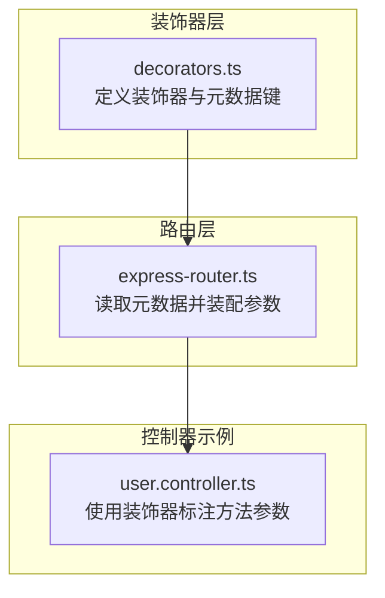
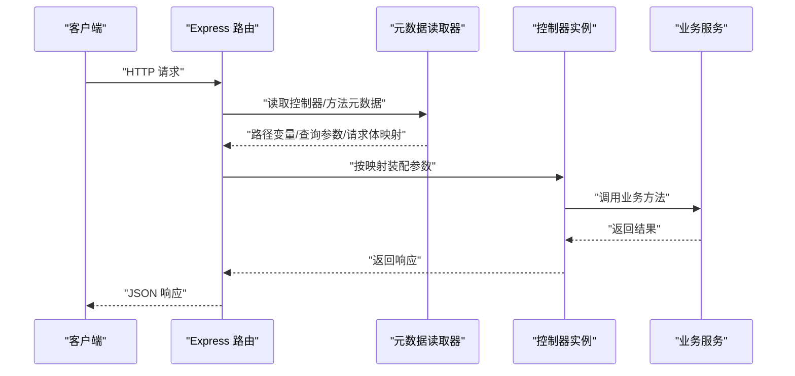
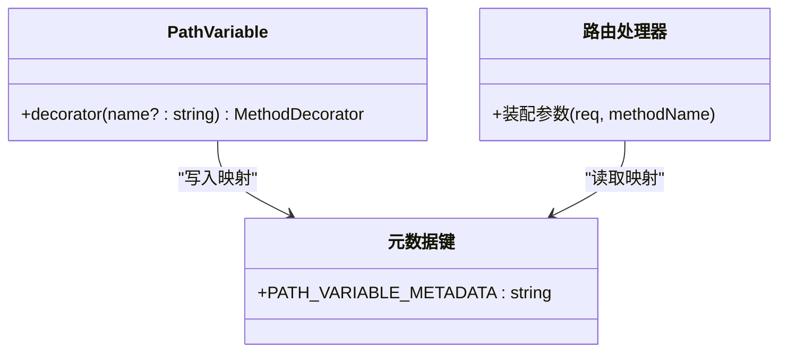
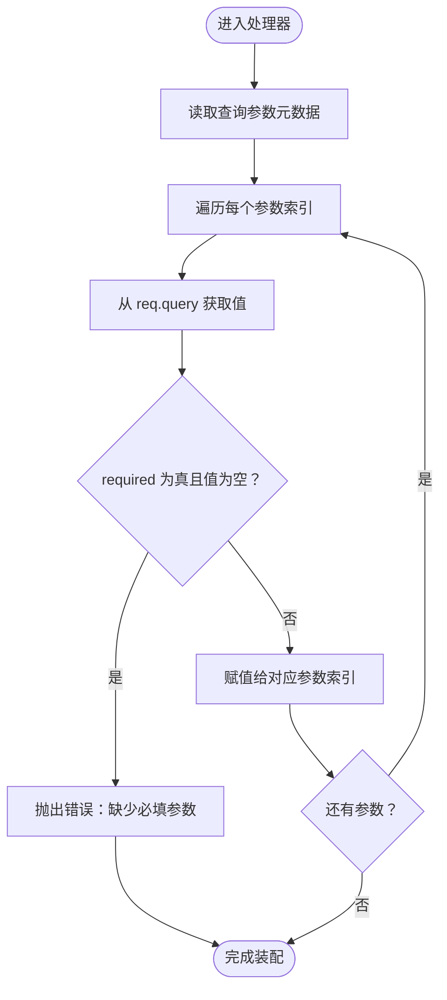
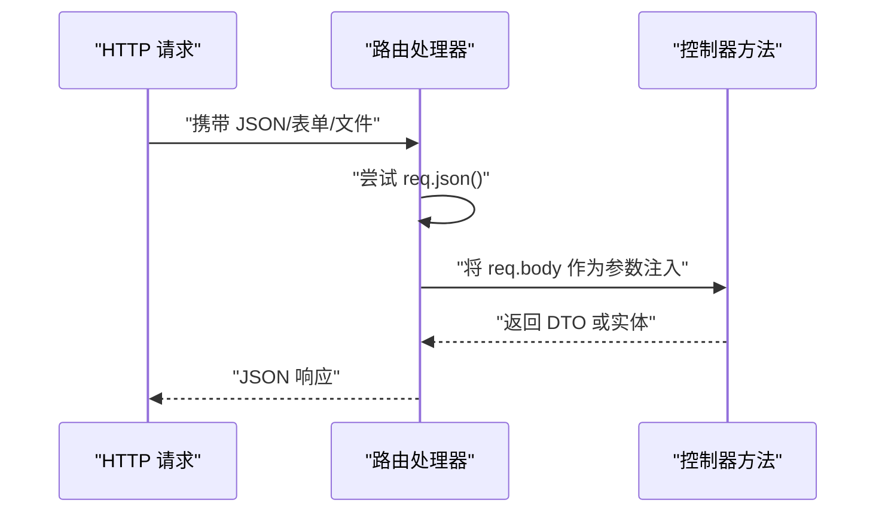
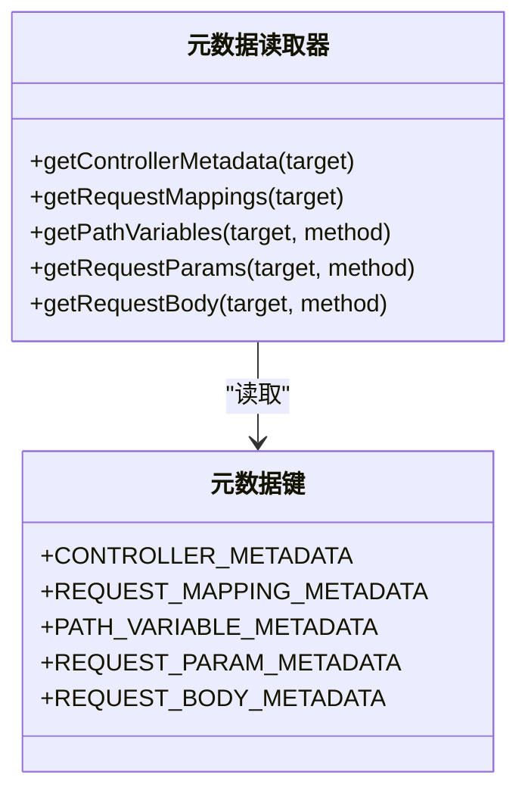

# 请求参数绑定

<cite>
**本文引用的文件**
- [packages/aiko-boot-starter-web/src/decorators.ts](file://packages/aiko-boot-starter-web/src/decorators.ts)
- [packages/aiko-boot-starter-web/src/express-router.ts](file://packages/aiko-boot-starter-web/src/express-router.ts)
- [packages/aiko-boot-starter-web/src/index.ts](file://packages/aiko-boot-starter-web/src/index.ts)
- [app/examples/user-crud/packages/api/src/controller/user.controller.ts](file://app/examples/user-crud/packages/api/src/controller/user.controller.ts)
</cite>

## 目录
1. [简介](#简介)
2. [项目结构](#项目结构)
3. [核心组件](#核心组件)
4. [架构总览](#架构总览)
5. [详细组件分析](#详细组件分析)
6. [依赖关系分析](#依赖关系分析)
7. [性能考量](#性能考量)
8. [故障排查指南](#故障排查指南)
9. [结论](#结论)
10. [附录](#附录)

## 简介
本文件为“请求参数绑定”系统的完整 API 参考文档，聚焦于装饰器驱动的参数绑定能力，覆盖以下要点：
- @PathVariable：路径变量提取，支持命名参数与索引参数的映射
- @RequestParam：查询参数绑定，支持必填、默认值与类型转换
- @RequestBody：请求体解析，支持 JSON 对象、表单数据与文件上传（基于框架对 req.body 的统一接入）
- 参数绑定的类型安全与验证机制：结合 TypeScript 类型系统与装饰器元数据
- 复杂对象绑定、数组参数与嵌套对象的处理思路
- 参数元数据获取与反射系统的使用方法

该系统完全对齐 Spring Boot 风格，通过装饰器在编译期收集元数据，并在运行时由路由层按元数据装配实参。

## 项目结构
围绕参数绑定的关键模块与文件如下：
- 装饰器层：定义 @PathVariable、@RequestParam、@RequestBody 等装饰器及元数据键
- 路由层：从装饰器元数据中读取参数映射，将 req.params、req.query、req.body 绑定到控制器方法参数
- 控制器示例：展示如何在控制器方法上使用上述装饰器进行参数绑定

图表来源
- [packages/aiko-boot-starter-web/src/decorators.ts](file://packages/aiko-boot-starter-web/src/decorators.ts#L1-L196)
- [packages/aiko-boot-starter-web/src/express-router.ts](file://packages/aiko-boot-starter-web/src/express-router.ts#L102-L170)
- [app/examples/user-crud/packages/api/src/controller/user.controller.ts](file://app/examples/user-crud/packages/api/src/controller/user.controller.ts#L30-L170)

章节来源
- [packages/aiko-boot-starter-web/src/decorators.ts](file://packages/aiko-boot-starter-web/src/decorators.ts#L1-L196)
- [packages/aiko-boot-starter-web/src/express-router.ts](file://packages/aiko-boot-starter-web/src/express-router.ts#L1-L171)
- [app/examples/user-crud/packages/api/src/controller/user.controller.ts](file://app/examples/user-crud/packages/api/src/controller/user.controller.ts#L1-L170)

## 核心组件
- 元数据键与装饰器工厂
  - 元数据键：CONTROLLER_METADATA、REQUEST_MAPPING_METADATA、PATH_VARIABLE_METADATA、REQUEST_PARAM_METADATA、REQUEST_BODY_METADATA
  - 装饰器：PathVariable、RequestParam（含 QueryParam 别名）、RequestBody
- 元数据读取器
  - getControllerMetadata、getRequestMappings、getPathVariables、getRequestParams、getRequestBody
- 路由注册与参数装配
  - createExpressRouter：自动扫描控制器，注册路由并生成处理器
  - 在处理器内部，依据元数据将 req.params、req.query、req.body 映射到控制器方法参数

章节来源
- [packages/aiko-boot-starter-web/src/decorators.ts](file://packages/aiko-boot-starter-web/src/decorators.ts#L8-L195)
- [packages/aiko-boot-starter-web/src/express-router.ts](file://packages/aiko-boot-starter-web/src/express-router.ts#L102-L170)
- [packages/aiko-boot-starter-web/src/index.ts](file://packages/aiko-boot-starter-web/src/index.ts#L14-L34)

## 架构总览
下图展示了从装饰器到控制器调用的完整流程：

图表来源
- [packages/aiko-boot-starter-web/src/express-router.ts](file://packages/aiko-boot-starter-web/src/express-router.ts#L126-L169)
- [packages/aiko-boot-starter-web/src/decorators.ts](file://packages/aiko-boot-starter-web/src/decorators.ts#L177-L195)

## 详细组件分析

### @PathVariable：路径变量提取
- 功能概述
  - 将 URL 路径中的变量映射到控制器方法参数位置
  - 支持命名参数与索引参数两种方式
- API 规范
  - 装饰器：PathVariable(name?: string)
  - 当未指定 name 时，使用默认命名规则（如 param0、param1…）
  - 运行时：根据方法参数索引从 req.params 中取出对应字段
- 使用示例（来自控制器）
  - 路由：/users/{id}
  - 方法：@GetMapping('/:id')，参数：@PathVariable('id') id: string
  - 复杂示例：/users/keyword/{keyword}，参数：@PathVariable('keyword') keyword: string
- 类图（代码级）

图表来源
- [packages/aiko-boot-starter-web/src/decorators.ts](file://packages/aiko-boot-starter-web/src/decorators.ts#L137-L146)
- [packages/aiko-boot-starter-web/src/express-router.ts](file://packages/aiko-boot-starter-web/src/express-router.ts#L126-L169)

章节来源
- [packages/aiko-boot-starter-web/src/decorators.ts](file://packages/aiko-boot-starter-web/src/decorators.ts#L137-L146)
- [app/examples/user-crud/packages/api/src/controller/user.controller.ts](file://app/examples/user-crud/packages/api/src/controller/user.controller.ts#L89-L97)
- [packages/aiko-boot-starter-web/src/express-router.ts](file://packages/aiko-boot-starter-web/src/express-router.ts#L126-L169)

### @RequestParam：查询参数绑定
- 功能概述
  - 将查询字符串参数映射到控制器方法参数
  - 支持必填参数校验与默认值策略
- API 规范
  - 装饰器：RequestParam(name?: string, required?: boolean)
  - 别名：QueryParam = RequestParam
  - 必填校验：当 required 为 true 且请求中缺失该参数时抛出错误
  - 默认值：可通过方法参数默认值或在方法体内进行兜底
- 使用示例（来自控制器）
  - 多个可选查询参数：username、email、minAge、maxAge、page、pageSize、orderBy、orderDir
  - 类型转换：在方法体内将字符串转换为数字或枚举
- 流程图（运行时装配）

图表来源
- [packages/aiko-boot-starter-web/src/express-router.ts](file://packages/aiko-boot-starter-web/src/express-router.ts#L147-L151)
- [app/examples/user-crud/packages/api/src/controller/user.controller.ts](file://app/examples/user-crud/packages/api/src/controller/user.controller.ts#L46-L76)

章节来源
- [packages/aiko-boot-starter-web/src/decorators.ts](file://packages/aiko-boot-starter-web/src/decorators.ts#L148-L162)
- [app/examples/user-crud/packages/api/src/controller/user.controller.ts](file://app/examples/user-crud/packages/api/src/controller/user.controller.ts#L46-L76)
- [packages/aiko-boot-starter-web/src/express-router.ts](file://packages/aiko-boot-starter-web/src/express-router.ts#L147-L151)

### @RequestBody：请求体解析
- 功能概述
  - 将请求体整体作为单一参数注入到控制器方法
  - 支持 JSON 对象、表单数据与文件上传（取决于上游中间件与请求格式）
- API 规范
  - 装饰器：RequestBody()
  - 运行时：从 req.body 直接取值；若 JSON 解析失败则赋空值
- 使用示例（来自控制器）
  - POST /users：@RequestBody() dto: CreateUserDto
  - PUT /users/batch/age：@RequestBody() body: BatchUpdateAgeDto
  - PUT /users/{id}/email：@RequestBody() body: UpdateEmailDto
  - DELETE /users/batch：@RequestBody() body: BatchDeleteDto
- 序列图（请求体装配）

图表来源
- [packages/aiko-boot-starter-web/src/express-router.ts](file://packages/aiko-boot-starter-web/src/express-router.ts#L142-L145)
- [app/examples/user-crud/packages/api/src/controller/user.controller.ts](file://app/examples/user-crud/packages/api/src/controller/user.controller.ts#L99-L168)

章节来源
- [packages/aiko-boot-starter-web/src/decorators.ts](file://packages/aiko-boot-starter-web/src/decorators.ts#L164-L173)
- [app/examples/user-crud/packages/api/src/controller/user.controller.ts](file://app/examples/user-crud/packages/api/src/controller/user.controller.ts#L99-L168)
- [packages/aiko-boot-starter-web/src/express-router.ts](file://packages/aiko-boot-starter-web/src/express-router.ts#L142-L145)

### 参数元数据获取与反射系统
- 元数据键
  - CONTROLLER_METADATA、REQUEST_MAPPING_METADATA、PATH_VARIABLE_METADATA、REQUEST_PARAM_METADATA、REQUEST_BODY_METADATA
- 元数据读取器
  - getControllerMetadata、getRequestMappings、getPathVariables、getRequestParams、getRequestBody
- 使用建议
  - 在路由层或工具层通过这些读取器访问装饰器元数据
  - 结合 TypeScript 类型注解，确保参数类型安全
- 代码级类图

图表来源
- [packages/aiko-boot-starter-web/src/decorators.ts](file://packages/aiko-boot-starter-web/src/decorators.ts#L8-L195)

章节来源
- [packages/aiko-boot-starter-web/src/decorators.ts](file://packages/aiko-boot-starter-web/src/decorators.ts#L8-L195)
- [packages/aiko-boot-starter-web/src/index.ts](file://packages/aiko-boot-starter-web/src/index.ts#L14-L34)

### 类型安全与验证机制
- 类型安全
  - 装饰器与元数据配合 TypeScript 类型注解，确保参数类型在编译期受控
  - 控制器方法参数类型即为最终注入的类型（如 DTO、基本类型）
- 验证机制
  - 必填参数：RequestParam(required=true) 会在缺失时触发错误
  - 类型转换：在方法体内将字符串转换为数值、枚举等
  - 建议：结合校验库（如 aiko-boot-starter-validation）进行更严格的参数校验

章节来源
- [packages/aiko-boot-starter-web/src/decorators.ts](file://packages/aiko-boot-starter-web/src/decorators.ts#L148-L162)
- [app/examples/user-crud/packages/api/src/controller/user.controller.ts](file://app/examples/user-crud/packages/api/src/controller/user.controller.ts#L46-L76)

### 复杂对象绑定、数组与嵌套对象
- 复杂对象绑定
  - 使用 @RequestBody 接收 DTO 对象，框架不做深层转换，需在方法体内进行类型转换或借助序列化库
- 数组参数
  - 查询参数数组：可通过多个同名键传递（如 page=1&pageSize=10），在方法体内合并为数组
  - 请求体数组：直接使用数组类型的 DTO 字段
- 嵌套对象
  - 使用嵌套 DTO 字段，框架按原样注入 req.body，具体解析由业务逻辑或序列化库负责

章节来源
- [app/examples/user-crud/packages/api/src/controller/user.controller.ts](file://app/examples/user-crud/packages/api/src/controller/user.controller.ts#L99-L168)
- [packages/aiko-boot-starter-web/src/express-router.ts](file://packages/aiko-boot-starter-web/src/express-router.ts#L142-L145)

## 依赖关系分析
- 装饰器依赖 reflect-metadata 提供元数据存储
- 路由层依赖装饰器提供的元数据读取器
- 控制器示例依赖装饰器与 DTO 定义

图表来源
- [packages/aiko-boot-starter-web/src/decorators.ts](file://packages/aiko-boot-starter-web/src/decorators.ts#L5-L6)
- [packages/aiko-boot-starter-web/src/express-router.ts](file://packages/aiko-boot-starter-web/src/express-router.ts#L19-L27)
- [app/examples/user-crud/packages/api/src/controller/user.controller.ts](file://app/examples/user-crud/packages/api/src/controller/user.controller.ts#L4-L28)

章节来源
- [packages/aiko-boot-starter-web/src/decorators.ts](file://packages/aiko-boot-starter-web/src/decorators.ts#L5-L6)
- [packages/aiko-boot-starter-web/src/express-router.ts](file://packages/aiko-boot-starter-web/src/express-router.ts#L19-L27)
- [app/examples/user-crud/packages/api/src/controller/user.controller.ts](file://app/examples/user-crud/packages/api/src/controller/user.controller.ts#L4-L28)

## 性能考量
- 元数据读取成本低：仅在路由注册阶段读取一次，运行时按索引直接赋值
- 参数装配为 O(n)：n 为方法参数数量，通常很小
- JSON 解析：仅在使用 @RequestBody 时进行，建议在上游中间件开启 JSON 解析

## 故障排查指南
- 缺少必填查询参数
  - 现象：请求返回 400，提示缺少必填参数
  - 排查：确认 @RequestParam(required=true) 的参数是否在请求中提供
- 路径变量未匹配
  - 现象：参数为 undefined
  - 排查：确认路由定义与 @PathVariable 的 name 是否一致
- 请求体解析失败
  - 现象：@RequestBody 注入 null
  - 排查：确认请求头 Content-Type 与请求体格式匹配，上游中间件已启用 JSON 解析

章节来源
- [packages/aiko-boot-starter-web/src/express-router.ts](file://packages/aiko-boot-starter-web/src/express-router.ts#L142-L145)
- [packages/aiko-boot-starter-web/src/express-router.ts](file://packages/aiko-boot-starter-web/src/express-router.ts#L160-L165)

## 结论
本参数绑定系统以装饰器为核心，通过元数据与反射实现声明式的参数装配，具备良好的类型安全与可维护性。结合控制器示例，开发者可以快速实现路径变量、查询参数与请求体的绑定，并在此基础上扩展复杂对象、数组与嵌套对象的处理。

## 附录
- 快速对照表
  - @PathVariable：将 req.params[name] 注入到对应参数索引
  - @RequestParam：将 req.query[name] 注入到对应参数索引，支持 required 校验
  - @RequestBody：将 req.body 注入到对应参数索引
- 相关导出
  - 装饰器与读取器：见 packages/aiko-boot-starter-web/src/index.ts

章节来源
- [packages/aiko-boot-starter-web/src/index.ts](file://packages/aiko-boot-starter-web/src/index.ts#L14-L34)