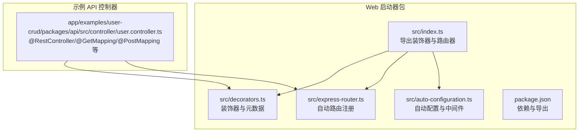
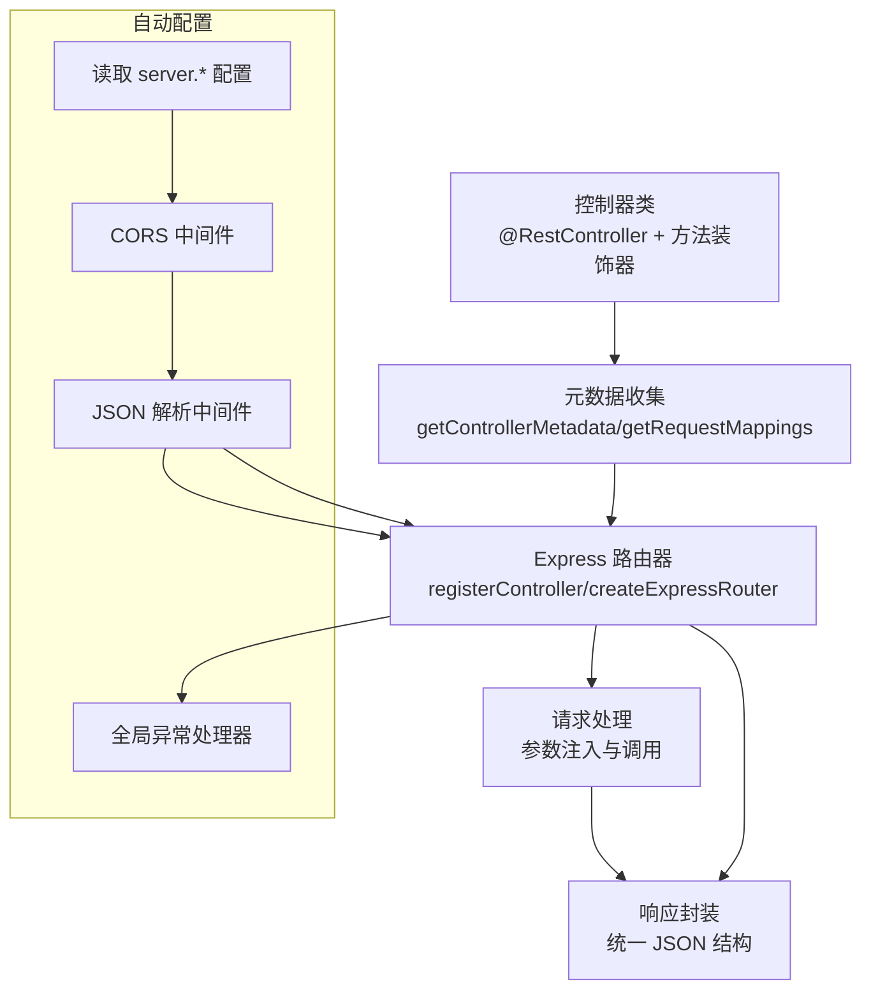
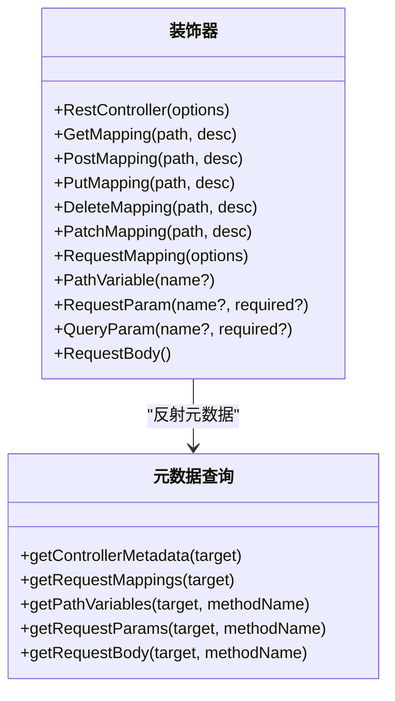
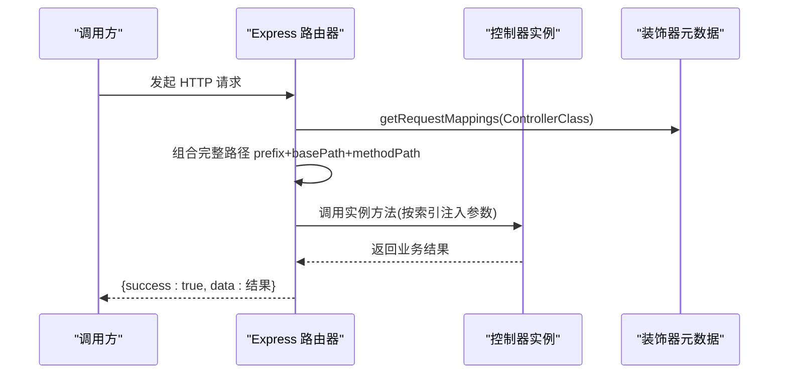
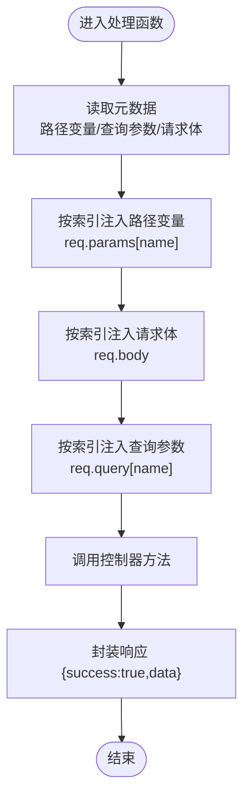
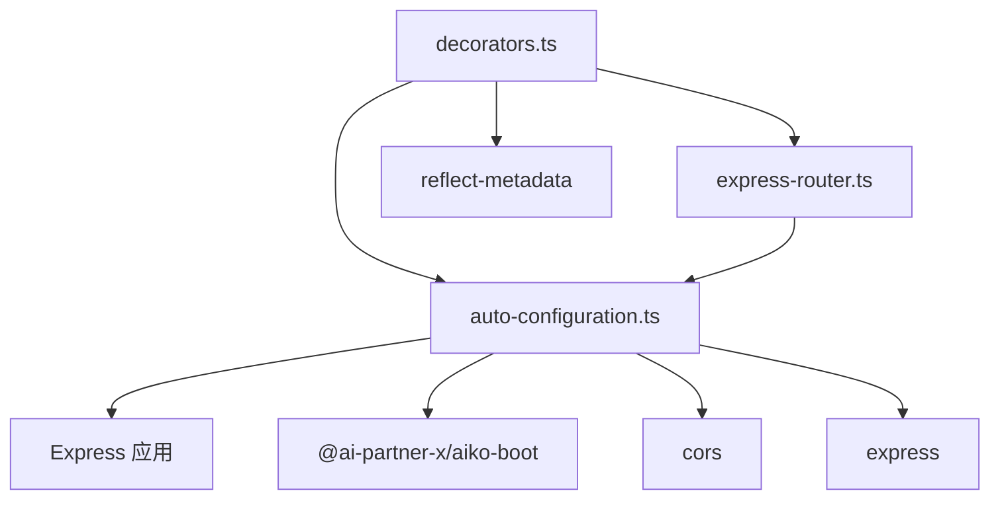

# 路由管理系统

<cite>
**本文档引用的文件**
- [packages/aiko-boot-starter-web/src/index.ts](file://packages/aiko-boot-starter-web/src/index.ts)
- [packages/aiko-boot-starter-web/src/express-router.ts](file://packages/aiko-boot-starter-web/src/express-router.ts)
- [packages/aiko-boot-starter-web/src/decorators.ts](file://packages/aiko-boot-starter-web/src/decorators.ts)
- [packages/aiko-boot-starter-web/src/auto-configuration.ts](file://packages/aiko-boot-starter-web/src/auto-configuration.ts)
- [packages/aiko-boot-starter-web/package.json](file://packages/aiko-boot-starter-web/package.json)
- [app/examples/user-crud/packages/api/src/controller/user.controller.ts](file://app/examples/user-crud/packages/api/src/controller/user.controller.ts)
</cite>

## 目录
1. [简介](#简介)
2. [项目结构](#项目结构)
3. [核心组件](#核心组件)
4. [架构总览](#架构总览)
5. [详细组件分析](#详细组件分析)
6. [依赖关系分析](#依赖关系分析)
7. [性能考虑](#性能考虑)
8. [故障排除指南](#故障排除指南)
9. [结论](#结论)
10. [附录](#附录)

## 简介
本文件为路由管理系统的详细 API 参考文档，聚焦于基于装饰器的自动路由生成机制，涵盖控制器扫描、元数据解析与路由注册流程；详述路由路径生成规则（基础路径合并、方法路径拼接、通配符支持）；记录路由中间件集成（CORS、请求体解析、异常处理）；介绍路由参数提取与类型转换（路径变量、查询参数、请求体）；提供路由配置选项（上下文路径、请求体大小限制、日志输出）；并包含路由优先级、冲突解决与性能优化的实现细节，以及路由元数据存储与查询接口。

## 项目结构
该路由系统位于独立的 Web 启动器包中，提供装饰器、Express 路由器与自动配置能力，并通过示例 API 控制器展示典型用法。

**图表来源**
- [packages/aiko-boot-starter-web/src/index.ts](file://packages/aiko-boot-starter-web/src/index.ts#L1-L73)
- [packages/aiko-boot-starter-web/src/decorators.ts](file://packages/aiko-boot-starter-web/src/decorators.ts#L1-L196)
- [packages/aiko-boot-starter-web/src/express-router.ts](file://packages/aiko-boot-starter-web/src/express-router.ts#L1-L171)
- [packages/aiko-boot-starter-web/src/auto-configuration.ts](file://packages/aiko-boot-starter-web/src/auto-configuration.ts#L1-L160)
- [packages/aiko-boot-starter-web/package.json](file://packages/aiko-boot-starter-web/package.json#L1-L60)
- [app/examples/user-crud/packages/api/src/controller/user.controller.ts](file://app/examples/user-crud/packages/api/src/controller/user.controller.ts#L1-L170)

**章节来源**
- [packages/aiko-boot-starter-web/src/index.ts](file://packages/aiko-boot-starter-web/src/index.ts#L1-L73)
- [packages/aiko-boot-starter-web/package.json](file://packages/aiko-boot-starter-web/package.json#L1-L60)

## 核心组件
- 装饰器层：提供 @RestController、@GetMapping、@PostMapping、@PutMapping、@DeleteMapping、@PatchMapping、@PathVariable、@RequestParam/@QueryParam、@RequestBody 等，用于声明控制器与请求映射及参数绑定。
- 元数据层：利用 reflect-metadata 在编译期收集控制器与方法的元数据，供路由器注册使用。
- Express 路由器：自动扫描控制器，解析元数据，生成 Express 路由并注入参数。
- 自动配置：读取 server.* 配置，创建 Express 应用，注册 CORS、JSON 解析、异常处理器与路由。

**章节来源**
- [packages/aiko-boot-starter-web/src/decorators.ts](file://packages/aiko-boot-starter-web/src/decorators.ts#L1-L196)
- [packages/aiko-boot-starter-web/src/express-router.ts](file://packages/aiko-boot-starter-web/src/express-router.ts#L1-L171)
- [packages/aiko-boot-starter-web/src/auto-configuration.ts](file://packages/aiko-boot-starter-web/src/auto-configuration.ts#L1-L160)

## 架构总览
系统采用“装饰器 + 元数据 + 自动注册”的三层架构：装饰器定义意图，元数据承载信息，路由器完成注册与参数注入，自动配置负责中间件与服务器装配。

**图表来源**
- [packages/aiko-boot-starter-web/src/decorators.ts](file://packages/aiko-boot-starter-web/src/decorators.ts#L177-L196)
- [packages/aiko-boot-starter-web/src/express-router.ts](file://packages/aiko-boot-starter-web/src/express-router.ts#L102-L170)
- [packages/aiko-boot-starter-web/src/auto-configuration.ts](file://packages/aiko-boot-starter-web/src/auto-configuration.ts#L104-L146)

## 详细组件分析

### 装饰器与元数据 API
- 控制器装饰器
  - @RestController(options: { path?, description? })：标记类为 REST 控制器，支持设置基础路径与描述。
  - 内部行为：保存控制器元数据、自动注入构造函数依赖、应用可注入与单例装饰。
- 请求映射装饰器
  - @GetMapping/@PostMapping/@PutMapping/@DeleteMapping/@PatchMapping(path?, description?)：快捷映射 HTTP 方法。
  - @RequestMapping(options: { path?, method?, description? })：通用映射。
- 参数装饰器
  - @PathVariable(name?)：从路径中提取变量，按参数索引注入。
  - @RequestParam(name?, required?) / @QueryParam：从查询字符串提取参数，按参数索引注入。
  - @RequestBody()：将整个请求体注入到对应参数。
- 元数据查询 API
  - getControllerMetadata(target)：获取控制器元数据。
  - getRequestMappings(target)：获取方法映射集合。
  - getPathVariables(target, methodName)：获取路径变量索引到名称的映射。
  - getRequestParams(target, methodName)：获取查询参数索引到名称与必填信息的映射。
  - getRequestBody(target, methodName)：获取请求体注入位置的索引集合。

**图表来源**
- [packages/aiko-boot-starter-web/src/decorators.ts](file://packages/aiko-boot-starter-web/src/decorators.ts#L50-L173)
- [packages/aiko-boot-starter-web/src/decorators.ts](file://packages/aiko-boot-starter-web/src/decorators.ts#L177-L196)

**章节来源**
- [packages/aiko-boot-starter-web/src/decorators.ts](file://packages/aiko-boot-starter-web/src/decorators.ts#L1-L196)

### Express 路由器与自动注册
- createExpressRouter(controllers, options)
  - 支持传入类数组或模块导出对象，自动识别控制器类。
  - options: { prefix?, verbose?, instances? }。
  - 自动解析控制器实例（优先使用传入实例，否则通过 DI 容器解析），并注入 @Autowired 属性。
- registerController(router, ControllerClass, instance, prefix, verbose)
  - 读取控制器基础路径与方法映射，生成完整路由路径 prefix + basePath + methodPath。
  - 为每个方法创建处理函数，按参数索引注入 @PathVariable、@RequestBody、@RequestParam/@QueryParam。
  - 统一返回 { success, data } JSON 响应；异常时返回 { success: false, error }。
  - verbose 开启时输出注册与响应日志。

**图表来源**
- [packages/aiko-boot-starter-web/src/express-router.ts](file://packages/aiko-boot-starter-web/src/express-router.ts#L59-L170)
- [packages/aiko-boot-starter-web/src/decorators.ts](file://packages/aiko-boot-starter-web/src/decorators.ts#L177-L196)

**章节来源**
- [packages/aiko-boot-starter-web/src/express-router.ts](file://packages/aiko-boot-starter-web/src/express-router.ts#L1-L171)

### 路由路径生成规则
- 基础路径合并
  - 控制器基础路径来自 @RestController({ path })。
  - 方法路径来自 @GetMapping/@PostMapping 等装饰器的 path。
  - 最终路径为 prefix + basePath + methodPath。
- 方法路径拼接
  - 若方法未指定 path，则为空字符串，最终路径即 prefix + basePath。
- 通配符支持
  - 当前实现通过 Express Router 注册具体路径，未显式提供通配符注册逻辑；如需通配符，请在控制器方法中使用具体路径或自定义中间件处理。

**章节来源**
- [packages/aiko-boot-starter-web/src/express-router.ts](file://packages/aiko-boot-starter-web/src/express-router.ts#L115-L120)

### 路由参数提取与类型转换
- 路径变量（@PathVariable）
  - 通过 getPathVariables 获取索引到名称的映射，按索引从 req.params 注入。
- 查询参数（@RequestParam/@QueryParam）
  - 通过 getRequestParams 获取索引到 { name, required } 的映射，按索引从 req.query 注入。
- 请求体（@RequestBody）
  - 通过 getRequestBody 获取注入位置索引，将整个 req.body 注入对应参数。
- 类型转换
  - 当前实现未对参数进行自动类型转换，示例中通过显式转换（如 Number()）完成；建议在业务层或自定义参数管道中实现类型转换与校验。

**图表来源**
- [packages/aiko-boot-starter-web/src/express-router.ts](file://packages/aiko-boot-starter-web/src/express-router.ts#L126-L166)
- [packages/aiko-boot-starter-web/src/decorators.ts](file://packages/aiko-boot-starter-web/src/decorators.ts#L185-L195)

**章节来源**
- [packages/aiko-boot-starter-web/src/express-router.ts](file://packages/aiko-boot-starter-web/src/express-router.ts#L126-L166)
- [app/examples/user-crud/packages/api/src/controller/user.controller.ts](file://app/examples/user-crud/packages/api/src/controller/user.controller.ts#L46-L76)

### 路由中间件集成
- CORS
  - 自动配置中通过 cors 模块启用默认 CORS 中间件。
- JSON 请求体解析
  - 自动配置中通过 express.json({ limit }) 启用 JSON 解析，limit 来源于 server.maxHttpPostSize。
- 异常处理
  - 自动配置中初始化全局异常处理器并挂载到 Express 应用。
- 认证/授权与请求预处理
  - 当前未内置认证/授权中间件；可通过 getExpressApp 获取 Express 实例后自行挂载中间件，或在控制器内使用 @Autowired 注入服务实现鉴权逻辑。

**章节来源**
- [packages/aiko-boot-starter-web/src/auto-configuration.ts](file://packages/aiko-boot-starter-web/src/auto-configuration.ts#L120-L142)
- [packages/aiko-boot-starter-web/package.json](file://packages/aiko-boot-starter-web/package.json#L32-L36)

### 路由配置选项
- server.servlet.contextPath
  - 作用：Express 路由前缀（默认 /api）。
  - 读取方式：自动配置读取 server.servlet.contextPath。
- server.maxHttpPostSize
  - 作用：请求体大小限制（默认 10mb）。
  - 读取方式：自动配置读取 server.maxHttpPostSize 并传递给 express.json。
- verbose
  - 作用：是否输出路由注册与响应日志。
  - 读取方式：自动配置读取上下文的 verbose 标志；Express 路由器支持 verbose 选项。

**章节来源**
- [packages/aiko-boot-starter-web/src/auto-configuration.ts](file://packages/aiko-boot-starter-web/src/auto-configuration.ts#L113-L115)
- [packages/aiko-boot-starter-web/src/express-router.ts](file://packages/aiko-boot-starter-web/src/express-router.ts#L63-L63)

### 路由优先级、冲突解决与性能优化
- 优先级
  - 自动配置中的 WebAutoConfiguration 顺序为 200，OnApplicationReady 顺序为 50，确保在应用就绪阶段创建并注册服务器与路由。
- 冲突解决
  - Express 路由器按注册顺序匹配；若存在重复路径，后者会覆盖前者（由 Express Router 行为决定）。建议避免重复路径，保持清晰的路径设计。
- 性能优化
  - 使用 DI 容器解析控制器，减少重复实例化开销。
  - 通过 verbose 控制台输出仅在调试环境开启，避免生产环境日志噪声。
  - 合理设置 server.maxHttpPostSize，避免过大请求导致内存压力。

**章节来源**
- [packages/aiko-boot-starter-web/src/auto-configuration.ts](file://packages/aiko-boot-starter-web/src/auto-configuration.ts#L97-L146)
- [packages/aiko-boot-starter-web/src/express-router.ts](file://packages/aiko-boot-starter-web/src/express-router.ts#L122-L124)

### 路由元数据存储与查询 API
- 存储
  - 使用 reflect-metadata 在类与方法层面存储元数据键值，键名统一为字符串，便于跨模块共享。
- 查询
  - 提供 getControllerMetadata、getRequestMappings、getPathVariables、getRequestParams、getRequestBody 等查询函数，供路由器与客户端生成器复用。

**章节来源**
- [packages/aiko-boot-starter-web/src/decorators.ts](file://packages/aiko-boot-starter-web/src/decorators.ts#L8-L16)
- [packages/aiko-boot-starter-web/src/decorators.ts](file://packages/aiko-boot-starter-web/src/decorators.ts#L177-L196)

## 依赖关系分析
- 外部依赖
  - express：提供路由与中间件能力。
  - cors：提供跨域支持。
  - reflect-metadata：提供装饰器元数据存储与读取。
  - @ai-partner-x/aiko-boot：提供 DI、自动配置与应用上下文能力。
- 内部模块
  - index.ts 统一导出装饰器、路由器、自动配置与客户端工具。
  - decorators.ts 定义装饰器与元数据 API。
  - express-router.ts 实现自动注册与参数注入。
  - auto-configuration.ts 实现服务器创建与中间件装配。

**图表来源**
- [packages/aiko-boot-starter-web/src/decorators.ts](file://packages/aiko-boot-starter-web/src/decorators.ts#L1-L196)
- [packages/aiko-boot-starter-web/src/express-router.ts](file://packages/aiko-boot-starter-web/src/express-router.ts#L1-L171)
- [packages/aiko-boot-starter-web/src/auto-configuration.ts](file://packages/aiko-boot-starter-web/src/auto-configuration.ts#L1-L160)
- [packages/aiko-boot-starter-web/package.json](file://packages/aiko-boot-starter-web/package.json#L32-L36)

**章节来源**
- [packages/aiko-boot-starter-web/package.json](file://packages/aiko-boot-starter-web/package.json#L1-L60)

## 性能考虑
- 路由注册阶段
  - 仅在应用启动时扫描与注册控制器，避免运行时重复解析。
- 参数注入
  - 通过索引映射注入，避免复杂解析逻辑，降低运行时开销。
- 日志输出
  - 通过 verbose 控制台输出，生产环境建议关闭以减少 I/O。
- 请求体大小
  - 合理设置 server.maxHttpPostSize，防止超大请求占用过多内存。

[本节为通用指导，无需特定文件来源]

## 故障排除指南
- 控制器未注册
  - 确认控制器类已使用 @RestController 标记且被自动配置收集。
  - 检查自动配置是否正确加载 server.servlet.contextPath。
- 路由未生效
  - 确认方法装饰器（如 @GetMapping）已正确标注路径与方法。
  - 检查 prefix、basePath、methodPath 组合是否符合预期。
- 参数注入失败
  - 确认参数装饰器（@PathVariable/@RequestParam/@RequestBody）与方法签名索引一致。
  - 注意当前未自动类型转换，必要时在控制器内进行类型转换。
- CORS 问题
  - 默认已启用 CORS，若遇到跨域问题，检查前端与后端域名/端口配置。
- 异常未被捕获
  - 确认全局异常处理器已初始化并挂载到 Express 应用。

**章节来源**
- [packages/aiko-boot-starter-web/src/auto-configuration.ts](file://packages/aiko-boot-starter-web/src/auto-configuration.ts#L132-L142)
- [packages/aiko-boot-starter-web/src/express-router.ts](file://packages/aiko-boot-starter-web/src/express-router.ts#L126-L166)

## 结论
该路由管理系统以装饰器为核心，结合反射元数据与 Express 路由器实现自动化的控制器扫描、路由注册与参数注入。通过 Spring Boot 风格的自动配置，快速搭建具备 CORS、JSON 解析与异常处理的 Web 服务。建议在生产环境中合理配置上下文路径与请求体大小限制，并通过 DI 与日志控制提升稳定性与性能。

[本节为总结性内容，无需特定文件来源]

## 附录

### API 参考速查
- 装饰器
  - @RestController({ path?, description? })
  - @GetMapping/@PostMapping/@PutMapping/@DeleteMapping/@PatchMapping(path?, description?)
  - @RequestMapping({ path?, method?, description? })
  - @PathVariable(name?)
  - @RequestParam(name?, required?)
  - @QueryParam(name?, required?)
  - @RequestBody()
- 元数据查询
  - getControllerMetadata(target)
  - getRequestMappings(target)
  - getPathVariables(target, methodName)
  - getRequestParams(target, methodName)
  - getRequestBody(target, methodName)
- 路由器
  - createExpressRouter(controllers, { prefix?, verbose?, instances? })
- 自动配置
  - WebAutoConfiguration：自动创建 Express、注册中间件与路由
  - ServerProperties：server.port、server.servlet.contextPath、server.maxHttpPostSize
  - getServerConfig()/setServerConfig()
  - getExpressApp()

**章节来源**
- [packages/aiko-boot-starter-web/src/decorators.ts](file://packages/aiko-boot-starter-web/src/decorators.ts#L50-L173)
- [packages/aiko-boot-starter-web/src/decorators.ts](file://packages/aiko-boot-starter-web/src/decorators.ts#L177-L196)
- [packages/aiko-boot-starter-web/src/express-router.ts](file://packages/aiko-boot-starter-web/src/express-router.ts#L59-L82)
- [packages/aiko-boot-starter-web/src/auto-configuration.ts](file://packages/aiko-boot-starter-web/src/auto-configuration.ts#L47-L60)
- [packages/aiko-boot-starter-web/src/auto-configuration.ts](file://packages/aiko-boot-starter-web/src/auto-configuration.ts#L104-L146)