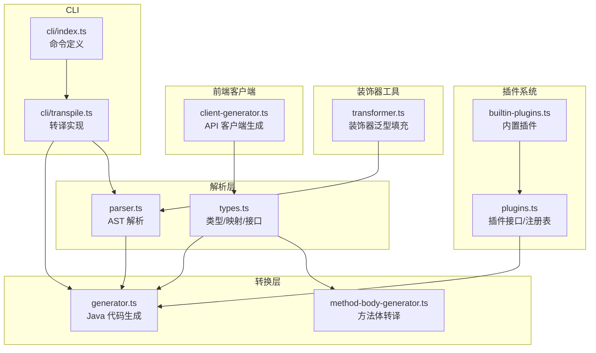
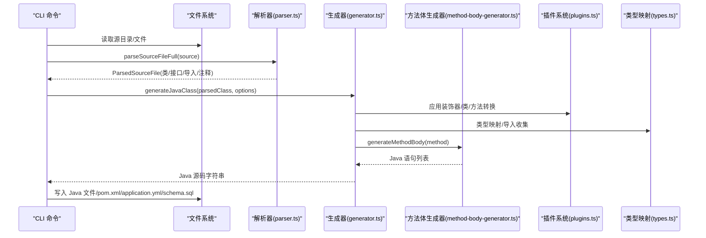
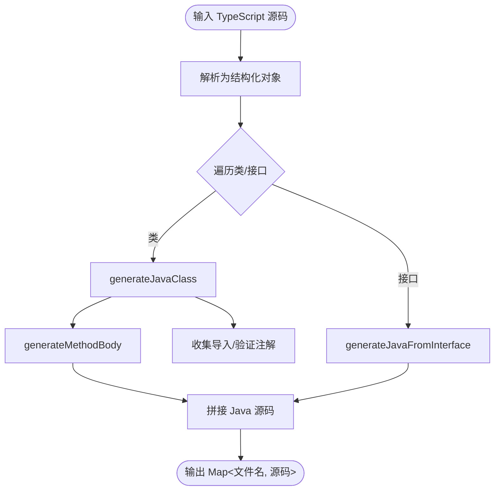
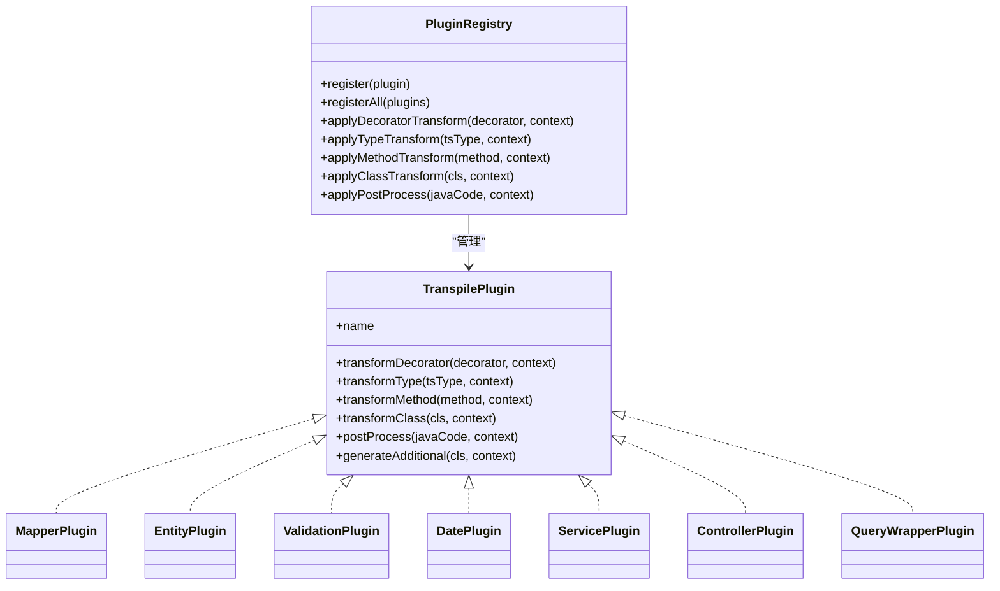
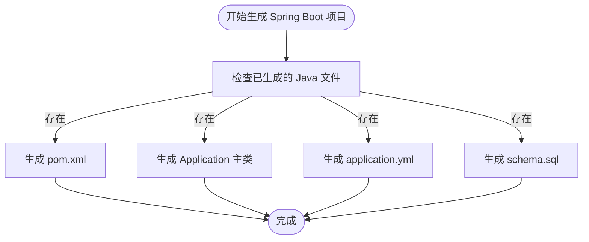
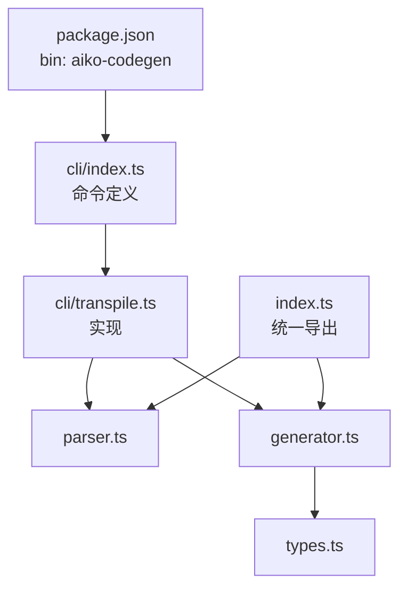

# 代码生成器 API

<cite>
**本文档引用的文件**
- [packages/aiko-boot-codegen/src/index.ts](file://packages/aiko-boot-codegen/src/index.ts)
- [packages/aiko-boot-codegen/src/types.ts](file://packages/aiko-boot-codegen/src/types.ts)
- [packages/aiko-boot-codegen/src/parser.ts](file://packages/aiko-boot-codegen/src/parser.ts)
- [packages/aiko-boot-codegen/src/generator.ts](file://packages/aiko-boot-codegen/src/generator.ts)
- [packages/aiko-boot-codegen/src/method-body-generator.ts](file://packages/aiko-boot-codegen/src/method-body-generator.ts)
- [packages/aiko-boot-codegen/src/plugins.ts](file://packages/aiko-boot-codegen/src/plugins.ts)
- [packages/aiko-boot-codegen/src/builtin-plugins.ts](file://packages/aiko-boot-codegen/src/builtin-plugins.ts)
- [packages/aiko-boot-codegen/src/transformer.ts](file://packages/aiko-boot-codegen/src/transformer.ts)
- [packages/aiko-boot-codegen/src/client-generator.ts](file://packages/aiko-boot-codegen/src/client-generator.ts)
- [packages/aiko-boot-codegen/src/cli/index.ts](file://packages/aiko-boot-codegen/src/cli/index.ts)
- [packages/aiko-boot-codegen/src/cli/transpile.ts](file://packages/aiko-boot-codegen/src/cli/transpile.ts)
- [packages/aiko-boot-codegen/package.json](file://packages/aiko-boot-codegen/package.json)
</cite>

## 目录
1. [简介](#简介)
2. [项目结构](#项目结构)
3. [核心组件](#核心组件)
4. [架构总览](#架构总览)
5. [详细组件分析](#详细组件分析)
6. [依赖分析](#依赖分析)
7. [性能考虑](#性能考虑)
8. [故障排除指南](#故障排除指南)
9. [结论](#结论)
10. [附录](#附录)

## 简介
本项目是一个面向 Aiko Boot 的 TypeScript 到 Java 代码生成器，提供以下能力：
- 装饰器解析器：解析 TypeScript 类与方法上的装饰器，提取元数据。
- 元数据提取器：从 AST 中抽取类、字段、方法、参数、注释等结构化信息。
- 代码转换器：将 TypeScript 结构转换为符合 MyBatis-Plus/Spring Boot 规范的 Java 源码，并支持 Lombok、验证注解、路径参数等。
- Spring Boot 项目模板引擎：自动生成 pom.xml、主应用类、application.yml、schema.sql 等项目文件。
- 前端 API 客户端生成器：从控制器与实体/DTO 源码生成前端可消费的 API 客户端。
- CLI 工具：提供命令行接口，支持批量转换、Dry Run、验证提示等。

## 项目结构
代码生成器位于 packages/aiko-boot-codegen 包内，采用模块化设计，核心模块如下：
- 解析层：parser.ts（TypeScript AST 解析）、types.ts（类型与映射定义）
- 转换层：generator.ts（Java 代码生成）、method-body-generator.ts（方法体转译）
- 插件系统：plugins.ts（插件接口与注册表）、builtin-plugins.ts（内置插件）
- 装饰器泛型填充：transformer.ts（TS 编译期装饰器泛型自动补全）
- 前端客户端生成：client-generator.ts
- CLI：cli/index.ts（命令定义）、cli/transpile.ts（实现）
- 包配置：package.json（导出入口、bin 命令）

图表来源
- [packages/aiko-boot-codegen/src/parser.ts](file://packages/aiko-boot-codegen/src/parser.ts#L1-L660)
- [packages/aiko-boot-codegen/src/types.ts](file://packages/aiko-boot-codegen/src/types.ts#L1-L478)
- [packages/aiko-boot-codegen/src/generator.ts](file://packages/aiko-boot-codegen/src/generator.ts#L1-L800)
- [packages/aiko-boot-codegen/src/method-body-generator.ts](file://packages/aiko-boot-codegen/src/method-body-generator.ts#L1-L719)
- [packages/aiko-boot-codegen/src/plugins.ts](file://packages/aiko-boot-codegen/src/plugins.ts#L1-L172)
- [packages/aiko-boot-codegen/src/builtin-plugins.ts](file://packages/aiko-boot-codegen/src/builtin-plugins.ts#L1-L190)
- [packages/aiko-boot-codegen/src/transformer.ts](file://packages/aiko-boot-codegen/src/transformer.ts#L1-L217)
- [packages/aiko-boot-codegen/src/client-generator.ts](file://packages/aiko-boot-codegen/src/client-generator.ts#L1-L349)
- [packages/aiko-boot-codegen/src/cli/index.ts](file://packages/aiko-boot-codegen/src/cli/index.ts#L1-L43)
- [packages/aiko-boot-codegen/src/cli/transpile.ts](file://packages/aiko-boot-codegen/src/cli/transpile.ts#L1-L514)

章节来源
- [packages/aiko-boot-codegen/src/index.ts](file://packages/aiko-boot-codegen/src/index.ts#L1-L57)
- [packages/aiko-boot-codegen/package.json](file://packages/aiko-boot-codegen/package.json#L1-L34)

## 核心组件
- 导出入口：index.ts 统一导出解析、生成、插件、转换器、客户端生成器等 API。
- 类型与映射：types.ts 定义 TypeScript 到 Java 的类型映射、装饰器映射、导入映射、验证映射等。
- 解析器：parser.ts 将 TypeScript 源码解析为结构化对象（类、接口、字段、方法、注释、导入等）。
- 生成器：generator.ts 将解析结果转换为 Java 源码，支持实体、仓库、服务、控制器、DTO 等类型。
- 方法体生成器：method-body-generator.ts 将 TypeScript 方法体转译为 Java 语句。
- 插件系统：plugins.ts 提供插件接口与注册表；builtin-plugins.ts 提供内置插件集合。
- 装饰器泛型填充：transformer.ts 在编译期自动将 @Mapper() + extends BaseMapper<User> 转换为 @Mapper(User)。
- 前端客户端生成器：client-generator.ts 从控制器与实体/DTO 生成前端 API 客户端。
- CLI：cli/index.ts 定义命令；cli/transpile.ts 实现批量转换、项目模板生成、Dry Run 等。

章节来源
- [packages/aiko-boot-codegen/src/index.ts](file://packages/aiko-boot-codegen/src/index.ts#L1-L57)
- [packages/aiko-boot-codegen/src/types.ts](file://packages/aiko-boot-codegen/src/types.ts#L1-L478)
- [packages/aiko-boot-codegen/src/parser.ts](file://packages/aiko-boot-codegen/src/parser.ts#L1-L660)
- [packages/aiko-boot-codegen/src/generator.ts](file://packages/aiko-boot-codegen/src/generator.ts#L1-L800)
- [packages/aiko-boot-codegen/src/method-body-generator.ts](file://packages/aiko-boot-codegen/src/method-body-generator.ts#L1-L719)
- [packages/aiko-boot-codegen/src/plugins.ts](file://packages/aiko-boot-codegen/src/plugins.ts#L1-L172)
- [packages/aiko-boot-codegen/src/builtin-plugins.ts](file://packages/aiko-boot-codegen/src/builtin-plugins.ts#L1-L190)
- [packages/aiko-boot-codegen/src/transformer.ts](file://packages/aiko-boot-codegen/src/transformer.ts#L1-L217)
- [packages/aiko-boot-codegen/src/client-generator.ts](file://packages/aiko-boot-codegen/src/client-generator.ts#L1-L349)
- [packages/aiko-boot-codegen/src/cli/index.ts](file://packages/aiko-boot-codegen/src/cli/index.ts#L1-L43)
- [packages/aiko-boot-codegen/src/cli/transpile.ts](file://packages/aiko-boot-codegen/src/cli/transpile.ts#L1-L514)

## 架构总览
下图展示了从 TypeScript 源码到 Java 代码与 Spring Boot 项目文件的生成流程：

图表来源
- [packages/aiko-boot-codegen/src/cli/transpile.ts](file://packages/aiko-boot-codegen/src/cli/transpile.ts#L60-L307)
- [packages/aiko-boot-codegen/src/parser.ts](file://packages/aiko-boot-codegen/src/parser.ts#L23-L65)
- [packages/aiko-boot-codegen/src/generator.ts](file://packages/aiko-boot-codegen/src/generator.ts#L29-L129)
- [packages/aiko-boot-codegen/src/method-body-generator.ts](file://packages/aiko-boot-codegen/src/method-body-generator.ts#L19-L36)
- [packages/aiko-boot-codegen/src/plugins.ts](file://packages/aiko-boot-codegen/src/plugins.ts#L87-L166)
- [packages/aiko-boot-codegen/src/types.ts](file://packages/aiko-boot-codegen/src/types.ts#L8-L17)

## 详细组件分析

### TypeScript 到 Java 转换 API
- transpile 函数：接收 TypeScript 源码与选项，返回 Map<文件名, Java 源码>。
- 解析接口：parseSourceFile、parseSourceFileFull 返回结构化信息。
- 生成接口：generateJavaClass、generateJavaFromInterface、generateUtilityTypeClass。
- 类型映射：TYPE_MAPPING、IMPORT_MAPPING、DECORATOR_MAPPING、VALIDATION_MAPPING。
- 方法体转译：generateMethodBody 将 TS 语句转为 Java 语句。

图表来源
- [packages/aiko-boot-codegen/src/index.ts](file://packages/aiko-boot-codegen/src/index.ts#L43-L56)
- [packages/aiko-boot-codegen/src/parser.ts](file://packages/aiko-boot-codegen/src/parser.ts#L23-L65)
- [packages/aiko-boot-codegen/src/generator.ts](file://packages/aiko-boot-codegen/src/generator.ts#L29-L129)
- [packages/aiko-boot-codegen/src/method-body-generator.ts](file://packages/aiko-boot-codegen/src/method-body-generator.ts#L19-L36)

章节来源
- [packages/aiko-boot-codegen/src/index.ts](file://packages/aiko-boot-codegen/src/index.ts#L1-L57)
- [packages/aiko-boot-codegen/src/types.ts](file://packages/aiko-boot-codegen/src/types.ts#L8-L17)
- [packages/aiko-boot-codegen/src/generator.ts](file://packages/aiko-boot-codegen/src/generator.ts#L29-L129)
- [packages/aiko-boot-codegen/src/method-body-generator.ts](file://packages/aiko-boot-codegen/src/method-body-generator.ts#L19-L36)

### 装饰器解析器与插件系统
- 装饰器解析：parseDecorators、parseDecoratorArgs 提取装饰器名称与参数。
- 插件接口：TranspilePlugin 定义 transformDecorator、transformType、transformMethod、transformClass、postProcess、generateAdditional。
- 注册表：PluginRegistry 提供统一的插件应用与后处理。
- 内置插件：mapper-plugin、entity-plugin、validation-plugin、date-plugin、service-plugin、controller-plugin、queryWrapper-plugin。

图表来源
- [packages/aiko-boot-codegen/src/plugins.ts](file://packages/aiko-boot-codegen/src/plugins.ts#L87-L166)
- [packages/aiko-boot-codegen/src/builtin-plugins.ts](file://packages/aiko-boot-codegen/src/builtin-plugins.ts#L13-L165)

章节来源
- [packages/aiko-boot-codegen/src/plugins.ts](file://packages/aiko-boot-codegen/src/plugins.ts#L1-L172)
- [packages/aiko-boot-codegen/src/builtin-plugins.ts](file://packages/aiko-boot-codegen/src/builtin-plugins.ts#L1-L190)

### Spring Boot 代码生成器 API
- 项目模板生成：在输出目录生成 pom.xml、主应用类、application.yml、schema.sql。
- Maven 配置生成：根据 Spring Boot 版本选择合适的 MyBatis-Plus Starter。
- 依赖管理：自动添加 Spring Web、MyBatis-Plus、H2、MySQL、Validation、Lombok、Test 等依赖。
- 实体信息提取：从 @Entity/@TableName、@TableField/@Column 等装饰器生成 schema.sql。

图表来源
- [packages/aiko-boot-codegen/src/cli/transpile.ts](file://packages/aiko-boot-codegen/src/cli/transpile.ts#L260-L290)
- [packages/aiko-boot-codegen/src/cli/transpile.ts](file://packages/aiko-boot-codegen/src/cli/transpile.ts#L414-L513)
- [packages/aiko-boot-codegen/src/cli/transpile.ts](file://packages/aiko-boot-codegen/src/cli/transpile.ts#L322-L336)
- [packages/aiko-boot-codegen/src/cli/transpile.ts](file://packages/aiko-boot-codegen/src/cli/transpile.ts#L342-L367)
- [packages/aiko-boot-codegen/src/cli/transpile.ts](file://packages/aiko-boot-codegen/src/cli/transpile.ts#L373-L394)

章节来源
- [packages/aiko-boot-codegen/src/cli/transpile.ts](file://packages/aiko-boot-codegen/src/cli/transpile.ts#L260-L290)
- [packages/aiko-boot-codegen/src/cli/transpile.ts](file://packages/aiko-boot-codegen/src/cli/transpile.ts#L414-L513)

### CLI 工具接口与配置
- 命令：aiko-codegen transpile
- 参数：
  - source：源目录或文件路径
  - -o/--out：输出目录，默认 ./gen
  - -p/--package：Java 包名，默认 com.example
  - --lombok：启用 Lombok 注解
  - --java-version：目标 Java 版本（11/17/21），默认 17
  - --spring-boot：Spring Boot 版本，默认 3.2.0
  - --dry-run：仅显示将要生成的文件，不写入磁盘
  - -v/--verbose：详细输出
- 子命令：validate（提示使用 eslint 验证）

章节来源
- [packages/aiko-boot-codegen/src/cli/index.ts](file://packages/aiko-boot-codegen/src/cli/index.ts#L16-L28)
- [packages/aiko-boot-codegen/src/cli/index.ts](file://packages/aiko-boot-codegen/src/cli/index.ts#L30-L40)

### 类型映射、命名约定与代码格式化
- 类型映射：number→Integer、string→String、boolean→Boolean、Date→LocalDateTime、Promise<T>→T 等。
- 命名约定：
  - 控制器路径参数：/:id → /{id}
  - 字段注解：@TableId、@TableField、@TableName
  - 验证注解：@NotNull、@Email、@Min、@Max、@Size
  - Lombok：@Data（实体/DTO）、@NoArgsConstructor、@AllArgsConstructor
- 代码格式化：生成器内部按 Java 规范缩进与空行组织，插件可进行后处理优化。

章节来源
- [packages/aiko-boot-codegen/src/types.ts](file://packages/aiko-boot-codegen/src/types.ts#L8-L17)
- [packages/aiko-boot-codegen/src/generator.ts](file://packages/aiko-boot-codegen/src/generator.ts#L445-L486)
- [packages/aiko-boot-codegen/src/generator.ts](file://packages/aiko-boot-codegen/src/generator.ts#L508-L518)
- [packages/aiko-boot-codegen/src/generator.ts](file://packages/aiko-boot-codegen/src/generator.ts#L529-L554)

### 前端 API 客户端生成器
- 功能：从控制器与实体/DTO 源码生成前端 API 客户端（含 fetch 实现）。
- 流程：解析控制器 → 提取方法元数据 → 生成 API 类 → 生成实体/DTO 接口 → 生成 index 导出。
- CLI：支持 --src、--out、--help。

章节来源
- [packages/aiko-boot-codegen/src/client-generator.ts](file://packages/aiko-boot-codegen/src/client-generator.ts#L33-L147)
- [packages/aiko-boot-codegen/src/client-generator.ts](file://packages/aiko-boot-codegen/src/client-generator.ts#L149-L203)
- [packages/aiko-boot-codegen/src/client-generator.ts](file://packages/aiko-boot-codegen/src/client-generator.ts#L207-L235)
- [packages/aiko-boot-codegen/src/client-generator.ts](file://packages/aiko-boot-codegen/src/client-generator.ts#L249-L325)
- [packages/aiko-boot-codegen/src/client-generator.ts](file://packages/aiko-boot-codegen/src/client-generator.ts#L329-L348)

### 批量处理、错误处理与日志
- 批量处理：支持单文件与递归目录扫描，忽略 *.spec.ts、*.test.ts、*.d.ts、node_modules。
- 错误处理：捕获文件处理异常，统计成功/失败数量，输出错误消息。
- 日志：进度输出、Dry Run 模式、生成文件清单、运行提示。

章节来源
- [packages/aiko-boot-codegen/src/cli/transpile.ts](file://packages/aiko-boot-codegen/src/cli/transpile.ts#L72-L89)
- [packages/aiko-boot-codegen/src/cli/transpile.ts](file://packages/aiko-boot-codegen/src/cli/transpile.ts#L212-L216)
- [packages/aiko-boot-codegen/src/cli/transpile.ts](file://packages/aiko-boot-codegen/src/cli/transpile.ts#L292-L307)

## 依赖分析
- 运行时依赖：commander（CLI）、glob（文件匹配）、typescript（AST 解析）。
- 导出与 bin：通过 package.json 暴露 dist/index.js 与二进制命令 aiko-codegen。
- 内部模块：各模块间通过 types.ts 的接口契约耦合，解析器与生成器通过结构化数据交互。

图表来源
- [packages/aiko-boot-codegen/package.json](file://packages/aiko-boot-codegen/package.json#L8-L10)
- [packages/aiko-boot-codegen/src/index.ts](file://packages/aiko-boot-codegen/src/index.ts#L5-L15)
- [packages/aiko-boot-codegen/src/cli/index.ts](file://packages/aiko-boot-codegen/src/cli/index.ts#L6-L7)
- [packages/aiko-boot-codegen/src/cli/transpile.ts](file://packages/aiko-boot-codegen/src/cli/transpile.ts#L8-L12)

章节来源
- [packages/aiko-boot-codegen/package.json](file://packages/aiko-boot-codegen/package.json#L1-L34)

## 性能考虑
- AST 解析：使用 TypeScript 内置解析器，按需访问节点，避免重复解析。
- 生成阶段：按类/方法分步生成，减少内存占用；插件链式调用注意短路与缓存。
- 文件 I/O：批量处理时尽量合并写入，Dry Run 模式避免磁盘操作。
- 类型推断：方法体生成器对复杂表达式进行简化与映射，避免深度递归。

## 故障排除指南
- CLI 未找到文件：确认 source 路径存在且非测试/声明文件。
- 生成为空：检查源文件是否包含类或导出接口；验证装饰器是否被正确识别。
- Lombok 未生效：确保 --lombok 选项开启且生成类为实体/DTO。
- 验证失败：使用 ESLint 配置进行兼容性校验（参见 CLI validate 命令提示）。
- 日志与 Dry Run：使用 -v 查看详细输出；使用 --dry-run 预览生成内容。

章节来源
- [packages/aiko-boot-codegen/src/cli/index.ts](file://packages/aiko-boot-codegen/src/cli/index.ts#L30-L40)
- [packages/aiko-boot-codegen/src/cli/transpile.ts](file://packages/aiko-boot-codegen/src/cli/transpile.ts#L86-L89)
- [packages/aiko-boot-codegen/src/cli/transpile.ts](file://packages/aiko-boot-codegen/src/cli/transpile.ts#L156-L171)

## 结论
本代码生成器以模块化架构实现了从 TypeScript 到 Java 的完整转换链路，结合插件系统与装饰器泛型填充，能够高效生成符合 Spring Boot/MyBatis-Plus 规范的代码与项目模板。通过 CLI 与 API 双通道，既满足自动化流水线需求，也便于集成到现有工程中。

## 附录
- 自定义模板开发：可通过插件系统扩展装饰器、类型、方法与后处理逻辑；必要时在生成器中增加新的类类型分支。
- 转换示例：建议先使用 --dry-run 验证输出，再批量生成；对于复杂方法体，可在 TS 源码中保留必要的注释与注解以便生成器正确处理。
- 最佳实践：保持装饰器语义清晰、类型标注完整；合理使用 Lombok 与验证注解；定期更新 Spring Boot 与 MyBatis-Plus 版本以获得最新特性与安全修复。