# 业务组件 API

<cite>
**本文档引用的文件**
- [MasterDetail 组件](file://app/examples/admin/src/components/MasterDetail/index.tsx)
- [ListReport 组件](file://app/examples/admin/src/components/ListReport/index.tsx)
- [ObjectPage 组件](file://app/examples/admin/src/components/ObjectPage/index.tsx)
- [EditableTable 组件](file://app/examples/admin/src/components/EditableTable/index.tsx)
- [DataTable 组件](file://app/framework/admin-component/src/ui/data-table.tsx)
- [admin-component 导出索引](file://app/framework/admin-component/src/index.ts)
- [采购申请 - 创建页面](file://app/examples/admin/src/pages/purchase-requisitions/CreatePage.tsx)
- [采购申请 - 编辑页面](file://app/examples/admin/src/pages/purchase-requisitions/EditPage.tsx)
- [采购申请 - 列表页面](file://app/examples/admin/src/pages/purchase-requisitions/ListPage.tsx)
- [采购申请 - 查看页面](file://app/examples/admin/src/pages/purchase-requisitions/ViewPage.tsx)
</cite>

## 目录
1. [简介](#简介)
2. [项目结构](#项目结构)
3. [核心组件](#核心组件)
4. [架构概览](#架构概览)
5. [详细组件分析](#详细组件分析)
6. [依赖关系分析](#依赖关系分析)
7. [性能考虑](#性能考虑)
8. [故障排除指南](#故障排除指南)
9. [结论](#结论)
10. [附录](#附录)

## 简介
本文件为业务组件 API 的全面参考文档，涵盖主从详情(MasterDetail)、列表报表(ListReport)、对象页面(ObjectPage)、可编辑表格(EditableTable)等核心业务组件的完整 API 规范。文档详细说明了每个组件的配置选项、数据绑定方式、交互行为、生命周期方法、事件处理和状态管理，并提供了完整的使用示例和集成方案，展示在实际业务场景中的应用模式以及组件的扩展性和定制化能力。

## 项目结构
该业务组件库基于 SAP Fiori 设计规范构建，采用模块化架构，主要分为以下层次：
- 组件层：业务组件（MasterDetail、ListReport、ObjectPage、EditableTable）
- 基础组件层：@aiko-boot/admin-component 提供的基础 UI 组件（DataTable、Input、Select 等）
- 页面层：具体的业务页面示例（采购申请管理等）

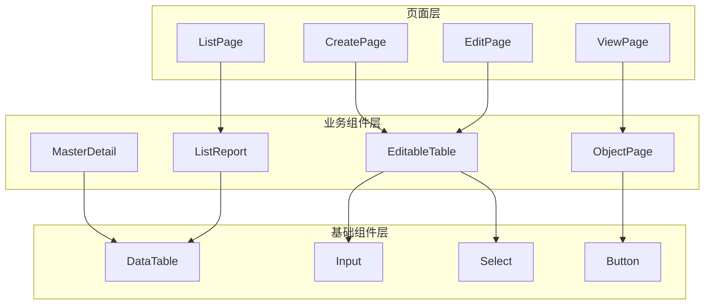

**图表来源**
- [MasterDetail 组件](file://app/examples/admin/src/components/MasterDetail/index.tsx#L1-L498)
- [ListReport 组件](file://app/examples/admin/src/components/ListReport/index.tsx#L1-L398)
- [ObjectPage 组件](file://app/examples/admin/src/components/ObjectPage/index.tsx#L1-L544)
- [EditableTable 组件](file://app/examples/admin/src/components/EditableTable/index.tsx#L1-L308)

**章节来源**
- [MasterDetail 组件](file://app/examples/admin/src/components/MasterDetail/index.tsx#L1-L498)
- [ListReport 组件](file://app/examples/admin/src/components/ListReport/index.tsx#L1-L398)
- [ObjectPage 组件](file://app/examples/admin/src/components/ObjectPage/index.tsx#L1-L544)
- [EditableTable 组件](file://app/examples/admin/src/components/EditableTable/index.tsx#L1-L308)

## 核心组件
本节概述四个核心业务组件的功能定位和主要特性：

### MasterDetail 主从详情组件
- **功能定位**：左侧列表 + 右侧详情的经典布局
- **支持模式**：查看、编辑、新建三种模式
- **核心特性**：搜索过滤、状态显示、操作按钮、删除确认

### ListReport 列表报表组件
- **功能定位**：基于 SAP Fiori List Report 设计的一体化卡片风格
- **核心特性**：Header 区域、工具栏、搜索筛选、数据表格、分页控制

### ObjectPage 对象页面组件
- **功能定位**：基于 SAP Fiori Object Page Floorplan 设计
- **支持模式**：display（详情）、edit（编辑）、create（创建）
- **核心特性**：Section 导航、KPI 指标、侧边栏布局、底部粘浮工具栏

### EditableTable 可编辑表格组件
- **功能定位**：表单内嵌可编辑表格，适用于采购申请行项目等场景
- **核心特性**：行项目管理、单元格渲染、汇总行、嵌入式设计

**章节来源**
- [MasterDetail 组件](file://app/examples/admin/src/components/MasterDetail/index.tsx#L1-L498)
- [ListReport 组件](file://app/examples/admin/src/components/ListReport/index.tsx#L1-L398)
- [ObjectPage 组件](file://app/examples/admin/src/components/ObjectPage/index.tsx#L1-L544)
- [EditableTable 组件](file://app/examples/admin/src/components/EditableTable/index.tsx#L1-L308)

## 架构概览
四个业务组件通过统一的设计语言和交互模式，形成完整的业务页面解决方案：

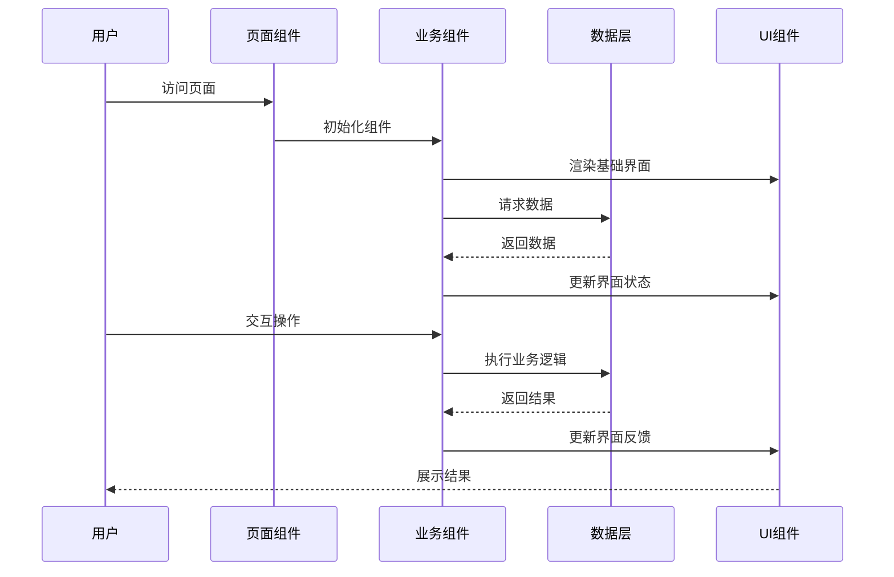

**图表来源**
- [MasterDetail 组件](file://app/examples/admin/src/components/MasterDetail/index.tsx#L113-L355)
- [ListReport 组件](file://app/examples/admin/src/components/ListReport/index.tsx#L145-L392)
- [ObjectPage 组件](file://app/examples/admin/src/components/ObjectPage/index.tsx#L131-L494)
- [EditableTable 组件](file://app/examples/admin/src/components/EditableTable/index.tsx#L54-L160)

## 详细组件分析

### MasterDetail 主从详情组件 API

#### 核心类型定义
```typescript
// 主从项接口
interface MasterDetailItem {
  id: string;
  title: string;
  subtitle?: string;
  description?: string;
  status?: {
    label: string;
    color: 'green' | 'yellow' | 'red' | 'gray' | 'blue';
  };
  badge?: string | number;
  icon?: ReactNode;
}

// 编辑模式枚举
type EditMode = 'view' | 'edit' | 'create';

// 组件属性接口
interface MasterDetailProps<T extends MasterDetailItem> {
  title: string;
  subtitle?: string;
  headerIcon?: ReactNode;
  items: T[];
  selectedId?: string;
  onSelect?: (item: T) => void;
  renderDetail: (item: T, actionButtons?: ReactNode) => ReactNode;
  renderForm?: (item: T | null, mode: EditMode) => ReactNode;
  renderEmpty?: () => ReactNode;
  searchPlaceholder?: string;
  onSearch?: (keyword: string) => void;
  showCreate?: boolean;
  createLabel?: string;
  allowEdit?: boolean;
  allowDelete?: boolean;
  onSave?: (item: T | null, mode: EditMode) => void;
  onDelete?: (item: T) => void;
  masterWidth?: number;
}
```

#### 状态管理机制
组件内部维护以下状态：
- 搜索关键词状态：`searchKeyword`
- 选中项状态：`internalSelectedId`
- 编辑模式状态：`editMode`
- 删除确认状态：`showDeleteConfirm`

#### 交互流程图
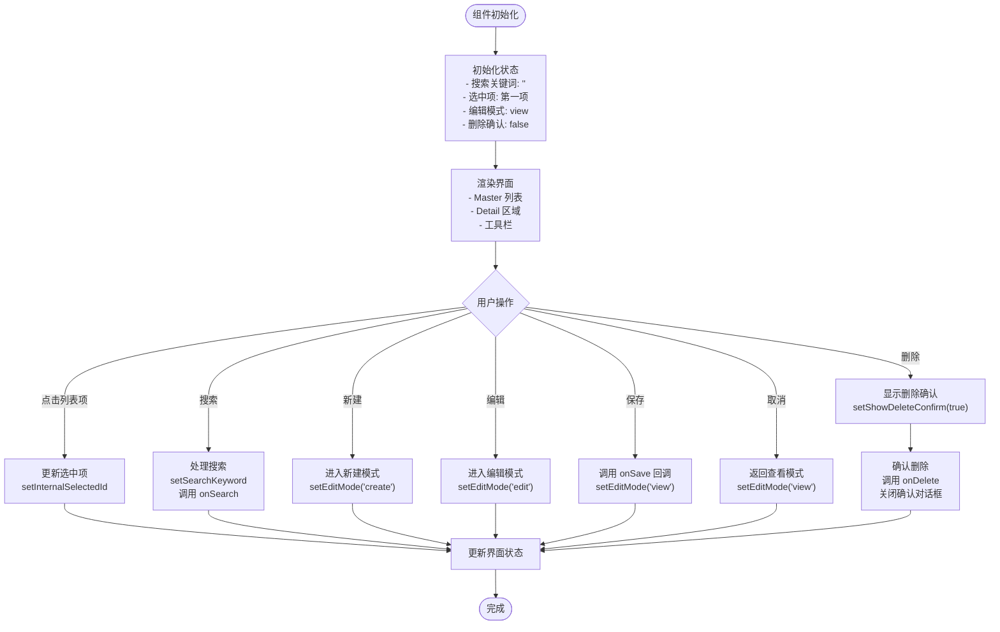

**图表来源**
- [MasterDetail 组件](file://app/examples/admin/src/components/MasterDetail/index.tsx#L133-L180)

#### 组件结构图
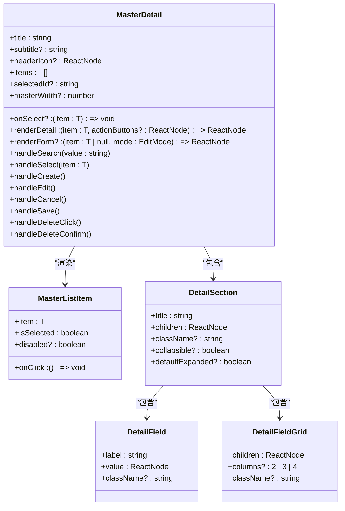

**图表来源**
- [MasterDetail 组件](file://app/examples/admin/src/components/MasterDetail/index.tsx#L28-L65)
- [MasterDetail 组件](file://app/examples/admin/src/components/MasterDetail/index.tsx#L359-L431)
- [MasterDetail 组件](file://app/examples/admin/src/components/MasterDetail/index.tsx#L435-L495)

**章节来源**
- [MasterDetail 组件](file://app/examples/admin/src/components/MasterDetail/index.tsx#L1-L498)

### ListReport 列表报表组件 API

#### 核心类型定义
```typescript
// Header 配置接口
interface ListReportHeaderConfig {
  title: string;
  subtitle?: string;
  tag?: string;
  icon?: React.ReactNode;
}

// 工具栏动作接口
interface ListReportToolbarAction {
  id: string;
  label: string;
  icon?: React.ReactNode;
  onClick: () => void;
  disabled?: boolean;
  primary?: boolean;
}

// 组件属性接口
interface ListReportProps<T> {
  header: ListReportHeaderConfig;
  data: T[];
  columns: DataTableColumn<T>[];
  totalCount?: number;
  loading?: boolean;
  primaryAction?: ListReportToolbarAction;
  selectionActions?: ListReportToolbarAction[];
  searchPlaceholder?: string;
  onSearch?: (value: string) => void;
  showFilter?: boolean;
  onFilterToggle?: () => void;
  filterContent?: React.ReactNode;
  filterCount?: number;
  onFilterClear?: () => void;
  onRefresh?: () => void;
  onExport?: () => void;
  onRowClick?: (row: T) => void;
  onSelectionChange?: (rows: T[]) => void;
  pageSize?: number;
  pageIndex?: number;
  onPaginationChange?: (page: number, pageSize: number) => void;
  getRowId?: (row: T) => string;
  className?: string;
}
```

#### 数据流图
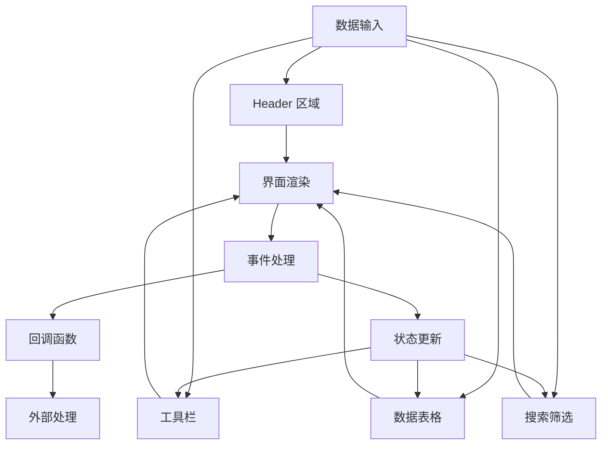

**图表来源**
- [ListReport 组件](file://app/examples/admin/src/components/ListReport/index.tsx#L145-L392)

#### 组件序列图
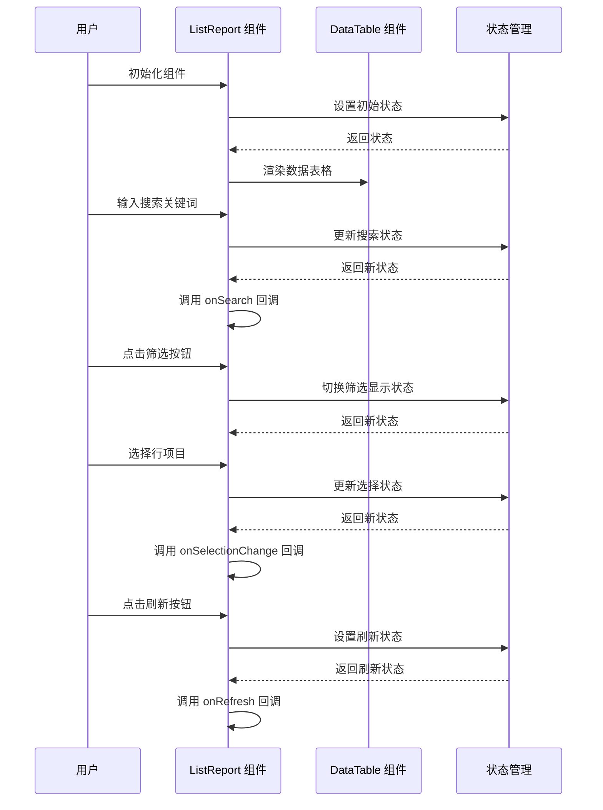

**图表来源**
- [ListReport 组件](file://app/examples/admin/src/components/ListReport/index.tsx#L170-L194)

**章节来源**
- [ListReport 组件](file://app/examples/admin/src/components/ListReport/index.tsx#L1-L398)

### ObjectPage 对象页面组件 API

#### 核心类型定义
```typescript
// 模式枚举
type ObjectPageMode = 'display' | 'edit' | 'create';

// 操作按钮接口
interface ObjectPageAction {
  key: string;
  label: string;
  icon?: ReactNode;
  variant?: 'primary' | 'secondary' | 'success' | 'danger' | 'ghost';
  onClick: () => void;
  loading?: boolean;
  disabled?: boolean;
  showInModes?: ObjectPageMode[];
  position?: 'header' | 'footer';
  showDropdown?: boolean;
}

// Section 接口
interface ObjectPageSection {
  id: string;
  title: string;
  subtitle?: string;
  icon?: ReactNode;
  content: ReactNode;
  hideInModes?: ObjectPageMode[];
  sidebar?: boolean;
}

// Header 字段接口
interface ObjectPageHeaderField {
  icon?: ReactNode;
  label: string;
  value: string | ReactNode;
}

// KPI 指标接口
interface ObjectPageKPI {
  value: string | number;
  label: string;
  color?: 'blue' | 'green' | 'orange' | 'red' | 'gray';
}

// 组件属性接口
interface ObjectPageProps {
  mode: ObjectPageMode;
  backPath: string;
  breadcrumb: string;
  title: string;
  subtitle?: string;
  status?: {
    label: string;
    color?: 'blue' | 'green' | 'yellow' | 'red' | 'gray';
  };
  headerIcon?: ReactNode;
  headerFields?: ObjectPageHeaderField[];
  kpis?: ObjectPageKPI[];
  tips?: string[];
  sections: ObjectPageSection[];
  actions?: ObjectPageAction[];
  showSectionNav?: boolean;
  className?: string;
}
```

#### 组件布局结构
ObjectPage 采用响应式布局设计，支持多种布局模式：

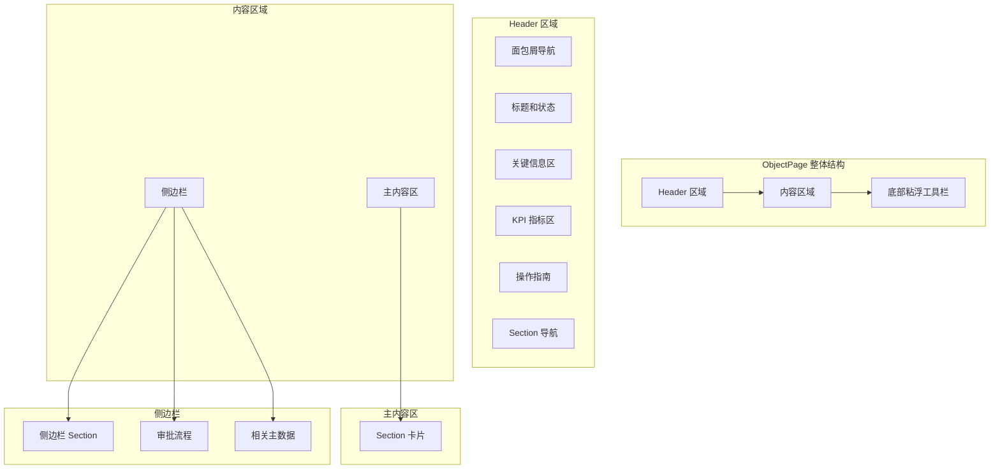

**图表来源**
- [ObjectPage 组件](file://app/examples/admin/src/components/ObjectPage/index.tsx#L214-L494)

#### 模式切换流程
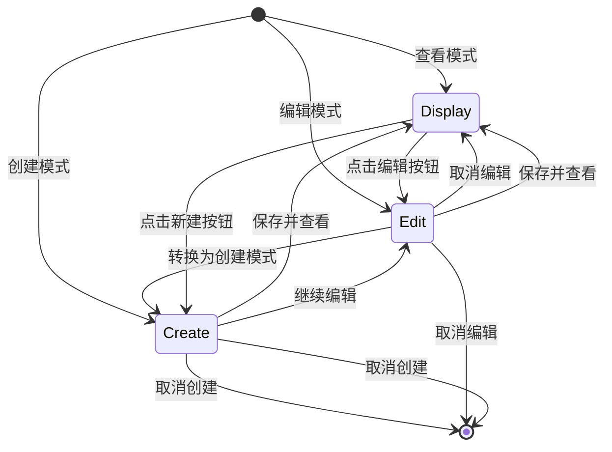

**图表来源**
- [ObjectPage 组件](file://app/examples/admin/src/components/ObjectPage/index.tsx#L131-L172)

**章节来源**
- [ObjectPage 组件](file://app/examples/admin/src/components/ObjectPage/index.tsx#L1-L544)

### EditableTable 可编辑表格组件 API

#### 核心类型定义
```typescript
// 列配置接口
interface EditableTableColumn<T> {
  key: string;
  title: string | ReactNode;
  width?: string | number;
  align?: 'left' | 'center' | 'right';
  required?: boolean;
  render: (record: T, index: number) => ReactNode;
}

// 组件属性接口
interface EditableTableProps<T> {
  columns: EditableTableColumn<T>[];
  dataSource: T[];
  rowKey: keyof T | ((record: T) => string);
  header?: {
    title: string;
    subtitle?: string;
    actions?: ReactNode;
  };
  footer?: ReactNode;
  emptyText?: string;
  minWidth?: number;
  className?: string;
  showIndex?: boolean;
  embedded?: boolean;
}
```

#### 辅助组件体系
EditableTable 提供完整的表格编辑辅助组件：

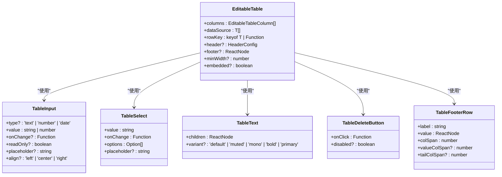

**图表来源**
- [EditableTable 组件](file://app/examples/admin/src/components/EditableTable/index.tsx#L10-L51)
- [EditableTable 组件](file://app/examples/admin/src/components/EditableTable/index.tsx#L164-L278)

#### 表格渲染流程
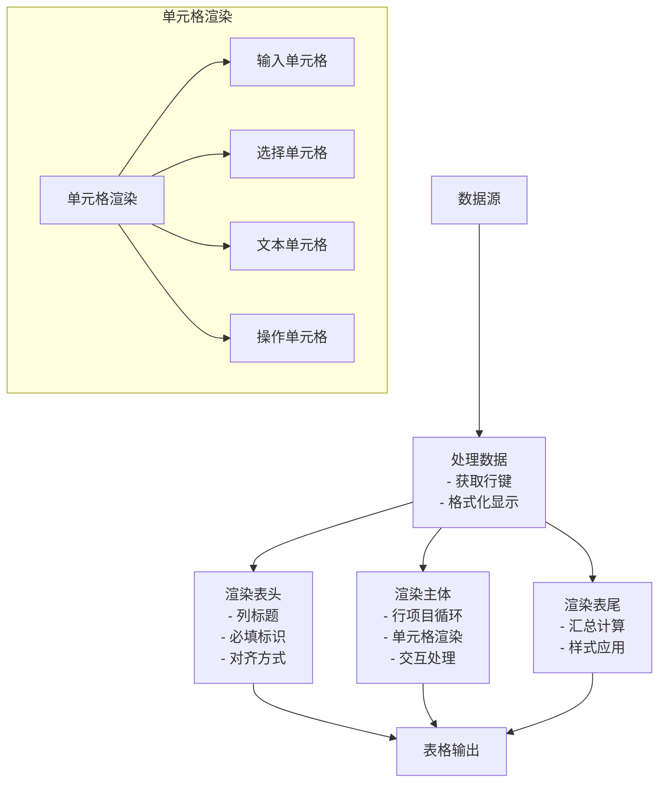

**图表来源**
- [EditableTable 组件](file://app/examples/admin/src/components/EditableTable/index.tsx#L54-L160)

**章节来源**
- [EditableTable 组件](file://app/examples/admin/src/components/EditableTable/index.tsx#L1-L308)

## 依赖关系分析

### 组件间依赖关系
```mermaid
graph TB
subgraph "业务组件依赖"
MasterDetail --> DataTable
ListReport --> DataTable
ObjectPage --> Button
EditableTable --> Input
EditableTable --> Select
end
subgraph "页面使用依赖"
CreatePage --> EditableTable
EditPage --> EditableTable
ListPage --> ListReport
ViewPage --> ObjectPage
end
subgraph "基础组件库"
DataTable --> @tanstack/react-table
Input --> BaseInput
Select --> BaseSelect
Button --> BaseButton
end
MasterDetail --> CreatePage
MasterDetail --> ListPage
MasterDetail --> ViewPage
ListReport --> ListPage
ObjectPage --> ViewPage
EditableTable --> CreatePage
EditableTable --> EditPage
```

**图表来源**
- [admin-component 导出索引](file://app/framework/admin-component/src/index.ts#L1-L38)
- [DataTable 组件](file://app/framework/admin-component/src/ui/data-table.tsx#L1-L375)

### 数据流依赖
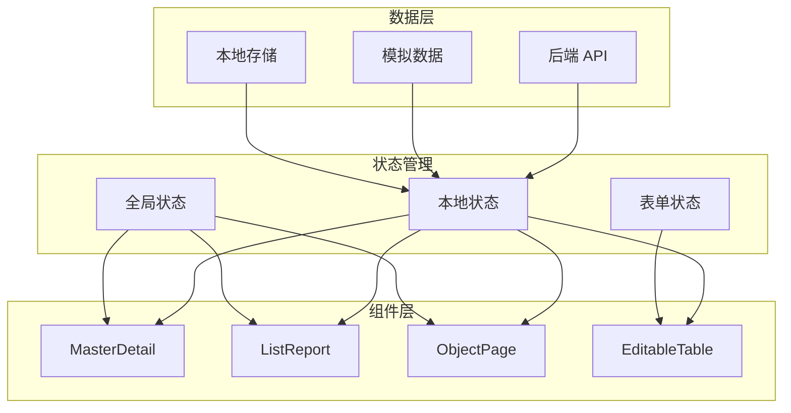

**图表来源**
- [MasterDetail 组件](file://app/examples/admin/src/components/MasterDetail/index.tsx#L133-L140)
- [ListReport 组件](file://app/examples/admin/src/components/ListReport/index.tsx#L170-L171)
- [ObjectPage 组件](file://app/examples/admin/src/components/ObjectPage/index.tsx#L147-L148)

**章节来源**
- [admin-component 导出索引](file://app/framework/admin-component/src/index.ts#L1-L38)
- [DataTable 组件](file://app/framework/admin-component/src/ui/data-table.tsx#L1-L375)

## 性能考虑
基于组件的实现特点，以下是关键的性能优化建议：

### MasterDetail 组件性能优化
- **虚拟滚动**：对于大量数据项时，考虑实现虚拟滚动以减少 DOM 节点数量
- **状态缓存**：缓存搜索结果和筛选状态，避免重复计算
- **事件防抖**：对搜索输入进行防抖处理，减少频繁的回调调用

### ListReport 组件性能优化
- **分页加载**：利用 `manualPagination` 实现服务端分页，避免一次性加载大量数据
- **列懒加载**：对于复杂列渲染，实现懒加载机制
- **选择状态优化**：使用 `RowSelectionState` 优化大表格的选择性能

### ObjectPage 组件性能优化
- **Section 懒加载**：对于大型 Section，实现按需加载
- **滚动优化**：使用 `scroll-mt-32` 等类名优化滚动体验
- **图片懒加载**：对于图片资源，实现懒加载策略

### EditableTable 组件性能优化
- **行渲染优化**：使用 `useMemo` 优化复杂单元格渲染
- **批量更新**：实现批量状态更新，减少重渲染次数
- **输入优化**：对频繁输入的单元格实现防抖处理

## 故障排除指南

### 常见问题及解决方案

#### MasterDetail 组件问题
**问题**：编辑模式下无法切换列表项
**原因**：编辑模式下禁用了列表项点击
**解决方案**：检查 `isEditing` 状态判断逻辑

**问题**：删除确认对话框不显示
**原因**：`showDeleteConfirm` 状态未正确设置
**解决方案**：确保 `handleDeleteClick` 方法正确调用

#### ListReport 组件问题
**问题**：搜索功能无效
**原因**：`onSearch` 回调未正确实现
**解决方案**：检查父组件的搜索处理逻辑

**问题**：分页显示异常
**原因**：`totalCount` 或 `pageSize` 参数配置错误
**解决方案**：验证分页参数的正确性

#### ObjectPage 组件问题
**问题**：Section 导航不工作
**原因**：`activeSection` 状态未正确更新
**解决方案**：检查 `scrollToSection` 方法的实现

**问题**：底部工具栏遮挡内容
**原因**：未正确设置底部占位空间
**解决方案**：确保 `h-20` 占位元素存在

#### EditableTable 组件问题
**问题**：单元格编辑无效
**原因**：`onChange` 回调未正确传递
**解决方案**：检查单元格渲染函数的回调处理

**问题**：行项目删除异常
**原因**：最小行数限制导致删除失败
**解决方案**：确保至少保留一行数据

**章节来源**
- [MasterDetail 组件](file://app/examples/admin/src/components/MasterDetail/index.tsx#L147-L180)
- [ListReport 组件](file://app/examples/admin/src/components/ListReport/index.tsx#L179-L182)
- [ObjectPage 组件](file://app/examples/admin/src/components/ObjectPage/index.tsx#L174-L181)
- [EditableTable 组件](file://app/examples/admin/src/components/EditableTable/index.tsx#L164-L202)

## 结论
本业务组件 API 文档系统性地介绍了四个核心业务组件的设计理念、API 规范和使用方法。通过统一的 SAP Fiori 设计语言和模块化的架构设计，这些组件能够满足企业级业务系统的多样化需求。

### 主要优势
1. **设计一致性**：统一的视觉设计和交互模式
2. **功能完整性**：覆盖了常见的业务场景需求
3. **扩展性强**：清晰的接口设计便于二次开发
4. **性能优化**：针对大数据量场景的优化考虑

### 应用建议
1. **组件选择**：根据业务场景选择合适的组件组合
2. **状态管理**：合理设计组件间的状态传递机制
3. **性能监控**：关注大数据量场景下的性能表现
4. **用户体验**：注重交互细节和加载状态的处理

## 附录

### 组件使用示例

#### MasterDetail 组件使用示例
```typescript
// 基本使用
<MasterDetail
  title="采购申请管理"
  items={items}
  onSelect={handleSelect}
  renderDetail={renderDetail}
  renderForm={renderForm}
  onSearch={handleSearch}
  onSave={handleSave}
  onDelete={handleDelete}
/>
```

#### ListReport 组件使用示例
```typescript
// 基本使用
<ListReport
  header={{
    title: "采购申请列表",
    subtitle: "管理所有采购申请单据",
    tag: "List Report"
  }}
  data={data}
  columns={columns}
  totalCount={totalCount}
  primaryAction={{
    id: "create",
    label: "创建",
    onClick: () => navigate("/create")
  }}
  onSearch={handleSearch}
  onFilterToggle={() => setShowFilter(!showFilter)}
  onRefresh={handleRefresh}
/>
```

#### ObjectPage 组件使用示例
```typescript
// 基本使用
<ObjectPage
  mode="display"
  backPath="/purchase-requisitions"
  breadcrumb="采购申请管理"
  title="采购申请详情"
  sections={sections}
  actions={actions}
  headerFields={headerFields}
  kpis={kpis}
/>
```

#### EditableTable 组件使用示例
```typescript
// 基本使用
<EditableTable
  columns={columns}
  dataSource={lineItems}
  rowKey="id"
  header={{
    title: "行项目",
    subtitle: "添加需要采购的物料明细"
  }}
  footer={footer}
/>
```

### 集成方案
1. **页面集成**：在具体业务页面中引入相应组件
2. **状态管理**：结合 React Hooks 实现状态管理
3. **路由集成**：与 React Router 集成实现页面跳转
4. **权限控制**：结合权限系统控制组件显示

### 扩展性建议
1. **自定义样式**：通过 `className` 属性实现样式定制
2. **国际化支持**：添加多语言支持
3. **主题定制**：支持深色模式等主题切换
4. **无障碍访问**：完善键盘导航和屏幕阅读器支持