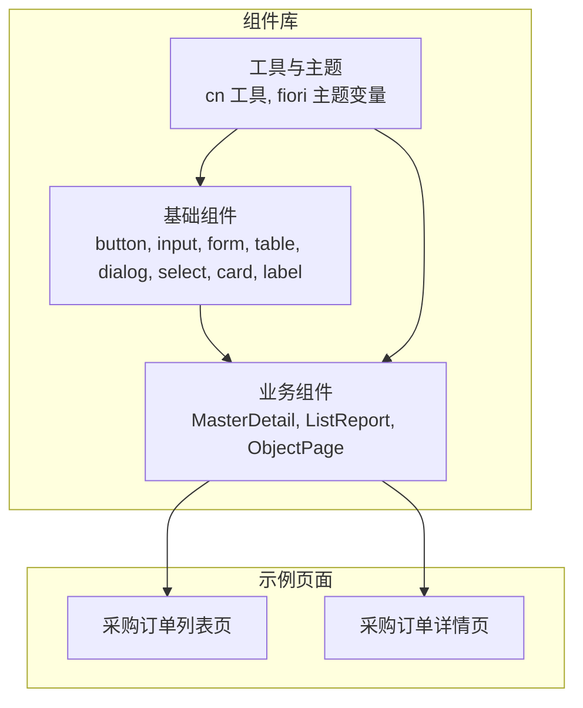
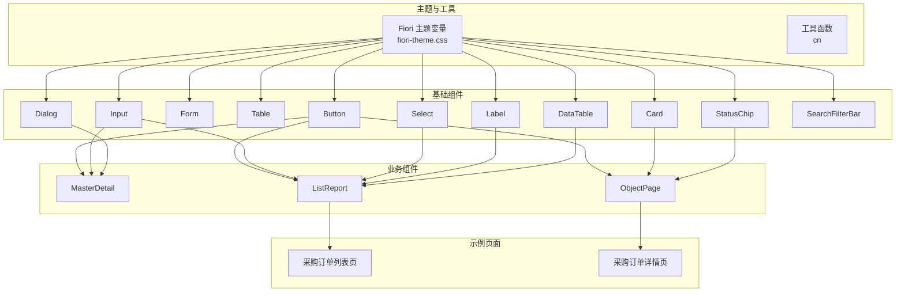
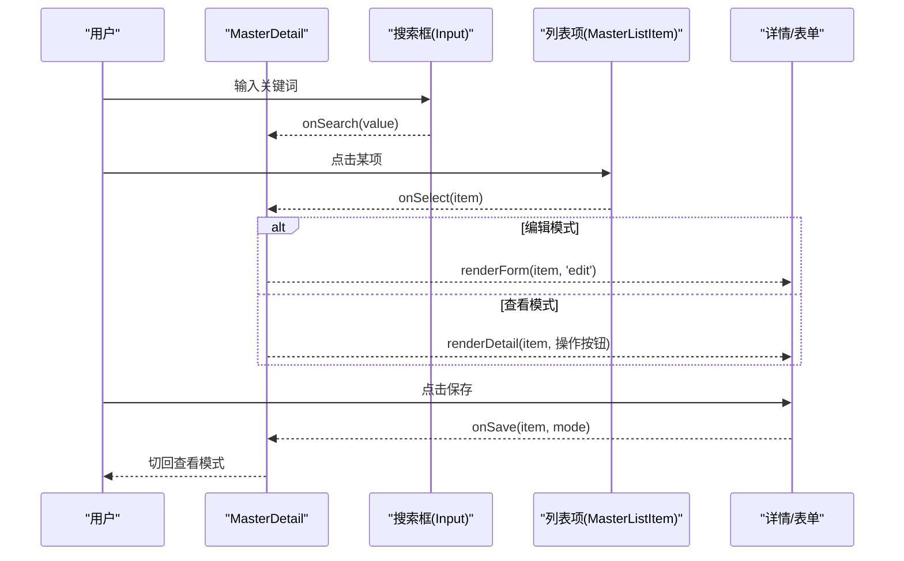
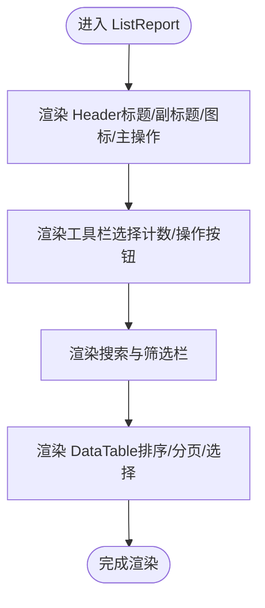
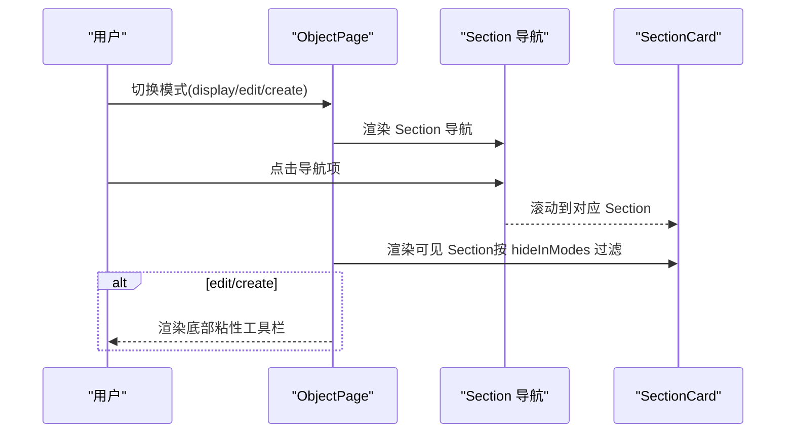
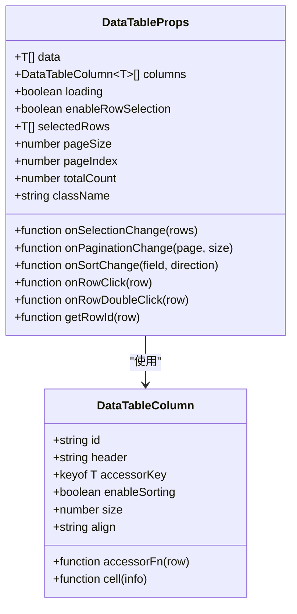
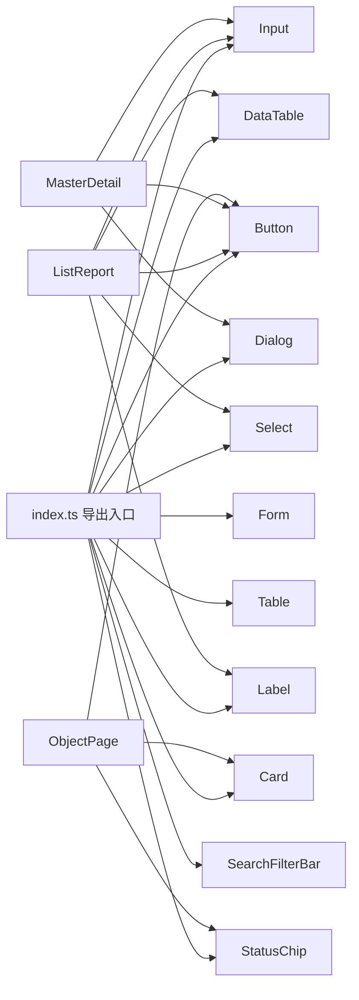

# 前端组件 API

<cite>
**本文引用的文件**
- [app/framework/admin-component/src/index.ts](file://app/framework/admin-component/src/index.ts)
- [app/framework/admin-component/src/ui/button.tsx](file://app/framework/admin-component/src/ui/button.tsx)
- [app/framework/admin-component/src/ui/input.tsx](file://app/framework/admin-component/src/ui/input.tsx)
- [app/framework/admin-component/src/ui/form.tsx](file://app/framework/admin-component/src/ui/form.tsx)
- [app/framework/admin-component/src/ui/table.tsx](file://app/framework/admin-component/src/ui/table.tsx)
- [app/framework/admin-component/src/ui/data-table.tsx](file://app/framework/admin-component/src/ui/data-table.tsx)
- [app/framework/admin-component/src/ui/select.tsx](file://app/framework/admin-component/src/ui/select.tsx)
- [app/framework/admin-component/src/ui/dialog.tsx](file://app/framework/admin-component/src/ui/dialog.tsx)
- [app/framework/admin-component/src/ui/card.tsx](file://app/framework/admin-component/src/ui/card.tsx)
- [app/framework/admin-component/src/ui/label.tsx](file://app/framework/admin-component/src/ui/label.tsx)
- [app/framework/admin-component/src/ui/status-chip.tsx](file://app/framework/admin-component/src/ui/status-chip.tsx)
- [app/framework/admin-component/src/ui/search-filter-bar.tsx](file://app/framework/admin-component/src/ui/search-filter-bar.tsx)
- [app/framework/admin-component/src/styles/fiori-theme.css](file://app/framework/admin-component/src/styles/fiori-theme.css)
- [app/examples/admin/src/components/MasterDetail/index.tsx](file://app/examples/admin/src/components/MasterDetail/index.tsx)
- [app/examples/admin/src/components/ListReport/index.tsx](file://app/examples/admin/src/components/ListReport/index.tsx)
- [app/examples/admin/src/components/ObjectPage/index.tsx](file://app/examples/admin/src/components/ObjectPage/index.tsx)
- [app/examples/admin/src/pages/purchase-orders/ListPage.tsx](file://app/examples/admin/src/pages/purchase-orders/ListPage.tsx)
- [app/examples/admin/src/pages/purchase-orders/ViewPage.tsx](file://app/examples/admin/src/pages/purchase-orders/ViewPage.tsx)
</cite>

## 目录
1. [简介](#简介)
2. [项目结构](#项目结构)
3. [核心组件](#核心组件)
4. [架构总览](#架构总览)
5. [详细组件分析](#详细组件分析)
6. [依赖关系分析](#依赖关系分析)
7. [性能考量](#性能考量)
8. [故障排查指南](#故障排查指南)
9. [结论](#结论)
10. [附录](#附录)

## 简介
本文件为前端组件库 API 的权威参考文档，覆盖基础 UI 组件与业务组件的完整接口、事件回调、样式定制与主题系统，并提供使用示例与组合模式。组件库基于 SAP Fiori Morning Horizon 设计语言，提供统一的主题变量、状态标签、数据表格与常用业务布局组件，适用于管理端与报表场景。

## 项目结构
组件库采用“基础组件 + 业务组件 + 示例页面”的分层组织：
- 基础组件：按钮、输入框、表单、表格、对话框、选择器、标签等
- 业务组件：MasterDetail、ListReport、ObjectPage 等
- 示例页面：展示如何在真实业务中组合使用上述组件

图表来源
- [app/framework/admin-component/src/index.ts](file://app/framework/admin-component/src/index.ts#L1-L38)
- [app/framework/admin-component/src/styles/fiori-theme.css](file://app/framework/admin-component/src/styles/fiori-theme.css#L1-L140)
- [app/examples/admin/src/pages/purchase-orders/ListPage.tsx](file://app/examples/admin/src/pages/purchase-orders/ListPage.tsx#L1-L296)
- [app/examples/admin/src/pages/purchase-orders/ViewPage.tsx](file://app/examples/admin/src/pages/purchase-orders/ViewPage.tsx#L1-L395)

章节来源
- [app/framework/admin-component/src/index.ts](file://app/framework/admin-component/src/index.ts#L1-L38)
- [app/framework/admin-component/src/styles/fiori-theme.css](file://app/framework/admin-component/src/styles/fiori-theme.css#L1-L140)

## 核心组件
本节概述基础组件的职责与对外 API，便于快速查阅与集成。

- Button
  - 功能：提供多种变体与尺寸，支持 asChild 透传原生 button
  - 关键属性：variant（default/destructive/outline/secondary/ghost/link）、size（default/xs/sm/lg/icon/icon-xs/icon-sm/icon-lg）、asChild、className
  - 默认值：variant="default"、size="default"
  - 适用场景：主次按钮、图标按钮、链接按钮
  - 参考路径：[按钮实现](file://app/framework/admin-component/src/ui/button.tsx#L41-L62)

- Input
  - 功能：基础输入控件，内置焦点态与无效态样式
  - 关键属性：type、className、...props
  - 默认值：无
  - 适用场景：文本、数字、日期等输入
  - 参考路径：[输入框实现](file://app/framework/admin-component/src/ui/input.tsx#L5-L18)

- Form（Form/FormLabel/FormControl/FormDescription/FormMessage/FormField/useFormField）
  - 功能：基于 react-hook-form 的表单上下文与验证反馈
  - 关键属性：FormProvider、ControllerProps、useFormState/useFormField
  - 默认值：无
  - 适用场景：复杂表单校验与错误提示
  - 参考路径：[表单实现](file://app/framework/admin-component/src/ui/form.tsx#L19-L167)

- Table/TableHeader/TableBody/TableFooter/TableHead/TableRow/TableCell/TableCaption
  - 功能：语义化表格容器与单元格组件
  - 关键属性：className、...props
  - 默认值：无
  - 适用场景：静态或受控表格
  - 参考路径：[表格实现](file://app/framework/admin-component/src/ui/table.tsx#L7-L105)

- DataTable（数据表格）
  - 功能：基于 @tanstack/react-table 的高性能表格，支持排序、分页、选择、行点击/双击
  - 关键属性：data、columns、loading、enableRowSelection、selectedRows、onSelectionChange、pageSize/pageIndex/pageSizeOptions、onPaginationChange、onSortChange、onRowClick/onRowDoubleClick、getRowId、totalCount
  - 默认值：pageSize=25、pageSizeOptions=[10,25,50,100]、enableRowSelection=false
  - 适用场景：大数据量列表、带筛选与分页的报表
  - 参考路径：[数据表格实现](file://app/framework/admin-component/src/ui/data-table.tsx#L42-L89)

- Select/SelectItem（下拉选择）
  - 功能：基于 Radix UI 的可访问性下拉，支持多选与空值处理
  - 关键属性：value/defaultValue/onValueChange/onChange/options/placeholder/disabled/className
  - 默认值：placeholder="请选择"
  - 适用场景：单选/多选、动态选项
  - 参考路径：[下拉实现](file://app/framework/admin-component/src/ui/select.tsx#L41-L121)

- Dialog/DialogTrigger/DialogPortal/DialogOverlay/DialogContent/DialogHeader/DialogFooter/DialogTitle/DialogDescription
  - 功能：模态对话框，支持关闭按钮与键盘交互
  - 关键属性：showCloseButton、className、...props
  - 默认值：无
  - 适用场景：确认弹窗、表单弹层
  - 参考路径：[对话框实现](file://app/framework/admin-component/src/ui/dialog.tsx#L10-L82)

- Card/CardHeader/CardFooter/CardTitle/CardDescription/CardContent
  - 功能：卡片容器与内容分区
  - 关键属性：className、...props
  - 默认值：无
  - 适用场景：信息区块、面板容器
  - 参考路径：[卡片实现](file://app/framework/admin-component/src/ui/card.tsx#L5-L82)

- Label
  - 功能：表单标签，配合表单上下文使用
  - 关键属性：className、...props
  - 默认值：无
  - 适用场景：表单项标题
  - 参考路径：[标签实现](file://app/framework/admin-component/src/ui/label.tsx#L8-L21)

- StatusChip/MappedStatusChip
  - 功能：状态标签，支持预设映射与悬停提示
  - 关键属性：variant/size/outlined/icon/label/description、status/statusMap/showIcon/showTooltip
  - 默认值：variant="default"、size="default"、outlined=false
  - 适用场景：状态展示、审批流程
  - 参考路径：[状态标签实现](file://app/framework/admin-component/src/ui/status-chip.tsx#L63-L156)

- SearchFilterBar
  - 功能：搜索 + 筛选折叠栏，支持多字段类型与批量应用
  - 关键属性：searchPlaceholder/searchValue/onSearchChange、filterFields/filterValues/onFilterChange、onApply/onClear、loading/actions
  - 默认值：searchPlaceholder="搜索..."、filterFields=[]、filterValues={}
  - 适用场景：列表页搜索与筛选
  - 参考路径：[搜索筛选栏实现](file://app/framework/admin-component/src/ui/search-filter-bar.tsx#L52-L186)

章节来源
- [app/framework/admin-component/src/ui/button.tsx](file://app/framework/admin-component/src/ui/button.tsx#L1-L65)
- [app/framework/admin-component/src/ui/input.tsx](file://app/framework/admin-component/src/ui/input.tsx#L1-L22)
- [app/framework/admin-component/src/ui/form.tsx](file://app/framework/admin-component/src/ui/form.tsx#L1-L168)
- [app/framework/admin-component/src/ui/table.tsx](file://app/framework/admin-component/src/ui/table.tsx#L1-L117)
- [app/framework/admin-component/src/ui/data-table.tsx](file://app/framework/admin-component/src/ui/data-table.tsx#L1-L375)
- [app/framework/admin-component/src/ui/select.tsx](file://app/framework/admin-component/src/ui/select.tsx#L1-L154)
- [app/framework/admin-component/src/ui/dialog.tsx](file://app/framework/admin-component/src/ui/dialog.tsx#L1-L159)
- [app/framework/admin-component/src/ui/card.tsx](file://app/framework/admin-component/src/ui/card.tsx#L1-L93)
- [app/framework/admin-component/src/ui/label.tsx](file://app/framework/admin-component/src/ui/label.tsx#L1-L25)
- [app/framework/admin-component/src/ui/status-chip.tsx](file://app/framework/admin-component/src/ui/status-chip.tsx#L1-L178)
- [app/framework/admin-component/src/ui/search-filter-bar.tsx](file://app/framework/admin-component/src/ui/search-filter-bar.tsx#L1-L276)

## 架构总览
组件库以“主题变量 + 组件导出 + 业务组件”三层结构组织，示例页面通过业务组件串联基础组件，形成完整的管理端工作流。

图表来源
- [app/framework/admin-component/src/styles/fiori-theme.css](file://app/framework/admin-component/src/styles/fiori-theme.css#L1-L140)
- [app/framework/admin-component/src/index.ts](file://app/framework/admin-component/src/index.ts#L1-L38)
- [app/examples/admin/src/pages/purchase-orders/ListPage.tsx](file://app/examples/admin/src/pages/purchase-orders/ListPage.tsx#L1-L296)
- [app/examples/admin/src/pages/purchase-orders/ViewPage.tsx](file://app/examples/admin/src/pages/purchase-orders/ViewPage.tsx#L1-L395)

## 详细组件分析

### MasterDetail（主从布局）
- 用途：左侧列表 + 右侧详情的经典布局，支持查看/编辑/新建模式与搜索过滤
- 关键属性（MasterDetailProps）
  - title/subtitle/headerIcon：页面标题与图标
  - items：列表数据（泛型 MasterDetailItem）
  - selectedId/onSelect：选中项与回调
  - renderDetail/renderForm：详情渲染与表单渲染
  - renderEmpty/searchPlaceholder/onSearch：空状态与搜索
  - showCreate/createLabel/allowEdit/allowDelete：功能开关
  - onSave/onDelete：保存与删除回调
  - masterWidth：左侧宽度
- 关键类型
  - MasterDetailItem：id/title/可选 subtitle/description/status/badge/icon
  - EditMode：view/edit/create
- 事件与行为
  - 搜索：onSearch(keyword)
  - 选中：onSelect(item)
  - 保存：onSave(item, mode)
  - 删除：onDelete(item)
  - 切换编辑：handleCreate/handleEdit/handleCancel/handleSave
  - 删除确认：handleDeleteClick/handleDeleteConfirm
- 适用场景：主从数据浏览与编辑、带搜索与筛选的列表详情页
- 参考路径：[主从布局实现](file://app/examples/admin/src/components/MasterDetail/index.tsx#L28-L355)

图表来源
- [app/examples/admin/src/components/MasterDetail/index.tsx](file://app/examples/admin/src/components/MasterDetail/index.tsx#L142-L168)

章节来源
- [app/examples/admin/src/components/MasterDetail/index.tsx](file://app/examples/admin/src/components/MasterDetail/index.tsx#L1-L498)

### ListReport（列表报表）
- 用途：基于 SAP Fiori List Report 的一体化卡片布局，包含 Header、工具栏、搜索筛选、数据表格
- 关键属性（ListReportProps）
  - header：title/subtitle/tag/icon
  - data/columns：数据与列定义（DataTableColumn）
  - totalCount/loading：总数与加载态
  - primaryAction/selectionActions：主操作与行选择操作
  - searchPlaceholder/onSearch：搜索
  - showFilter/onFilterToggle/filterContent/filterCount/onFilterClear：筛选
  - onRefresh/onExport/onRowClick/onSelectionChange：事件
  - pageSize/pageIndex/onPaginationChange：分页
  - getRowId/className：行标识与自定义样式
- 适用场景：列表页、报表页、带筛选与分页的数据展示
- 参考路径：[列表报表实现](file://app/examples/admin/src/components/ListReport/index.tsx#L94-L392)

图表来源
- [app/examples/admin/src/components/ListReport/index.tsx](file://app/examples/admin/src/components/ListReport/index.tsx#L195-L391)

章节来源
- [app/examples/admin/src/components/ListReport/index.tsx](file://app/examples/admin/src/components/ListReport/index.tsx#L1-L398)

### ObjectPage（对象页）
- 用途：基于 SAP Fiori Object Page 的通用对象页，支持 display/edit/create 三种模式
- 关键属性（ObjectPageProps）
  - mode/backPath/breadcrumb/title/subtitle/status/headerIcon/headerFields/kpis/tips/sections/actions/showSectionNav/className
- 关键类型
  - ObjectPageMode：display/edit/create
  - ObjectPageAction：key/label/icon/variant/onClick/loading/disabled/showInModes/position/showDropdown
  - ObjectPageSection：id/title/subtitle/icon/content/hideInModes/sidebar
  - ObjectPageHeaderField：icon/label/value
  - ObjectPageKPI：value/label/color
- 适用场景：详情页、编辑页、创建页，支持侧边栏导航与粘性底部工具栏
- 参考路径：[对象页实现](file://app/examples/admin/src/components/ObjectPage/index.tsx#L96-L544)

图表来源
- [app/examples/admin/src/components/ObjectPage/index.tsx](file://app/examples/admin/src/components/ObjectPage/index.tsx#L174-L181)

章节来源
- [app/examples/admin/src/components/ObjectPage/index.tsx](file://app/examples/admin/src/components/ObjectPage/index.tsx#L1-L544)

### DataTable（数据表格）
- 用途：高性能表格，支持排序、分页、选择、行点击/双击、列对齐
- 关键属性（DataTableProps）
  - data/columns/loading：数据与列定义、加载态
  - enableRowSelection/selectedRows/onSelectionChange：选择相关
  - pageSize/pageIndex/pageSizeOptions/onPaginationChange：分页
  - onSortChange：排序回调
  - onRowClick/onRowDoubleClick：行事件
  - getRowId/className：行标识与自定义样式
- 适用场景：大数据量列表、报表、可排序可分页的数据展示
- 参考路径：[数据表格实现](file://app/framework/admin-component/src/ui/data-table.tsx#L73-L372)

图表来源
- [app/framework/admin-component/src/ui/data-table.tsx](file://app/framework/admin-component/src/ui/data-table.tsx#L42-L89)

章节来源
- [app/framework/admin-component/src/ui/data-table.tsx](file://app/framework/admin-component/src/ui/data-table.tsx#L1-L375)

### SearchFilterBar（搜索筛选栏）
- 用途：统一的搜索与筛选入口，支持多字段类型与批量应用
- 关键属性（SearchFilterBarProps）
  - searchPlaceholder/searchValue/onSearchChange：搜索
  - filterFields/filterValues/onFilterChange：字段定义与值
  - onApply/onClear/loading/actions：应用/清除/加载/额外操作
- 适用场景：列表页、报表页的统一筛选入口
- 参考路径：[搜索筛选栏实现](file://app/framework/admin-component/src/ui/search-filter-bar.tsx#L52-L186)

章节来源
- [app/framework/admin-component/src/ui/search-filter-bar.tsx](file://app/framework/admin-component/src/ui/search-filter-bar.tsx#L1-L276)

### StatusChip/MappedStatusChip（状态标签）
- 用途：状态标签组件，支持预设映射与悬停提示
- 关键属性
  - StatusChip：variant/size/outlined/icon/label/description
  - MappedStatusChip：status/statusMap/showIcon/showTooltip
- 适用场景：状态展示、审批流程、进度指示
- 参考路径：[状态标签实现](file://app/framework/admin-component/src/ui/status-chip.tsx#L63-L156)

章节来源
- [app/framework/admin-component/src/ui/status-chip.tsx](file://app/framework/admin-component/src/ui/status-chip.tsx#L1-L178)

### 示例页面（组合模式）
- 采购订单列表页（ListPage）
  - 使用 ListReport 组件，配置 header、data、columns、primaryAction、selectionActions、searchPlaceholder、showFilter、onFilterToggle、filterCount、onFilterClear、filterContent、getRowId
  - 参考路径：[列表页实现](file://app/examples/admin/src/pages/purchase-orders/ListPage.tsx#L72-L293)
- 采购订单详情页（ViewPage）
  - 使用 ObjectPage 组件，配置 mode/backPath/breadcrumb/title/subtitle/status/headerIcon/headerFields/kpis/sections/actions/showSectionNav
  - 参考路径：[详情页实现](file://app/examples/admin/src/pages/purchase-orders/ViewPage.tsx#L96-L394)

章节来源
- [app/examples/admin/src/pages/purchase-orders/ListPage.tsx](file://app/examples/admin/src/pages/purchase-orders/ListPage.tsx#L1-L296)
- [app/examples/admin/src/pages/purchase-orders/ViewPage.tsx](file://app/examples/admin/src/pages/purchase-orders/ViewPage.tsx#L1-L395)

## 依赖关系分析
- 组件导出入口集中于 index.ts，统一暴露基础组件与业务组件
- 业务组件依赖基础组件（如 Button/Input/Dialog/DataTable 等）
- 示例页面通过业务组件串联基础组件，形成完整工作流

图表来源
- [app/framework/admin-component/src/index.ts](file://app/framework/admin-component/src/index.ts#L1-L38)

章节来源
- [app/framework/admin-component/src/index.ts](file://app/framework/admin-component/src/index.ts#L1-L38)

## 性能考量
- DataTable
  - 使用虚拟滚动与手动分页时，合理设置 pageSize 与 totalCount，避免一次性渲染大量行
  - 列对齐与固定列宽：通过 align 与 size 控制渲染成本
  - 选择与排序：仅在需要时启用 enableRowSelection 与 enableSorting
- ListReport
  - 将筛选内容延迟渲染（展开时再渲染），减少初始渲染压力
  - 搜索与筛选联动：合并请求，避免频繁触发 API
- ObjectPage
  - Section 导航与滚动定位：仅在需要时渲染多个 Section，控制 DOM 数量
  - 底部粘性工具栏：在 edit/create 模式下按需显示，减少常驻元素
- MasterDetail
  - 编辑模式禁用列表交互，避免不必要的事件处理
  - 列表项渲染：使用 isSelected 与 disabled 控制样式与交互

## 故障排查指南
- 表单校验与错误提示
  - 使用 FormLabel/FormControl/FormMessage 组合，确保 aria-invalid 与错误文案正确绑定
  - 参考路径：[表单实现](file://app/framework/admin-component/src/ui/form.tsx#L90-L156)
- 下拉选择空值问题
  - Select 对空字符串进行占位符转换，避免 Radix UI 不支持空字符串
  - 参考路径：[下拉实现](file://app/framework/admin-component/src/ui/select.tsx#L34-L56)
- 对话框焦点与可访问性
  - DialogOverlay/DialogTrigger/DialogClose 提供键盘与焦点管理
  - 参考路径：[对话框实现](file://app/framework/admin-component/src/ui/dialog.tsx#L34-L82)
- 状态标签样式异常
  - 检查主题变量是否正确引入，确保 --fiori-* 变量存在
  - 参考路径：[主题变量](file://app/framework/admin-component/src/styles/fiori-theme.css#L1-L140)

章节来源
- [app/framework/admin-component/src/ui/form.tsx](file://app/framework/admin-component/src/ui/form.tsx#L90-L156)
- [app/framework/admin-component/src/ui/select.tsx](file://app/framework/admin-component/src/ui/select.tsx#L34-L56)
- [app/framework/admin-component/src/ui/dialog.tsx](file://app/framework/admin-component/src/ui/dialog.tsx#L34-L82)
- [app/framework/admin-component/src/styles/fiori-theme.css](file://app/framework/admin-component/src/styles/fiori-theme.css#L1-L140)

## 结论
本组件库以 SAP Fiori 为主题基线，提供从基础 UI 到业务场景的完整能力。通过统一的主题变量、清晰的组件 API 与丰富的业务组件，开发者可以快速构建一致、可维护且高性能的管理端界面。建议在实际项目中结合示例页面的组合模式，按需启用功能与样式，确保良好的用户体验与可访问性。

## 附录
- 主题变量与 CSS 变量
  - 采用 Morning Horizon 色板与 Evening Horizon 暗色主题映射
  - 变量命名遵循 --fiori-* 前缀，同时映射到 shadcn 变量
  - 参考路径：[主题变量](file://app/framework/admin-component/src/styles/fiori-theme.css#L1-L140)
- 组件导出清单
  - 基础组件：Button、Input、Form、Table、Dialog、Select、Card、Label
  - 业务组件：DataTable、StatusChip、SearchFilterBar
  - 参考路径：[导出入口](file://app/framework/admin-component/src/index.ts#L6-L38)

章节来源
- [app/framework/admin-component/src/styles/fiori-theme.css](file://app/framework/admin-component/src/styles/fiori-theme.css#L1-L140)
- [app/framework/admin-component/src/index.ts](file://app/framework/admin-component/src/index.ts#L1-L38)