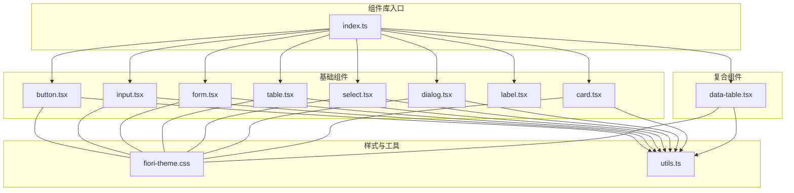
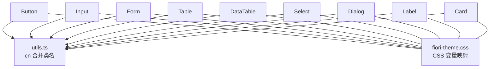
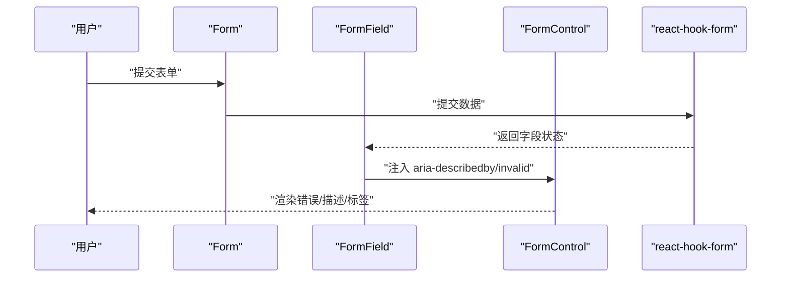
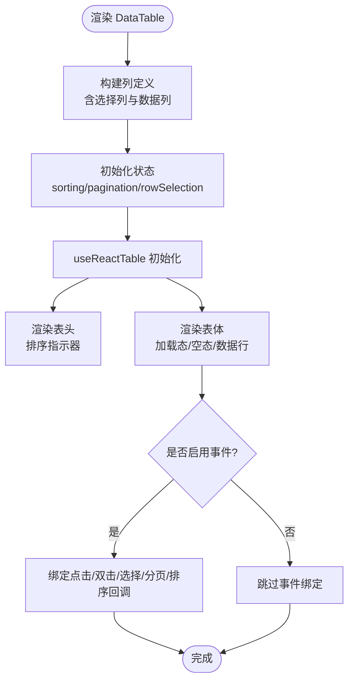
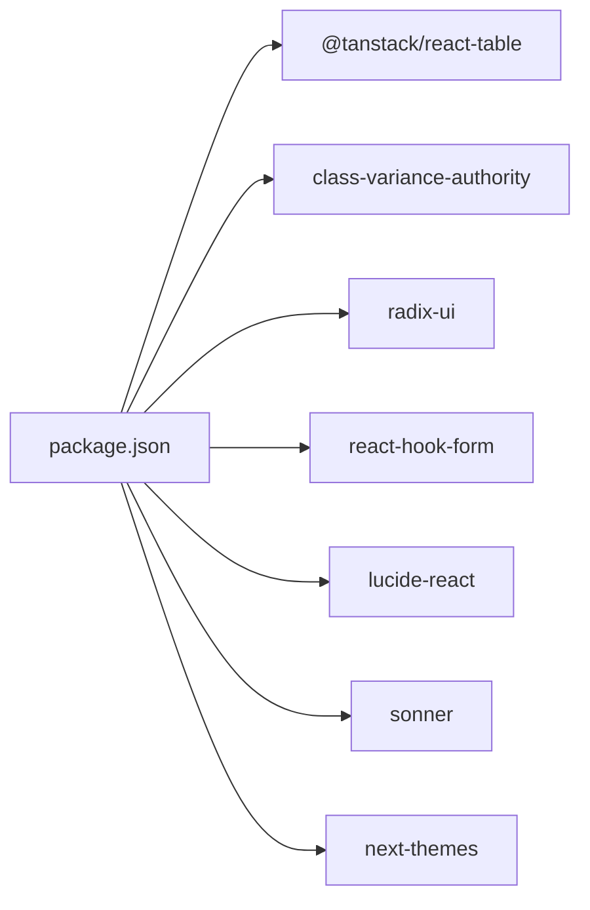

# 基础 UI 组件 API

<cite>
**本文引用的文件**
- [button.tsx](file://app/framework/admin-component/src/ui/button.tsx)
- [input.tsx](file://app/framework/admin-component/src/ui/input.tsx)
- [form.tsx](file://app/framework/admin-component/src/ui/form.tsx)
- [table.tsx](file://app/framework/admin-component/src/ui/table.tsx)
- [data-table.tsx](file://app/framework/admin-component/src/ui/data-table.tsx)
- [select.tsx](file://app/framework/admin-component/src/ui/select.tsx)
- [dialog.tsx](file://app/framework/admin-component/src/ui/dialog.tsx)
- [label.tsx](file://app/framework/admin-component/src/ui/label.tsx)
- [card.tsx](file://app/framework/admin-component/src/ui/card.tsx)
- [fiori-theme.css](file://app/framework/admin-component/src/styles/fiori-theme.css)
- [index.ts](file://app/framework/admin-component/src/index.ts)
- [package.json](file://app/framework/admin-component/package.json)
- [utils.ts](file://app/framework/admin-component/src/utils.ts)
- [ListPage.tsx（采购订单）](file://app/examples/admin/src/pages/purchase-orders/ListPage.tsx)
- [ListPage.tsx（收货管理）](file://app/examples/admin/src/pages/goods-receipt/ListPage.tsx)
</cite>

## 目录
1. [简介](#简介)
2. [项目结构](#项目结构)
3. [核心组件](#核心组件)
4. [架构总览](#架构总览)
5. [组件详细分析](#组件详细分析)
6. [依赖关系分析](#依赖关系分析)
7. [性能与可访问性](#性能与可访问性)
8. [故障排查指南](#故障排查指南)
9. [结论](#结论)
10. [附录：使用示例与最佳实践](#附录使用示例与最佳实践)

## 简介
本文件为“基础 UI 组件 API”参考文档，覆盖按钮(Button)、输入框(Input)、表单(Form)、表格(Table)、数据表格(DataTable)、下拉选择(Select)、对话框(Dialog)、标签(Label)、卡片(Card)等组件的完整 API 规范。内容包括：
- Props 接口、属性类型、默认值与可选配置
- 事件回调、状态管理与无障碍属性
- 样式定制、CSS 变量与主题变量
- 响应式设计支持与组合模式
- 实际使用示例与最佳实践

## 项目结构
组件库位于 admin-component 包中，采用按功能模块划分的目录结构，并通过统一入口导出。样式基于 SAP Fiori 主题变量，结合 Tailwind CSS 与 class-variance-authority 实现变体控制。

图表来源
- [index.ts](file://app/framework/admin-component/src/index.ts#L9-L38)
- [button.tsx](file://app/framework/admin-component/src/ui/button.tsx#L1-L65)
- [input.tsx](file://app/framework/admin-component/src/ui/input.tsx#L1-L22)
- [form.tsx](file://app/framework/admin-component/src/ui/form.tsx#L1-L168)
- [table.tsx](file://app/framework/admin-component/src/ui/table.tsx#L1-L117)
- [data-table.tsx](file://app/framework/admin-component/src/ui/data-table.tsx#L1-L375)
- [select.tsx](file://app/framework/admin-component/src/ui/select.tsx#L1-L154)
- [dialog.tsx](file://app/framework/admin-component/src/ui/dialog.tsx#L1-L159)
- [label.tsx](file://app/framework/admin-component/src/ui/label.tsx#L1-L25)
- [card.tsx](file://app/framework/admin-component/src/ui/card.tsx#L1-L93)
- [fiori-theme.css](file://app/framework/admin-component/src/styles/fiori-theme.css#L1-L140)
- [utils.ts](file://app/framework/admin-component/src/utils.ts#L1-L7)

章节来源
- [index.ts](file://app/framework/admin-component/src/index.ts#L9-L38)
- [package.json](file://app/framework/admin-component/package.json#L1-L43)

## 核心组件
本节概述各组件的职责与定位：
- Button：语义化按钮，支持多种变体与尺寸，具备无障碍与焦点环控制。
- Input：原生输入封装，内置聚焦与无效态样式。
- Form：基于 react-hook-form 的表单上下文与字段绑定，提供标签、描述、错误消息等配套组件。
- Table：HTML 表格结构的语义化封装，支持容器滚动与 hover/selected 状态。
- DataTable：基于 @tanstack/react-table 的高性能数据表格，支持排序、分页、选择、加载态与事件回调。
- Select：基于 Radix UI 的下拉选择，支持空值占位转换、选项渲染与自定义子节点。
- Dialog：基于 Radix UI 的对话框，提供触发器、遮罩、内容区、标题与描述等。
- Label：表单标签，适配禁用与错误态。
- Card：卡片容器，支持头部、标题、描述、内容、底部与操作区域。

章节来源
- [button.tsx](file://app/framework/admin-component/src/ui/button.tsx#L41-L65)
- [input.tsx](file://app/framework/admin-component/src/ui/input.tsx#L5-L22)
- [form.tsx](file://app/framework/admin-component/src/ui/form.tsx#L19-L168)
- [table.tsx](file://app/framework/admin-component/src/ui/table.tsx#L7-L117)
- [data-table.tsx](file://app/framework/admin-component/src/ui/data-table.tsx#L30-L69)
- [select.tsx](file://app/framework/admin-component/src/ui/select.tsx#L22-L51)
- [dialog.tsx](file://app/framework/admin-component/src/ui/dialog.tsx#L10-L82)
- [label.tsx](file://app/framework/admin-component/src/ui/label.tsx#L8-L25)
- [card.tsx](file://app/framework/admin-component/src/ui/card.tsx#L5-L93)

## 架构总览
组件库以“入口统一导出 + 工具函数 + 主题变量”的方式组织，基础组件通过 cn 合并类名，Form 组件与 react-hook-form 深度集成，DataTable 基于 @tanstack/react-table 提供高性能数据渲染与交互。

图表来源
- [utils.ts](file://app/framework/admin-component/src/utils.ts#L4-L6)
- [fiori-theme.css](file://app/framework/admin-component/src/styles/fiori-theme.css#L75-L111)
- [button.tsx](file://app/framework/admin-component/src/ui/button.tsx#L7-L39)
- [input.tsx](file://app/framework/admin-component/src/ui/input.tsx#L10-L15)
- [form.tsx](file://app/framework/admin-component/src/ui/form.tsx#L16-L17)
- [table.tsx](file://app/framework/admin-component/src/ui/table.tsx#L9-L18)
- [data-table.tsx](file://app/framework/admin-component/src/ui/data-table.tsx#L25-L26)
- [select.tsx](file://app/framework/admin-component/src/ui/select.tsx#L9-L9)
- [dialog.tsx](file://app/framework/admin-component/src/ui/dialog.tsx#L7-L8)
- [label.tsx](file://app/framework/admin-component/src/ui/label.tsx#L6-L6)
- [card.tsx](file://app/framework/admin-component/src/ui/card.tsx#L3-L3)

## 组件详细分析

### Button（按钮）
- 功能要点
  - 支持变体：default、destructive、outline、secondary、ghost、link
  - 支持尺寸：default、xs、sm、lg、icon、icon-xs、icon-sm、icon-lg
  - 支持 asChild（Slot.Root）以复用父级元素标签
  - 内置焦点环、无效态、禁用态与图标尺寸适配
- 关键 Props
  - className: 字符串
  - variant: 枚举（默认 default）
  - size: 枚举（默认 default）
  - asChild: 布尔（默认 false）
  - 其余继承自原生 button
- 事件与状态
  - 通过原生 button 事件（如 onClick、onBlur 等）接入
  - 无效态通过 aria-invalid 控制
- 样式与主题
  - 基于 CSS 变量映射（--primary、--destructive、--ring 等）
  - 支持暗色模式（.dark）
- 使用建议
  - 图标按钮请确保 SVG 尺寸一致或显式设置 size-* 类
  - 与表单配合时，使用 asChild 保持语义正确

章节来源
- [button.tsx](file://app/framework/admin-component/src/ui/button.tsx#L7-L39)
- [button.tsx](file://app/framework/admin-component/src/ui/button.tsx#L41-L65)
- [fiori-theme.css](file://app/framework/admin-component/src/styles/fiori-theme.css#L75-L111)

### Input（输入框）
- 功能要点
  - 原生 input 封装，内置聚焦环、无效态与禁用态
  - 支持文件选择、占位符、选择文本高亮等
- 关键 Props
  - className: 字符串
  - type: 字符串（如 text、date、number 等）
  - 其余继承自原生 input
- 事件与状态
  - 通过原生事件接入（onChange、onFocus、onBlur 等）
  - 无效态通过 aria-invalid 控制
- 样式与主题
  - 基于 --border、--input、--ring 等变量
  - 支持暗色模式
- 使用建议
  - 与 FormLabel/FormMessage 组合使用，提升可访问性

章节来源
- [input.tsx](file://app/framework/admin-component/src/ui/input.tsx#L5-L22)
- [fiori-theme.css](file://app/framework/admin-component/src/styles/fiori-theme.css#L129-L139)

### Form（表单）
- 功能要点
  - FormProvider：提供 react-hook-form 上下文
  - FormField：字段包装，注入 name
  - useFormField：读取字段状态与 ID
  - FormItem：布局容器，生成唯一 ID
  - FormLabel：标签，自动关联字段 ID 与错误态
  - FormControl：插槽容器，注入 aria-describedby 与 aria-invalid
  - FormDescription：辅助描述文本
  - FormMessage：错误消息，优先显示错误信息
- 关键 Props
  - Form/FormField：继承 react-hook-form 的 ControllerProps
  - FormItem：className
  - FormLabel：继承 LabelPrimitive.Root
  - FormControl：继承 Slot.Root
  - FormDescription/FormMessage：className
- 事件与状态
  - 通过 react-hook-form 管理字段状态与验证
  - 自动注入 aria-* 属性，提升可访问性
- 样式与主题
  - 基于 --background、--muted、--destructive 等变量
- 使用建议
  - 必须在 FormProvider 内使用；FormField 嵌套在 FormItem 中

图表来源
- [form.tsx](file://app/framework/admin-component/src/ui/form.tsx#L19-L168)

章节来源
- [form.tsx](file://app/framework/admin-component/src/ui/form.tsx#L19-L168)

### Table（表格）
- 功能要点
  - Table 容器 + 滚动支持
  - TableHeader/TableBody/TableFooter
  - TableRow/TableCell/TableCell
  - TableCaption
  - hover 与 selected 状态
- 关键 Props
  - 所有组件均支持 className
- 样式与主题
  - 基于 --border、--muted、--foreground 等变量
- 使用建议
  - 长表格建议配合 Table 容器实现横向滚动

章节来源
- [table.tsx](file://app/framework/admin-component/src/ui/table.tsx#L7-L117)

### DataTable（数据表格）
- 功能要点
  - 基于 @tanstack/react-table，支持排序、分页、选择、加载态
  - 列定义支持 accessorKey/accessorFn/cell/enableSorting/align/size
  - 支持手动分页与服务端分页
  - 支持行点击/双击事件
- 关键 Props（接口）
  - data: T[]
  - columns: DataTableColumn<T>[]
  - loading?: boolean
  - enableRowSelection?: boolean
  - selectedRows?: T[]
  - onSelectionChange?: (rows: T[]) => void
  - pageSize?: number
  - pageIndex?: number
  - totalCount?: number
  - onPaginationChange?: (page: number, pageSize: number) => void
  - pageSizeOptions?: number[]
  - onSortChange?: (field: string, direction: 'asc' | 'desc') => void
  - onRowClick?: (row: T) => void
  - onRowDoubleClick?: (row: T) => void
  - className?: string
  - getRowId?: (row: T) => string
- 状态与事件
  - 内部维护 sorting、pagination、rowSelection
  - 支持同步外部分页状态（effect）
- 性能特性
  - 使用 useMemo 优化列定义
  - 使用 react-table 的虚拟化能力（由库提供）

图表来源
- [data-table.tsx](file://app/framework/admin-component/src/ui/data-table.tsx#L104-L185)
- [data-table.tsx](file://app/framework/admin-component/src/ui/data-table.tsx#L188-L190)
- [data-table.tsx](file://app/framework/admin-component/src/ui/data-table.tsx#L200-L287)

章节来源
- [data-table.tsx](file://app/framework/admin-component/src/ui/data-table.tsx#L30-L69)
- [data-table.tsx](file://app/framework/admin-component/src/ui/data-table.tsx#L73-L90)
- [data-table.tsx](file://app/framework/admin-component/src/ui/data-table.tsx#L149-L185)

### Select（下拉选择）
- 功能要点
  - 基于 Radix UI，支持自定义选项与子节点
  - 空值处理：内部使用占位符转换外部空字符串
  - 支持 placeholder、disabled、自定义样式
- 关键 Props（接口）
  - value?: string
  - defaultValue?: string
  - onValueChange?: (value: string) => void
  - onChange?: (e: { target: { value: string } }) => void
  - options?: SelectOption[]
  - placeholder?: string
  - disabled?: boolean
  - className?: string
  - children?: React.ReactNode
- 事件与状态
  - onValueChange 与 onChange 同步触发
  - 内部状态与外部状态通过占位符转换
- 使用建议
  - 传入空字符串时会转为占位符，避免 Radix UI 的空值限制

章节来源
- [select.tsx](file://app/framework/admin-component/src/ui/select.tsx#L22-L51)
- [select.tsx](file://app/framework/admin-component/src/ui/select.tsx#L52-L61)

### Dialog（对话框）
- 功能要点
  - 基于 Radix UI，提供 Root/Trigger/Portal/Overlay/Content/Header/Footer/Title/Description/Close
  - 支持关闭按钮开关与内容区样式
- 关键 Props（接口）
  - DialogContent: showCloseButton?: boolean
  - DialogFooter: showCloseButton?: boolean
  - 其余继承自 Radix UI 对应组件
- 使用建议
  - 在 Portal 内渲染 Overlay 与 Content，保证层级与动画效果

章节来源
- [dialog.tsx](file://app/framework/admin-component/src/ui/dialog.tsx#L10-L82)
- [dialog.tsx](file://app/framework/admin-component/src/ui/dialog.tsx#L84-L159)

### Label（标签）
- 功能要点
  - 基于 Radix UI Label，支持禁用态与错误态
- 关键 Props
  - className: 字符串
  - 其余继承自 LabelPrimitive.Root
- 使用建议
  - 与 Form 组件搭配使用，自动关联字段 ID

章节来源
- [label.tsx](file://app/framework/admin-component/src/ui/label.tsx#L8-L25)

### Card（卡片）
- 功能要点
  - 支持 CardHeader/CardTitle/CardDescription/CardContent/CardFooter/CardAction
  - 响应式网格布局与边框阴影
- 关键 Props
  - 所有组件均支持 className
- 使用建议
  - CardHeader 支持带操作区的两列布局

章节来源
- [card.tsx](file://app/framework/admin-component/src/ui/card.tsx#L5-L93)

## 依赖关系分析
- 运行时依赖
  - @tanstack/react-table：数据表格核心
  - class-variance-authority：变体样式控制
  - radix-ui：语义化 UI 原语（Select、Dialog、Label 等）
  - react-hook-form：表单上下文与字段绑定
  - lucide-react：图标
  - sonner：通知
  - next-themes：主题切换
- 开发依赖
  - tsup：打包
  - TypeScript、Tailwind CSS 等

图表来源
- [package.json](file://app/framework/admin-component/package.json#L19-L41)

章节来源
- [package.json](file://app/framework/admin-component/package.json#L19-L41)

## 性能与可访问性
- 性能
  - DataTable 使用 react-table 的高效模型与分页/排序回调，减少不必要的重渲染
  - DataTable 使用 useMemo 优化列定义
  - Button/Select/Dialog 等组件通过变体与类名合并，避免运行时复杂计算
- 可访问性
  - Form 组件自动注入 aria-describedby 与 aria-invalid
  - Button/Select/Dialog 等组件支持焦点环与键盘交互
  - Label 与表单控件建立正确关联

[本节为通用指导，不直接分析具体文件]

## 故障排查指南
- 表单字段未生效
  - 确认在 FormProvider 内使用 FormField/FormControl
  - 确认 FormField 的 name 正确传递
- 无效态样式未出现
  - 确认字段处于错误状态，且 FormMessage 或 FormLabel 正常渲染
- Select 空值异常
  - 外部传入空字符串会被转换为内部占位符，请检查 onValueChange 与 onChange 的值
- DataTable 未分页
  - 若使用服务端分页，请提供 totalCount 并在 onPaginationChange 中更新分页状态
- 样式异常
  - 确认已引入主题变量文件，或在根节点应用 CSS 变量映射

章节来源
- [form.tsx](file://app/framework/admin-component/src/ui/form.tsx#L45-L66)
- [select.tsx](file://app/framework/admin-component/src/ui/select.tsx#L34-L37)
- [data-table.tsx](file://app/framework/admin-component/src/ui/data-table.tsx#L183-L185)
- [fiori-theme.css](file://app/framework/admin-component/src/styles/fiori-theme.css#L75-L111)

## 结论
该组件库以清晰的职责划分与完善的可访问性设计为核心，结合 SAP Fiori 主题变量与现代前端生态（TanStack Table、Radix UI、React Hook Form），为管理端应用提供了高可用的基础 UI 能力。建议在实际项目中遵循“Form + Input/Button + Table/DataTable + Select/Dialog”的组合模式，以获得一致的体验与最佳实践。

[本节为总结性内容，不直接分析具体文件]

## 附录：使用示例与最佳实践
- 示例一：采购订单列表（使用 DataTable 与 Select/Input/Label）
  - 场景：列表页展示采购订单，支持筛选（状态、采购员、日期）、分页与操作按钮
  - 组件组合：ListReport（业务容器）+ DataTable（数据表格）+ Select（状态/采购员）+ Input（日期）+ Label（筛选项）
  - 关键点：列定义中 align 与 cell 自定义；过滤状态通过 useState 管理；onRowClick 导航至详情
  - 参考路径
    - [ListPage.tsx（采购订单）](file://app/examples/admin/src/pages/purchase-orders/ListPage.tsx#L93-L201)
    - [ListPage.tsx（采购订单）](file://app/examples/admin/src/pages/purchase-orders/ListPage.tsx#L240-L288)

- 示例二：收货管理列表（使用 DataTable 与 Select）
  - 场景：展示收货单，支持状态、工厂、存储位置筛选
  - 组件组合：ListReport + DataTable + Select（状态/工厂/库位）
  - 关键点：列定义中 align 与 cell 自定义；过滤状态通过 useState 管理
  - 参考路径
    - [ListPage.tsx（收货管理）](file://app/examples/admin/src/pages/goods-receipt/ListPage.tsx#L90-L199)
    - [ListPage.tsx（收货管理）](file://app/examples/admin/src/pages/goods-receipt/ListPage.tsx#L227-L270)

- 最佳实践
  - 表单：始终使用 FormProvider + FormField + FormControl 组合，确保可访问性
  - 表格：优先使用 DataTable，合理设置列 align 与 cell；必要时开启 rowSelection 与排序
  - 选择器：注意空值处理，避免直接传入空字符串
  - 主题：统一使用 CSS 变量映射，支持明暗主题切换

章节来源
- [ListPage.tsx（采购订单）](file://app/examples/admin/src/pages/purchase-orders/ListPage.tsx#L93-L201)
- [ListPage.tsx（采购订单）](file://app/examples/admin/src/pages/purchase-orders/ListPage.tsx#L240-L288)
- [ListPage.tsx（收货管理）](file://app/examples/admin/src/pages/goods-receipt/ListPage.tsx#L90-L199)
- [ListPage.tsx（收货管理）](file://app/examples/admin/src/pages/goods-receipt/ListPage.tsx#L227-L270)