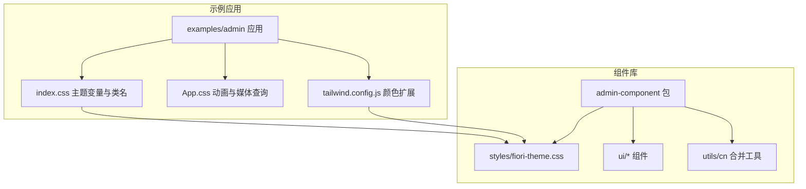
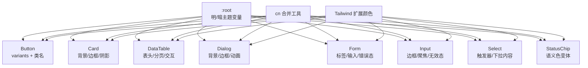
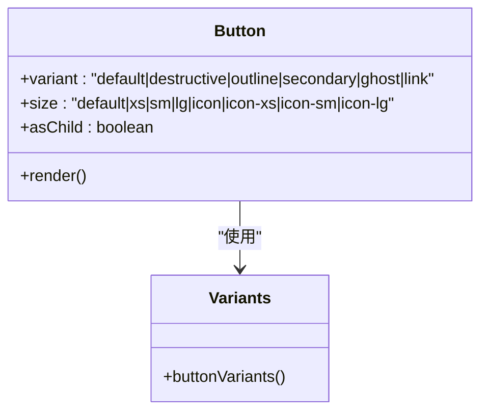
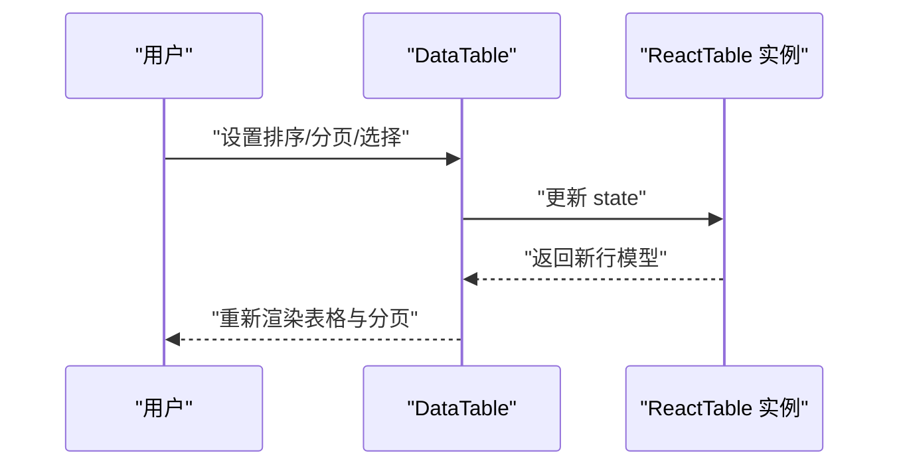
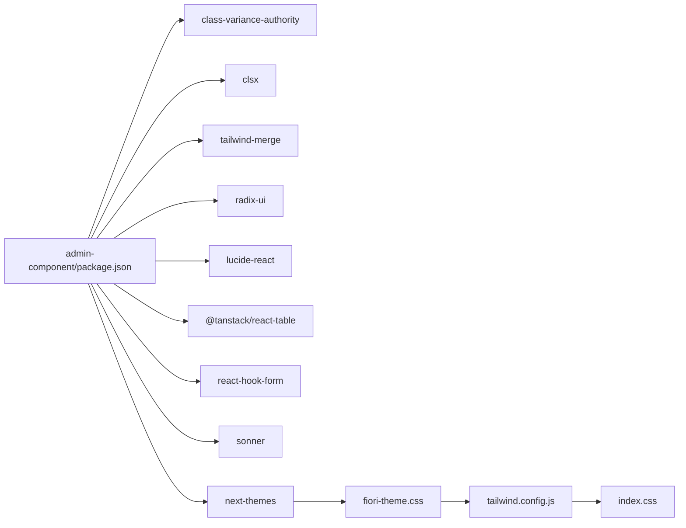

# 组件主题与定制

<cite>
**本文引用的文件**
- [fiori-theme.css](file://app/framework/admin-component/src/styles/fiori-theme.css)
- [index.ts](file://app/framework/admin-component/src/index.ts)
- [App.css](file://app/examples/admin/src/App.css)
- [index.css](file://app/examples/admin/src/index.css)
- [package.json](file://app/framework/admin-component/package.json)
- [utils.ts](file://app/framework/admin-component/src/utils.ts)
- [button.tsx](file://app/framework/admin-component/src/ui/button.tsx)
- [card.tsx](file://app/framework/admin-component/src/ui/card.tsx)
- [data-table.tsx](file://app/framework/admin-component/src/ui/data-table.tsx)
- [dialog.tsx](file://app/framework/admin-component/src/ui/dialog.tsx)
- [form.tsx](file://app/framework/admin-component/src/ui/form.tsx)
- [input.tsx](file://app/framework/admin-component/src/ui/input.tsx)
- [select.tsx](file://app/framework/admin-component/src/ui/select.tsx)
- [status-chip.tsx](file://app/framework/admin-component/src/ui/status-chip.tsx)
- [tailwind.config.js](file://app/examples/admin/tailwind.config.js)
</cite>

## 目录
1. [简介](#简介)
2. [项目结构](#项目结构)
3. [核心组件](#核心组件)
4. [架构总览](#架构总览)
5. [详细组件分析](#详细组件分析)
6. [依赖关系分析](#依赖关系分析)
7. [性能考量](#性能考量)
8. [故障排查指南](#故障排查指南)
9. [结论](#结论)
10. [附录](#附录)

## 简介
本文件面向组件主题与定制，系统化说明基于 SAP Fiori 设计规范（Morning Horizon 与 Evening Horizon）的实现与主题变量体系。内容涵盖：
- CSS 变量的组织与命名规范
- 主题定制选项与样式覆盖策略
- 组件样式类名、伪元素与媒体查询支持
- 主题切换、暗色模式与品牌定制方案
- 响应式断点、布局与栅格使用指南
- 样式优先级规则、CSS-in-JS 集成与第三方样式框架兼容性
- 完整定制示例与最佳实践建议

## 项目结构
本仓库采用多包工作区结构，主题与组件集中在 admin-component 包中，并在 examples/admin 示例应用中演示主题变量与 Tailwind 的集成。

图表来源
- [fiori-theme.css](file://app/framework/admin-component/src/styles/fiori-theme.css#L1-L140)
- [index.css](file://app/examples/admin/src/index.css#L1-L349)
- [tailwind.config.js](file://app/examples/admin/tailwind.config.js#L1-L37)

章节来源
- [index.ts](file://app/framework/admin-component/src/index.ts#L1-L38)
- [package.json](file://app/framework/admin-component/package.json#L1-L43)

## 核心组件
本主题系统围绕以下核心要素展开：
- 主题变量：以 CSS 自定义属性形式提供，覆盖主色、背景、文字、边框、语义色、强调色与阴影等
- 组件样式：通过 Tailwind 与类名组合，结合 CSS 变量实现主题联动
- 样式合并工具：cn 函数统一处理类名合并与冲突修复
- 主题切换：通过根元素或类选择器切换明/暗主题变量集

章节来源
- [fiori-theme.css](file://app/framework/admin-component/src/styles/fiori-theme.css#L6-L140)
- [utils.ts](file://app/framework/admin-component/src/utils.ts#L1-L7)
- [index.css](file://app/examples/admin/src/index.css#L12-L94)

## 架构总览
主题与组件的交互关系如下：

图表来源
- [fiori-theme.css](file://app/framework/admin-component/src/styles/fiori-theme.css#L6-L140)
- [button.tsx](file://app/framework/admin-component/src/ui/button.tsx#L7-L39)
- [card.tsx](file://app/framework/admin-component/src/ui/card.tsx#L5-L16)
- [data-table.tsx](file://app/framework/admin-component/src/ui/data-table.tsx#L197-L289)
- [dialog.tsx](file://app/framework/admin-component/src/ui/dialog.tsx#L50-L82)
- [form.tsx](file://app/framework/admin-component/src/ui/form.tsx#L76-L88)
- [input.tsx](file://app/framework/admin-component/src/ui/input.tsx#L5-L19)
- [select.tsx](file://app/framework/admin-component/src/ui/select.tsx#L62-L121)
- [status-chip.tsx](file://app/framework/admin-component/src/ui/status-chip.tsx#L11-L49)
- [tailwind.config.js](file://app/examples/admin/tailwind.config.js#L8-L34)

## 详细组件分析

### 主题变量系统与 CSS-in-JS 集成
- 变量命名：以 --fiori-* 为主，覆盖主色、背景、表面、文字、边框、语义色、强调色与阴影；同时映射到 shadcn/ui 兼容变量，便于与 Tailwind 生态无缝衔接
- 暗色模式：通过 .dark 选择器重写关键变量，实现 Evening Horizon 主题
- CSS-in-JS：组件通过类名与 Tailwind 工具类组合，间接消费 CSS 变量；未直接在运行时生成内联样式，而是依赖样式层叠与变量替换

章节来源
- [fiori-theme.css](file://app/framework/admin-component/src/styles/fiori-theme.css#L6-L140)
- [tailwind.config.js](file://app/examples/admin/tailwind.config.js#L8-L34)

### Button 组件
- 变体与尺寸：通过 class-variance-authority 定义，使用 bg-*、text-*、border-*、shadow-* 等 Tailwind 类与 CSS 变量联动
- 交互态：聚焦可见性、禁用态、无效态均通过 CSS 变量与伪类控制
- 渲染形态：支持原生 button 或以子节点渲染（asChild）

图表来源
- [button.tsx](file://app/framework/admin-component/src/ui/button.tsx#L7-L39)

章节来源
- [button.tsx](file://app/framework/admin-component/src/ui/button.tsx#L41-L65)

### Card 组件
- 结构化布局：CardHeader、CardTitle、CardDescription、CardContent、CardFooter 通过 data-slot 标记，便于主题与测试定位
- 样式基线：基于 bg-card/text-card-foreground、border、rounded、shadow-sm 等 Tailwind 类与 CSS 变量

章节来源
- [card.tsx](file://app/framework/admin-component/src/ui/card.tsx#L5-L93)

### DataTable 组件
- 功能特性：排序、分页、行选择、加载态、空态、行点击/双击回调
- 样式要点：表头/单元格对齐、悬停与选中态、分页控件与按钮
- 响应式：容器与滚动区域配合，适配小屏设备

图表来源
- [data-table.tsx](file://app/framework/admin-component/src/ui/data-table.tsx#L149-L185)

章节来源
- [data-table.tsx](file://app/framework/admin-component/src/ui/data-table.tsx#L73-L372)

### Dialog 组件
- 结构：Root、Portal、Overlay、Content、Header/Footer、Title/Description、Close
- 动画：基于 radix-ui 的 open/closed 状态切换，配合淡入淡出与缩放动画
- 关闭按钮：可选显示，支持键盘无障碍访问

章节来源
- [dialog.tsx](file://app/framework/admin-component/src/ui/dialog.tsx#L10-L159)

### Form 与 Input/Select 组件
- Form：基于 react-hook-form 提供上下文与验证状态，FormLabel、FormControl、FormMessage 与错误态联动
- Input：聚焦态、禁用态、无效态均通过 CSS 变量与伪类控制
- Select：基于 radix-ui，支持占位符转换、受控与非受控值、Portal 下拉内容

章节来源
- [form.tsx](file://app/framework/admin-component/src/ui/form.tsx#L19-L167)
- [input.tsx](file://app/framework/admin-component/src/ui/input.tsx#L5-L22)
- [select.tsx](file://app/framework/admin-component/src/ui/select.tsx#L41-L154)

### StatusChip 组件
- 变体：default、primary、secondary、success、warning、error、info
- 尺寸：sm、default、lg
- 外描边：outlined 开关
- 描述气泡：可选悬浮提示

章节来源
- [status-chip.tsx](file://app/framework/admin-component/src/ui/status-chip.tsx#L11-L97)

### 示例应用中的主题类名与媒体查询
- 主题类名：示例应用提供 fiori-* 前缀的类名用于 Shell Bar、Card、Tile、Button、Tab、Search、Badge、Group Header、Corner Badge、页面转场动画等
- 媒体查询：示例应用包含 prefers-reduced-motion 的媒体查询示例，展示如何根据系统偏好调整动画行为

章节来源
- [index.css](file://app/examples/admin/src/index.css#L105-L349)
- [App.css](file://app/examples/admin/src/App.css#L30-L34)

## 依赖关系分析
- 组件库依赖：class-variance-authority、clsx、tailwind-merge、radix-ui、lucide-react、@tanstack/react-table、react-hook-form、sonner、next-themes
- 样式工具：cn 函数负责类名合并与冲突修复，确保 Tailwind 与动态类名协同工作
- 主题变量：由 fiori-theme.css 提供，示例应用通过 Tailwind 配置将 CSS 变量映射为颜色令牌

图表来源
- [package.json](file://app/framework/admin-component/package.json#L19-L29)
- [utils.ts](file://app/framework/admin-component/src/utils.ts#L1-L7)
- [fiori-theme.css](file://app/framework/admin-component/src/styles/fiori-theme.css#L6-L140)
- [tailwind.config.js](file://app/examples/admin/tailwind.config.js#L8-L34)
- [index.css](file://app/examples/admin/src/index.css#L12-L94)

章节来源
- [package.json](file://app/framework/admin-component/package.json#L19-L29)

## 性能考量
- CSS 变量替换成本低：主题切换仅需变更 :root 或 .dark 的变量值，避免重排与重绘
- Tailwind 工具类：按需生成，减少自定义 CSS 体积；建议在生产环境启用 Tree Shaking 与 Purge
- 组件渲染：使用 cn 合并类名，避免冗余样式；复杂列表与表格建议虚拟化与分页
- 动画与过渡：合理使用 CSS 动画与 GPU 加速，避免在低端设备上造成掉帧

## 故障排查指南
- 主题不生效
  - 检查 :root 与 .dark 是否正确引入与加载顺序
  - 确认 Tailwind 配置是否将 CSS 变量映射为颜色令牌
- 样式冲突
  - 使用 cn 合并类名，避免重复覆盖
  - 检查组件 data-slot 属性是否影响样式选择器
- 暗色模式切换异常
  - 确认 next-themes 的主题提供者已正确包裹应用
  - 检查 .dark 类是否被其他样式覆盖
- 表格/下拉等交互异常
  - 确保 radix-ui 与 lucide-react 版本兼容
  - 检查 Portal 渲染目标是否存在层级问题

章节来源
- [fiori-theme.css](file://app/framework/admin-component/src/styles/fiori-theme.css#L113-L140)
- [tailwind.config.js](file://app/examples/admin/tailwind.config.js#L8-L34)
- [package.json](file://app/framework/admin-component/package.json#L24-L25)

## 结论
本主题系统以 CSS 变量为核心，结合 Tailwind 工具类与组件变体，实现了与 SAP Fiori 设计规范的高度契合。通过明/暗两套主题变量与 shadcn/ui 兼容映射，既满足品牌定制需求，又保证了与主流前端生态的兼容性。建议在实际项目中遵循“变量优先、类名其次”的原则，配合 cn 工具与合理的媒体查询策略，构建稳定、可维护的主题体系。

## 附录

### 主题变量清单与用途
- 主色与高亮：用于品牌、链接、高亮状态
- 背景与表面：用于页面背景与容器表面
- 文字色：用于标题、正文、辅助文本与占位符
- 边框色：用于输入框、分割线与边框
- 语义色：success/warning/error/info/neutral 对应不同业务状态
- 强调色：多组强调色用于图标、徽章与装饰
- 灰阶：从 50 到 900 的灰阶体系，支撑层级与对比
- 阴影：提供 sm/md/lg 三档阴影，适配不同层级

章节来源
- [fiori-theme.css](file://app/framework/admin-component/src/styles/fiori-theme.css#L6-L111)

### 样式类名与伪元素
- 示例应用提供大量 fiori-* 前缀类名，覆盖 Shell Bar、Card、Tile、Button、Tab、Search、Badge、Group Header、Corner Badge、动画等
- 伪元素与伪类：:hover、:focus-within、:active、:disabled、:invalid 等用于交互态与状态态

章节来源
- [index.css](file://app/examples/admin/src/index.css#L105-L349)

### 响应式断点与布局系统
- 断点：示例应用包含媒体查询示例，建议结合 Tailwind 断点进行移动端适配
- 布局：示例应用使用 Flex/Grid 布局，组件内部也采用 Flex 与 Grid 进行结构化排版

章节来源
- [App.css](file://app/examples/admin/src/App.css#L30-L34)
- [card.tsx](file://app/framework/admin-component/src/ui/card.tsx#L18-L29)

### 栅格系统使用指南
- 建议在页面级使用 Tailwind 栅格，组件内部保持语义化与可复用性
- 表格与卡片等组件内部使用相对单位与自适应宽度，避免固定像素导致的溢出

章节来源
- [data-table.tsx](file://app/framework/admin-component/src/ui/data-table.tsx#L197-L291)

### 样式优先级规则
- CSS 变量优先：组件样式通过 Tailwind 类与 CSS 变量组合，变量优先级决定最终颜色与尺寸
- 类名合并：cn 工具确保动态类名与静态类名的合并顺序与去重
- 伪类与状态：:hover/:focus/:disabled 等伪类具有较高优先级，需注意与默认类名的叠加

章节来源
- [utils.ts](file://app/framework/admin-component/src/utils.ts#L4-L6)
- [button.tsx](file://app/framework/admin-component/src/ui/button.tsx#L7-L39)

### CSS-in-JS 集成与第三方框架兼容性
- 本主题以 CSS 变量与 Tailwind 为主，未直接使用 CSS-in-JS，但可通过变量映射与类名策略与主流 UI 框架兼容
- shadcn/ui 兼容变量映射：--background/--foreground/--primary 等变量与组件令牌一一对应

章节来源
- [fiori-theme.css](file://app/framework/admin-component/src/styles/fiori-theme.css#L75-L102)
- [tailwind.config.js](file://app/examples/admin/tailwind.config.js#L8-L34)

### 主题切换、暗色模式与品牌定制
- 主题切换：通过 .dark 类或 next-themes 提供的主题提供者切换明/暗主题变量
- 暗色模式：.dark 选择器覆盖关键变量，实现 Evening Horizon 主题
- 品牌定制：通过修改 --fiori-primary 及相关语义色变量，即可完成品牌色替换

章节来源
- [fiori-theme.css](file://app/framework/admin-component/src/styles/fiori-theme.css#L113-L140)
- [package.json](file://app/framework/admin-component/package.json#L24-L25)

### 完整定制示例与最佳实践
- 定制步骤
  - 在应用入口引入主题变量文件
  - 在 Tailwind 配置中扩展颜色映射
  - 使用组件提供的变体与尺寸，必要时通过 className 覆盖
  - 如需暗色模式，确保 .dark 类或主题提供者正确工作
- 最佳实践
  - 优先使用 CSS 变量与 Tailwind 工具类，避免内联样式
  - 使用 cn 合并类名，保持样式一致性
  - 为交互态与状态态提供明确的视觉反馈
  - 在移动端优先考虑触摸目标尺寸与可读性

章节来源
- [index.css](file://app/examples/admin/src/index.css#L12-L94)
- [tailwind.config.js](file://app/examples/admin/tailwind.config.js#L8-L34)
- [utils.ts](file://app/framework/admin-component/src/utils.ts#L4-L6)