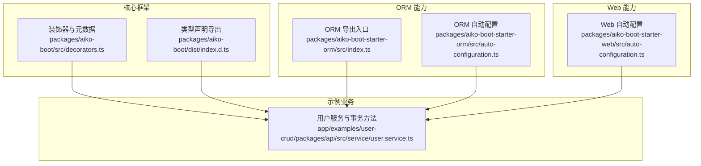
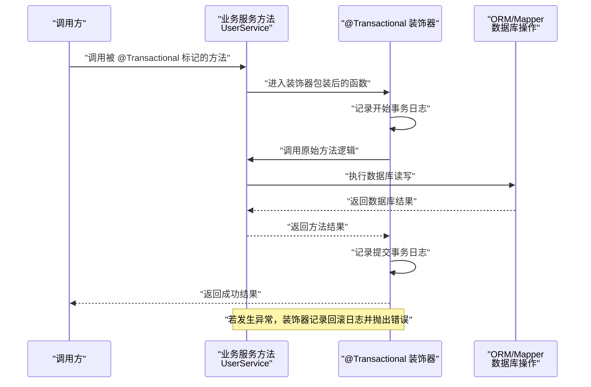
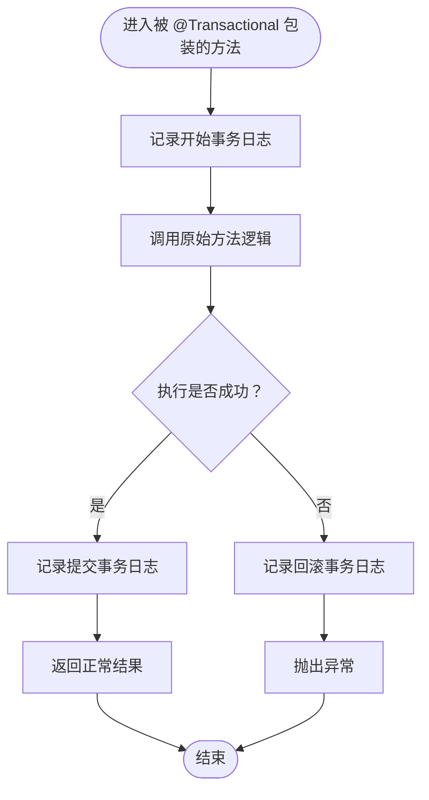
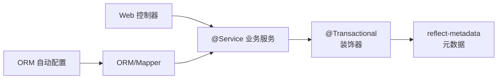

# 事务装饰器

<cite>
**本文引用的文件**
- [packages/aiko-boot/src/decorators.ts](file://packages/aiko-boot/src/decorators.ts)
- [packages/aiko-boot/dist/index.d.ts](file://packages/aiko-boot/dist/index.d.ts)
- [packages/aiko-boot/README.md](file://packages/aiko-boot/README.md)
- [app/examples/user-crud/packages/api/src/service/user.service.ts](file://app/examples/user-crud/packages/api/src/service/user.service.ts)
- [packages/aiko-boot-starter-orm/src/index.ts](file://packages/aiko-boot-starter-orm/src/index.ts)
- [packages/aiko-boot-starter-orm/src/auto-configuration.ts](file://packages/aiko-boot-starter-orm/src/auto-configuration.ts)
- [packages/aiko-boot-starter-web/src/auto-configuration.ts](file://packages/aiko-boot-starter-web/src/auto-configuration.ts)
</cite>

## 目录
1. [简介](#简介)
2. [项目结构](#项目结构)
3. [核心组件](#核心组件)
4. [架构总览](#架构总览)
5. [详细组件分析](#详细组件分析)
6. [依赖关系分析](#依赖关系分析)
7. [性能考虑](#性能考虑)
8. [故障排查指南](#故障排查指南)
9. [结论](#结论)
10. [附录](#附录)

## 简介
本文件为“事务装饰器”系统的详细 API 参考文档，聚焦于 @Transactional 方法级事务装饰器的使用与实现原理。内容涵盖：
- 方法级别的事务管理、自动提交与回滚机制
- 装饰器如何拦截方法调用、管理事务生命周期与异常处理
- 在不同业务场景下的应用示例（单方法事务、嵌套事务与事务传播行为）
- 与数据库操作的集成方式及与其他装饰器的协同机制
- 性能优化建议与常见问题排查

## 项目结构
围绕事务装饰器的相关模块主要分布在以下位置：
- 核心装饰器与元数据系统：packages/aiko-boot/src/decorators.ts
- 类型声明与导出：packages/aiko-boot/dist/index.d.ts
- 使用示例与业务服务：app/examples/user-crud/packages/api/src/service/user.service.ts
- ORM 能力与数据库自动配置：packages/aiko-boot-starter-orm/src/index.ts、packages/aiko-boot-starter-orm/src/auto-configuration.ts
- Web 自动配置（控制器与路由）：packages/aiko-boot-starter-web/src/auto-configuration.ts

图表来源
- [packages/aiko-boot/src/decorators.ts](file://packages/aiko-boot/src/decorators.ts#L120-L143)
- [packages/aiko-boot/dist/index.d.ts](file://packages/aiko-boot/dist/index.d.ts#L124-L132)
- [app/examples/user-crud/packages/api/src/service/user.service.ts](file://app/examples/user-crud/packages/api/src/service/user.service.ts#L147-L249)
- [packages/aiko-boot-starter-orm/src/index.ts](file://packages/aiko-boot-starter-orm/src/index.ts#L1-L91)
- [packages/aiko-boot-starter-orm/src/auto-configuration.ts](file://packages/aiko-boot-starter-orm/src/auto-configuration.ts#L61-L134)
- [packages/aiko-boot-starter-web/src/auto-configuration.ts](file://packages/aiko-boot-starter-web/src/auto-configuration.ts#L97-L147)

章节来源
- [packages/aiko-boot/src/decorators.ts](file://packages/aiko-boot/src/decorators.ts#L1-L158)
- [packages/aiko-boot/dist/index.d.ts](file://packages/aiko-boot/dist/index.d.ts#L1-L135)
- [app/examples/user-crud/packages/api/src/service/user.service.ts](file://app/examples/user-crud/packages/api/src/service/user.service.ts#L1-L251)
- [packages/aiko-boot-starter-orm/src/index.ts](file://packages/aiko-boot-starter-orm/src/index.ts#L1-L91)
- [packages/aiko-boot-starter-orm/src/auto-configuration.ts](file://packages/aiko-boot-starter-orm/src/auto-configuration.ts#L1-L134)
- [packages/aiko-boot-starter-web/src/auto-configuration.ts](file://packages/aiko-boot-starter-web/src/auto-configuration.ts#L92-L159)

## 核心组件
- @Transactional 方法装饰器：用于标记方法为事务性，拦截方法调用并在执行前后输出日志，抛出异常时进行回滚。
- 元数据系统：通过 reflect-metadata 存储与读取事务标记，配合 isTransactional 判定方法是否具备事务语义。
- 业务服务示例：在用户服务中对创建、更新、删除等方法使用 @Transactional，结合 ORM 的 Mapper 执行数据库操作。

章节来源
- [packages/aiko-boot/src/decorators.ts](file://packages/aiko-boot/src/decorators.ts#L120-L157)
- [packages/aiko-boot/dist/index.d.ts](file://packages/aiko-boot/dist/index.d.ts#L124-L132)
- [app/examples/user-crud/packages/api/src/service/user.service.ts](file://app/examples/user-crud/packages/api/src/service/user.service.ts#L147-L249)

## 架构总览
下图展示了 @Transactional 在一次方法调用中的拦截与执行流程，以及与业务服务、ORM 的协作关系。

图表来源
- [packages/aiko-boot/src/decorators.ts](file://packages/aiko-boot/src/decorators.ts#L125-L142)
- [app/examples/user-crud/packages/api/src/service/user.service.ts](file://app/examples/user-crud/packages/api/src/service/user.service.ts#L147-L249)

## 详细组件分析

### @Transactional 装饰器 API
- 装饰器签名与作用域
  - 函数式装饰器：接收目标对象、属性键与属性描述符，返回修改后的描述符。
  - 元数据存储：在目标方法上标记事务性，便于运行时检测。
- 拦截与生命周期
  - 包装原始方法，捕获异常并统一记录日志。
  - 成功完成则视为提交；异常则视为回滚（由上层框架或数据库驱动决定实际提交/回滚行为）。
- 元数据查询
  - 提供 isTransactional(target, methodName) 以判定方法是否具备事务标记。

章节来源
- [packages/aiko-boot/src/decorators.ts](file://packages/aiko-boot/src/decorators.ts#L120-L157)
- [packages/aiko-boot/dist/index.d.ts](file://packages/aiko-boot/dist/index.d.ts#L124-L132)

### 事务拦截与异常处理流程

图表来源
- [packages/aiko-boot/src/decorators.ts](file://packages/aiko-boot/src/decorators.ts#L125-L142)

### 与数据库操作的集成
- ORM 能力
  - 提供 @Entity、@Mapper、BaseMapper、QueryWrapper/UpdateWrapper 等装饰器与工具，支撑数据库操作。
  - 自动配置支持根据配置文件初始化数据库连接（SQLite/PostgreSQL/MySQL），并暴露数据库实例供业务使用。
- 业务服务中的事务方法
  - 在用户服务中，对创建、更新、删除等方法使用 @Transactional，内部通过 Mapper 执行数据库操作，确保方法整体的原子性。

章节来源
- [packages/aiko-boot-starter-orm/src/index.ts](file://packages/aiko-boot-starter-orm/src/index.ts#L1-L91)
- [packages/aiko-boot-starter-orm/src/auto-configuration.ts](file://packages/aiko-boot-starter-orm/src/auto-configuration.ts#L61-L134)
- [app/examples/user-crud/packages/api/src/service/user.service.ts](file://app/examples/user-crud/packages/api/src/service/user.service.ts#L147-L249)

### 与 Web 控制器的协同
- Web 自动配置会扫描控制器并注册路由，业务服务通过 @Service 注入到控制器中。
- 控制器可直接调用带有 @Transactional 的业务方法，从而获得事务保护。

章节来源
- [packages/aiko-boot-starter-web/src/auto-configuration.ts](file://packages/aiko-boot-starter-web/src/auto-configuration.ts#L97-L147)

### 使用示例与场景

#### 单个方法事务
- 在用户服务中，对创建、更新、删除等方法使用 @Transactional，保证单次操作的原子性。
- 示例路径：[packages/api/src/service/user.service.ts](file://app/examples/user-crud/packages/api/src/service/user.service.ts#L147-L249)

#### 嵌套事务与传播行为
- 当一个事务方法内部调用另一个事务方法时，当前实现采用装饰器包装的同步调用模型，未显式实现 Spring 风格的传播控制（如 REQUIRES_NEW、NESTED）。
- 若需要更细粒度的传播控制，可在业务层通过拆分方法、组合调用或引入更完善的事务管理器实现。

章节来源
- [app/examples/user-crud/packages/api/src/service/user.service.ts](file://app/examples/user-crud/packages/api/src/service/user.service.ts#L147-L249)

#### 事务与 ORM 的配合
- 业务方法内部通过 Mapper 执行数据库读写，装饰器负责事务边界管理。
- ORM 自动配置根据配置文件初始化数据库连接，确保事务上下文中可用的连接。

章节来源
- [packages/aiko-boot-starter-orm/src/auto-configuration.ts](file://packages/aiko-boot-starter-orm/src/auto-configuration.ts#L61-L134)
- [app/examples/user-crud/packages/api/src/service/user.service.ts](file://app/examples/user-crud/packages/api/src/service/user.service.ts#L147-L249)

## 依赖关系分析
- @Transactional 依赖 reflect-metadata 存储元数据，并通过 isTransactional 运行时查询。
- 业务服务通过 @Service 注入到容器，控制器通过 Web 自动配置注册路由后调用服务。
- ORM 提供数据库连接与 Mapper 能力，事务装饰器与 ORM 的协作体现在方法执行期间的数据库操作。

图表来源
- [packages/aiko-boot/src/decorators.ts](file://packages/aiko-boot/src/decorators.ts#L14-L16)
- [packages/aiko-boot-starter-orm/src/auto-configuration.ts](file://packages/aiko-boot-starter-orm/src/auto-configuration.ts#L61-L134)
- [packages/aiko-boot-starter-web/src/auto-configuration.ts](file://packages/aiko-boot-starter-web/src/auto-configuration.ts#L97-L147)

章节来源
- [packages/aiko-boot/src/decorators.ts](file://packages/aiko-boot/src/decorators.ts#L1-L158)
- [packages/aiko-boot-starter-orm/src/auto-configuration.ts](file://packages/aiko-boot-starter-orm/src/auto-configuration.ts#L1-L134)
- [packages/aiko-boot-starter-web/src/auto-configuration.ts](file://packages/aiko-boot-starter-web/src/auto-configuration.ts#L92-L159)

## 性能考虑
- 日志开销：装饰器在每次事务开始/提交/回滚时输出日志，生产环境建议降低日志级别或按需开启。
- 异常路径：异常会导致回滚，频繁失败会增加重试成本，建议在业务层做好前置校验与幂等设计。
- 数据库连接：确保 ORM 自动配置正确初始化数据库连接，避免事务过程中连接丢失导致的回滚失败。
- 方法粒度：将多个数据库操作合并到单个 @Transactional 方法内，减少事务边界切换带来的开销。

## 故障排查指南
- 症状：方法未被识别为事务方法
  - 检查是否正确使用 @Transactional 装饰器，并确保运行时可通过 isTransactional 查询到标记。
  - 参考：[packages/aiko-boot/src/decorators.ts](file://packages/aiko-boot/src/decorators.ts#L120-L157)
- 症状：事务未生效或异常未回滚
  - 确认业务方法内部确实执行了数据库操作，且 ORM 已正确初始化连接。
  - 参考：[packages/aiko-boot-starter-orm/src/auto-configuration.ts](file://packages/aiko-boot-starter-orm/src/auto-configuration.ts#L61-L134)
- 症状：日志过多影响性能
  - 调整日志级别或在生产环境关闭事务日志输出。
  - 参考：[packages/aiko-boot/src/decorators.ts](file://packages/aiko-boot/src/decorators.ts#L125-L142)
- 症状：嵌套事务无预期行为
  - 当前实现未实现 Spring 风格的传播控制，请在业务层合理拆分方法或引入更完善的事务管理器。

章节来源
- [packages/aiko-boot/src/decorators.ts](file://packages/aiko-boot/src/decorators.ts#L120-L157)
- [packages/aiko-boot-starter-orm/src/auto-configuration.ts](file://packages/aiko-boot-starter-orm/src/auto-configuration.ts#L61-L134)

## 结论
- @Transactional 提供了简单而有效的基于装饰器的方法级事务管理能力，适合大多数单方法事务场景。
- 与 ORM 和 Web 自动配置结合，可在业务服务中无缝集成数据库操作与路由层调用。
- 对于复杂事务传播与嵌套需求，建议在业务层进行方法拆分或引入更完善的事务管理器实现。

## 附录

### API 概览（方法级）
- @Transactional
  - 用途：标记方法为事务性
  - 返回：装饰器函数，接收目标对象、属性键与属性描述符
  - 参考：[packages/aiko-boot/src/decorators.ts](file://packages/aiko-boot/src/decorators.ts#L122-L143)
- isTransactional(target, methodName)
  - 用途：判断方法是否具备事务标记
  - 返回：布尔值
  - 参考：[packages/aiko-boot/src/decorators.ts](file://packages/aiko-boot/src/decorators.ts#L155-L157)

### 使用示例（路径）
- 单方法事务示例（创建/更新/删除）
  - 参考：[app/examples/user-crud/packages/api/src/service/user.service.ts](file://app/examples/user-crud/packages/api/src/service/user.service.ts#L147-L249)
- 事务装饰器导出与类型
  - 参考：[packages/aiko-boot/dist/index.d.ts](file://packages/aiko-boot/dist/index.d.ts#L124-L132)
- 项目特性与安装说明
  - 参考：[packages/aiko-boot/README.md](file://packages/aiko-boot/README.md#L1-L69)