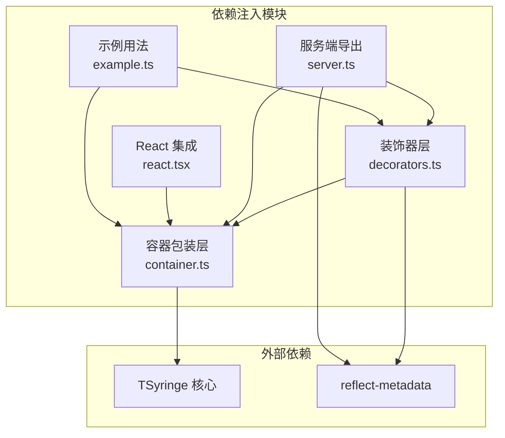
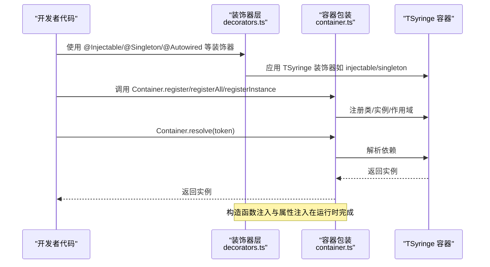
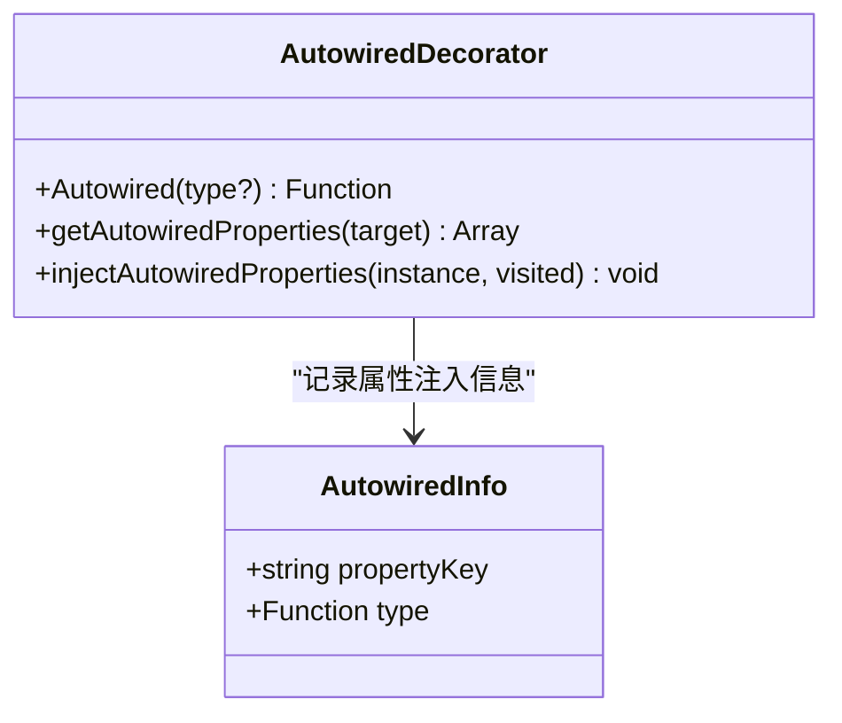
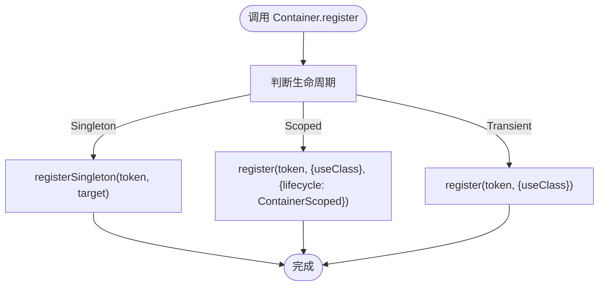
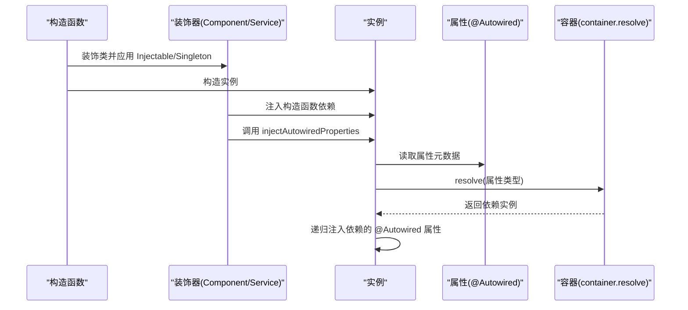
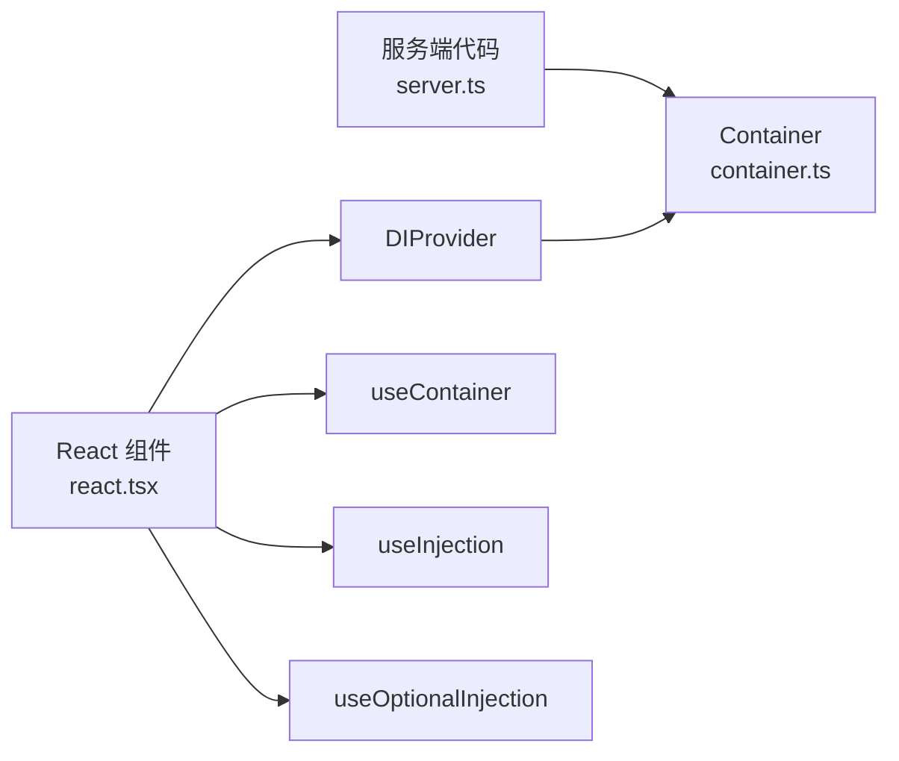
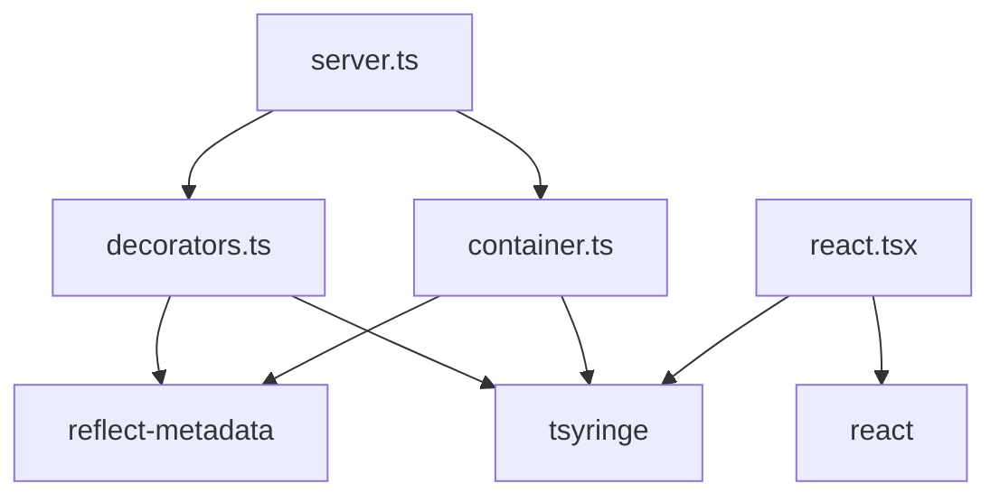

# 依赖注入 API

<cite>
**本文引用的文件**
- [packages/aiko-boot/src/di/decorators.ts](file://packages/aiko-boot/src/di/decorators.ts)
- [packages/aiko-boot/src/di/container.ts](file://packages/aiko-boot/src/di/container.ts)
- [packages/aiko-boot/src/di/server.ts](file://packages/aiko-boot/src/di/server.ts)
- [packages/aiko-boot/src/di/react.tsx](file://packages/aiko-boot/src/di/react.tsx)
- [packages/aiko-boot/src/di/example.ts](file://packages/aiko-boot/src/di/example.ts)
- [packages/aiko-boot/src/decorators.ts](file://packages/aiko-boot/src/decorators.ts)
- [packages/aiko-boot/src/index.ts](file://packages/aiko-boot/src/index.ts)
- [packages/aiko-boot/src/di/index.ts](file://packages/aiko-boot/src/di/index.ts)
- [packages/aiko-boot/package.json](file://packages/aiko-boot/package.json)
</cite>

## 目录
1. [简介](#简介)
2. [项目结构](#项目结构)
3. [核心组件](#核心组件)
4. [架构总览](#架构总览)
5. [详细组件分析](#详细组件分析)
6. [依赖关系分析](#依赖关系分析)
7. [性能考虑](#性能考虑)
8. [故障排查指南](#故障排查指南)
9. [结论](#结论)
10. [附录：使用示例与最佳实践](#附录使用示例与最佳实践)

## 简介
本文件为依赖注入（DI）子系统的 API 参考与实现解析，聚焦以下核心能力：
- 基于 TSyringe 的容器封装与生命周期管理
- 装饰器体系：Injectable、Singleton、Scoped、Inject、inject、Autowired、AutoRegister
- 自动装配机制：构造函数注入、属性注入、方法注入（事务注解）
- 依赖查找、作用域管理与容器扩展
- 在服务端与 React 环境中的集成方式
- 最佳实践、性能优化与常见问题

## 项目结构
该依赖注入子系统位于 aiko-boot 包内，主要由以下模块组成：
- 容器包装层：Container、Lifecycle 枚举
- 装饰器层：Injectable、Singleton、Scoped、Inject、inject、Autowired、AutoRegister、getAutowiredProperties、injectAutowiredProperties
- 服务端导出：server.ts 提供无 React 依赖的导出
- React 集成：DIProvider、useContainer、useInjection、useOptionalInjection
- 示例与入口：example.ts 展示用法；index.ts 与 di/index.ts 统一导出

图表来源
- [packages/aiko-boot/src/di/decorators.ts](file://packages/aiko-boot/src/di/decorators.ts#L1-L110)
- [packages/aiko-boot/src/di/container.ts](file://packages/aiko-boot/src/di/container.ts#L1-L105)
- [packages/aiko-boot/src/di/server.ts](file://packages/aiko-boot/src/di/server.ts#L1-L26)
- [packages/aiko-boot/src/di/react.tsx](file://packages/aiko-boot/src/di/react.tsx#L1-L59)
- [packages/aiko-boot/src/di/example.ts](file://packages/aiko-boot/src/di/example.ts#L1-L68)

章节来源
- [packages/aiko-boot/src/di/index.ts](file://packages/aiko-boot/src/di/index.ts#L1-L34)
- [packages/aiko-boot/src/index.ts](file://packages/aiko-boot/src/index.ts#L1-L64)

## 核心组件
- Container：对 TSyringe 的 DependencyContainer 进行统一封装，提供 register/registerInstance/registerAll/resolve/isRegistered/clearAll/createChildContainer/getContainer 等方法，并将生命周期枚举 Lifecycle 映射为 'singleton'/'scoped'/'transient'。
- 装饰器集合：
  - Injectable、Singleton、Scoped：来自 TSyringe 的 re-export，用于标记可注入、单例、容器作用域。
  - Inject、inject：分别为带参数的属性注入与构造函数注入的便捷别名。
  - Autowired：Spring 风格的属性注入装饰器，配合 injectAutowiredProperties 实现运行时自动装配。
  - AutoRegister：自动注册并按选项设置生命周期。
- 自动装配工具：getAutowiredProperties、injectAutowiredProperties 支持递归注入依赖链。

章节来源
- [packages/aiko-boot/src/di/container.ts](file://packages/aiko-boot/src/di/container.ts#L1-L105)
- [packages/aiko-boot/src/di/decorators.ts](file://packages/aiko-boot/src/di/decorators.ts#L1-L110)
- [packages/aiko-boot/src/di/server.ts](file://packages/aiko-boot/src/di/server.ts#L1-L26)

## 架构总览
下图展示了依赖注入容器、装饰器与运行时自动装配的整体交互：

图表来源
- [packages/aiko-boot/src/di/decorators.ts](file://packages/aiko-boot/src/di/decorators.ts#L1-L110)
- [packages/aiko-boot/src/di/container.ts](file://packages/aiko-boot/src/di/container.ts#L1-L105)

## 详细组件分析

### 装饰器 API 详解
- Injectable
  - 作用：标记类为可注入对象，交由 TSyringe 管理。
  - 使用场景：所有需要被容器解析的类均需标注。
- Singleton
  - 作用：标记为单例作用域，全局共享同一实例。
- Scoped
  - 作用：标记为容器作用域，通常与请求或子容器绑定。
- Inject/inject
  - 作用：构造函数注入（Inject）与属性注入（inject）的便捷别名。
- Autowired
  - 作用：属性注入装饰器，记录属性类型元数据，运行时通过 injectAutowiredProperties 注入。
  - 元数据键：内部使用字符串键存储属性列表，避免 ESM 模块隔离问题。
- AutoRegister
  - 作用：装饰类时自动应用 Injectable，并根据选项设置 Singleton 或 Scoped 生命周期。

图表来源
- [packages/aiko-boot/src/di/decorators.ts](file://packages/aiko-boot/src/di/decorators.ts#L25-L84)

章节来源
- [packages/aiko-boot/src/di/decorators.ts](file://packages/aiko-boot/src/di/decorators.ts#L1-L110)

### 容器包装 API 详解
- Lifecycle 枚举
  - Singleton：应用级单例
  - Scoped：容器作用域（子容器/请求作用域）
  - Transient：每次解析新建实例
- Container.register(token, target, lifecycle)
  - 支持三种生命周期映射至 TSyringe 的注册方式。
- Container.registerInstance(token, instance)
  - 直接注册现有实例。
- Container.registerAll(services[])
  - 批量注册。
- Container.resolve(token)
  - 解析依赖。
- Container.isRegistered(token)
  - 查询是否已注册。
- Container.clearAll()
  - 清空实例（便于测试）。
- Container.createChildContainer()
  - 创建子容器以支持 Scoped 作用域。
- Container.getContainer()
  - 获取底层 TSyringe 容器实例。

图表来源
- [packages/aiko-boot/src/di/container.ts](file://packages/aiko-boot/src/di/container.ts#L28-L46)

章节来源
- [packages/aiko-boot/src/di/container.ts](file://packages/aiko-boot/src/di/container.ts#L1-L105)

### 自动装配流程
- 构造函数注入：装饰器 Component/Service 在构造函数上自动收集参数类型并通过 inject 注入。
- 属性注入：Autowired 记录属性类型，运行时由 injectAutowiredProperties 递归解析并注入。
- 递归注入：injectAutowiredProperties 在注入一个属性后，会继续对该属性值进行递归注入，避免深层依赖未注入。

图表来源
- [packages/aiko-boot/src/decorators.ts](file://packages/aiko-boot/src/decorators.ts#L30-L66)
- [packages/aiko-boot/src/di/decorators.ts](file://packages/aiko-boot/src/di/decorators.ts#L67-L84)

章节来源
- [packages/aiko-boot/src/decorators.ts](file://packages/aiko-boot/src/decorators.ts#L20-L118)
- [packages/aiko-boot/src/di/decorators.ts](file://packages/aiko-boot/src/di/decorators.ts#L30-L84)

### 服务端与 React 集成
- 服务端导出（无 React 依赖）：server.ts 导出 Container、Lifecycle 与装饰器，适合在 Server Components、Server Actions、API Routes 中使用。
- React 集成：
  - DIProvider：向组件树提供 DI 容器上下文。
  - useContainer/useInjection/useOptionalInjection：在组件中获取容器与注入依赖，支持可选注入。

图表来源
- [packages/aiko-boot/src/di/server.ts](file://packages/aiko-boot/src/di/server.ts#L1-L26)
- [packages/aiko-boot/src/di/react.tsx](file://packages/aiko-boot/src/di/react.tsx#L1-L59)

章节来源
- [packages/aiko-boot/src/di/server.ts](file://packages/aiko-boot/src/di/server.ts#L1-L26)
- [packages/aiko-boot/src/di/react.tsx](file://packages/aiko-boot/src/di/react.tsx#L1-L59)

### 方法注入与事务注解
- Transactional：对方法进行装饰，自动包裹事务语义（开始、提交、回滚），并保留原方法行为。
- 适用场景：数据库事务、消息发送等需要原子性的操作。

章节来源
- [packages/aiko-boot/src/decorators.ts](file://packages/aiko-boot/src/decorators.ts#L120-L143)

## 依赖关系分析
- 内部依赖
  - decorators.ts 依赖 reflect-metadata 与 TSyringe 的 inject、injectable、singleton、scoped、container、registry、Lifecycle。
  - container.ts 依赖 TSyringe 的 container、DependencyContainer、InjectionToken、Lifecycle。
  - server.ts 仅导出 server 端所需内容，避免引入 React。
  - react.tsx 依赖 React 与 TSyringe，提供 React 集成。
- 外部依赖
  - tsyringe：核心容器与生命周期管理。
  - reflect-metadata：运行时反射元数据支持。

图表来源
- [packages/aiko-boot/src/di/decorators.ts](file://packages/aiko-boot/src/di/decorators.ts#L4-L13)
- [packages/aiko-boot/src/di/container.ts](file://packages/aiko-boot/src/di/container.ts#L4-L5)
- [packages/aiko-boot/src/di/server.ts](file://packages/aiko-boot/src/di/server.ts#L7-L8)
- [packages/aiko-boot/src/di/react.tsx](file://packages/aiko-boot/src/di/react.tsx#L4-L6)
- [packages/aiko-boot/package.json](file://packages/aiko-boot/package.json#L35-L37)

章节来源
- [packages/aiko-boot/package.json](file://packages/aiko-boot/package.json#L35-L37)

## 性能考虑
- 生命周期选择
  - Singleton：全局共享，减少实例化开销，适用于无状态或线程安全的服务。
  - Scoped：按请求/子容器复用，平衡内存与一致性。
  - Transient：频繁创建，适合有状态或易变资源。
- 批量注册
  - 使用 Container.registerAll 批量注册，减少多次调用开销。
- 递归注入成本
  - injectAutowiredProperties 会对深层依赖进行递归注入，应避免过深的依赖树或循环依赖。
- 可选注入
  - 在 React 中使用 useOptionalInjection，避免因未注册导致的异常中断。

## 故障排查指南
- 依赖未注册
  - 症状：resolve 抛错或注入为 undefined。
  - 排查：确认已通过 Container.register/registerInstance/registerAll 正确注册；检查 token 是否一致。
- 循环依赖
  - 症状：构造函数注入或 resolve 时出现异常。
  - 排查：避免直接循环引用；改用工厂模式或延迟初始化；必要时使用 Optional 注入。
- 属性注入失败
  - 症状：@Autowired 的属性为空。
  - 排查：确保类已通过 Injectable/Singleton/AutoRegister 装饰；确认属性类型元数据存在；检查依赖是否已注册。
- 作用域不匹配
  - 症状：单例中持有请求作用域对象导致内存泄漏。
  - 排查：将请求作用域对象改为 Scoped 并在子容器中解析；或在合适时机释放。
- React 环境未提供容器
  - 症状：useContainer 抛错。
  - 排查：确认 DIProvider 已包裹根组件；传入正确的 container 实例。

## 结论
本依赖注入子系统基于 TSyringe 构建，提供了简洁而强大的装饰器与容器 API，覆盖了从注册、解析到生命周期管理的完整闭环。通过 Autowired 与 injectAutowiredProperties，实现了灵活的属性注入与递归装配；通过 server.ts 与 react.tsx，分别满足服务端与前端环境的使用需求。遵循生命周期选择、批量注册与避免循环依赖等最佳实践，可在保证性能的同时提升开发效率。

## 附录：使用示例与最佳实践
- 基础服务与构造函数注入
  - 示例路径：[示例用法](file://packages/aiko-boot/src/di/example.ts#L8-L34)
  - 关键点：使用 @Injectable 标记类；在构造函数中使用 @Inject 或 inject 进行依赖注入；通过 Container.registerAll 注册服务。
- 单例服务
  - 示例路径：[示例用法](file://packages/aiko-boot/src/di/example.ts#L36-L48)
  - 关键点：使用 @Singleton 标记，或在 AutoRegister 中选择 singleton 生命周期。
- 属性注入（@Autowired）
  - 示例路径：[装饰器实现](file://packages/aiko-boot/src/di/decorators.ts#L30-L55)
  - 关键点：在类属性上使用 @Autowired；运行时由 injectAutowiredProperties 注入。
- 服务端与 React 集成
  - 服务端：使用 @ai-partner-x/aiko-boot/di/server 导出的 API。
  - React：使用 DIProvider 包裹应用，使用 useInjection/useOptionalInjection 获取依赖。
  - 示例路径：[服务端导出](file://packages/aiko-boot/src/di/server.ts#L1-L26)，[React 集成](file://packages/aiko-boot/src/di/react.tsx#L1-L59)
- 方法注入与事务
  - 示例路径：[事务注解](file://packages/aiko-boot/src/decorators.ts#L120-L143)
  - 关键点：对需要事务的方法使用 @Transactional，确保异常时自动回滚。
- 最佳实践清单
  - 优先使用构造函数注入，保持不可变性与可测试性。
  - 将无状态服务设为 Singleton，避免不必要的实例化。
  - 对请求相关对象使用 Scoped，并在子容器中解析。
  - 避免循环依赖，采用接口抽象或事件解耦。
  - 使用批量注册与统一配置，减少重复样板代码。
  - 在 React 中使用 useOptionalInjection 处理可选依赖，防止渲染失败。