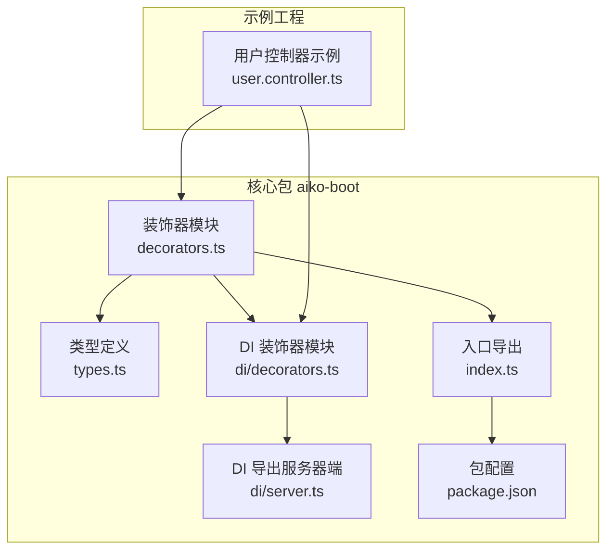
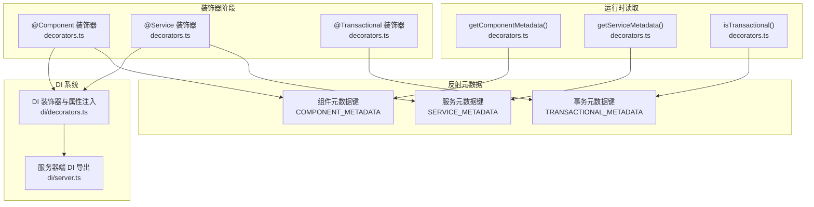
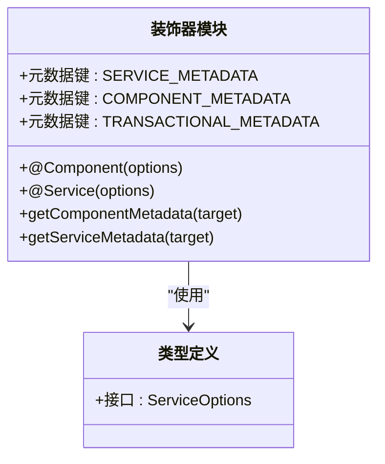
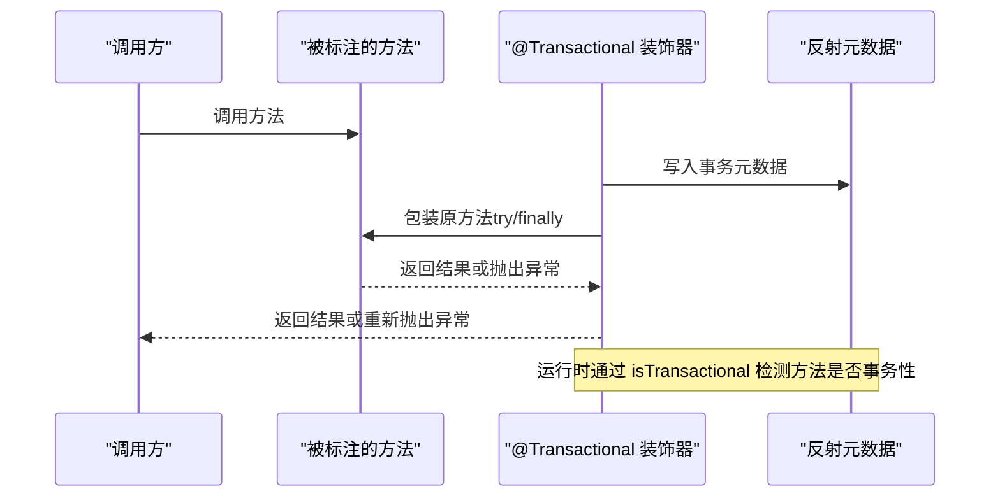
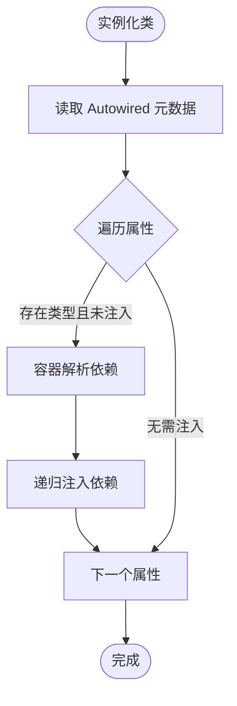
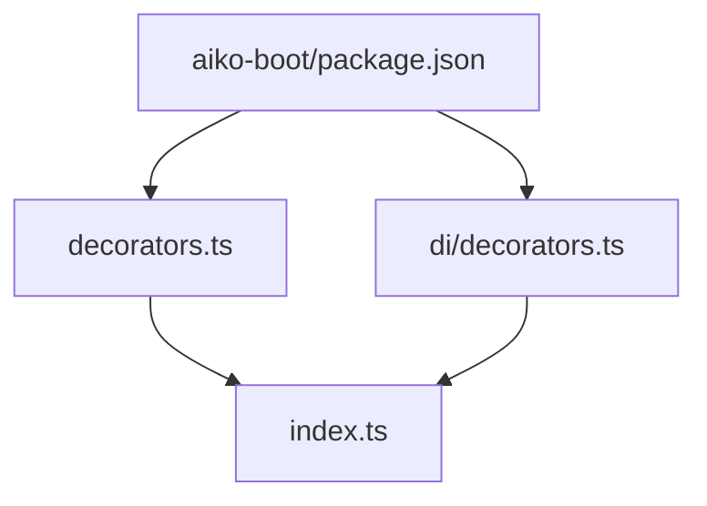

# 元数据管理

<cite>
**本文引用的文件**
- [packages/aiko-boot/src/decorators.ts](file://packages/aiko-boot/src/decorators.ts)
- [packages/aiko-boot/src/index.ts](file://packages/aiko-boot/src/index.ts)
- [packages/aiko-boot/src/types.ts](file://packages/aiko-boot/src/types.ts)
- [packages/aiko-boot/src/di/decorators.ts](file://packages/aiko-boot/src/di/decorators.ts)
- [packages/aiko-boot/src/di/server.ts](file://packages/aiko-boot/src/di/server.ts)
- [packages/aiko-boot/package.json](file://packages/aiko-boot/package.json)
- [app/examples/user-crud/packages/api/src/controller/user.controller.ts](file://app/examples/user-crud/packages/api/src/controller/user.controller.ts)
</cite>

## 目录
1. [引言](#引言)
2. [项目结构](#项目结构)
3. [核心组件](#核心组件)
4. [架构总览](#架构总览)
5. [详细组件分析](#详细组件分析)
6. [依赖关系分析](#依赖关系分析)
7. [性能考量](#性能考量)
8. [故障排查指南](#故障排查指南)
9. [结论](#结论)
10. [附录](#附录)

## 引言
本文件为元数据管理系统创建详细的 API 参考文档，聚焦于装饰器元数据的存储、检索与管理机制。重点覆盖以下 API 的使用方法与最佳实践：
- 组件元数据获取：getComponentMetadata
- 服务元数据获取：getServiceMetadata
- 事务性方法检测：isTransactional
- 事务方法装饰器：@Transactional
- 与反射元数据系统的协作机制
- 在框架其他模块中的应用场景（如 Web 控制器、ORM、校验等）

同时，文档将解释元数据键值管理、跨模块共享机制与类型安全保证，并通过示例路径展示如何在运行时读取和使用装饰器元数据，完成组件发现、服务注册与事务检测等常见功能。

## 项目结构
本项目的元数据管理核心位于 aiko-boot 包中，围绕装饰器系统与反射元数据展开，配合 DI（依赖注入）系统实现自动注册与属性注入。示例工程展示了如何在控制器层使用 Web 装饰器与 @Autowired 进行组合。

**图表来源**
- [packages/aiko-boot/src/decorators.ts](file://packages/aiko-boot/src/decorators.ts#L1-L158)
- [packages/aiko-boot/src/types.ts](file://packages/aiko-boot/src/types.ts#L1-L14)
- [packages/aiko-boot/src/di/decorators.ts](file://packages/aiko-boot/src/di/decorators.ts#L1-L110)
- [packages/aiko-boot/src/di/server.ts](file://packages/aiko-boot/src/di/server.ts#L1-L26)
- [packages/aiko-boot/src/index.ts](file://packages/aiko-boot/src/index.ts#L1-L64)
- [packages/aiko-boot/package.json](file://packages/aiko-boot/package.json#L1-L61)
- [app/examples/user-crud/packages/api/src/controller/user.controller.ts](file://app/examples/user-crud/packages/api/src/controller/user.controller.ts#L1-L170)

**章节来源**
- [packages/aiko-boot/src/decorators.ts](file://packages/aiko-boot/src/decorators.ts#L1-L158)
- [packages/aiko-boot/src/index.ts](file://packages/aiko-boot/src/index.ts#L1-L64)
- [packages/aiko-boot/src/di/server.ts](file://packages/aiko-boot/src/di/server.ts#L1-L26)
- [packages/aiko-boot/package.json](file://packages/aiko-boot/package.json#L1-L61)
- [app/examples/user-crud/packages/api/src/controller/user.controller.ts](file://app/examples/user-crud/packages/api/src/controller/user.controller.ts#L1-L170)

## 核心组件
本节对元数据管理的核心 API 进行深入解析，涵盖装饰器、元数据键值、Getter 函数与事务检测。

- 元数据键值
  - 服务元数据键：用于标识类为服务并携带名称与描述信息
  - 组件元数据键：用于标识类为组件并携带名称信息
  - 事务元数据键：用于标记方法为事务性
  - Autowired 元数据键：用于记录属性注入信息（由 DI 模块维护）

- Getter API
  - getComponentMetadata：读取组件元数据
  - getServiceMetadata：读取服务元数据
  - isTransactional：检测方法是否标记为事务性

- 事务装饰器
  - @Transactional：为方法添加事务包装逻辑，并写入事务元数据

- 类型安全
  - ServiceOptions 接口确保服务元数据字段的类型约束

**章节来源**
- [packages/aiko-boot/src/decorators.ts](file://packages/aiko-boot/src/decorators.ts#L13-L16)
- [packages/aiko-boot/src/decorators.ts](file://packages/aiko-boot/src/decorators.ts#L147-L157)
- [packages/aiko-boot/src/types.ts](file://packages/aiko-boot/src/types.ts#L8-L13)
- [packages/aiko-boot/src/di/decorators.ts](file://packages/aiko-boot/src/di/decorators.ts#L22-L28)

## 架构总览
下图展示了装饰器、反射元数据与 DI 系统之间的交互关系，以及在运行时如何通过 Getter API 读取元数据并驱动行为。

**图表来源**
- [packages/aiko-boot/src/decorators.ts](file://packages/aiko-boot/src/decorators.ts#L13-L16)
- [packages/aiko-boot/src/decorators.ts](file://packages/aiko-boot/src/decorators.ts#L147-L157)
- [packages/aiko-boot/src/di/decorators.ts](file://packages/aiko-boot/src/di/decorators.ts#L1-L110)
- [packages/aiko-boot/src/di/server.ts](file://packages/aiko-boot/src/di/server.ts#L1-L26)

## 详细组件分析

### 组件与服务装饰器及元数据键
- @Component 与 @Service 装饰器在类级别写入元数据，包含名称等信息；同时自动应用 Injectable 与 Singleton，并在构造函数包装后进行属性注入。
- 元数据键采用字符串形式，确保跨 ESM 模块共享一致性。
- 通过 getServiceMetadata 与 getComponentMetadata 读取元数据，实现组件发现与服务注册的基础能力。

**图表来源**
- [packages/aiko-boot/src/decorators.ts](file://packages/aiko-boot/src/decorators.ts#L13-L16)
- [packages/aiko-boot/src/decorators.ts](file://packages/aiko-boot/src/decorators.ts#L30-L66)
- [packages/aiko-boot/src/decorators.ts](file://packages/aiko-boot/src/decorators.ts#L81-L118)
- [packages/aiko-boot/src/decorators.ts](file://packages/aiko-boot/src/decorators.ts#L147-L153)
- [packages/aiko-boot/src/types.ts](file://packages/aiko-boot/src/types.ts#L8-L13)

**章节来源**
- [packages/aiko-boot/src/decorators.ts](file://packages/aiko-boot/src/decorators.ts#L13-L16)
- [packages/aiko-boot/src/decorators.ts](file://packages/aiko-boot/src/decorators.ts#L30-L66)
- [packages/aiko-boot/src/decorators.ts](file://packages/aiko-boot/src/decorators.ts#L81-L118)
- [packages/aiko-boot/src/decorators.ts](file://packages/aiko-boot/src/decorators.ts#L147-L153)
- [packages/aiko-boot/src/types.ts](file://packages/aiko-boot/src/types.ts#L8-L13)

### 事务装饰器与事务检测
- @Transactional 在方法级别写入事务元数据，并对原方法进行包装，实现“开始事务/提交/回滚”的基本流程。
- isTransactional 通过反射读取方法级元数据，判断某方法是否具备事务语义。

**图表来源**
- [packages/aiko-boot/src/decorators.ts](file://packages/aiko-boot/src/decorators.ts#L122-L143)
- [packages/aiko-boot/src/decorators.ts](file://packages/aiko-boot/src/decorators.ts#L155-L157)

**章节来源**
- [packages/aiko-boot/src/decorators.ts](file://packages/aiko-boot/src/decorators.ts#L122-L143)
- [packages/aiko-boot/src/decorators.ts](file://packages/aiko-boot/src/decorators.ts#L155-L157)

### 属性注入与 Autowired 元数据
- Autowired 记录属性注入信息（属性名与类型），并在实例化后通过 injectAutowiredProperties 递归解析并注入依赖。
- 该机制与 @Component/@Service 的自动注册协同工作，形成完整的依赖注入闭环。

**图表来源**
- [packages/aiko-boot/src/di/decorators.ts](file://packages/aiko-boot/src/di/decorators.ts#L42-L84)

**章节来源**
- [packages/aiko-boot/src/di/decorators.ts](file://packages/aiko-boot/src/di/decorators.ts#L22-L28)
- [packages/aiko-boot/src/di/decorators.ts](file://packages/aiko-boot/src/di/decorators.ts#L42-L84)

### 元数据键值管理与跨模块共享
- 元数据键使用字符串而非 Symbol，避免模块隔离导致的键不一致问题，确保跨模块共享与读取的一致性。
- 通过 Reflect.defineMetadata/Reflect.getMetadata 实现键值的写入与读取，结合装饰器生命周期完成元数据的生成与传播。

**章节来源**
- [packages/aiko-boot/src/decorators.ts](file://packages/aiko-boot/src/decorators.ts#L13-L16)
- [packages/aiko-boot/src/di/decorators.ts](file://packages/aiko-boot/src/di/decorators.ts#L22-L28)

### 类型安全保证
- ServiceOptions 接口约束服务元数据的字段，确保名称与描述的类型安全。
- AutowiredInfo 接口约束属性注入信息，保障注入流程的类型一致性。

**章节来源**
- [packages/aiko-boot/src/types.ts](file://packages/aiko-boot/src/types.ts#L8-L13)
- [packages/aiko-boot/src/di/decorators.ts](file://packages/aiko-boot/src/di/decorators.ts#L25-L28)

### 运行时读取与使用示例（路径指引）
以下示例展示了如何在运行时读取元数据并驱动行为（仅提供文件与行号路径，不直接粘贴代码内容）：
- 组件元数据读取：[getComponentMetadata](file://packages/aiko-boot/src/decorators.ts#L147-L149)
- 服务元数据读取：[getServiceMetadata](file://packages/aiko-boot/src/decorators.ts#L151-L153)
- 事务方法检测：[isTransactional](file://packages/aiko-boot/src/decorators.ts#L155-L157)
- Web 控制器示例（属性注入与控制器装饰）：[UserController](file://app/examples/user-crud/packages/api/src/controller/user.controller.ts#L30-L38)

**章节来源**
- [packages/aiko-boot/src/decorators.ts](file://packages/aiko-boot/src/decorators.ts#L147-L157)
- [app/examples/user-crud/packages/api/src/controller/user.controller.ts](file://app/examples/user-crud/packages/api/src/controller/user.controller.ts#L30-L38)

## 依赖关系分析
- aiko-boot 依赖 reflect-metadata 提供反射元数据能力；TSyringe 提供依赖注入容器与装饰器。
- 入口导出 index.ts 将装饰器、DI 与应用引导等能力统一对外暴露。
- 示例工程通过 @ai-partner-x/aiko-boot-starter-web 与 @Autowired 组合，体现元数据系统在 Web 层的应用。

**图表来源**
- [packages/aiko-boot/package.json](file://packages/aiko-boot/package.json#L35-L37)
- [packages/aiko-boot/src/decorators.ts](file://packages/aiko-boot/src/decorators.ts#L1-L11)
- [packages/aiko-boot/src/di/decorators.ts](file://packages/aiko-boot/src/di/decorators.ts#L1-L13)
- [packages/aiko-boot/src/index.ts](file://packages/aiko-boot/src/index.ts#L19-L53)

**章节来源**
- [packages/aiko-boot/package.json](file://packages/aiko-boot/package.json#L35-L37)
- [packages/aiko-boot/src/index.ts](file://packages/aiko-boot/src/index.ts#L19-L53)

## 性能考量
- 元数据读取成本极低，主要为内存中的键值访问；建议在应用启动阶段缓存常用元数据，减少重复读取。
- @Transactional 对方法进行包装会引入异步开销与日志输出，生产环境应谨慎使用高频事务方法或进行必要的性能评估。
- Autowired 注入采用容器解析，注意避免循环依赖与深层递归注入带来的初始化成本。

[本节为通用指导，不涉及具体文件分析]

## 故障排查指南
- 元数据未读取到
  - 确认装饰器是否正确执行（类是否被装饰且未被覆盖）。
  - 确认反射元数据是否已导入（装饰器文件已引入 reflect-metadata）。
  - 检查元数据键是否一致（字符串键避免模块隔离问题）。
- 事务方法未生效
  - 确认方法是否被 @Transactional 装饰。
  - 使用 isTransactional 进行运行时验证。
- 属性注入失败
  - 检查 Autowired 是否记录了正确的类型信息。
  - 确认容器中是否存在对应类型的注册项。

**章节来源**
- [packages/aiko-boot/src/decorators.ts](file://packages/aiko-boot/src/decorators.ts#L1-L11)
- [packages/aiko-boot/src/decorators.ts](file://packages/aiko-boot/src/decorators.ts#L122-L143)
- [packages/aiko-boot/src/di/decorators.ts](file://packages/aiko-boot/src/di/decorators.ts#L42-L84)

## 结论
本元数据管理系统通过装饰器与反射元数据实现了组件与服务的声明式注册、事务性方法的标注与检测，以及属性注入的自动化。其键值管理采用字符串形式，确保跨模块共享与一致性；Getter API 为运行时行为提供了稳定的数据基础。结合 DI 系统与框架其他模块（如 Web、ORM、校验），可构建出高内聚、低耦合的业务层架构。

[本节为总结性内容，不涉及具体文件分析]

## 附录
- 入口导出一览：[index.ts](file://packages/aiko-boot/src/index.ts#L29-L53)
- 类型定义一览：[types.ts](file://packages/aiko-boot/src/types.ts#L1-L14)
- 服务器端 DI 导出：[di/server.ts](file://packages/aiko-boot/src/di/server.ts#L1-L26)
- 示例控制器：[user.controller.ts](file://app/examples/user-crud/packages/api/src/controller/user.controller.ts#L1-L170)

**章节来源**
- [packages/aiko-boot/src/index.ts](file://packages/aiko-boot/src/index.ts#L29-L53)
- [packages/aiko-boot/src/types.ts](file://packages/aiko-boot/src/types.ts#L1-L14)
- [packages/aiko-boot/src/di/server.ts](file://packages/aiko-boot/src/di/server.ts#L1-L26)
- [app/examples/user-crud/packages/api/src/controller/user.controller.ts](file://app/examples/user-crud/packages/api/src/controller/user.controller.ts#L1-L170)