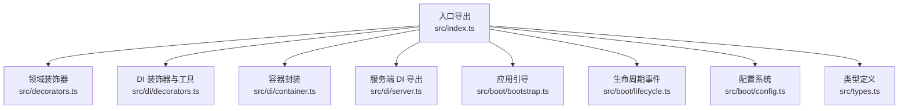
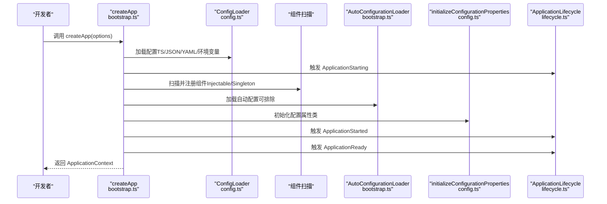
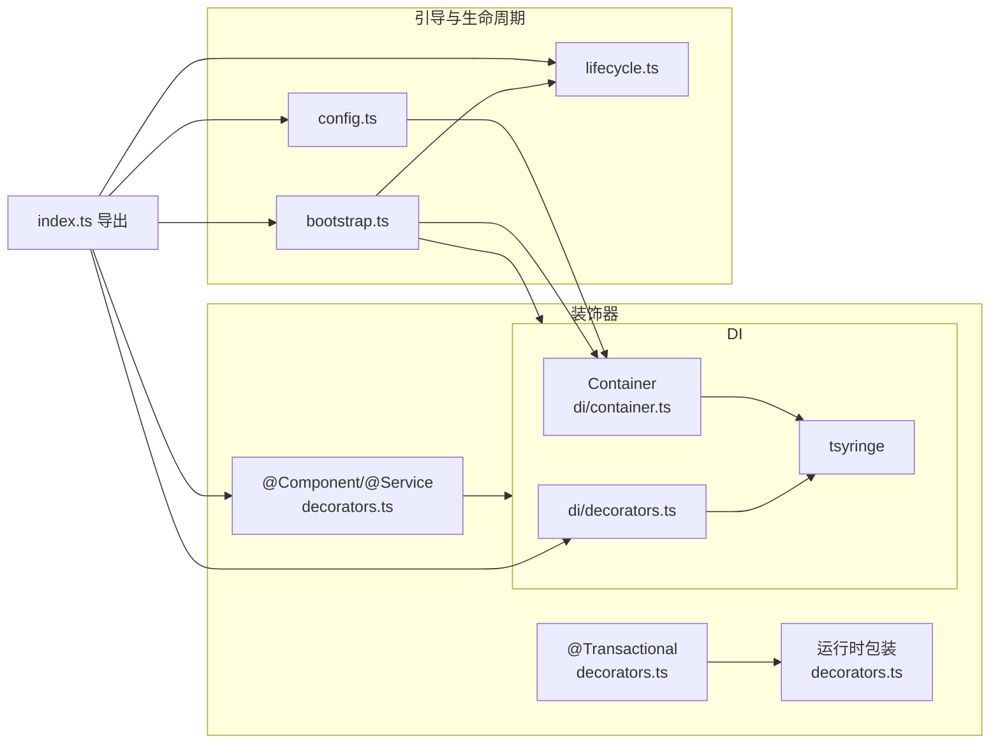
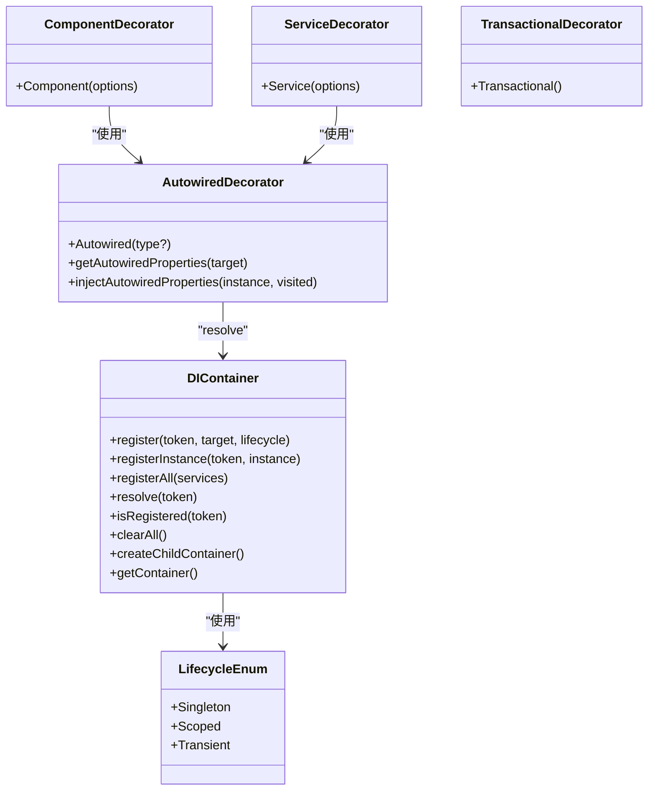
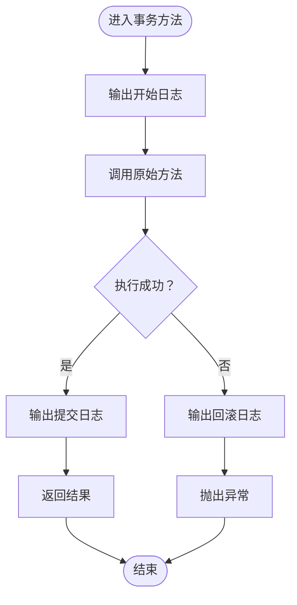

# 核心框架 API

<cite>
**本文引用的文件**
- [packages/aiko-boot/src/index.ts](file://packages/aiko-boot/src/index.ts)
- [packages/aiko-boot/src/decorators.ts](file://packages/aiko-boot/src/decorators.ts)
- [packages/aiko-boot/src/di/decorators.ts](file://packages/aiko-boot/src/di/decorators.ts)
- [packages/aiko-boot/src/di/container.ts](file://packages/aiko-boot/src/di/container.ts)
- [packages/aiko-boot/src/di/server.ts](file://packages/aiko-boot/src/di/server.ts)
- [packages/aiko-boot/src/di/example.ts](file://packages/aiko-boot/src/di/example.ts)
- [packages/aiko-boot/src/boot/bootstrap.ts](file://packages/aiko-boot/src/boot/bootstrap.ts)
- [packages/aiko-boot/src/boot/lifecycle.ts](file://packages/aiko-boot/src/boot/lifecycle.ts)
- [packages/aiko-boot/src/boot/config.ts](file://packages/aiko-boot/src/boot/config.ts)
- [packages/aiko-boot/src/types.ts](file://packages/aiko-boot/src/types.ts)
- [packages/aiko-boot/package.json](file://packages/aiko-boot/package.json)
</cite>

## 目录
1. [简介](#简介)
2. [项目结构](#项目结构)
3. [核心组件](#核心组件)
4. [架构总览](#架构总览)
5. [详细组件分析](#详细组件分析)
6. [依赖关系分析](#依赖关系分析)
7. [性能考量](#性能考量)
8. [故障排查指南](#故障排查指南)
9. [结论](#结论)
10. [附录](#附录)

## 简介
本文件为 Aiko Boot 核心框架 API 的权威参考，聚焦装饰器系统与依赖注入（DI）体系，涵盖以下主题：
- 装饰器系统：@Component、@Service、@Transactional、@ConfigurationProperties、@Value、@EventListener、@OnApplication*、@Async 等
- 依赖注入 API：Injectable、Singleton、Scoped、Inject、inject、AutoRegister、Autowired、injectAutowiredProperties、Container、Lifecycle
- 服务选项与元数据：ServiceOptions、元数据键与 getter 函数
- 类型定义：ServiceOptions、Lifecycle 枚举等
- 使用示例：组合装饰器的典型场景与最佳实践
- 执行顺序与生命周期：启动阶段、事件发布与优雅停机
- 常见问题与性能优化建议

## 项目结构
Aiko Boot 的核心位于 packages/aiko-boot，主要模块如下：
- src/index.ts：对外导出入口，统一暴露装饰器、DI、引导与配置能力
- src/decorators.ts：领域层装饰器（@Component、@Service、@Transactional 及其元数据）
- src/di/：依赖注入子系统
  - decorators.ts：DI 装饰器与工具（Injectable、Inject、inject、Singleton、Scoped、AutoRegister、Autowired、injectAutowiredProperties）
  - container.ts：容器封装（Container、Lifecycle）
  - server.ts：仅服务端 DI 导出（避免 React 依赖）
  - example.ts：DI 使用示例
- src/boot/：应用引导与生命周期
  - bootstrap.ts：应用创建与启动流程（createApp）、HTTP 服务器集成点
  - lifecycle.ts：生命周期事件系统（@OnApplication*、@EventListener、@Async、ApplicationLifecycle/ApplicationEventPublisher）
  - config.ts：配置系统（ConfigLoader、@ConfigurationProperties、@Value、初始化）
- src/types.ts：核心类型定义（如 ServiceOptions）

图表来源
- [packages/aiko-boot/src/index.ts](file://packages/aiko-boot/src/index.ts#L19-L63)
- [packages/aiko-boot/src/decorators.ts](file://packages/aiko-boot/src/decorators.ts#L1-L158)
- [packages/aiko-boot/src/di/decorators.ts](file://packages/aiko-boot/src/di/decorators.ts#L1-L110)
- [packages/aiko-boot/src/di/container.ts](file://packages/aiko-boot/src/di/container.ts#L1-L105)
- [packages/aiko-boot/src/di/server.ts](file://packages/aiko-boot/src/di/server.ts#L1-L26)
- [packages/aiko-boot/src/boot/bootstrap.ts](file://packages/aiko-boot/src/boot/bootstrap.ts#L1-L354)
- [packages/aiko-boot/src/boot/lifecycle.ts](file://packages/aiko-boot/src/boot/lifecycle.ts#L1-L457)
- [packages/aiko-boot/src/boot/config.ts](file://packages/aiko-boot/src/boot/config.ts#L1-L448)
- [packages/aiko-boot/src/types.ts](file://packages/aiko-boot/src/types.ts#L1-L14)

章节来源
- [packages/aiko-boot/src/index.ts](file://packages/aiko-boot/src/index.ts#L1-L64)

## 核心组件
- 装饰器系统
  - @Component：组件级装饰器，自动注册到 DI 容器，支持构造函数注入与 @Autowired 属性注入
  - @Service：服务级装饰器，行为与 @Component 类似，面向业务服务
  - @Transactional：方法级事务装饰器，包装目标方法以模拟事务语义
  - @ConfigurationProperties：配置属性类装饰器，将配置树绑定到类实例
  - @Value：单值注入装饰器，向类属性注入配置值
  - @EventListener、@OnApplication*、@Async：生命周期与事件系统装饰器
- 依赖注入 API
  - Injectable、Singleton、Scoped、Inject、inject、AutoRegister
  - Autowired、injectAutowiredProperties：属性注入与递归注入
  - Container、Lifecycle：容器注册与生命周期枚举
- 类型与元数据
  - ServiceOptions：服务选项（名称、描述）
  - 元数据键与 getter：getComponentMetadata、getServiceMetadata、isTransactional、getConfigurationPropertiesMetadata、getConfigPropertiesClasses、injectValueProperties 等

章节来源
- [packages/aiko-boot/src/decorators.ts](file://packages/aiko-boot/src/decorators.ts#L20-L157)
- [packages/aiko-boot/src/di/decorators.ts](file://packages/aiko-boot/src/di/decorators.ts#L1-L110)
- [packages/aiko-boot/src/di/container.ts](file://packages/aiko-boot/src/di/container.ts#L10-L104)
- [packages/aiko-boot/src/boot/config.ts](file://packages/aiko-boot/src/boot/config.ts#L334-L447)
- [packages/aiko-boot/src/types.ts](file://packages/aiko-boot/src/types.ts#L8-L13)

## 架构总览
Aiko Boot 的启动流程遵循“配置加载 → 组件扫描 → 自动配置 → 初始化配置属性 → 生命周期事件 → HTTP 服务器运行”的顺序。生命周期事件系统通过反射收集监听器，并在相应阶段通过 DI 容器解析实例并调用。

图表来源
- [packages/aiko-boot/src/boot/bootstrap.ts](file://packages/aiko-boot/src/boot/bootstrap.ts#L132-L289)
- [packages/aiko-boot/src/boot/config.ts](file://packages/aiko-boot/src/boot/config.ts#L49-L143)
- [packages/aiko-boot/src/boot/lifecycle.ts](file://packages/aiko-boot/src/boot/lifecycle.ts#L312-L398)

## 详细组件分析

### 装饰器系统 API

#### @Component
- 功能：标记组件类，自动注册到 DI 容器，支持构造函数注入与 @Autowired 属性注入
- 参数：{ name?: string }
- 行为要点：
  - 记录组件元数据（含 name）
  - 自动对构造函数参数进行 inject(type)
  - 应用 Injectable 与 Singleton
  - 包装构造函数，在实例化后调用 injectAutowiredProperties

章节来源
- [packages/aiko-boot/src/decorators.ts](file://packages/aiko-boot/src/decorators.ts#L30-L66)

#### @Service
- 功能：标记业务服务类，行为与 @Component 类似
- 参数：ServiceOptions（name、description）
- 行为要点：记录服务元数据、自动注入、应用 DI 装饰器、包装构造函数

章节来源
- [packages/aiko-boot/src/decorators.ts](file://packages/aiko-boot/src/decorators.ts#L81-L118)
- [packages/aiko-boot/src/types.ts](file://packages/aiko-boot/src/types.ts#L8-L13)

#### @Transactional
- 功能：将方法标记为事务性，包装原方法以输出事务日志并捕获异常
- 参数：无
- 行为要点：在方法执行前后输出日志；异常时抛出错误

章节来源
- [packages/aiko-boot/src/decorators.ts](file://packages/aiko-boot/src/decorators.ts#L125-L143)

#### @ConfigurationProperties
- 功能：将配置树绑定到类实例
- 参数：prefix（配置前缀）
- 行为要点：记录元数据、注册到全局列表、应用 Injectable/Singleton、包装构造函数以绑定配置

章节来源
- [packages/aiko-boot/src/boot/config.ts](file://packages/aiko-boot/src/boot/config.ts#L334-L365)

#### @Value
- 功能：向类属性注入单个配置值
- 参数：key（配置键）、defaultValue（可选）
- 行为要点：记录属性注入信息，初始化时通过 ConfigLoader.get 注入

章节来源
- [packages/aiko-boot/src/boot/config.ts](file://packages/aiko-boot/src/boot/config.ts#L382-L392)

#### 生命周期与事件装饰器
- @EventListener(eventType, { order? })：监听特定事件类型
- @OnApplicationStarting/@OnApplicationStarted/@OnApplicationReady/@OnApplicationShutdown：应用生命周期钩子
- @Async：标记方法异步执行（不阻塞主流程）
- 行为要点：通过反射收集元数据，ApplicationLifecycle 在对应事件触发时解析实例并调用；ApplicationEventPublisher 支持同步/异步发布

章节来源
- [packages/aiko-boot/src/boot/lifecycle.ts](file://packages/aiko-boot/src/boot/lifecycle.ts#L107-L227)
- [packages/aiko-boot/src/boot/lifecycle.ts](file://packages/aiko-boot/src/boot/lifecycle.ts#L261-L307)
- [packages/aiko-boot/src/boot/lifecycle.ts](file://packages/aiko-boot/src/boot/lifecycle.ts#L312-L398)

#### 元数据与 Getter
- getComponentMetadata(target)
- getServiceMetadata(target)
- isTransactional(target, methodName)
- getConfigurationPropertiesMetadata(target)
- getConfigPropertiesClasses()
- injectValueProperties(instance)

章节来源
- [packages/aiko-boot/src/decorators.ts](file://packages/aiko-boot/src/decorators.ts#L147-L157)
- [packages/aiko-boot/src/boot/config.ts](file://packages/aiko-boot/src/boot/config.ts#L424-L433)
- [packages/aiko-boot/src/boot/config.ts](file://packages/aiko-boot/src/boot/config.ts#L410-L419)

### 依赖注入 API

#### DI 装饰器与工具
- Injectable、Inject、inject、Singleton、Scoped
- Autowired：属性注入装饰器，支持显式类型或从设计时类型推断
- injectAutowiredProperties：为实例及其依赖递归注入属性
- AutoRegister：自动注册类并选择生命周期

章节来源
- [packages/aiko-boot/src/di/decorators.ts](file://packages/aiko-boot/src/di/decorators.ts#L15-L110)

#### 容器与生命周期
- Container：封装 TSyringe，提供 register/registerAll/registerInstance/resolve/isRegistered/clearAll/createChildContainer/getContainer
- Lifecycle：枚举（Singleton、Scoped、Transient）

章节来源
- [packages/aiko-boot/src/di/container.ts](file://packages/aiko-boot/src/di/container.ts#L10-L104)

#### 服务端 DI 导出
- 仅导出服务端可用的 DI 能力，避免 React 依赖

章节来源
- [packages/aiko-boot/src/di/server.ts](file://packages/aiko-boot/src/di/server.ts#L1-L26)

### 配置系统 API

#### ConfigLoader
- load/loadAsync：加载 app.config.ts/js/json/yaml/profile 特定文件与环境变量
- get/getPrefix/setConfig/isLoaded/clear/getAll：配置读取与管理
- 环境变量映射规则：APP_DATABASE_HOST → database.host

章节来源
- [packages/aiko-boot/src/boot/config.ts](file://packages/aiko-boot/src/boot/config.ts#L49-L143)
- [packages/aiko-boot/src/boot/config.ts](file://packages/aiko-boot/src/boot/config.ts#L157-L190)

#### initializeConfigurationProperties
- 通过 Container.resolve 触发配置属性类构造函数，完成配置绑定

章节来源
- [packages/aiko-boot/src/boot/config.ts](file://packages/aiko-boot/src/boot/config.ts#L438-L447)

### 应用引导与生命周期

#### createApp
- 启动阶段：加载配置 → 触发 ApplicationStarting → 组件扫描与注册 → 自动配置 → 初始化配置属性 → 触发 ApplicationStarted → 触发 ApplicationReady
- HTTP 服务器：通过 registerHttpServer 注册，run() 启动
- 优雅停机：setupGracefulShutdown，监听 SIGINT/SIGTERM

章节来源
- [packages/aiko-boot/src/boot/bootstrap.ts](file://packages/aiko-boot/src/boot/bootstrap.ts#L132-L289)
- [packages/aiko-boot/src/boot/bootstrap.ts](file://packages/aiko-boot/src/boot/bootstrap.ts#L301-L303)

#### ApplicationLifecycle 与 ApplicationEventPublisher
- emit：按事件类型排序并调用监听器（支持异步）
- publish/publishSync：事件发布（异步/同步）
- setupGracefulShutdown：注册关闭处理器并触发 ApplicationShutdown

章节来源
- [packages/aiko-boot/src/boot/lifecycle.ts](file://packages/aiko-boot/src/boot/lifecycle.ts#L312-L398)
- [packages/aiko-boot/src/boot/lifecycle.ts](file://packages/aiko-boot/src/boot/lifecycle.ts#L261-L307)

### 使用示例与最佳实践

#### DI 使用示例
- 基础服务链：Logger → UserRepository → UserService
- 单例服务：ConfigService
- 注册与解析：Container.registerAll 与 Container.resolve

章节来源
- [packages/aiko-boot/src/di/example.ts](file://packages/aiko-boot/src/di/example.ts#L8-L68)

#### 组合装饰器示例（路径指引）
- 组件与服务：参见 [packages/aiko-boot/src/decorators.ts](file://packages/aiko-boot/src/decorators.ts#L30-L118)
- 事务方法：参见 [packages/aiko-boot/src/decorators.ts](file://packages/aiko-boot/src/decorators.ts#L125-L143)
- 配置属性类：参见 [packages/aiko-boot/src/boot/config.ts](file://packages/aiko-boot/src/boot/config.ts#L334-L365)
- 单值注入：参见 [packages/aiko-boot/src/boot/config.ts](file://packages/aiko-boot/src/boot/config.ts#L382-L392)
- 事件监听与生命周期：参见 [packages/aiko-boot/src/boot/lifecycle.ts](file://packages/aiko-boot/src/boot/lifecycle.ts#L107-L181)

## 依赖关系分析

图表来源
- [packages/aiko-boot/src/index.ts](file://packages/aiko-boot/src/index.ts#L29-L63)
- [packages/aiko-boot/src/decorators.ts](file://packages/aiko-boot/src/decorators.ts#L10-L11)
- [packages/aiko-boot/src/di/decorators.ts](file://packages/aiko-boot/src/di/decorators.ts#L4-L13)
- [packages/aiko-boot/src/di/container.ts](file://packages/aiko-boot/src/di/container.ts#L4-L5)
- [packages/aiko-boot/src/boot/bootstrap.ts](file://packages/aiko-boot/src/boot/bootstrap.ts#L25-L29)
- [packages/aiko-boot/src/boot/lifecycle.ts](file://packages/aiko-boot/src/boot/lifecycle.ts#L28-L29)
- [packages/aiko-boot/src/boot/config.ts](file://packages/aiko-boot/src/boot/config.ts#L20-L24)

章节来源
- [packages/aiko-boot/src/index.ts](file://packages/aiko-boot/src/index.ts#L19-L63)
- [packages/aiko-boot/package.json](file://packages/aiko-boot/package.json#L35-L37)

## 性能考量
- 构造函数注入优于属性注入：减少运行时反射查找次数
- 合理使用 Singleton：长生命周期对象可复用，但需注意状态管理
- 避免过度嵌套的依赖链：递归注入可能带来额外开销
- 事件监听器异步化：使用 @Async 避免阻塞主流程
- 配置加载顺序：优先 TypeScript 配置文件，减少 JSON/YAML 解析成本
- 组件扫描范围：合理设置 scanDirs，避免不必要的文件导入

## 故障排查指南
- 无法解析依赖
  - 检查是否已通过 Injectable/Singleton/AutoRegister 正确注册
  - 确认 Container.register/registerAll 是否调用
  - 参考：[packages/aiko-boot/src/di/container.ts](file://packages/aiko-boot/src/di/container.ts#L28-L46)
- 属性注入未生效
  - 确保 @Autowired 装饰器正确标注，且类型可从设计时元数据推断或显式指定
  - 确认构造函数包装与 injectAutowiredProperties 被调用
  - 参考：[packages/aiko-boot/src/di/decorators.ts](file://packages/aiko-boot/src/di/decorators.ts#L42-L84)
- 事务方法异常未回滚
  - @Transactional 当前为方法包装，异常会抛出；具体回滚逻辑需结合上层 ORM 或事务管理器
  - 参考：[packages/aiko-boot/src/decorators.ts](file://packages/aiko-boot/src/decorators.ts#L125-L143)
- 配置未加载或值为空
  - 检查 ConfigLoader.load/loadAsync 是否被调用
  - 确认环境变量命名与映射规则
  - 参考：[packages/aiko-boot/src/boot/config.ts](file://packages/aiko-boot/src/boot/config.ts#L73-L143)
- 事件未触发
  - 确认 @EventListener/@OnApplication* 已被扫描并注册
  - 检查 ApplicationLifecycle.emit 的调用时机
  - 参考：[packages/aiko-boot/src/boot/lifecycle.ts](file://packages/aiko-boot/src/boot/lifecycle.ts#L312-L349)

## 结论
Aiko Boot 通过装饰器与 DI 的组合，提供了接近 Spring Boot 的开发体验。其核心优势在于：
- 易用的领域装饰器（@Component/@Service/@Transactional）
- 基于 reflect-metadata 的元数据与生命周期事件系统
- 以 TSyringe 为基础的 DI 能力与容器封装
- 灵活的配置系统与自动配置扩展点

建议在大型项目中：
- 明确划分组件与服务边界，统一使用 @Component/@Service
- 优先使用构造函数注入，必要时配合 @Autowired
- 对关键流程使用 @Transactional 包裹，并结合上层事务管理
- 通过 @ConfigurationProperties 与 @Value 统一配置管理
- 使用 @EventListener 与 @OnApplication* 实现解耦的启动/关闭逻辑

## 附录

### 类图：装饰器与容器关系

图表来源
- [packages/aiko-boot/src/decorators.ts](file://packages/aiko-boot/src/decorators.ts#L30-L118)
- [packages/aiko-boot/src/di/decorators.ts](file://packages/aiko-boot/src/di/decorators.ts#L42-L107)
- [packages/aiko-boot/src/di/container.ts](file://packages/aiko-boot/src/di/container.ts#L22-L104)

### 流程图：事务方法包装

图表来源
- [packages/aiko-boot/src/decorators.ts](file://packages/aiko-boot/src/decorators.ts#L125-L143)