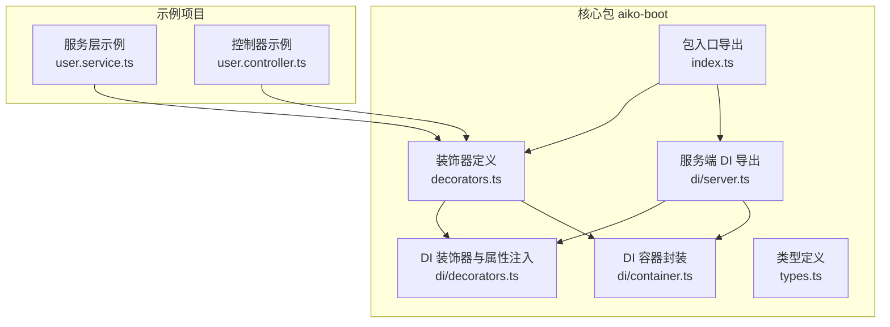
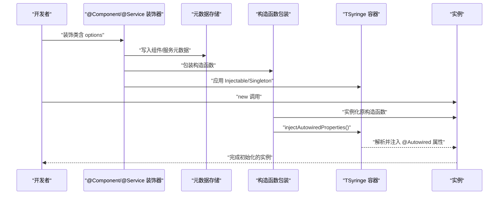
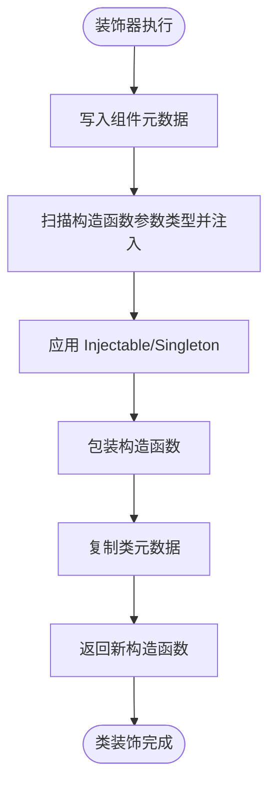
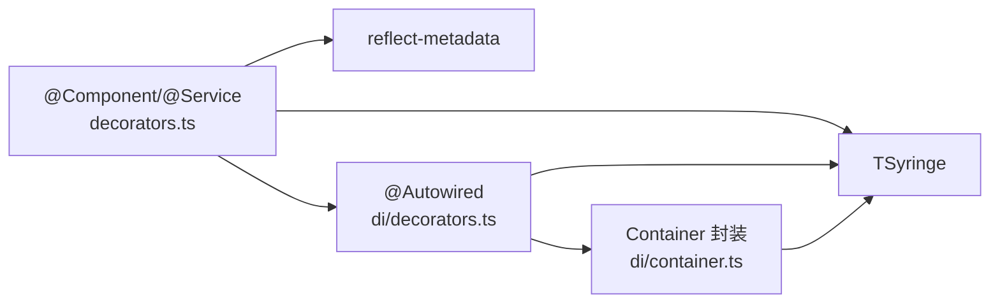

# 组件装饰器

<cite>
**本文引用的文件**
- [packages/aiko-boot/src/decorators.ts](file://packages/aiko-boot/src/decorators.ts)
- [packages/aiko-boot/src/di/decorators.ts](file://packages/aiko-boot/src/di/decorators.ts)
- [packages/aiko-boot/src/di/server.ts](file://packages/aiko-boot/src/di/server.ts)
- [packages/aiko-boot/src/di/container.ts](file://packages/aiko-boot/src/di/container.ts)
- [packages/aiko-boot/src/types.ts](file://packages/aiko-boot/src/types.ts)
- [packages/aiko-boot/src/index.ts](file://packages/aiko-boot/src/index.ts)
- [app/examples/user-crud/packages/api/src/service/user.service.ts](file://app/examples/user-crud/packages/api/src/service/user.service.ts)
- [app/examples/user-crud/packages/api/src/controller/user.controller.ts](file://app/examples/user-crud/packages/api/src/controller/user.controller.ts)
</cite>

## 目录
1. [简介](#简介)
2. [项目结构](#项目结构)
3. [核心组件](#核心组件)
4. [架构总览](#架构总览)
5. [详细组件分析](#详细组件分析)
6. [依赖分析](#依赖分析)
7. [性能考虑](#性能考虑)
8. [故障排查指南](#故障排查指南)
9. [结论](#结论)
10. [附录](#附录)

## 简介
本文件为组件装饰器系统的详细 API 参考文档，聚焦于 @Component 与 @Service 两大装饰器的完整用法，涵盖：
- 装饰器参数配置与行为
- 类注册机制与生命周期
- 自动依赖注入（构造函数注入与属性注入）的执行流程
- 元数据定义、构造函数包装与属性注入处理
- 与 DI 容器的集成方式
- 与其他装饰器（如 @Transactional、@AutoRegister 等）的组合使用
- 最佳实践与常见问题排查

## 项目结构
该装饰器系统位于 aiko-boot 核心包内，并通过 server 端 DI 导出层统一对外暴露。关键模块如下：
- 装饰器定义与元数据：packages/aiko-boot/src/decorators.ts
- DI 装饰器与属性注入：packages/aiko-boot/src/di/decorators.ts
- DI 容器封装：packages/aiko-boot/src/di/container.ts
- DI 服务端导出：packages/aiko-boot/src/di/server.ts
- 类型定义：packages/aiko-boot/src/types.ts
- 包入口导出：packages/aiko-boot/src/index.ts
- 使用示例（服务层）：app/examples/user-crud/packages/api/src/service/user.service.ts
- 使用示例（控制器层）：app/examples/user-crud/packages/api/src/controller/user.controller.ts

图表来源
- [packages/aiko-boot/src/decorators.ts](file://packages/aiko-boot/src/decorators.ts#L1-L158)
- [packages/aiko-boot/src/di/decorators.ts](file://packages/aiko-boot/src/di/decorators.ts#L1-L110)
- [packages/aiko-boot/src/di/container.ts](file://packages/aiko-boot/src/di/container.ts#L1-L105)
- [packages/aiko-boot/src/di/server.ts](file://packages/aiko-boot/src/di/server.ts#L1-L26)
- [packages/aiko-boot/src/types.ts](file://packages/aiko-boot/src/types.ts#L1-L14)
- [packages/aiko-boot/src/index.ts](file://packages/aiko-boot/src/index.ts#L1-L64)
- [app/examples/user-crud/packages/api/src/service/user.service.ts](file://app/examples/user-crud/packages/api/src/service/user.service.ts#L1-L251)
- [app/examples/user-crud/packages/api/src/controller/user.controller.ts](file://app/examples/user-crud/packages/api/src/controller/user.controller.ts#L1-L170)

章节来源
- [packages/aiko-boot/src/decorators.ts](file://packages/aiko-boot/src/decorators.ts#L1-L158)
- [packages/aiko-boot/src/di/decorators.ts](file://packages/aiko-boot/src/di/decorators.ts#L1-L110)
- [packages/aiko-boot/src/di/container.ts](file://packages/aiko-boot/src/di/container.ts#L1-L105)
- [packages/aiko-boot/src/di/server.ts](file://packages/aiko-boot/src/di/server.ts#L1-L26)
- [packages/aiko-boot/src/types.ts](file://packages/aiko-boot/src/types.ts#L1-L14)
- [packages/aiko-boot/src/index.ts](file://packages/aiko-boot/src/index.ts#L1-L64)

## 核心组件
- @Component：将类标记为通用组件，自动注册到 DI 容器，支持构造函数依赖注入与 @Autowired 属性注入。
- @Service：将类标记为领域服务，具备与 @Component 相同的能力，同时提供 ServiceOptions 参数（name、description）。
- @Autowired：属性注入装饰器，记录需注入的属性及其类型，运行时由容器解析并注入。
- @Transactional：方法级事务装饰器，对目标方法进行事务包装（开启/提交/回滚）。
- DI 容器与生命周期：基于 TSyringe，提供 Singleton、Scoped、Transient 生命周期管理。

章节来源
- [packages/aiko-boot/src/decorators.ts](file://packages/aiko-boot/src/decorators.ts#L20-L118)
- [packages/aiko-boot/src/di/decorators.ts](file://packages/aiko-boot/src/di/decorators.ts#L30-L84)
- [packages/aiko-boot/src/di/server.ts](file://packages/aiko-boot/src/di/server.ts#L1-L26)
- [packages/aiko-boot/src/di/container.ts](file://packages/aiko-boot/src/di/container.ts#L10-L17)
- [packages/aiko-boot/src/types.ts](file://packages/aiko-boot/src/types.ts#L8-L13)

## 架构总览
装饰器系统围绕“元数据 + 构造函数包装 + 属性注入”的三段式执行流程工作：
- 元数据定义：在类上写入组件/服务元数据，用于后续识别与注册。
- 构造函数包装：替换原构造函数，实例化后立即执行属性注入。
- 属性注入：扫描 @Autowired 记录，按类型从容器解析并注入，支持递归处理依赖链。

图表来源
- [packages/aiko-boot/src/decorators.ts](file://packages/aiko-boot/src/decorators.ts#L30-L66)
- [packages/aiko-boot/src/decorators.ts](file://packages/aiko-boot/src/decorators.ts#L81-L118)
- [packages/aiko-boot/src/di/decorators.ts](file://packages/aiko-boot/src/di/decorators.ts#L67-L84)

## 详细组件分析

### @Component 装饰器
- 功能要点
  - 写入组件元数据（默认 name 为类名，可通过 options.name 覆盖）
  - 自动扫描构造函数参数类型并进行构造函数注入
  - 应用 Injectable 与 Singleton 生命周期装饰
  - 包装构造函数，在实例化后执行属性注入
  - 复制原类的所有元数据，确保反射信息一致

- 典型使用场景
  - 简单工具类或通用组件
  - 需要构造函数注入依赖的组件
  - 与 @Autowired 组合进行属性注入

- 参数与行为
  - options.name：自定义组件名称（可选）

- 元数据与反射
  - 元数据键：COMPONENT_METADATA
  - 读取器：getComponentMetadata

- 与 DI 容器集成
  - 通过 Injectable/Singleton 与 TSyringe 对接
  - 构造函数注入由 TSyringe 的 inject 实现
  - 属性注入由 injectAutowiredProperties 完成

- 代码片段路径
  - [装饰器定义与包装逻辑](file://packages/aiko-boot/src/decorators.ts#L30-L66)
  - [元数据读取器](file://packages/aiko-boot/src/decorators.ts#L147-L149)

章节来源
- [packages/aiko-boot/src/decorators.ts](file://packages/aiko-boot/src/decorators.ts#L20-L66)
- [packages/aiko-boot/src/decorators.ts](file://packages/aiko-boot/src/decorators.ts#L147-L149)

### @Service 装饰器
- 功能要点
  - 与 @Component 类似，但面向领域服务
  - 支持 ServiceOptions（name、description）
  - 自动构造函数注入与属性注入
  - 应用 Injectable 与 Singleton 生命周期

- 参数与行为
  - options.name：服务名称（可选）
  - options.description：服务描述（可选）

- 元数据与反射
  - 元数据键：SERVICE_METADATA
  - 读取器：getServiceMetadata

- 与 @Transactional 组合
  - 方法级事务控制，装饰器会包装方法并输出事务日志

- 代码片段路径
  - [装饰器定义与包装逻辑](file://packages/aiko-boot/src/decorators.ts#L81-L118)
  - [元数据读取器](file://packages/aiko-boot/src/decorators.ts#L151-L153)
  - [事务装饰器](file://packages/aiko-boot/src/decorators.ts#L125-L143)

章节来源
- [packages/aiko-boot/src/decorators.ts](file://packages/aiko-boot/src/decorators.ts#L70-L118)
- [packages/aiko-boot/src/decorators.ts](file://packages/aiko-boot/src/decorators.ts#L151-L157)
- [packages/aiko-boot/src/types.ts](file://packages/aiko-boot/src/types.ts#L8-L13)

### @Autowired 属性注入
- 功能要点
  - 记录需注入的属性及其类型（优先显式类型，其次从设计类型反射获取）
  - 运行时通过容器 resolve 注入
  - 支持递归注入依赖链，避免循环依赖导致的无限递归

- 与 @Component/@Service 的协作
  - 装饰器在实例化后调用 injectAutowiredProperties 完成注入
  - 若依赖未注册，注入过程静默失败（不抛错）

- 代码片段路径
  - [属性注入装饰器](file://packages/aiko-boot/src/di/decorators.ts#L42-L55)
  - [获取属性列表](file://packages/aiko-boot/src/di/decorators.ts#L60-L62)
  - [注入实现与递归处理](file://packages/aiko-boot/src/di/decorators.ts#L67-L84)

章节来源
- [packages/aiko-boot/src/di/decorators.ts](file://packages/aiko-boot/src/di/decorators.ts#L30-L84)

### DI 容器与生命周期
- 容器封装
  - 提供 register/registerInstance/registerAll/resolve/isRegistered/clearAll/createChildContainer/getContainer 等能力
  - 生命周期枚举：Singleton、Scoped、Transient

- 与装饰器的关系
  - @Component/@Service 默认应用 Singleton
  - 可通过 @AutoRegister 自定义生命周期
  - @Scoped 对应 TSyringe 的 ContainerScoped

- 代码片段路径
  - [生命周期枚举](file://packages/aiko-boot/src/di/container.ts#L10-L17)
  - [容器注册与解析](file://packages/aiko-boot/src/di/container.ts#L28-L75)
  - [AutoRegister 装饰器](file://packages/aiko-boot/src/di/decorators.ts#L89-L107)

章节来源
- [packages/aiko-boot/src/di/container.ts](file://packages/aiko-boot/src/di/container.ts#L10-L75)
- [packages/aiko-boot/src/di/decorators.ts](file://packages/aiko-boot/src/di/decorators.ts#L89-L107)

### 执行流程与元数据定义
- 元数据键
  - COMPONENT_METADATA：组件元数据
  - SERVICE_METADATA：服务元数据
  - TRANSACTIONAL_METADATA：事务元数据
  - AUTOWIRED_METADATA：属性注入记录

- 流程图（以 @Component 为例）

图表来源
- [packages/aiko-boot/src/decorators.ts](file://packages/aiko-boot/src/decorators.ts#L30-L66)

章节来源
- [packages/aiko-boot/src/decorators.ts](file://packages/aiko-boot/src/decorators.ts#L13-L66)

### 与 DI 容器的集成机制
- 服务端导出
  - di/server.ts 重新导出 TSyringe 的核心类型与装饰器，便于在服务端组件/动作/API 路由中使用

- 容器封装
  - Container 类对 TSyringe 的 register/resolve 等进行统一封装，提供更清晰的 API

- 代码片段路径
  - [服务端导出](file://packages/aiko-boot/src/di/server.ts#L7-L25)
  - [容器封装](file://packages/aiko-boot/src/di/container.ts#L22-L104)

章节来源
- [packages/aiko-boot/src/di/server.ts](file://packages/aiko-boot/src/di/server.ts#L1-L26)
- [packages/aiko-boot/src/di/container.ts](file://packages/aiko-boot/src/di/container.ts#L1-L105)

### 与其他装饰器的组合使用
- 与 @Transactional 组合
  - 在 @Service 标注的类上使用 @Transactional，可对方法进行事务包装
  - 适用于数据库操作等需要 ACID 保证的业务方法

- 与 @AutoRegister 组合
  - 通过 @AutoRegister 可在装饰时直接选择生命周期（singleton/scoped/transient）

- 与 @RestController 等 Web 装饰器组合
  - 控制器层可使用 @Autowired 注入服务层实例

- 代码片段路径
  - [事务装饰器](file://packages/aiko-boot/src/decorators.ts#L125-L143)
  - [AutoRegister 装饰器](file://packages/aiko-boot/src/di/decorators.ts#L89-L107)
  - [控制器使用 @Autowired 注入服务](file://app/examples/user-crud/packages/api/src/controller/user.controller.ts#L30-L38)

章节来源
- [packages/aiko-boot/src/decorators.ts](file://packages/aiko-boot/src/decorators.ts#L125-L143)
- [packages/aiko-boot/src/di/decorators.ts](file://packages/aiko-boot/src/di/decorators.ts#L89-L107)
- [app/examples/user-crud/packages/api/src/controller/user.controller.ts](file://app/examples/user-crud/packages/api/src/controller/user.controller.ts#L30-L38)

### 使用示例（路径指引）
- 简单组件（@Component）
  - [示例路径](file://packages/aiko-boot/src/decorators.ts#L24-L29)

- 带参数的服务类（@Service + ServiceOptions）
  - [示例路径](file://packages/aiko-boot/src/decorators.ts#L74-L80)
  - [类型定义](file://packages/aiko-boot/src/types.ts#L8-L13)

- 复杂依赖关系的组件（构造函数注入 + @Autowired）
  - [服务层示例（@Service + @Autowired）](file://app/examples/user-crud/packages/api/src/service/user.service.ts#L30-L33)
  - [控制器示例（@Autowired 注入服务）](file://app/examples/user-crud/packages/api/src/controller/user.controller.ts#L30-L33)

章节来源
- [packages/aiko-boot/src/decorators.ts](file://packages/aiko-boot/src/decorators.ts#L24-L80)
- [packages/aiko-boot/src/types.ts](file://packages/aiko-boot/src/types.ts#L8-L13)
- [app/examples/user-crud/packages/api/src/service/user.service.ts](file://app/examples/user-crud/packages/api/src/service/user.service.ts#L30-L33)
- [app/examples/user-crud/packages/api/src/controller/user.controller.ts](file://app/examples/user-crud/packages/api/src/controller/user.controller.ts#L30-L33)

## 依赖分析
- 组件耦合
  - @Component/@Service 依赖 TSyringe 的 injectable/singleton 与 reflect-metadata
  - @Autowired 依赖 TSyringe 的 container.resolve 与自定义元数据存储
  - DI 容器封装对 TSyringe 进行二次封装，提供更易用的 API

- 外部依赖
  - reflect-metadata：用于运行时反射元数据
  - tsyringe：核心 DI 容器

图表来源
- [packages/aiko-boot/src/decorators.ts](file://packages/aiko-boot/src/decorators.ts#L9-L11)
- [packages/aiko-boot/src/di/decorators.ts](file://packages/aiko-boot/src/di/decorators.ts#L4-L13)
- [packages/aiko-boot/src/di/container.ts](file://packages/aiko-boot/src/di/container.ts#L4-L5)

章节来源
- [packages/aiko-boot/src/decorators.ts](file://packages/aiko-boot/src/decorators.ts#L9-L11)
- [packages/aiko-boot/src/di/decorators.ts](file://packages/aiko-boot/src/di/decorators.ts#L4-L13)
- [packages/aiko-boot/src/di/container.ts](file://packages/aiko-boot/src/di/container.ts#L4-L5)

## 性能考虑
- 构造函数注入与属性注入的开销
  - 构造函数注入在实例化时一次性完成，成本较低
  - 属性注入涉及反射与容器解析，建议仅在必要时使用

- 元数据与包装
  - 装饰器会对类进行元数据复制与构造函数替换，通常只发生在类定义阶段，运行时影响有限

- 递归注入
  - injectAutowiredProperties 采用 visited 集合避免循环依赖导致的无限递归，但仍需谨慎设计依赖图

- 生命周期选择
  - Singleton 适合无状态服务；Scoped/Transient 可用于请求上下文或临时对象

## 故障排查指南
- 依赖未注册导致注入失败
  - 现象：@Autowired 属性为 undefined
  - 排查：确认目标类型已在容器中注册（可通过 Container.isRegistered 检查），或使用 @AutoRegister 指定生命周期

- 循环依赖
  - 现象：注入过程中出现异常或死循环
  - 排查：检查依赖链，避免 A 依赖 B 且 B 又依赖 A；必要时重构为接口或引入中间层

- 类型推断失败
  - 现象：@Autowired 无法正确推断属性类型
  - 排查：显式传入类型参数，或确保编译配置启用设计类型元数据

- 事务方法未生效
  - 现象：方法未被事务包装
  - 排查：确认方法被 @Service 或 @Component 标注，且 @Transactional 装饰器作用于该方法

章节来源
- [packages/aiko-boot/src/di/decorators.ts](file://packages/aiko-boot/src/di/decorators.ts#L67-L84)
- [packages/aiko-boot/src/di/container.ts](file://packages/aiko-boot/src/di/container.ts#L78-L82)
- [packages/aiko-boot/src/decorators.ts](file://packages/aiko-boot/src/decorators.ts#L125-L143)

## 结论
组件装饰器系统通过“元数据 + 构造函数包装 + 属性注入”的机制，实现了与 Spring Boot 风格相近的依赖注入体验。@Component 与 @Service 提供了统一的类注册与生命周期管理，结合 @Autowired 与 TSyringe 容器，能够满足从简单组件到复杂业务服务的多种场景。配合 @Transactional 等装饰器，可在不侵入业务逻辑的前提下实现横切关注点。

## 附录
- 包入口导出一览
  - 装饰器：Component、Service、Transactional、getComponentMetadata、getServiceMetadata、isTransactional
  - DI：Container、Lifecycle、Injectable、Inject、inject、Singleton、Scoped、AutoRegister、Autowired、registry 等

- 代码片段路径
  - [包入口导出](file://packages/aiko-boot/src/index.ts#L29-L53)

章节来源
- [packages/aiko-boot/src/index.ts](file://packages/aiko-boot/src/index.ts#L29-L53)