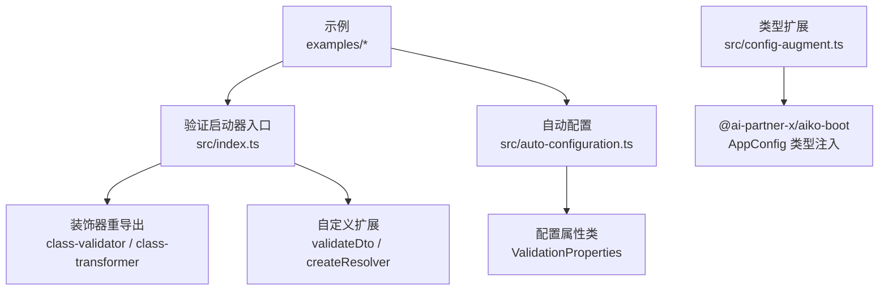
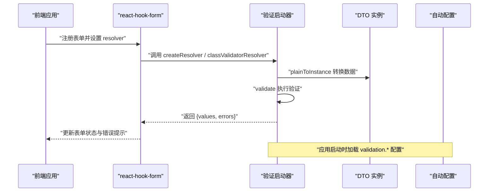
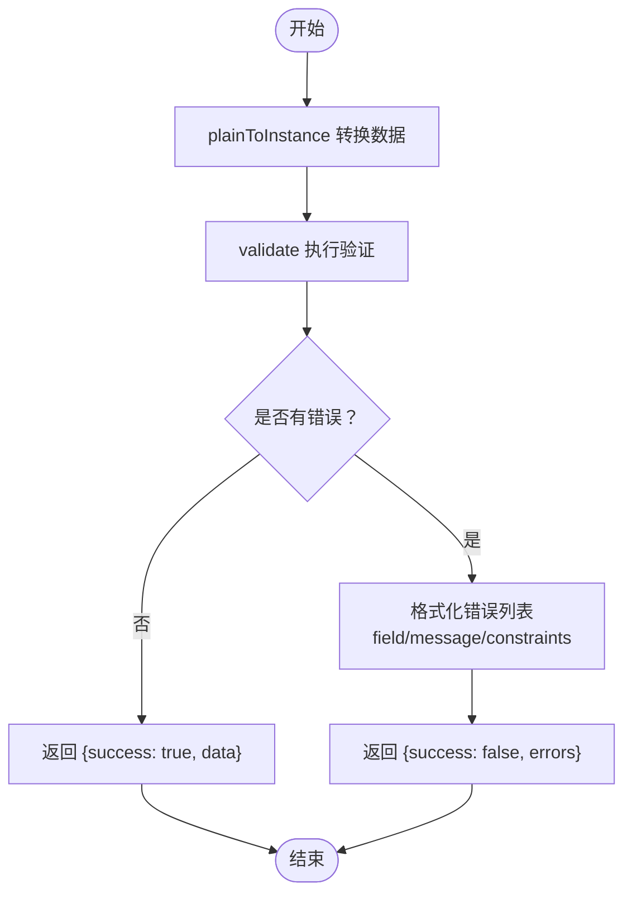
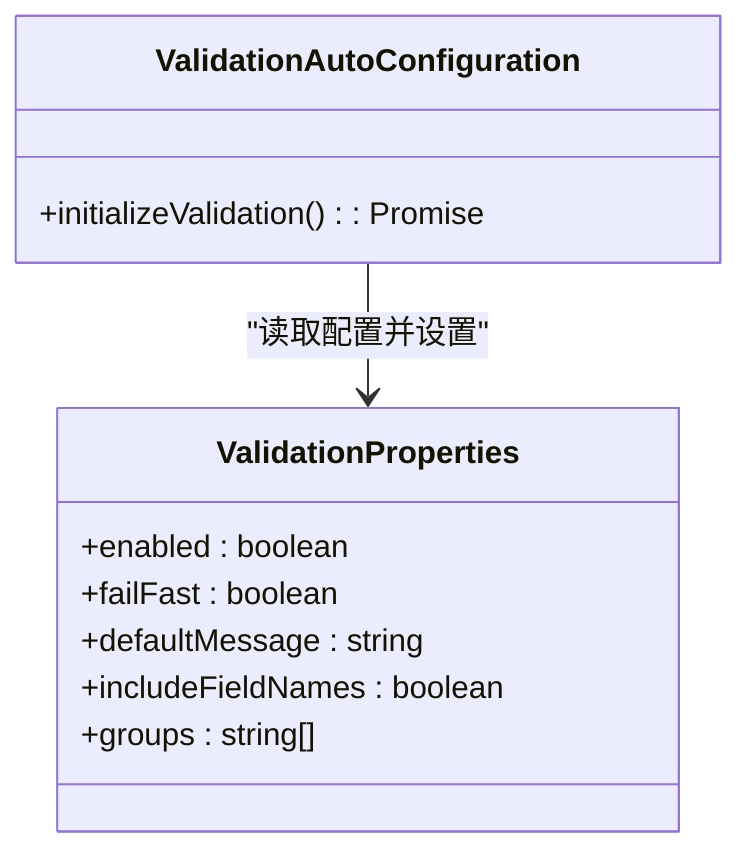
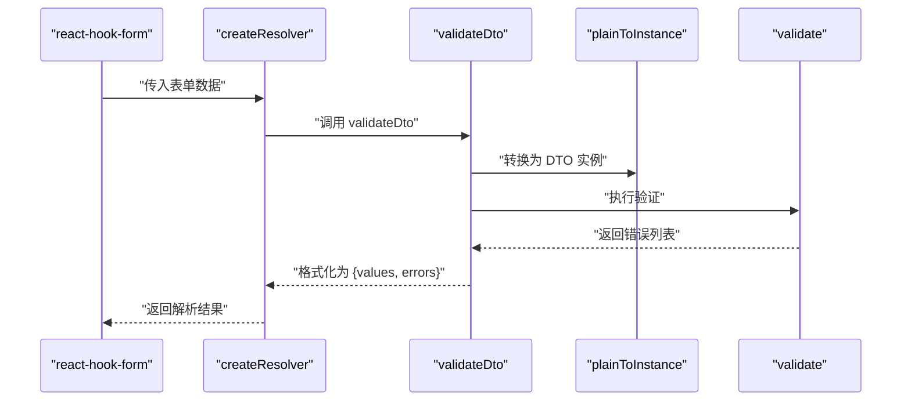
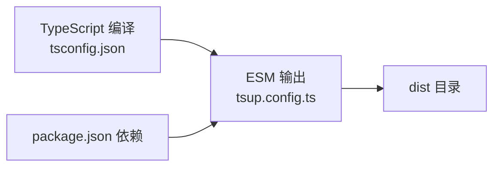

# 验证启动器 API

<cite>
**本文引用的文件**
- [packages/aiko-boot-starter-validation/src/index.ts](file://packages/aiko-boot-starter-validation/src/index.ts)
- [packages/aiko-boot-starter-validation/src/auto-configuration.ts](file://packages/aiko-boot-starter-validation/src/auto-configuration.ts)
- [packages/aiko-boot-starter-validation/src/config-augment.ts](file://packages/aiko-boot-starter-validation/src/config-augment.ts)
- [packages/aiko-boot-starter-validation/examples/user-dto.ts](file://packages/aiko-boot-starter-validation/examples/user-dto.ts)
- [packages/aiko-boot-starter-validation/examples/react-form.tsx](file://packages/aiko-boot-starter-validation/examples/react-form.tsx)
- [packages/aiko-boot-starter-validation/examples/server-action.ts](file://packages/aiko-boot-starter-validation/examples/server-action.ts)
- [packages/aiko-boot-starter-validation/tsconfig.json](file://packages/aiko-boot-starter-validation/tsconfig.json)
- [packages/aiko-boot-starter-validation/tsup.config.ts](file://packages/aiko-boot-starter-validation/tsup.config.ts)
- [packages/aiko-boot/schemas/app-config.schema.json](file://packages/aiko-boot/schemas/app-config.schema.json)
</cite>

## 目录
1. [简介](#简介)
2. [项目结构](#项目结构)
3. [核心组件](#核心组件)
4. [架构总览](#架构总览)
5. [详细组件分析](#详细组件分析)
6. [依赖关系分析](#依赖关系分析)
7. [性能考量](#性能考量)
8. [故障排查指南](#故障排查指南)
9. [结论](#结论)
10. [附录](#附录)

## 简介
本文件为验证启动器 API 的完整参考文档，基于 @ai-partner-x/aiko-boot-starter-validation 包构建，提供与 class-validator 兼容的装饰器 API、Spring Boot 风格的自动配置、React Hook Form 集成、Java 转译映射以及统一的验证结果格式化能力。文档覆盖以下关键主题：
- class-validator 装饰器 API 规范（含 @IsString、@IsNumber、@IsEmail、@MinLength、@MaxLength 等）
- 自定义验证器的创建与使用（同步与异步）
- 表单处理器 API 接口（错误收集、消息格式化、前端集成）
- 验证管道配置选项与执行流程
- 完整验证示例与错误处理策略
- 前端框架集成最佳实践与用户体验优化建议

## 项目结构
该验证启动器位于 packages/aiko-boot-starter-validation，核心由以下模块组成：
- 入口与装饰器重导出：提供 class-validator 与 class-transformer 的完整装饰器 API，并新增 validateDto、createResolver 等工具函数
- 自动配置：根据应用配置动态加载验证行为
- 类型扩展：向 @ai-partner-x/aiko-boot 的 AppConfig 注入 validation 配置类型
- 示例：用户 DTO、React 表单与 Next.js Server Action 的验证示例

图表来源
- [packages/aiko-boot-starter-validation/src/index.ts](file://packages/aiko-boot-starter-validation/src/index.ts#L1-L242)
- [packages/aiko-boot-starter-validation/src/auto-configuration.ts](file://packages/aiko-boot-starter-validation/src/auto-configuration.ts#L1-L101)
- [packages/aiko-boot-starter-validation/src/config-augment.ts](file://packages/aiko-boot-starter-validation/src/config-augment.ts#L1-L23)

章节来源
- [packages/aiko-boot-starter-validation/src/index.ts](file://packages/aiko-boot-starter-validation/src/index.ts#L1-L242)
- [packages/aiko-boot-starter-validation/src/auto-configuration.ts](file://packages/aiko-boot-starter-validation/src/auto-configuration.ts#L1-L101)
- [packages/aiko-boot-starter-validation/src/config-augment.ts](file://packages/aiko-boot-starter-validation/src/config-augment.ts#L1-L23)

## 核心组件
本节概述验证启动器提供的核心能力与接口。

- 装饰器 API（class-validator 重导出）
  - 覆盖常见验证场景：存在性、类型、字符串、数值、格式、日期、数组、对象、嵌套、自定义等
  - 与 class-validator 完全兼容，可直接替换使用
- 数据转换（class-transformer 重导出）
  - plainToInstance、instanceToPlain、Type、Exclude、Expose、Transform 等
- 自定义扩展
  - validateDto：对任意 DTO 类进行验证并返回统一格式的结果
  - createResolver：为 react-hook-form 提供解析器，将验证结果映射为表单错误
- 自动配置
  - ValidationProperties：validation.* 配置项的类型与默认值
  - ValidationAutoConfiguration：按配置初始化验证行为
- 类型扩展
  - 向 @ai-partner-x/aiko-boot 的 AppConfig 注入 validation 字段类型

章节来源
- [packages/aiko-boot-starter-validation/src/index.ts](file://packages/aiko-boot-starter-validation/src/index.ts#L36-L113)
- [packages/aiko-boot-starter-validation/src/index.ts](file://packages/aiko-boot-starter-validation/src/index.ts#L117-L196)
- [packages/aiko-boot-starter-validation/src/auto-configuration.ts](file://packages/aiko-boot-starter-validation/src/auto-configuration.ts#L28-L66)
- [packages/aiko-boot-starter-validation/src/config-augment.ts](file://packages/aiko-boot-starter-validation/src/config-augment.ts#L12-L22)

## 架构总览
验证启动器的整体工作流如下：
- 前端：通过 react-hook-form 结合 class-validator 或 createResolver 进行实时校验
- 后端：通过 validateDto 对传入数据进行统一验证，返回结构化错误
- 自动配置：在应用启动时读取 validation.* 配置，决定验证行为（如 failFast、默认消息等）

图表来源
- [packages/aiko-boot-starter-validation/src/index.ts](file://packages/aiko-boot-starter-validation/src/index.ts#L178-L196)
- [packages/aiko-boot-starter-validation/src/auto-configuration.ts](file://packages/aiko-boot-starter-validation/src/auto-configuration.ts#L81-L99)

## 详细组件分析

### 装饰器 API 规范
验证启动器完全重导出了 class-validator 的装饰器集合，涵盖以下类别：
- 存在性：IsDefined、IsOptional
- 类型：IsString、IsNumber、IsInt、IsBoolean、IsArray、IsObject、IsDate、IsEnum
- 字符串：IsNotEmpty、IsEmpty、Length、MinLength、MaxLength、Matches、Contains、NotContains、IsAlpha、IsAlphanumeric、IsAscii、IsBase64、IsByteLength
- 数值：Min、Max、IsPositive、IsNegative
- 格式：IsEmail、IsUrl、IsUUID、IsIP、IsJSON、IsMobilePhone、IsPhoneNumber、IsCreditCard、IsCurrency、IsHexColor
- 日期：MinDate、MaxDate
- 数组：ArrayContains、ArrayNotContains、ArrayNotEmpty、ArrayMinSize、ArrayMaxSize、ArrayUnique
- 对象：IsInstance
- 嵌套：ValidateNested
- 自定义：Validate、ValidateIf、ValidateBy
- 核心：validate、validateSync、validateOrReject、ValidationError

使用建议：
- 在 DTO 上使用装饰器声明验证规则，message 参数用于本地化错误消息
- 嵌套对象使用 ValidateNested 与 Type 指定子类型
- 数组字段使用 Array* 系列装饰器控制元素与长度

章节来源
- [packages/aiko-boot-starter-validation/src/index.ts](file://packages/aiko-boot-starter-validation/src/index.ts#L36-L103)
- [packages/aiko-boot-starter-validation/examples/user-dto.ts](file://packages/aiko-boot-starter-validation/examples/user-dto.ts#L70-L106)

### 自定义验证器：同步与异步
- 同步验证：使用 Validate 或 ValidateBy 的同步回调，适合轻量级、无副作用的规则
- 异步验证：使用 Validate 或 ValidateBy 的异步回调，适合需要访问外部资源或数据库的规则
- 建议：优先使用异步验证以避免阻塞主线程；在复杂场景下结合缓存与去抖策略提升性能

章节来源
- [packages/aiko-boot-starter-validation/src/index.ts](file://packages/aiko-boot-starter-validation/src/index.ts#L95-L97)

### 表单处理器 API 与错误收集
- validateDto：接收 DTO 类与原始数据，返回统一格式的验证结果
  - 成功：{ success: true, data }
  - 失败：{ success: false, errors[] }，每条错误包含 field、message、constraints
- createResolver：为 react-hook-form 提供解析器，将验证结果映射为 { values, errors }
- 错误消息格式化：优先取第一个约束消息，否则回退为默认消息

图表来源
- [packages/aiko-boot-starter-validation/src/index.ts](file://packages/aiko-boot-starter-validation/src/index.ts#L120-L142)
- [packages/aiko-boot-starter-validation/src/index.ts](file://packages/aiko-boot-starter-validation/src/index.ts#L178-L196)

章节来源
- [packages/aiko-boot-starter-validation/src/index.ts](file://packages/aiko-boot-starter-validation/src/index.ts#L117-L196)

### 验证管道配置与执行流程
- 配置项（validation.*）：
  - enabled：是否启用验证（默认 true）
  - failFast：遇到第一个错误即停止（默认 false）
  - defaultMessage：默认错误消息（默认 "Validation failed"）
  - includeFieldNames：错误消息是否包含字段名（默认 true）
  - groups：验证组（默认空数组）
- 执行流程：
  - 应用启动时，ValidationAutoConfiguration 读取配置并设置全局验证配置
  - 前端通过 react-hook-form 或 createResolver 实时验证
  - 后端通过 validateDto 统一验证并返回结构化错误

图表来源
- [packages/aiko-boot-starter-validation/src/auto-configuration.ts](file://packages/aiko-boot-starter-validation/src/auto-configuration.ts#L28-L66)
- [packages/aiko-boot-starter-validation/src/auto-configuration.ts](file://packages/aiko-boot-starter-validation/src/auto-configuration.ts#L76-L99)

章节来源
- [packages/aiko-boot-starter-validation/src/auto-configuration.ts](file://packages/aiko-boot-starter-validation/src/auto-configuration.ts#L28-L99)
- [packages/aiko-boot/schemas/app-config.schema.json](file://packages/aiko-boot/schemas/app-config.schema.json#L103-L128)

### 前端集成方案
- React Hook Form 集成：
  - 方案一：使用 @hookform/resolvers/class-validator 的 classValidatorResolver
  - 方案二：使用验证启动器提供的 createResolver，获得一致的错误格式
- 最佳实践：
  - 将 DTO 类型与表单字段一一对应，确保装饰器规则与 UI 一致
  - 使用默认值与受控组件，减少无效渲染
  - 在提交前触发一次全量验证，提交后清空错误

图表来源
- [packages/aiko-boot-starter-validation/src/index.ts](file://packages/aiko-boot-starter-validation/src/index.ts#L178-L196)
- [packages/aiko-boot-starter-validation/src/index.ts](file://packages/aiko-boot-starter-validation/src/index.ts#L120-L142)

章节来源
- [packages/aiko-boot-starter-validation/examples/react-form.tsx](file://packages/aiko-boot-starter-validation/examples/react-form.tsx#L14-L30)
- [packages/aiko-boot-starter-validation/examples/server-action.ts](file://packages/aiko-boot-starter-validation/examples/server-action.ts#L13-L43)

### 后端集成方案
- Next.js Server Action：
  - 从 FormData 中提取数据，调用 validateDto 进行验证
  - 若失败，返回 { success: false, errors }；若成功，继续业务处理
- 直接使用 validate：
  - 通过 plainToInstance 转换数据，再调用 validate 获取错误列表
  - 将错误映射为 { field, messages } 结构

章节来源
- [packages/aiko-boot-starter-validation/examples/server-action.ts](file://packages/aiko-boot-starter-validation/examples/server-action.ts#L13-L68)

### Java 转译映射
验证启动器提供 class-validator 到 Jakarta Validation 注解的映射，便于代码生成与跨语言一致性：
- IsNotEmpty → @NotBlank
- IsDefined → @NotNull
- IsEmail → @Email
- IsUrl → @URL
- Length → @Size
- MinLength/MaxLength → @Size(min/max)
- Min/Max → @Min/@Max
- IsPositive/IsNegative → @Positive/@Negative
- Matches → @Pattern(regexp = "...")
- IsUUID → @UUID
- ValidateNested → @Valid
- ArrayNotEmpty → @NotEmpty
- ArrayMinSize/ArrayMaxSize → @Size(min/max)

章节来源
- [packages/aiko-boot-starter-validation/src/index.ts](file://packages/aiko-boot-starter-validation/src/index.ts#L205-L229)

## 依赖关系分析
验证启动器的编译与打包配置如下：
- 编译选项：启用实验性装饰器与元数据发射
- 打包格式：ESM，生成类型声明与 SourceMap

图表来源
- [packages/aiko-boot-starter-validation/tsconfig.json](file://packages/aiko-boot-starter-validation/tsconfig.json#L3-L8)
- [packages/aiko-boot-starter-validation/tsup.config.ts](file://packages/aiko-boot-starter-validation/tsup.config.ts#L3-L9)

章节来源
- [packages/aiko-boot-starter-validation/tsconfig.json](file://packages/aiko-boot-starter-validation/tsconfig.json#L1-L12)
- [packages/aiko-boot-starter-validation/tsup.config.ts](file://packages/aiko-boot-starter-validation/tsup.config.ts#L1-L10)

## 性能考量
- 延迟导入：validateDto 内部对 class-transformer 与 class-validator 进行动态导入，降低包体积与启动开销
- failFast：在配置中开启可减少不必要的验证计算
- 前端验证：使用 createResolver 或 classValidatorResolver 可在用户输入时即时反馈，减少无效请求
- 异步验证：将耗时操作放入异步验证，避免阻塞 UI 线程

## 故障排查指南
- 装饰器未生效
  - 确认已启用装饰器元数据发射（tsconfig.json）
  - 确认 DTO 字段类型与装饰器匹配
- 前端错误未显示
  - 检查 react-hook-form 的 resolver 设置
  - 确认 createResolver 返回的 errors 结构与 UI 绑定一致
- 后端验证结果异常
  - 检查 validateDto 的返回结构，确认错误字段与前端一致
  - 确认 includeFieldNames 与 defaultMessage 配置
- 配置不生效
  - 检查 app.config.json 中 validation.* 配置项
  - 确认应用启动时已加载自动配置

章节来源
- [packages/aiko-boot-starter-validation/tsconfig.json](file://packages/aiko-boot-starter-validation/tsconfig.json#L3-L8)
- [packages/aiko-boot-starter-validation/examples/react-form.tsx](file://packages/aiko-boot-starter-validation/examples/react-form.tsx#L19-L24)
- [packages/aiko-boot-starter-validation/examples/server-action.ts](file://packages/aiko-boot-starter-validation/examples/server-action.ts#L23-L31)
- [packages/aiko-boot-starter-validation/src/auto-configuration.ts](file://packages/aiko-boot-starter-validation/src/auto-configuration.ts#L81-L99)

## 结论
验证启动器通过装饰器重导出、自动配置、统一验证结果与前端集成工具，提供了从前端到后端的一致验证体验。配合 Java 转译映射，可实现跨语言的验证规则共享。建议在实际项目中：
- 明确验证策略与错误消息规范
- 在前端使用实时验证，在后端使用统一验证入口
- 合理使用 failFast 与异步验证，平衡用户体验与性能

## 附录
- 示例文件路径
  - 用户 DTO 示例：[packages/aiko-boot-starter-validation/examples/user-dto.ts](file://packages/aiko-boot-starter-validation/examples/user-dto.ts#L1-L130)
  - React 表单示例：[packages/aiko-boot-starter-validation/examples/react-form.tsx](file://packages/aiko-boot-starter-validation/examples/react-form.tsx#L1-L75)
  - Server Action 示例：[packages/aiko-boot-starter-validation/examples/server-action.ts](file://packages/aiko-boot-starter-validation/examples/server-action.ts#L1-L69)
- 配置模式定义：[packages/aiko-boot/schemas/app-config.schema.json](file://packages/aiko-boot/schemas/app-config.schema.json#L103-L128)