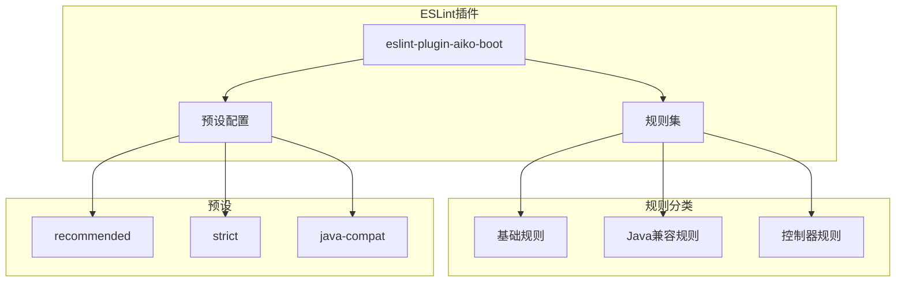

# ESLint 插件 (eslint-plugin-aiko-boot) 概述

## 简介

`@ai-partner-x/eslint-plugin-aiko-boot` 是一个 ESLint 插件，用于强制 TypeScript 代码符合 Java 兼容的编码规范。它是 Aiko Boot 框架的重要组成部分，确保 TypeScript 代码能够正确转译为 Java 代码。

## 核心目标

1. **跨语言兼容性**：确保 TypeScript 代码风格与 Java 语法兼容
2. **转译友好**：避免使用 Java 中不存在的 TypeScript 特性
3. **代码一致性**：在团队中强制统一的编码规范
4. **提前检测**：在编译前发现潜在的转译问题

## 包信息

| 属性 | 值 |
|------|------|
| 包名 | `@ai-partner-x/eslint-plugin-aiko-boot` |
| 版本 | 0.1.0 |
| 源码 | [packages/eslint-plugin-aiko-boot](file://packages/eslint-plugin-aiko-boot) |

## 架构图



## 规则列表

| 规则名 | 描述 | 默认级别 |
|--------|------|----------|
| `no-arrow-methods` | 禁止箭头函数作为类方法 | error |
| `no-destructuring-in-methods` | 禁止方法中使用解构 | error |
| `no-object-spread` | 禁止对象展开运算符 | warn |
| `static-route-paths` | 强制路由路径为静态字符串 | error |
| `require-rest-controller` | 要求使用 @RestController 装饰器 | error |
| `no-optional-chaining-in-methods` | 禁止方法中使用可选链 | error |
| `no-nullish-coalescing` | 禁止空值合并运算符 | error |
| `explicit-return-type` | 强制显式返回类型 | error |
| `no-union-types` | 禁止联合类型 | error |
| `no-inline-object-types` | 禁止内联对象类型 | error |

## 预设配置

### recommended

推荐配置，适用于大多数项目：

```javascript
{
  '@ai-partner-x/aiko-boot/no-arrow-methods': 'error',
  '@ai-partner-x/aiko-boot/no-destructuring-in-methods': 'error',
  '@ai-partner-x/aiko-boot/no-object-spread': 'warn',
  '@ai-partner-x/aiko-boot/static-route-paths': 'error',
  '@ai-partner-x/aiko-boot/require-rest-controller': 'error',
}
```

### strict

严格配置，所有规则都为 error：

```javascript
{
  '@ai-partner-x/aiko-boot/no-arrow-methods': 'error',
  '@ai-partner-x/aiko-boot/no-destructuring-in-methods': 'error',
  '@ai-partner-x/aiko-boot/no-object-spread': 'error',
  '@ai-partner-x/aiko-boot/static-route-paths': 'error',
  '@ai-partner-x/aiko-boot/require-rest-controller': 'error',
}
```

### java-compat

Java 兼容配置，启用所有 Java 转译相关规则：

```javascript
{
  '@ai-partner-x/aiko-boot/no-arrow-methods': 'error',
  '@ai-partner-x/aiko-boot/no-destructuring-in-methods': 'error',
  '@ai-partner-x/aiko-boot/no-object-spread': 'error',
  '@ai-partner-x/aiko-boot/static-route-paths': 'error',
  '@ai-partner-x/aiko-boot/require-rest-controller': 'error',
  '@ai-partner-x/aiko-boot/no-optional-chaining-in-methods': 'error',
  '@ai-partner-x/aiko-boot/no-nullish-coalescing': 'error',
  '@ai-partner-x/aiko-boot/explicit-return-type': 'error',
  '@ai-partner-x/aiko-boot/no-union-types': 'error',
  '@ai-partner-x/aiko-boot/no-inline-object-types': 'error',
}
```

## 相关文档

- [安装与配置](./安装与配置.md)
- [规则详解](./规则详解.md)
- [最佳实践](./最佳实践.md)
