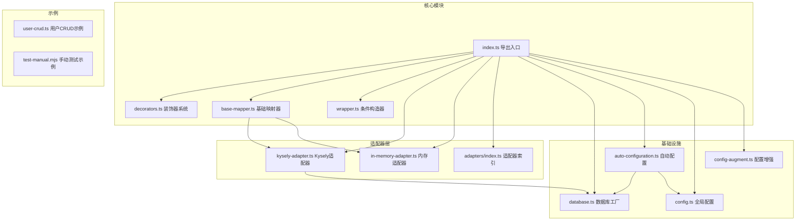
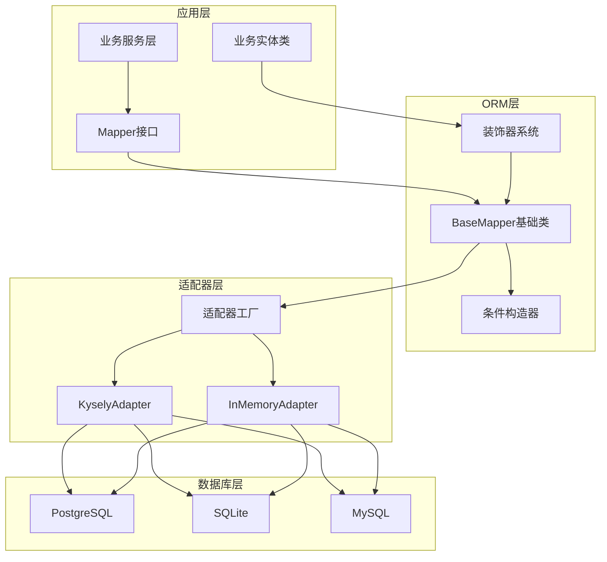
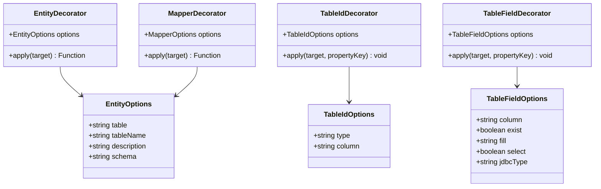
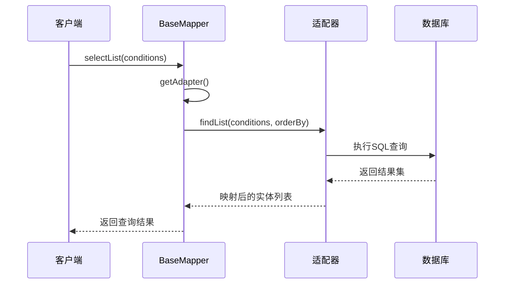
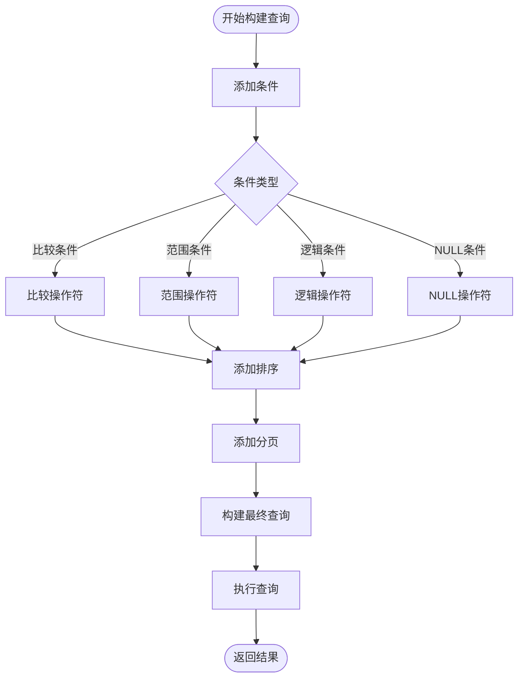
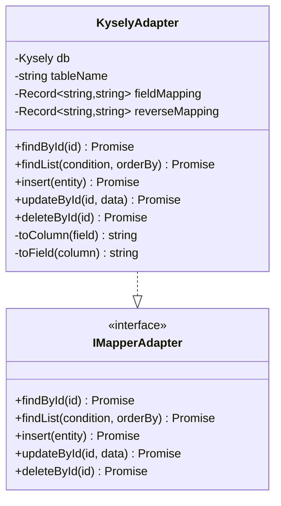
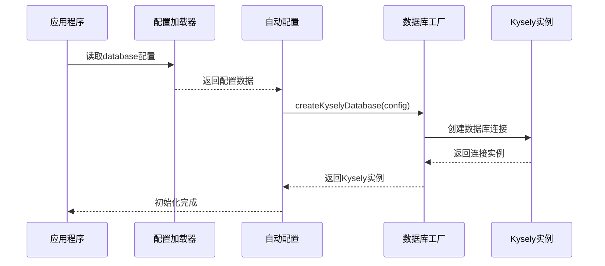
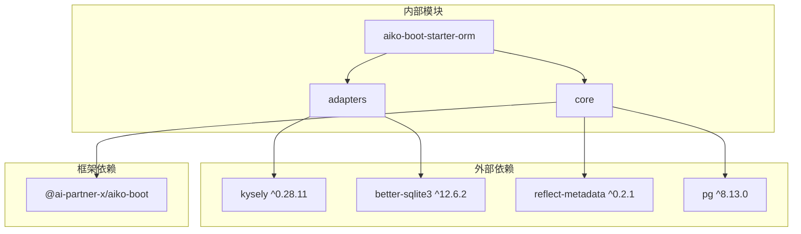

# ORM 启动器（aiko-boot-starter-orm）技术文档

<cite>
**本文档引用的文件**
- [index.ts](file://packages/aiko-boot-starter-orm/src/index.ts)
- [decorators.ts](file://packages/aiko-boot-starter-orm/src/decorators.ts)
- [base-mapper.ts](file://packages/aiko-boot-starter-orm/src/base-mapper.ts)
- [wrapper.ts](file://packages/aiko-boot-starter-orm/src/wrapper.ts)
- [auto-configuration.ts](file://packages/aiko-boot-starter-orm/src/auto-configuration.ts)
- [database.ts](file://packages/aiko-boot-starter-orm/src/database.ts)
- [config.ts](file://packages/aiko-boot-starter-orm/src/config.ts)
- [adapters/index.ts](file://packages/aiko-boot-starter-orm/src/adapters/index.ts)
- [adapters/kysely-adapter.ts](file://packages/aiko-boot-starter-orm/src/adapters/kysely-adapter.ts)
- [adapters/in-memory-adapter.ts](file://packages/aiko-boot-starter-orm/src/adapters/in-memory-adapter.ts)
- [config-augment.ts](file://packages/aiko-boot-starter-orm/src/config-augment.ts)
- [user-crud.ts](file://packages/aiko-boot-starter-orm/examples/user-crud.ts)
- [test-manual.mjs](file://packages/aiko-boot-starter-orm/examples/test-manual.mjs)
- [package.json](file://packages/aiko-boot-starter-orm/package.json)
</cite>

## 目录
1. [简介](#简介)
2. [项目结构](#项目结构)
3. [核心组件](#核心组件)
4. [架构概览](#架构概览)
5. [详细组件分析](#详细组件分析)
6. [依赖关系分析](#依赖关系分析)
7. [性能考虑](#性能考虑)
8. [故障排除指南](#故障排除指南)
9. [结论](#结论)
10. [附录](#附录)

## 简介

aiko-boot-starter-orm 是一个基于 Spring Boot 风格的 ORM 启动器，提供了与 MyBatis-Plus 兼容的 API 设计。该启动器采用装饰器驱动的实体映射系统，支持多种数据库适配器，并提供了完整的 CRUD 操作和条件查询功能。

主要特性包括：
- 装饰器驱动的实体映射系统（@Entity、@TableId、@TableField、@Mapper）
- MyBatis-Plus 风格的 BaseMapper 基础类
- 功能丰富的 QueryWrapper 条件构造器
- 多数据库支持（PostgreSQL、SQLite、MySQL）
- 自动配置和依赖注入集成

## 项目结构



**图表来源**
- [index.ts](file://packages/aiko-boot-starter-orm/src/index.ts#L1-L91)
- [adapters/index.ts](file://packages/aiko-boot-starter-orm/src/adapters/index.ts#L1-L3)

**章节来源**
- [index.ts](file://packages/aiko-boot-starter-orm/src/index.ts#L1-L91)
- [package.json](file://packages/aiko-boot-starter-orm/package.json#L1-L55)

## 核心组件

### 装饰器系统

装饰器系统是该 ORM 启动器的核心，提供了与 MyBatis-Plus 兼容的实体映射能力：

- **@Entity** - 标记实体类，支持表名、描述、Schema 等配置
- **@TableId** - 标记主键字段，支持 AUTO、INPUT、ASSIGN_ID、ASSIGN_UUID 等类型
- **@TableField** - 标记普通字段，支持列名映射、存在性判断、填充策略等
- **@Mapper** - 标记 Mapper 接口，自动注册到 DI 容器

### 基础映射器 BaseMapper

BaseMapper 提供了完整的 CRUD 操作，与 MyBatis-Plus 的 API 保持一致：

- 查询操作：selectById、selectList、selectPage、selectCount
- 插入操作：insert、insertBatch
- 更新操作：updateById、update
- 删除操作：deleteById、deleteBatchIds、delete

### 条件构造器 QueryWrapper

QueryWrapper 提供了强大的动态查询能力，支持各种比较操作符、逻辑组合和排序功能。

**章节来源**
- [decorators.ts](file://packages/aiko-boot-starter-orm/src/decorators.ts#L1-L224)
- [base-mapper.ts](file://packages/aiko-boot-starter-orm/src/base-mapper.ts#L1-L384)
- [wrapper.ts](file://packages/aiko-boot-starter-orm/src/wrapper.ts#L1-L476)

## 架构概览



**图表来源**
- [adapters/kysely-adapter.ts](file://packages/aiko-boot-starter-orm/src/adapters/kysely-adapter.ts#L1-L420)
- [adapters/in-memory-adapter.ts](file://packages/aiko-boot-starter-orm/src/adapters/in-memory-adapter.ts#L1-L174)
- [database.ts](file://packages/aiko-boot-starter-orm/src/database.ts#L1-L134)

## 详细组件分析

### 装饰器系统设计



**图表来源**
- [decorators.ts](file://packages/aiko-boot-starter-orm/src/decorators.ts#L23-L61)

装饰器系统采用反射元数据机制，通过 `reflect-metadata` 库存储实体信息。每个装饰器都有对应的选项接口，支持丰富的配置选项。

**章节来源**
- [decorators.ts](file://packages/aiko-boot-starter-orm/src/decorators.ts#L65-L193)

### BaseMapper 基础映射器

BaseMapper 提供了完整的 CRUD 操作接口，与 MyBatis-Plus 保持 API 一致性：



**图表来源**
- [base-mapper.ts](file://packages/aiko-boot-starter-orm/src/base-mapper.ts#L77-L129)

BaseMapper 通过适配器模式实现数据库无关的操作，所有具体数据库操作都委托给相应的适配器实现。

**章节来源**
- [base-mapper.ts](file://packages/aiko-boot-starter-orm/src/base-mapper.ts#L39-L352)

### 条件构造器 QueryWrapper

QueryWrapper 提供了链式的条件构建能力，支持复杂查询的动态构建：



**图表来源**
- [wrapper.ts](file://packages/aiko-boot-starter-orm/src/wrapper.ts#L49-L350)

QueryWrapper 支持丰富的操作符：比较操作符（=、!=、>、<、>=、<=）、模糊查询（LIKE、NOT LIKE）、范围查询（BETWEEN、NOT BETWEEN）、集合查询（IN、NOT IN）、NULL 判断等。

**章节来源**
- [wrapper.ts](file://packages/aiko-boot-starter-orm/src/wrapper.ts#L47-L476)

### 适配器系统

适配器系统实现了数据库操作的具体实现，当前提供了两种适配器：

#### KyselyAdapter

KyselyAdapter 基于 Kysely 查询构建器，支持 PostgreSQL、SQLite、MySQL 三种数据库：



**图表来源**
- [adapters/kysely-adapter.ts](file://packages/aiko-boot-starter-orm/src/adapters/kysely-adapter.ts#L24-L420)

#### InMemoryAdapter

InMemoryAdapter 用于测试和开发环境，提供内存中的数据存储功能。

**章节来源**
- [adapters/kysely-adapter.ts](file://packages/aiko-boot-starter-orm/src/adapters/kysely-adapter.ts#L1-L420)
- [adapters/in-memory-adapter.ts](file://packages/aiko-boot-starter-orm/src/adapters/in-memory-adapter.ts#L1-L174)

### 自动配置系统

自动配置系统基于 aiko-boot 框架，根据配置文件自动初始化数据库连接：



**图表来源**
- [auto-configuration.ts](file://packages/aiko-boot-starter-orm/src/auto-configuration.ts#L61-L134)

**章节来源**
- [auto-configuration.ts](file://packages/aiko-boot-starter-orm/src/auto-configuration.ts#L1-L135)
- [config-augment.ts](file://packages/aiko-boot-starter-orm/src/config-augment.ts#L1-L26)

## 依赖关系分析



**图表来源**
- [package.json](file://packages/aiko-boot-starter-orm/package.json#L24-L44)

该模块对外部依赖的管理采用了灵活的策略：
- Kysely 和 better-sqlite3 作为普通依赖，提供核心功能
- reflect-metadata 作为运行时元数据支持
- pg 作为可选依赖，用于 PostgreSQL 连接池

**章节来源**
- [package.json](file://packages/aiko-boot-starter-orm/package.json#L1-L55)

## 性能考虑

### 查询优化建议

1. **索引设计**：为常用查询条件字段建立适当的数据库索引
2. **分页查询**：合理使用分页避免一次性加载大量数据
3. **批量操作**：对于大量数据操作，优先使用批量插入和批量更新
4. **查询缓存**：对于频繁访问但不经常变化的数据，考虑实现查询缓存

### 内存管理

1. **适配器生命周期**：确保适配器实例正确释放，避免内存泄漏
2. **大数据处理**：对于大量数据的处理，考虑使用流式处理或分批处理
3. **连接池配置**：合理配置数据库连接池大小，避免过度占用系统资源

### 并发处理

1. **事务管理**：对于需要保证数据一致性的操作，使用适当的事务隔离级别
2. **锁机制**：对于并发写操作，考虑使用适当的锁机制防止数据竞争

## 故障排除指南

### 常见问题及解决方案

**问题1：数据库连接失败**
- 检查数据库配置是否正确
- 确认数据库服务正在运行
- 验证网络连接和防火墙设置

**问题2：实体映射错误**
- 确认装饰器使用正确
- 检查字段类型和数据库类型匹配
- 验证表名和列名映射配置

**问题3：查询结果异常**
- 检查 QueryWrapper 条件构建
- 验证排序字段是否存在
- 确认分页参数合理

**问题4：适配器初始化失败**
- 确认数据库已正确初始化
- 检查适配器工厂配置
- 验证实体元数据完整性

**章节来源**
- [adapters/kysely-adapter.ts](file://packages/aiko-boot-starter-orm/src/adapters/kysely-adapter.ts#L45-L76)
- [decorators.ts](file://packages/aiko-boot-starter-orm/src/decorators.ts#L158-L172)

## 结论

aiko-boot-starter-orm 提供了一个功能完整、设计优雅的 ORM 解决方案。其装饰器驱动的实体映射系统、与 MyBatis-Plus 兼容的 API 设计，以及灵活的适配器架构，使得开发者能够以最小的学习成本快速上手。

该启动器的主要优势包括：
- **易用性**：装饰器语法简单直观，符合 TypeScript 开发习惯
- **兼容性**：与 MyBatis-Plus API 保持高度一致
- **扩展性**：适配器模式支持轻松扩展新的数据库支持
- **类型安全**：完整的 TypeScript 类型定义提供编译时检查

未来的发展方向可以包括：
- 添加更多数据库方言支持
- 实现查询缓存机制
- 提供更丰富的查询优化工具
- 增强批量操作功能

## 附录

### 使用示例

以下是一个完整的实体定义和数据访问示例：

```typescript
// 实体定义
@Entity({ table: 'users' })
class User {
  @TableId({ type: 'AUTO' })
  id!: number
  
  @TableField({ column: 'user_name' })
  name!: string
  
  @TableField()
  email!: string
  
  @TableField({ exist: false })
  fullName?: string
}

// Mapper 定义
@Mapper({ entity: User })
class UserMapper extends BaseMapper<User> {}

// 使用示例
const userMapper = new UserMapper()
userMapper.setAdapter(new InMemoryAdapter<User>())

// 插入数据
await userMapper.insert({ name: '张三', email: 'zhangsan@example.com' })

// 查询数据
const user = await userMapper.selectById(1)
const users = await userMapper.selectList({ status: 'ACTIVE' })

// 更新数据
await userMapper.updateById({ ...user, email: 'new@email.com' })

// 删除数据
await userMapper.deleteById(1)
```

**章节来源**
- [user-crud.ts](file://packages/aiko-boot-starter-orm/examples/user-crud.ts#L1-L155)

### 配置示例

应用程序配置示例：

```json
{
  "database": {
    "type": "sqlite",
    "filename": "./data/app.db"
  }
}
```

或者 PostgreSQL 配置：

```json
{
  "database": {
    "type": "postgres",
    "host": "localhost",
    "port": 5432,
    "user": "username",
    "password": "password",
    "database": "dbname"
  }
}
```

**章节来源**
- [auto-configuration.ts](file://packages/aiko-boot-starter-orm/src/auto-configuration.ts#L7-L15)