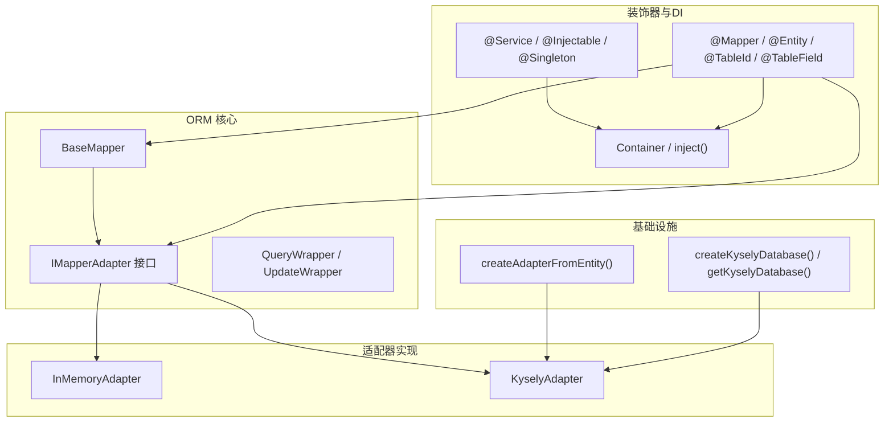
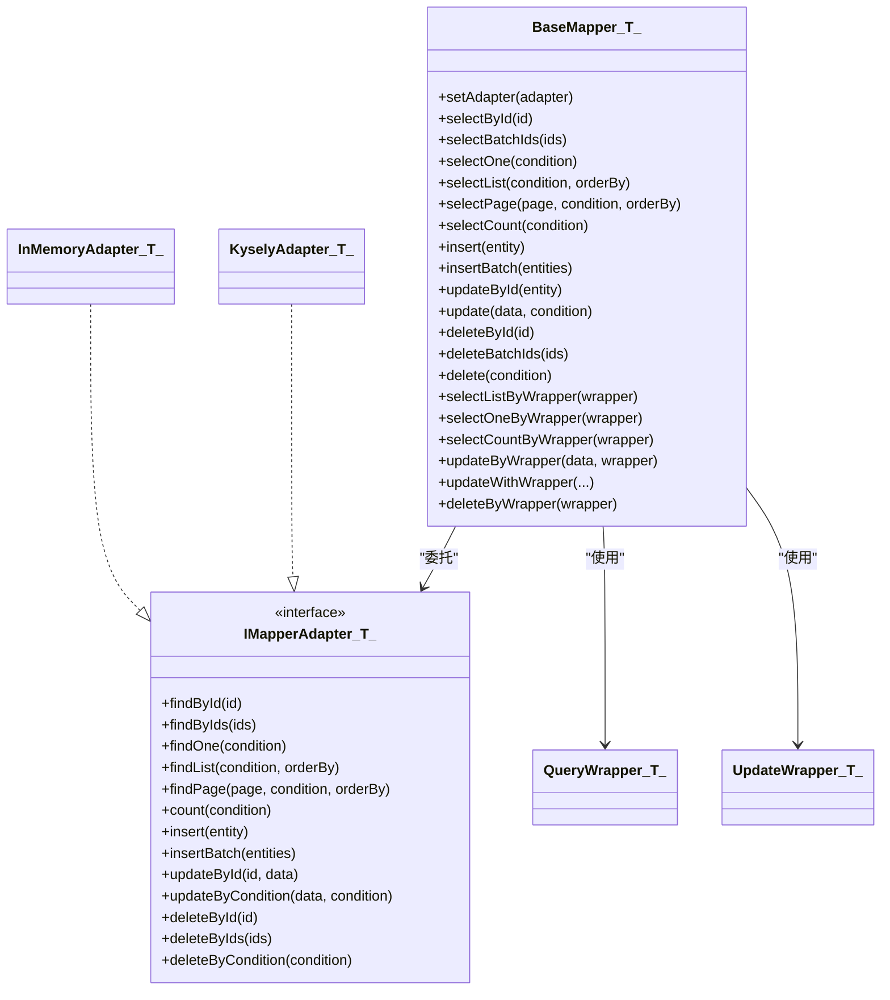
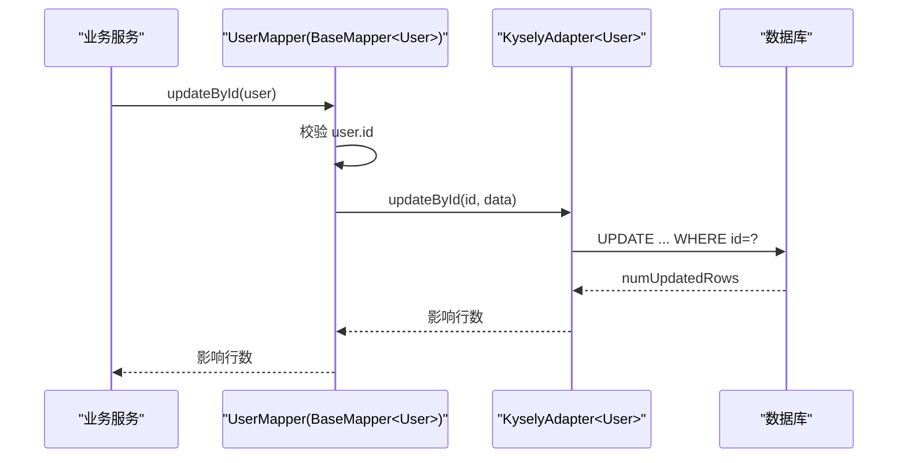
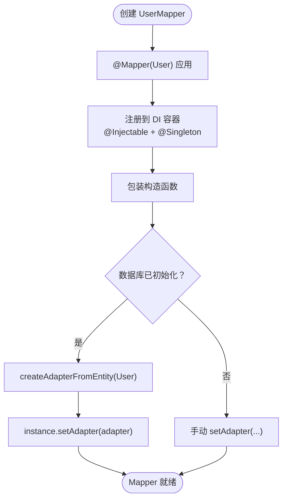
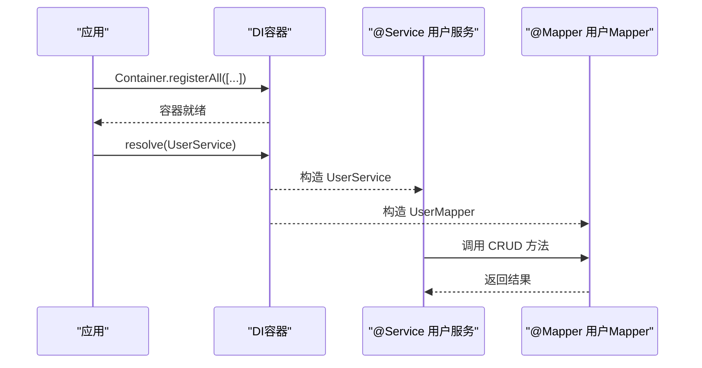
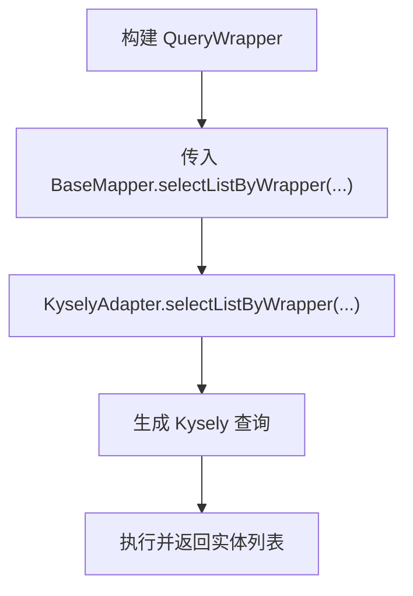
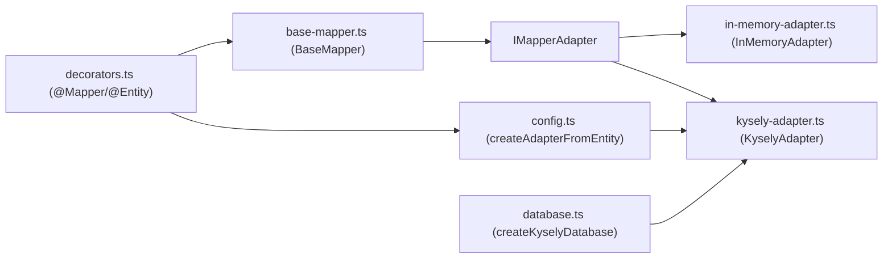

# 基础映射器

<cite>
**本文引用的文件**
- [packages/aiko-boot-starter-orm/src/base-mapper.ts](file://packages/aiko-boot-starter-orm/src/base-mapper.ts)
- [packages/aiko-boot-starter-orm/src/decorators.ts](file://packages/aiko-boot-starter-orm/src/decorators.ts)
- [packages/aiko-boot-starter-orm/src/wrapper.ts](file://packages/aiko-boot-starter-orm/src/wrapper.ts)
- [packages/aiko-boot-starter-orm/src/database.ts](file://packages/aiko-boot-starter-orm/src/database.ts)
- [packages/aiko-boot-starter-orm/src/config.ts](file://packages/aiko-boot-starter-orm/src/config.ts)
- [packages/aiko-boot-starter-orm/src/adapters/in-memory-adapter.ts](file://packages/aiko-boot-starter-orm/src/adapters/in-memory-adapter.ts)
- [packages/aiko-boot-starter-orm/src/adapters/kysely-adapter.ts](file://packages/aiko-boot-starter-orm/src/adapters/kysely-adapter.ts)
- [packages/aiko-boot-starter-orm/examples/user-crud.ts](file://packages/aiko-boot-starter-orm/examples/user-crud.ts)
- [packages/aiko-boot-starter-orm/examples/test-manual.mjs](file://packages/aiko-boot-starter-orm/examples/test-manual.mjs)
- [packages/aiko-boot/src/decorators.ts](file://packages/aiko-boot/src/decorators.ts)
- [packages/aiko-boot/src/di/container.ts](file://packages/aiko-boot/src/di/container.ts)
- [packages/aiko-boot/src/di/example.ts](file://packages/aiko-boot/src/di/example.ts)
</cite>

## 目录
1. [简介](#简介)
2. [项目结构](#项目结构)
3. [核心组件](#核心组件)
4. [架构总览](#架构总览)
5. [详细组件分析](#详细组件分析)
6. [依赖关系分析](#依赖关系分析)
7. [性能考虑](#性能考虑)
8. [故障排查指南](#故障排查指南)
9. [结论](#结论)
10. [附录](#附录)

## 简介
本技术文档围绕“基础映射器”展开，系统阐述 BaseMapper<T> 提供的通用 CRUD 能力与设计理念，涵盖：
- 泛型类型系统与类型安全的数据访问
- 继承 BaseMapper 的子类如何自动获得完整数据操作能力
- Mapper 接口定义与自定义查询方法的实现思路
- 与依赖注入系统的集成方式
- 查询包装器（QueryWrapper/UpdateWrapper）的使用
- 性能优化建议与查询缓存策略

## 项目结构
该功能位于 aiko-boot ORM 启动器模块中，核心文件如下：
- 基础映射器与适配器接口：base-mapper.ts
- 装饰器与元数据：decorators.ts
- 查询包装器：wrapper.ts
- 数据库连接工厂：database.ts
- 适配器工厂与配置：config.ts
- 适配器实现：in-memory-adapter.ts、kysely-adapter.ts
- 示例：examples/user-crud.ts、examples/test-manual.mjs
- 依赖注入与服务层装饰器：packages/aiko-boot/src/decorators.ts、packages/aiko-boot/src/di/container.ts、packages/aiko-boot/src/di/example.ts

图表来源
- [packages/aiko-boot-starter-orm/src/base-mapper.ts](file://packages/aiko-boot-starter-orm/src/base-mapper.ts#L55-L384)
- [packages/aiko-boot-starter-orm/src/decorators.ts](file://packages/aiko-boot-starter-orm/src/decorators.ts#L140-L193)
- [packages/aiko-boot-starter-orm/src/wrapper.ts](file://packages/aiko-boot-starter-orm/src/wrapper.ts#L49-L476)
- [packages/aiko-boot-starter-orm/src/database.ts](file://packages/aiko-boot-starter-orm/src/database.ts#L47-L134)
- [packages/aiko-boot-starter-orm/src/config.ts](file://packages/aiko-boot-starter-orm/src/config.ts#L42-L76)
- [packages/aiko-boot-starter-orm/src/adapters/in-memory-adapter.ts](file://packages/aiko-boot-starter-orm/src/adapters/in-memory-adapter.ts#L9-L174)
- [packages/aiko-boot-starter-orm/src/adapters/kysely-adapter.ts](file://packages/aiko-boot-starter-orm/src/adapters/kysely-adapter.ts#L24-L420)
- [packages/aiko-boot/src/decorators.ts](file://packages/aiko-boot/src/decorators.ts#L81-L118)
- [packages/aiko-boot/src/di/container.ts](file://packages/aiko-boot/src/di/container.ts#L22-L46)

章节来源
- [packages/aiko-boot-starter-orm/src/base-mapper.ts](file://packages/aiko-boot-starter-orm/src/base-mapper.ts#L1-L384)
- [packages/aiko-boot-starter-orm/src/decorators.ts](file://packages/aiko-boot-starter-orm/src/decorators.ts#L1-L224)
- [packages/aiko-boot-starter-orm/src/wrapper.ts](file://packages/aiko-boot-starter-orm/src/wrapper.ts#L1-L476)
- [packages/aiko-boot-starter-orm/src/database.ts](file://packages/aiko-boot-starter-orm/src/database.ts#L1-L134)
- [packages/aiko-boot-starter-orm/src/config.ts](file://packages/aiko-boot-starter-orm/src/config.ts#L1-L77)
- [packages/aiko-boot-starter-orm/src/adapters/in-memory-adapter.ts](file://packages/aiko-boot-starter-orm/src/adapters/in-memory-adapter.ts#L1-L174)
- [packages/aiko-boot-starter-orm/src/adapters/kysely-adapter.ts](file://packages/aiko-boot-starter-orm/src/adapters/kysely-adapter.ts#L1-L420)
- [packages/aiko-boot/src/decorators.ts](file://packages/aiko-boot/src/decorators.ts#L1-L118)
- [packages/aiko-boot/src/di/container.ts](file://packages/aiko-boot/src/di/container.ts#L1-L46)

## 核心组件
- BaseMapper<T>：提供标准 CRUD 与分页、统计、Wrapper 查询等能力，通过适配器模式解耦具体数据库实现。
- IMapperAdapter<T>：适配器接口，定义统一的数据库操作契约。
- QueryWrapper<T> / UpdateWrapper<T>：与 MyBatis-Plus 兼容的条件构造器，支持链式构建查询/更新条件。
- InMemoryAdapter<T>：内存适配器，用于测试与演示。
- KyselyAdapter<T>：基于 Kysely 的数据库适配器，支持 PostgreSQL、SQLite、MySQL。
- 装饰器系统：@Mapper、@Entity、@TableId、@TableField 等，负责实体与 Mapper 的元数据标注与 DI 注册。
- 依赖注入：@Service、@Injectable、@Singleton 以及 Container，用于服务层与 Mapper 的注入。

章节来源
- [packages/aiko-boot-starter-orm/src/base-mapper.ts](file://packages/aiko-boot-starter-orm/src/base-mapper.ts#L55-L384)
- [packages/aiko-boot-starter-orm/src/wrapper.ts](file://packages/aiko-boot-starter-orm/src/wrapper.ts#L49-L476)
- [packages/aiko-boot-starter-orm/src/adapters/in-memory-adapter.ts](file://packages/aiko-boot-starter-orm/src/adapters/in-memory-adapter.ts#L9-L174)
- [packages/aiko-boot-starter-orm/src/adapters/kysely-adapter.ts](file://packages/aiko-boot-starter-orm/src/adapters/kysely-adapter.ts#L24-L420)
- [packages/aiko-boot-starter-orm/src/decorators.ts](file://packages/aiko-boot-starter-orm/src/decorators.ts#L140-L193)
- [packages/aiko-boot/src/decorators.ts](file://packages/aiko-boot/src/decorators.ts#L81-L118)
- [packages/aiko-boot/src/di/container.ts](file://packages/aiko-boot/src/di/container.ts#L22-L46)

## 架构总览
BaseMapper 作为抽象基类，将业务层与数据库实现解耦。业务侧通过继承 BaseMapper<T> 获得类型安全的 CRUD 能力；运行时由适配器执行具体数据库操作。装饰器负责将实体与 Mapper 注册到 DI 容器，并在数据库初始化后自动装配适配器。

图表来源
- [packages/aiko-boot-starter-orm/src/base-mapper.ts](file://packages/aiko-boot-starter-orm/src/base-mapper.ts#L55-L384)
- [packages/aiko-boot-starter-orm/src/adapters/in-memory-adapter.ts](file://packages/aiko-boot-starter-orm/src/adapters/in-memory-adapter.ts#L9-L174)
- [packages/aiko-boot-starter-orm/src/adapters/kysely-adapter.ts](file://packages/aiko-boot-starter-orm/src/adapters/kysely-adapter.ts#L24-L420)
- [packages/aiko-boot-starter-orm/src/wrapper.ts](file://packages/aiko-boot-starter-orm/src/wrapper.ts#L49-L476)

## 详细组件分析

### BaseMapper<T> 设计与 CRUD 实现
- 泛型约束：T 至少包含可选 id 字段，确保更新/删除等操作具备主键依据。
- 适配器持有与获取：通过 setAdapter 注入，getAdapter 提供默认校验，避免未初始化错误。
- 查询族：selectById、selectBatchIds、selectOne、selectList、selectPage、selectCount，均委托给适配器。
- 插入族：insert、insertBatch，返回影响行数，遵循 MyBatis-Plus 语义。
- 更新族：updateById（要求实体含 id）、update（按条件更新），返回影响行数。
- 删除族：deleteById、deleteBatchIds、delete（按条件删除），返回影响行数。
- Wrapper 查询族：selectListByWrapper、selectOneByWrapper、selectCountByWrapper、updateByWrapper、updateWithWrapper、deleteByWrapper。若适配器不支持，则提供回退或抛错策略，保证向后兼容。

图表来源
- [packages/aiko-boot-starter-orm/src/base-mapper.ts](file://packages/aiko-boot-starter-orm/src/base-mapper.ts#L161-L166)
- [packages/aiko-boot-starter-orm/src/adapters/kysely-adapter.ts](file://packages/aiko-boot-starter-orm/src/adapters/kysely-adapter.ts#L356-L367)

章节来源
- [packages/aiko-boot-starter-orm/src/base-mapper.ts](file://packages/aiko-boot-starter-orm/src/base-mapper.ts#L55-L205)
- [packages/aiko-boot-starter-orm/src/adapters/kysely-adapter.ts](file://packages/aiko-boot-starter-orm/src/adapters/kysely-adapter.ts#L356-L367)

### 泛型类型系统与类型安全
- BaseMapper<T> 将实体类型信息带入映射器，使 insert/update/delete/select 等方法在编译期即可约束参数与返回值。
- Wrapper 类型安全：QueryWrapper<T>/UpdateWrapper<T> 的列名与排序方向均基于实体属性键，避免硬编码字符串导致的错误。
- 字段映射：KyselyAdapter 通过 fieldMapping 将 TypeScript 字段名映射到数据库列名，保持类型安全的同时支持命名差异。

章节来源
- [packages/aiko-boot-starter-orm/src/base-mapper.ts](file://packages/aiko-boot-starter-orm/src/base-mapper.ts#L55-L384)
- [packages/aiko-boot-starter-orm/src/wrapper.ts](file://packages/aiko-boot-starter-orm/src/wrapper.ts#L49-L476)
- [packages/aiko-boot-starter-orm/src/adapters/kysely-adapter.ts](file://packages/aiko-boot-starter-orm/src/adapters/kysely-adapter.ts#L41-L65)

### 继承 BaseMapper 的子类如何自动获得能力
- 子类只需继承 BaseMapper<T> 并通过 @Mapper 装饰器标注关联实体，即可获得完整的 CRUD 与 Wrapper 查询能力。
- @Mapper 装饰器会：
  - 将 Mapper 类注册到 DI 容器（@Injectable + @Singleton）
  - 自动注入构造函数依赖
  - 在数据库初始化后尝试通过 createAdapterFromEntity 自动设置适配器

图表来源
- [packages/aiko-boot-starter-orm/src/decorators.ts](file://packages/aiko-boot-starter-orm/src/decorators.ts#L140-L193)
- [packages/aiko-boot-starter-orm/src/config.ts](file://packages/aiko-boot-starter-orm/src/config.ts#L42-L76)

章节来源
- [packages/aiko-boot-starter-orm/src/decorators.ts](file://packages/aiko-boot-starter-orm/src/decorators.ts#L140-L193)
- [packages/aiko-boot-starter-orm/src/config.ts](file://packages/aiko-boot-starter-orm/src/config.ts#L42-L76)

### Mapper 接口定义与自定义查询
- 基础接口：BaseMapper<T> 已提供完整 CRUD 与分页统计能力。
- 自定义查询：可在子类中扩展方法，例如：
  - 基于 Wrapper 的复杂查询：selectListByWrapper、selectCountByWrapper
  - 条件更新/删除：updateByWrapper、deleteByWrapper
  - 组合查询：结合多个条件与排序进行分页查询
- 示例参考：examples/user-crud.ts 展示了 insert、select、page、count、update、delete 的完整流程。

章节来源
- [packages/aiko-boot-starter-orm/src/base-mapper.ts](file://packages/aiko-boot-starter-orm/src/base-mapper.ts#L207-L351)
- [packages/aiko-boot-starter-orm/examples/user-crud.ts](file://packages/aiko-boot-starter-orm/examples/user-crud.ts#L70-L155)

### 与依赖注入系统的集成
- 服务层：@Service 装饰器自动注册到 DI 容器，支持构造函数注入与 @Autowired 属性注入。
- Mapper 层：@Mapper 装饰器自动注册为单例，构造函数参数类型会被自动注入。
- 容器：Container.registerAll/resolve 提供显式注册与解析能力。
- 使用示例：packages/aiko-boot/src/di/example.ts 展示了 @Injectable、@Singleton、@Inject 的用法。

图表来源
- [packages/aiko-boot/src/decorators.ts](file://packages/aiko-boot/src/decorators.ts#L81-L118)
- [packages/aiko-boot/src/di/container.ts](file://packages/aiko-boot/src/di/container.ts#L22-L46)
- [packages/aiko-boot/src/di/example.ts](file://packages/aiko-boot/src/di/example.ts#L50-L68)

章节来源
- [packages/aiko-boot/src/decorators.ts](file://packages/aiko-boot/src/decorators.ts#L81-L118)
- [packages/aiko-boot/src/di/container.ts](file://packages/aiko-boot/src/di/container.ts#L22-L46)
- [packages/aiko-boot/src/di/example.ts](file://packages/aiko-boot/src/di/example.ts#L1-L68)

### 查询包装器（Wrapper）使用
- QueryWrapper<T>：eq/ne/gt/ge/lt/le/like/notLike/likeLeft/likeRight/between/notBetween/in/notIn/isNull/isNotNull/or/and/orderBy/limit/offset/page/select/groupBy 等。
- UpdateWrapper<T>：在 QueryWrapper 基础上增加 set/setIf/setIncr/setDecr/setNull 等更新字段设置。
- Wrapper 查询族：BaseMapper 提供 selectListByWrapper、selectOneByWrapper、selectCountByWrapper、updateByWrapper、updateWithWrapper、deleteByWrapper，适配器需实现对应方法以启用完整功能。

图表来源
- [packages/aiko-boot-starter-orm/src/wrapper.ts](file://packages/aiko-boot-starter-orm/src/wrapper.ts#L49-L350)
- [packages/aiko-boot-starter-orm/src/base-mapper.ts](file://packages/aiko-boot-starter-orm/src/base-mapper.ts#L222-L230)
- [packages/aiko-boot-starter-orm/src/adapters/kysely-adapter.ts](file://packages/aiko-boot-starter-orm/src/adapters/kysely-adapter.ts#L177-L200)

章节来源
- [packages/aiko-boot-starter-orm/src/wrapper.ts](file://packages/aiko-boot-starter-orm/src/wrapper.ts#L49-L476)
- [packages/aiko-boot-starter-orm/src/base-mapper.ts](file://packages/aiko-boot-starter-orm/src/base-mapper.ts#L207-L351)
- [packages/aiko-boot-starter-orm/src/adapters/kysely-adapter.ts](file://packages/aiko-boot-starter-orm/src/adapters/kysely-adapter.ts#L177-L244)

### 示例与用法
- 手动示例：examples/test-manual.mjs 展示了不使用装饰器语法时的实体与 Mapper 定义、适配器设置与 CRUD 流程。
- 装饰器示例：examples/user-crud.ts 展示了 @Entity、@TableId、@TableField、@Mapper 的组合使用，以及完整的 CRUD 与分页统计示例。

章节来源
- [packages/aiko-boot-starter-orm/examples/test-manual.mjs](file://packages/aiko-boot-starter-orm/examples/test-manual.mjs#L1-L87)
- [packages/aiko-boot-starter-orm/examples/user-crud.ts](file://packages/aiko-boot-starter-orm/examples/user-crud.ts#L1-L155)

## 依赖关系分析
- BaseMapper 依赖 IMapperAdapter<T> 接口，通过组合实现与数据库的解耦。
- 装饰器系统依赖 reflect-metadata 与 @ai-partner-x/aiko-boot 的 DI 能力，实现自动注册与依赖注入。
- KyselyAdapter 依赖 Kysely 数据库实例，通过 createKyselyDatabase/getKyselyDatabase 管理连接。
- createAdapterFromEntity 从实体元数据推导表名与字段映射，自动创建适配器。

图表来源
- [packages/aiko-boot-starter-orm/src/decorators.ts](file://packages/aiko-boot-starter-orm/src/decorators.ts#L140-L193)
- [packages/aiko-boot-starter-orm/src/config.ts](file://packages/aiko-boot-starter-orm/src/config.ts#L42-L76)
- [packages/aiko-boot-starter-orm/src/adapters/kysely-adapter.ts](file://packages/aiko-boot-starter-orm/src/adapters/kysely-adapter.ts#L24-L420)
- [packages/aiko-boot-starter-orm/src/base-mapper.ts](file://packages/aiko-boot-starter-orm/src/base-mapper.ts#L55-L384)
- [packages/aiko-boot-starter-orm/src/adapters/in-memory-adapter.ts](file://packages/aiko-boot-starter-orm/src/adapters/in-memory-adapter.ts#L9-L174)
- [packages/aiko-boot-starter-orm/src/database.ts](file://packages/aiko-boot-starter-orm/src/database.ts#L47-L134)

章节来源
- [packages/aiko-boot-starter-orm/src/decorators.ts](file://packages/aiko-boot-starter-orm/src/decorators.ts#L140-L193)
- [packages/aiko-boot-starter-orm/src/config.ts](file://packages/aiko-boot-starter-orm/src/config.ts#L42-L76)
- [packages/aiko-boot-starter-orm/src/adapters/kysely-adapter.ts](file://packages/aiko-boot-starter-orm/src/adapters/kysely-adapter.ts#L24-L420)
- [packages/aiko-boot-starter-orm/src/base-mapper.ts](file://packages/aiko-boot-starter-orm/src/base-mapper.ts#L55-L384)
- [packages/aiko-boot-starter-orm/src/adapters/in-memory-adapter.ts](file://packages/aiko-boot-starter-orm/src/adapters/in-memory-adapter.ts#L9-L174)
- [packages/aiko-boot-starter-orm/src/database.ts](file://packages/aiko-boot-starter-orm/src/database.ts#L47-L134)

## 性能考虑
- 适配器选择
  - InMemoryAdapter 适合单元测试与演示，不适用于生产。
  - KyselyAdapter 支持多数据库，具备良好的 SQL 生成与并发能力。
- 查询优化
  - 使用 Wrapper 的 orderBy、limit/offset/page 精准控制分页，避免一次性加载全量数据。
  - 合理使用 select(columns) 限制字段，减少网络与序列化开销。
  - 使用 in/notIn/between 等复合条件减少多次往返。
- 并发与事务
  - 通过 @Service 与 DI 容器管理服务生命周期，配合数据库事务注解（如存在）实现 ACID。
- 缓存策略
  - 读多写少场景：对热点查询结果进行缓存（如 Redis），注意缓存失效策略与一致性。
  - 分页查询：对高频分页参数组合建立二级缓存，结合版本号或时间戳。
  - 字段映射缓存：KyselyAdapter 的字段映射可复用，避免重复计算。
- 批处理
  - insertBatch 与 deleteBatchIds 减少网络往返，提升吞吐。
- 日志与监控
  - 记录慢查询与异常，结合数据库性能分析工具定位瓶颈。

## 故障排查指南
- 适配器未设置
  - 现象：调用 CRUD 方法抛出“适配器未设置”错误。
  - 处理：确保 @Mapper 装饰器在数据库初始化后生效，或手动调用 setAdapter。
- 数据库未初始化
  - 现象：createAdapterFromEntity 抛出“数据库未初始化”错误。
  - 处理：先调用 createKyselyDatabase 初始化数据库再创建适配器。
- Wrapper 功能不可用
  - 现象：使用 selectListByWrapper 等方法时回退或报错。
  - 处理：确认适配器实现对应方法（如 selectListByWrapper），否则使用普通查询替代。
- 主键缺失
  - 现象：updateById 抛出“实体必须包含 id”错误。
  - 处理：确保实体对象包含 id 字段后再调用。
- 字段映射不一致
  - 现象：查询结果字段为空或错误。
  - 处理：检查 @TableField/@TableId 的 column 映射，确保与数据库一致。

章节来源
- [packages/aiko-boot-starter-orm/src/base-mapper.ts](file://packages/aiko-boot-starter-orm/src/base-mapper.ts#L68-L73)
- [packages/aiko-boot-starter-orm/src/config.ts](file://packages/aiko-boot-starter-orm/src/config.ts#L45-L47)
- [packages/aiko-boot-starter-orm/src/base-mapper.ts](file://packages/aiko-boot-starter-orm/src/base-mapper.ts#L222-L230)
- [packages/aiko-boot-starter-orm/src/base-mapper.ts](file://packages/aiko-boot-starter-orm/src/base-mapper.ts#L162-L164)
- [packages/aiko-boot-starter-orm/src/adapters/kysely-adapter.ts](file://packages/aiko-boot-starter-orm/src/adapters/kysely-adapter.ts#L41-L65)

## 结论
BaseMapper<T> 通过适配器模式与装饰器体系，为业务层提供了类型安全、可扩展、与 MyBatis-Plus 风格一致的通用 CRUD 能力。结合 KyselyAdapter 的高性能数据库访问与 DI 容器的依赖注入机制，开发者可以快速构建稳定可靠的持久化层。配合 Wrapper 查询与合理的缓存策略，可在保证开发效率的同时兼顾性能与可维护性。

## 附录
- 示例入口
  - 手动示例：packages/aiko-boot-starter-orm/examples/test-manual.mjs
  - 装饰器示例：packages/aiko-boot-starter-orm/examples/user-crud.ts
- 依赖注入示例：packages/aiko-boot/src/di/example.ts
- 数据库初始化：packages/aiko-boot-starter-orm/src/database.ts