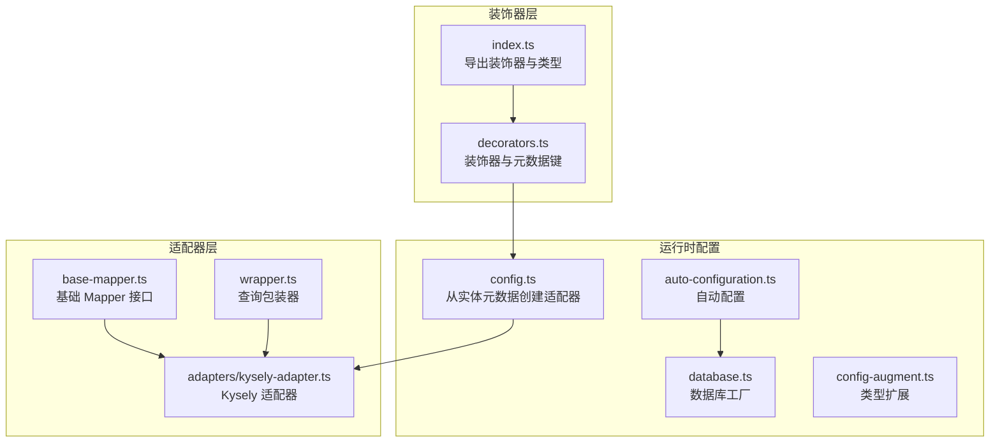
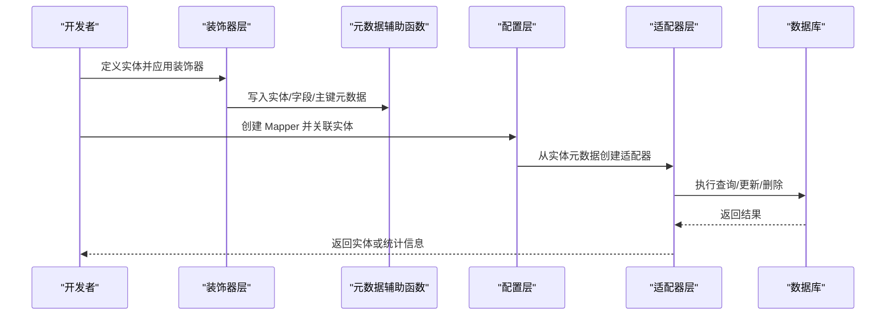
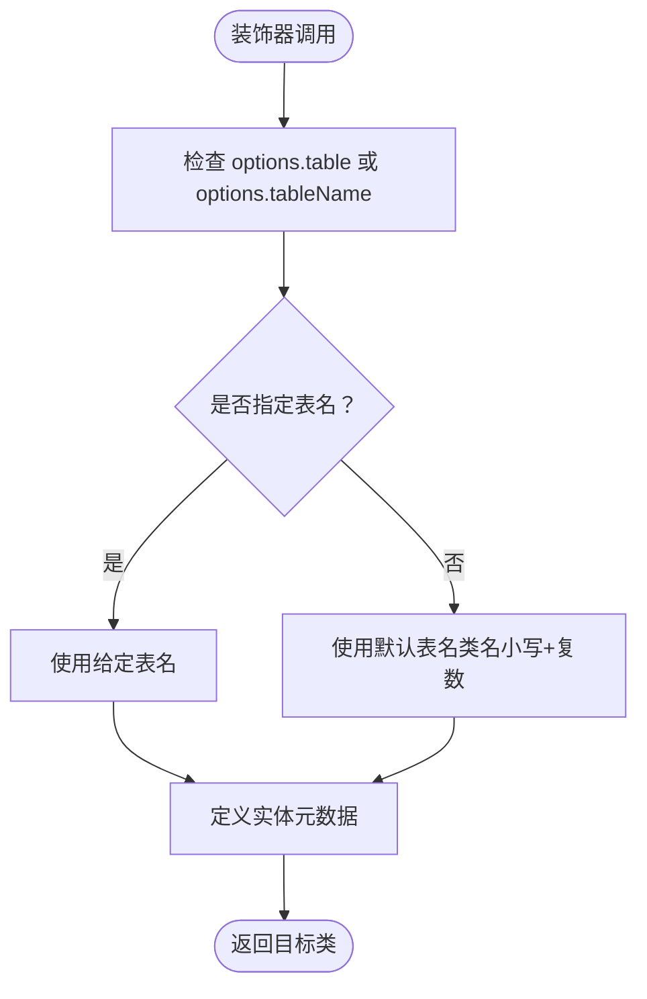
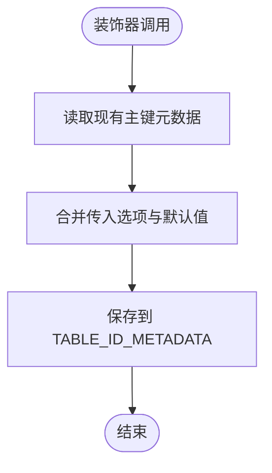
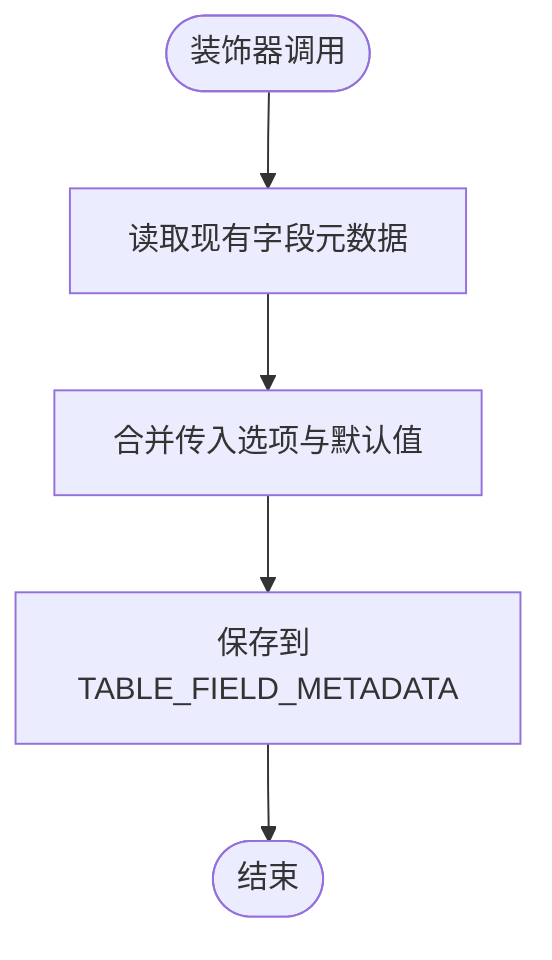
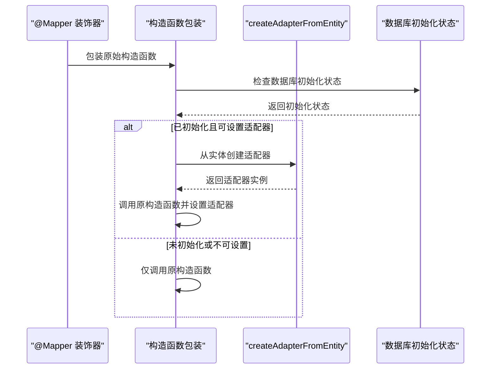
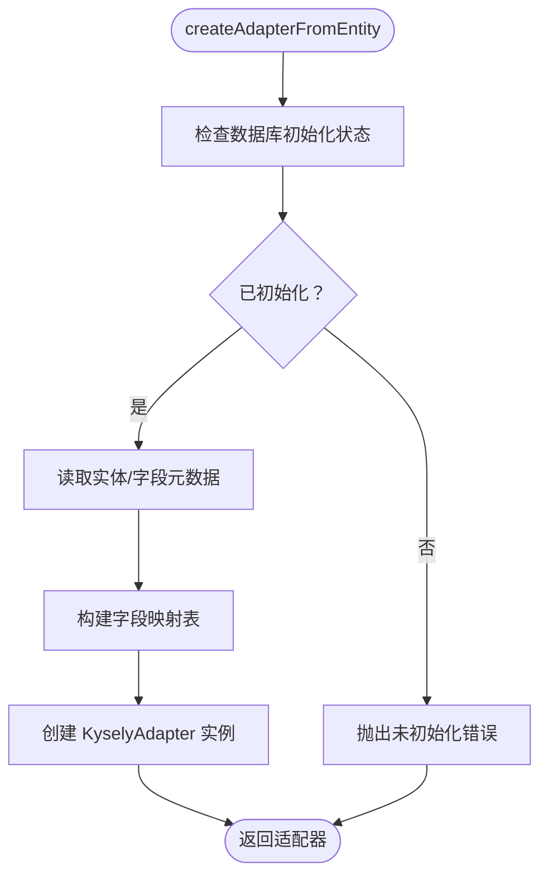
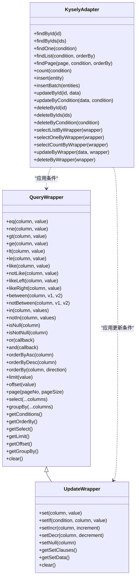
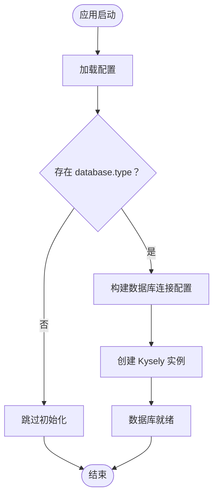
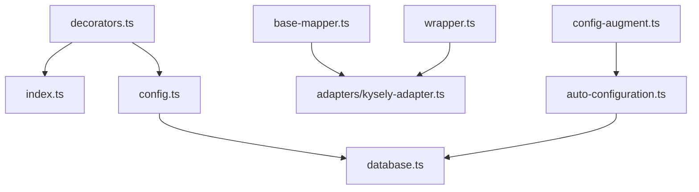

# 实体装饰器系统

<cite>
**本文档引用的文件**
- [packages/aiko-boot-starter-orm/src/decorators.ts](file://packages/aiko-boot-starter-orm/src/decorators.ts)
- [packages/aiko-boot-starter-orm/src/config.ts](file://packages/aiko-boot-starter-orm/src/config.ts)
- [packages/aiko-boot-starter-orm/src/base-mapper.ts](file://packages/aiko-boot-starter-orm/src/base-mapper.ts)
- [packages/aiko-boot-starter-orm/src/adapters/kysely-adapter.ts](file://packages/aiko-boot-starter-orm/src/adapters/kysely-adapter.ts)
- [packages/aiko-boot-starter-orm/src/wrapper.ts](file://packages/aiko-boot-starter-orm/src/wrapper.ts)
- [packages/aiko-boot-starter-orm/src/database.ts](file://packages/aiko-boot-starter-orm/src/database.ts)
- [packages/aiko-boot-starter-orm/src/auto-configuration.ts](file://packages/aiko-boot-starter-orm/src/auto-configuration.ts)
- [packages/aiko-boot-starter-orm/src/config-augment.ts](file://packages/aiko-boot-starter-orm/src/config-augment.ts)
- [packages/aiko-boot-starter-orm/src/index.ts](file://packages/aiko-boot-starter-orm/src/index.ts)
- [packages/aiko-boot-starter-orm/examples/test-manual.mjs](file://packages/aiko-boot-starter-orm/examples/test-manual.mjs)
- [packages/aiko-boot-codegen/src/builtin-plugins.ts](file://packages/aiko-boot-codegen/src/builtin-plugins.ts)
- [packages/aiko-boot-codegen/src/generator.ts](file://packages/aiko-boot-codegen/src/generator.ts)
</cite>

## 目录
1. [简介](#简介)
2. [项目结构](#项目结构)
3. [核心组件](#核心组件)
4. [架构概览](#架构概览)
5. [详细组件分析](#详细组件分析)
6. [依赖分析](#依赖分析)
7. [性能考虑](#性能考虑)
8. [故障排除指南](#故障排除指南)
9. [结论](#结论)
10. [附录](#附录)

## 简介
本文件为实体装饰器系统的详细技术文档，深入解析 @Entity、@TableName、@TableId、@TableField、@Column、@Mapper 等装饰器的实现原理与使用方法。文档涵盖以下关键内容：
- 每个装饰器的参数选项与配置项，包括 EntityOptions、TableIdOptions、TableFieldOptions、MapperOptions 接口的完整定义
- 装饰器如何利用 reflect-metadata 在运行时收集实体元数据，包括表名映射、主键配置、字段属性等
- 完整的实体定义示例，展示如何使用装饰器标记实体类、主键字段和普通字段
- 装饰器的继承关系与别名装饰器的使用
- 装饰器的最佳实践与常见错误处理

## 项目结构
该系统位于 aiko-boot-starter-orm 包中，围绕装饰器、适配器、查询包装器与自动配置展开。核心文件包括装饰器定义、元数据辅助函数、适配器实现、查询包装器、数据库工厂与自动配置。

**图表来源**
- [packages/aiko-boot-starter-orm/src/decorators.ts](file://packages/aiko-boot-starter-orm/src/decorators.ts#L1-L224)
- [packages/aiko-boot-starter-orm/src/config.ts](file://packages/aiko-boot-starter-orm/src/config.ts#L1-L77)
- [packages/aiko-boot-starter-orm/src/base-mapper.ts](file://packages/aiko-boot-starter-orm/src/base-mapper.ts#L1-L384)
- [packages/aiko-boot-starter-orm/src/adapters/kysely-adapter.ts](file://packages/aiko-boot-starter-orm/src/adapters/kysely-adapter.ts#L1-L420)
- [packages/aiko-boot-starter-orm/src/wrapper.ts](file://packages/aiko-boot-starter-orm/src/wrapper.ts#L1-L476)
- [packages/aiko-boot-starter-orm/src/database.ts](file://packages/aiko-boot-starter-orm/src/database.ts#L1-L134)
- [packages/aiko-boot-starter-orm/src/auto-configuration.ts](file://packages/aiko-boot-starter-orm/src/auto-configuration.ts#L1-L135)
- [packages/aiko-boot-starter-orm/src/config-augment.ts](file://packages/aiko-boot-starter-orm/src/config-augment.ts#L1-L26)
- [packages/aiko-boot-starter-orm/src/index.ts](file://packages/aiko-boot-starter-orm/src/index.ts#L1-L91)

**章节来源**
- [packages/aiko-boot-starter-orm/src/index.ts](file://packages/aiko-boot-starter-orm/src/index.ts#L1-L91)

## 核心组件
本系统的核心由以下组件构成：
- 装饰器层：提供 @Entity、@TableName、@TableId、@TableField、@Column、@Mapper 等装饰器，并定义相应的选项接口
- 元数据辅助函数：提供获取实体、主键、字段与 Mapper 元数据的方法
- 适配器层：实现 IMapperAdapter 接口，将 MyBatis-Plus 风格的查询转换为具体数据库方言的查询
- 查询包装器：提供 QueryWrapper、UpdateWrapper 等，支持链式条件构造
- 数据库工厂与自动配置：负责数据库连接的创建、管理和生命周期控制

**章节来源**
- [packages/aiko-boot-starter-orm/src/decorators.ts](file://packages/aiko-boot-starter-orm/src/decorators.ts#L1-L224)
- [packages/aiko-boot-starter-orm/src/base-mapper.ts](file://packages/aiko-boot-starter-orm/src/base-mapper.ts#L1-L384)
- [packages/aiko-boot-starter-orm/src/adapters/kysely-adapter.ts](file://packages/aiko-boot-starter-orm/src/adapters/kysely-adapter.ts#L1-L420)
- [packages/aiko-boot-starter-orm/src/wrapper.ts](file://packages/aiko-boot-starter-orm/src/wrapper.ts#L1-L476)
- [packages/aiko-boot-starter-orm/src/config.ts](file://packages/aiko-boot-starter-orm/src/config.ts#L1-L77)
- [packages/aiko-boot-starter-orm/src/database.ts](file://packages/aiko-boot-starter-orm/src/database.ts#L1-L134)
- [packages/aiko-boot-starter-orm/src/auto-configuration.ts](file://packages/aiko-boot-starter-orm/src/auto-configuration.ts#L1-L135)

## 架构概览
装饰器系统通过 reflect-metadata 在编译期或运行期收集实体元数据，随后由适配器层将这些元数据转换为具体的数据库操作。自动配置模块根据应用配置自动初始化数据库连接，确保装饰器在运行时可用。

**图表来源**
- [packages/aiko-boot-starter-orm/src/decorators.ts](file://packages/aiko-boot-starter-orm/src/decorators.ts#L68-L193)
- [packages/aiko-boot-starter-orm/src/config.ts](file://packages/aiko-boot-starter-orm/src/config.ts#L42-L76)
- [packages/aiko-boot-starter-orm/src/adapters/kysely-adapter.ts](file://packages/aiko-boot-starter-orm/src/adapters/kysely-adapter.ts#L24-L420)

## 详细组件分析

### 装饰器与元数据接口
- 装饰器层提供以下装饰器：
  - @Entity：标记实体类，支持表名、描述、Schema 等配置
  - @TableName：@Entity 的别名
  - @TableId：标记主键字段，支持主键类型与列名配置
  - @TableField：标记普通字段，支持列名、存在性、填充策略、大字段选择、JDBC 类型等配置
  - @Column：@TableField 的别名
  - @Mapper：标记 Mapper 类，自动注入依赖并设置适配器

- 元数据键：
  - ENTITY_METADATA：存储实体元数据
  - TABLE_ID_METADATA：存储主键字段元数据
  - TABLE_FIELD_METADATA：存储普通字段元数据
  - MAPPER_METADATA：存储 Mapper 元数据

- 元数据辅助函数：
  - getEntityMetadata：获取实体元数据
  - getTableIdMetadata：获取主键字段元数据
  - getTableFieldMetadata：获取字段元数据
  - getMapperMetadata：获取 Mapper 元数据

**章节来源**
- [packages/aiko-boot-starter-orm/src/decorators.ts](file://packages/aiko-boot-starter-orm/src/decorators.ts#L14-L224)

### 装饰器实现原理与使用方法

#### @Entity 与 @TableName
- 功能：标记实体类，决定表名与描述等元数据
- 参数选项（EntityOptions）：
  - table?: string：显式指定表名
  - tableName?: string：表名别名
  - description?: string：实体描述
  - schema?: string：Schema 名称
- 默认行为：若未指定表名，将使用类名小写加复数形式作为默认表名
- 别名：@TableName 与 @Entity 等价

**图表来源**
- [packages/aiko-boot-starter-orm/src/decorators.ts](file://packages/aiko-boot-starter-orm/src/decorators.ts#L68-L80)

**章节来源**
- [packages/aiko-boot-starter-orm/src/decorators.ts](file://packages/aiko-boot-starter-orm/src/decorators.ts#L23-L85)

#### @TableId
- 功能：标记实体的主键字段
- 参数选项（TableIdOptions）：
  - type?: 'AUTO' | 'INPUT' | 'ASSIGN_ID' | 'ASSIGN_UUID'：主键生成策略，默认 AUTO
  - column?: string：数据库列名
- 默认行为：未指定列名时，使用字段名；未指定类型时，默认 AUTO

**图表来源**
- [packages/aiko-boot-starter-orm/src/decorators.ts](file://packages/aiko-boot-starter-orm/src/decorators.ts#L92-L105)

**章节来源**
- [packages/aiko-boot-starter-orm/src/decorators.ts](file://packages/aiko-boot-starter-orm/src/decorators.ts#L35-L105)

#### @TableField 与 @Column
- 功能：标记普通字段
- 参数选项（TableFieldOptions）：
  - column?: string：数据库列名
  - exist?: boolean：字段是否存在数据库中
  - fill?: 'INSERT' | 'UPDATE' | 'INSERT_UPDATE'：字段填充策略
  - select?: boolean：是否为大字段
  - jdbcType?: string：JDBC 类型
- 默认行为：未指定列名时，使用字段名

**图表来源**
- [packages/aiko-boot-starter-orm/src/decorators.ts](file://packages/aiko-boot-starter-orm/src/decorators.ts#L110-L123)

**章节来源**
- [packages/aiko-boot-starter-orm/src/decorators.ts](file://packages/aiko-boot-starter-orm/src/decorators.ts#L43-L129)

#### @Mapper
- 功能：标记 Mapper 类，自动注入依赖、设置单例、在实例化时自动设置适配器
- 参数选项（MapperOptions）：
  - entity?: Function：关联的实体类
- 自动行为：
  - 读取构造函数参数类型并注入依赖
  - 应用 Injectable 与 Singleton 装饰器
  - 若数据库已初始化且实例有 setAdapter 方法，自动创建适配器并设置

**图表来源**
- [packages/aiko-boot-starter-orm/src/decorators.ts](file://packages/aiko-boot-starter-orm/src/decorators.ts#L140-L193)
- [packages/aiko-boot-starter-orm/src/config.ts](file://packages/aiko-boot-starter-orm/src/config.ts#L42-L76)

**章节来源**
- [packages/aiko-boot-starter-orm/src/decorators.ts](file://packages/aiko-boot-starter-orm/src/decorators.ts#L57-L193)

### 元数据收集与适配器创建
- 元数据收集：装饰器通过 reflect-metadata 将实体、主键、字段信息存储在对应的元数据键下
- 适配器创建：createAdapterFromEntity 从实体元数据读取表名与字段映射，结合数据库实例创建 KyselyAdapter

**图表来源**
- [packages/aiko-boot-starter-orm/src/config.ts](file://packages/aiko-boot-starter-orm/src/config.ts#L42-L76)
- [packages/aiko-boot-starter-orm/src/adapters/kysely-adapter.ts](file://packages/aiko-boot-starter-orm/src/adapters/kysely-adapter.ts#L30-L37)

**章节来源**
- [packages/aiko-boot-starter-orm/src/config.ts](file://packages/aiko-boot-starter-orm/src/config.ts#L1-L77)

### 查询包装器与适配器交互
- QueryWrapper/UpdateWrapper 提供链式条件构造，支持比较、范围、模糊、NULL 判断、逻辑组合、排序、分页、选择字段等
- 适配器层将这些条件转换为具体数据库方言的查询，并进行字段映射

**图表来源**
- [packages/aiko-boot-starter-orm/src/wrapper.ts](file://packages/aiko-boot-starter-orm/src/wrapper.ts#L49-L476)
- [packages/aiko-boot-starter-orm/src/adapters/kysely-adapter.ts](file://packages/aiko-boot-starter-orm/src/adapters/kysely-adapter.ts#L24-L420)

**章节来源**
- [packages/aiko-boot-starter-orm/src/wrapper.ts](file://packages/aiko-boot-starter-orm/src/wrapper.ts#L1-L476)
- [packages/aiko-boot-starter-orm/src/adapters/kysely-adapter.ts](file://packages/aiko-boot-starter-orm/src/adapters/kysely-adapter.ts#L1-L420)

### 自动配置与数据库工厂
- 自动配置：根据配置文件中的 database.type 自动初始化数据库连接，支持 SQLite、PostgreSQL、MySQL
- 数据库工厂：提供 createKyselyDatabase/getKyselyDatabase/closeKyselyDatabase/isDatabaseInitialized 等方法
- 类型扩展：通过 module augmentation 将 database 配置集成到 @ai-partner-x/aiko-boot 的 AppConfig 中

**图表来源**
- [packages/aiko-boot-starter-orm/src/auto-configuration.ts](file://packages/aiko-boot-starter-orm/src/auto-configuration.ts#L64-L93)
- [packages/aiko-boot-starter-orm/src/database.ts](file://packages/aiko-boot-starter-orm/src/database.ts#L47-L95)
- [packages/aiko-boot-starter-orm/src/config-augment.ts](file://packages/aiko-boot-starter-orm/src/config-augment.ts#L20-L25)

**章节来源**
- [packages/aiko-boot-starter-orm/src/auto-configuration.ts](file://packages/aiko-boot-starter-orm/src/auto-configuration.ts#L1-L135)
- [packages/aiko-boot-starter-orm/src/database.ts](file://packages/aiko-boot-starter-orm/src/database.ts#L1-L134)
- [packages/aiko-boot-starter-orm/src/config-augment.ts](file://packages/aiko-boot-starter-orm/src/config-augment.ts#L1-L26)

### 转译插件与别名装饰器
- 别名装饰器：@Entity 与 @TableName 等价；@TableField 与 @Column 等价
- 转译插件：在代码生成阶段将 @Entity 转换为 @TableName，将 @Mapper(User) 转换为 @Mapper()（Java MyBatis-Plus 风格）

**章节来源**
- [packages/aiko-boot-starter-orm/src/decorators.ts](file://packages/aiko-boot-starter-orm/src/decorators.ts#L82-L129)
- [packages/aiko-boot-codegen/src/builtin-plugins.ts](file://packages/aiko-boot-codegen/src/builtin-plugins.ts#L1-L45)
- [packages/aiko-boot-codegen/src/generator.ts](file://packages/aiko-boot-codegen/src/generator.ts#L491-L520)

## 依赖分析
装饰器系统内部依赖关系如下：
- 装饰器层依赖 reflect-metadata 以存储元数据
- 配置层依赖装饰器元数据与数据库工厂
- 适配器层依赖查询包装器与数据库工厂
- 自动配置层依赖配置加载器与数据库工厂

**图表来源**
- [packages/aiko-boot-starter-orm/src/decorators.ts](file://packages/aiko-boot-starter-orm/src/decorators.ts#L1-L224)
- [packages/aiko-boot-starter-orm/src/config.ts](file://packages/aiko-boot-starter-orm/src/config.ts#L1-L77)
- [packages/aiko-boot-starter-orm/src/base-mapper.ts](file://packages/aiko-boot-starter-orm/src/base-mapper.ts#L1-L384)
- [packages/aiko-boot-starter-orm/src/adapters/kysely-adapter.ts](file://packages/aiko-boot-starter-orm/src/adapters/kysely-adapter.ts#L1-L420)
- [packages/aiko-boot-starter-orm/src/wrapper.ts](file://packages/aiko-boot-starter-orm/src/wrapper.ts#L1-L476)
- [packages/aiko-boot-starter-orm/src/database.ts](file://packages/aiko-boot-starter-orm/src/database.ts#L1-L134)
- [packages/aiko-boot-starter-orm/src/auto-configuration.ts](file://packages/aiko-boot-starter-orm/src/auto-configuration.ts#L1-L135)
- [packages/aiko-boot-starter-orm/src/config-augment.ts](file://packages/aiko-boot-starter-orm/src/config-augment.ts#L1-L26)
- [packages/aiko-boot-starter-orm/src/index.ts](file://packages/aiko-boot-starter-orm/src/index.ts#L1-L91)

**章节来源**
- [packages/aiko-boot-starter-orm/src/index.ts](file://packages/aiko-boot-starter-orm/src/index.ts#L1-L91)

## 性能考虑
- 元数据访问：通过 Reflect.getMetadata/Reflect.defineMetadata 访问与存储元数据，建议在应用启动阶段集中读取，避免频繁反射调用
- 适配器缓存：KyselyAdapter 内部维护字段映射与反向映射，建议在实体定义稳定的情况下减少重复创建适配器
- 查询优化：QueryWrapper/UpdateWrapper 支持复杂条件与排序，建议合理使用索引与分页，避免一次性加载大量数据
- 数据库连接：自动配置模块统一管理数据库连接，建议在生产环境使用连接池并合理设置超时与重试策略

## 故障排除指南
- 未初始化数据库：若在数据库未初始化时调用适配器，会抛出错误。请先调用 createKyselyDatabase 初始化数据库
- 未设置适配器：Mapper 实例必须设置适配器或通过 @Mapper 装饰器自动设置。否则会抛出适配器未设置的错误
- 字段映射不一致：确保 @TableField/@Column 的 column 与数据库列名一致，否则查询结果可能为空或异常
- 主键类型配置错误：@TableId 的 type 需与数据库主键生成策略匹配，避免主键冲突
- 转译插件问题：在使用代码生成时，确认 @Entity 与 @Mapper(User) 的转译规则符合预期

**章节来源**
- [packages/aiko-boot-starter-orm/src/config.ts](file://packages/aiko-boot-starter-orm/src/config.ts#L45-L47)
- [packages/aiko-boot-starter-orm/src/decorators.ts](file://packages/aiko-boot-starter-orm/src/decorators.ts#L158-L172)
- [packages/aiko-boot-starter-orm/src/base-mapper.ts](file://packages/aiko-boot-starter-orm/src/base-mapper.ts#L68-L73)

## 结论
实体装饰器系统通过装饰器与 reflect-metadata 实现了对实体元数据的声明式管理，并结合适配器层与查询包装器提供了强大的数据库操作能力。配合自动配置与转译插件，开发者可以以 MyBatis-Plus 风格编写代码，同时支持多数据库与代码生成场景。遵循最佳实践与常见错误处理建议，可有效提升开发效率与系统稳定性。

## 附录

### 实体定义示例（路径参考）
- 手动测试示例：展示了如何不使用装饰器语法手动应用装饰器并验证元数据
  - 示例路径：[packages/aiko-boot-starter-orm/examples/test-manual.mjs](file://packages/aiko-boot-starter-orm/examples/test-manual.mjs#L1-L87)

### 装饰器参数与配置项总览
- EntityOptions（@Entity/@TableName）
  - table?: string：表名
  - tableName?: string：表名别名
  - description?: string：描述
  - schema?: string：Schema
- TableIdOptions（@TableId）
  - type?: 'AUTO' | 'INPUT' | 'ASSIGN_ID' | 'ASSIGN_UUID'：主键类型
  - column?: string：列名
- TableFieldOptions（@TableField/@Column）
  - column?: string：列名
  - exist?: boolean：是否存在数据库
  - fill?: 'INSERT' | 'UPDATE' | 'INSERT_UPDATE'：字段填充策略
  - select?: boolean：是否为大字段
  - jdbcType?: string：JDBC 类型
- MapperOptions（@Mapper）
  - entity?: Function：关联的实体类

**章节来源**
- [packages/aiko-boot-starter-orm/src/decorators.ts](file://packages/aiko-boot-starter-orm/src/decorators.ts#L23-L61)