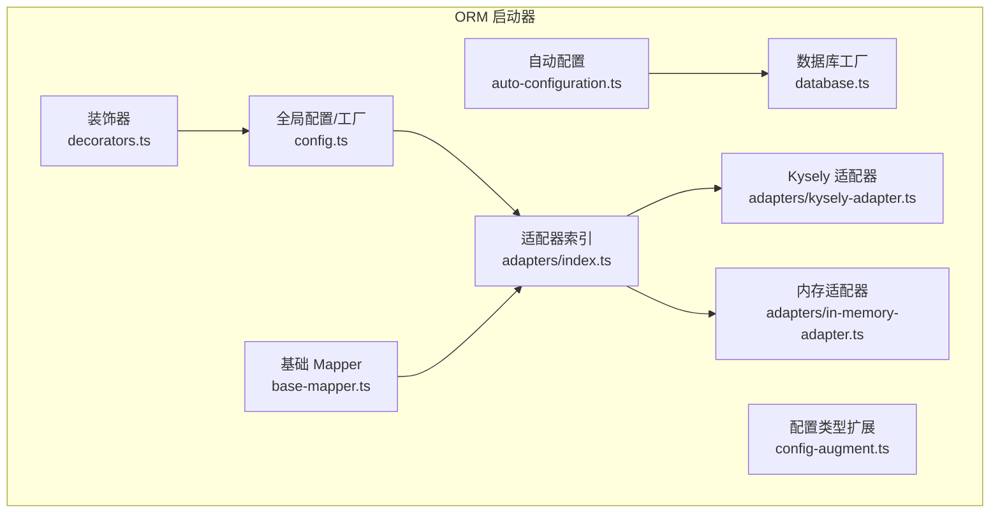
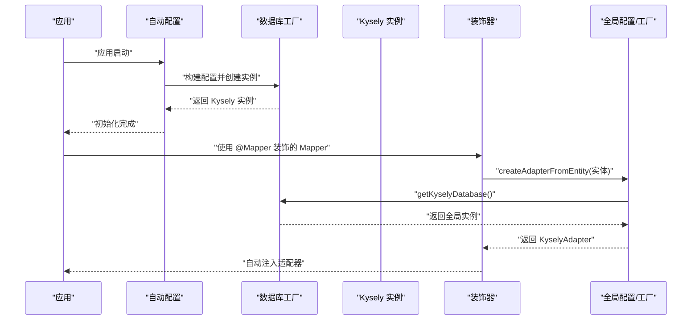
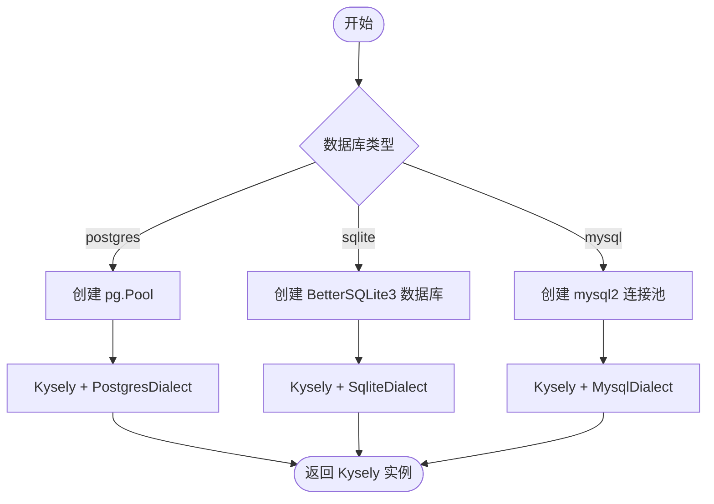
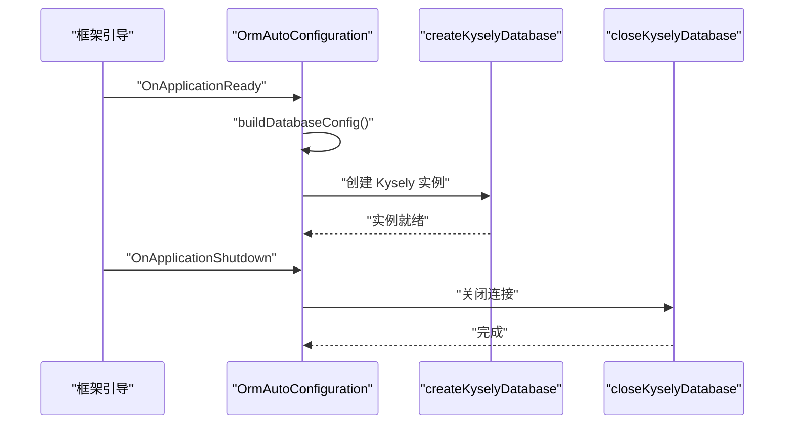
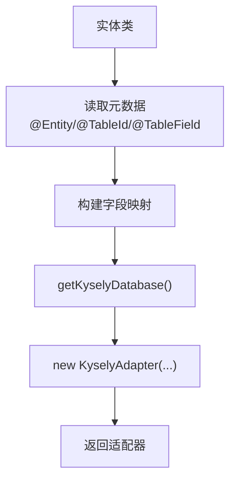
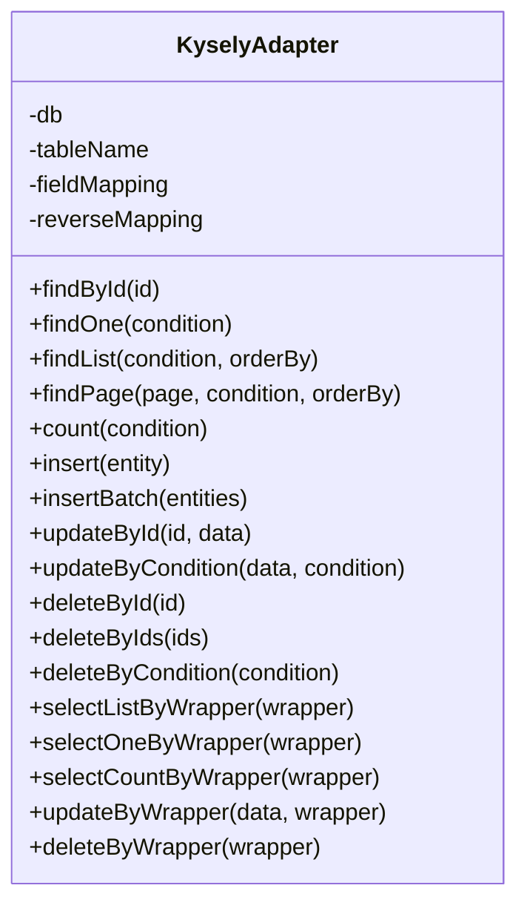
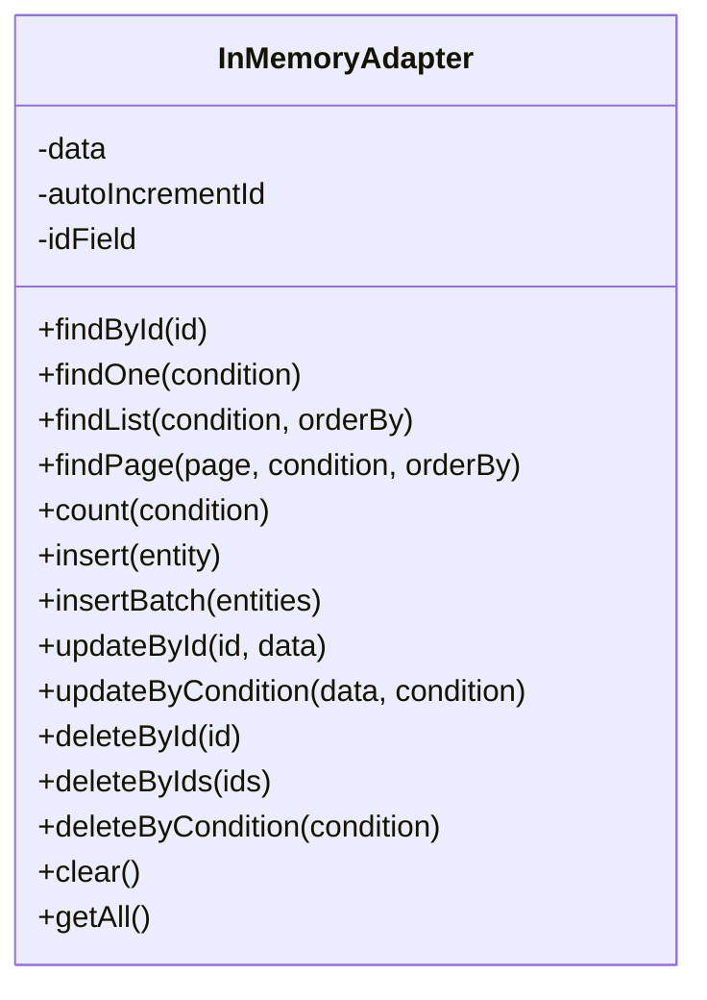
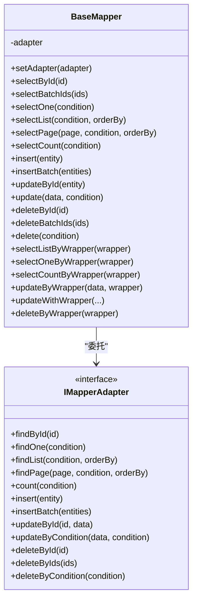
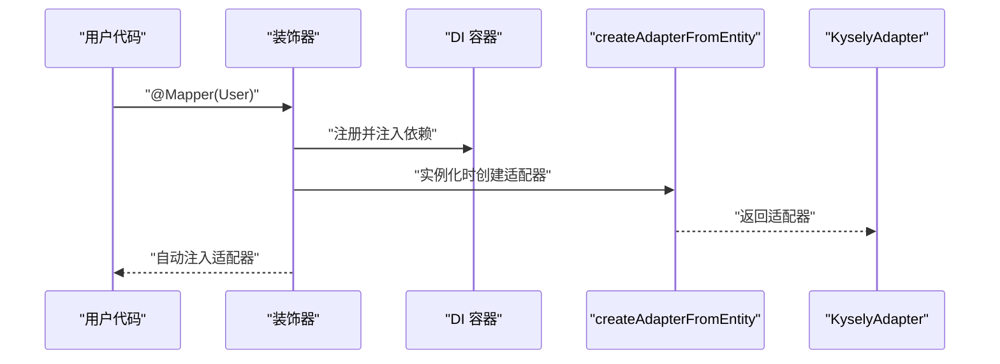
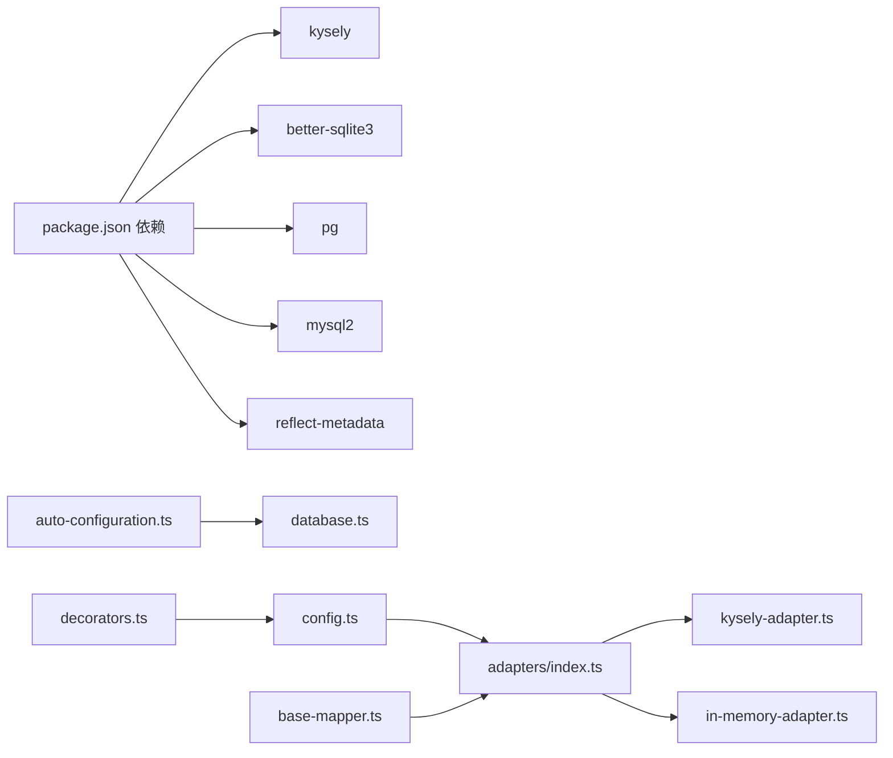

# 数据库适配器

<cite>
**本文引用的文件**
- [packages/aiko-boot-starter-orm/src/database.ts](file://packages/aiko-boot-starter-orm/src/database.ts)
- [packages/aiko-boot-starter-orm/src/auto-configuration.ts](file://packages/aiko-boot-starter-orm/src/auto-configuration.ts)
- [packages/aiko-boot-starter-orm/src/adapters/index.ts](file://packages/aiko-boot-starter-orm/src/adapters/index.ts)
- [packages/aiko-boot-starter-orm/src/adapters/kysely-adapter.ts](file://packages/aiko-boot-starter-orm/src/adapters/kysely-adapter.ts)
- [packages/aiko-boot-starter-orm/src/adapters/in-memory-adapter.ts](file://packages/aiko-boot-starter-orm/src/adapters/in-memory-adapter.ts)
- [packages/aiko-boot-starter-orm/src/base-mapper.ts](file://packages/aiko-boot-starter-orm/src/base-mapper.ts)
- [packages/aiko-boot-starter-orm/src/decorators.ts](file://packages/aiko-boot-starter-orm/src/decorators.ts)
- [packages/aiko-boot-starter-orm/src/config.ts](file://packages/aiko-boot-starter-orm/src/config.ts)
- [packages/aiko-boot-starter-orm/src/config-augment.ts](file://packages/aiko-boot-starter-orm/src/config-augment.ts)
- [packages/aiko-boot-starter-orm/package.json](file://packages/aiko-boot-starter-orm/package.json)
</cite>

## 目录
1. [简介](#简介)
2. [项目结构](#项目结构)
3. [核心组件](#核心组件)
4. [架构总览](#架构总览)
5. [组件详解](#组件详解)
6. [依赖关系分析](#依赖关系分析)
7. [性能考量](#性能考量)
8. [故障排查指南](#故障排查指南)
9. [结论](#结论)
10. [附录](#附录)

## 简介
本技术文档围绕数据库适配器体系进行系统化阐述，重点覆盖以下方面：
- 多数据库支持机制：PostgreSQL、SQLite、MySQL 的适配器设计与实现原理
- 数据库配置系统：连接池管理、事务处理、方言选择、自动配置与生命周期管理
- 工厂模式与适配器工厂：基于实体类型动态创建合适数据库适配器
- 配置示例与最佳实践：连接字符串、驱动程序、连接池参数等
- 初始化流程与生命周期：应用启动/关闭时的数据库连接建立与释放
- 特性差异与迁移注意事项：不同数据库的方言差异与迁移策略

## 项目结构
该模块位于 aiko-boot 生态下的 ORM 启动器包中，采用“按功能域划分”的组织方式：
- database.ts：数据库工厂与全局实例管理
- auto-configuration.ts：Spring Boot 风格的自动配置，读取配置并初始化数据库
- adapters/*：适配器层，包含 Kysely 适配器与内存适配器
- base-mapper.ts：MyBatis-Plus 风格的 Mapper 抽象与适配器接口
- decorators.ts：实体与 Mapper 装饰器，负责元数据收集与 DI 注入
- config.ts：全局配置与适配器工厂
- config-augment.ts：对 @ai-partner-x/aiko-boot 的 AppConfig 进行类型扩展
- package.json：依赖声明与构建脚本

图表来源
- [packages/aiko-boot-starter-orm/src/auto-configuration.ts](file://packages/aiko-boot-starter-orm/src/auto-configuration.ts#L61-L93)
- [packages/aiko-boot-starter-orm/src/database.ts](file://packages/aiko-boot-starter-orm/src/database.ts#L47-L95)
- [packages/aiko-boot-starter-orm/src/adapters/index.ts](file://packages/aiko-boot-starter-orm/src/adapters/index.ts#L1-L3)
- [packages/aiko-boot-starter-orm/src/adapters/kysely-adapter.ts](file://packages/aiko-boot-starter-orm/src/adapters/kysely-adapter.ts#L24-L37)
- [packages/aiko-boot-starter-orm/src/adapters/in-memory-adapter.ts](file://packages/aiko-boot-starter-orm/src/adapters/in-memory-adapter.ts#L9-L18)
- [packages/aiko-boot-starter-orm/src/base-mapper.ts](file://packages/aiko-boot-starter-orm/src/base-mapper.ts#L55-L73)
- [packages/aiko-boot-starter-orm/src/decorators.ts](file://packages/aiko-boot-starter-orm/src/decorators.ts#L140-L193)
- [packages/aiko-boot-starter-orm/src/config.ts](file://packages/aiko-boot-starter-orm/src/config.ts#L42-L76)
- [packages/aiko-boot-starter-orm/src/config-augment.ts](file://packages/aiko-boot-starter-orm/src/config-augment.ts#L20-L25)

章节来源
- [packages/aiko-boot-starter-orm/src/index.ts](file://packages/aiko-boot-starter-orm/src/index.ts#L1-L91)

## 核心组件
- 数据库工厂与全局实例管理：统一创建与持有 Kysely 实例，支持 PostgreSQL、SQLite、MySQL，并提供获取、关闭与状态检查能力
- 自动配置：基于配置文件自动构建连接配置并初始化数据库
- 适配器层：KyselyAdapter 提供与 Kysely 的桥接；InMemoryAdapter 提供内存级适配器，便于测试
- 基础 Mapper：定义 CRUD 与分页接口，通过适配器执行具体数据库操作
- 装饰器：Entity/TableId/TableField/@Mapper 等，用于实体元数据收集与 DI 注入
- 全局配置与适配器工厂：从实体元数据自动创建适配器实例

章节来源
- [packages/aiko-boot-starter-orm/src/database.ts](file://packages/aiko-boot-starter-orm/src/database.ts#L47-L134)
- [packages/aiko-boot-starter-orm/src/auto-configuration.ts](file://packages/aiko-boot-starter-orm/src/auto-configuration.ts#L61-L134)
- [packages/aiko-boot-starter-orm/src/adapters/kysely-adapter.ts](file://packages/aiko-boot-starter-orm/src/adapters/kysely-adapter.ts#L24-L420)
- [packages/aiko-boot-starter-orm/src/adapters/in-memory-adapter.ts](file://packages/aiko-boot-starter-orm/src/adapters/in-memory-adapter.ts#L9-L174)
- [packages/aiko-boot-starter-orm/src/base-mapper.ts](file://packages/aiko-boot-starter-orm/src/base-mapper.ts#L55-L384)
- [packages/aiko-boot-starter-orm/src/decorators.ts](file://packages/aiko-boot-starter-orm/src/decorators.ts#L68-L193)
- [packages/aiko-boot-starter-orm/src/config.ts](file://packages/aiko-boot-starter-orm/src/config.ts#L42-L76)

## 架构总览
整体架构遵循“自动配置 + 工厂 + 适配器 + Mapper + 装饰器”的分层设计：
- 自动配置层：读取配置并调用数据库工厂创建全局 Kysely 实例
- 适配器层：将 MyBatis-Plus 风格的查询包装器转换为 Kysely 查询，或在内存中执行
- Mapper 层：提供统一的 CRUD 与分页接口，内部委托适配器完成实际操作
- 装饰器层：收集实体元数据，注入 DI 并在运行时自动设置适配器

图表来源
- [packages/aiko-boot-starter-orm/src/auto-configuration.ts](file://packages/aiko-boot-starter-orm/src/auto-configuration.ts#L70-L81)
- [packages/aiko-boot-starter-orm/src/database.ts](file://packages/aiko-boot-starter-orm/src/database.ts#L100-L105)
- [packages/aiko-boot-starter-orm/src/config.ts](file://packages/aiko-boot-starter-orm/src/config.ts#L42-L76)
- [packages/aiko-boot-starter-orm/src/decorators.ts](file://packages/aiko-boot-starter-orm/src/decorators.ts#L158-L189)

## 组件详解

### 数据库工厂与多数据库支持
- 支持数据库类型：postgres、sqlite、mysql
- 连接配置：
  - PostgreSQL：主机、端口、用户、密码、数据库
  - SQLite：文件路径，支持内存数据库
  - MySQL：主机、端口、用户、密码、数据库
- 实例管理：
  - 全局持有 Kysely 实例，提供获取、关闭与初始化状态检查
  - 根据配置类型动态选择对应 Dialect，并创建连接池

图表来源
- [packages/aiko-boot-starter-orm/src/database.ts](file://packages/aiko-boot-starter-orm/src/database.ts#L50-L95)

章节来源
- [packages/aiko-boot-starter-orm/src/database.ts](file://packages/aiko-boot-starter-orm/src/database.ts#L9-L95)

### 自动配置与生命周期
- 自动配置类在应用启动时读取配置并初始化数据库连接
- 应用关闭时负责关闭数据库连接
- 配置项：
  - database.type：数据库类型
  - database.filename：SQLite 文件路径
  - database.host/port/user/password/database：PostgreSQL/MySQL

图表来源
- [packages/aiko-boot-starter-orm/src/auto-configuration.ts](file://packages/aiko-boot-starter-orm/src/auto-configuration.ts#L70-L93)

章节来源
- [packages/aiko-boot-starter-orm/src/auto-configuration.ts](file://packages/aiko-boot-starter-orm/src/auto-configuration.ts#L34-L134)

### 适配器工厂模式：基于实体类型动态创建适配器
- 通过装饰器收集实体元数据（表名、字段映射、主键信息）
- 从全局数据库工厂获取 Kysely 实例
- 构造 KyselyAdapter 并返回，供 Mapper 使用

图表来源
- [packages/aiko-boot-starter-orm/src/config.ts](file://packages/aiko-boot-starter-orm/src/config.ts#L42-L76)
- [packages/aiko-boot-starter-orm/src/decorators.ts](file://packages/aiko-boot-starter-orm/src/decorators.ts#L200-L223)

章节来源
- [packages/aiko-boot-starter-orm/src/config.ts](file://packages/aiko-boot-starter-orm/src/config.ts#L42-L76)
- [packages/aiko-boot-starter-orm/src/decorators.ts](file://packages/aiko-boot-starter-orm/src/decorators.ts#L140-L193)

### Kysely 适配器：查询包装器到 SQL 的转换
- 字段映射：支持 TypeScript 字段名与数据库列名的双向映射
- 查询能力：
  - 基础查询：按 ID、条件、排序、分页、计数
  - Wrapper 查询：支持比较、区间、IN/NOT IN、NULL/IS NULL、OR/AND 组合
  - 更新/删除：支持 Wrapper 与条件更新/删除
- 性能优化：
  - 分页查询并发执行统计与数据查询
  - 条件构建复用表达式生成逻辑

图表来源
- [packages/aiko-boot-starter-orm/src/adapters/kysely-adapter.ts](file://packages/aiko-boot-starter-orm/src/adapters/kysely-adapter.ts#L24-L420)

章节来源
- [packages/aiko-boot-starter-orm/src/adapters/kysely-adapter.ts](file://packages/aiko-boot-starter-orm/src/adapters/kysely-adapter.ts#L24-L420)

### 内存适配器：开发与测试场景
- 存储在内存 Map 中，适合单元测试与快速原型
- 支持基本 CRUD、分页、排序与条件匹配
- 提供清空与获取全量数据的辅助方法

图表来源
- [packages/aiko-boot-starter-orm/src/adapters/in-memory-adapter.ts](file://packages/aiko-boot-starter-orm/src/adapters/in-memory-adapter.ts#L9-L174)

章节来源
- [packages/aiko-boot-starter-orm/src/adapters/in-memory-adapter.ts](file://packages/aiko-boot-starter-orm/src/adapters/in-memory-adapter.ts#L9-L174)

### 基础 Mapper 与适配器接口
- 定义统一的 CRUD 与分页接口，内部委托适配器执行
- 支持 QueryWrapper/UpdateWrapper 的高级查询与更新
- 适配器接口保证不同实现的一致行为

图表来源
- [packages/aiko-boot-starter-orm/src/base-mapper.ts](file://packages/aiko-boot-starter-orm/src/base-mapper.ts#L55-L384)

章节来源
- [packages/aiko-boot-starter-orm/src/base-mapper.ts](file://packages/aiko-boot-starter-orm/src/base-mapper.ts#L55-L384)

### 装饰器与 DI 注入
- @Entity/@TableName：定义表名与描述
- @TableId/@TableField：定义主键与字段映射
- @Mapper：标记 Mapper 并自动注入依赖，运行时自动设置适配器
- 元数据辅助函数：获取实体、字段、主键与 Mapper 的元数据

图表来源
- [packages/aiko-boot-starter-orm/src/decorators.ts](file://packages/aiko-boot-starter-orm/src/decorators.ts#L140-L193)
- [packages/aiko-boot-starter-orm/src/config.ts](file://packages/aiko-boot-starter-orm/src/config.ts#L42-L76)

章节来源
- [packages/aiko-boot-starter-orm/src/decorators.ts](file://packages/aiko-boot-starter-orm/src/decorators.ts#L68-L193)

### 配置系统与类型扩展
- AppConfig 类型扩展：安装包后自动包含 database 配置
- 兼容旧版配置：保留全局配置接口，但建议使用 createKyselyDatabase
- 依赖声明：包含 Kysely、better-sqlite3、reflect-metadata 等

章节来源
- [packages/aiko-boot-starter-orm/src/config-augment.ts](file://packages/aiko-boot-starter-orm/src/config-augment.ts#L20-L25)
- [packages/aiko-boot-starter-orm/src/config.ts](file://packages/aiko-boot-starter-orm/src/config.ts#L10-L36)
- [packages/aiko-boot-starter-orm/package.json](file://packages/aiko-boot-starter-orm/package.json#L24-L54)

## 依赖关系分析
- 数据库工厂依赖 Kysely 与各数据库驱动（pg、better-sqlite3、mysql2）
- 自动配置依赖 @ai-partner-x/aiko-boot 的配置加载与生命周期钩子
- 适配器依赖 Kysely 的查询构建器与方言
- Mapper 依赖适配器接口，解耦具体数据库实现
- 装饰器依赖 reflect-metadata 与 DI 容器

图表来源
- [packages/aiko-boot-starter-orm/package.json](file://packages/aiko-boot-starter-orm/package.json#L24-L54)
- [packages/aiko-boot-starter-orm/src/auto-configuration.ts](file://packages/aiko-boot-starter-orm/src/auto-configuration.ts#L27-L27)
- [packages/aiko-boot-starter-orm/src/database.ts](file://packages/aiko-boot-starter-orm/src/database.ts#L7-L7)
- [packages/aiko-boot-starter-orm/src/adapters/index.ts](file://packages/aiko-boot-starter-orm/src/adapters/index.ts#L1-L3)

章节来源
- [packages/aiko-boot-starter-orm/package.json](file://packages/aiko-boot-starter-orm/package.json#L24-L54)

## 性能考量
- 连接池管理：PostgreSQL 使用 pg.Pool，MySQL 使用 mysql2 连接池；SQLite 使用 BetterSQLite3 的同步连接模型
- 并发查询：分页查询中统计与数据查询并行执行，减少往返时间
- 字段映射：通过预构建正向/反向映射字典，降低运行时映射开销
- 查询构建：条件表达式复用 Kysely 的表达式构建器，避免重复拼接

[本节为通用性能建议，不直接分析具体文件]

## 故障排查指南
- 数据库未初始化：若在数据库未初始化前调用适配器，会抛出异常；确保先调用 createKyselyDatabase 或启用自动配置
- 配置不完整：自动配置在缺少必要配置时会跳过初始化并输出警告
- 适配器不支持 Wrapper：BaseMapper 在适配器不支持 Wrapper 时会回退到简单查询并发出警告
- 连接关闭：应用关闭时需确保调用关闭流程，释放连接资源

章节来源
- [packages/aiko-boot-starter-orm/src/config.ts](file://packages/aiko-boot-starter-orm/src/config.ts#L45-L47)
- [packages/aiko-boot-starter-orm/src/auto-configuration.ts](file://packages/aiko-boot-starter-orm/src/auto-configuration.ts#L72-L76)
- [packages/aiko-boot-starter-orm/src/base-mapper.ts](file://packages/aiko-boot-starter-orm/src/base-mapper.ts#L227-L229)
- [packages/aiko-boot-starter-orm/src/database.ts](file://packages/aiko-boot-starter-orm/src/database.ts#L120-L126)

## 结论
本数据库适配器体系通过“自动配置 + 工厂 + 适配器 + Mapper + 装饰器”的分层设计，实现了对 PostgreSQL、SQLite、MySQL 的统一支持。其关键优势包括：
- 易于扩展：新增数据库只需实现适配器接口并接入工厂
- 开发友好：装饰器与 DI 注入简化了实体与 Mapper 的使用
- 查询灵活：Wrapper 查询支持复杂条件组合，适配器层负责方言转换
- 生命周期清晰：自动配置与关闭流程确保资源正确管理

[本节为总结性内容，不直接分析具体文件]

## 附录

### 数据库配置示例（按类型）
- PostgreSQL
  - 配置项：host、port、user、password、database
  - 方言：PostgresDialect
  - 连接池：pg.Pool
- SQLite
  - 配置项：filename（支持内存数据库）
  - 方言：SqliteDialect
  - 连接池：BetterSQLite3（无独立连接池）
- MySQL
  - 配置项：host、port、user、password、database
  - 方言：MysqlDialect
  - 连接池：mysql2 连接池

章节来源
- [packages/aiko-boot-starter-orm/src/database.ts](file://packages/aiko-boot-starter-orm/src/database.ts#L11-L38)
- [packages/aiko-boot-starter-orm/src/database.ts](file://packages/aiko-boot-starter-orm/src/database.ts#L50-L95)

### 适配器工厂使用示例（步骤）
- 步骤 1：定义实体并添加装饰器（@Entity、@TableId、@TableField）
- 步骤 2：使用 @Mapper 装饰 Mapper 类
- 步骤 3：确保数据库已初始化（自动配置或手动调用 createKyselyDatabase）
- 步骤 4：运行时自动注入适配器，即可使用统一的 CRUD 与分页接口

章节来源
- [packages/aiko-boot-starter-orm/src/decorators.ts](file://packages/aiko-boot-starter-orm/src/decorators.ts#L140-L193)
- [packages/aiko-boot-starter-orm/src/config.ts](file://packages/aiko-boot-starter-orm/src/config.ts#L42-L76)

### 不同数据库的特性差异与迁移注意事项
- PostgreSQL
  - 支持丰富的数据类型与 JSON/JSONB
  - 事务隔离级别与并发控制较强
  - 迁移建议：注意序列、索引、约束的差异
- SQLite
  - 单文件数据库，部署简单
  - 语法相对简化，部分高级特性缺失
  - 迁移建议：关注数据类型映射与外键约束
- MySQL
  - 默认存储引擎与字符集需明确
  - 事务与锁机制与 PostgreSQL 有所不同
  - 迁移建议：统一字符集、索引命名与外键约束

[本节为通用迁移建议，不直接分析具体文件]