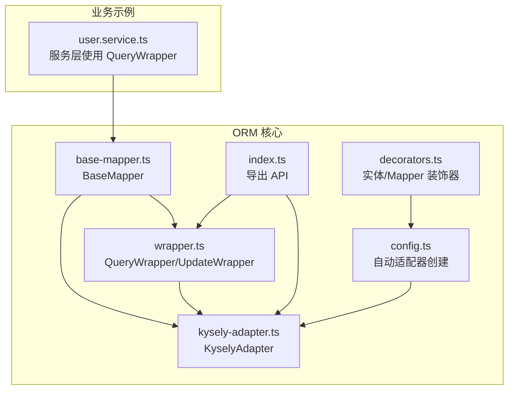
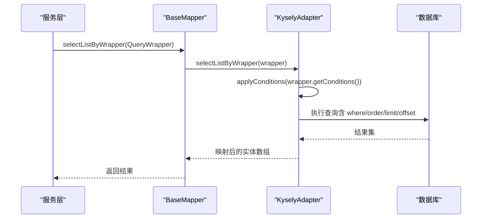
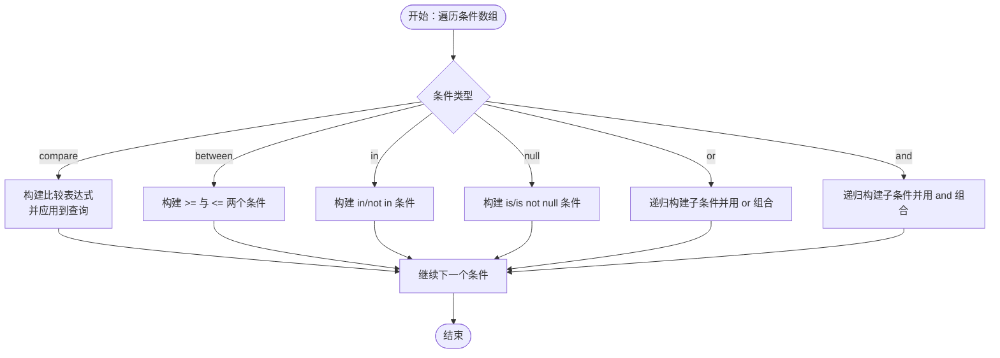
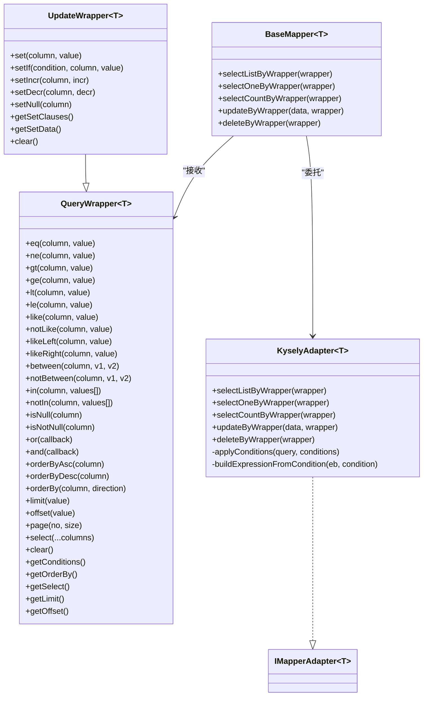
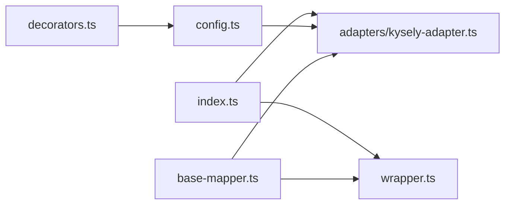

# 查询包装器

<cite>
**本文引用的文件**
- [wrapper.ts](file://packages/aiko-boot-starter-orm/src/wrapper.ts)
- [kysely-adapter.ts](file://packages/aiko-boot-starter-orm/src/adapters/kysely-adapter.ts)
- [base-mapper.ts](file://packages/aiko-boot-starter-orm/src/base-mapper.ts)
- [index.ts](file://packages/aiko-boot-starter-orm/src/index.ts)
- [config.ts](file://packages/aiko-boot-starter-orm/src/config.ts)
- [decorators.ts](file://packages/aiko-boot-starter-orm/src/decorators.ts)
- [user.service.ts](file://app/examples/user-crud/packages/api/src/service/user.service.ts)
</cite>

## 目录
1. [简介](#简介)
2. [项目结构](#项目结构)
3. [核心组件](#核心组件)
4. [架构总览](#架构总览)
5. [组件详解](#组件详解)
6. [依赖关系分析](#依赖关系分析)
7. [性能考量](#性能考量)
8. [故障排查指南](#故障排查指南)
9. [结论](#结论)
10. [附录](#附录)

## 简介
本技术文档围绕查询包装器（QueryWrapper）展开，系统阐述其设计理念、实现原理与使用方式。QueryWrapper 提供与 MyBatis-Plus 一致的 API，采用链式调用设计，将动态查询条件以结构化数据模型保存，并由适配器层转换为具体数据库查询（当前基于 Kysely）。文档将详细说明比较、模糊、范围、空值判断、逻辑组合、排序、分页、字段选择等能力，并给出单表、OR 条件、分页统计等典型场景的实践路径。

## 项目结构
ORM 核心位于 aiko-boot-starter-orm 包中，关键文件如下：
- wrapper.ts：定义 QueryWrapper、UpdateWrapper 及其类型与方法
- adapters/kysely-adapter.ts：将 QueryWrapper 条件应用到 Kysely 查询
- base-mapper.ts：对外暴露 BaseMapper，封装 CRUD 与 Wrapper 查询入口
- index.ts：导出 ORM 主要 API（含 QueryWrapper、UpdateWrapper、适配器等）
- config.ts：从实体元数据自动创建适配器
- decorators.ts：实体与 Mapper 装饰器，驱动适配器注入
- app/examples/user-crud/packages/api/src/service/user.service.ts：实际业务中使用 QueryWrapper 的示例

图表来源
- [wrapper.ts](file://packages/aiko-boot-starter-orm/src/wrapper.ts#L1-L476)
- [kysely-adapter.ts](file://packages/aiko-boot-starter-orm/src/adapters/kysely-adapter.ts#L1-L420)
- [base-mapper.ts](file://packages/aiko-boot-starter-orm/src/base-mapper.ts#L1-L384)
- [index.ts](file://packages/aiko-boot-starter-orm/src/index.ts#L1-L91)
- [config.ts](file://packages/aiko-boot-starter-orm/src/config.ts#L1-L77)
- [decorators.ts](file://packages/aiko-boot-starter-orm/src/decorators.ts#L1-L224)
- [user.service.ts](file://app/examples/user-crud/packages/api/src/service/user.service.ts#L1-L251)

章节来源
- [index.ts](file://packages/aiko-boot-starter-orm/src/index.ts#L1-L91)

## 核心组件
- QueryWrapper<T>：动态条件构造器，支持比较、模糊、范围、空值、逻辑组合、排序、分页、字段选择等
- UpdateWrapper<T>：在 QueryWrapper 基础上增加 set/setIf/setIncr/setDecr/setNull 等更新能力
- KyselyAdapter：将 QueryWrapper 条件转换为 Kysely 查询，支持 where、or、and、between、in、is null/is not null 等
- BaseMapper：统一的 CRUD 与 Wrapper 查询入口，按需委托给适配器
- 自动适配器创建：根据实体装饰器元数据生成字段映射并绑定 Kysely 实例

章节来源
- [wrapper.ts](file://packages/aiko-boot-starter-orm/src/wrapper.ts#L49-L350)
- [wrapper.ts](file://packages/aiko-boot-starter-orm/src/wrapper.ts#L394-L470)
- [kysely-adapter.ts](file://packages/aiko-boot-starter-orm/src/adapters/kysely-adapter.ts#L24-L37)
- [base-mapper.ts](file://packages/aiko-boot-starter-orm/src/base-mapper.ts#L55-L352)
- [config.ts](file://packages/aiko-boot-starter-orm/src/config.ts#L42-L76)

## 架构总览
QueryWrapper 的执行链路如下：
- 业务层构建 QueryWrapper
- BaseMapper 将 Wrapper 传入适配器
- KyselyAdapter 解析条件树，拼接 where/or/and/between/in/is null 等表达式
- 通过 Kysely 执行 SQL 并映射回实体

图表来源
- [base-mapper.ts](file://packages/aiko-boot-starter-orm/src/base-mapper.ts#L222-L230)
- [kysely-adapter.ts](file://packages/aiko-boot-starter-orm/src/adapters/kysely-adapter.ts#L177-L200)
- [kysely-adapter.ts](file://packages/aiko-boot-starter-orm/src/adapters/kysely-adapter.ts#L249-L300)

## 组件详解

### QueryWrapper 设计与方法族
- 比较条件：eq/ne/gt/ge/lt/le
- 模糊查询：like/notLike/likeLeft/likeRight
- 范围查询：between/notBetween、in/notIn
- 空值判断：isNull/isNotNull
- 逻辑组合：or/and（嵌套 QueryWrapper）
- 排序：orderByAsc/orderByDesc/orderBy
- 分页：limit/offset/page
- 字段选择：select（可选）
- 清空：clear

这些方法均返回 this，形成链式调用；内部以条件数组保存结构化信息，便于适配器统一处理。

章节来源
- [wrapper.ts](file://packages/aiko-boot-starter-orm/src/wrapper.ts#L59-L207)
- [wrapper.ts](file://packages/aiko-boot-starter-orm/src/wrapper.ts#L215-L231)
- [wrapper.ts](file://packages/aiko-boot-starter-orm/src/wrapper.ts#L239-L260)
- [wrapper.ts](file://packages/aiko-boot-starter-orm/src/wrapper.ts#L268-L290)
- [wrapper.ts](file://packages/aiko-boot-starter-orm/src/wrapper.ts#L298-L310)
- [wrapper.ts](file://packages/aiko-boot-starter-orm/src/wrapper.ts#L341-L350)

### UpdateWrapper 与字段设置
- set/setIf：设置字段值，支持条件性设置
- setIncr/setDecr：自增/自减（内部以特殊标记表示）
- setNull：设为 NULL
- getSetClauses/getSetData：读取设置集合与合并后的数据对象

章节来源
- [wrapper.ts](file://packages/aiko-boot-starter-orm/src/wrapper.ts#L394-L470)

### 条件树与适配器转换
KyselyAdapter 将 QueryWrapper 内部条件树转换为 Kysely 查询：
- compare：直接映射为 where 条件（含 like/not like）
- between：拆分为 >= 与 <= 两个条件
- in/not in：原样映射
- null/is not null：映射为 is/is not null
- or/and：递归构建表达式并用 or/and 组合
- 字段映射：根据实体元数据进行 TS 字段名与数据库列名的双向映射

图表来源
- [kysely-adapter.ts](file://packages/aiko-boot-starter-orm/src/adapters/kysely-adapter.ts#L249-L300)
- [kysely-adapter.ts](file://packages/aiko-boot-starter-orm/src/adapters/kysely-adapter.ts#L305-L323)

章节来源
- [kysely-adapter.ts](file://packages/aiko-boot-starter-orm/src/adapters/kysely-adapter.ts#L249-L323)

### BaseMapper 与适配器集成
- BaseMapper 提供 selectListByWrapper/selectOneByWrapper/selectCountByWrapper/updateByWrapper/deleteByWrapper 等方法
- 若适配器未实现对应方法，则会降级或抛错
- 适配器需实现与 MyBatis-Plus 一致的返回语义

章节来源
- [base-mapper.ts](file://packages/aiko-boot-starter-orm/src/base-mapper.ts#L222-L351)

### 自动适配器创建与字段映射
- 通过 @Entity/@TableField/@TableId 等装饰器收集表名与字段映射
- createAdapterFromEntity 根据实体元数据创建 KyselyAdapter
- 字段映射支持 TS 属性名到数据库列名的双向转换

章节来源
- [config.ts](file://packages/aiko-boot-starter-orm/src/config.ts#L42-L76)
- [decorators.ts](file://packages/aiko-boot-starter-orm/src/decorators.ts#L68-L123)
- [decorators.ts](file://packages/aiko-boot-starter-orm/src/decorators.ts#L140-L193)

### 类关系图

图表来源
- [wrapper.ts](file://packages/aiko-boot-starter-orm/src/wrapper.ts#L49-L350)
- [wrapper.ts](file://packages/aiko-boot-starter-orm/src/wrapper.ts#L394-L470)
- [kysely-adapter.ts](file://packages/aiko-boot-starter-orm/src/adapters/kysely-adapter.ts#L24-L37)
- [base-mapper.ts](file://packages/aiko-boot-starter-orm/src/base-mapper.ts#L55-L352)

## 依赖关系分析
- 导出入口：index.ts 暴露 QueryWrapper/UpdateWrapper、适配器与自动配置工具
- 装饰器：decorators.ts 提供实体与 Mapper 装饰器，配合 config.ts 自动注入适配器
- 适配器：kysely-adapter.ts 依赖 Kysely，负责将条件树转为 SQL
- Mapper：base-mapper.ts 作为统一入口，按需调用适配器

图表来源
- [index.ts](file://packages/aiko-boot-starter-orm/src/index.ts#L54-L67)
- [decorators.ts](file://packages/aiko-boot-starter-orm/src/decorators.ts#L140-L193)
- [config.ts](file://packages/aiko-boot-starter-orm/src/config.ts#L42-L76)
- [base-mapper.ts](file://packages/aiko-boot-starter-orm/src/base-mapper.ts#L55-L352)
- [kysely-adapter.ts](file://packages/aiko-boot-starter-orm/src/adapters/kysely-adapter.ts#L24-L37)

章节来源
- [index.ts](file://packages/aiko-boot-starter-orm/src/index.ts#L1-L91)

## 性能考量
- 避免 N+1 查询：优先使用单次 Wrapper 查询与批量操作
- 索引建议：对常用过滤字段（如状态、创建时间、用户名、邮箱）建立合适索引；范围查询（between/>,<）尽量结合最左前缀
- 分页优化：合理设置 page(no, size)，避免超大 offset；必要时使用游标分页或基于索引的定位
- 条件选择：优先使用精确相等（eq）与范围（between/>,<）替代模糊匹配（like），必要时使用前缀匹配（likeLeft/likeRight）
- 字段选择：仅 select 必要字段，减少网络与反序列化开销
- OR 条件：OR 通常难以命中索引，建议评估是否可拆分或引入物化视图/汇总表
- 批量操作：使用 insertBatch/updateByCondition/deleteByCondition 减少往返

## 故障排查指南
- 适配器未设置：BaseMapper 抛出“适配器未设置”错误，确保通过装饰器或手动 setAdapter 注入
- 适配器不支持 Wrapper：BaseMapper 在适配器未实现相应方法时会抛错或降级，检查适配器实现
- 字段映射问题：确认实体装饰器的 @TableField/@TableId 与数据库列名一致
- SQL 注入防护：QueryWrapper 与 KyselyAdapter 均通过参数化绑定执行，不拼接原始字符串；避免在列名/表名处使用不可信输入
- OR 条件导致性能下降：检查执行计划，必要时改写为 union 或补充索引

章节来源
- [base-mapper.ts](file://packages/aiko-boot-starter-orm/src/base-mapper.ts#L68-L73)
- [base-mapper.ts](file://packages/aiko-boot-starter-orm/src/base-mapper.ts#L222-L230)
- [base-mapper.ts](file://packages/aiko-boot-starter-orm/src/base-mapper.ts#L281-L287)
- [base-mapper.ts](file://packages/aiko-boot-starter-orm/src/base-mapper.ts#L345-L351)
- [config.ts](file://packages/aiko-boot-starter-orm/src/config.ts#L42-L76)

## 结论
QueryWrapper 以结构化条件树与链式 API 实现了灵活、类型安全的动态查询能力；通过 KyselyAdapter 与字段映射，既保证了与 MyBatis-Plus 的 API 一致性，又具备良好的可扩展性。结合合理的索引与分页策略，可在复杂业务场景下获得稳定、高效的查询体验。

## 附录

### 常见查询示例（路径参考）
- 单表条件查询与排序
  - [示例路径](file://app/examples/user-crud/packages/api/src/service/user.service.ts#L128-L135)
- OR 条件查询（用户名或邮箱包含关键字）
  - [示例路径](file://app/examples/user-crud/packages/api/src/service/user.service.ts#L140-L146)
- 高级搜索（模糊、范围、排序、分页、统计）
  - [示例路径](file://app/examples/user-crud/packages/api/src/service/user.service.ts#L63-L123)
- 创建用户前的唯一性校验（基于 QueryWrapper）
  - [示例路径](file://app/examples/user-crud/packages/api/src/service/user.service.ts#L148-L171)

### API 一览（方法族）
- 比较：eq/ne/gt/ge/lt/le
- 模糊：like/notLike/likeLeft/likeRight
- 范围：between/notBetween/in/notIn
- 空值：isNull/isNotNull
- 逻辑：or/and（嵌套）
- 排序：orderByAsc/orderByDesc/orderBy
- 分页：limit/offset/page
- 字段：select
- 清空：clear

章节来源
- [wrapper.ts](file://packages/aiko-boot-starter-orm/src/wrapper.ts#L59-L207)
- [wrapper.ts](file://packages/aiko-boot-starter-orm/src/wrapper.ts#L215-L231)
- [wrapper.ts](file://packages/aiko-boot-starter-orm/src/wrapper.ts#L239-L260)
- [wrapper.ts](file://packages/aiko-boot-starter-orm/src/wrapper.ts#L268-L290)
- [wrapper.ts](file://packages/aiko-boot-starter-orm/src/wrapper.ts#L298-L310)
- [wrapper.ts](file://packages/aiko-boot-starter-orm/src/wrapper.ts#L341-L350)