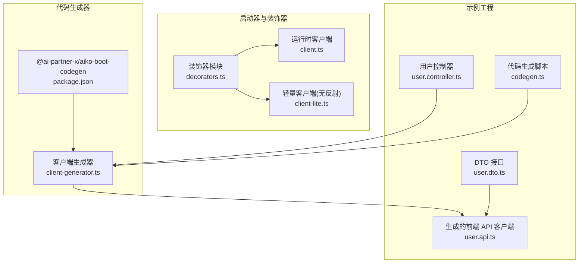
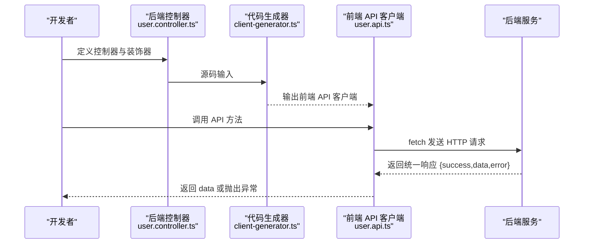
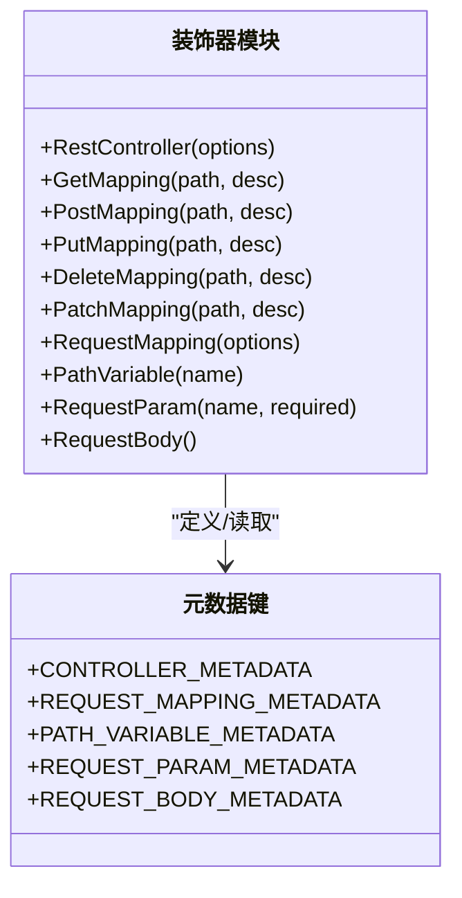
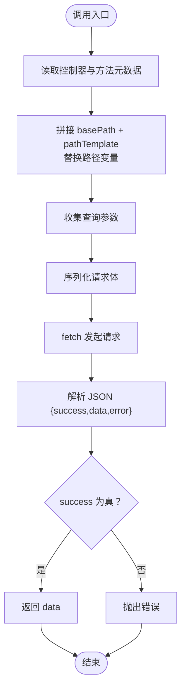
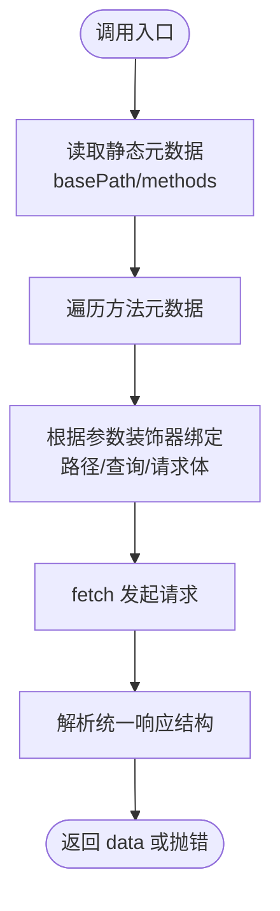
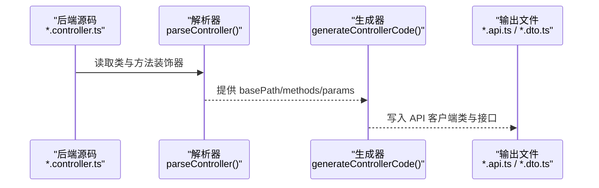
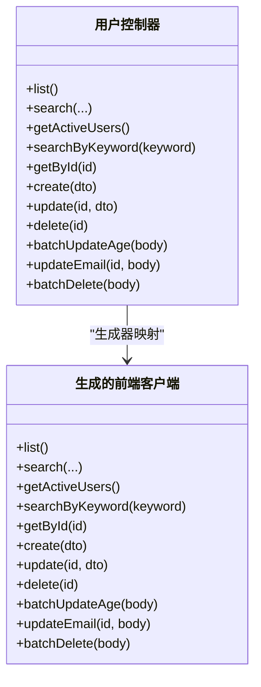
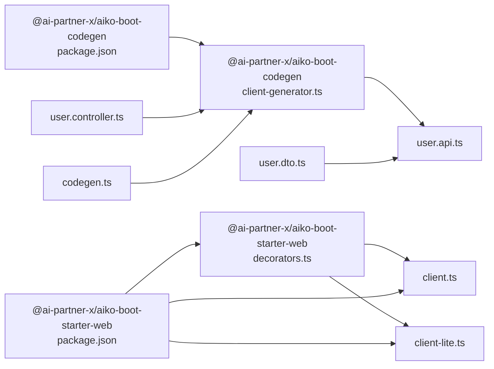

# API 客户端

<cite>
**本文档引用的文件**
- [packages/aiko-boot-starter-web/src/client.ts](file://packages/aiko-boot-starter-web/src/client.ts)
- [packages/aiko-boot-starter-web/src/client-lite.ts](file://packages/aiko-boot-starter-web/src/client-lite.ts)
- [packages/aiko-boot-starter-web/src/decorators.ts](file://packages/aiko-boot-starter-web/src/decorators.ts)
- [packages/aiko-boot-starter-web/package.json](file://packages/aiko-boot-starter-web/package.json)
- [packages/aiko-boot-codegen/src/client-generator.ts](file://packages/aiko-boot-codegen/src/client-generator.ts)
- [packages/aiko-boot-codegen/package.json](file://packages/aiko-boot-codegen/package.json)
- [app/examples/user-crud/packages/api/src/controller/user.controller.ts](file://app/examples/user-crud/packages/api/src/controller/user.controller.ts)
- [app/examples/user-crud/packages/api/dist/client/user.api.ts](file://app/examples/user-crud/packages/api/dist/client/user.api.ts)
- [app/examples/user-crud/packages/api/dist/client/user.dto.ts](file://app/examples/user-crud/packages/api/dist/client/user.dto.ts)
- [app/examples/user-crud/packages/api/scripts/codegen.ts](file://app/examples/user-crud/packages/api/scripts/codegen.ts)
</cite>

## 目录
1. [简介](#简介)
2. [项目结构](#项目结构)
3. [核心组件](#核心组件)
4. [架构总览](#架构总览)
5. [组件详解](#组件详解)
6. [依赖关系分析](#依赖关系分析)
7. [性能考量](#性能考量)
8. [故障排查指南](#故障排查指南)
9. [结论](#结论)
10. [附录](#附录)

## 简介
本指南面向希望在前端使用“类 Java Feign”的风格定义并调用远程 REST API 的开发者。项目提供了基于装饰器的 API 客户端生成与运行时代理能力，并配套代码生成器，可从后端控制器源码一键生成类型安全的前端 API 客户端。文档将深入讲解：
- 如何通过装饰器定义接口并映射到 HTTP 请求
- 自动代理生成机制（接口扫描、方法映射、参数绑定）
- 异步调用与错误处理策略（含统一响应结构）
- 类型安全的 API 调用（TypeScript 类型推断与编译期检查）
- 客户端配置项（基础 URL、请求头等）
- 实际调用场景（GET、POST、PUT、DELETE 等）

## 项目结构
本项目采用多包结构，核心与示例分离：
- 启动器与装饰器：提供 @ApiContract、@RestController、@GetMapping 等装饰器与运行时元数据解析
- 客户端生成器：从后端控制器源码生成前端 API 客户端
- 示例工程：用户 CRUD 示例，演示控制器定义、DTO/Entity 定义与前端 API 客户端生成与使用

图表来源
- [packages/aiko-boot-starter-web/src/decorators.ts](file://packages/aiko-boot-starter-web/src/decorators.ts#L1-L196)
- [packages/aiko-boot-starter-web/src/client.ts](file://packages/aiko-boot-starter-web/src/client.ts#L1-L233)
- [packages/aiko-boot-starter-web/src/client-lite.ts](file://packages/aiko-boot-starter-web/src/client-lite.ts#L1-L107)
- [packages/aiko-boot-codegen/src/client-generator.ts](file://packages/aiko-boot-codegen/src/client-generator.ts#L1-L349)
- [app/examples/user-crud/packages/api/src/controller/user.controller.ts](file://app/examples/user-crud/packages/api/src/controller/user.controller.ts#L1-L170)
- [app/examples/user-crud/packages/api/dist/client/user.api.ts](file://app/examples/user-crud/packages/api/dist/client/user.api.ts#L1-L131)
- [app/examples/user-crud/packages/api/dist/client/user.dto.ts](file://app/examples/user-crud/packages/api/dist/client/user.dto.ts#L1-L43)
- [app/examples/user-crud/packages/api/scripts/codegen.ts](file://app/examples/user-crud/packages/api/scripts/codegen.ts#L1-L4)

章节来源
- [packages/aiko-boot-starter-web/src/decorators.ts](file://packages/aiko-boot-starter-web/src/decorators.ts#L1-L196)
- [packages/aiko-boot-starter-web/src/client.ts](file://packages/aiko-boot-starter-web/src/client.ts#L1-L233)
- [packages/aiko-boot-starter-web/src/client-lite.ts](file://packages/aiko-boot-starter-web/src/client-lite.ts#L1-L107)
- [packages/aiko-boot-codegen/src/client-generator.ts](file://packages/aiko-boot-codegen/src/client-generator.ts#L1-L349)
- [app/examples/user-crud/packages/api/src/controller/user.controller.ts](file://app/examples/user-crud/packages/api/src/controller/user.controller.ts#L1-L170)
- [app/examples/user-crud/packages/api/dist/client/user.api.ts](file://app/examples/user-crud/packages/api/dist/client/user.api.ts#L1-L131)
- [app/examples/user-crud/packages/api/dist/client/user.dto.ts](file://app/examples/user-crud/packages/api/dist/client/user.dto.ts#L1-L43)
- [app/examples/user-crud/packages/api/scripts/codegen.ts](file://app/examples/user-crud/packages/api/scripts/codegen.ts#L1-L4)

## 核心组件
- 装饰器层：提供 @ApiContract、@RestController、@GetMapping、@PostMapping、@PutMapping、@DeleteMapping、@PathVariable、@RequestParam、@RequestBody 等，用于声明式定义 API 行为与参数绑定
- 运行时客户端：createApiClient 基于装饰器元数据动态生成 fetch 客户端；createApiClientFromMeta 基于静态元数据在 SSR 环境使用
- 代码生成器：从后端控制器源码生成前端 API 客户端类与 DTO/Entity 接口，确保前后端契约一致

章节来源
- [packages/aiko-boot-starter-web/src/decorators.ts](file://packages/aiko-boot-starter-web/src/decorators.ts#L1-L196)
- [packages/aiko-boot-starter-web/src/client.ts](file://packages/aiko-boot-starter-web/src/client.ts#L1-L233)
- [packages/aiko-boot-starter-web/src/client-lite.ts](file://packages/aiko-boot-starter-web/src/client-lite.ts#L1-L107)
- [packages/aiko-boot-codegen/src/client-generator.ts](file://packages/aiko-boot-codegen/src/client-generator.ts#L1-L349)

## 架构总览
下图展示了从后端控制器到前端客户端的完整链路：后端通过装饰器定义路由与参数，前端通过装饰器或静态元数据生成客户端，最终以 fetch 发起请求并按统一响应结构解析结果。

图表来源
- [app/examples/user-crud/packages/api/src/controller/user.controller.ts](file://app/examples/user-crud/packages/api/src/controller/user.controller.ts#L1-L170)
- [packages/aiko-boot-codegen/src/client-generator.ts](file://packages/aiko-boot-codegen/src/client-generator.ts#L1-L349)
- [app/examples/user-crud/packages/api/dist/client/user.api.ts](file://app/examples/user-crud/packages/api/dist/client/user.api.ts#L1-L131)

## 组件详解

### 装饰器与元数据系统
- 控制器与方法映射：@RestController/@ApiContract 定义 base path；@GetMapping/@PostMapping/@PutMapping/@DeleteMapping 定义具体路由与 HTTP 方法
- 参数绑定：@PathVariable 将路径参数注入；@RequestParam 将查询参数注入；@RequestBody 将请求体注入
- 元数据读取：运行时通过 Reflect 获取控制器元数据与方法参数元数据，驱动客户端生成与参数绑定

图表来源
- [packages/aiko-boot-starter-web/src/decorators.ts](file://packages/aiko-boot-starter-web/src/decorators.ts#L1-L196)

章节来源
- [packages/aiko-boot-starter-web/src/decorators.ts](file://packages/aiko-boot-starter-web/src/decorators.ts#L1-L196)

### 运行时客户端（基于装饰器）
- createApiClient：读取装饰器元数据，为每个方法生成 fetch 客户端方法，自动处理路径变量、查询参数与请求体
- 统一响应结构：期望后端返回 {success, data?, error?}，失败时抛出错误
- 配置项：baseUrl、headers（附加请求头）

图表来源
- [packages/aiko-boot-starter-web/src/client.ts](file://packages/aiko-boot-starter-web/src/client.ts#L73-L144)

章节来源
- [packages/aiko-boot-starter-web/src/client.ts](file://packages/aiko-boot-starter-web/src/client.ts#L1-L233)

### 轻量客户端（无反射元数据）
- createApiClientFromMeta：在 SSR 等无法使用 reflect-metadata 的环境中，基于静态元数据对象生成客户端
- 适用场景：Next.js SSR、打包产物已内嵌元数据

图表来源
- [packages/aiko-boot-starter-web/src/client-lite.ts](file://packages/aiko-boot-starter-web/src/client-lite.ts#L47-L106)

章节来源
- [packages/aiko-boot-starter-web/src/client-lite.ts](file://packages/aiko-boot-starter-web/src/client-lite.ts#L1-L107)

### 代码生成器（从后端控制器生成前端客户端）
- 输入：后端控制器源码（含装饰器）
- 输出：前端 API 客户端类、DTO/Entity 接口、聚合入口 index.ts
- 功能要点：解析控制器基路径与方法、参数装饰器、返回类型，生成带 fetch 的 API 客户端类

图表来源
- [packages/aiko-boot-codegen/src/client-generator.ts](file://packages/aiko-boot-codegen/src/client-generator.ts#L33-L203)

章节来源
- [packages/aiko-boot-codegen/src/client-generator.ts](file://packages/aiko-boot-codegen/src/client-generator.ts#L1-L349)

### 示例：用户 CRUD 控制器与生成的前端客户端
- 后端控制器：定义了 list、search、getActiveUsers、searchByKeyword、getById、create、update、delete、批量更新年龄、更新邮箱、批量删除等端点
- 生成的前端客户端：对应生成的 UserApi 类，包含与后端一致的方法签名与类型

图表来源
- [app/examples/user-crud/packages/api/src/controller/user.controller.ts](file://app/examples/user-crud/packages/api/src/controller/user.controller.ts#L1-L170)
- [app/examples/user-crud/packages/api/dist/client/user.api.ts](file://app/examples/user-crud/packages/api/dist/client/user.api.ts#L1-L131)

章节来源
- [app/examples/user-crud/packages/api/src/controller/user.controller.ts](file://app/examples/user-crud/packages/api/src/controller/user.controller.ts#L1-L170)
- [app/examples/user-crud/packages/api/dist/client/user.api.ts](file://app/examples/user-crud/packages/api/dist/client/user.api.ts#L1-L131)
- [app/examples/user-crud/packages/api/dist/client/user.dto.ts](file://app/examples/user-crud/packages/api/dist/client/user.dto.ts#L1-L43)

## 依赖关系分析
- 启动器依赖 reflect-metadata 以支持装饰器元数据读取；在 SSR 环境可使用 client-lite 的静态元数据版本
- 代码生成器依赖 TypeScript 编译器与文件系统，负责解析源码并生成前端代码
- 示例工程通过脚本触发代码生成，生成物被前端应用消费

图表来源
- [packages/aiko-boot-starter-web/src/decorators.ts](file://packages/aiko-boot-starter-web/src/decorators.ts#L1-L196)
- [packages/aiko-boot-starter-web/src/client.ts](file://packages/aiko-boot-starter-web/src/client.ts#L1-L233)
- [packages/aiko-boot-starter-web/src/client-lite.ts](file://packages/aiko-boot-starter-web/src/client-lite.ts#L1-L107)
- [packages/aiko-boot-codegen/src/client-generator.ts](file://packages/aiko-boot-codegen/src/client-generator.ts#L1-L349)
- [packages/aiko-boot-codegen/package.json](file://packages/aiko-boot-codegen/package.json#L1-L34)
- [packages/aiko-boot-starter-web/package.json](file://packages/aiko-boot-starter-web/package.json#L1-L60)
- [app/examples/user-crud/packages/api/src/controller/user.controller.ts](file://app/examples/user-crud/packages/api/src/controller/user.controller.ts#L1-L170)
- [app/examples/user-crud/packages/api/dist/client/user.api.ts](file://app/examples/user-crud/packages/api/dist/client/user.api.ts#L1-L131)
- [app/examples/user-crud/packages/api/dist/client/user.dto.ts](file://app/examples/user-crud/packages/api/dist/client/user.dto.ts#L1-L43)
- [app/examples/user-crud/packages/api/scripts/codegen.ts](file://app/examples/user-crud/packages/api/scripts/codegen.ts#L1-L4)

章节来源
- [packages/aiko-boot-starter-web/package.json](file://packages/aiko-boot-starter-web/package.json#L1-L60)
- [packages/aiko-boot-codegen/package.json](file://packages/aiko-boot-codegen/package.json#L1-L34)

## 性能考量
- 客户端调用均为 fetch 异步请求，建议在上层封装重试与超时控制（当前未内置），避免阻塞主线程
- 参数绑定与 URL 拼接为 O(n) 操作，通常可忽略；建议减少不必要的查询参数与大体积请求体
- 在 SSR 场景优先使用静态元数据版本，避免装饰器反射带来的额外开销

## 故障排查指南
- 统一响应结构校验：若后端返回 {success:false}，客户端会抛出错误；请检查后端是否遵循统一响应规范
- 路径/查询参数缺失：确保 @PathVariable 与 @RequestParam 的名称与顺序与装饰器一致
- 请求体为空：@RequestBody 必须出现在方法参数上，且传入的对象会被 JSON 序列化
- SSR 环境报错：在 Next.js SSR 中使用 createApiClientFromMeta 并传入静态元数据对象
- CORS/网络问题：确认 baseUrl 正确、CORS 已配置、网络可达

章节来源
- [packages/aiko-boot-starter-web/src/client.ts](file://packages/aiko-boot-starter-web/src/client.ts#L133-L139)
- [packages/aiko-boot-starter-web/src/client-lite.ts](file://packages/aiko-boot-starter-web/src/client-lite.ts#L95-L101)

## 结论
本方案以装饰器与代码生成为核心，实现了前后端一致的 API 定义与调用体验。通过统一响应结构与类型安全的客户端生成，开发者可以快速构建稳定、可维护的前端 API 客户端，并在 SSR 环境中灵活选择运行时或静态元数据方案。

## 附录

### 客户端配置选项
- baseUrl：API 服务器基础 URL（必填）
- headers：附加请求头（可选）

章节来源
- [packages/aiko-boot-starter-web/src/client.ts](file://packages/aiko-boot-starter-web/src/client.ts#L47-L52)
- [packages/aiko-boot-starter-web/src/client-lite.ts](file://packages/aiko-boot-starter-web/src/client-lite.ts#L7-L12)

### 类型安全与编译期检查
- 代码生成器会从 DTO/Entity 源码提取接口定义，保证前后端类型一致
- 建议在前端项目中引入生成的 DTO/Entity 接口，以获得完整的类型推断

章节来源
- [packages/aiko-boot-codegen/src/client-generator.ts](file://packages/aiko-boot-codegen/src/client-generator.ts#L207-L235)
- [app/examples/user-crud/packages/api/dist/client/user.dto.ts](file://app/examples/user-crud/packages/api/dist/client/user.dto.ts#L1-L43)

### 实际调用场景示例（HTTP 方法）
- GET：list、search、getActiveUsers、searchByKeyword、getById
- POST：create
- PUT：update、batchUpdateAge、updateEmail
- DELETE：delete、batchDelete

章节来源
- [app/examples/user-crud/packages/api/src/controller/user.controller.ts](file://app/examples/user-crud/packages/api/src/controller/user.controller.ts#L35-L168)
- [app/examples/user-crud/packages/api/dist/client/user.api.ts](file://app/examples/user-crud/packages/api/dist/client/user.api.ts#L10-L129)