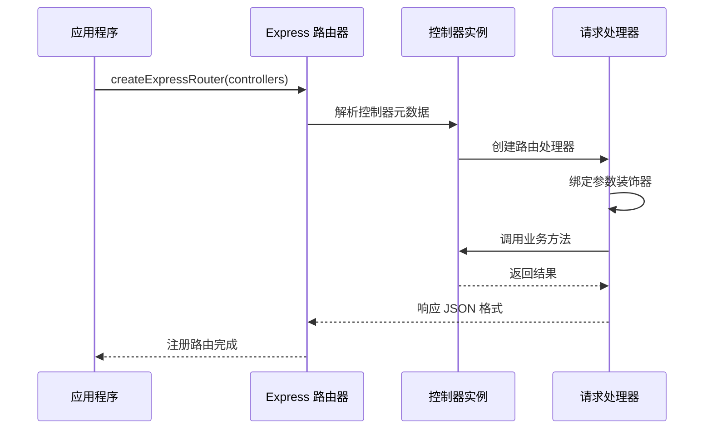
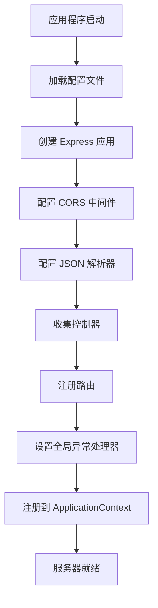
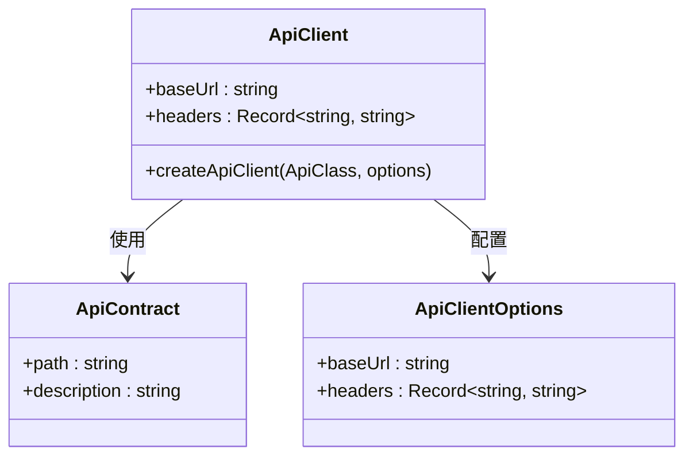
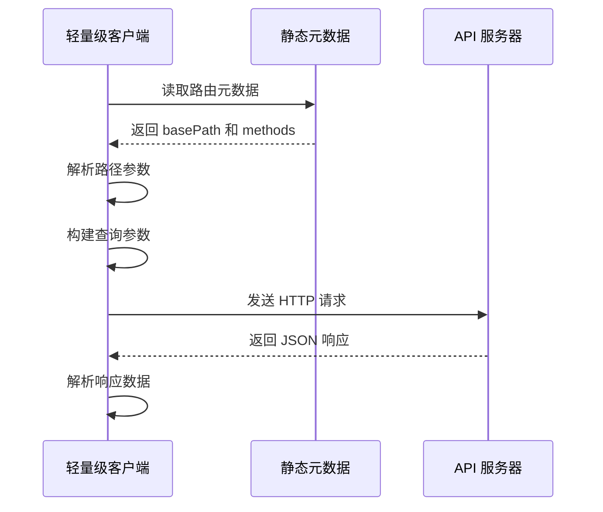
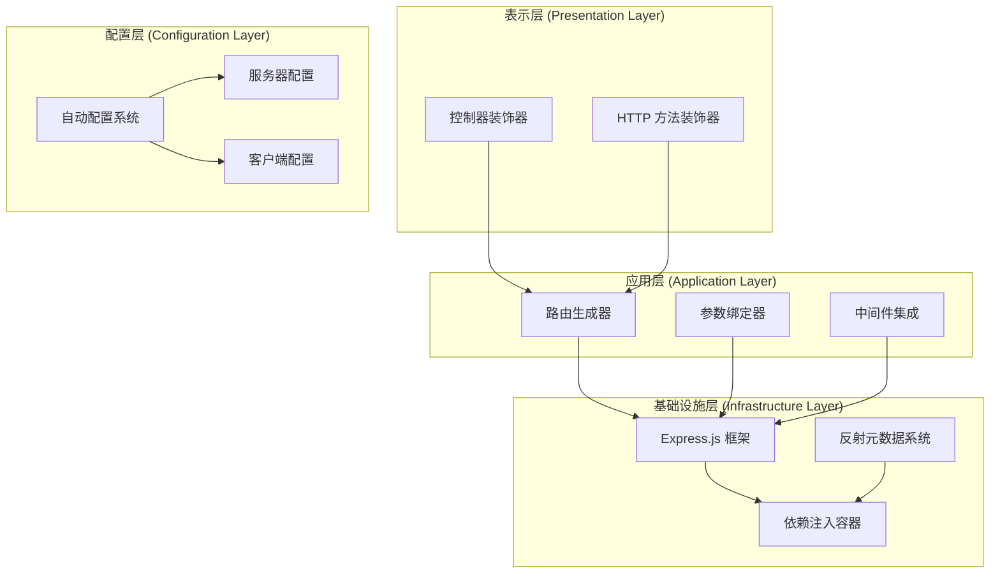
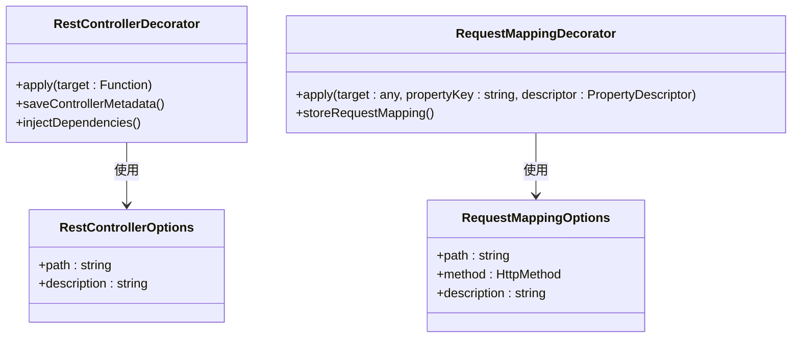
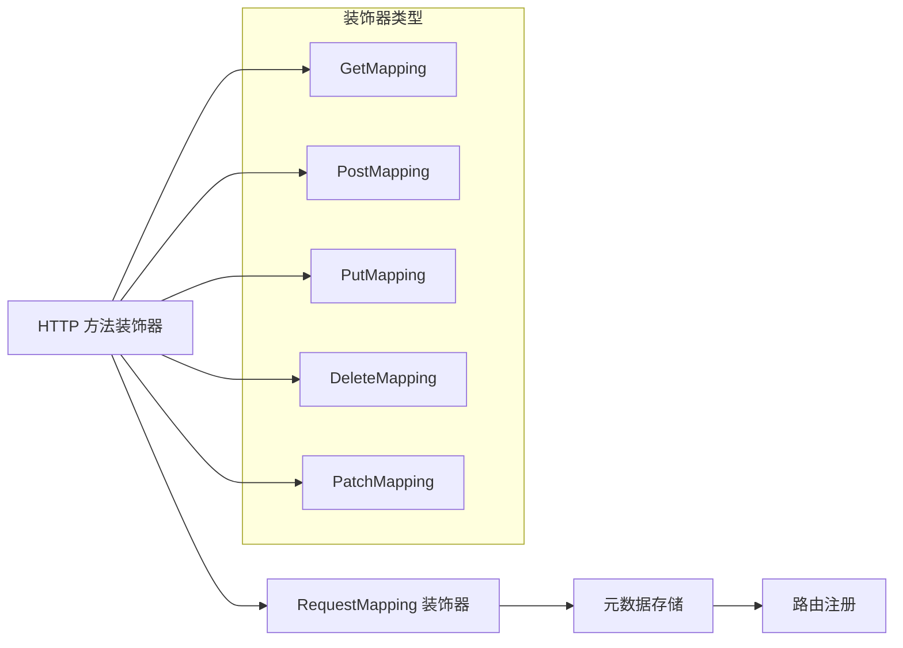
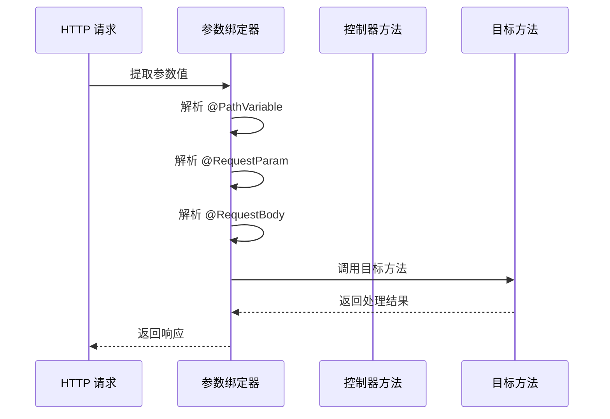
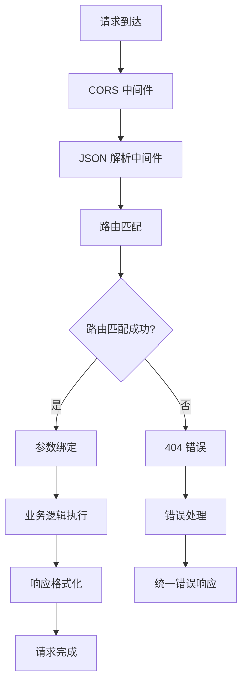
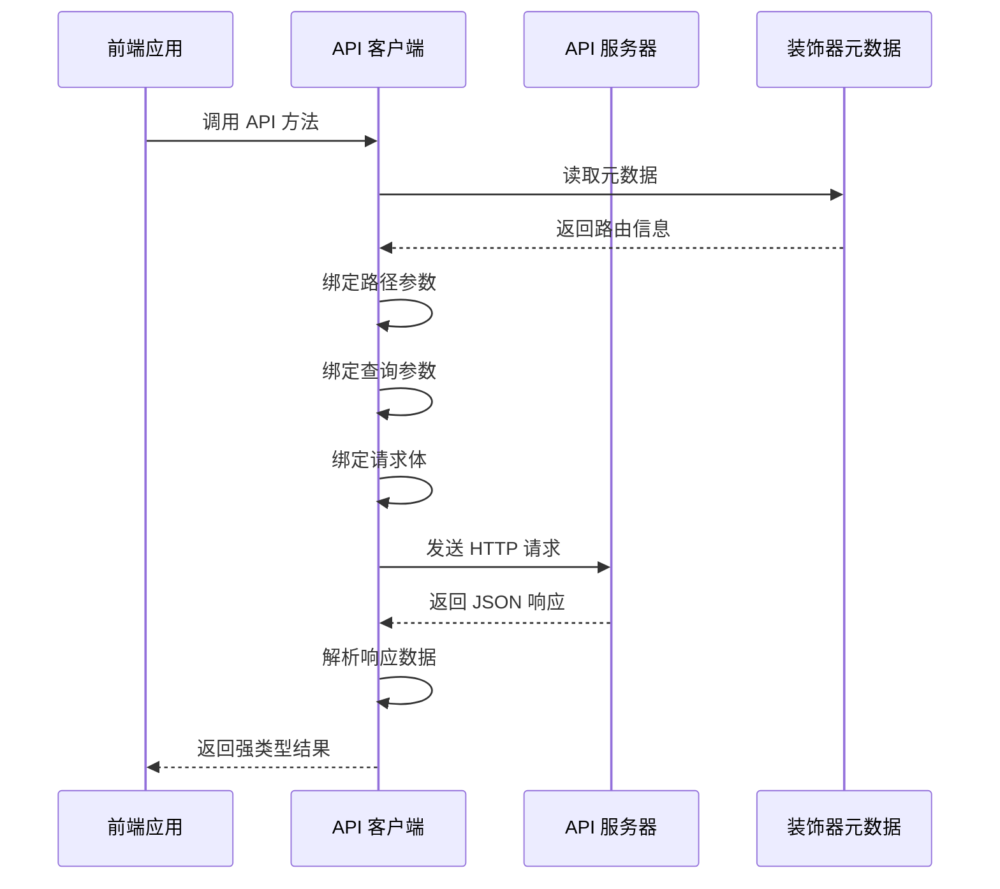

# Web 启动器 (aiko-boot-starter-web) API 开发文档

<cite>
**本文档引用的文件**
- [package.json](file://packages/aiko-boot-starter-web/package.json)
- [index.ts](file://packages/aiko-boot-starter-web/src/index.ts)
- [decorators.ts](file://packages/aiko-boot-starter-web/src/decorators.ts)
- [express-router.ts](file://packages/aiko-boot-starter-web/src/express-router.ts)
- [auto-configuration.ts](file://packages/aiko-boot-starter-web/src/auto-configuration.ts)
- [client.ts](file://packages/aiko-boot-starter-web/src/client.ts)
- [client-lite.ts](file://packages/aiko-boot-starter-web/src/client-lite.ts)
- [config-augment.ts](file://packages/aiko-boot-starter-web/src/config-augment.ts)
- [user.controller.ts](file://app/examples/user-crud/packages/api/src/controller/user.controller.ts)
</cite>

## 目录
1. [简介](#简介)
2. [项目结构](#项目结构)
3. [核心组件](#核心组件)
4. [架构概览](#架构概览)
5. [详细组件分析](#详细组件分析)
6. [依赖关系分析](#依赖关系分析)
7. [性能考虑](#性能考虑)
8. [故障排除指南](#故障排除指南)
9. [结论](#结论)
10. [附录](#附录)

## 简介

aiko-boot-starter-web 是一个基于 Spring Boot 风格的 Web 启动器，提供了完整的 API 开发解决方案。该启动器通过装饰器系统实现了类似 Spring MVC 的控制器模式，结合 Express.js 提供了自动路由生成、参数绑定、类型转换和中间件集成等功能。

主要特性包括：
- Spring Boot 风格的控制器装饰器系统
- 自动路由生成机制
- 参数绑定和类型转换功能
- 中间件集成和请求处理流程
- Feign 风格的 API 客户端
- 类型安全的 API 调用

## 项目结构

aiko-boot-starter-web 采用模块化的架构设计，核心文件组织如下：

```mermaid
graph TB
subgraph "核心模块"
A[index.ts] --> B[decorators.ts]
A --> C[express-router.ts]
A --> D[auto-configuration.ts]
A --> E[client.ts]
A --> F[client-lite.ts]
A --> G[config-augment.ts]
end
subgraph "示例应用"
H[user.controller.ts]
end
subgraph "依赖关系"
I[reflect-metadata]
J[@ai-partner-x/aiko-boot]
K[express]
L[cors]
end
B --> I
D --> J
C --> K
E --> I
F --> M[静态元数据]
G --> J
```

**图表来源**
- [index.ts](file://packages/aiko-boot-starter-web/src/index.ts#L1-L73)
- [decorators.ts](file://packages/aiko-boot-starter-web/src/decorators.ts#L1-L196)
- [express-router.ts](file://packages/aiko-boot-starter-web/src/express-router.ts#L1-L171)

**章节来源**
- [package.json](file://packages/aiko-boot-starter-web/package.json#L1-L60)
- [index.ts](file://packages/aiko-boot-starter-web/src/index.ts#L1-L73)

## 核心组件

### 控制器装饰器系统

aiko-boot-starter-web 提供了完整的 Spring Boot 风格控制器装饰器系统，包括：

#### 主要装饰器

| 装饰器 | 功能描述 | 使用场景 |
|--------|----------|----------|
| @RestController | 标记控制器类 | 定义 RESTful API 控制器 |
| @GetMapping | 映射 GET 请求 | 获取资源数据 |
| @PostMapping | 映射 POST 请求 | 创建新资源 |
| @PutMapping | 映射 PUT 请求 | 更新完整资源 |
| @DeleteMapping | 映射 DELETE 请求 | 删除资源 |
| @PatchMapping | 映射 PATCH 请求 | 部分更新资源 |

#### 参数装饰器

| 装饰器 | 功能描述 | 使用场景 |
|--------|----------|----------|
| @PathVariable | 绑定路径变量 | 从 URL 路径提取参数 |
| @RequestParam | 绑定查询参数 | 从查询字符串提取参数 |
| @RequestBody | 绑定请求体 | 从请求体提取 JSON 数据 |

**章节来源**
- [decorators.ts](file://packages/aiko-boot-starter-web/src/decorators.ts#L46-L135)
- [decorators.ts](file://packages/aiko-boot-starter-web/src/decorators.ts#L138-L173)

### Express 路由生成器

Express 路由生成器负责将装饰器定义的路由自动注册到 Express 应用程序中：



**图表来源**
- [express-router.ts](file://packages/aiko-boot-starter-web/src/express-router.ts#L59-L82)
- [express-router.ts](file://packages/aiko-boot-starter-web/src/express-router.ts#L126-L169)

**章节来源**
- [express-router.ts](file://packages/aiko-boot-starter-web/src/express-router.ts#L59-L171)

### 自动配置系统

自动配置系统提供了 Spring Boot 风格的服务器配置和初始化：



**图表来源**
- [auto-configuration.ts](file://packages/aiko-boot-starter-web/src/auto-configuration.ts#L104-L146)

**章节来源**
- [auto-configuration.ts](file://packages/aiko-boot-starter-web/src/auto-configuration.ts#L97-L147)

### API 客户端系统

API 客户端系统提供了两种类型的客户端实现：

#### 标准 API 客户端

标准客户端使用反射元数据进行类型安全的 API 调用：



**图表来源**
- [client.ts](file://packages/aiko-boot-starter-web/src/client.ts#L73-L144)

#### 轻量级 API 客户端

轻量级客户端使用静态元数据，适用于 SSR 环境：



**图表来源**
- [client-lite.ts](file://packages/aiko-boot-starter-web/src/client-lite.ts#L47-L106)

**章节来源**
- [client.ts](file://packages/aiko-boot-starter-web/src/client.ts#L24-L144)
- [client-lite.ts](file://packages/aiko-boot-starter-web/src/client-lite.ts#L22-L107)

## 架构概览

aiko-boot-starter-web 采用分层架构设计，各层职责清晰分离：



**图表来源**
- [index.ts](file://packages/aiko-boot-starter-web/src/index.ts#L13-L72)
- [auto-configuration.ts](file://packages/aiko-boot-starter-web/src/auto-configuration.ts#L97-L147)

## 详细组件分析

### 控制器装饰器实现

控制器装饰器系统是整个 Web 启动器的核心，它提供了 Spring Boot 风格的注解式编程体验：

#### 装饰器元数据管理

装饰器使用反射元数据系统来存储和检索控制器信息：



**图表来源**
- [decorators.ts](file://packages/aiko-boot-starter-web/src/decorators.ts#L26-L43)
- [decorators.ts](file://packages/aiko-boot-starter-web/src/decorators.ts#L50-L88)

#### HTTP 方法装饰器链

HTTP 方法装饰器基于通用的 RequestMapping 装饰器构建：



**图表来源**
- [decorators.ts](file://packages/aiko-boot-starter-web/src/decorators.ts#L93-L123)
- [decorators.ts](file://packages/aiko-boot-starter-web/src/decorators.ts#L128-L135)

**章节来源**
- [decorators.ts](file://packages/aiko-boot-starter-web/src/decorators.ts#L46-L135)

### 参数绑定和类型转换

参数绑定系统提供了灵活的参数提取和类型转换功能：

#### 参数装饰器实现

参数装饰器通过反射元数据系统实现参数绑定：



**图表来源**
- [express-router.ts](file://packages/aiko-boot-starter-web/src/express-router.ts#L126-L169)

#### 类型转换机制

参数绑定系统支持基本的数据类型转换：

| 参数类型 | 转换规则 | 示例 |
|----------|----------|------|
| PathVariable | 字符串保持不变 | `/users/{id}` → `String` |
| RequestParam | 字符串保持不变 | `?page=1` → `String` |
| RequestBody | JSON 解析 | `{}` → `Object` |

**章节来源**
- [express-router.ts](file://packages/aiko-boot-starter-web/src/express-router.ts#L126-L169)

### 中间件集成和请求处理

中间件系统提供了强大的请求处理能力：

#### 中间件执行流程



**图表来源**
- [auto-configuration.ts](file://packages/aiko-boot-starter-web/src/auto-configuration.ts#L120-L142)

**章节来源**
- [auto-configuration.ts](file://packages/aiko-boot-starter-web/src/auto-configuration.ts#L120-L142)

### API 客户端实现

API 客户端系统提供了类型安全的远程服务调用能力：

#### 客户端工作原理



**图表来源**
- [client.ts](file://packages/aiko-boot-starter-web/src/client.ts#L73-L144)

**章节来源**
- [client.ts](file://packages/aiko-boot-starter-web/src/client.ts#L73-L144)

## 依赖关系分析

### 核心依赖关系

aiko-boot-starter-web 的依赖关系相对简洁，主要依赖于以下核心库：

```mermaid
graph TB
subgraph "外部依赖"
A[express >= 4.0.0]
B[cors ^2.8.5]
C[reflect-metadata ^0.2.1]
end
subgraph "内部依赖"
D[@ai-partner-x/aiko-boot]
E[@ai-partner-x/aiko-boot-starter-orm]
end
subgraph "启动器核心"
F[aiko-boot-starter-web]
end
F --> A
F --> B
F --> C
F --> D
F --> E
```

**图表来源**
- [package.json](file://packages/aiko-boot-starter-web/package.json#L32-L37)

### 模块导出结构

启动器提供了多种模块导出方式以适应不同的使用场景：

| 导出模块 | 用途 | 适用场景 |
|----------|------|----------|
| 默认导出 | 完整功能集合 | 标准 Web 应用开发 |
| ./express | Express 路由器 | 自定义路由集成 |
| ./client-lite | 轻量级客户端 | SSR 环境和静态元数据 |

**章节来源**
- [package.json](file://packages/aiko-boot-starter-web/package.json#L8-L21)

## 性能考虑

### 路由注册性能

自动路由注册机制在启动时一次性完成，运行时开销极小：

- **元数据缓存**：装饰器元数据在类级别缓存，避免重复反射操作
- **路由预编译**：Express 路由在启动时预编译，运行时直接调用
- **参数绑定优化**：参数绑定使用索引访问，减少对象查找开销

### 内存使用优化

- **反射元数据**：使用字符串键名而非 Symbol，确保跨模块共享
- **实例复用**：依赖注入容器管理控制器实例生命周期
- **中间件链**：按需加载中间件，避免不必要的内存占用

### 并发处理

- **异步处理**：所有控制器方法都支持异步返回
- **错误隔离**：每个请求独立的错误处理，避免相互影响
- **连接池**：Express 内置连接池管理，支持高并发请求

## 故障排除指南

### 常见问题及解决方案

#### 路由未注册问题

**症状**：控制器方法无法访问，返回 404 错误

**可能原因**：
1. 控制器类未添加 @RestController 装饰器
2. 控制器未被正确导入到应用程序中
3. 路由前缀配置错误

**解决步骤**：
1. 确认控制器类已添加 @RestController 装饰器
2. 检查控制器是否在应用程序中正确导入
3. 验证路由前缀配置是否正确

#### 参数绑定失败

**症状**：@PathVariable 或 @RequestParam 获取到 undefined

**可能原因**：
1. 参数名称不匹配
2. 请求路径不正确
3. 缺少必要的装饰器

**解决步骤**：
1. 确认装饰器参数名称与实际使用一致
2. 检查请求 URL 是否符合预期
3. 验证装饰器使用位置是否正确

#### CORS 问题

**症状**：浏览器出现跨域错误

**解决步骤**：
1. 确认 CORS 中间件已正确配置
2. 检查允许的源、方法和头部设置
3. 验证预检请求是否正确处理

**章节来源**
- [auto-configuration.ts](file://packages/aiko-boot-starter-web/src/auto-configuration.ts#L120-L122)
- [express-router.ts](file://packages/aiko-boot-starter-web/src/express-router.ts#L160-L165)

## 结论

aiko-boot-starter-web 提供了一个功能完整、设计优雅的 Web 开发解决方案。通过借鉴 Spring Boot 的设计理念，该启动器成功地将熟悉的注解式编程体验带到了 TypeScript/JavaScript 生态系统中。

### 主要优势

1. **开发体验**：提供与 Spring Boot 一致的开发体验
2. **类型安全**：完整的 TypeScript 类型支持
3. **灵活性**：支持多种使用模式和集成方式
4. **性能**：优化的路由注册和参数绑定机制
5. **可维护性**：清晰的模块化架构和文档

### 适用场景

- 微服务架构中的 API 开发
- 单体应用的模块化开发
- 需要快速原型开发的项目
- 团队协作的大型项目

### 发展建议

1. **性能监控**：集成性能监控和指标收集
2. **测试工具**：提供更完善的测试工具和模拟器
3. **文档完善**：增加更多的使用示例和最佳实践
4. **生态扩展**：支持更多第三方中间件和插件

## 附录

### 快速开始示例

以下是一个简单的控制器实现示例：

```typescript
@RestController({ path: '/users' })
export class UserController {
  @GetMapping()
  async getAllUsers(): Promise<User[]> {
    // 实现业务逻辑
    return users;
  }
  
  @GetMapping('/:id')
  async getUserById(@PathVariable('id') id: string): Promise<User> {
    // 实现业务逻辑
    return user;
  }
}
```

### 配置选项

| 配置项 | 类型 | 默认值 | 描述 |
|--------|------|--------|------|
| server.port | number | 3001 | 服务器监听端口 |
| server.servlet.contextPath | string | /api | API 路由前缀 |
| server.maxHttpPostSize | string | 10mb | 请求体大小限制 |
| server.shutdown | string | graceful | 关闭模式 |

**章节来源**
- [auto-configuration.ts](file://packages/aiko-boot-starter-web/src/auto-configuration.ts#L48-L60)
- [config-augment.ts](file://packages/aiko-boot-starter-web/src/config-augment.ts#L18-L26)