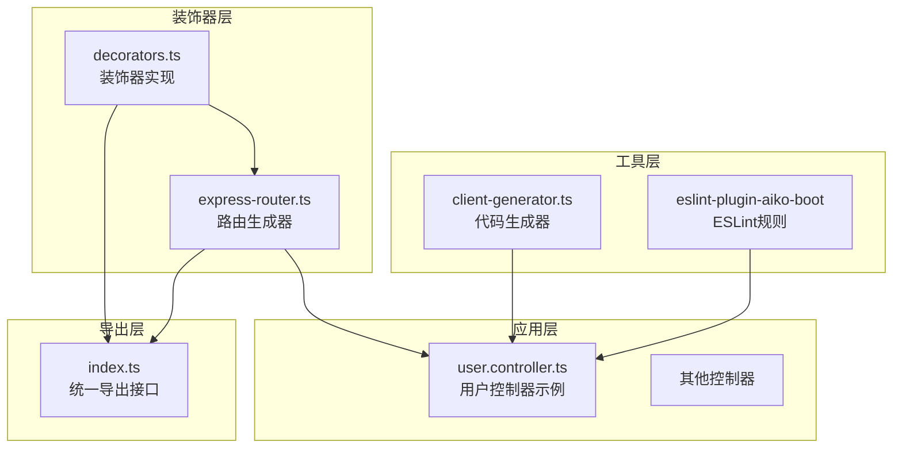
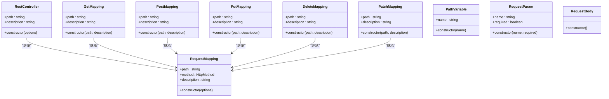
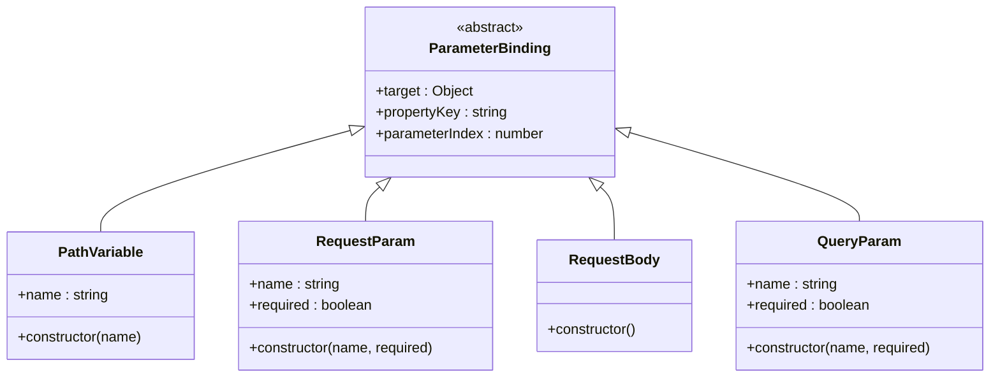
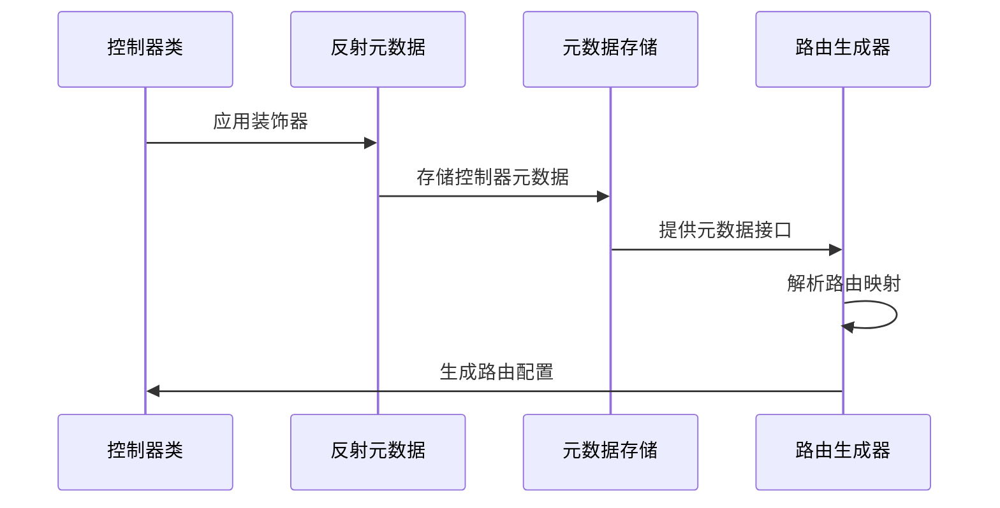
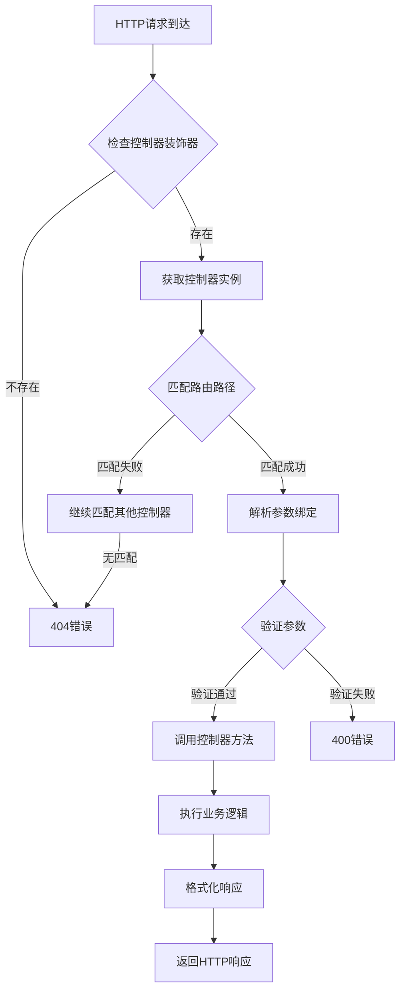
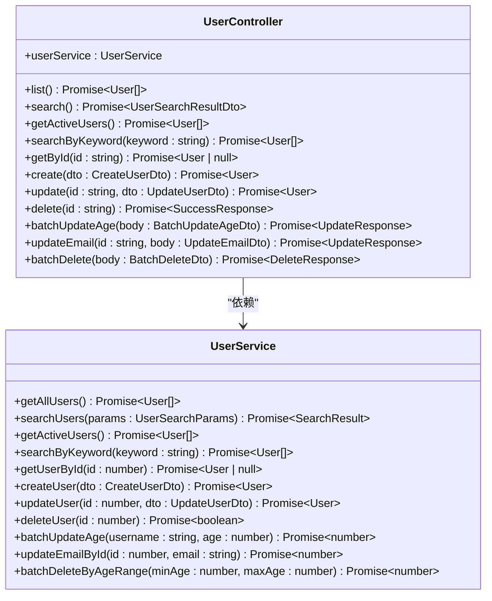
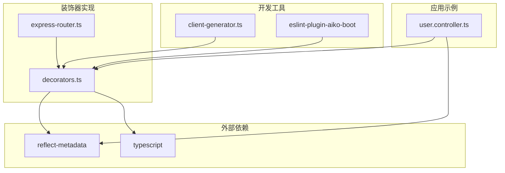
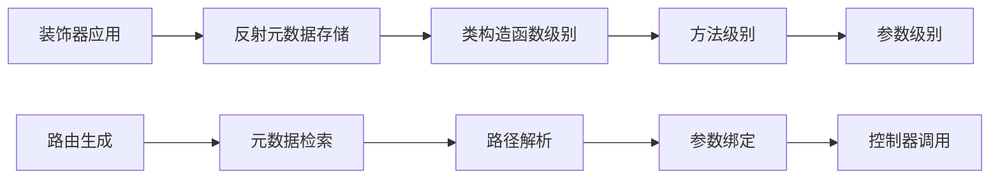

# 控制器装饰器系统

<cite>
**本文档引用的文件**
- [app/examples/user-crud/packages/api/src/controller/user.controller.ts](file://app/examples/user-crud/packages/api/src/controller/user.controller.ts)
- [packages/aiko-boot-starter-web/src/decorators.ts](file://packages/aiko-boot-starter-web/src/decorators.ts)
- [packages/aiko-boot-starter-web/src/express-router.ts](file://packages/aiko-boot-starter-web/src/express-router.ts)
- [packages/aiko-boot-starter-web/src/index.ts](file://packages/aiko-boot-starter-web/src/index.ts)
- [packages/aiko-boot-codegen/src/client-generator.ts](file://packages/aiko-boot-codegen/src/client-generator.ts)
- [packages/eslint-plugin-aiko-boot/src/rules/require-rest-controller.ts](file://packages/eslint-plugin-aiko-boot/src/rules/require-rest-controller.ts)
</cite>

## 目录
1. [简介](#简介)
2. [项目结构](#项目结构)
3. [核心组件](#核心组件)
4. [架构概览](#架构概览)
5. [详细组件分析](#详细组件分析)
6. [依赖关系分析](#依赖关系分析)
7. [性能考虑](#性能考虑)
8. [故障排除指南](#故障排除指南)
9. [结论](#结论)

## 简介

控制器装饰器系统是基于 TypeScript 装饰器模式构建的 Spring Boot 风格 Web 开发框架。该系统提供了完整的 RESTful API 开发体验，包括控制器装饰器、路由映射、参数绑定和自动代码生成等功能。

系统的核心特性包括：
- 基于装饰器的声明式路由映射
- 反射元数据驱动的控制器发现
- 自动化的 API 客户端生成
- 类型安全的参数绑定
- ESLint 规则强制约束

## 项目结构

该系统采用模块化设计，主要包含以下核心模块：



**图表来源**
- [packages/aiko-boot-starter-web/src/decorators.ts](file://packages/aiko-boot-starter-web/src/decorators.ts#L1-L200)
- [packages/aiko-boot-starter-web/src/express-router.ts](file://packages/aiko-boot-starter-web/src/express-router.ts#L1-L150)
- [app/examples/user-crud/packages/api/src/controller/user.controller.ts](file://app/examples/user-crud/packages/api/src/controller/user.controller.ts#L1-L170)

**章节来源**
- [packages/aiko-boot-starter-web/src/index.ts](file://packages/aiko-boot-starter-web/src/index.ts#L1-L73)

## 核心组件

### 装饰器系统架构

装饰器系统基于反射元数据机制实现，所有装饰器都通过 `reflect-metadata` 库存储在类构造函数上。



**图表来源**
- [packages/aiko-boot-starter-web/src/decorators.ts](file://packages/aiko-boot-starter-web/src/decorators.ts#L1-L200)

### 参数绑定装饰器

参数绑定装饰器负责将 HTTP 请求中的不同部分映射到控制器方法的参数：



**图表来源**
- [packages/aiko-boot-starter-web/src/decorators.ts](file://packages/aiko-boot-starter-web/src/decorators.ts#L150-L250)

**章节来源**
- [packages/aiko-boot-starter-web/src/decorators.ts](file://packages/aiko-boot-starter-web/src/decorators.ts#L1-L300)

## 架构概览

### 控制器元数据存储机制

系统通过反射元数据实现控制器的自动发现和路由映射：



**图表来源**
- [packages/aiko-boot-starter-web/src/decorators.ts](file://packages/aiko-boot-starter-web/src/decorators.ts#L1-L100)

### 路由处理流程



**图表来源**
- [packages/aiko-boot-starter-web/src/express-router.ts](file://packages/aiko-boot-starter-web/src/express-router.ts#L1-L200)

## 详细组件分析

### RestController 装饰器

@RestController 装饰器用于标记控制器类，为其下的所有路由方法提供基础路径。

**配置选项：**
- `path`: 控制器的基础路径前缀
- `description`: 控制器的描述信息

**实现原理：**
- 将装饰器应用于类构造函数
- 在类级别存储控制器元数据
- 为所有子方法提供路径前缀

**章节来源**
- [packages/aiko-boot-starter-web/src/decorators.ts](file://packages/aiko-boot-starter-web/src/decorators.ts#L1-L80)

### HTTP 方法映射装饰器

#### GetMapping 装饰器
用于定义 GET 请求的路由映射，支持分页查询和条件筛选。

**使用场景：**
- 获取资源列表
- 高级搜索功能
- 条件过滤查询

**参数配置：**
- `path`: 路径模板，支持路径变量
- `description`: 接口描述

#### PostMapping 装饰器
用于定义 POST 请求的路由映射，处理资源创建操作。

**使用场景：**
- 创建新资源
- 批量操作
- 复杂数据提交

#### PutMapping 装饰器
用于定义 PUT 请求的路由映射，处理资源更新操作。

**使用场景：**
- 完整资源更新
- 部分字段更新
- 状态变更

#### DeleteMapping 装饰器
用于定义 DELETE 请求的路由映射，处理资源删除操作。

**使用场景：**
- 单个资源删除
- 批量删除
- 软删除实现

#### PatchMapping 装饰器
用于定义 PATCH 请求的路由映射，处理资源的部分更新。

**使用场景：**
- 局部字段更新
- 状态切换
- 条件更新

**章节来源**
- [packages/aiko-boot-starter-web/src/decorators.ts](file://packages/aiko-boot-starter-web/src/decorators.ts#L80-L160)

### 参数绑定装饰器详解

#### PathVariable 装饰器
将 URL 路径中的变量绑定到方法参数。

**使用示例：**
```typescript
@GetMapping('/users/{id}')
async getUserById(@PathVariable('id') id: string) {
    // id 参数自动绑定来自 URL /users/123 中的 123
}
```

**应用场景：**
- 资源标识符提取
- 嵌套资源访问
- 复合路径参数

#### RequestParam 装饰器
将查询字符串参数绑定到方法参数。

**使用示例：**
```typescript
@GetMapping('/users/search')
async searchUsers(
    @RequestParam('username') username: string,
    @RequestParam('page') page: number = 1
) {
    // 处理 ?username=john&page=1 查询参数
}
```

**应用场景：**
- 分页参数处理
- 过滤条件传递
- 排序参数设置

#### RequestBody 装饰器
将 HTTP 请求体中的 JSON 数据绑定到方法参数。

**使用示例：**
```typescript
@PostMapping('/users')
async createUser(@RequestBody() userData: CreateUserDto) {
    // 处理 JSON 请求体数据
}
```

**应用场景：**
- 资源创建数据
- 复杂对象提交
- 批量数据处理

**章节来源**
- [packages/aiko-boot-starter-web/src/decorators.ts](file://packages/aiko-boot-starter-web/src/decorators.ts#L150-L250)

### 完整控制器实现示例

以下是一个完整的用户管理控制器实现：



**图表来源**
- [app/examples/user-crud/packages/api/src/controller/user.controller.ts](file://app/examples/user-crud/packages/api/src/controller/user.controller.ts#L30-L170)

**章节来源**
- [app/examples/user-crud/packages/api/src/controller/user.controller.ts](file://app/examples/user-crud/packages/api/src/controller/user.controller.ts#L1-L170)

## 依赖关系分析

### 装饰器依赖图



**图表来源**
- [packages/aiko-boot-starter-web/src/decorators.ts](file://packages/aiko-boot-starter-web/src/decorators.ts#L1-L50)
- [packages/aiko-boot-codegen/src/client-generator.ts](file://packages/aiko-boot-codegen/src/client-generator.ts#L1-L50)

### 元数据存储机制

系统通过以下方式实现元数据存储：



**图表来源**
- [packages/aiko-boot-starter-web/src/decorators.ts](file://packages/aiko-boot-starter-web/src/decorators.ts#L1-L100)

**章节来源**
- [packages/aiko-boot-starter-web/src/decorators.ts](file://packages/aiko-boot-starter-web/src/decorators.ts#L1-L200)

## 性能考虑

### 元数据缓存策略

- **懒加载机制**：装饰器元数据仅在首次访问时计算
- **缓存优化**：重复访问相同元数据时使用缓存结果
- **内存管理**：避免元数据泄漏，及时清理不再使用的元数据

### 路由匹配优化

- **路径预编译**：将路径模板编译为正则表达式
- **优先级排序**：按复杂度对路由进行排序匹配
- **短路求值**：匹配失败时立即停止后续匹配

## 故障排除指南

### 常见问题及解决方案

#### 1. 装饰器未生效

**症状：** 控制器方法无法被路由匹配

**排查步骤：**
1. 确认已导入 `reflect-metadata`
2. 检查装饰器是否正确应用
3. 验证类是否被正确实例化

**解决方案：**
```typescript
import 'reflect-metadata';
// 确保在应用入口处导入
```

#### 2. 参数绑定失败

**症状：** 参数值为 undefined 或类型不匹配

**排查步骤：**
1. 检查参数装饰器的名称配置
2. 验证请求参数与装饰器配置是否一致
3. 确认参数类型定义正确

#### 3. 路由冲突

**症状：** 多个路由映射到同一路径

**解决方案：**
- 使用更精确的路径模板
- 为不同方法使用不同的 HTTP 方法
- 检查路径变量命名冲突

**章节来源**
- [packages/eslint-plugin-aiko-boot/src/rules/require-rest-controller.ts](file://packages/eslint-plugin-aiko-boot/src/rules/require-rest-controller.ts#L34-L79)

## 结论

控制器装饰器系统提供了一个完整、类型安全且易于使用的 RESTful API 开发框架。其核心优势包括：

1. **声明式开发体验**：通过装饰器语法简化路由定义
2. **强类型支持**：完整的 TypeScript 类型推断
3. **自动化程度高**：自动生成 API 客户端和文档
4. **可扩展性强**：模块化设计支持功能扩展
5. **开发工具完善**：配套的 ESLint 规则和代码生成工具

该系统特别适合需要快速开发企业级 Web 应用的团队，能够显著提高开发效率并保证代码质量。通过合理的参数绑定和元数据管理机制，开发者可以专注于业务逻辑实现，而无需担心底层的路由处理细节。