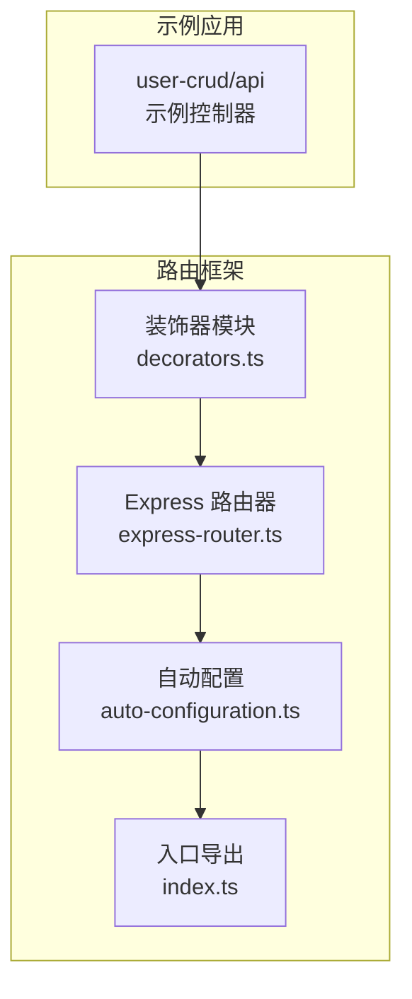
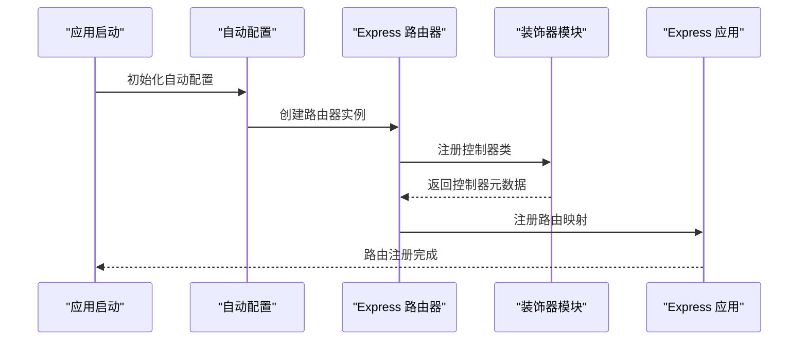
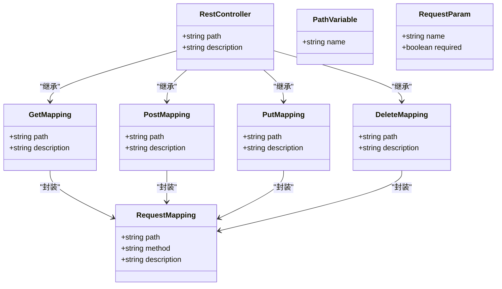
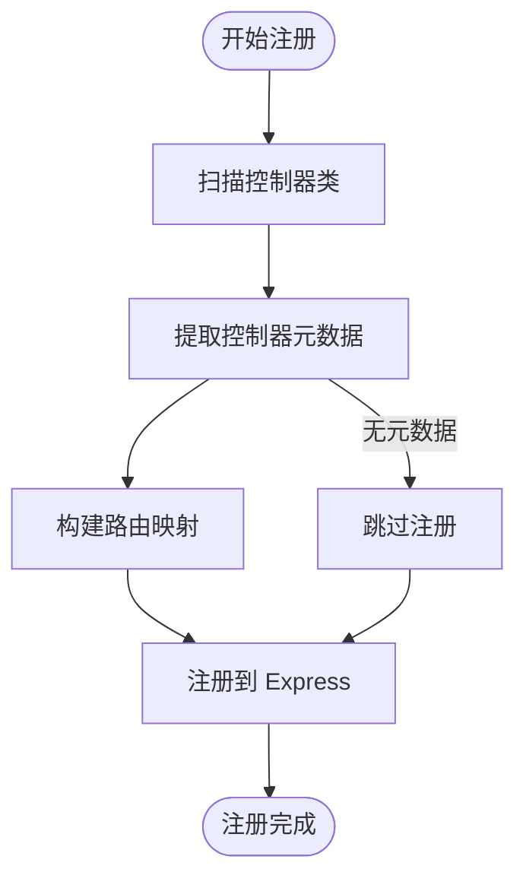
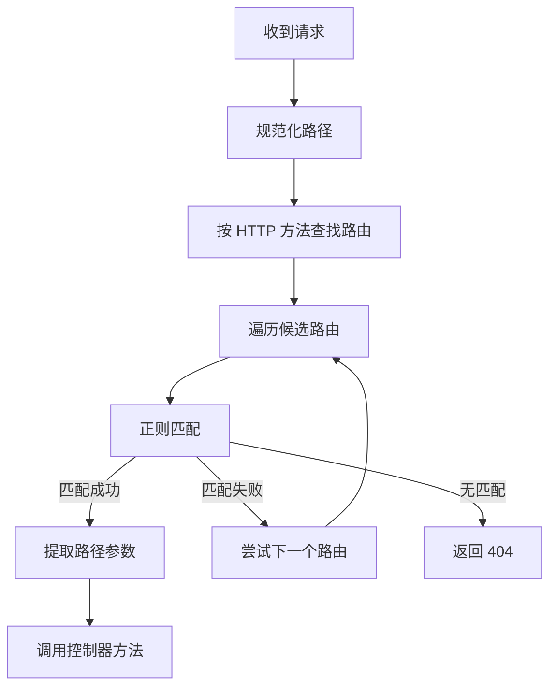
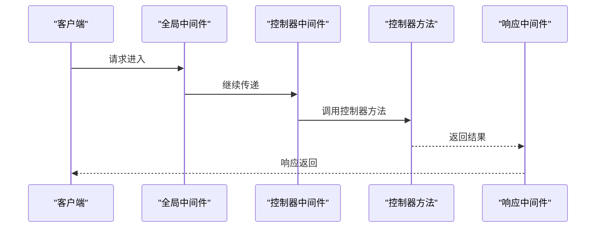
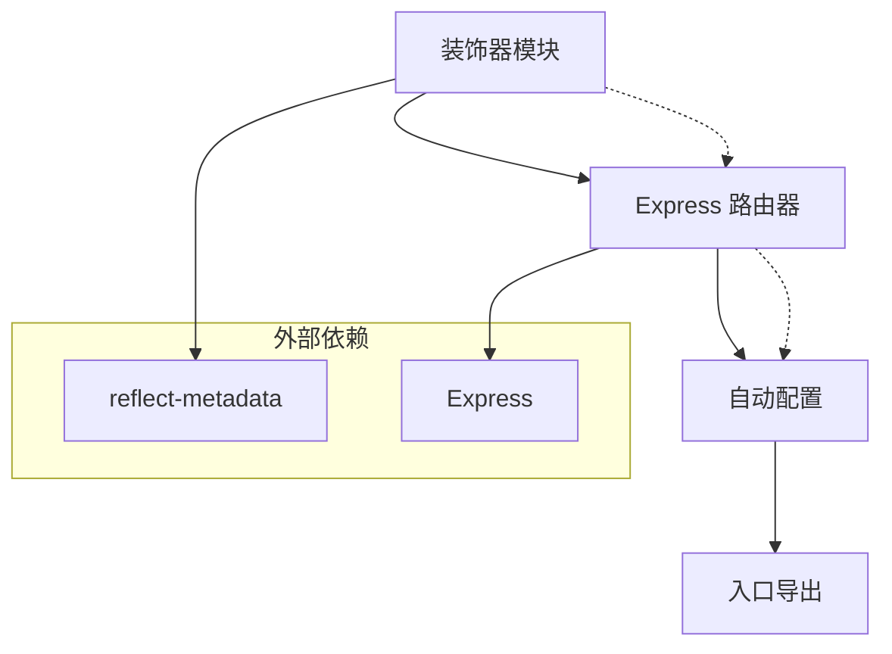

# 路由管理系统

<cite>
**本文档引用的文件**
- [app/examples/user-crud/packages/api/src/controller/user.controller.ts](file://app/examples/user-crud/packages/api/src/controller/user.controller.ts)
- [packages/aiko-boot-starter-web/src/decorators.ts](file://packages/aiko-boot-starter-web/src/decorators.ts)
- [packages/aiko-boot-starter-web/src/express-router.ts](file://packages/aiko-boot-starter-web/src/express-router.ts)
- [packages/aiko-boot-starter-web/src/auto-configuration.ts](file://packages/aiko-boot-starter-web/src/auto-configuration.ts)
- [packages/aiko-boot-starter-web/src/index.ts](file://packages/aiko-boot-starter-web/src/index.ts)
</cite>

## 目录
1. [简介](#简介)
2. [项目结构](#项目结构)
3. [核心组件](#核心组件)
4. [架构总览](#架构总览)
5. [详细组件分析](#详细组件分析)
6. [依赖关系分析](#依赖关系分析)
7. [性能考虑](#性能考虑)
8. [故障排除指南](#故障排除指南)
9. [结论](#结论)
10. [附录](#附录)

## 简介
本路由管理系统基于装饰器元数据驱动的自动路由生成机制，通过在控制器类上使用注解（装饰器）来声明路由映射，系统在启动时扫描控制器并自动注册到 Express 路由中。该系统支持多种 HTTP 方法映射、路径参数提取、查询参数绑定以及中间件集成，能够快速构建 RESTful API 并保持良好的可维护性。

## 项目结构
本项目采用多包工作区结构，路由系统的核心位于 `aiko-boot-starter-web` 包中，示例控制器位于 `user-crud/api` 示例工程中。

**图表来源**
- [packages/aiko-boot-starter-web/src/decorators.ts](file://packages/aiko-boot-starter-web/src/decorators.ts#L1-L200)
- [packages/aiko-boot-starter-web/src/express-router.ts](file://packages/aiko-boot-starter-web/src/express-router.ts#L1-L200)
- [packages/aiko-boot-starter-web/src/auto-configuration.ts](file://packages/aiko-boot-starter-web/src/auto-configuration.ts#L1-L200)
- [packages/aiko-boot-starter-web/src/index.ts](file://packages/aiko-boot-starter-web/src/index.ts#L1-L100)

**章节来源**
- [packages/aiko-boot-starter-web/src/decorators.ts](file://packages/aiko-boot-starter-web/src/decorators.ts#L1-L200)
- [packages/aiko-boot-starter-web/src/express-router.ts](file://packages/aiko-boot-starter-web/src/express-router.ts#L1-L200)
- [packages/aiko-boot-starter-web/src/auto-configuration.ts](file://packages/aiko-boot-starter-web/src/auto-configuration.ts#L1-L200)
- [packages/aiko-boot-starter-web/src/index.ts](file://packages/aiko-boot-starter-web/src/index.ts#L1-L100)

## 核心组件
- 装饰器模块：提供控制器和请求映射装饰器，用于声明路由元数据
- Express 路由器：负责扫描控制器、解析元数据并注册到 Express 应用
- 自动配置：集成到框架启动流程，自动完成路由注册
- 入口导出：统一对外暴露 API

**章节来源**
- [packages/aiko-boot-starter-web/src/decorators.ts](file://packages/aiko-boot-starter-web/src/decorators.ts#L1-L200)
- [packages/aiko-boot-starter-web/src/express-router.ts](file://packages/aiko-boot-starter-web/src/express-router.ts#L1-L200)
- [packages/aiko-boot-starter-web/src/auto-configuration.ts](file://packages/aiko-boot-starter-web/src/auto-configuration.ts#L1-L200)
- [packages/aiko-boot-starter-web/src/index.ts](file://packages/aiko-boot-starter-web/src/index.ts#L1-L100)

## 架构总览
系统采用装饰器驱动的元数据收集与 Express 路由注册相结合的方式，形成从控制器声明到运行时路由执行的完整链路。

**图表来源**
- [packages/aiko-boot-starter-web/src/auto-configuration.ts](file://packages/aiko-boot-starter-web/src/auto-configuration.ts#L1-L200)
- [packages/aiko-boot-starter-web/src/express-router.ts](file://packages/aiko-boot-starter-web/src/express-router.ts#L1-L200)
- [packages/aiko-boot-starter-web/src/decorators.ts](file://packages/aiko-boot-starter-web/src/decorators.ts#L1-L200)

## 详细组件分析

### 装饰器系统
装饰器系统是整个路由管理的基础，提供了声明式路由定义能力。

**图表来源**
- [packages/aiko-boot-starter-web/src/decorators.ts](file://packages/aiko-boot-starter-web/src/decorators.ts#L1-L200)

#### 控制器装饰器
- RestController：声明控制器基类，支持设置基础路径
- GetMapping/PostMapping/PutMapping/DeleteMapping：快捷装饰器，分别对应 HTTP 方法
- RequestMapping：通用装饰器，可指定任意 HTTP 方法

#### 参数装饰器
- PathVariable：从路径中提取参数
- RequestParam：从查询字符串中提取参数
- RequestBody：从请求体中提取数据

**章节来源**
- [packages/aiko-boot-starter-web/src/decorators.ts](file://packages/aiko-boot-starter-web/src/decorators.ts#L1-L200)

### Express 路由器
Express 路由器负责扫描控制器并建立路由映射表。

**图表来源**
- [packages/aiko-boot-starter-web/src/express-router.ts](file://packages/aiko-boot-starter-web/src/express-router.ts#L1-L200)

#### 路由注册流程
1. 扫描控制器类集合
2. 获取控制器元数据（基础路径）
3. 解析每个方法的请求映射（HTTP 方法 + 路径）
4. 将路径转换为正则表达式以支持动态参数
5. 注册到对应的 HTTP 方法映射表

**章节来源**
- [packages/aiko-boot-starter-web/src/express-router.ts](file://packages/aiko-boot-starter-web/src/express-router.ts#L1-L200)

### 路由匹配算法
系统使用正则表达式进行路径匹配，支持动态参数提取。

**图表来源**
- [packages/aiko-boot-starter-web/src/express-router.ts](file://packages/aiko-boot-starter-web/src/express-router.ts#L360-L420)

#### 路径参数处理
- 将静态路径转换为正则表达式
- 使用命名捕获组提取路径参数
- 将参数名与值映射到方法参数装饰器

**章节来源**
- [packages/aiko-boot-starter-web/src/express-router.ts](file://packages/aiko-boot-starter-web/src/express-router.ts#L360-L420)

### 中间件集成
系统支持在控制器级别和全局级别集成中间件。

**图表来源**
- [packages/aiko-boot-starter-web/src/express-router.ts](file://packages/aiko-boot-starter-web/src/express-router.ts#L1-L200)

## 依赖关系分析
路由系统各组件之间的依赖关系清晰，遵循单一职责原则。

**图表来源**
- [packages/aiko-boot-starter-web/src/decorators.ts](file://packages/aiko-boot-starter-web/src/decorators.ts#L1-L200)
- [packages/aiko-boot-starter-web/src/express-router.ts](file://packages/aiko-boot-starter-web/src/express-router.ts#L1-L200)
- [packages/aiko-boot-starter-web/src/auto-configuration.ts](file://packages/aiko-boot-starter-web/src/auto-configuration.ts#L1-L200)

**章节来源**
- [packages/aiko-boot-starter-web/src/decorators.ts](file://packages/aiko-boot-starter-web/src/decorators.ts#L1-L200)
- [packages/aiko-boot-starter-web/src/express-router.ts](file://packages/aiko-boot-starter-web/src/express-router.ts#L1-L200)
- [packages/aiko-boot-starter-web/src/auto-configuration.ts](file://packages/aiko-boot-starter-web/src/auto-configuration.ts#L1-L200)

## 性能考虑
- 路由注册：在应用启动时一次性完成，运行时无额外开销
- 正则匹配：使用预编译的正则表达式，避免重复编译
- 参数提取：通过索引映射减少字符串处理成本
- 缓存策略：建议对高频访问的路由进行缓存

## 故障排除指南
- 路由不生效：检查控制器是否正确使用 RestController 装饰器
- 参数绑定失败：确认参数装饰器与实际请求参数名称一致
- 路径冲突：确保不同路由的路径模式不重叠
- 中间件异常：检查中间件顺序和错误处理逻辑

**章节来源**
- [packages/aiko-boot-starter-web/src/express-router.ts](file://packages/aiko-boot-starter-web/src/express-router.ts#L1-L200)

## 结论
本路由管理系统通过装饰器元数据实现了声明式的路由定义，结合自动扫描和注册机制，提供了简洁高效的路由管理方案。系统具备良好的扩展性和可维护性，适合构建大型 RESTful API 应用。

## 附录

### 最佳实践
- 路径设计：使用名词复数形式，保持层级清晰
- 命名规范：控制器类名以 Controller 结尾，方法名语义明确
- 冲突解决：避免路径模式重叠，使用更精确的路径匹配
- 中间件：合理组织中间件顺序，确保错误处理完善

### 扩展方法
- 自定义装饰器：基于 RequestMapping 创建领域特定装饰器
- 自定义中间件：实现业务特定的中间件逻辑
- 路由分组：通过基础路径实现功能模块化

### 实现示例
- 简单路由：使用 GetMapping/PostMapping 等快捷装饰器
- 嵌套路由：通过 RestController 的 path 属性实现模块化
- 动态路由：使用 PathVariable 定义动态参数

**章节来源**
- [app/examples/user-crud/packages/api/src/controller/user.controller.ts](file://app/examples/user-crud/packages/api/src/controller/user.controller.ts#L1-L170)