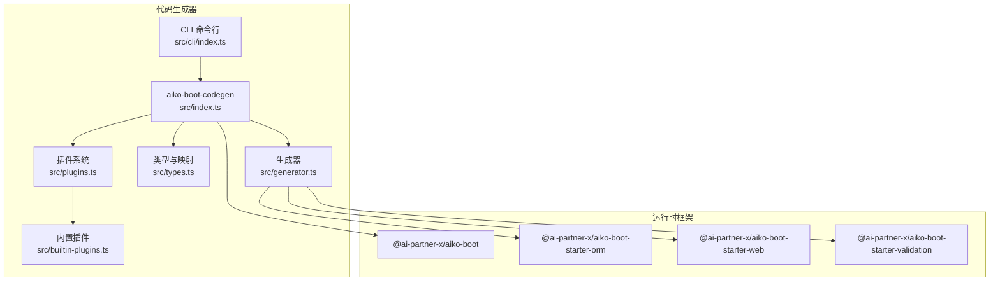
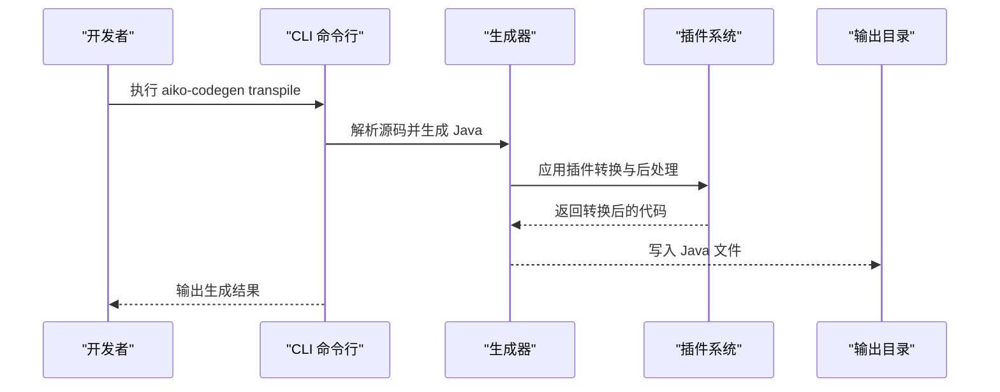
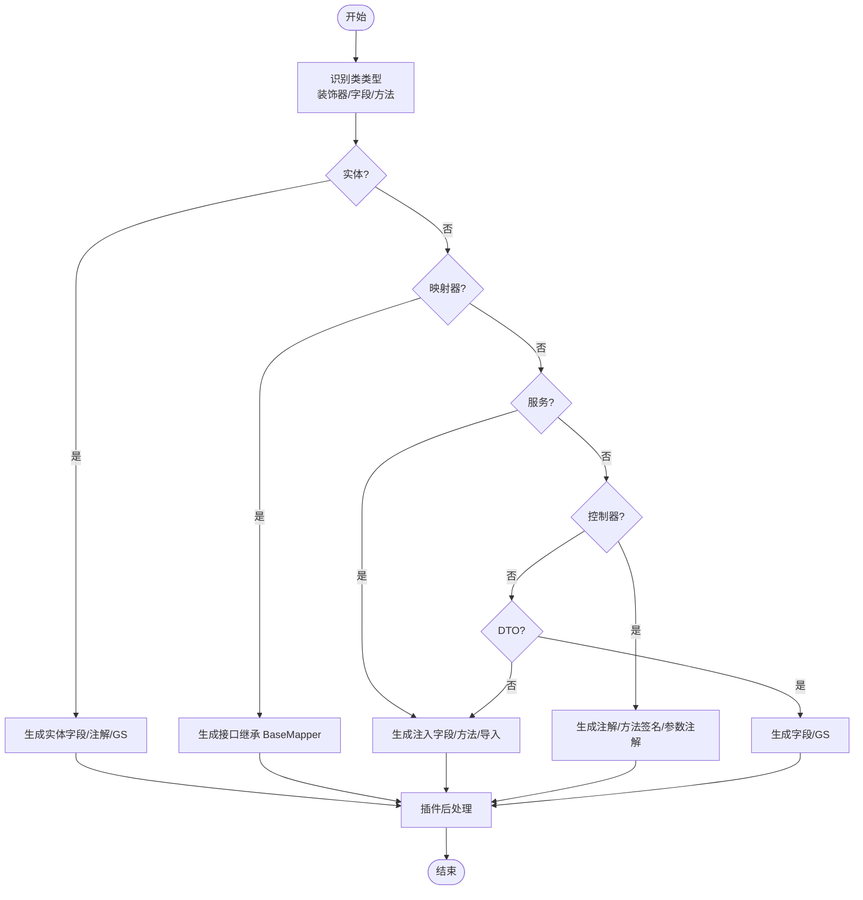
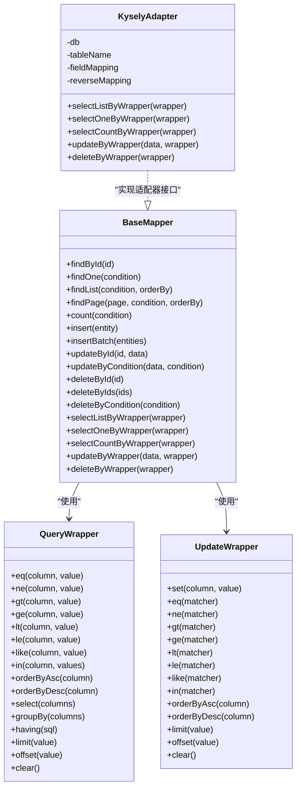
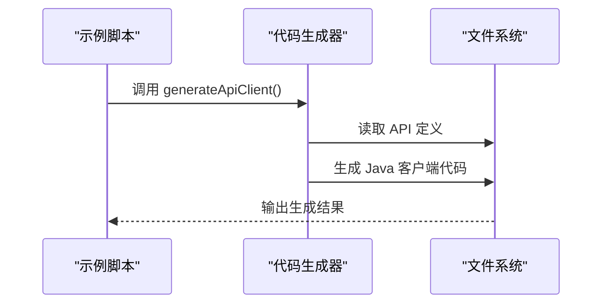
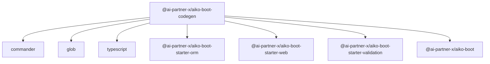

# Spring Boot 代码生成

<cite>
**本文引用的文件**
- [packages/aiko-boot-codegen/package.json](file://packages/aiko-boot-codegen/package.json)
- [packages/aiko-boot/package.json](file://packages/aiko-boot/package.json)
- [packages/aiko-boot-starter-orm/package.json](file://packages/aiko-boot-starter-orm/package.json)
- [packages/aiko-boot-starter-web/package.json](file://packages/aiko-boot-starter-web/package.json)
- [packages/aiko-boot-starter-validation/package.json](file://packages/aiko-boot-starter-validation/package.json)
- [packages/aiko-boot-codegen/src/index.ts](file://packages/aiko-boot-codegen/src/index.ts)
- [packages/aiko-boot-codegen/src/cli/index.ts](file://packages/aiko-boot-codegen/src/cli/index.ts)
- [packages/aiko-boot-codegen/src/types.ts](file://packages/aiko-boot-codegen/src/types.ts)
- [packages/aiko-boot-codegen/src/generator.ts](file://packages/aiko-boot-codegen/src/generator.ts)
- [packages/aiko-boot-codegen/src/plugins.ts](file://packages/aiko-boot-codegen/src/plugins.ts)
- [packages/aiko-boot-codegen/src/builtin-plugins.ts](file://packages/aiko-boot-codegen/src/builtin-plugins.ts)
- [packages/aiko-boot-starter-orm/src/decorators.ts](file://packages/aiko-boot-starter-orm/src/decorators.ts)
- [packages/aiko-boot-starter-orm/src/base-mapper.ts](file://packages/aiko-boot-starter-orm/src/base-mapper.ts)
- [packages/aiko-boot-starter-orm/src/wrapper.ts](file://packages/aiko-boot-starter-orm/src/wrapper.ts)
- [packages/aiko-boot-starter-orm/src/adapters/kysely-adapter.ts](file://packages/aiko-boot-starter-orm/src/adapters/kysely-adapter.ts)
- [app/examples/user-crud/packages/api/scripts/codegen.ts](file://app/examples/user-crud/packages/api/scripts/codegen.ts)
</cite>

## 目录
1. [简介](#简介)
2. [项目结构](#项目结构)
3. [核心组件](#核心组件)
4. [架构总览](#架构总览)
5. [详细组件分析](#详细组件分析)
6. [依赖关系分析](#依赖关系分析)
7. [性能考虑](#性能考虑)
8. [故障排除指南](#故障排除指南)
9. [结论](#结论)
10. [附录](#附录)

## 简介
本技术文档面向希望基于 TypeScript 实体快速生成完整 Spring Boot 项目的开发者。文档覆盖以下主题：
- 如何生成完整的 Spring Boot 项目结构（Maven 配置、依赖管理、项目布局）
- 内置插件系统：实体插件、映射器插件、服务插件、控制器插件等的自动生成机制
- 模板系统与代码生成规则的定制方法
- MyBatis-Plus 集成配置：实体映射、基础映射器、查询包装器的自动生成
- 从 TypeScript 实体到完整 Java Spring Boot 应用的端到端示例
- 项目配置定制与扩展插件开发指导

## 项目结构
该仓库采用多包工作区（monorepo）组织方式，核心与代码生成相关的关键模块如下：
- aiko-boot：核心框架与依赖注入能力
- aiko-boot-starter-orm：ORM 启动器，提供与 MyBatis-Plus 兼容的装饰器与适配器
- aiko-boot-starter-web：Web 启动器，提供注解式控制器与路由能力
- aiko-boot-starter-validation：验证启动器，提供基于 class-validator 的装饰器
- aiko-boot-codegen：TypeScript 到 Java 的代码生成器，含 CLI、插件系统与模板映射

图表来源
- [packages/aiko-boot-codegen/src/index.ts](file://packages/aiko-boot-codegen/src/index.ts#L1-L57)
- [packages/aiko-boot-codegen/src/cli/index.ts](file://packages/aiko-boot-codegen/src/cli/index.ts#L1-L43)
- [packages/aiko-boot-codegen/src/generator.ts](file://packages/aiko-boot-codegen/src/generator.ts#L82-L129)
- [packages/aiko-boot-codegen/src/types.ts](file://packages/aiko-boot-codegen/src/types.ts#L1-L56)
- [packages/aiko-boot-codegen/src/plugins.ts](file://packages/aiko-boot-codegen/src/plugins.ts)
- [packages/aiko-boot-codegen/src/builtin-plugins.ts](file://packages/aiko-boot-codegen/src/builtin-plugins.ts)
- [packages/aiko-boot/package.json](file://packages/aiko-boot/package.json#L1-L61)
- [packages/aiko-boot-starter-orm/package.json](file://packages/aiko-boot-starter-orm/package.json#L1-L55)
- [packages/aiko-boot-starter-web/package.json](file://packages/aiko-boot-starter-web/package.json#L1-L60)
- [packages/aiko-boot-starter-validation/package.json](file://packages/aiko-boot-starter-validation/package.json#L1-L41)

章节来源
- [packages/aiko-boot-codegen/src/index.ts](file://packages/aiko-boot-codegen/src/index.ts#L1-L57)
- [packages/aiko-boot-codegen/src/cli/index.ts](file://packages/aiko-boot-codegen/src/cli/index.ts#L1-L43)
- [packages/aiko-boot/package.json](file://packages/aiko-boot/package.json#L1-L61)
- [packages/aiko-boot-starter-orm/package.json](file://packages/aiko-boot-starter-orm/package.json#L1-L55)
- [packages/aiko-boot-starter-web/package.json](file://packages/aiko-boot-starter-web/package.json#L1-L60)
- [packages/aiko-boot-starter-validation/package.json](file://packages/aiko-boot-starter-validation/package.json#L1-L41)

## 核心组件
- 代码生成入口与导出
  - 导出解析器、生成器、客户端生成器、装饰器泛型转换器与 TSUP 插件
  - 提供 transpile API 将 TypeScript 源码转译为 Java 映射
- CLI 命令行工具
  - 支持 transpile 与 validate 子命令，可指定输出目录、包名、Lombok、Java 版本、Spring Boot 版本等
- 类型与映射
  - TypeScript 到 Java 的类型映射表
  - 装饰器映射表（Entity→@TableName、Mapper→@Mapper 等）
  - 校验注解映射表（required→@NotNull、email→@Email 等）
- 生成器
  - 根据类类型（实体、映射器、服务、控制器、DTO）生成对应 Java 结构
  - 自动推断导入、生成 getter/setter、处理方法注解与参数注解
- 插件系统
  - 可注册与应用插件，支持方法级转换与后处理
  - 内置插件：实体、映射器、校验、日期、服务、控制器、查询包装器等

章节来源
- [packages/aiko-boot-codegen/src/index.ts](file://packages/aiko-boot-codegen/src/index.ts#L1-L57)
- [packages/aiko-boot-codegen/src/cli/index.ts](file://packages/aiko-boot-codegen/src/cli/index.ts#L1-L43)
- [packages/aiko-boot-codegen/src/types.ts](file://packages/aiko-boot-codegen/src/types.ts#L1-L56)
- [packages/aiko-boot-codegen/src/generator.ts](file://packages/aiko-boot-codegen/src/generator.ts#L82-L129)
- [packages/aiko-boot-codegen/src/plugins.ts](file://packages/aiko-boot-codegen/src/plugins.ts)
- [packages/aiko-boot-codegen/src/builtin-plugins.ts](file://packages/aiko-boot-codegen/src/builtin-plugins.ts)

## 架构总览
下图展示了从 TypeScript 源码到 Java Spring Boot 代码的生成流程，以及与 ORM、Web、验证启动器的集成关系。

图表来源
- [packages/aiko-boot-codegen/src/cli/index.ts](file://packages/aiko-boot-codegen/src/cli/index.ts#L16-L28)
- [packages/aiko-boot-codegen/src/generator.ts](file://packages/aiko-boot-codegen/src/generator.ts#L124-L128)
- [packages/aiko-boot-codegen/src/plugins.ts](file://packages/aiko-boot-codegen/src/plugins.ts)

章节来源
- [packages/aiko-boot-codegen/src/cli/index.ts](file://packages/aiko-boot-codegen/src/cli/index.ts#L1-L43)
- [packages/aiko-boot-codegen/src/generator.ts](file://packages/aiko-boot-codegen/src/generator.ts#L124-L128)
- [packages/aiko-boot-codegen/src/plugins.ts](file://packages/aiko-boot-codegen/src/plugins.ts)

## 详细组件分析

### 生成器与类类型识别
- 类型识别逻辑
  - 依据装饰器名称判断实体、映射器、服务、控制器；无装饰器且存在字段则视为 DTO
- 生成策略
  - 实体：生成字段、注解与 getter/setter（可选 Lombok）
  - 映射器：生成继承 BaseMapper 的接口，并添加必要导入
  - 服务：生成注入字段、方法、导入实体与映射器、查询包装器
  - 控制器：生成注解、方法签名、参数注解（@PathVariable、@RequestParam、@RequestBody）、导入实体与服务
  - DTO：生成字段与 getter/setter（可选 Lombok）

图表来源
- [packages/aiko-boot-codegen/src/generator.ts](file://packages/aiko-boot-codegen/src/generator.ts#L143-L155)
- [packages/aiko-boot-codegen/src/generator.ts](file://packages/aiko-boot-codegen/src/generator.ts#L82-L129)
- [packages/aiko-boot-codegen/src/generator.ts](file://packages/aiko-boot-codegen/src/generator.ts#L349-L390)

章节来源
- [packages/aiko-boot-codegen/src/generator.ts](file://packages/aiko-boot-codegen/src/generator.ts#L82-L129)
- [packages/aiko-boot-codegen/src/generator.ts](file://packages/aiko-boot-codegen/src/generator.ts#L143-L155)
- [packages/aiko-boot-codegen/src/generator.ts](file://packages/aiko-boot-codegen/src/generator.ts#L349-L390)

### 类型与装饰器映射
- TypeScript 到 Java 类型映射
  - number → Integer（主键与常用数字优先 Long/Integer）
  - string → String
  - boolean → Boolean
  - Date → LocalDateTime
  - any/void/null/undefined → Object/void/null
- 装饰器映射
  - Entity/TableName → @TableName
  - Repository/Mapper → @Repository/@Mapper
  - Service → @Service
  - RestController → @RestController
  - 方法：GetMapping/PostMapping/PutMapping/DeleteMapping/PatchMapping → 对应 @*Mapping
  - 参数：PathVariable/RequestParam/RequestBody → 对应 @* 注解
  - 字段：DbField/Field → @TableField/忽略
  - Validation → 转换为 Jakarta Validation 注解
- 校验注解映射
  - required → @NotNull
  - email → @Email
  - min/max → @Min/@Max

章节来源
- [packages/aiko-boot-codegen/src/types.ts](file://packages/aiko-boot-codegen/src/types.ts#L8-L17)
- [packages/aiko-boot-codegen/src/types.ts](file://packages/aiko-boot-codegen/src/types.ts#L22-L46)
- [packages/aiko-boot-codegen/src/types.ts](file://packages/aiko-boot-codegen/src/types.ts#L51-L56)

### 插件系统与内置插件
- 插件注册与应用
  - 默认注册内置插件集合
  - 支持方法级转换与后处理阶段的统一处理
- 内置插件类别
  - 实体插件：实体字段与注解生成
  - 映射器插件：Mapper 接口生成与导入
  - 服务插件：注入字段、方法与查询包装器
  - 控制器插件：注解与参数注解生成
  - 校验插件：DTO 字段校验注解生成
  - 日期插件：时间类型处理
  - 查询包装器插件：QueryWrapper/UpdateWrapper 自动生成

章节来源
- [packages/aiko-boot-codegen/src/plugins.ts](file://packages/aiko-boot-codegen/src/plugins.ts)
- [packages/aiko-boot-codegen/src/builtin-plugins.ts](file://packages/aiko-boot-codegen/src/builtin-plugins.ts)

### MyBatis-Plus 集成与查询包装器
- 装饰器层（运行时与转译兼容）
  - @Entity/@TableName：实体元数据定义
  - @TableId/@TableField：主键与字段映射
  - @Mapper：标记映射器接口，自动注入与适配器设置
- 基础映射器（BaseMapper）
  - 提供 CRUD 与分页接口，适配器模式解耦具体数据库实现
  - 支持 QueryWrapper/UpdateWrapper 查询风格
- 查询包装器（QueryWrapper/UpdateWrapper）
  - 提供链式条件构建、排序、分组、限制与偏移
  - LambdaQueryWrapper 作为类型安全别名
- 适配器实现（KyselyAdapter）
  - 将 QueryWrapper 条件转换为 Kysely 查询
  - 支持字段映射、分页与排序

图表来源
- [packages/aiko-boot-starter-orm/src/base-mapper.ts](file://packages/aiko-boot-starter-orm/src/base-mapper.ts#L1-L383)
- [packages/aiko-boot-starter-orm/src/wrapper.ts](file://packages/aiko-boot-starter-orm/src/wrapper.ts#L326-L368)
- [packages/aiko-boot-starter-orm/src/adapters/kysely-adapter.ts](file://packages/aiko-boot-starter-orm/src/adapters/kysely-adapter.ts#L1-L200)

章节来源
- [packages/aiko-boot-starter-orm/src/decorators.ts](file://packages/aiko-boot-starter-orm/src/decorators.ts#L68-L85)
- [packages/aiko-boot-starter-orm/src/decorators.ts](file://packages/aiko-boot-starter-orm/src/decorators.ts#L92-L123)
- [packages/aiko-boot-starter-orm/src/decorators.ts](file://packages/aiko-boot-starter-orm/src/decorators.ts#L140-L193)
- [packages/aiko-boot-starter-orm/src/base-mapper.ts](file://packages/aiko-boot-starter-orm/src/base-mapper.ts#L207-L352)
- [packages/aiko-boot-starter-orm/src/wrapper.ts](file://packages/aiko-boot-starter-orm/src/wrapper.ts#L326-L368)
- [packages/aiko-boot-starter-orm/src/adapters/kysely-adapter.ts](file://packages/aiko-boot-starter-orm/src/adapters/kysely-adapter.ts#L1-L200)

### 从 TypeScript 实体到 Spring Boot 应用的示例
- 示例脚本
  - 使用代码生成器生成前端 API 客户端代码
- 生成流程
  - CLI 接收源码路径、输出目录、包名、版本等参数
  - 解析 TypeScript 源码，识别类类型与装饰器
  - 应用插件生成 Java 类、导入与注解
  - 写入目标目录，完成项目骨架生成

图表来源
- [app/examples/user-crud/packages/api/scripts/codegen.ts](file://app/examples/user-crud/packages/api/scripts/codegen.ts#L1-L4)
- [packages/aiko-boot-codegen/src/index.ts](file://packages/aiko-boot-codegen/src/index.ts#L13)

章节来源
- [app/examples/user-crud/packages/api/scripts/codegen.ts](file://app/examples/user-crud/packages/api/scripts/codegen.ts#L1-L4)
- [packages/aiko-boot-codegen/src/index.ts](file://packages/aiko-boot-codegen/src/index.ts#L13)

## 依赖关系分析
- 代码生成器依赖
  - commander：命令行解析
  - glob：文件匹配
  - typescript：类型系统与编译
- 运行时框架依赖
  - aiko-boot：DI、装饰器与自动配置
  - aiko-boot-starter-orm：ORM 装饰器与适配器
  - aiko-boot-starter-web：Web 注解与路由
  - aiko-boot-starter-validation：验证装饰器

图表来源
- [packages/aiko-boot-codegen/package.json](file://packages/aiko-boot-codegen/package.json#L24-L32)
- [packages/aiko-boot-starter-orm/package.json](file://packages/aiko-boot-starter-orm/package.json#L24-L29)
- [packages/aiko-boot-starter-web/package.json](file://packages/aiko-boot-starter-web/package.json#L32-L36)
- [packages/aiko-boot-starter-validation/package.json](file://packages/aiko-boot-starter-validation/package.json#L21-L26)
- [packages/aiko-boot/package.json](file://packages/aiko-boot/package.json#L35-L38)

章节来源
- [packages/aiko-boot-codegen/package.json](file://packages/aiko-boot-codegen/package.json#L1-L34)
- [packages/aiko-boot-starter-orm/package.json](file://packages/aiko-boot-starter-orm/package.json#L1-L55)
- [packages/aiko-boot-starter-web/package.json](file://packages/aiko-boot-starter-web/package.json#L1-L60)
- [packages/aiko-boot-starter-validation/package.json](file://packages/aiko-boot-starter-validation/package.json#L1-L41)
- [packages/aiko-boot/package.json](file://packages/aiko-boot/package.json#L1-L61)

## 性能考虑
- 解析与生成
  - 使用装饰器元数据与类型映射减少运行时开销
  - 插件后处理在生成完成后一次性应用，避免重复计算
- 适配器模式
  - BaseMapper 抽象与适配器实现解耦，便于替换底层 ORM 引擎
- 并发与缓存
  - CLI 支持批量源码处理，建议结合文件系统缓存与增量生成策略

## 故障排除指南
- CLI 参数校验
  - 确认源码路径存在且可读
  - 指定正确的输出目录与包名
- 装饰器兼容性
  - 确保实体与映射器使用受支持的装饰器组合
  - 若出现适配器未设置问题，检查数据库初始化状态
- 插件冲突
  - 若生成结果异常，尝试禁用特定插件或调整插件顺序
- 类型映射问题
  - 对于特殊类型，可在映射表中补充自定义映射规则

章节来源
- [packages/aiko-boot-codegen/src/cli/index.ts](file://packages/aiko-boot-codegen/src/cli/index.ts#L16-L28)
- [packages/aiko-boot-starter-orm/src/decorators.ts](file://packages/aiko-boot-starter-orm/src/decorators.ts#L158-L193)
- [packages/aiko-boot-starter-orm/src/base-mapper.ts](file://packages/aiko-boot-starter-orm/src/base-mapper.ts#L207-L352)

## 结论
本项目提供了从 TypeScript 到 Java Spring Boot 的完整代码生成方案，结合装饰器元数据与插件系统，能够高效生成实体、映射器、服务与控制器等模块，并与 MyBatis-Plus 生态无缝衔接。通过 CLI 与可扩展的插件体系，用户可以快速搭建符合规范的后端工程骨架，并在此基础上进行二次开发与定制。

## 附录
- CLI 常用命令
  - aiko-codegen transpile <source> -o <dir> -p <package> [--lombok] [--java-version] [--spring-boot] [--dry-run] [-v]
  - aiko-codegen validate <source> [-v]
- 生成规则定制
  - 修改类型映射表与装饰器映射表以适配业务需求
  - 编写自定义插件并注册到默认插件注册表
- 扩展插件开发
  - 实现 TranspilePlugin 接口，提供方法级转换与后处理逻辑
  - 在内置插件集合中注册新插件，确保生成流程中被调用

章节来源
- [packages/aiko-boot-codegen/src/cli/index.ts](file://packages/aiko-boot-codegen/src/cli/index.ts#L16-L41)
- [packages/aiko-boot-codegen/src/types.ts](file://packages/aiko-boot-codegen/src/types.ts#L8-L46)
- [packages/aiko-boot-codegen/src/plugins.ts](file://packages/aiko-boot-codegen/src/plugins.ts)
- [packages/aiko-boot-codegen/src/builtin-plugins.ts](file://packages/aiko-boot-codegen/src/builtin-plugins.ts)