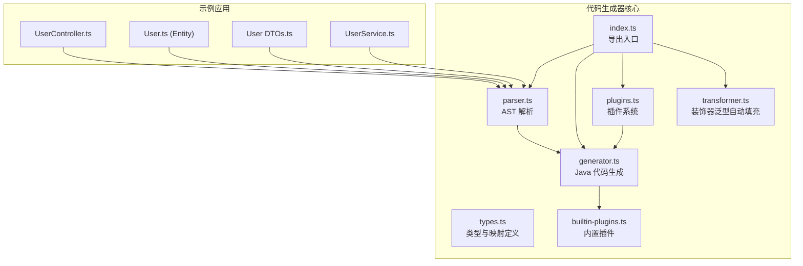
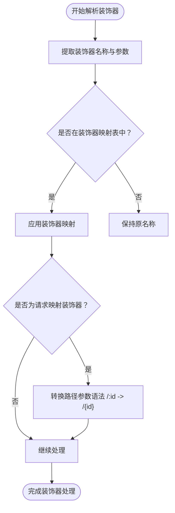
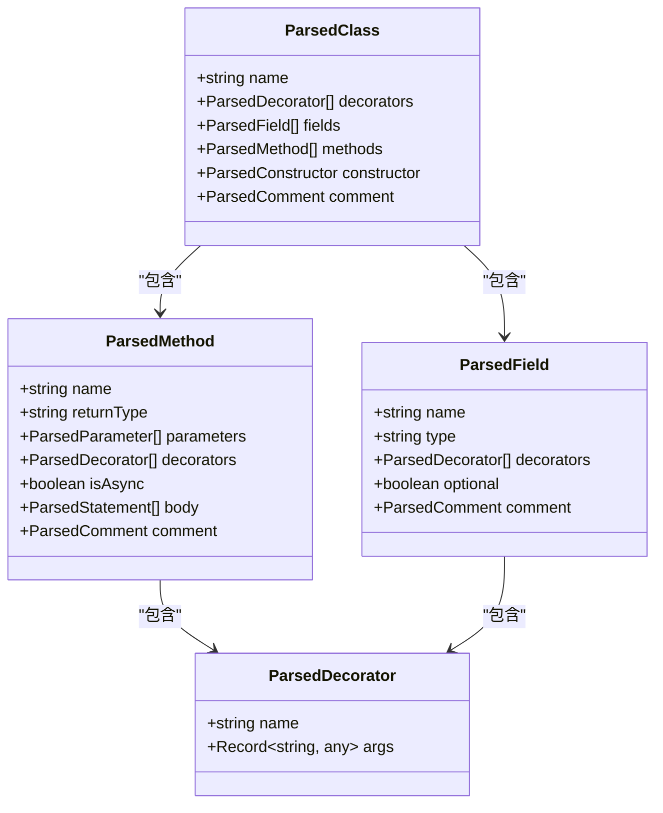
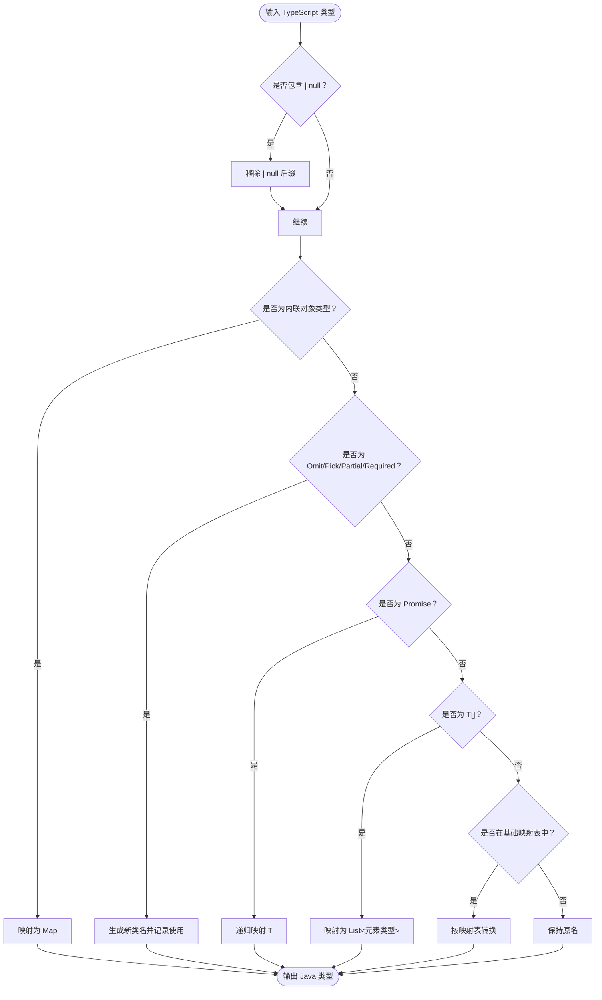
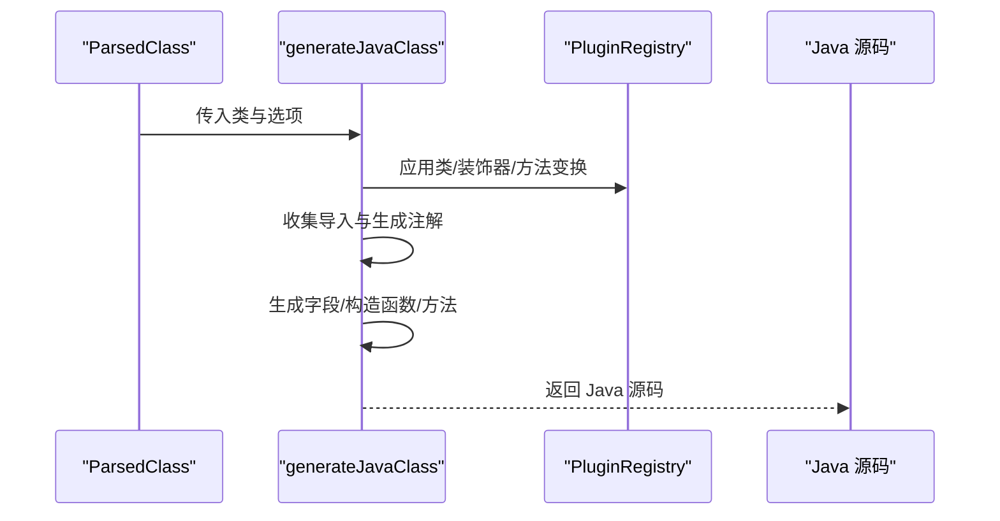
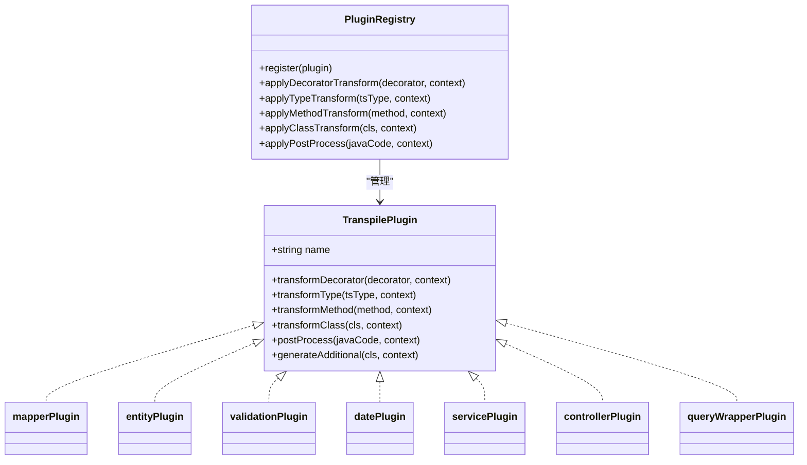
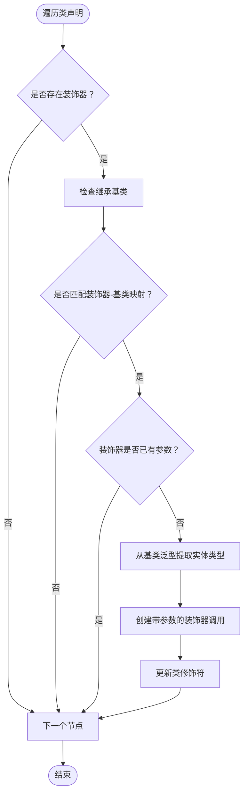
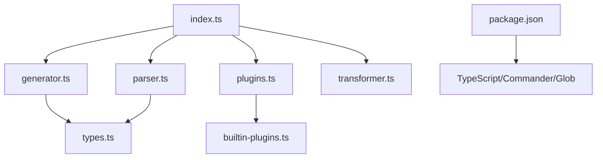

# TypeScript 到 Java 转换

<cite>
**本文档引用的文件**
- [packages/aiko-boot-codegen/src/index.ts](file://packages/aiko-boot-codegen/src/index.ts)
- [packages/aiko-boot-codegen/src/types.ts](file://packages/aiko-boot-codegen/src/types.ts)
- [packages/aiko-boot-codegen/src/parser.ts](file://packages/aiko-boot-codegen/src/parser.ts)
- [packages/aiko-boot-codegen/src/generator.ts](file://packages/aiko-boot-codegen/src/generator.ts)
- [packages/aiko-boot-codegen/src/plugins.ts](file://packages/aiko-boot-codegen/src/plugins.ts)
- [packages/aiko-boot-codegen/src/builtin-plugins.ts](file://packages/aiko-boot-codegen/src/builtin-plugins.ts)
- [packages/aiko-boot-codegen/src/transformer.ts](file://packages/aiko-boot-codegen/src/transformer.ts)
- [packages/aiko-boot-codegen/package.json](file://packages/aiko-boot-codegen/package.json)
- [app/examples/user-crud/packages/api/src/controller/user.controller.ts](file://app/examples/user-crud/packages/api/src/controller/user.controller.ts)
- [app/examples/user-crud/packages/api/src/entity/user.entity.ts](file://app/examples/user-crud/packages/api/src/entity/user.entity.ts)
- [app/examples/user-crud/packages/api/src/dto/user.dto.ts](file://app/examples/user-crud/packages/api/src/dto/user.dto.ts)
- [app/examples/user-crud/packages/api/src/service/user.service.ts](file://app/examples/user-crud/packages/api/src/service/user.service.ts)
</cite>

## 目录
1. [简介](#简介)
2. [项目结构](#项目结构)
3. [核心组件](#核心组件)
4. [架构总览](#架构总览)
5. [详细组件分析](#详细组件分析)
6. [依赖分析](#依赖分析)
7. [性能考虑](#性能考虑)
8. [故障排除指南](#故障排除指南)
9. [结论](#结论)
10. [附录](#附录)

## 简介
本项目提供 TypeScript 到 Java 的代码转换能力，专注于 Spring Boot + MyBatis-Plus 生态下的后端代码生成。其核心目标包括：
- 解析 TypeScript 装饰器并映射为 Java 注解（如 @Entity、@Service、@RestController、@Transactional 等）
- 提取类、属性、方法签名与注解参数，并进行类型映射与导入收集
- 通过插件系统扩展转换行为，支持自定义装饰器、类型与方法转换
- 生成符合 Spring Boot 与 MyBatis-Plus 规范的 Java 类与注解

## 项目结构
核心代码位于 aiko-boot-codegen 包中，包含解析器、生成器、类型定义、插件系统与装饰器泛型自动填充工具；示例工程位于 app/examples/user-crud 下，展示了完整的 TypeScript 控制器、实体、DTO、服务层与转换后的 Java 产物。



**图表来源**
- [packages/aiko-boot-codegen/src/index.ts](file://packages/aiko-boot-codegen/src/index.ts#L1-L57)
- [packages/aiko-boot-codegen/src/types.ts](file://packages/aiko-boot-codegen/src/types.ts#L1-L478)
- [packages/aiko-boot-codegen/src/parser.ts](file://packages/aiko-boot-codegen/src/parser.ts#L1-L660)
- [packages/aiko-boot-codegen/src/generator.ts](file://packages/aiko-boot-codegen/src/generator.ts#L1-L1091)
- [packages/aiko-boot-codegen/src/plugins.ts](file://packages/aiko-boot-codegen/src/plugins.ts#L1-L172)
- [packages/aiko-boot-codegen/src/builtin-plugins.ts](file://packages/aiko-boot-codegen/src/builtin-plugins.ts#L1-L190)
- [packages/aiko-boot-codegen/src/transformer.ts](file://packages/aiko-boot-codegen/src/transformer.ts#L1-L217)

**章节来源**
- [packages/aiko-boot-codegen/src/index.ts](file://packages/aiko-boot-codegen/src/index.ts#L1-L57)
- [packages/aiko-boot-codegen/src/types.ts](file://packages/aiko-boot-codegen/src/types.ts#L1-L478)
- [packages/aiko-boot-codegen/package.json](file://packages/aiko-boot-codegen/package.json#L1-L34)

## 核心组件
- 类型与映射定义：提供 TypeScript 到 Java 的基础类型映射、装饰器映射、验证注解映射以及模块导入映射。
- AST 解析器：基于 TypeScript 编译器解析源码，提取类、接口、装饰器、字段、方法、参数、注释与导入信息。
- 代码生成器：根据解析结果生成 Java 类，处理注解、字段、构造函数、方法体与导入集合。
- 插件系统：提供装饰器、类型、方法、类级别的转换钩子，支持插件注册与链式变换。
- 装饰器泛型自动填充：在构建阶段自动将 @Mapper() + extends BaseMapper<User> 转换为 @Mapper(User)，保持开发简洁同时保留完整类型信息。

**章节来源**
- [packages/aiko-boot-codegen/src/types.ts](file://packages/aiko-boot-codegen/src/types.ts#L1-L478)
- [packages/aiko-boot-codegen/src/parser.ts](file://packages/aiko-boot-codegen/src/parser.ts#L1-L660)
- [packages/aiko-boot-codegen/src/generator.ts](file://packages/aiko-boot-codegen/src/generator.ts#L1-L1091)
- [packages/aiko-boot-codegen/src/plugins.ts](file://packages/aiko-boot-codegen/src/plugins.ts#L1-L172)
- [packages/aiko-boot-codegen/src/transformer.ts](file://packages/aiko-boot-codegen/src/transformer.ts#L1-L217)

## 架构总览
下图展示了从 TypeScript 源码到 Java 代码的完整转换流程，包括解析、插件变换、类型映射与生成。

```mermaid
sequenceDiagram
participant TS as "TypeScript 源码"
participant PAR as "解析器(parser)"
participant PLG as "插件系统(plugins)"
participant GEN as "生成器(generator)"
participant OUT as "Java 输出"
TS->>PAR : 读取并解析 AST
PAR-->>TS : ParsedSourceFile/ParsedClass[]
PAR->>PLG : 应用装饰器/类型/方法/类变换
PLG-->>PAR : 变换后的节点
PAR->>GEN : 传递解析结果与选项
GEN->>GEN : 类型映射/注解生成/导入收集
GEN-->>OUT : Java 源码字符串
```

**图表来源**
- [packages/aiko-boot-codegen/src/parser.ts](file://packages/aiko-boot-codegen/src/parser.ts#L23-L65)
- [packages/aiko-boot-codegen/src/plugins.ts](file://packages/aiko-boot-codegen/src/plugins.ts#L105-L152)
- [packages/aiko-boot-codegen/src/generator.ts](file://packages/aiko-boot-codegen/src/generator.ts#L29-L129)

## 详细组件分析

### 装饰器解析与映射机制
- 解析阶段：遍历 AST，提取类、字段、方法上的装饰器及其参数（支持对象字面量与字符串/数字/布尔/原始值）。
- 映射阶段：将 TypeScript 装饰器名称映射到 Java 注解（如 Entity → @TableName、Service → @Service 等），并对路径参数、事务注解等进行转换。
- 插件扩展：通过 transformDecorator 钩子允许自定义装饰器转换逻辑（例如将 @Mapper(User) 转换为 @Mapper() 并由生成器推断实体类型）。



**图表来源**
- [packages/aiko-boot-codegen/src/parser.ts](file://packages/aiko-boot-codegen/src/parser.ts#L235-L279)
- [packages/aiko-boot-codegen/src/types.ts](file://packages/aiko-boot-codegen/src/types.ts#L22-L46)
- [packages/aiko-boot-codegen/src/builtin-plugins.ts](file://packages/aiko-boot-codegen/src/builtin-plugins.ts#L113-L130)

**章节来源**
- [packages/aiko-boot-codegen/src/parser.ts](file://packages/aiko-boot-codegen/src/parser.ts#L235-L279)
- [packages/aiko-boot-codegen/src/types.ts](file://packages/aiko-boot-codegen/src/types.ts#L22-L46)
- [packages/aiko-boot-codegen/src/builtin-plugins.ts](file://packages/aiko-boot-codegen/src/builtin-plugins.ts#L113-L130)

### 元数据提取与转换
- 类信息：类名、装饰器、字段、方法、构造函数与类级注释（JSDoc → Javadoc）。
- 属性信息：字段名、类型、可选性、字段级注释与验证装饰器。
- 方法签名：方法名、返回类型（Promise 去除外层）、参数（含类型与参数装饰器）、异步标记与方法体。
- 注解参数：装饰器参数对象中的键值对被提取并转换为 Java 注解参数。



**图表来源**
- [packages/aiko-boot-codegen/src/types.ts](file://packages/aiko-boot-codegen/src/types.ts#L239-L282)

**章节来源**
- [packages/aiko-boot-codegen/src/types.ts](file://packages/aiko-boot-codegen/src/types.ts#L239-L282)
- [packages/aiko-boot-codegen/src/parser.ts](file://packages/aiko-boot-codegen/src/parser.ts#L170-L340)

### 类型映射系统
- 基础类型映射：number → Integer（主键字段特殊处理为 Long）、string → String、boolean → Boolean、Date → LocalDateTime、any → Object、void → void、null/undefined → null。
- 数组与泛型：数组类型映射为 List<元素类型>；Promise<T> 去除外层包装；内联对象类型映射为 Map<String, Object>。
- 泛型工具类型：Omit、Pick、Partial、Required 将生成新的 DTO 类名并记录使用情况，供后续批量生成。
- 特殊处理：智能数字类型映射（id 字段默认 Long，年龄等常用数值字段默认 Integer）。



**图表来源**
- [packages/aiko-boot-codegen/src/generator.ts](file://packages/aiko-boot-codegen/src/generator.ts#L725-L790)
- [packages/aiko-boot-codegen/src/types.ts](file://packages/aiko-boot-codegen/src/types.ts#L8-L17)

**章节来源**
- [packages/aiko-boot-codegen/src/generator.ts](file://packages/aiko-boot-codegen/src/generator.ts#L725-L790)
- [packages/aiko-boot-codegen/src/types.ts](file://packages/aiko-boot-codegen/src/types.ts#L8-L17)

### 代码生成器工作流程
- 类型判定：根据装饰器判断实体、仓库、服务、控制器或 DTO。
- 注解生成：类注解（如 @TableName、@Service、@RestController、@RequestMapping）、字段注解（如 @TableId、@TableField、验证注解）、方法注解（如 @GetMapping 等）。
- 字段与构造函数：实体与 DTO 生成私有字段与 getter/setter（若未启用 Lombok）；服务/控制器生成注入字段与构造函数。
- 方法体生成：将 TypeScript 方法体转换为 Java 语句（支持 return、throw、变量声明、if/for/块、表达式等），并自动添加 @Valid 注解。
- 导入收集：根据装饰器与类型使用情况动态收集 Java import 语句，支持模块级与命名导入映射。



**图表来源**
- [packages/aiko-boot-codegen/src/generator.ts](file://packages/aiko-boot-codegen/src/generator.ts#L29-L129)
- [packages/aiko-boot-codegen/src/plugins.ts](file://packages/aiko-boot-codegen/src/plugins.ts#L105-L152)

**章节来源**
- [packages/aiko-boot-codegen/src/generator.ts](file://packages/aiko-boot-codegen/src/generator.ts#L29-L129)
- [packages/aiko-boot-codegen/src/plugins.ts](file://packages/aiko-boot-codegen/src/plugins.ts#L105-L152)

### 插件系统与内置插件
- 插件接口：提供 transformDecorator、transformType、transformMethod、transformClass、postProcess、generateAdditional 等钩子。
- 内置插件：
  - Mapper 插件：将 @Mapper(User) 转换为 @Mapper()（Java 通过 BaseMapper<T> 推断类型）。
  - Entity 插件：将 @Entity 映射为 @TableName。
  - Validation 插件：将 TypeScript 验证装饰器映射为 Jakarta Validation 注解。
  - Date 插件：将 Date 类型映射为 LocalDateTime。
  - Service 插件：处理依赖注入相关逻辑。
  - Controller 插件：转换请求映射路径参数语法。
  - QueryWrapper 插件：保留 QueryWrapper/UpdateWrapper 类型语法。



**图表来源**
- [packages/aiko-boot-codegen/src/plugins.ts](file://packages/aiko-boot-codegen/src/plugins.ts#L26-L82)
- [packages/aiko-boot-codegen/src/builtin-plugins.ts](file://packages/aiko-boot-codegen/src/builtin-plugins.ts#L13-L165)

**章节来源**
- [packages/aiko-boot-codegen/src/plugins.ts](file://packages/aiko-boot-codegen/src/plugins.ts#L26-L82)
- [packages/aiko-boot-codegen/src/builtin-plugins.ts](file://packages/aiko-boot-codegen/src/builtin-plugins.ts#L13-L165)

### 装饰器泛型自动填充
- 目标：在开发时使用 @Mapper() + extends BaseMapper<User>，在构建时自动转换为 @Mapper(User)，保持开发简洁同时保留类型信息。
- 实现：遍历类声明，检查继承的基类是否匹配映射表（如 Mapper → BaseMapper），若装饰器无参数则自动注入实体类型作为参数。



**图表来源**
- [packages/aiko-boot-codegen/src/transformer.ts](file://packages/aiko-boot-codegen/src/transformer.ts#L32-L130)

**章节来源**
- [packages/aiko-boot-codegen/src/transformer.ts](file://packages/aiko-boot-codegen/src/transformer.ts#L32-L130)

### 转换示例与对应关系
以下示例展示常见 TypeScript 语法到 Java 语法的对应关系（基于示例工程）：

- 控制器注解与路径参数
  - TypeScript：@RestController({ path: '/users' }) → Java：@RestController + @RequestMapping("/users")
  - TypeScript：@GetMapping('/search') → Java：@GetMapping("/search")
  - TypeScript：@PathVariable('id') → Java：@PathVariable("id")

- 服务层注解与事务
  - TypeScript：@Service() → Java：@Service
  - TypeScript：@Transactional() → Java：@Transactional

- 实体注解
  - TypeScript：@Entity({ tableName: 'sys_user' }) → Java：@TableName("sys_user")（或 @TableName）
  - TypeScript：@TableId({ type: 'AUTO' }) → Java：@TableId(type = IdType.AUTO)
  - TypeScript：@TableField({ column: 'user_name' }) → Java：@TableField("user_name")

- DTO 验证注解
  - TypeScript：@IsNotEmpty(...) → Java：@NotNull
  - TypeScript：@Length(...) → Java：@Size(min = ..., max = ...)
  - TypeScript：@Min(...) / @Max(...) → Java：@Min(...) / @Max(...)

- 方法与参数
  - TypeScript：async search(...) → Java：public UserSearchResultDto search(...)
  - TypeScript：@RequestBody() 自动添加 @Valid 与 @RequestBody
  - TypeScript：方法体中的 QueryWrapper/UpdateWrapper 语法保留为 Java 语法

**章节来源**
- [app/examples/user-crud/packages/api/src/controller/user.controller.ts](file://app/examples/user-crud/packages/api/src/controller/user.controller.ts#L30-L169)
- [app/examples/user-crud/packages/api/src/entity/user.entity.ts](file://app/examples/user-crud/packages/api/src/entity/user.entity.ts#L3-L22)
- [app/examples/user-crud/packages/api/src/dto/user.dto.ts](file://app/examples/user-crud/packages/api/src/dto/user.dto.ts#L4-L104)
- [app/examples/user-crud/packages/api/src/service/user.service.ts](file://app/examples/user-crud/packages/api/src/service/user.service.ts#L30-L250)

## 依赖分析
- 内部依赖：index.ts 导出解析器、生成器、插件系统与 CLI；types.ts 定义类型与映射；parser.ts 与 generator.ts 协作生成 Java 代码；plugins.ts 与 builtin-plugins.ts 提供扩展能力；transformer.ts 提供装饰器泛型自动填充。
- 外部依赖：TypeScript 编译器用于 AST 解析；Commander 与 Glob 用于 CLI 工具与文件扫描。



**图表来源**
- [packages/aiko-boot-codegen/src/index.ts](file://packages/aiko-boot-codegen/src/index.ts#L6-L15)
- [packages/aiko-boot-codegen/src/generator.ts](file://packages/aiko-boot-codegen/src/generator.ts#L5-L9)
- [packages/aiko-boot-codegen/src/plugins.ts](file://packages/aiko-boot-codegen/src/plugins.ts#L1-L5)
- [packages/aiko-boot-codegen/src/transformer.ts](file://packages/aiko-boot-codegen/src/transformer.ts#L9)
- [packages/aiko-boot-codegen/package.json](file://packages/aiko-boot-codegen/package.json#L24-L28)

**章节来源**
- [packages/aiko-boot-codegen/src/index.ts](file://packages/aiko-boot-codegen/src/index.ts#L6-L15)
- [packages/aiko-boot-codegen/package.json](file://packages/aiko-boot-codegen/package.json#L24-L28)

## 性能考虑
- AST 解析：使用 TypeScript 编译器一次性解析源文件，避免重复扫描。
- 插件链：插件变换按顺序执行，建议仅在必要时注册插件，减少不必要的处理开销。
- 类型映射缓存：对于重复出现的类型映射，可在上层缓存结果以减少重复计算。
- 导入收集：通过集合去重与排序，确保生成的 import 语句简洁高效。

## 故障排除指南
- 装饰器未生效：确认装饰器名称是否在映射表中，或是否需要通过插件进行转换（如 Mapper 插件会移除实体参数）。
- 类型映射异常：检查类型映射表与泛型工具类型处理逻辑，确保数组、Promise、内联对象与工具类型得到正确处理。
- 注解参数缺失：检查装饰器参数对象是否被正确解析（对象字面量、字符串、数字、布尔），并在生成阶段正确输出。
- 路径参数不匹配：确认控制器插件是否正确将 /:id 转换为 /{id}。
- 导入缺失：检查 IMPORT_MAPPING 与 collectImportsFromParsed 是否覆盖了所需的 Java import。

**章节来源**
- [packages/aiko-boot-codegen/src/types.ts](file://packages/aiko-boot-codegen/src/types.ts#L63-L102)
- [packages/aiko-boot-codegen/src/generator.ts](file://packages/aiko-boot-codegen/src/generator.ts#L233-L344)
- [packages/aiko-boot-codegen/src/builtin-plugins.ts](file://packages/aiko-boot-codegen/src/builtin-plugins.ts#L113-L130)

## 结论
本项目通过完善的解析、映射与生成机制，实现了 TypeScript 到 Java 的高保真转换，特别适用于 Spring Boot + MyBatis-Plus 的后端开发场景。借助插件系统与装饰器泛型自动填充，开发者可以灵活扩展转换行为并保持开发体验与运行时类型信息的一致性。

## 附录
- 转换配置选项
  - outDir：输出目录
  - packageName：Java 包名
  - javaVersion：Java 版本（11/17/21）
  - springBootVersion：Spring Boot 版本
  - useLombok：是否生成 Lombok 注解（如 @Data）

- 自定义转换规则
  - 通过实现 TranspilePlugin 接口，在 transformDecorator、transformType、transformMethod、transformClass 中编写自定义逻辑
  - 使用 PluginRegistry 注册插件，或通过 getPluginsByName 获取内置插件组合

**章节来源**
- [packages/aiko-boot-codegen/src/types.ts](file://packages/aiko-boot-codegen/src/types.ts#L155-L166)
- [packages/aiko-boot-codegen/src/plugins.ts](file://packages/aiko-boot-codegen/src/plugins.ts#L26-L82)
- [packages/aiko-boot-codegen/src/builtin-plugins.ts](file://packages/aiko-boot-codegen/src/builtin-plugins.ts#L171-L189)