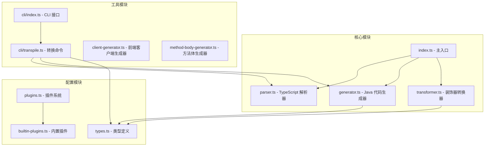
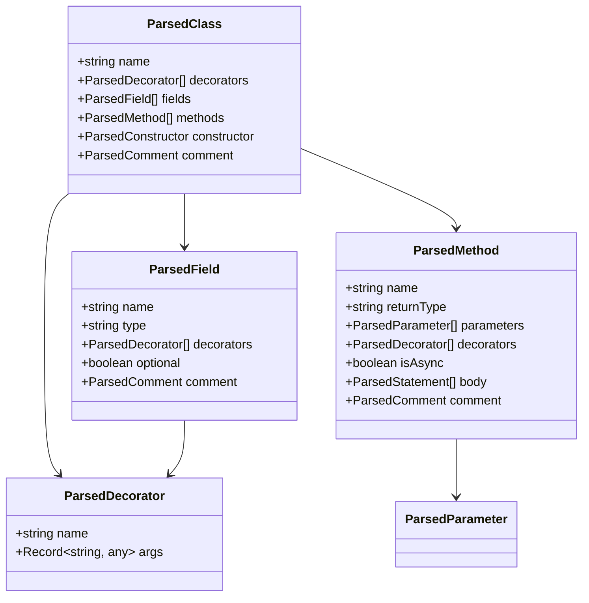
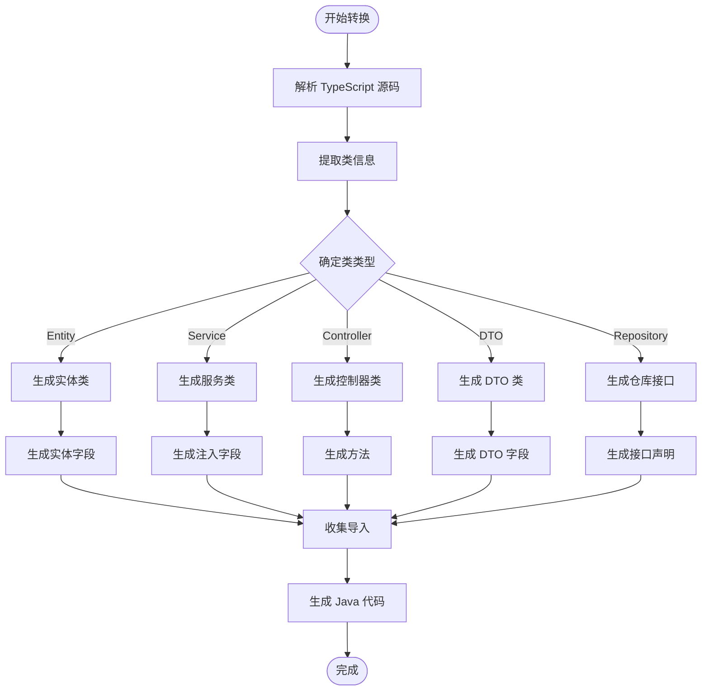
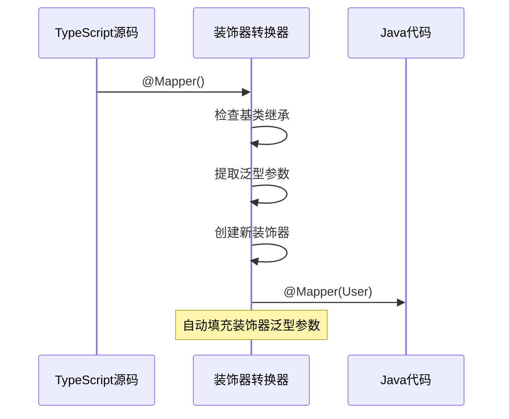
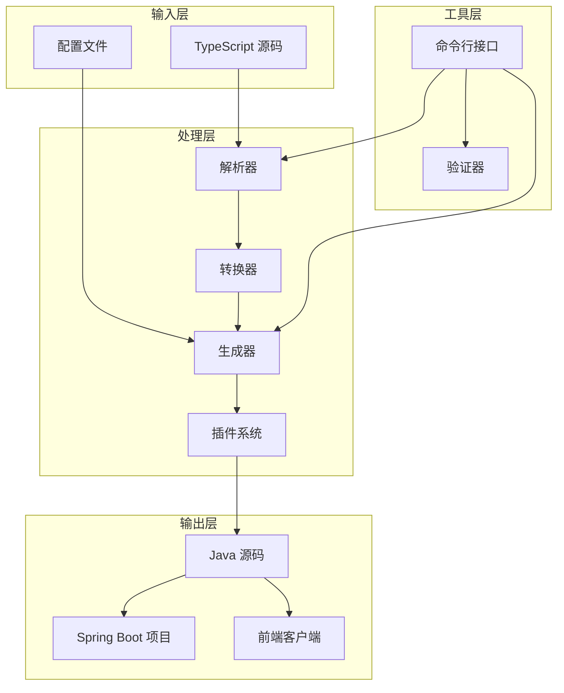
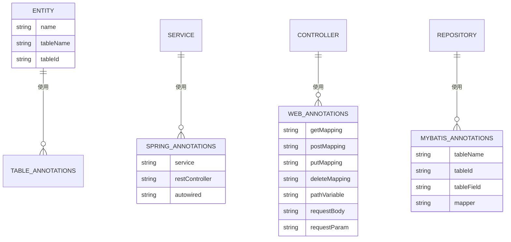
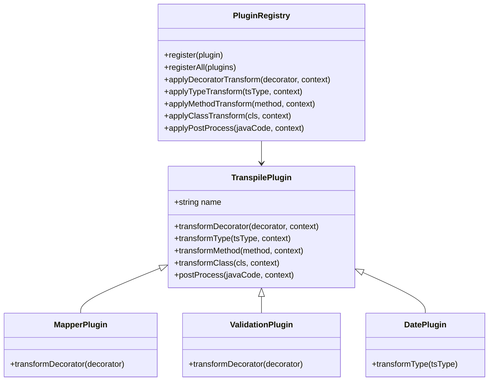
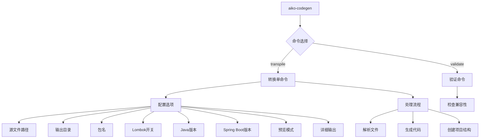

# 代码生成器 (aiko-boot-codegen) 技术文档

<cite>
**本文档引用的文件**
- [packages/aiko-boot-codegen/src/index.ts](file://packages/aiko-boot-codegen/src/index.ts)
- [packages/aiko-boot-codegen/src/parser.ts](file://packages/aiko-boot-codegen/src/parser.ts)
- [packages/aiko-boot-codegen/src/generator.ts](file://packages/aiko-boot-codegen/src/generator.ts)
- [packages/aiko-boot-codegen/src/transformer.ts](file://packages/aiko-boot-codegen/src/transformer.ts)
- [packages/aiko-boot-codegen/src/types.ts](file://packages/aiko-boot-codegen/src/types.ts)
- [packages/aiko-boot-codegen/src/plugins.ts](file://packages/aiko-boot-codegen/src/plugins.ts)
- [packages/aiko-boot-codegen/src/builtin-plugins.ts](file://packages/aiko-boot-codegen/src/builtin-plugins.ts)
- [packages/aiko-boot-codegen/src/method-body-generator.ts](file://packages/aiko-boot-codegen/src/method-body-generator.ts)
- [packages/aiko-boot-codegen/src/cli/index.ts](file://packages/aiko-boot-codegen/src/cli/index.ts)
- [packages/aiko-boot-codegen/src/cli/transpile.ts](file://packages/aiko-boot-codegen/src/cli/transpile.ts)
- [packages/aiko-boot-codegen/src/client-generator.ts](file://packages/aiko-boot-codegen/src/client-generator.ts)
- [packages/aiko-boot-codegen/package.json](file://packages/aiko-boot-codegen/package.json)
- [app/examples/user-crud/packages/api/src/controller/user.controller.ts](file://app/examples/user-crud/packages/api/src/controller/user.controller.ts)
</cite>

## 目录
1. [简介](#简介)
2. [项目结构](#项目结构)
3. [核心组件](#核心组件)
4. [架构概览](#架构概览)
5. [详细组件分析](#详细组件分析)
6. [依赖分析](#依赖分析)
7. [性能考虑](#性能考虑)
8. [故障排除指南](#故障排除指南)
9. [结论](#结论)
10. [附录](#附录)

## 简介

Aiko Boot 代码生成器是一个强大的 TypeScript 到 Java 转换工具，专为 Spring Boot 项目设计。该项目提供了完整的代码生成解决方案，包括：

- **装饰器解析**：自动识别和转换 TypeScript 装饰器为 Java 注解
- **元数据提取**：从 TypeScript 源码中提取类型信息和结构元数据
- **Java 代码模板系统**：基于 MyBatis-Plus 的完整代码生成
- **Spring Boot 项目结构**：自动生成 Maven 项目配置和依赖管理
- **CLI 工具**：提供命令行界面进行批量转换和项目生成

该工具支持从 TypeScript 实体到 Java 实体、从 TypeScript 服务到 Java 服务的完整转换流程，并提供了丰富的配置选项和扩展机制。

## 项目结构

代码生成器采用模块化设计，主要分为以下几个核心模块：



**图表来源**
- [packages/aiko-boot-codegen/src/index.ts](file://packages/aiko-boot-codegen/src/index.ts#L1-L57)
- [packages/aiko-boot-codegen/src/parser.ts](file://packages/aiko-boot-codegen/src/parser.ts#L1-L660)
- [packages/aiko-boot-codegen/src/generator.ts](file://packages/aiko-boot-codegen/src/generator.ts#L1-L1091)

**章节来源**
- [packages/aiko-boot-codegen/src/index.ts](file://packages/aiko-boot-codegen/src/index.ts#L1-L57)
- [packages/aiko-boot-codegen/package.json](file://packages/aiko-boot-codegen/package.json#L1-L34)

## 核心组件

### TypeScript 解析器

解析器负责将 TypeScript 源码转换为内部表示结构，提取类信息、装饰器、方法和字段等关键元数据。



**图表来源**
- [packages/aiko-boot-codegen/src/types.ts](file://packages/aiko-boot-codegen/src/types.ts#L239-L247)
- [packages/aiko-boot-codegen/src/types.ts](file://packages/aiko-boot-codegen/src/types.ts#L252-L255)
- [packages/aiko-boot-codegen/src/types.ts](file://packages/aiko-boot-codegen/src/types.ts#L272-L282)
- [packages/aiko-boot-codegen/src/types.ts](file://packages/aiko-boot-codegen/src/types.ts#L260-L267)

### Java 代码生成器

生成器将解析后的 TypeScript 结构转换为符合 Spring Boot 和 MyBatis-Plus 规范的 Java 代码。



**图表来源**
- [packages/aiko-boot-codegen/src/generator.ts](file://packages/aiko-boot-codegen/src/generator.ts#L29-L129)
- [packages/aiko-boot-codegen/src/generator.ts](file://packages/aiko-boot-codegen/src/generator.ts#L143-L155)

**章节来源**
- [packages/aiko-boot-codegen/src/generator.ts](file://packages/aiko-boot-codegen/src/generator.ts#L1-L1091)

### 装饰器转换器

专门处理 TypeScript 装饰器到 Java 注解的转换，特别是 MyBatis-Plus 相关的装饰器。



**图表来源**
- [packages/aiko-boot-codegen/src/transformer.ts](file://packages/aiko-boot-codegen/src/transformer.ts#L32-L130)

**章节来源**
- [packages/aiko-boot-codegen/src/transformer.ts](file://packages/aiko-boot-codegen/src/transformer.ts#L1-L217)

## 架构概览

代码生成器采用分层架构设计，确保了良好的可扩展性和维护性：



**图表来源**
- [packages/aiko-boot-codegen/src/index.ts](file://packages/aiko-boot-codegen/src/index.ts#L43-L56)
- [packages/aiko-boot-codegen/src/cli/transpile.ts](file://packages/aiko-boot-codegen/src/cli/transpile.ts#L60-L307)

## 详细组件分析

### 类型映射系统

代码生成器提供了完整的 TypeScript 到 Java 类型映射机制：

| TypeScript 类型 | Java 类型 | 说明 |
|----------------|-----------|------|
| `string` | `String` | 字符串类型 |
| `number` | `Integer` | 数字类型，默认映射 |
| `boolean` | `Boolean` | 布尔类型 |
| `Date` | `LocalDateTime` | 日期时间类型 |
| `any` | `Object` | 任意类型 |
| `void` | `void` | 空类型 |
| `T[]` | `List<T>` | 数组类型 |
| `Promise<T>` | `T` | 异步类型 |

**章节来源**
- [packages/aiko-boot-codegen/src/types.ts](file://packages/aiko-boot-codegen/src/types.ts#L8-L17)
- [packages/aiko-boot-codegen/src/generator.ts](file://packages/aiko-boot-codegen/src/generator.ts#L725-L790)

### 装饰器到注解转换

支持的主要装饰器转换：



**图表来源**
- [packages/aiko-boot-codegen/src/types.ts](file://packages/aiko-boot-codegen/src/types.ts#L22-L46)
- [packages/aiko-boot-codegen/src/types.ts](file://packages/aiko-boot-codegen/src/types.ts#L63-L102)

**章节来源**
- [packages/aiko-boot-codegen/src/types.ts](file://packages/aiko-boot-codegen/src/types.ts#L22-L46)

### 插件系统架构

插件系统提供了高度可扩展的转换机制：



**图表来源**
- [packages/aiko-boot-codegen/src/plugins.ts](file://packages/aiko-boot-codegen/src/plugins.ts#L87-L166)
- [packages/aiko-boot-codegen/src/builtin-plugins.ts](file://packages/aiko-boot-codegen/src/builtin-plugins.ts#L13-L26)

**章节来源**
- [packages/aiko-boot-codegen/src/plugins.ts](file://packages/aiko-boot-codegen/src/plugins.ts#L1-L172)
- [packages/aiko-boot-codegen/src/builtin-plugins.ts](file://packages/aiko-boot-codegen/src/builtin-plugins.ts#L1-L190)

### CLI 工具详解

CLI 提供了完整的命令行接口：



**图表来源**
- [packages/aiko-boot-codegen/src/cli/index.ts](file://packages/aiko-boot-codegen/src/cli/index.ts#L9-L42)
- [packages/aiko-boot-codegen/src/cli/transpile.ts](file://packages/aiko-boot-codegen/src/cli/transpile.ts#L14-L22)

**章节来源**
- [packages/aiko-boot-codegen/src/cli/index.ts](file://packages/aiko-boot-codegen/src/cli/index.ts#L1-L43)
- [packages/aiko-boot-codegen/src/cli/transpile.ts](file://packages/aiko-boot-codegen/src/cli/transpile.ts#L1-L514)

## 依赖分析

代码生成器的依赖关系图：

```mermaid
graph TB
subgraph "外部依赖"
A[commander - 命令行解析]
B[glob - 文件匹配]
C[typescript - AST 解析]
end
subgraph "内部模块"
D[@ai-partner-x/aiko-boot]
E[@ai-partner-x/aiko-boot-starter-orm]
F[@ai-partner-x/aiko-boot-starter-validation]
end
subgraph "生成的项目"
G[Spring Boot]
H[MyBatis-Plus]
I[H2 Database]
J[Lombok]
end
A --> D
B --> E
C --> F
D --> G
E --> H
F --> I
G --> J
```

**图表来源**
- [packages/aiko-boot-codegen/package.json](file://packages/aiko-boot-codegen/package.json#L24-L28)

**章节来源**
- [packages/aiko-boot-codegen/package.json](file://packages/aiko-boot-codegen/package.json#L1-L34)

## 性能考虑

代码生成器在设计时充分考虑了性能优化：

1. **增量处理**：支持单文件和批量文件处理
2. **内存管理**：合理使用 Set 和 Map 进行去重和缓存
3. **并行处理**：CLI 支持异步文件处理
4. **类型推断**：智能类型推断减少不必要的转换
5. **缓存机制**：插件注册表提供缓存功能

## 故障排除指南

### 常见问题及解决方案

1. **装饰器转换失败**
   - 检查类是否正确继承 BaseMapper
   - 确保泛型参数正确指定

2. **类型映射错误**
   - 检查自定义类型映射配置
   - 验证 TypeScript 类型定义

3. **插件冲突**
   - 检查插件注册顺序
   - 确认插件间兼容性

4. **CLI 命令执行失败**
   - 检查 Node.js 版本要求
   - 验证文件权限和路径

**章节来源**
- [packages/aiko-boot-codegen/src/cli/transpile.ts](file://packages/aiko-boot-codegen/src/cli/transpile.ts#L212-L216)

## 结论

Aiko Boot 代码生成器提供了一个完整、可扩展的 TypeScript 到 Java 转换解决方案。其特点包括：

- **完整的转换链路**：从装饰器解析到 Java 代码生成
- **高度可配置**：支持多种配置选项和插件扩展
- **Spring Boot 集成**：原生支持 Spring Boot 项目结构
- **MyBatis-Plus 优化**：针对 MyBatis-Plus 进行专门优化
- **CLI 工具完善**：提供完整的命令行操作体验

该工具为开发者提供了从 TypeScript 到 Java 的完整迁移方案，大大提高了开发效率和代码质量。

## 附录

### 转换示例

以下是一个典型的转换示例流程：

1. **TypeScript 控制器**
```typescript
@RestController({ path: '/users' })
export class UserController {
  @Autowired()
  private userService!: UserService;

  @GetMapping('/:id')
  async getById(@PathVariable('id') id: string): Promise<User> {
    return this.userService.getUserById(Number(id));
  }
}
```

2. **生成的 Java 控制器**
```java
@RestController
@RequestMapping("/users")
public class UserController {
    @Autowired
    private UserService userService;

    @GetMapping("/{id}")
    public User getById(@PathVariable("id") String id) {
        return userService.getUserById(Integer.valueOf(id));
    }
}
```

### 配置选项参考

| 选项 | 默认值 | 说明 |
|------|--------|------|
| `--out` | `./gen` | 输出目录 |
| `--package` | `com.example` | Java 包名 |
| `--lombok` | `false` | 启用 Lombok |
| `--java-version` | `17` | 目标 Java 版本 |
| `--spring-boot` | `3.2.0` | Spring Boot 版本 |
| `--dry-run` | `false` | 预览模式 |
| `--verbose` | `false` | 详细输出 |

**章节来源**
- [packages/aiko-boot-codegen/src/cli/index.ts](file://packages/aiko-boot-codegen/src/cli/index.ts#L16-L28)
- [app/examples/user-crud/packages/api/src/controller/user.controller.ts](file://app/examples/user-crud/packages/api/src/controller/user.controller.ts#L1-L170)