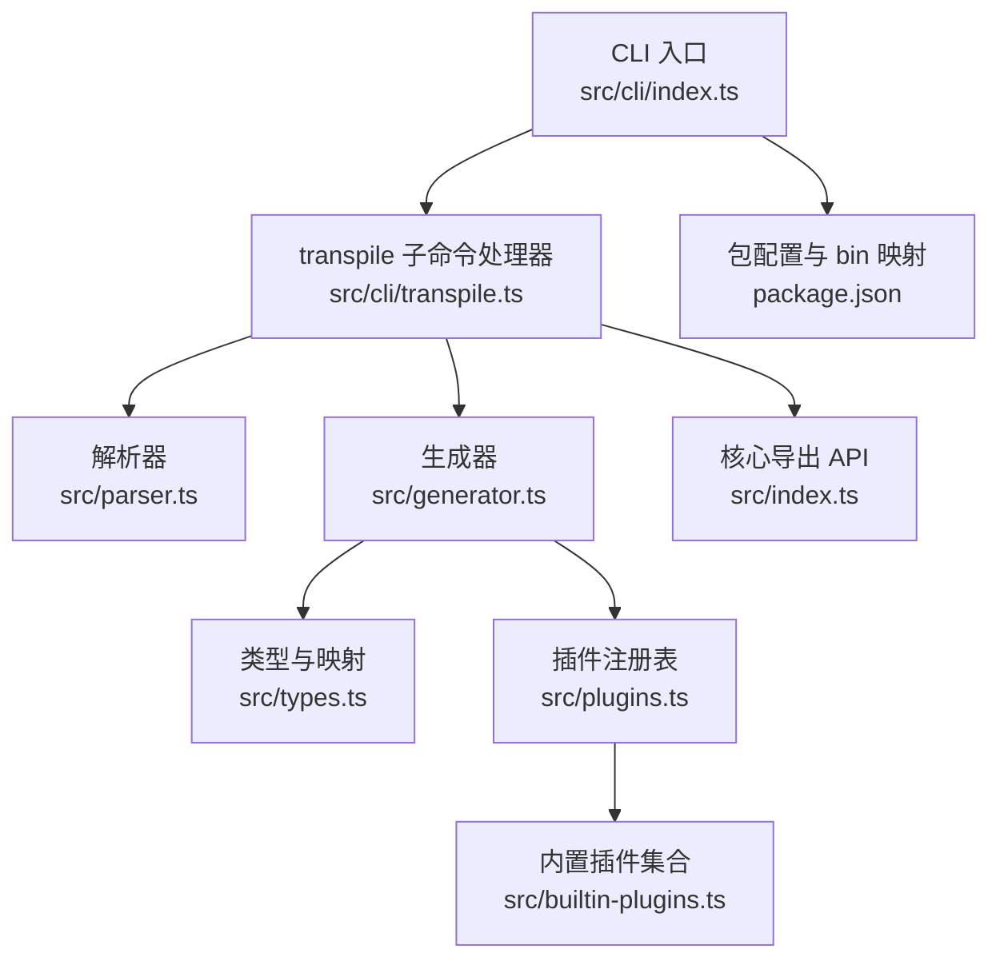
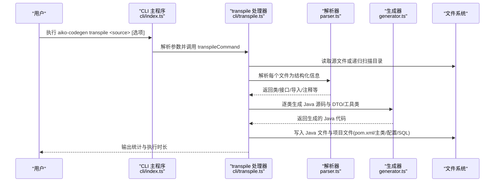
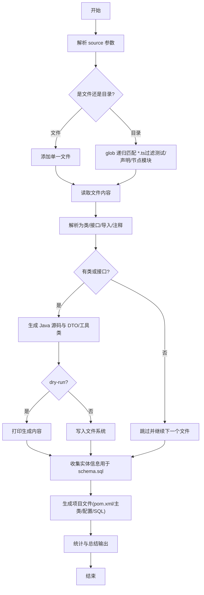
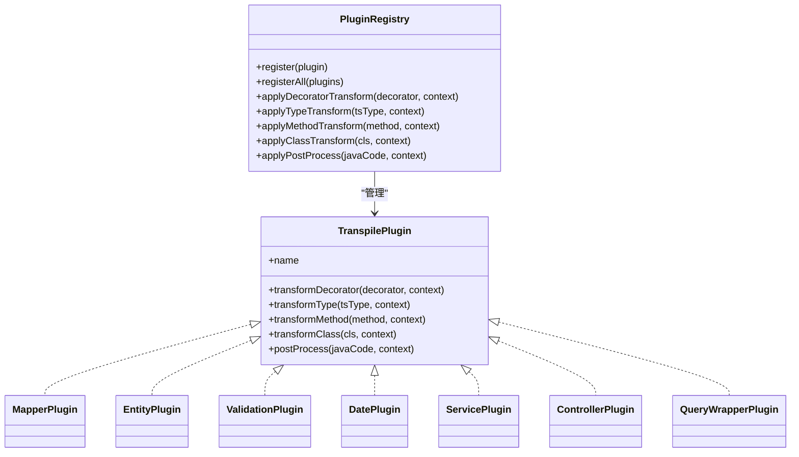
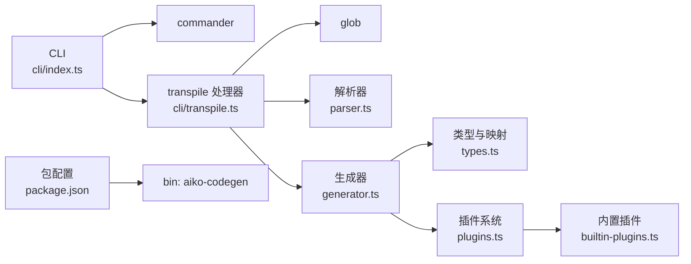

# 命令行工具（CLI）

<cite>
**本文引用的文件**
- [packages/aiko-boot-codegen/src/cli/index.ts](file://packages/aiko-boot-codegen/src/cli/index.ts)
- [packages/aiko-boot-codegen/src/cli/transpile.ts](file://packages/aiko-boot-codegen/src/cli/transpile.ts)
- [packages/aiko-boot-codegen/src/index.ts](file://packages/aiko-boot-codegen/src/index.ts)
- [packages/aiko-boot-codegen/src/types.ts](file://packages/aiko-boot-codegen/src/types.ts)
- [packages/aiko-boot-codegen/src/generator.ts](file://packages/aiko-boot-codegen/src/generator.ts)
- [packages/aiko-boot-codegen/src/plugins.ts](file://packages/aiko-boot-codegen/src/plugins.ts)
- [packages/aiko-boot-codegen/src/builtin-plugins.ts](file://packages/aiko-boot-codegen/src/builtin-plugins.ts)
- [packages/aiko-boot-codegen/src/parser.ts](file://packages/aiko-boot-codegen/src/parser.ts)
- [packages/aiko-boot-codegen/package.json](file://packages/aiko-boot-codegen/package.json)
- [README.md](file://README.md)
</cite>

## 目录
1. [简介](#简介)
2. [项目结构](#项目结构)
3. [核心组件](#核心组件)
4. [架构总览](#架构总览)
5. [详细组件分析](#详细组件分析)
6. [依赖关系分析](#依赖关系分析)
7. [性能考虑](#性能考虑)
8. [故障排查指南](#故障排查指南)
9. [结论](#结论)
10. [附录](#附录)

## 简介
本文件为 Aiko Boot 的命令行工具（CLI）使用文档，面向希望将 TypeScript 代码一键转换为 Java Spring Boot + MyBatis-Plus 项目的开发者。CLI 提供以下能力：
- 单文件与批量文件转换
- 递归目录扫描与过滤
- 输出目录与包名配置
- Java 版本与 Spring Boot 版本选择
- Lombok 注解开关
- 干运行模式（dry-run）
- 详细日志与错误统计
- 自动生成 pom.xml、主类、配置文件与数据库脚本

CLI 命令为 aiko-codegen，默认子命令为 transpile；另提供 validate 子命令用于提示校验方式。

## 项目结构
该 CLI 属于 monorepo 中的独立包，位于 packages/aiko-boot-codegen。其关键文件组织如下：
- CLI 入口与命令定义：src/cli/index.ts
- transpile 子命令实现：src/cli/transpile.ts
- 核心导出与 API：src/index.ts
- 类型与映射：src/types.ts
- 代码生成器：src/generator.ts
- 插件系统：src/plugins.ts、src/builtin-plugins.ts
- TypeScript 解析器：src/parser.ts
- 包配置与二进制入口：package.json

图表来源
- [packages/aiko-boot-codegen/src/cli/index.ts](file://packages/aiko-boot-codegen/src/cli/index.ts#L1-L43)
- [packages/aiko-boot-codegen/src/cli/transpile.ts](file://packages/aiko-boot-codegen/src/cli/transpile.ts#L1-L514)
- [packages/aiko-boot-codegen/src/index.ts](file://packages/aiko-boot-codegen/src/index.ts#L1-L57)
- [packages/aiko-boot-codegen/src/types.ts](file://packages/aiko-boot-codegen/src/types.ts#L1-L478)
- [packages/aiko-boot-codegen/src/generator.ts](file://packages/aiko-boot-codegen/src/generator.ts#L1-L800)
- [packages/aiko-boot-codegen/src/plugins.ts](file://packages/aiko-boot-codegen/src/plugins.ts#L1-L172)
- [packages/aiko-boot-codegen/src/builtin-plugins.ts](file://packages/aiko-boot-codegen/src/builtin-plugins.ts#L1-L190)
- [packages/aiko-boot-codegen/src/parser.ts](file://packages/aiko-boot-codegen/src/parser.ts#L1-L660)
- [packages/aiko-boot-codegen/package.json](file://packages/aiko-boot-codegen/package.json#L1-L34)

章节来源
- [packages/aiko-boot-codegen/src/cli/index.ts](file://packages/aiko-boot-codegen/src/cli/index.ts#L1-L43)
- [packages/aiko-boot-codegen/src/cli/transpile.ts](file://packages/aiko-boot-codegen/src/cli/transpile.ts#L1-L514)
- [packages/aiko-boot-codegen/src/index.ts](file://packages/aiko-boot-codegen/src/index.ts#L1-L57)
- [packages/aiko-boot-codegen/src/types.ts](file://packages/aiko-boot-codegen/src/types.ts#L1-L478)
- [packages/aiko-boot-codegen/src/generator.ts](file://packages/aiko-boot-codegen/src/generator.ts#L1-L800)
- [packages/aiko-boot-codegen/src/plugins.ts](file://packages/aiko-boot-codegen/src/plugins.ts#L1-L172)
- [packages/aiko-boot-codegen/src/builtin-plugins.ts](file://packages/aiko-boot-codegen/src/builtin-plugins.ts#L1-L190)
- [packages/aiko-boot-codegen/src/parser.ts](file://packages/aiko-boot-codegen/src/parser.ts#L1-L660)
- [packages/aiko-boot-codegen/package.json](file://packages/aiko-boot-codegen/package.json#L1-L34)

## 核心组件
- CLI 主程序与命令注册：定义命令名称、描述、版本以及 transpile/validate 子命令的参数与行为。
- transpile 子命令处理器：负责文件发现、解析、生成、写入与项目文件生成。
- 解析器：基于 TypeScript 编译器 API 抽象出类、接口、导入、注释等结构化信息。
- 生成器：根据解析结果与映射规则生成 Java 源码、实体 SQL、pom.xml、主类与配置文件。
- 插件系统：提供装饰器、类型、方法、类级与后置处理的扩展点，内置多种转换插件。
- 类型与映射：定义 TypeScript 到 Java 的类型映射、注解映射、导入映射与常用 Java 导入集合。

章节来源
- [packages/aiko-boot-codegen/src/cli/index.ts](file://packages/aiko-boot-codegen/src/cli/index.ts#L1-L43)
- [packages/aiko-boot-codegen/src/cli/transpile.ts](file://packages/aiko-boot-codegen/src/cli/transpile.ts#L1-L514)
- [packages/aiko-boot-codegen/src/parser.ts](file://packages/aiko-boot-codegen/src/parser.ts#L1-L660)
- [packages/aiko-boot-codegen/src/generator.ts](file://packages/aiko-boot-codegen/src/generator.ts#L1-L800)
- [packages/aiko-boot-codegen/src/plugins.ts](file://packages/aiko-boot-codegen/src/plugins.ts#L1-L172)
- [packages/aiko-boot-codegen/src/builtin-plugins.ts](file://packages/aiko-boot-codegen/src/builtin-plugins.ts#L1-L190)
- [packages/aiko-boot-codegen/src/types.ts](file://packages/aiko-boot-codegen/src/types.ts#L1-L478)

## 架构总览
下图展示 CLI 从命令到生成的端到端流程：

图表来源
- [packages/aiko-boot-codegen/src/cli/index.ts](file://packages/aiko-boot-codegen/src/cli/index.ts#L1-L43)
- [packages/aiko-boot-codegen/src/cli/transpile.ts](file://packages/aiko-boot-codegen/src/cli/transpile.ts#L1-L514)
- [packages/aiko-boot-codegen/src/parser.ts](file://packages/aiko-boot-codegen/src/parser.ts#L1-L660)
- [packages/aiko-boot-codegen/src/generator.ts](file://packages/aiko-boot-codegen/src/generator.ts#L1-L800)

## 详细组件分析

### CLI 命令与参数
- 命令名称与描述：aiko-codegen
- 版本：来自包配置
- 子命令
  - transpile：将 TypeScript 源文件转换为 Java
    - 参数
      - source：源目录或文件路径（必填）
    - 选项
      - -o, --out dir：输出目录，默认 gen
      - -p, --package name：Java 包名，默认 com.example
      - --lombok：是否生成 Lombok 注解（默认关闭）
      - --java-version version：目标 Java 版本，允许 11/17/21，默认 17
      - --spring-boot version：Spring Boot 版本，默认 3.2.0
      - --dry-run：仅打印将要生成的内容，不写文件
      - -v, --verbose：详细输出
  - validate：提示如何进行 Java 兼容性校验（通过 ESLint + 特定配置）

章节来源
- [packages/aiko-boot-codegen/src/cli/index.ts](file://packages/aiko-boot-codegen/src/cli/index.ts#L1-L43)

### transpile 子命令处理逻辑
- 输入识别：若 source 为文件则仅处理该文件；否则递归匹配 **/*.ts（排除 *.spec.ts、*.test.ts、*.d.ts、node_modules）
- 文件遍历与解析：逐个读取源码，解析为类与接口集合
- 类型与注解映射：依据映射规则生成 Java 注解与类型
- 生成策略
  - 类型分类：实体、Mapper/Repository、Service、Controller、DTO
  - 子目录：按类型映射到 entity/mapper/service/controller/model
  - DTO 生成：接口转 DTO 类
  - 工具类：对 Omit/Pick/Partial 等实用类型生成对应 Java 类
  - 项目文件：生成 pom.xml、主类、application.yml、schema.sql
- 输出控制：dry-run 模式仅打印，非 dry-run 模式写入文件系统
- 统计与总结：记录成功/失败数量、耗时与输出目录

图表来源
- [packages/aiko-boot-codegen/src/cli/transpile.ts](file://packages/aiko-boot-codegen/src/cli/transpile.ts#L60-L307)

章节来源
- [packages/aiko-boot-codegen/src/cli/transpile.ts](file://packages/aiko-boot-codegen/src/cli/transpile.ts#L1-L514)

### 解析器（Parser）
- 功能：基于 TypeScript 编译器 API 将源码解析为结构化对象，包括类、接口、导入、注释等
- 关键点
  - 支持顶层注释提取与 JSDoc 标签解析
  - 支持类/接口成员、字段、方法、构造函数、参数、装饰器等
  - 支持表达式与语句的有限解析（用于生成器的导入推断与方法体生成辅助）

章节来源
- [packages/aiko-boot-codegen/src/parser.ts](file://packages/aiko-boot-codegen/src/parser.ts#L1-L660)

### 生成器（Generator）
- 功能：将解析后的结构转化为 Java 源码，含注解、字段、方法、Getter/Setter、构造函数等
- 关键点
  - 类型映射：number/string/boolean/Date/数组/泛型等
  - 注解映射：Entity/TableName/Mapper/Service/Controller/Validation 等
  - 导入收集：根据装饰器与类型动态收集 Java 导入
  - DTO 生成：接口转 DTO 类，含验证注解
  - 工具类生成：对 Omit/Pick/Partial 等实用类型生成对应 Java 类
  - Lombok 支持：在实体与 DTO 上生成 @Data 等注解
  - 方法体生成：基于解析的方法体结构生成 Java 代码骨架

章节来源
- [packages/aiko-boot-codegen/src/generator.ts](file://packages/aiko-boot-codegen/src/generator.ts#L1-L800)
- [packages/aiko-boot-codegen/src/types.ts](file://packages/aiko-boot-codegen/src/types.ts#L1-L478)

### 插件系统（Plugins）
- 功能：提供装饰器、类型、方法、类级与后置处理的扩展点
- 内置插件
  - Mapper/Repository 插件：移除 Java 中的实体参数
  - Entity 插件：将 @Entity 转换为 @TableName
  - Validation 插件：将 TypeScript 验证装饰器映射为 Jakarta Validation
  - Date 插件：将 Date 映射为 LocalDateTime
  - Service/Controller 插件：路径参数语法转换等
  - QueryWrapper 插件：保留 QueryWrapper/UpdateWrapper 语法
- 插件注册：默认注册内置插件，支持扩展

图表来源
- [packages/aiko-boot-codegen/src/plugins.ts](file://packages/aiko-boot-codegen/src/plugins.ts#L1-L172)
- [packages/aiko-boot-codegen/src/builtin-plugins.ts](file://packages/aiko-boot-codegen/src/builtin-plugins.ts#L1-L190)

章节来源
- [packages/aiko-boot-codegen/src/plugins.ts](file://packages/aiko-boot-codegen/src/plugins.ts#L1-L172)
- [packages/aiko-boot-codegen/src/builtin-plugins.ts](file://packages/aiko-boot-codegen/src/builtin-plugins.ts#L1-L190)

### 类型与映射（Types）
- TypeScript 到 Java 类型映射：number→Integer/Long，string→String，boolean→Boolean，Date→LocalDateTime 等
- 装饰器映射：Entity→@TableName，Mapper/Repository→@Mapper，Service→@Service，RestController→@RestController 等
- 导入映射：将 TypeScript 模块映射为 Java import 语句
- 常用 Java 导入集合：MyBatis-Plus、Spring、Validation、Util、Lombok 等

章节来源
- [packages/aiko-boot-codegen/src/types.ts](file://packages/aiko-boot-codegen/src/types.ts#L1-L478)

### 核心 API（供集成使用）
- transpile：将 TypeScript 源码转换为 Java 源码映射（键为类名.java，值为 Java 源码）
- parseSourceFile/parseSourceFileFull：解析源文件，返回类/接口/导入/注释等
- generateJavaClass/generateJavaFromInterface/generateUtilityTypeClass：生成 Java 源码
- createDecoratorGenericTransformer/transformSourceCode：装饰器泛型转换与源码转换
- PluginRegistry/getBuiltinPlugins/getPluginsByName：插件注册与获取

章节来源
- [packages/aiko-boot-codegen/src/index.ts](file://packages/aiko-boot-codegen/src/index.ts#L1-L57)

## 依赖关系分析
- CLI 依赖 commander 进行命令行解析
- transpile 子命令依赖 glob 进行文件匹配
- 生成器依赖解析器与类型映射
- 插件系统为生成器提供扩展能力
- 包配置通过 bin 字段将 CLI 暴露为 aiko-codegen

图表来源
- [packages/aiko-boot-codegen/src/cli/index.ts](file://packages/aiko-boot-codegen/src/cli/index.ts#L1-L43)
- [packages/aiko-boot-codegen/src/cli/transpile.ts](file://packages/aiko-boot-codegen/src/cli/transpile.ts#L1-L514)
- [packages/aiko-boot-codegen/src/parser.ts](file://packages/aiko-boot-codegen/src/parser.ts#L1-L660)
- [packages/aiko-boot-codegen/src/generator.ts](file://packages/aiko-boot-codegen/src/generator.ts#L1-L800)
- [packages/aiko-boot-codegen/src/plugins.ts](file://packages/aiko-boot-codegen/src/plugins.ts#L1-L172)
- [packages/aiko-boot-codegen/src/builtin-plugins.ts](file://packages/aiko-boot-codegen/src/builtin-plugins.ts#L1-L190)
- [packages/aiko-boot-codegen/src/types.ts](file://packages/aiko-boot-codegen/src/types.ts#L1-L478)
- [packages/aiko-boot-codegen/package.json](file://packages/aiko-boot-codegen/package.json#L1-L34)

章节来源
- [packages/aiko-boot-codegen/src/cli/index.ts](file://packages/aiko-boot-codegen/src/cli/index.ts#L1-L43)
- [packages/aiko-boot-codegen/src/cli/transpile.ts](file://packages/aiko-boot-codegen/src/cli/transpile.ts#L1-L514)
- [packages/aiko-boot-codegen/src/parser.ts](file://packages/aiko-boot-codegen/src/parser.ts#L1-L660)
- [packages/aiko-boot-codegen/src/generator.ts](file://packages/aiko-boot-codegen/src/generator.ts#L1-L800)
- [packages/aiko-boot-codegen/src/plugins.ts](file://packages/aiko-boot-codegen/src/plugins.ts#L1-L172)
- [packages/aiko-boot-codegen/src/builtin-plugins.ts](file://packages/aiko-boot-codegen/src/builtin-plugins.ts#L1-L190)
- [packages/aiko-boot-codegen/src/types.ts](file://packages/aiko-boot-codegen/src/types.ts#L1-L478)
- [packages/aiko-boot-codegen/package.json](file://packages/aiko-boot-codegen/package.json#L1-L34)

## 性能考虑
- 递归扫描：默认忽略测试文件、声明文件与 node_modules，避免不必要的 IO
- 并行处理：当前实现为顺序处理文件，如需更高吞吐可在保持状态一致的前提下引入并发队列
- 生成阶段：按文件粒度生成，减少内存峰值；工具类生成集中处理，避免重复计算
- 日志级别：verbose 会增加 I/O 输出，建议在 CI 或批处理中按需开启
- 依赖版本：Spring Boot 3.x 与 MyBatis-Plus 3.5.9+ 在生成的 pom.xml 中自动适配

[本节为通用建议，无需特定文件来源]

## 故障排查指南
- 无 TypeScript 文件被发现
  - 检查 source 是否为有效路径，确认未被过滤（*.spec.ts、*.test.ts、*.d.ts、node_modules）
- 转换过程中出现错误
  - 使用 -v/--verbose 查看具体文件与错误消息
  - 错误计数会在总结中显示，定位到失败文件
- 生成的 Java 代码缺少注解或导入
  - 确认源文件中的装饰器与类型是否在映射表中
  - 若使用了自定义装饰器或类型，可通过插件扩展映射
- 生成的 pom.xml 与 Spring Boot 版本不匹配
  - 使用 --spring-boot 指定版本，生成器会自动选择对应的 MyBatis-Plus 启动器
- Lombok 未生效
  - 确保启用 --lombok，并在生成的 pom.xml 中包含 Lombok 依赖
- 生成的 schema.sql 不完整
  - 确保实体类包含 @Entity/@TableName 与字段上的 @TableField/@Column 等装饰器

章节来源
- [packages/aiko-boot-codegen/src/cli/transpile.ts](file://packages/aiko-boot-codegen/src/cli/transpile.ts#L86-L216)
- [packages/aiko-boot-codegen/src/generator.ts](file://packages/aiko-boot-codegen/src/generator.ts#L233-L344)
- [packages/aiko-boot-codegen/src/types.ts](file://packages/aiko-boot-codegen/src/types.ts#L51-L102)

## 结论
本 CLI 工具提供了从 TypeScript 到 Java Spring Boot + MyBatis-Plus 的自动化转换能力，覆盖单文件、批量与递归目录场景，并通过插件系统与丰富的映射规则满足多样化需求。配合 dry-run、详细日志与项目文件自动生成，可显著提升工程迁移效率与一致性。

[本节为总结，无需特定文件来源]

## 附录

### 安装与配置
- 全局安装
  - 通过包管理器将 aiko-codegen 安装为全局命令
- 本地使用
  - 在项目中安装依赖后，通过 npx 或本地脚本运行 aiko-codegen

章节来源
- [packages/aiko-boot-codegen/package.json](file://packages/aiko-boot-codegen/package.json#L1-L34)
- [README.md](file://README.md#L1-L215)

### 常用命令示例
- 单文件转换
  - aiko-codegen transpile ./src/User.ts -o ./out -p com.example
- 批量文件处理（同一目录）
  - aiko-codegen transpile ./src -o ./out -p com.example
- 递归目录转换
  - aiko-codegen transpile ./src --out ./out --package com.example
- 干运行模式
  - aiko-codegen transpile ./src --out ./out --package com.example --dry-run
- 详细输出
  - aiko-codegen transpile ./src -v
- 指定 Java/Spring Boot 版本
  - aiko-codegen transpile ./src --java-version 17 --spring-boot 3.2.0
- 启用 Lombok
  - aiko-codegen transpile ./src --lombok

章节来源
- [packages/aiko-boot-codegen/src/cli/index.ts](file://packages/aiko-boot-codegen/src/cli/index.ts#L16-L28)
- [packages/aiko-boot-codegen/src/cli/transpile.ts](file://packages/aiko-boot-codegen/src/cli/transpile.ts#L60-L92)

### 转换配置与自定义
- 转换选项
  - 输出目录：--out/-o
  - 包名：--package/-p
  - Java 版本：--java-version
  - Spring Boot 版本：--spring-boot
  - Lombok：--lombok
  - 干运行：--dry-run
  - 详细输出：-v/--verbose
- 自定义转换规则
  - 通过插件扩展装饰器、类型、方法、类级与后置处理
  - 内置插件包括 Mapper/Entity/Validation/Date/Service/Controller/QueryWrapper
- 模板选择
  - 生成器根据类类型自动选择模板（实体/接口/DTO/Service/Controller）
  - 可通过插件调整注解与导入

章节来源
- [packages/aiko-boot-codegen/src/cli/transpile.ts](file://packages/aiko-boot-codegen/src/cli/transpile.ts#L14-L36)
- [packages/aiko-boot-codegen/src/plugins.ts](file://packages/aiko-boot-codegen/src/plugins.ts#L1-L172)
- [packages/aiko-boot-codegen/src/builtin-plugins.ts](file://packages/aiko-boot-codegen/src/builtin-plugins.ts#L1-L190)
- [packages/aiko-boot-codegen/src/generator.ts](file://packages/aiko-boot-codegen/src/generator.ts#L143-L155)

### 错误处理与调试
- 错误捕获：对每个文件的处理进行 try/catch，记录错误计数与错误消息
- 详细日志：verbose 模式下输出每个文件的处理进度
- 生成摘要：统计成功/失败数量、耗时与输出目录

章节来源
- [packages/aiko-boot-codegen/src/cli/transpile.ts](file://packages/aiko-boot-codegen/src/cli/transpile.ts#L212-L216)
- [packages/aiko-boot-codegen/src/cli/transpile.ts](file://packages/aiko-boot-codegen/src/cli/transpile.ts#L292-L307)

### 性能优化建议
- 减少扫描范围：仅指向必要目录，避免包含大型第三方库
- 合理使用 dry-run：在大规模转换前先 dry-run 预览
- 控制日志级别：CI 环境中避免频繁启用 verbose
- 使用合适版本：优先使用与团队一致的 Java/Spring Boot 版本组合

[本节为通用建议，无需特定文件来源]