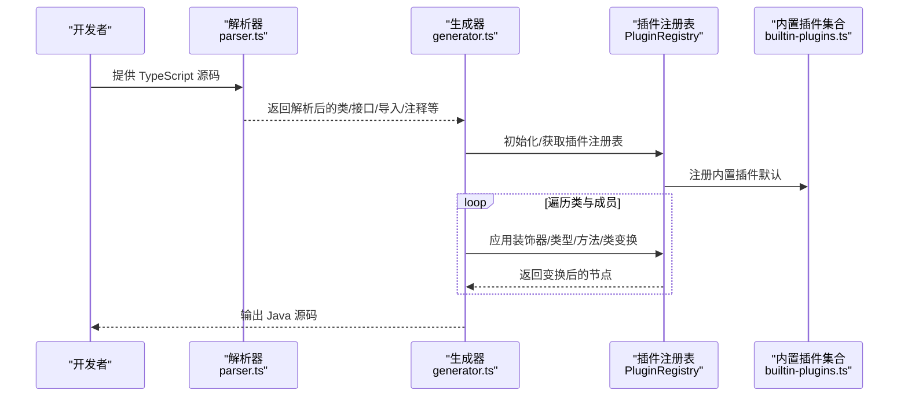
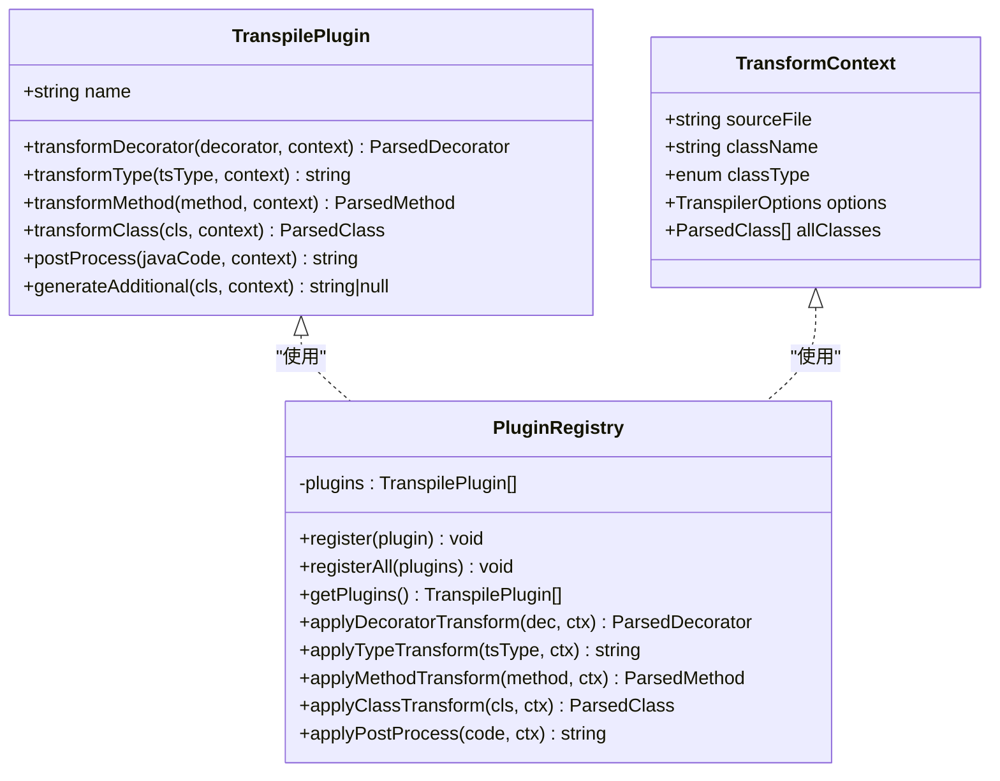
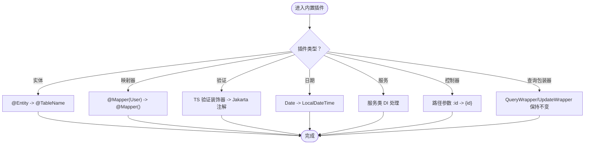
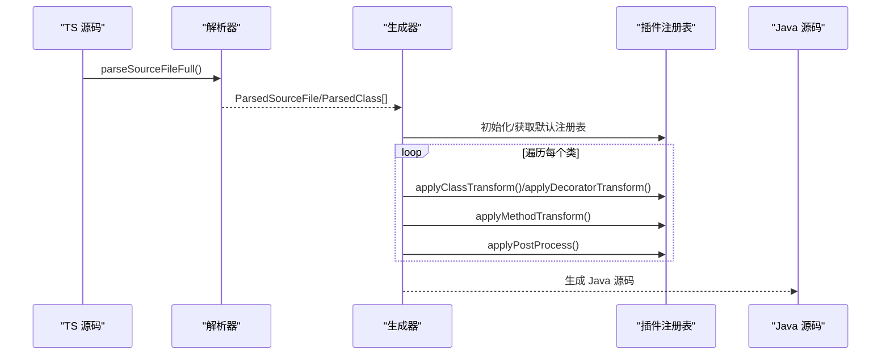
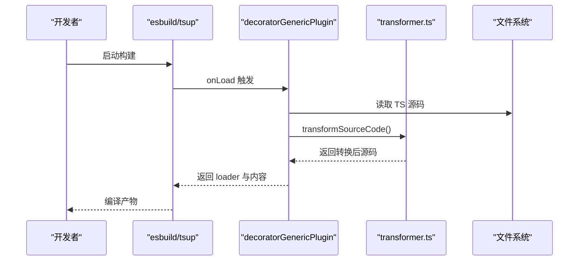
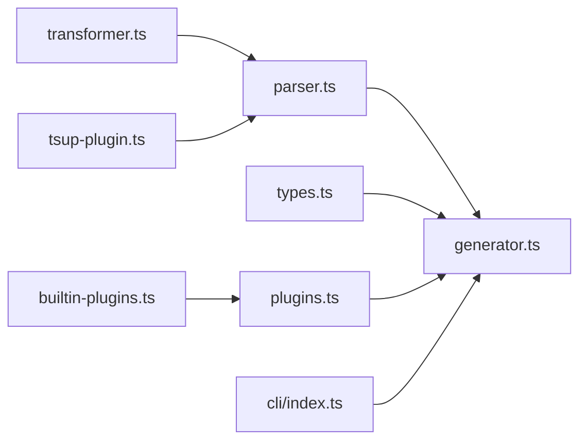

# 插件系统

<cite>
**本文引用的文件**
- [packages/aiko-boot-codegen/src/plugins.ts](file://packages/aiko-boot-codegen/src/plugins.ts)
- [packages/aiko-boot-codegen/src/builtin-plugins.ts](file://packages/aiko-boot-codegen/src/builtin-plugins.ts)
- [packages/aiko-boot-codegen/src/types.ts](file://packages/aiko-boot-codegen/src/types.ts)
- [packages/aiko-boot-codegen/src/transformer.ts](file://packages/aiko-boot-codegen/src/transformer.ts)
- [packages/aiko-boot-codegen/src/tsup-plugin.ts](file://packages/aiko-boot-codegen/src/tsup-plugin.ts)
- [packages/aiko-boot-codegen/src/index.ts](file://packages/aiko-boot-codegen/src/index.ts)
- [packages/aiko-boot-codegen/src/generator.ts](file://packages/aiko-boot-codegen/src/generator.ts)
- [packages/aiko-boot-codegen/src/parser.ts](file://packages/aiko-boot-codegen/src/parser.ts)
- [packages/aiko-boot-codegen/src/cli/index.ts](file://packages/aiko-boot-codegen/src/cli/index.ts)
</cite>

## 目录
1. [简介](#简介)
2. [项目结构](#项目结构)
3. [核心组件](#核心组件)
4. [架构总览](#架构总览)
5. [详细组件分析](#详细组件分析)
6. [依赖分析](#依赖分析)
7. [性能考虑](#性能考虑)
8. [故障排查指南](#故障排查指南)
9. [结论](#结论)
10. [附录](#附录)

## 简介
本插件系统面向 TypeScript 到 Java 的代码生成场景，提供可扩展的插件机制，支持在装饰器、类型、方法、类以及最终代码生成阶段进行多级变换。内置多种常用插件（实体、映射器、验证、日期、服务、控制器、查询包装器），并允许开发者通过统一的插件接口实现自定义转换逻辑。同时提供构建期 Transformer 和 esbuild/tsup 插件，用于自动补全装饰器泛型参数，提升开发体验。

## 项目结构
围绕“插件系统”的核心文件组织如下：
- 插件接口与注册中心：定义插件契约、上下文与注册表
- 内置插件：针对实体、映射器、验证、日期、服务、控制器、查询包装器的预设转换规则
- 类型与映射：TS 到 Java 的类型映射、注解映射、导入映射
- 解析器与生成器：AST 解析、类信息抽取、Java 代码生成
- 构建期工具：TypeScript Transformer 与 esbuild/tsup 插件
- CLI：命令行入口，支持转译与校验

```mermaid
graph TB
subgraph "插件系统"
PIF["插件接口<br/>TranspilePlugin"]
PCtx["转换上下文<br/>TransformContext"]
PR["插件注册表<br/>PluginRegistry"]
end
subgraph "内置插件"
EP["实体插件<br/>entityPlugin"]
MP["映射器插件<br/>mapperPlugin"]
VP["验证插件<br/>validationPlugin"]
DP["日期插件<br/>datePlugin"]
SP["服务插件<br/>servicePlugin"]
CP["控制器插件<br/>controllerPlugin"]
QWP["查询包装器插件<br/>queryWrapperPlugin"]
end
subgraph "解析与生成"
Parser["解析器<br/>parser.ts"]
Gen["生成器<br/>generator.ts"]
Types["类型与映射<br/>types.ts"]
end
subgraph "构建期工具"
Tsf["Transformer<br/>transformer.ts"]
Tsup["esbuild/tsup 插件<br/>tsup-plugin.ts"]
end
subgraph "CLI"
CLI["CLI 入口<br/>cli/index.ts"]
end
PIF --> PR
PCtx --> PR
PR --> EP
PR --> MP
PR --> VP
PR --> DP
PR --> SP
PR --> CP
PR --> QWP
Parser --> Gen
Types --> Gen
PR --> Gen
Tsf --> Parser
Tsup --> Parser
CLI --> Gen
```

图表来源
- [packages/aiko-boot-codegen/src/plugins.ts](file://packages/aiko-boot-codegen/src/plugins.ts#L26-L82)
- [packages/aiko-boot-codegen/src/builtin-plugins.ts](file://packages/aiko-boot-codegen/src/builtin-plugins.ts#L13-L166)
- [packages/aiko-boot-codegen/src/types.ts](file://packages/aiko-boot-codegen/src/types.ts#L8-L150)
- [packages/aiko-boot-codegen/src/parser.ts](file://packages/aiko-boot-codegen/src/parser.ts#L15-L660)
- [packages/aiko-boot-codegen/src/generator.ts](file://packages/aiko-boot-codegen/src/generator.ts#L29-L138)
- [packages/aiko-boot-codegen/src/transformer.ts](file://packages/aiko-boot-codegen/src/transformer.ts#L32-L130)
- [packages/aiko-boot-codegen/src/tsup-plugin.ts](file://packages/aiko-boot-codegen/src/tsup-plugin.ts#L28-L62)
- [packages/aiko-boot-codegen/src/cli/index.ts](file://packages/aiko-boot-codegen/src/cli/index.ts#L16-L42)

章节来源
- [packages/aiko-boot-codegen/src/index.ts](file://packages/aiko-boot-codegen/src/index.ts#L1-L57)

## 核心组件
- 插件接口 TranspilePlugin：定义插件名称与可选的装饰器、类型、方法、类、后处理、附加代码生成钩子
- 转换上下文 TransformContext：携带源文件路径、当前类名、类类型、全局选项、全部类等信息
- 插件注册表 PluginRegistry：负责插件注册、批量注册、按序应用各类变换，并提供默认注册表
- 内置插件集合：实体、映射器、验证、日期、服务、控制器、查询包装器插件
- 解析器与生成器：解析 TS 源码为结构化对象，再基于插件与映射生成 Java 代码
- 构建期工具：Transformer 自动补全装饰器泛型；esbuild/tsup 插件在构建时执行转换

章节来源
- [packages/aiko-boot-codegen/src/plugins.ts](file://packages/aiko-boot-codegen/src/plugins.ts#L10-L172)
- [packages/aiko-boot-codegen/src/builtin-plugins.ts](file://packages/aiko-boot-codegen/src/builtin-plugins.ts#L13-L166)
- [packages/aiko-boot-codegen/src/types.ts](file://packages/aiko-boot-codegen/src/types.ts#L8-L150)
- [packages/aiko-boot-codegen/src/parser.ts](file://packages/aiko-boot-codegen/src/parser.ts#L15-L660)
- [packages/aiko-boot-codegen/src/generator.ts](file://packages/aiko-boot-codegen/src/generator.ts#L29-L138)
- [packages/aiko-boot-codegen/src/transformer.ts](file://packages/aiko-boot-codegen/src/transformer.ts#L32-L130)
- [packages/aiko-boot-codegen/src/tsup-plugin.ts](file://packages/aiko-boot-codegen/src/tsup-plugin.ts#L28-L62)

## 架构总览
插件系统贯穿“解析—转换—生成”全流程。解析器将 TS 源码解析为结构化对象；生成器在生成 Java 代码前，通过插件注册表对装饰器、类型、方法、类进行逐层变换；最后进行后处理与附加代码生成。构建期 Transformer 与 tsup 插件在开发时自动补全装饰器泛型，减少手写样板代码。



图表来源
- [packages/aiko-boot-codegen/src/parser.ts](file://packages/aiko-boot-codegen/src/parser.ts#L23-L660)
- [packages/aiko-boot-codegen/src/generator.ts](file://packages/aiko-boot-codegen/src/generator.ts#L29-L138)
- [packages/aiko-boot-codegen/src/plugins.ts](file://packages/aiko-boot-codegen/src/plugins.ts#L87-L172)
- [packages/aiko-boot-codegen/src/builtin-plugins.ts](file://packages/aiko-boot-codegen/src/builtin-plugins.ts#L156-L166)

## 详细组件分析

### 插件接口与注册机制
- 插件接口 TranspilePlugin：包含 name 与若干可选变换钩子，便于在不同阶段对装饰器、类型、方法、类进行转换，或在生成完成后进行后处理与附加代码生成
- 转换上下文 TransformContext：提供源文件路径、类名、类类型（实体/仓库/服务/控制器/dto/未知）、全局选项、当前文件内全部类等信息，使插件具备足够的上下文感知能力
- 插件注册表 PluginRegistry：维护插件列表，提供 register/registerAll/getPlugins，以及按序应用装饰器、类型、方法、类与后处理的统一入口；默认注册表会自动注册所有内置插件



图表来源
- [packages/aiko-boot-codegen/src/plugins.ts](file://packages/aiko-boot-codegen/src/plugins.ts#L26-L172)

章节来源
- [packages/aiko-boot-codegen/src/plugins.ts](file://packages/aiko-boot-codegen/src/plugins.ts#L10-L172)

### 内置插件详解
- 实体插件 entityPlugin：将 @Entity 转换为 @TableName，便于 MyBatis-Plus 的表名映射
- 映射器插件 mapperPlugin：将 @Mapper(User)/@Repository(User) 中的实体参数移除，因为 Java 侧通过 BaseMapper<T> 泛型推断实体类型
- 验证插件 validationPlugin：将 TypeScript 验证装饰器映射到 Jakarta Validation 注解（如 Required→NotNull、Size 等）
- 日期插件 datePlugin：将 Date 类型映射为 Java 的 LocalDateTime
- 服务插件 servicePlugin：为服务类提供 DI 场景下的构造函数/字段注入注解处理（示例性实现）
- 控制器插件 controllerPlugin：将请求映射注解中的路径参数语法从 /:id 转换为 Java 的 /{id}
- 查询包装器插件 queryWrapperPlugin：保持 QueryWrapper/UpdateWrapper 的泛型语法一致，不做额外转换



图表来源
- [packages/aiko-boot-codegen/src/builtin-plugins.ts](file://packages/aiko-boot-codegen/src/builtin-plugins.ts#L13-L166)

章节来源
- [packages/aiko-boot-codegen/src/builtin-plugins.ts](file://packages/aiko-boot-codegen/src/builtin-plugins.ts#L13-L166)

### 类型与映射体系
- 类型映射 TYPE_MAPPING：TS 基础类型到 Java 的映射（如 number→Integer、string→String、Date→LocalDateTime 等）
- 注解映射 DECORATOR_MAPPING：TS 装饰器到 Java 注解的映射（如 Entity→@TableName、Mapper→@Mapper 等）
- 导入映射 IMPORT_MAPPING：TS 引入到 Java import 的映射（框架模块与具体注解类）
- Java 导入集合 JAVA_IMPORTS：MyBatis-Plus、Spring、Validation、Util、Lombok 等常用导入

章节来源
- [packages/aiko-boot-codegen/src/types.ts](file://packages/aiko-boot-codegen/src/types.ts#L8-L150)

### 解析器与生成器
- 解析器 parser.ts：将 TS 源码解析为 ParsedSourceFile/ParsedClass/ParsedInterface 等结构，支持注释、导入、类、接口、方法、字段、参数、表达式等的抽取
- 生成器 generator.ts：基于解析结果与插件上下文生成 Java 代码，包含类类型判定、注解生成、字段与方法生成、DI 字段注入、方法体生成、后处理与附加代码生成等



图表来源
- [packages/aiko-boot-codegen/src/parser.ts](file://packages/aiko-boot-codegen/src/parser.ts#L23-L660)
- [packages/aiko-boot-codegen/src/generator.ts](file://packages/aiko-boot-codegen/src/generator.ts#L29-L138)
- [packages/aiko-boot-codegen/src/plugins.ts](file://packages/aiko-boot-codegen/src/plugins.ts#L87-L172)

章节来源
- [packages/aiko-boot-codegen/src/parser.ts](file://packages/aiko-boot-codegen/src/parser.ts#L15-L660)
- [packages/aiko-boot-codegen/src/generator.ts](file://packages/aiko-boot-codegen/src/generator.ts#L29-L138)

### 构建期工具：Transformer 与 esbuild/tsup 插件
- Transformer transformer.ts：在编译期自动将 @Mapper() 与 extends BaseMapper<User> 组合转换为 @Mapper(User)，减少手写样板代码
- esbuild/tsup 插件 tsup-plugin.ts：在构建流程中自动对匹配的 TS 文件执行转换，失败时回退原内容并输出警告



图表来源
- [packages/aiko-boot-codegen/src/tsup-plugin.ts](file://packages/aiko-boot-codegen/src/tsup-plugin.ts#L28-L62)
- [packages/aiko-boot-codegen/src/transformer.ts](file://packages/aiko-boot-codegen/src/transformer.ts#L197-L214)

章节来源
- [packages/aiko-boot-codegen/src/transformer.ts](file://packages/aiko-boot-codegen/src/transformer.ts#L32-L130)
- [packages/aiko-boot-codegen/src/tsup-plugin.ts](file://packages/aiko-boot-codegen/src/tsup-plugin.ts#L28-L62)

### CLI 与使用
- CLI 入口 cli/index.ts：提供 transpile/validate 子命令，支持输出目录、包名、Lombok、Java 版本、Spring Boot 版本、干跑、详细输出等选项

章节来源
- [packages/aiko-boot-codegen/src/cli/index.ts](file://packages/aiko-boot-codegen/src/cli/index.ts#L16-L42)

## 依赖分析
- 插件系统依赖解析器与生成器：生成器在生成阶段调用插件注册表，解析器提供结构化输入
- 内置插件依赖类型映射与注解映射：插件在变换装饰器与类型时依赖统一映射表
- 构建期工具与解析器/生成器解耦：Transformer 与 tsup 插件独立于生成器，仅在开发时生效



图表来源
- [packages/aiko-boot-codegen/src/parser.ts](file://packages/aiko-boot-codegen/src/parser.ts#L15-L660)
- [packages/aiko-boot-codegen/src/generator.ts](file://packages/aiko-boot-codegen/src/generator.ts#L29-L138)
- [packages/aiko-boot-codegen/src/plugins.ts](file://packages/aiko-boot-codegen/src/plugins.ts#L87-L172)
- [packages/aiko-boot-codegen/src/builtin-plugins.ts](file://packages/aiko-boot-codegen/src/builtin-plugins.ts#L13-L166)
- [packages/aiko-boot-codegen/src/transformer.ts](file://packages/aiko-boot-codegen/src/transformer.ts#L32-L130)
- [packages/aiko-boot-codegen/src/tsup-plugin.ts](file://packages/aiko-boot-codegen/src/tsup-plugin.ts#L28-L62)
- [packages/aiko-boot-codegen/src/cli/index.ts](file://packages/aiko-boot-codegen/src/cli/index.ts#L16-L42)

## 性能考虑
- 插件链路顺序执行：每一步变换都会遍历插件列表，建议控制插件数量与复杂度，避免重复变换
- AST 解析与生成：解析器与生成器涉及大量字符串与对象操作，建议在批量处理时复用上下文与注册表
- 构建期转换：Transformer 与 tsup 插件仅在开发时启用，生产构建可通过 CLI 进行一次性转换，减少运行时开销

## 故障排查指南
- 构建期转换失败：检查 tsup 插件是否正确接入 esbuild/tsup 流程，确认源码包含 @Mapper 与 BaseMapper 关键字；失败时会输出警告并回退原内容
- 插件未生效：确认插件已注册到默认或自定义注册表；检查插件钩子是否实现；核对 TransformContext 中的 classType 与 options 是否符合预期
- 类型映射异常：检查 TYPE_MAPPING 与 IMPORT_MAPPING 是否覆盖目标类型与注解；必要时在自定义插件中补充映射
- CLI 使用问题：确保 transpile 命令参数正确（输出目录、包名、版本等），使用 dry-run 预览生成结果

章节来源
- [packages/aiko-boot-codegen/src/tsup-plugin.ts](file://packages/aiko-boot-codegen/src/tsup-plugin.ts#L48-L58)
- [packages/aiko-boot-codegen/src/generator.ts](file://packages/aiko-boot-codegen/src/generator.ts#L134-L138)
- [packages/aiko-boot-codegen/src/types.ts](file://packages/aiko-boot-codegen/src/types.ts#L8-L150)
- [packages/aiko-boot-codegen/src/cli/index.ts](file://packages/aiko-boot-codegen/src/cli/index.ts#L16-L42)

## 结论
该插件系统通过清晰的接口与上下文设计，实现了从装饰器、类型、方法到类与后处理的全链路可扩展转换。内置插件覆盖主流框架注解与类型映射，结合构建期 Transformer 与 CLI，既提升了开发效率，又保证了生成代码的质量与一致性。开发者可基于统一接口快速扩展新插件，满足特定业务场景的定制化需求。

## 附录
- 自定义插件开发步骤
  - 实现 TranspilePlugin 接口的若干钩子（如 transformDecorator/transformType/transformMethod/transformClass/postProcess/generateAdditional）
  - 在 TransformContext 中读取源文件、类名、类类型、全局选项与全部类
  - 将插件注册到 PluginRegistry（默认注册表会自动注册内置插件）
  - 在生成器中传入自定义注册表以启用插件链
- 插件配置与组合
  - 使用 getBuiltinPlugins 获取内置插件集合，或通过 getPluginsByName 按名称选择
  - 在生成器选项中传入 pluginRegistry，实现插件组合与优先级控制
- 最佳实践
  - 保持插件职责单一，避免过度耦合
  - 在插件中尽量使用上下文信息，减少硬编码
  - 对复杂类型映射建议在插件中集中管理，便于维护

章节来源
- [packages/aiko-boot-codegen/src/plugins.ts](file://packages/aiko-boot-codegen/src/plugins.ts#L26-L82)
- [packages/aiko-boot-codegen/src/builtin-plugins.ts](file://packages/aiko-boot-codegen/src/builtin-plugins.ts#L156-L166)
- [packages/aiko-boot-codegen/src/generator.ts](file://packages/aiko-boot-codegen/src/generator.ts#L134-L138)