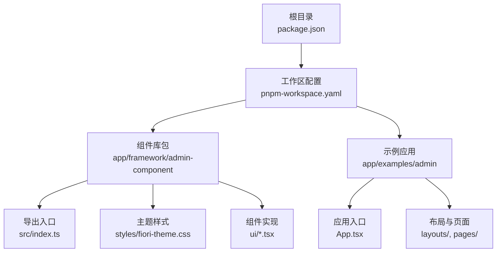
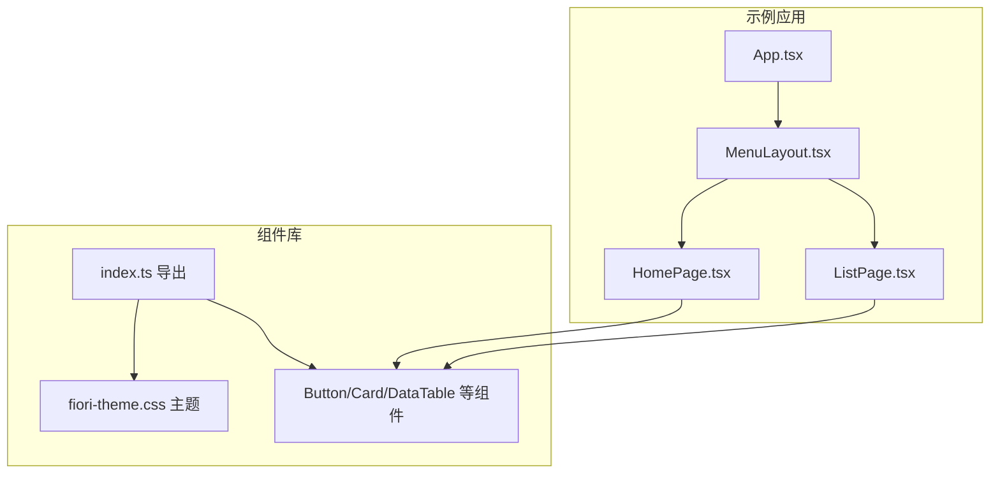
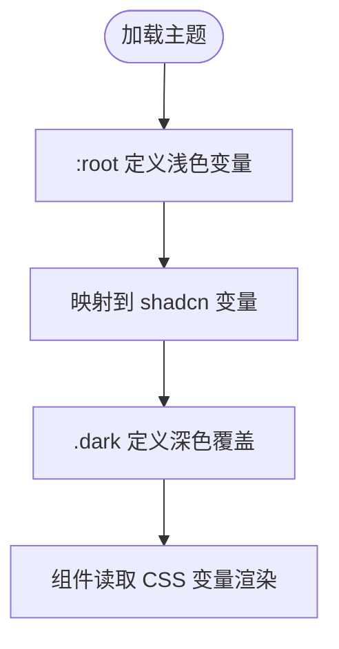
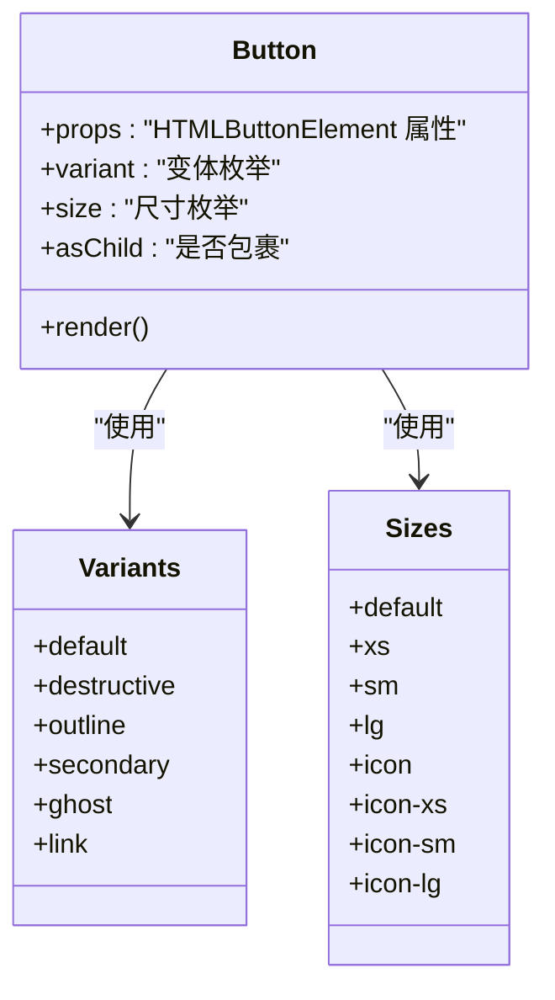
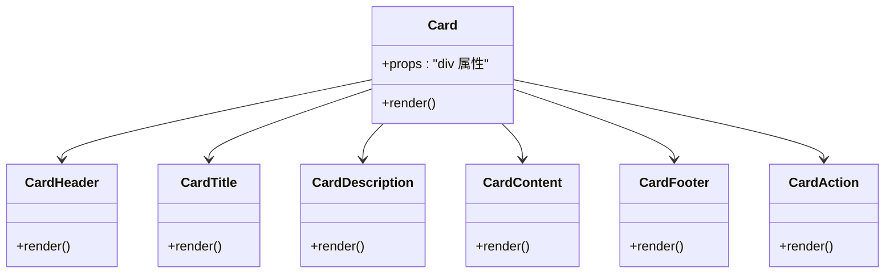
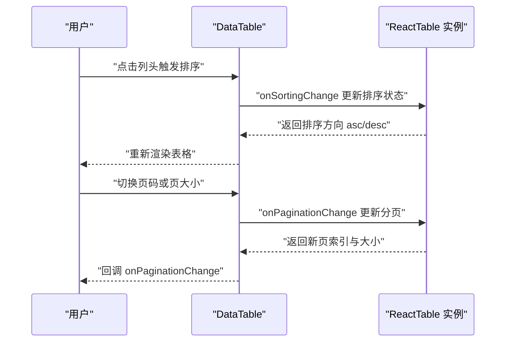
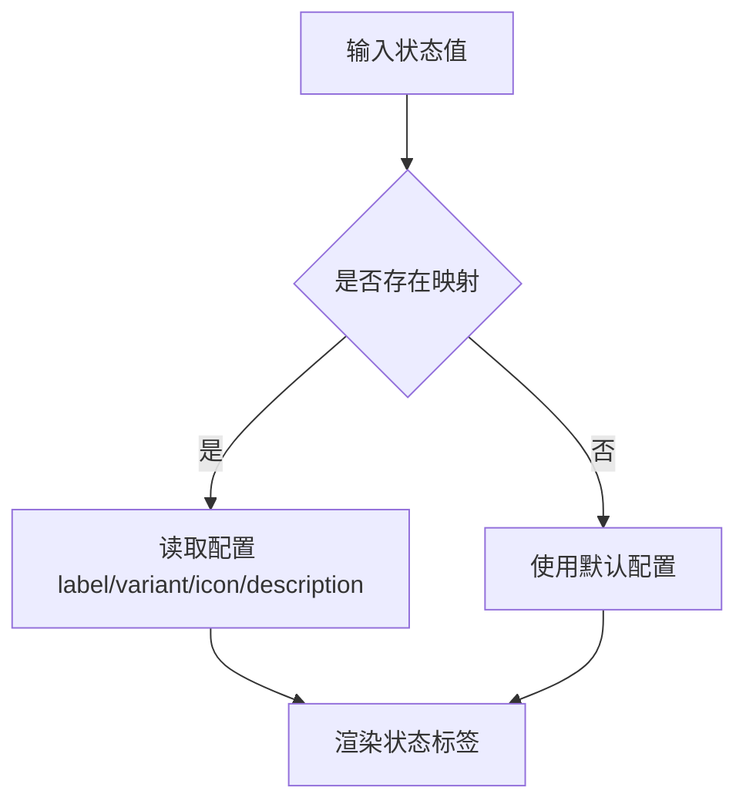
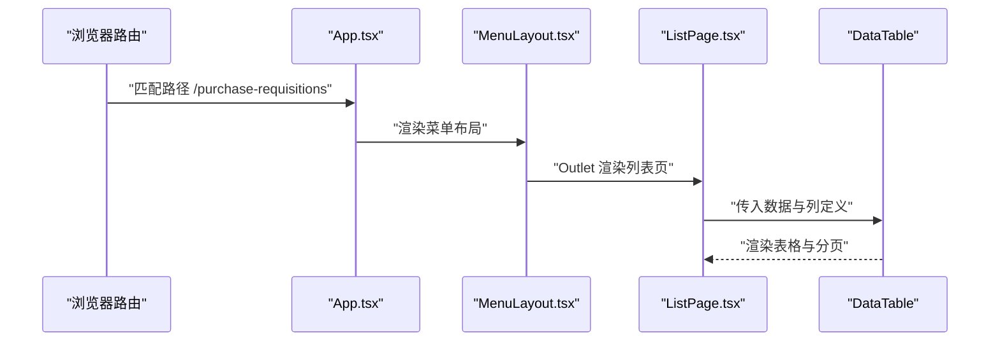
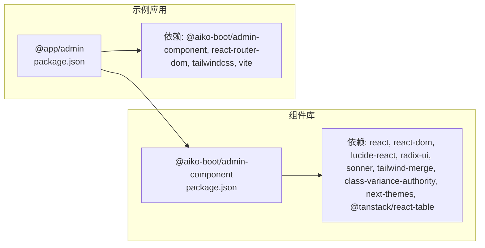

# UI 组件概览

<cite>
**本文引用的文件**
- [app/framework/admin-component/src/index.ts](file://app/framework/admin-component/src/index.ts)
- [app/framework/admin-component/src/styles/fiori-theme.css](file://app/framework/admin-component/src/styles/fiori-theme.css)
- [app/framework/admin-component/src/ui/button.tsx](file://app/framework/admin-component/src/ui/button.tsx)
- [app/framework/admin-component/src/ui/card.tsx](file://app/framework/admin-component/src/ui/card.tsx)
- [app/framework/admin-component/src/ui/data-table.tsx](file://app/framework/admin-component/src/ui/data-table.tsx)
- [app/framework/admin-component/src/ui/status-chip.tsx](file://app/framework/admin-component/src/ui/status-chip.tsx)
- [app/framework/admin-component/src/utils.ts](file://app/framework/admin-component/src/utils.ts)
- [app/framework/admin-component/package.json](file://app/framework/admin-component/package.json)
- [app/examples/admin/src/App.tsx](file://app/examples/admin/src/App.tsx)
- [app/examples/admin/src/layouts/MenuLayout.tsx](file://app/examples/admin/src/layouts/MenuLayout.tsx)
- [app/examples/admin/src/pages/HomePage.tsx](file://app/examples/admin/src/pages/HomePage.tsx)
- [app/examples/admin/src/pages/purchase-requisitions/ListPage.tsx](file://app/examples/admin/src/pages/purchase-requisitions/ListPage.tsx)
- [app/examples/admin/package.json](file://app/examples/admin/package.json)
- [package.json](file://package.json)
- [pnpm-workspace.yaml](file://pnpm-workspace.yaml)
</cite>

## 目录
1. [引言](#引言)
2. [项目结构](#项目结构)
3. [核心组件](#核心组件)
4. [架构总览](#架构总览)
5. [组件详解](#组件详解)
6. [依赖关系分析](#依赖关系分析)
7. [性能与可扩展性](#性能与可扩展性)
8. [安装与使用指南](#安装与使用指南)
9. [设计系统与视觉规范](#设计系统与视觉规范)
10. [响应式与可访问性](#响应式与可访问性)
11. [组件选型与最佳实践](#组件选型与最佳实践)
12. [故障排查](#故障排查)
13. [结论](#结论)

## 引言
本文件为基于 SAP Fiori 设计规范的 UI 组件库概览，面向前端与全栈开发者，提供统一的设计语言、组件分类体系、主题系统、响应式与可访问性标准、安装配置与使用方式，以及组件选型与最佳实践建议。组件库采用现代化工程化方案（TypeScript、Tailwind CSS、Radix UI、TanStack React Table），在 monorepo 结构下通过工作区管理多包协作。

## 项目结构
该仓库采用 pnpm workspace 的 monorepo 架构，核心组件位于 app/framework/admin-component，示例应用位于 app/examples/admin，顶层 package.json 提供统一脚本与引擎约束。

**图表来源**
- [pnpm-workspace.yaml](file://pnpm-workspace.yaml#L1-L6)
- [package.json](file://package.json#L1-L32)

**章节来源**
- [pnpm-workspace.yaml](file://pnpm-workspace.yaml#L1-L6)
- [package.json](file://package.json#L1-L32)

## 核心组件
组件库提供基础 UI 组件、表单控件、数据展示与状态标识等模块，统一通过入口文件集中导出，便于按需引入与版本管理。

- 基础组件：Button、Card、Dialog、Form、Input、Label、Select、Table、Toaster 等
- Aiko Boot 扩展：DataTable、StatusChip、SearchFilterBar
- 工具函数：cn（类名合并）

这些组件均以 TypeScript 实现，遵循一致的变体系统与样式约定，结合 CSS 变量与 Tailwind 类名实现主题化与一致性。

**章节来源**
- [app/framework/admin-component/src/index.ts](file://app/framework/admin-component/src/index.ts#L1-L38)
- [app/framework/admin-component/src/utils.ts](file://app/framework/admin-component/src/utils.ts#L1-L7)

## 架构总览
组件库与示例应用的交互关系如下：

**图表来源**
- [app/examples/admin/src/App.tsx](file://app/examples/admin/src/App.tsx#L72-L171)
- [app/examples/admin/src/layouts/MenuLayout.tsx](file://app/examples/admin/src/layouts/MenuLayout.tsx#L160-L421)
- [app/examples/admin/src/pages/HomePage.tsx](file://app/examples/admin/src/pages/HomePage.tsx#L120-L277)
- [app/examples/admin/src/pages/purchase-requisitions/ListPage.tsx](file://app/examples/admin/src/pages/purchase-requisitions/ListPage.tsx#L71-L271)
- [app/framework/admin-component/src/index.ts](file://app/framework/admin-component/src/index.ts#L1-L38)
- [app/framework/admin-component/src/styles/fiori-theme.css](file://app/framework/admin-component/src/styles/fiori-theme.css#L1-L140)

## 组件详解

### 主题系统与 CSS 变量
组件库以 SAP Fiori Morning Horizon 为主题蓝本，提供明暗两套配色与语义色，映射至 shadcn 风格变量，确保与 Tailwind 生态兼容。同时提供圆角半径与阴影层级常量，统一视觉节奏。

- 关键变量
  - 品牌与强调色：--fiori-primary、--fiori-accent-*
  - 背景色与表面色：--fiori-background、--fiori-surface、--fiori-surface-elevated
  - 文本色：--fiori-text-primary、--fiori-text-secondary、--fiori-text-tertiary
  - 边框与输入：--fiori-border、--fiori-border-light、--fiori-input
  - 语义色：--fiori-success、--fiori-warning、--fiori-error、--fiori-info、--fiori-neutral
  - 灰阶：--fiori-grey-50 ~ --fiori-grey-900
  - 圆角与阴影：--radius、--fiori-shadow-sm/md/lg
- 明暗模式
  - :root 定义浅色主题
  - .dark 定义夜间主题，覆盖关键色与表面色

**图表来源**
- [app/framework/admin-component/src/styles/fiori-theme.css](file://app/framework/admin-component/src/styles/fiori-theme.css#L6-L111)
- [app/framework/admin-component/src/styles/fiori-theme.css](file://app/framework/admin-component/src/styles/fiori-theme.css#L113-L140)

**章节来源**
- [app/framework/admin-component/src/styles/fiori-theme.css](file://app/framework/admin-component/src/styles/fiori-theme.css#L1-L140)

### Button 组件（变体与尺寸）
Button 采用变体与尺寸双维度控制，结合 SVG 图标与无障碍属性，满足 Fiori 规范的交互与状态反馈。

- 变体：default、destructive、outline、secondary、ghost、link
- 尺寸：default、xs、sm、lg、icon、icon-xs、icon-sm、icon-lg
- 无障碍：focus-visible ring、aria-invalid 状态联动
- 渲染：支持 asChild 使用 Radix Slot 包裹原生元素

**图表来源**
- [app/framework/admin-component/src/ui/button.tsx](file://app/framework/admin-component/src/ui/button.tsx#L7-L39)

**章节来源**
- [app/framework/admin-component/src/ui/button.tsx](file://app/framework/admin-component/src/ui/button.tsx#L1-L65)

### Card 组件（布局与语义）
Card 提供卡片容器与语义化子块（头部、标题、描述、内容、底部、动作），配合栅格与断点，适配多端布局。

- 子组件：CardHeader、CardTitle、CardDescription、CardContent、CardFooter、CardAction
- 布局：网格、行/列自适应、边框与阴影
- 交互：动作区域对齐、可选边框分隔

**图表来源**
- [app/framework/admin-component/src/ui/card.tsx](file://app/framework/admin-component/src/ui/card.tsx#L5-L92)

**章节来源**
- [app/framework/admin-component/src/ui/card.tsx](file://app/framework/admin-component/src/ui/card.tsx#L1-L93)

### DataTable 组件（数据表格）
基于 TanStack React Table，提供排序、分页、选择、行点击与对齐等能力，支持手动分页与服务端数据。

- 关键特性
  - 排序：支持多列排序状态与回调
  - 分页：受控/非受控两种模式，支持页码与页大小
  - 选择：单页全选与行级选择，回传选中数据
  - 对齐：列对齐 left/center/right
  - 事件：行点击/双击回调
- 复杂度
  - 排序与分页状态管理 O(n) 渲染，列转换 O(m)（m 为列数）
  - 选择状态 O(k)（k 为当前页选中行数）

**图表来源**
- [app/framework/admin-component/src/ui/data-table.tsx](file://app/framework/admin-component/src/ui/data-table.tsx#L149-L185)

**章节来源**
- [app/framework/admin-component/src/ui/data-table.tsx](file://app/framework/admin-component/src/ui/data-table.tsx#L1-L375)

### StatusChip 组件（状态标签）
提供通用状态标签与映射状态标签，支持描边、尺寸与工具提示，内置常用状态映射（如审批、采购申请）。

- 变体：default、primary、secondary、success、warning、error、info
- 尺寸：sm、default、lg
- 功能：描边、图标、描述气泡提示
- 预设映射：approvalStatusMap、prStatusMap

**图表来源**
- [app/framework/admin-component/src/ui/status-chip.tsx](file://app/framework/admin-component/src/ui/status-chip.tsx#L122-L156)

**章节来源**
- [app/framework/admin-component/src/ui/status-chip.tsx](file://app/framework/admin-component/src/ui/status-chip.tsx#L1-L178)

### 示例应用中的使用
- App.tsx：路由与布局切换（菜单/磁贴），承载各业务页面
- MenuLayout.tsx：Fiori 风格侧边栏导航，含分组、展开/折叠、活跃态高亮
- HomePage.tsx：仪表盘概览，统计卡片、快捷操作、最近活动
- ListPage.tsx：采购申请列表，集成 DataTable 与 ListReport（由示例页面组合）

**图表来源**
- [app/examples/admin/src/App.tsx](file://app/examples/admin/src/App.tsx#L88-L171)
- [app/examples/admin/src/layouts/MenuLayout.tsx](file://app/examples/admin/src/layouts/MenuLayout.tsx#L160-L421)
- [app/examples/admin/src/pages/purchase-requisitions/ListPage.tsx](file://app/examples/admin/src/pages/purchase-requisitions/ListPage.tsx#L71-L271)

**章节来源**
- [app/examples/admin/src/App.tsx](file://app/examples/admin/src/App.tsx#L1-L174)
- [app/examples/admin/src/layouts/MenuLayout.tsx](file://app/examples/admin/src/layouts/MenuLayout.tsx#L1-L421)
- [app/examples/admin/src/pages/HomePage.tsx](file://app/examples/admin/src/pages/HomePage.tsx#L1-L277)
- [app/examples/admin/src/pages/purchase-requisitions/ListPage.tsx](file://app/examples/admin/src/pages/purchase-requisitions/ListPage.tsx#L1-L271)

## 依赖关系分析
组件库与示例应用的依赖关系如下：

**图表来源**
- [app/framework/admin-component/package.json](file://app/framework/admin-component/package.json#L19-L29)
- [app/examples/admin/package.json](file://app/examples/admin/package.json#L12-L18)

**章节来源**
- [app/framework/admin-component/package.json](file://app/framework/admin-component/package.json#L1-L43)
- [app/examples/admin/package.json](file://app/examples/admin/package.json#L1-L31)

## 性能与可扩展性
- 组件复用与变体系统：通过 cva 与 cn 合并类名，减少重复样式计算
- 表格性能：TanStack React Table 的虚拟化与受控分页，降低大数据集渲染压力
- 主题切换：CSS 变量与 .dark 类切换，避免运行时重排
- 可扩展性：入口文件集中导出，便于按需打包与 Tree Shaking；组件 props 明确，易于扩展

[本节为通用性能讨论，无需特定文件引用]

## 安装与使用指南
- 工作区安装
  - 在根目录执行安装命令，自动安装所有包依赖
- 开发与构建
  - 根目录提供统一脚本：dev、build、lint、type-check
- 在示例应用中使用
  - 通过工作区别名 @aiko-boot/admin-component 引入组件
  - 在页面中直接使用 Button、Card、DataTable、StatusChip 等组件

**章节来源**
- [package.json](file://package.json#L11-L18)
- [app/examples/admin/package.json](file://app/examples/admin/package.json#L12-L18)
- [app/framework/admin-component/src/index.ts](file://app/framework/admin-component/src/index.ts#L1-L38)

## 设计系统与视觉规范
- 设计来源：SAP Fiori Morning Horizon（浅色）与 Evening Horizon（深色）主题
- 色彩体系：品牌色、语义色、强调色、灰阶，统一映射至 CSS 变量
- 视觉约束：圆角半径与阴影层级标准化，保证卡片、按钮、对话框等组件的一致性
- 字体与排版：组件内部使用语义化字号与行高，配合 Tailwind 文本类名

**章节来源**
- [app/framework/admin-component/src/styles/fiori-theme.css](file://app/framework/admin-component/src/styles/fiori-theme.css#L1-L140)

## 响应式与可访问性
- 响应式
  - 组件内部使用 Tailwind 断点类名，配合栅格与弹性布局
  - 示例页面使用 grid-cols-* 与 lg:/md: 等断点，适配不同屏幕尺寸
- 可访问性
  - Button 组件支持 focus-visible ring 与 aria-invalid 状态
  - 表单组件与标签配合使用，提升键盘导航体验
  - 建议在业务页面中补充 aria-* 属性与 role 语义

**章节来源**
- [app/framework/admin-component/src/ui/button.tsx](file://app/framework/admin-component/src/ui/button.tsx#L8-L9)
- [app/examples/admin/src/pages/HomePage.tsx](file://app/examples/admin/src/pages/HomePage.tsx#L138-L179)

## 组件选型与最佳实践
- 选型建议
  - 按钮：优先使用 Button，根据场景选择变体与尺寸；需要原生行为时启用 asChild
  - 卡片：使用 Card 容器承载内容，配合 CardHeader/Content/Footer 组织结构
  - 表格：数据量大或需要服务端分页时，使用受控分页；需要复杂筛选时结合 SearchFilterBar
  - 状态：使用 StatusChip 或 MappedStatusChip 展示状态，保持语义一致
- 最佳实践
  - 使用 cn 合并类名，避免内联样式的重复
  - 表单字段与标签成对出现，提升可访问性
  - 主题定制：通过修改 CSS 变量或覆盖 shadcn 变量，实现品牌化定制
  - 响应式：优先使用 Tailwind 断点类名，避免媒体查询

[本节为通用实践建议，无需特定文件引用]

## 故障排查
- 主题不生效
  - 确认已引入主题样式文件
  - 检查 :root 与 .dark 是否正确加载
- 按钮样式异常
  - 检查变体与尺寸参数是否合法
  - 确认 asChild 使用是否符合预期
- 表格数据不更新
  - 若使用受控分页，确保外部 pageIndex/pageSize 与 totalCount 同步
  - 检查 getRowId 与 rowSelection 回调是否正确传递
- 示例应用无法运行
  - 确认工作区安装完成且 @aiko-boot/admin-component 可解析
  - 检查路由与布局组件是否正确导入

**章节来源**
- [app/framework/admin-component/src/styles/fiori-theme.css](file://app/framework/admin-component/src/styles/fiori-theme.css#L1-L140)
- [app/framework/admin-component/src/ui/button.tsx](file://app/framework/admin-component/src/ui/button.tsx#L41-L62)
- [app/framework/admin-component/src/ui/data-table.tsx](file://app/framework/admin-component/src/ui/data-table.tsx#L187-L191)
- [app/examples/admin/package.json](file://app/examples/admin/package.json#L12-L18)

## 结论
本组件库以 SAP Fiori 设计语言为核心，结合现代前端技术栈，提供了统一的主题系统、清晰的组件分类与一致的交互体验。通过 CSS 变量与变体系统，开发者可在保证设计一致性的同时灵活定制。示例应用展示了组件在真实业务场景中的组合使用方式，便于快速落地。建议在团队内推广统一的组件选型与最佳实践，持续完善主题与无障碍能力，以支撑更丰富的业务形态。