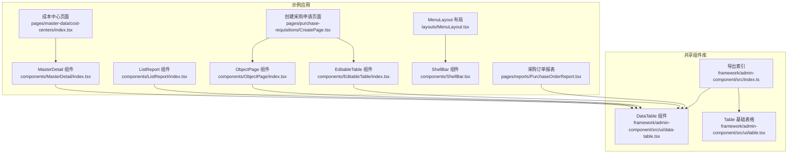
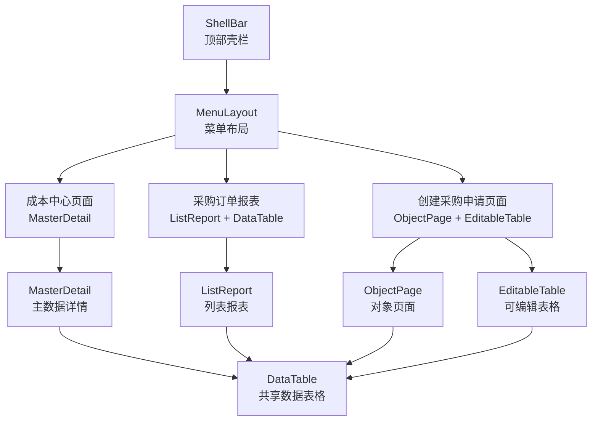
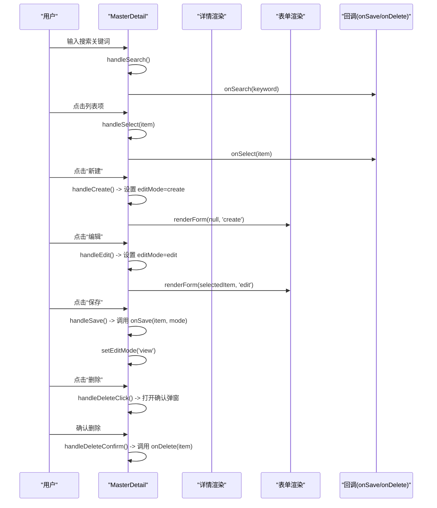
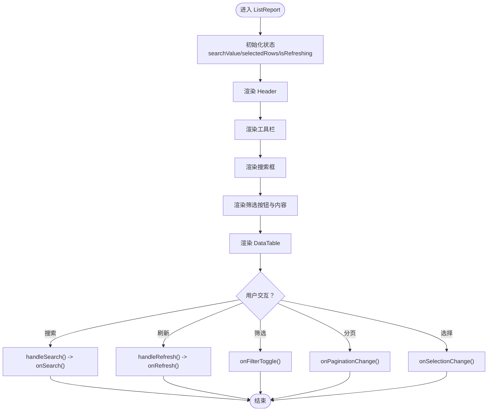
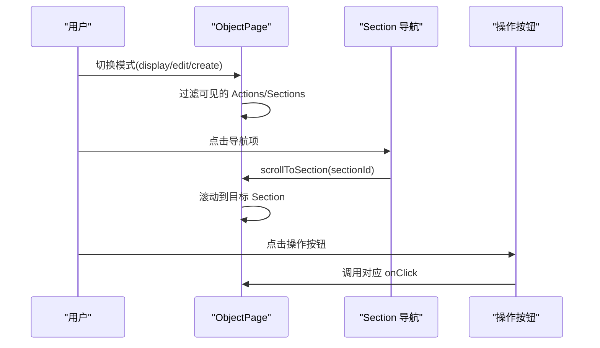
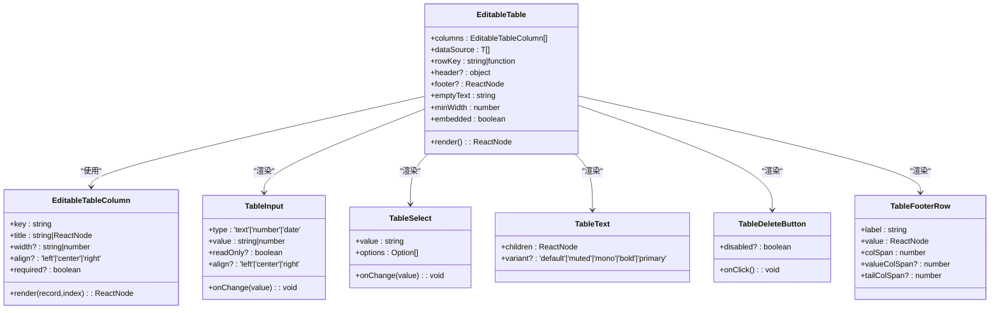
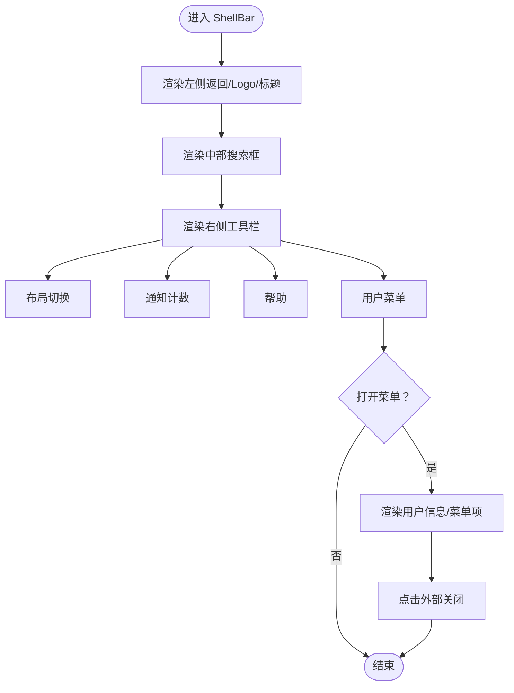
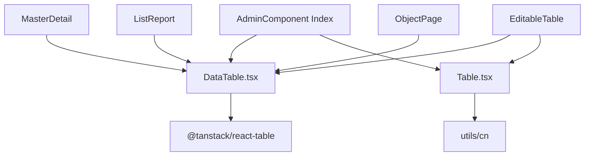

# 业务组件

<cite>
**本文引用的文件**
- [MasterDetail/index.tsx](file://app/examples/admin/src/components/MasterDetail/index.tsx)
- [ListReport/index.tsx](file://app/examples/admin/src/components/ListReport/index.tsx)
- [ObjectPage/index.tsx](file://app/examples/admin/src/components/ObjectPage/index.tsx)
- [EditableTable/index.tsx](file://app/examples/admin/src/components/EditableTable/index.tsx)
- [ShellBar.tsx](file://app/examples/admin/src/components/ShellBar.tsx)
- [MenuLayout.tsx](file://app/examples/admin/src/layouts/MenuLayout.tsx)
- [CostCentersPage.tsx](file://app/examples/admin/src/pages/master-data/cost-centers/index.tsx)
- [CreatePage.tsx](file://app/examples/admin/src/pages/purchase-requisitions/CreatePage.tsx)
- [PurchaseOrderReport.tsx](file://app/examples/admin/src/pages/reports/PurchaseOrderReport.tsx)
- [DataTable.tsx](file://app/framework/admin-component/src/ui/data-table.tsx)
- [Table.tsx](file://app/framework/admin-component/src/ui/table.tsx)
- [AdminComponent Index](file://app/framework/admin-component/src/index.ts)
</cite>

## 目录
1. [简介](#简介)
2. [项目结构](#项目结构)
3. [核心组件](#核心组件)
4. [架构总览](#架构总览)
5. [组件详解](#组件详解)
6. [依赖关系分析](#依赖关系分析)
7. [性能考量](#性能考量)
8. [故障排查指南](#故障排查指南)
9. [结论](#结论)
10. [附录](#附录)

## 简介
本文件面向业务开发者，系统性梳理并讲解 AI 伙伴框架中的高级业务组件：主数据详情（MasterDetail）、列表报表（ListReport）、对象页面（ObjectPage）、可编辑表格（EditableTable）与壳栏（ShellBar）。文档从设计理念、实现方式、功能特性、使用场景、配置选项、状态管理、数据流与事件处理机制入手，并结合实际页面示例给出完整业务流程与组合使用方法，同时提供复杂场景的实现思路与性能优化建议，帮助快速构建企业级前端应用。

## 项目结构
该仓库采用多包结构，业务组件位于示例应用与共享组件库两处：
- 示例应用层：app/examples/admin/src/components 与 pages，展示各组件的实际用法与业务页面。
- 共享组件库：app/framework/admin-component，封装基础 UI 与数据表格组件，供业务组件复用。

图表来源
- [MasterDetail/index.tsx](file://app/examples/admin/src/components/MasterDetail/index.tsx#L1-L498)
- [ListReport/index.tsx](file://app/examples/admin/src/components/ListReport/index.tsx#L1-L398)
- [ObjectPage/index.tsx](file://app/examples/admin/src/components/ObjectPage/index.tsx#L1-L544)
- [EditableTable/index.tsx](file://app/examples/admin/src/components/EditableTable/index.tsx#L1-L308)
- [ShellBar.tsx](file://app/examples/admin/src/components/ShellBar.tsx#L1-L299)
- [MenuLayout.tsx](file://app/examples/admin/src/layouts/MenuLayout.tsx#L1-L421)
- [CostCentersPage.tsx](file://app/examples/admin/src/pages/master-data/cost-centers/index.tsx#L1-L304)
- [CreatePage.tsx](file://app/examples/admin/src/pages/purchase-requisitions/CreatePage.tsx#L1-L567)
- [PurchaseOrderReport.tsx](file://app/examples/admin/src/pages/reports/PurchaseOrderReport.tsx#L1-L521)
- [DataTable.tsx](file://app/framework/admin-component/src/ui/data-table.tsx#L1-L375)
- [Table.tsx](file://app/framework/admin-component/src/ui/table.tsx#L1-L117)
- [AdminComponent Index](file://app/framework/admin-component/src/index.ts#L1-L38)

章节来源
- [MasterDetail/index.tsx](file://app/examples/admin/src/components/MasterDetail/index.tsx#L1-L498)
- [ListReport/index.tsx](file://app/examples/admin/src/components/ListReport/index.tsx#L1-L398)
- [ObjectPage/index.tsx](file://app/examples/admin/src/components/ObjectPage/index.tsx#L1-L544)
- [EditableTable/index.tsx](file://app/examples/admin/src/components/EditableTable/index.tsx#L1-L308)
- [ShellBar.tsx](file://app/examples/admin/src/components/ShellBar.tsx#L1-L299)
- [MenuLayout.tsx](file://app/examples/admin/src/layouts/MenuLayout.tsx#L1-L421)
- [CostCentersPage.tsx](file://app/examples/admin/src/pages/master-data/cost-centers/index.tsx#L1-L304)
- [CreatePage.tsx](file://app/examples/admin/src/pages/purchase-requisitions/CreatePage.tsx#L1-L567)
- [PurchaseOrderReport.tsx](file://app/examples/admin/src/pages/reports/PurchaseOrderReport.tsx#L1-L521)
- [DataTable.tsx](file://app/framework/admin-component/src/ui/data-table.tsx#L1-L375)
- [Table.tsx](file://app/framework/admin-component/src/ui/table.tsx#L1-L117)
- [AdminComponent Index](file://app/framework/admin-component/src/index.ts#L1-L38)

## 核心组件
- MasterDetail：左侧列表 + 右侧详情的主数据管理布局，支持查看/编辑/新建模式、搜索、删除确认、详情分节与字段展示。
- ListReport：基于 SAP Fiori List Report 的一体化卡片布局，集成 Header、工具栏、搜索筛选、数据表格与分页。
- ObjectPage：基于 SAP Fiori Object Page 的通用对象页面，支持 display/edit/create 三种模式，Section 导航与底部粘浮操作栏。
- EditableTable：表单内嵌可编辑表格，用于行项目编辑（如采购申请行），提供输入框、选择框、文本、删除按钮与汇总行。
- ShellBar：顶部导航壳栏，提供返回、Logo、搜索、布局切换、通知、帮助、用户菜单等。

章节来源
- [MasterDetail/index.tsx](file://app/examples/admin/src/components/MasterDetail/index.tsx#L11-L65)
- [ListReport/index.tsx](file://app/examples/admin/src/components/ListReport/index.tsx#L71-L141)
- [ObjectPage/index.tsx](file://app/examples/admin/src/components/ObjectPage/index.tsx#L51-L128)
- [EditableTable/index.tsx](file://app/examples/admin/src/components/EditableTable/index.tsx#L10-L51)
- [ShellBar.tsx](file://app/examples/admin/src/components/ShellBar.tsx#L78-L89)

## 架构总览
业务组件围绕“布局 + 表格 + 表单”的模式构建，通过共享组件库的 DataTable 实现高性能数据表格，配合自定义组件实现复杂交互与业务逻辑。

图表来源
- [ShellBar.tsx](file://app/examples/admin/src/components/ShellBar.tsx#L91-L102)
- [MenuLayout.tsx](file://app/examples/admin/src/layouts/MenuLayout.tsx#L160-L163)
- [CostCentersPage.tsx](file://app/examples/admin/src/pages/master-data/cost-centers/index.tsx#L283-L300)
- [CreatePage.tsx](file://app/examples/admin/src/pages/purchase-requisitions/CreatePage.tsx#L383-L506)
- [PurchaseOrderReport.tsx](file://app/examples/admin/src/pages/reports/PurchaseOrderReport.tsx#L440-L515)
- [MasterDetail/index.tsx](file://app/examples/admin/src/components/MasterDetail/index.tsx#L113-L132)
- [ObjectPage/index.tsx](file://app/examples/admin/src/components/ObjectPage/index.tsx#L131-L146)
- [EditableTable/index.tsx](file://app/examples/admin/src/components/EditableTable/index.tsx#L54-L65)
- [ListReport/index.tsx](file://app/examples/admin/src/components/ListReport/index.tsx#L145-L169)
- [DataTable.tsx](file://app/framework/admin-component/src/ui/data-table.tsx#L73-L90)

## 组件详解

### MasterDetail（主数据详情）
- 设计理念：遵循 SAP Fiori 主数据管理范式，左侧列表展示概览，右侧详情展示详细信息，支持在详情区内进行编辑。
- 功能特性：
  - 列表搜索、选中切换、空状态展示。
  - 详情区支持查看/编辑/新建三种模式，底部粘浮保存/取消。
  - 删除确认弹窗，防止误删。
  - 详情分节（DetailSection）、字段网格（DetailFieldGrid）、字段项（DetailField）辅助布局。
- 配置选项（核心属性）：
  - 基础：title/subtitle/headerIcon/items/selectedId/onSelect。
  - 搜索与过滤：searchPlaceholder/onSearch。
  - 编辑控制：showCreate/createLabel/allowEdit/allowDelete。
  - 回调：onSave/onDelete/renderDetail/renderForm。
  - 视觉：masterWidth。
- 状态管理与数据流：
  - 内部维护 searchKeyword、internalSelectedId、editMode、showDeleteConfirm。
  - 通过 props.onSearch/onSelect/onSave/onDelete 与父组件通信。
  - 编辑模式下禁用列表交互，避免状态冲突。
- 事件处理：
  - handleSearch、handleSelect、handleCreate、handleEdit、handleCancel、handleSave、handleDeleteClick、handleDeleteConfirm。
- 组合使用：
  - 与 EditableTable 结合用于行项目编辑；与 DetailSection/DetailFieldGrid 组合用于详情布局。
- 复杂场景实现：
  - 支持外部传入 selectedId 实现受控模式；支持 renderEmpty 自定义空状态。
- 性能优化建议：
  - 列表渲染时根据是否编辑禁用交互，减少不必要的重渲染。
  - 详情渲染按需加载，避免大对象一次性渲染。

图表来源
- [MasterDetail/index.tsx](file://app/examples/admin/src/components/MasterDetail/index.tsx#L142-L180)
- [MasterDetail/index.tsx](file://app/examples/admin/src/components/MasterDetail/index.tsx#L268-L305)

章节来源
- [MasterDetail/index.tsx](file://app/examples/admin/src/components/MasterDetail/index.tsx#L113-L355)
- [CostCentersPage.tsx](file://app/examples/admin/src/pages/master-data/cost-centers/index.tsx#L66-L300)

### ListReport（列表报表）
- 设计理念：SAP Fiori List Report 范式，Header + 工具栏 + 搜索筛选 + 数据表格一体化卡片布局。
- 功能特性：
  - Header 渐变背景、图标、标题、副标题、标签。
  - 工具栏：主操作按钮、行选择操作按钮、刷新、导出、列设置、设置、帮助。
  - 搜索与筛选：搜索框、筛选开关、筛选内容、清除筛选、应用按钮。
  - 数据表格：基于 DataTable，支持排序、分页、选择、行点击、行双击。
- 配置选项（核心属性）：
  - header/title/subtitle/tag/icon。
  - data/columns/loading/pageSize/pageIndex/onPaginationChange/getRowId。
  - primaryAction/selectionActions/onRefresh/onExport/onRowClick/onSelectionChange。
  - searchPlaceholder/onSearch/showFilter/onFilterToggle/filterContent/filterCount/onFilterClear。
- 状态管理与数据流：
  - 内部维护 searchValue、selectedRows、isRefreshing。
  - 通过 onSearch/onRefresh/onExport/onSelectionChange/onPaginationChange 与父组件通信。
- 事件处理：
  - handleSearch、handleRefresh、handleSelectionChange。
- 组合使用：
  - 与 DataTable 组合实现高性能数据表格；与筛选内容区域组合实现复杂筛选。
- 复杂场景实现：
  - 支持动态筛选计数（搜索框 + 外部筛选条件）；支持清除筛选与应用按钮。
- 性能优化建议：
  - 使用 DataTable 的手动分页与排序，避免全量数据渲染；合理设置 pageSizeOptions。

图表来源
- [ListReport/index.tsx](file://app/examples/admin/src/components/ListReport/index.tsx#L170-L194)
- [ListReport/index.tsx](file://app/examples/admin/src/components/ListReport/index.tsx#L377-L389)

章节来源
- [ListReport/index.tsx](file://app/examples/admin/src/components/ListReport/index.tsx#L145-L392)
- [PurchaseOrderReport.tsx](file://app/examples/admin/src/pages/reports/PurchaseOrderReport.tsx#L114-L517)

### ObjectPage（对象页面）
- 设计理念：SAP Fiori Object Page 范式，统一的头部、关键信息区、KPI、Section 区域与底部粘浮操作栏。
- 功能特性：
  - 三种模式：display（详情）、edit（编辑）、create（创建）。
  - Section 导航（可选），支持侧边栏 Section。
  - 头部面包屑、返回按钮、状态标签、操作按钮（header/footer）。
  - 底部粘浮工具栏（仅 edit/create 模式）。
- 配置选项（核心属性）：
  - mode/backPath/breadcrumb/title/subtitle/status/headerIcon/headerFields/kpis/tips/sections/actions/showSectionNav。
- 状态管理与数据流：
  - 内部维护 activeSection，滚动到指定 Section。
  - 根据模式过滤可见的 Actions 与 Sections。
- 事件处理：
  - scrollToSection、按钮点击回调。
- 组合使用：
  - 与 SectionCard 组合实现 Section 区域；与底部粘浮工具栏组合实现操作集中化。
- 复杂场景实现：
  - 支持不同模式下的按钮位置（header/footer）；支持 Section 侧边栏布局。
- 性能优化建议：
  - 滚动到 Section 使用 smooth 滚动，避免频繁重排；只在 edit/create 模式显示底部粘浮工具栏。

图表来源
- [ObjectPage/index.tsx](file://app/examples/admin/src/components/ObjectPage/index.tsx#L147-L181)
- [ObjectPage/index.tsx](file://app/examples/admin/src/components/ObjectPage/index.tsx#L426-L492)

章节来源
- [ObjectPage/index.tsx](file://app/examples/admin/src/components/ObjectPage/index.tsx#L131-L494)
- [CreatePage.tsx](file://app/examples/admin/src/pages/purchase-requisitions/CreatePage.tsx#L103-L567)

### EditableTable（可编辑表格）
- 设计理念：表单内嵌可编辑表格，用于行项目编辑（如采购申请行），支持输入、选择、文本、删除与汇总行。
- 功能特性：
  - 表头/表尾区域、空状态提示、最小宽度、嵌入模式。
  - 列配置：key/title/width/align/required/render。
  - 行键策略：rowKey 支持函数或字段名。
  - 辅助组件：TableInput/TableSelect/TableText/TableDeleteButton/TableFooterRow。
- 配置选项（核心属性）：
  - columns/dataSource/rowKey/header/footer/emptyText/minWidth/embedded。
- 状态管理与数据流：
  - 通过 props 传递 dataSource 与 columns，内部不维护状态。
  - 通过 render 函数将外部状态与表格联动。
- 事件处理：
  - 通过 render 中的 onChange 与外部表单状态同步。
- 组合使用：
  - 与 ObjectPage 的创建页面组合，实现行项目批量编辑。
- 复杂场景实现：
  - 行项目增删改查联动计算（如金额 = 数量 × 单价）。
- 性能优化建议：
  - 使用稳定的 rowKey；避免在 render 中创建新函数导致重渲染。

图表来源
- [EditableTable/index.tsx](file://app/examples/admin/src/components/EditableTable/index.tsx#L10-L51)
- [EditableTable/index.tsx](file://app/examples/admin/src/components/EditableTable/index.tsx#L54-L160)
- [EditableTable/index.tsx](file://app/examples/admin/src/components/EditableTable/index.tsx#L164-L305)

章节来源
- [EditableTable/index.tsx](file://app/examples/admin/src/components/EditableTable/index.tsx#L54-L308)
- [CreatePage.tsx](file://app/examples/admin/src/pages/purchase-requisitions/CreatePage.tsx#L383-L506)

### ShellBar（壳栏）
- 设计理念：现代化顶部导航栏，提供返回、Logo、搜索、布局切换、通知、帮助、用户菜单等。
- 功能特性：
  - 左侧：返回按钮、Logo、标题。
  - 中部：搜索框（移动端隐藏）。
  - 右侧：布局切换（磁贴/菜单）、通知、帮助、用户菜单。
  - 用户菜单：个人信息、设置、帮助、退出登录。
- 配置选项（核心属性）：
  - title/logo/userName/notificationCount/layoutMode/onLayoutModeChange/onMenuToggle/onLogout/showBackButton/onBack。
- 状态管理与数据流：
  - 内部维护 showUserMenu，点击外部区域关闭菜单。
- 事件处理：
  - onLayoutModeChange/onMenuToggle/onLogout/onBack。
- 组合使用：
  - 与 MenuLayout 组合，作为全局顶部导航。
- 复杂场景实现：
  - 通知计数动态显示；用户菜单支持下拉与点击外部关闭。
- 性能优化建议：
  - 用户菜单使用 fixed 定位，避免影响页面布局；搜索框在小屏隐藏提升体验。

图表来源
- [ShellBar.tsx](file://app/examples/admin/src/components/ShellBar.tsx#L105-L295)

章节来源
- [ShellBar.tsx](file://app/examples/admin/src/components/ShellBar.tsx#L91-L299)
- [MenuLayout.tsx](file://app/examples/admin/src/layouts/MenuLayout.tsx#L327-L333)

## 依赖关系分析
- 组件依赖：
  - MasterDetail、ListReport、ObjectPage、EditableTable 均依赖共享组件库的 DataTable。
  - EditableTable 内部使用基础 Table 组件。
- 外部依赖：
  - DataTable 基于 @tanstack/react-table 实现高性能表格。
- 导出索引：
  - admin-component 将常用组件导出，便于业务页面直接引用。

图表来源
- [DataTable.tsx](file://app/framework/admin-component/src/ui/data-table.tsx#L23-L26)
- [Table.tsx](file://app/framework/admin-component/src/ui/table.tsx#L5-L6)
- [AdminComponent Index](file://app/framework/admin-component/src/index.ts#L20-L31)
- [MasterDetail/index.tsx](file://app/examples/admin/src/components/MasterDetail/index.tsx#L8-L8)
- [ListReport/index.tsx](file://app/examples/admin/src/components/ListReport/index.tsx#L8-L8)
- [ObjectPage/index.tsx](file://app/examples/admin/src/components/ObjectPage/index.tsx#L10-L10)
- [EditableTable/index.tsx](file://app/examples/admin/src/components/EditableTable/index.tsx#L8-L8)

章节来源
- [DataTable.tsx](file://app/framework/admin-component/src/ui/data-table.tsx#L1-L375)
- [Table.tsx](file://app/framework/admin-component/src/ui/table.tsx#L1-L117)
- [AdminComponent Index](file://app/framework/admin-component/src/index.ts#L1-L38)

## 性能考量
- 表格性能：
  - 使用 DataTable 的手动分页与排序，避免全量数据渲染。
  - 合理设置 pageSizeOptions，控制单页数据量。
  - 使用稳定的 rowKey，减少重渲染。
- 交互性能：
  - MasterDetail 在编辑模式下禁用列表交互，减少事件处理开销。
  - ObjectPage 的 Section 导航使用 smooth 滚动，避免频繁 DOM 重排。
- 渲染优化：
  - EditableTable 的 render 函数应避免创建新函数，使用稳定引用。
  - ShellBar 的用户菜单使用 fixed 定位，减少布局抖动。
- 数据流优化：
  - 通过 props 传递数据与回调，避免在组件内部维护大量状态。

## 故障排查指南
- MasterDetail
  - 症状：编辑模式下无法切换列表项。
    - 原因：编辑模式下禁用了列表交互。
    - 解决：先退出编辑模式再切换。
  - 症状：删除确认弹窗无法关闭。
    - 原因：未正确处理 showDeleteConfirm。
    - 解决：确保点击遮罩层或取消按钮能关闭弹窗。
- ListReport
  - 症状：筛选后数据未更新。
    - 原因：未正确调用 onFilterClear 或 onSearch。
    - 解决：在清除筛选时重置搜索值并触发 onFilterClear。
- ObjectPage
  - 症状：Section 导航无效。
    - 原因：未正确设置 activeSection 或元素不存在。
    - 解决：确保 Section 具备正确 id 并存在。
- EditableTable
  - 症状：行项目编辑无效。
    - 原因：render 中未正确绑定 onChange。
    - 解决：确保 render 返回的输入框绑定了正确的 onChange。
- ShellBar
  - 症状：用户菜单点击外部不关闭。
    - 原因：未正确处理点击外部事件。
    - 解决：为遮罩层添加点击事件关闭菜单。

章节来源
- [MasterDetail/index.tsx](file://app/examples/admin/src/components/MasterDetail/index.tsx#L147-L180)
- [ListReport/index.tsx](file://app/examples/admin/src/components/ListReport/index.tsx#L347-L360)
- [ObjectPage/index.tsx](file://app/examples/admin/src/components/ObjectPage/index.tsx#L174-L181)
- [EditableTable/index.tsx](file://app/examples/admin/src/components/EditableTable/index.tsx#L164-L202)
- [ShellBar.tsx](file://app/examples/admin/src/components/ShellBar.tsx#L220-L226)

## 结论
本文件系统性介绍了 AI 伙伴框架中的高级业务组件，涵盖设计理念、实现方式、配置选项、状态管理、数据流与事件处理，并结合实际页面示例展示了组件的组合使用与复杂场景实现。通过共享组件库的高性能 DataTable 与自定义业务组件，开发者可以快速搭建主数据管理、报表分析与对象页面等企业级应用，同时具备良好的可扩展性与定制化能力。

## 附录
- 业务页面示例
  - 成本中心主数据页面：展示 MasterDetail 的典型用法与详情分节。
  - 创建采购申请页面：展示 ObjectPage 与 EditableTable 的组合使用。
  - 采购订单报表：展示 ListReport 与 DataTable 的组合使用。
- 组件扩展与定制
  - 可通过 props 扩展 MasterDetail 的渲染函数与回调。
  - 可通过 columns 与 cell 自定义 ListReport 的列与单元格渲染。
  - 可通过 sections/actions 自定义 ObjectPage 的内容与操作。
  - 可通过 render 函数与辅助组件扩展 EditableTable 的编辑能力。

章节来源
- [CostCentersPage.tsx](file://app/examples/admin/src/pages/master-data/cost-centers/index.tsx#L66-L300)
- [CreatePage.tsx](file://app/examples/admin/src/pages/purchase-requisitions/CreatePage.tsx#L103-L567)
- [PurchaseOrderReport.tsx](file://app/examples/admin/src/pages/reports/PurchaseOrderReport.tsx#L114-L517)