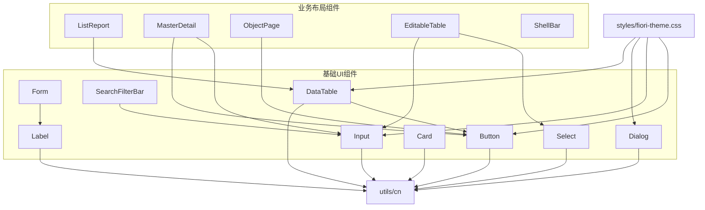
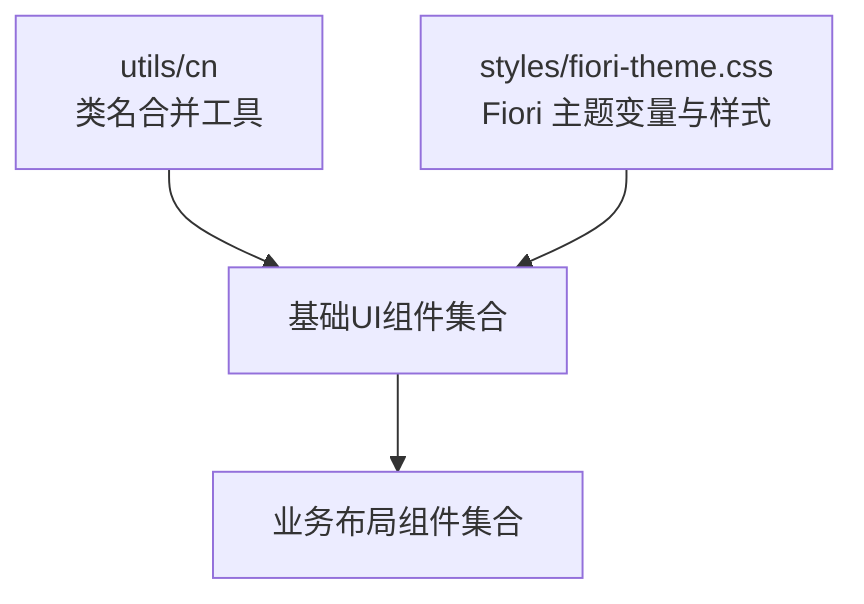
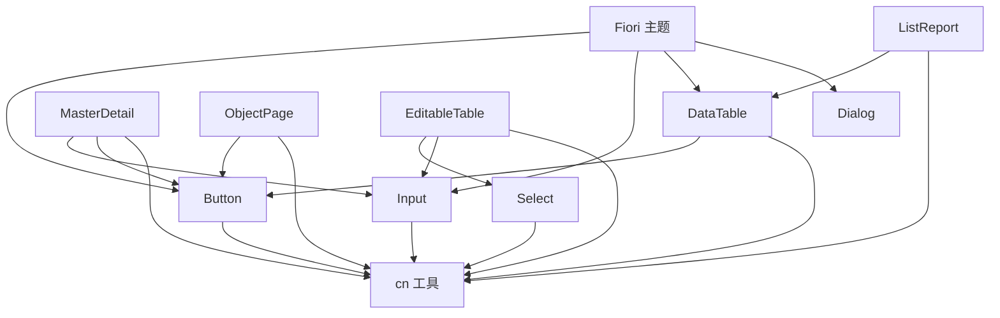

# 前端组件库 (aiko-boot-admin-component)

<cite>
**本文引用的文件**
- [app/framework/admin-component/src/ui/button.tsx](file://app/framework/admin-component/src/ui/button.tsx)
- [app/framework/admin-component/src/ui/input.tsx](file://app/framework/admin-component/src/ui/input.tsx)
- [app/framework/admin-component/src/ui/label.tsx](file://app/framework/admin-component/src/ui/label.tsx)
- [app/framework/admin-component/src/ui/card.tsx](file://app/framework/admin-component/src/ui/card.tsx)
- [app/framework/admin-component/src/ui/data-table.tsx](file://app/framework/admin-component/src/ui/data-table.tsx)
- [app/framework/admin-component/src/ui/dialog.tsx](file://app/framework/admin-component/src/ui/dialog.tsx)
- [app/framework/admin-component/src/ui/form.tsx](file://app/framework/admin-component/src/ui/form.tsx)
- [app/framework/admin-component/src/ui/select.tsx](file://app/framework/admin-component/src/ui/select.tsx)
- [app/framework/admin-component/src/ui/search-filter-bar.tsx](file://app/framework/admin-component/src/ui/search-filter-bar.tsx)
- [app/framework/admin-component/src/utils.ts](file://app/framework/admin-component/src/utils.ts)
- [app/framework/admin-component/src/styles/fiori-theme.css](file://app/framework/admin-component/src/styles/fiori-theme.css)
- [app/framework/admin-component/src/index.ts](file://app/framework/admin-component/src/index.ts)
- [app/examples/admin/src/components/EditableTable/index.tsx](file://app/examples/admin/src/components/EditableTable/index.tsx)
- [app/examples/admin/src/components/ListReport/index.tsx](file://app/examples/admin/src/components/ListReport/index.tsx)
- [app/examples/admin/src/components/MasterDetail/index.tsx](file://app/examples/admin/src/components/MasterDetail/index.tsx)
- [app/examples/admin/src/components/ObjectPage/index.tsx](file://app/examples/admin/src/components/ObjectPage/index.tsx)
- [app/examples/admin/src/components/ShellBar.tsx](file://app/examples/admin/src/components/ShellBar.tsx)
</cite>

## 目录
1. [简介](#简介)
2. [项目结构](#项目结构)
3. [核心组件](#核心组件)
4. [架构概览](#架构概览)
5. [组件详解](#组件详解)
6. [依赖关系分析](#依赖关系分析)
7. [性能与可访问性](#性能与可访问性)
8. [故障排查指南](#故障排查指南)
9. [结论](#结论)
10. [附录](#附录)

## 简介
本组件库以 SAP Fiori 设计语言为核心，提供统一的 UI 组件体系，覆盖基础控件、表单、数据展示、对话交互与页面布局五大类别。组件遵循一致的视觉与交互规范，支持响应式布局与无障碍访问；同时提供灵活的主题系统与样式定制能力，便于在企业级后台管理系统中快速构建一致、专业且可维护的界面。

## 项目结构
组件库采用“基础组件 + 业务布局组件”的分层组织方式：
- 基础 UI 组件：button、input、label、card、dialog、form、select、search-filter-bar、data-table 等
- 业务布局组件：ListReport、MasterDetail、ObjectPage、EditableTable、ShellBar 等
- 工具与样式：cn 工具函数、Fiori 主题样式文件
- 导出入口：index.ts 提供统一导出

图表来源
- [app/framework/admin-component/src/ui/button.tsx](file://app/framework/admin-component/src/ui/button.tsx#L1-L65)
- [app/framework/admin-component/src/ui/data-table.tsx](file://app/framework/admin-component/src/ui/data-table.tsx#L1-L375)
- [app/framework/admin-component/src/ui/search-filter-bar.tsx](file://app/framework/admin-component/src/ui/search-filter-bar.tsx#L1-L276)
- [app/framework/admin-component/src/ui/form.tsx](file://app/framework/admin-component/src/ui/form.tsx#L1-L168)
- [app/framework/admin-component/src/ui/select.tsx](file://app/framework/admin-component/src/ui/select.tsx#L1-L154)
- [app/framework/admin-component/src/ui/dialog.tsx](file://app/framework/admin-component/src/ui/dialog.tsx#L1-L159)
- [app/framework/admin-component/src/ui/card.tsx](file://app/framework/admin-component/src/ui/card.tsx#L1-L93)
- [app/framework/admin-component/src/ui/input.tsx](file://app/framework/admin-component/src/ui/input.tsx#L1-L22)
- [app/framework/admin-component/src/ui/label.tsx](file://app/framework/admin-component/src/ui/label.tsx#L1-L25)
- [app/framework/admin-component/src/utils.ts](file://app/framework/admin-component/src/utils.ts#L1-L7)
- [app/framework/admin-component/src/styles/fiori-theme.css](file://app/framework/admin-component/src/styles/fiori-theme.css)

章节来源
- [app/framework/admin-component/src/index.ts](file://app/framework/admin-component/src/index.ts)
- [app/framework/admin-component/src/utils.ts](file://app/framework/admin-component/src/utils.ts#L1-L7)
- [app/framework/admin-component/src/styles/fiori-theme.css](file://app/framework/admin-component/src/styles/fiori-theme.css)

## 核心组件
本节概述基础 UI 组件的能力边界与典型用法要点，便于快速上手与查阅。

- Button
  - 支持多种变体与尺寸，具备禁用态与聚焦态样式
  - 适合主次操作、链接与图标按钮
  - 参考路径：[Button 组件](file://app/framework/admin-component/src/ui/button.tsx#L1-L65)

- Input
  - 提供统一的输入框样式与焦点态高亮
  - 支持类型、占位符与禁用态
  - 参考路径：[Input 组件](file://app/framework/admin-component/src/ui/input.tsx#L1-L22)

- Label
  - 与表单控件配合，支持错误态与禁用态
  - 参考路径：[Label 组件](file://app/framework/admin-component/src/ui/label.tsx#L1-L25)

- Card
  - 卡片容器，支持头部、标题、描述、内容、操作与底部
  - 参考路径：[Card 组件](file://app/framework/admin-component/src/ui/card.tsx#L1-L93)

- Dialog
  - 基于 Radix UI 的模态对话框，支持遮罩、关闭按钮与动画
  - 参考路径：[Dialog 组件](file://app/framework/admin-component/src/ui/dialog.tsx#L1-L159)

- Form
  - 基于 react-hook-form 的表单上下文与字段封装
  - 提供 FormItem、FormLabel、FormControl、FormDescription、FormMessage
  - 参考路径：[Form 组件](file://app/framework/admin-component/src/ui/form.tsx#L1-L168)

- Select
  - 基于 Radix UI 的下拉选择，支持多选、占位符与空值处理
  - 参考路径：[Select 组件](file://app/framework/admin-component/src/ui/select.tsx#L1-L154)

- SearchFilterBar
  - 搜索 + 筛选栏，支持展开/收起、应用/清除、动态渲染不同类型的筛选字段
  - 参考路径：[SearchFilterBar 组件](file://app/framework/admin-component/src/ui/search-filter-bar.tsx#L1-L276)

- DataTable
  - 基于 @tanstack/react-table 的数据表格，支持排序、分页、选择、行点击与加载态
  - 参考路径：[DataTable 组件](file://app/framework/admin-component/src/ui/data-table.tsx#L1-L375)

章节来源
- [app/framework/admin-component/src/ui/button.tsx](file://app/framework/admin-component/src/ui/button.tsx#L1-L65)
- [app/framework/admin-component/src/ui/input.tsx](file://app/framework/admin-component/src/ui/input.tsx#L1-L22)
- [app/framework/admin-component/src/ui/label.tsx](file://app/framework/admin-component/src/ui/label.tsx#L1-L25)
- [app/framework/admin-component/src/ui/card.tsx](file://app/framework/admin-component/src/ui/card.tsx#L1-L93)
- [app/framework/admin-component/src/ui/dialog.tsx](file://app/framework/admin-component/src/ui/dialog.tsx#L1-L159)
- [app/framework/admin-component/src/ui/form.tsx](file://app/framework/admin-component/src/ui/form.tsx#L1-L168)
- [app/framework/admin-component/src/ui/select.tsx](file://app/framework/admin-component/src/ui/select.tsx#L1-L154)
- [app/framework/admin-component/src/ui/search-filter-bar.tsx](file://app/framework/admin-component/src/ui/search-filter-bar.tsx#L1-L276)
- [app/framework/admin-component/src/ui/data-table.tsx](file://app/framework/admin-component/src/ui/data-table.tsx#L1-L375)

## 架构概览
组件库通过统一的样式与工具函数实现一致性，业务布局组件复用基础组件形成完整页面体验。

图表来源
- [app/framework/admin-component/src/utils.ts](file://app/framework/admin-component/src/utils.ts#L1-L7)
- [app/framework/admin-component/src/styles/fiori-theme.css](file://app/framework/admin-component/src/styles/fiori-theme.css)

## 组件详解

### Button（按钮）
- 功能特性
  - 变体：default、destructive、outline、secondary、ghost、link
  - 尺寸：default、xs、sm、lg、icon、icon-xs、icon-sm、icon-lg
  - 支持 asChild、禁用态、聚焦态与图标
- 使用建议
  - 主操作使用 default 或 primary 变体；危险操作使用 destructive
  - 图标按钮使用 icon 尺寸；复杂操作使用带图标的 default
- 示例参考
  - [Button 组件定义](file://app/framework/admin-component/src/ui/button.tsx#L1-L65)

章节来源
- [app/framework/admin-component/src/ui/button.tsx](file://app/framework/admin-component/src/ui/button.tsx#L1-L65)

### Input（输入框）
- 功能特性
  - 统一的边框、阴影与聚焦态
  - 支持类型、占位符、禁用态与无障碍属性
- 使用建议
  - 与 Form.Label、Form.Control 组合使用，确保可访问性
- 示例参考
  - [Input 组件定义](file://app/framework/admin-component/src/ui/input.tsx#L1-L22)

章节来源
- [app/framework/admin-component/src/ui/input.tsx](file://app/framework/admin-component/src/ui/input.tsx#L1-L22)

### Label（标签）
- 功能特性
  - 与表单控件配对，支持错误态与禁用态
- 使用建议
  - 与 Form.FormLabel、FormControl 搭配，自动管理 aria 属性
- 示例参考
  - [Label 组件定义](file://app/framework/admin-component/src/ui/label.tsx#L1-L25)

章节来源
- [app/framework/admin-component/src/ui/label.tsx](file://app/framework/admin-component/src/ui/label.tsx#L1-L25)

### Card（卡片）
- 功能特性
  - 支持头部、标题、描述、内容、操作与底部
  - 结构化布局，适用于信息区块与面板
- 使用建议
  - 与 DataTable、Form 等组合，形成“卡片 + 表格/表单”的常见布局
- 示例参考
  - [Card 组件定义](file://app/framework/admin-component/src/ui/card.tsx#L1-L93)

章节来源
- [app/framework/admin-component/src/ui/card.tsx](file://app/framework/admin-component/src/ui/card.tsx#L1-L93)

### Dialog（对话框）
- 功能特性
  - 支持遮罩层、关闭按钮、动画进入/退出
  - 提供 Header/Footer/Title/Description 容器
- 使用建议
  - 重要确认或设置类操作使用 Dialog；避免阻塞主流程
- 示例参考
  - [Dialog 组件定义](file://app/framework/admin-component/src/ui/dialog.tsx#L1-L159)

章节来源
- [app/framework/admin-component/src/ui/dialog.tsx](file://app/framework/admin-component/src/ui/dialog.tsx#L1-L159)

### Form（表单）
- 功能特性
  - 基于 react-hook-form 的表单上下文
  - 字段级校验、错误消息、描述文本与控制组件接入
- 使用建议
  - 所有表单字段均应包裹在 FormField 中，使用 useFormField 管理状态
- 示例参考
  - [Form 组件定义](file://app/framework/admin-component/src/ui/form.tsx#L1-L168)

章节来源
- [app/framework/admin-component/src/ui/form.tsx](file://app/framework/admin-component/src/ui/form.tsx#L1-L168)

### Select（下拉选择）
- 功能特性
  - 支持单选、多选、禁用、占位符与空值处理
  - 基于 Radix UI，提供选择项指示器与动画
- 使用建议
  - 大量选项时优先考虑异步加载或分页
- 示例参考
  - [Select 组件定义](file://app/framework/admin-component/src/ui/select.tsx#L1-L154)

章节来源
- [app/framework/admin-component/src/ui/select.tsx](file://app/framework/admin-component/src/ui/select.tsx#L1-L154)

### SearchFilterBar（搜索筛选栏）
- 功能特性
  - 搜索框 + 筛选按钮 + 应用/清除按钮 + 可展开的筛选字段区域
  - 支持多种筛选字段类型：文本、单选、多选、日期、日期范围
- 使用建议
  - 筛选字段较多时，使用展开/收起减少首屏压力
- 示例参考
  - [SearchFilterBar 组件定义](file://app/framework/admin-component/src/ui/search-filter-bar.tsx#L1-L276)

章节来源
- [app/framework/admin-component/src/ui/search-filter-bar.tsx](file://app/framework/admin-component/src/ui/search-filter-bar.tsx#L1-L276)

### DataTable（数据表格）
- 功能特性
  - 支持排序、分页、行选择、行点击/双击、加载态与空态
  - 基于 @tanstack/react-table，高度可扩展
- 使用建议
  - 大数据量时启用手动分页与服务端排序
- 示例参考
  - [DataTable 组件定义](file://app/framework/admin-component/src/ui/data-table.tsx#L1-L375)

章节来源
- [app/framework/admin-component/src/ui/data-table.tsx](file://app/framework/admin-component/src/ui/data-table.tsx#L1-L375)

### EditableTable（表单内嵌可编辑表格）
- 功能特性
  - 表单内嵌表格，支持输入框、选择框、文本、删除按钮与汇总行
  - 支持嵌入模式（无边框、无圆角）
- 使用建议
  - 与 react-hook-form 结合，使用 TableInput/TableSelect 等子组件
- 示例参考
  - [EditableTable 组件定义](file://app/examples/admin/src/components/EditableTable/index.tsx#L1-L308)

章节来源
- [app/examples/admin/src/components/EditableTable/index.tsx](file://app/examples/admin/src/components/EditableTable/index.tsx#L1-L308)

### ListReport（列表报表）
- 功能特性
  - 基于 Fiori List Report 设计的一体化卡片风格，包含 Header、工具栏、搜索筛选、数据表格
  - 支持主操作按钮、行选择操作、分页与行点击
- 使用建议
  - 与 DataTable 组合，统一使用列定义与分页回调
- 示例参考
  - [ListReport 组件定义](file://app/examples/admin/src/components/ListReport/index.tsx#L1-L398)

章节来源
- [app/examples/admin/src/components/ListReport/index.tsx](file://app/examples/admin/src/components/ListReport/index.tsx#L1-L398)

### MasterDetail（主从布局）
- 功能特性
  - 左侧列表 + 右侧详情的经典布局，支持编辑模式
  - 支持搜索、创建、编辑、删除与确认弹窗
- 使用建议
  - 编辑模式下锁定左侧列表交互，避免误操作
- 示例参考
  - [MasterDetail 组件定义](file://app/examples/admin/src/components/MasterDetail/index.tsx#L1-L498)

章节来源
- [app/examples/admin/src/components/MasterDetail/index.tsx](file://app/examples/admin/src/components/MasterDetail/index.tsx#L1-L498)

### ObjectPage（对象页）
- 功能特性
  - 基于 Fiori Object Page 设计，支持 display/edit/create 三种模式
  - 支持 Section 导航、KPI 指标、操作按钮与底部粘浮工具栏
- 使用建议
  - 根据模式动态显示/隐藏操作按钮与 Section
- 示例参考
  - [ObjectPage 组件定义](file://app/examples/admin/src/components/ObjectPage/index.tsx#L1-L544)

章节来源
- [app/examples/admin/src/components/ObjectPage/index.tsx](file://app/examples/admin/src/components/ObjectPage/index.tsx#L1-L544)

### ShellBar（顶部导航栏）
- 功能特性
  - 现代化顶部导航栏，支持搜索、布局切换、通知、用户菜单
  - 响应式设计，移动端友好
- 使用建议
  - 与路由集成，实现返回门户与面包屑导航
- 示例参考
  - [ShellBar 组件定义](file://app/examples/admin/src/components/ShellBar.tsx#L1-L299)

章节来源
- [app/examples/admin/src/components/ShellBar.tsx](file://app/examples/admin/src/components/ShellBar.tsx#L1-L299)

## 依赖关系分析
- 组件间依赖
  - ListReport 依赖 DataTable
  - MasterDetail 依赖 Input、Button
  - ObjectPage 依赖 Button
  - EditableTable 依赖 Select、Input
- 工具与样式
  - 所有组件通过 cn 工具进行类名合并
  - 主题样式通过 fiori-theme.css 提供统一变量与基础样式

图表来源
- [app/framework/admin-component/src/ui/data-table.tsx](file://app/framework/admin-component/src/ui/data-table.tsx#L1-L375)
- [app/framework/admin-component/src/ui/button.tsx](file://app/framework/admin-component/src/ui/button.tsx#L1-L65)
- [app/framework/admin-component/src/ui/input.tsx](file://app/framework/admin-component/src/ui/input.tsx#L1-L22)
- [app/framework/admin-component/src/ui/select.tsx](file://app/framework/admin-component/src/ui/select.tsx#L1-L154)
- [app/framework/admin-component/src/ui/dialog.tsx](file://app/framework/admin-component/src/ui/dialog.tsx#L1-L159)
- [app/framework/admin-component/src/utils.ts](file://app/framework/admin-component/src/utils.ts#L1-L7)
- [app/framework/admin-component/src/styles/fiori-theme.css](file://app/framework/admin-component/src/styles/fiori-theme.css)

章节来源
- [app/framework/admin-component/src/ui/data-table.tsx](file://app/framework/admin-component/src/ui/data-table.tsx#L1-L375)
- [app/framework/admin-component/src/ui/button.tsx](file://app/framework/admin-component/src/ui/button.tsx#L1-L65)
- [app/framework/admin-component/src/ui/input.tsx](file://app/framework/admin-component/src/ui/input.tsx#L1-L22)
- [app/framework/admin-component/src/ui/select.tsx](file://app/framework/admin-component/src/ui/select.tsx#L1-L154)
- [app/framework/admin-component/src/ui/dialog.tsx](file://app/framework/admin-component/src/ui/dialog.tsx#L1-L159)
- [app/framework/admin-component/src/utils.ts](file://app/framework/admin-component/src/utils.ts#L1-L7)
- [app/framework/admin-component/src/styles/fiori-theme.css](file://app/framework/admin-component/src/styles/fiori-theme.css)

## 性能与可访问性
- 性能
  - DataTable 支持手动分页与服务端排序，避免一次性渲染大量数据
  - SearchFilterBar 支持展开/收起，减少不必要的 DOM 渲染
  - cn 工具合并类名，减少重复样式计算
- 可访问性
  - Form 组件自动管理 aria-invalid、aria-describedby 等属性
  - Label 与 Input 配合，确保屏幕阅读器正确读取标签
  - Dialog 提供关闭按钮与遮罩层，支持键盘交互
- 建议
  - 大表格启用虚拟滚动或分页
  - 表单字段务必绑定 Label 与错误消息
  - 对需要键盘操作的组件提供键盘快捷键提示

[本节为通用指导，不直接分析具体文件]

## 故障排查指南
- 表单校验未生效
  - 确认字段包裹在 FormField 中，并使用 useFormField 获取状态
  - 参考路径：[Form 组件](file://app/framework/admin-component/src/ui/form.tsx#L1-L168)
- 下拉选择无法清空
  - Select 对空值有特殊处理，确保传入空字符串时行为符合预期
  - 参考路径：[Select 组件](file://app/framework/admin-component/src/ui/select.tsx#L1-L154)
- 表格分页异常
  - 若使用手动分页，请确保 totalCount 正确计算并传入
  - 参考路径：[DataTable 组件](file://app/framework/admin-component/src/ui/data-table.tsx#L1-L375)
- 对话框无法关闭
  - 确认 DialogTrigger 与 DialogContent 的组合使用，检查 Portal 渲染
  - 参考路径：[Dialog 组件](file://app/framework/admin-component/src/ui/dialog.tsx#L1-L159)

章节来源
- [app/framework/admin-component/src/ui/form.tsx](file://app/framework/admin-component/src/ui/form.tsx#L1-L168)
- [app/framework/admin-component/src/ui/select.tsx](file://app/framework/admin-component/src/ui/select.tsx#L1-L154)
- [app/framework/admin-component/src/ui/data-table.tsx](file://app/framework/admin-component/src/ui/data-table.tsx#L1-L375)
- [app/framework/admin-component/src/ui/dialog.tsx](file://app/framework/admin-component/src/ui/dialog.tsx#L1-L159)

## 结论
该组件库以 Fiori 规范为基础，结合现代前端技术栈，提供了从基础控件到业务布局的完整 UI 解决方案。通过统一的工具与主题系统，开发者可以快速搭建一致、可维护的企业后台界面；同时，组件具备良好的扩展性与可定制能力，满足多样化的业务需求。

[本节为总结性内容，不直接分析具体文件]

## 附录

### 组件属性与事件速查（节选）
- Button
  - 变体：default、destructive、outline、secondary、ghost、link
  - 尺寸：default、xs、sm、lg、icon、icon-xs、icon-sm、icon-lg
  - 参考路径：[Button 组件](file://app/framework/admin-component/src/ui/button.tsx#L1-L65)
- Input
  - 类型：text、email、password、number、date 等
  - 参考路径：[Input 组件](file://app/framework/admin-component/src/ui/input.tsx#L1-L22)
- Label
  - 参考路径：[Label 组件](file://app/framework/admin-component/src/ui/label.tsx#L1-L25)
- Card
  - 结构：CardHeader、CardTitle、CardDescription、CardContent、CardAction、CardFooter
  - 参考路径：[Card 组件](file://app/framework/admin-component/src/ui/card.tsx#L1-L93)
- Dialog
  - 容器：Dialog、DialogContent、DialogHeader、DialogTitle、DialogDescription、DialogFooter、DialogOverlay、DialogPortal、DialogTrigger、DialogClose
  - 参考路径：[Dialog 组件](file://app/framework/admin-component/src/ui/dialog.tsx#L1-L159)
- Form
  - 上下文：Form、FormField
  - 字段：FormItem、FormLabel、FormControl、FormDescription、FormMessage
  - 参考路径：[Form 组件](file://app/framework/admin-component/src/ui/form.tsx#L1-L168)
- Select
  - 选项：Select、SelectItem
  - 参考路径：[Select 组件](file://app/framework/admin-component/src/ui/select.tsx#L1-L154)
- SearchFilterBar
  - 字段类型：text、select、multiselect、date、daterange
  - 参考路径：[SearchFilterBar 组件](file://app/framework/admin-component/src/ui/search-filter-bar.tsx#L1-L276)
- DataTable
  - 回调：onSelectionChange、onPaginationChange、onSortChange、onRowClick、onRowDoubleClick
  - 参考路径：[DataTable 组件](file://app/framework/admin-component/src/ui/data-table.tsx#L1-L375)

章节来源
- [app/framework/admin-component/src/ui/button.tsx](file://app/framework/admin-component/src/ui/button.tsx#L1-L65)
- [app/framework/admin-component/src/ui/input.tsx](file://app/framework/admin-component/src/ui/input.tsx#L1-L22)
- [app/framework/admin-component/src/ui/label.tsx](file://app/framework/admin-component/src/ui/label.tsx#L1-L25)
- [app/framework/admin-component/src/ui/card.tsx](file://app/framework/admin-component/src/ui/card.tsx#L1-L93)
- [app/framework/admin-component/src/ui/dialog.tsx](file://app/framework/admin-component/src/ui/dialog.tsx#L1-L159)
- [app/framework/admin-component/src/ui/form.tsx](file://app/framework/admin-component/src/ui/form.tsx#L1-L168)
- [app/framework/admin-component/src/ui/select.tsx](file://app/framework/admin-component/src/ui/select.tsx#L1-L154)
- [app/framework/admin-component/src/ui/search-filter-bar.tsx](file://app/framework/admin-component/src/ui/search-filter-bar.tsx#L1-L276)
- [app/framework/admin-component/src/ui/data-table.tsx](file://app/framework/admin-component/src/ui/data-table.tsx#L1-L375)