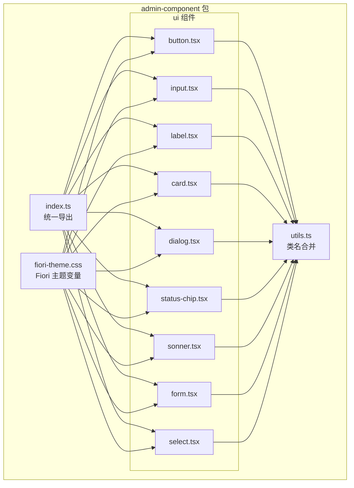
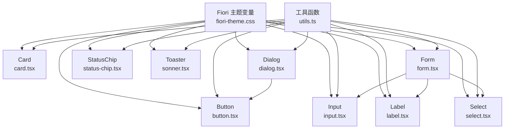
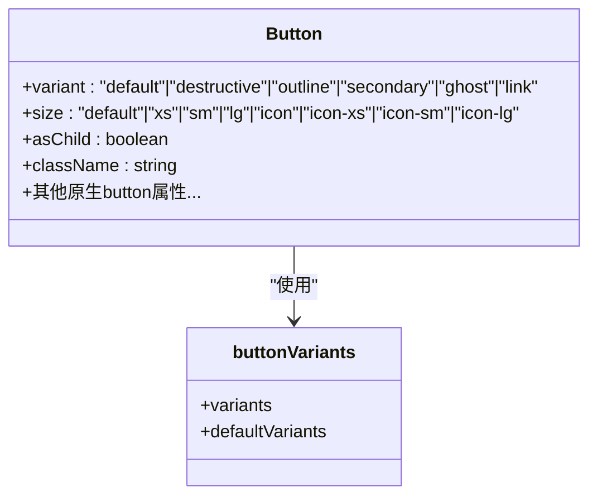
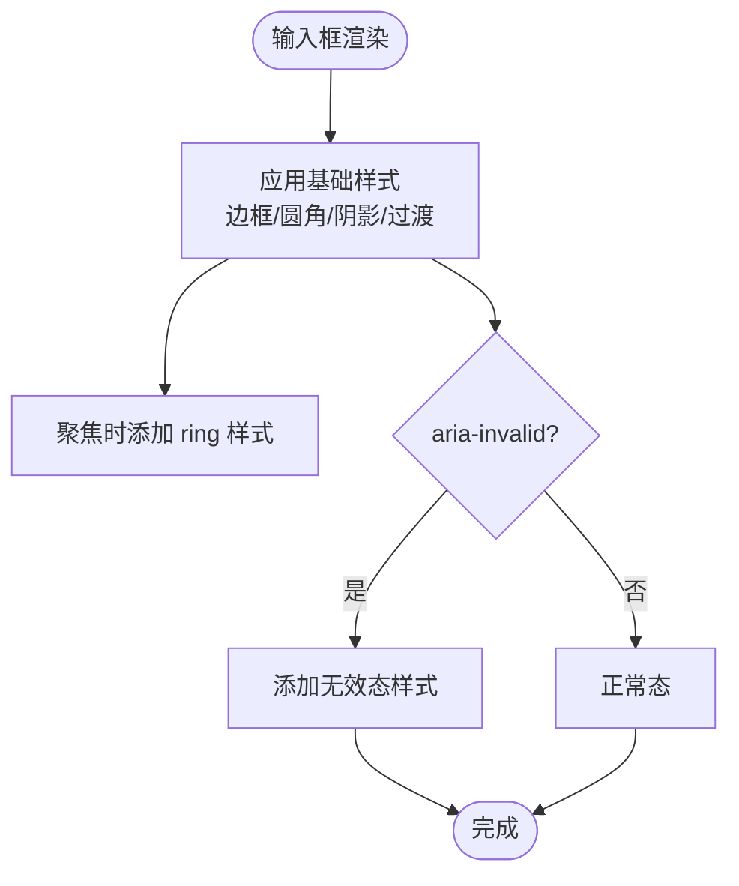
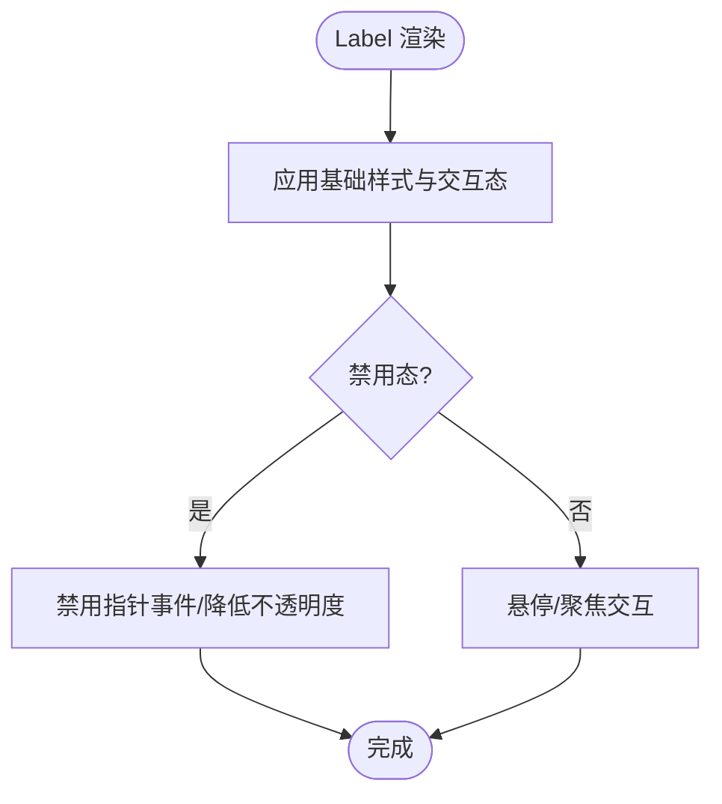
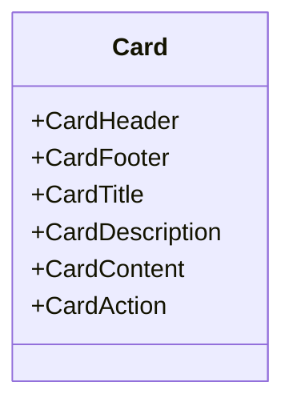
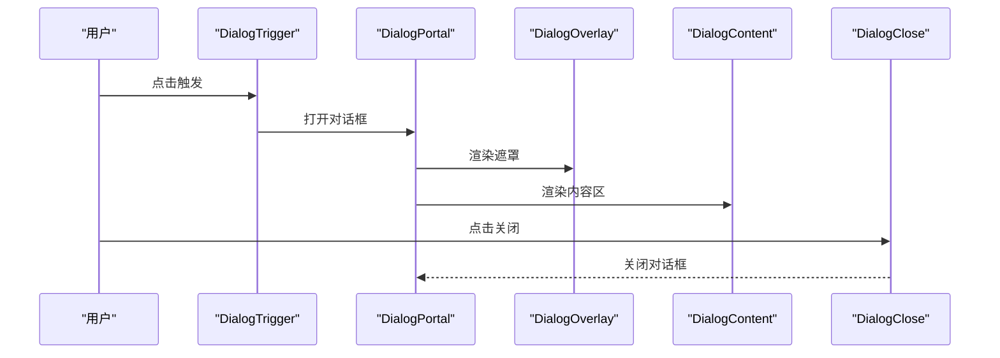
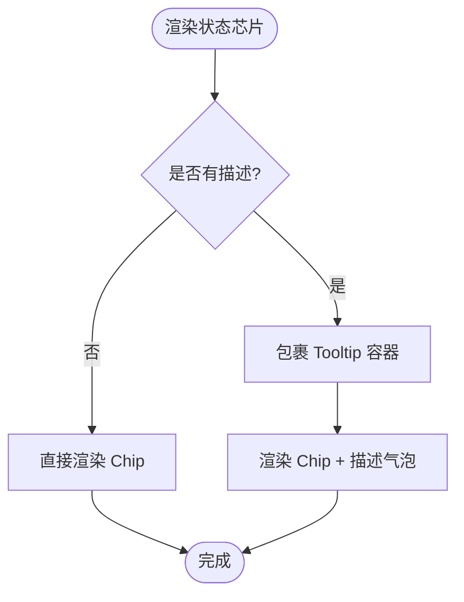
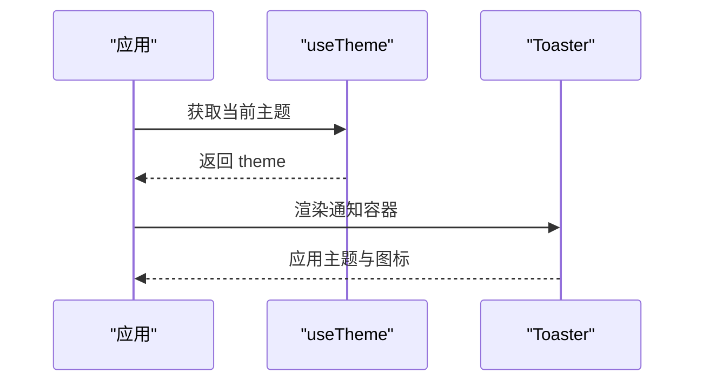
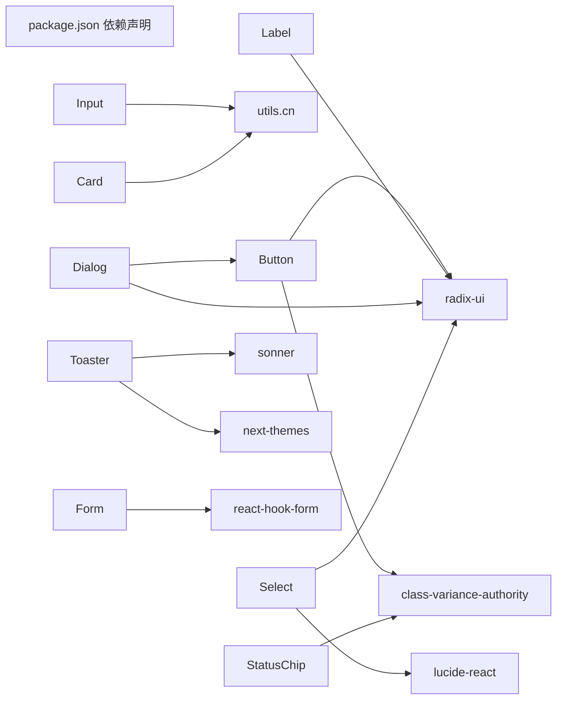

# 基础 UI 组件

<cite>
**本文引用的文件**
- [button.tsx](file://app/framework/admin-component/src/ui/button.tsx)
- [input.tsx](file://app/framework/admin-component/src/ui/input.tsx)
- [label.tsx](file://app/framework/admin-component/src/ui/label.tsx)
- [card.tsx](file://app/framework/admin-component/src/ui/card.tsx)
- [dialog.tsx](file://app/framework/admin-component/src/ui/dialog.tsx)
- [status-chip.tsx](file://app/framework/admin-component/src/ui/status-chip.tsx)
- [sonner.tsx](file://app/framework/admin-component/src/ui/sonner.tsx)
- [index.ts](file://app/framework/admin-component/src/index.ts)
- [utils.ts](file://app/framework/admin-component/src/utils.ts)
- [fiori-theme.css](file://app/framework/admin-component/src/styles/fiori-theme.css)
- [form.tsx](file://app/framework/admin-component/src/ui/form.tsx)
- [select.tsx](file://app/framework/admin-component/src/ui/select.tsx)
- [package.json](file://app/framework/admin-component/package.json)
- [ListPage.tsx](file://app/examples/admin/src/pages/purchase-orders/ListPage.tsx)
- [HomePage.tsx](file://app/examples/admin/src/pages/HomePage.tsx)
</cite>

## 目录
1. [简介](#简介)
2. [项目结构](#项目结构)
3. [核心组件](#核心组件)
4. [架构总览](#架构总览)
5. [详细组件分析](#详细组件分析)
6. [依赖关系分析](#依赖关系分析)
7. [性能考量](#性能考量)
8. [故障排查指南](#故障排查指南)
9. [结论](#结论)
10. [附录](#附录)

## 简介
本文件面向开发者，系统化梳理基础 UI 组件库的实现与使用方法，覆盖按钮(Button)、输入框(Input)、标签(Label)、卡片(Card)、对话框(Dialog)、状态芯片(StatusChip)、通知(Toaster)等组件。文档从架构设计、数据流、可访问性与键盘导航、响应式与移动端适配、组件组合与最佳实践等方面展开，并提供基于仓库实际示例的使用路径指引。

## 项目结构
组件库位于 admin-component 包内，采用“按功能域分层 + 组合导出”的组织方式：
- 组件实现：ui 目录下按组件拆分文件
- 工具与样式：utils 提供类名合并，styles 提供 Fiori 主题变量
- 组合导出：index.ts 将基础组件与业务组件统一导出
- 示例应用：examples/admin 展示组件在真实页面中的组合使用

图表来源
- [index.ts](file://app/framework/admin-component/src/index.ts#L1-L38)
- [utils.ts](file://app/framework/admin-component/src/utils.ts#L1-L7)
- [fiori-theme.css](file://app/framework/admin-component/src/styles/fiori-theme.css#L1-L140)
- [button.tsx](file://app/framework/admin-component/src/ui/button.tsx#L1-L65)
- [input.tsx](file://app/framework/admin-component/src/ui/input.tsx#L1-L22)
- [label.tsx](file://app/framework/admin-component/src/ui/label.tsx#L1-L25)
- [card.tsx](file://app/framework/admin-component/src/ui/card.tsx#L1-L93)
- [dialog.tsx](file://app/framework/admin-component/src/ui/dialog.tsx#L1-L159)
- [status-chip.tsx](file://app/framework/admin-component/src/ui/status-chip.tsx#L1-L178)
- [sonner.tsx](file://app/framework/admin-component/src/ui/sonner.tsx#L1-L41)
- [form.tsx](file://app/framework/admin-component/src/ui/form.tsx#L1-L168)
- [select.tsx](file://app/framework/admin-component/src/ui/select.tsx#L1-L154)

章节来源
- [index.ts](file://app/framework/admin-component/src/index.ts#L1-L38)
- [package.json](file://app/framework/admin-component/package.json#L1-L43)

## 核心组件
本节概述各组件的职责、关键属性与使用要点，并给出“代码片段路径”以便查阅具体实现。

- 按钮 Button
  - 功能：提供多种外观与尺寸变体，支持作为容器元素渲染
  - 关键属性：variant、size、asChild、className、...props
  - 事件与状态：继承原生 button 行为；通过变体与尺寸控制视觉状态
  - 代码片段路径：[button.tsx](file://app/framework/admin-component/src/ui/button.tsx#L41-L62)
  - 变体与尺寸：见“变体与尺寸定义”小节

- 输入框 Input
  - 功能：文本/日期/数字等输入控件，内置聚焦与无效态样式
  - 关键属性：type、className、...props
  - 事件与状态：受控/非受控均可；支持 aria-invalid
  - 代码片段路径：[input.tsx](file://app/framework/admin-component/src/ui/input.tsx#L5-L19)

- 标签 Label
  - 功能：与表单控件关联，支持禁用态与分组禁用态
  - 关键属性：className、...props
  - 事件与状态：基于 Radix UI 的 Label Root
  - 代码片段路径：[label.tsx](file://app/framework/admin-component/src/ui/label.tsx#L8-L21)

- 卡片 Card
  - 功能：卡片容器及子块（头/尾/标题/描述/内容/操作），支持响应式网格布局
  - 关键属性：className、...props
  - 子组件：CardHeader、CardFooter、CardTitle、CardDescription、CardContent、CardAction
  - 代码片段路径：[card.tsx](file://app/framework/admin-component/src/ui/card.tsx#L5-L92)

- 对话框 Dialog
  - 功能：基于 Radix UI 的模态对话框，含遮罩、内容区、关闭按钮、标题/描述等
  - 关键属性：showCloseButton、children、className、...props
  - 子组件：DialogTrigger、DialogPortal、DialogOverlay、DialogClose、DialogContent、DialogHeader、DialogFooter、DialogTitle、DialogDescription
  - 代码片段路径：[dialog.tsx](file://app/framework/admin-component/src/ui/dialog.tsx#L10-L158)

- 状态芯片 StatusChip
  - 功能：语义化状态展示，支持映射配置、图标、悬停提示
  - 关键属性：variant、size、outlined、icon、label、description、className
  - 预定义映射：approvalStatusMap、prStatusMap
  - 代码片段路径：[status-chip.tsx](file://app/framework/admin-component/src/ui/status-chip.tsx#L63-L97)

- 通知 Toaster
  - 功能：基于 Sonner 的全局通知，自动适配主题
  - 关键属性：ToasterProps（由 Sonner 提供）
  - 代码片段路径：[sonner.tsx](file://app/framework/admin-component/src/ui/sonner.tsx#L13-L38)

章节来源
- [button.tsx](file://app/framework/admin-component/src/ui/button.tsx#L1-L65)
- [input.tsx](file://app/framework/admin-component/src/ui/input.tsx#L1-L22)
- [label.tsx](file://app/framework/admin-component/src/ui/label.tsx#L1-L25)
- [card.tsx](file://app/framework/admin-component/src/ui/card.tsx#L1-L93)
- [dialog.tsx](file://app/framework/admin-component/src/ui/dialog.tsx#L1-L159)
- [status-chip.tsx](file://app/framework/admin-component/src/ui/status-chip.tsx#L1-L178)
- [sonner.tsx](file://app/framework/admin-component/src/ui/sonner.tsx#L1-L41)

## 架构总览
组件库围绕“设计系统 + 可组合 UI + 可访问性”构建：
- 设计系统：Fiori 主题变量映射到 CSS 变量，统一颜色、圆角、阴影
- 可组合 UI：组件通过 Slot/Portal/Radix UI 组合，保持语义与可扩展性
- 可访问性：表单组件使用 aria-* 属性与 Label 关联，对话框使用原生焦点管理

图表来源
- [fiori-theme.css](file://app/framework/admin-component/src/styles/fiori-theme.css#L1-L140)
- [utils.ts](file://app/framework/admin-component/src/utils.ts#L1-L7)
- [button.tsx](file://app/framework/admin-component/src/ui/button.tsx#L1-L65)
- [input.tsx](file://app/framework/admin-component/src/ui/input.tsx#L1-L22)
- [label.tsx](file://app/framework/admin-component/src/ui/label.tsx#L1-L25)
- [card.tsx](file://app/framework/admin-component/src/ui/card.tsx#L1-L93)
- [dialog.tsx](file://app/framework/admin-component/src/ui/dialog.tsx#L1-L159)
- [status-chip.tsx](file://app/framework/admin-component/src/ui/status-chip.tsx#L1-L178)
- [sonner.tsx](file://app/framework/admin-component/src/ui/sonner.tsx#L1-L41)
- [form.tsx](file://app/framework/admin-component/src/ui/form.tsx#L1-L168)
- [select.tsx](file://app/framework/admin-component/src/ui/select.tsx#L1-L154)

## 详细组件分析

### 按钮 Button
- 设计要点
  - 使用 class-variance-authority 定义变体与尺寸，支持 focus-visible ring、aria-invalid 状态
  - 支持 asChild 使用 Slot.Root 包裹任意元素，便于无障碍与语义化
- 关键属性
  - variant: default、destructive、outline、secondary、ghost、link
  - size: default、xs、sm、lg、icon、icon-xs、icon-sm、icon-lg
  - asChild: 是否以子元素容器渲染
- 事件与状态
  - 透传原生 button 属性；禁用态与聚焦态样式由主题变量驱动
- 代码片段路径
  - [button.tsx](file://app/framework/admin-component/src/ui/button.tsx#L41-L62)
- 变体与尺寸定义
  - [button.tsx](file://app/framework/admin-component/src/ui/button.tsx#L7-L39)

图表来源
- [button.tsx](file://app/framework/admin-component/src/ui/button.tsx#L7-L39)

章节来源
- [button.tsx](file://app/framework/admin-component/src/ui/button.tsx#L1-L65)

### 输入框 Input
- 设计要点
  - 内置边框、圆角、阴影、聚焦 ring、禁用态与无效态样式
  - 支持 placeholder、selection 高亮等
- 关键属性
  - type: input 类型
  - className: 扩展样式
- 事件与状态
  - 受控/非受控均可；支持 aria-invalid
- 代码片段路径
  - [input.tsx](file://app/framework/admin-component/src/ui/input.tsx#L5-L19)

图表来源
- [input.tsx](file://app/framework/admin-component/src/ui/input.tsx#L10-L15)

章节来源
- [input.tsx](file://app/framework/admin-component/src/ui/input.tsx#L1-L22)

### 标签 Label
- 设计要点
  - 与表单控件关联，支持禁用态与分组禁用态
  - 基于 Radix UI 的 Label Root
- 关键属性
  - className: 扩展样式
- 事件与状态
  - 通过 group-data 与 peer 伪类实现联动禁用态
- 代码片段路径
  - [label.tsx](file://app/framework/admin-component/src/ui/label.tsx#L8-L21)

图表来源
- [label.tsx](file://app/framework/admin-component/src/ui/label.tsx#L15-L18)

章节来源
- [label.tsx](file://app/framework/admin-component/src/ui/label.tsx#L1-L25)

### 卡片 Card
- 设计要点
  - 卡片容器与子块组件配合，支持响应式网格与动作区域
- 关键属性
  - className: 扩展样式
- 子组件
  - CardHeader、CardFooter、CardTitle、CardDescription、CardContent、CardAction
- 代码片段路径
  - [card.tsx](file://app/framework/admin-component/src/ui/card.tsx#L5-L92)

图表来源
- [card.tsx](file://app/framework/admin-component/src/ui/card.tsx#L18-L92)

章节来源
- [card.tsx](file://app/framework/admin-component/src/ui/card.tsx#L1-L93)

### 对话框 Dialog
- 设计要点
  - 基于 Radix UI，提供遮罩、内容区、关闭按钮、标题/描述等
  - 支持 showCloseButton 控制是否显示关闭按钮
- 关键属性
  - showCloseButton: 是否显示关闭按钮
  - className: 扩展样式
- 子组件
  - DialogTrigger、DialogPortal、DialogOverlay、DialogClose、DialogContent、DialogHeader、DialogFooter、DialogTitle、DialogDescription
- 代码片段路径
  - [dialog.tsx](file://app/framework/admin-component/src/ui/dialog.tsx#L10-L158)

图表来源
- [dialog.tsx](file://app/framework/admin-component/src/ui/dialog.tsx#L16-L82)

章节来源
- [dialog.tsx](file://app/framework/admin-component/src/ui/dialog.tsx#L1-L159)

### 状态芯片 StatusChip
- 设计要点
  - 支持多语义变体、尺寸、描边模式，可选图标与悬停提示
  - 提供映射组件 MappedStatusChip，便于复用状态配置
- 关键属性
  - variant、size、outlined、icon、label、description、className
  - MappedStatusChip: status、statusMap、size、outlined、showIcon、showTooltip
- 预定义映射
  - approvalStatusMap、prStatusMap
- 代码片段路径
  - [status-chip.tsx](file://app/framework/admin-component/src/ui/status-chip.tsx#L63-L156)

图表来源
- [status-chip.tsx](file://app/framework/admin-component/src/ui/status-chip.tsx#L83-L96)

章节来源
- [status-chip.tsx](file://app/framework/admin-component/src/ui/status-chip.tsx#L1-L178)

### 通知 Toaster
- 设计要点
  - 基于 Sonner，自动适配明暗主题，自定义图标与样式变量
- 关键属性
  - ToasterProps（由 Sonner 提供）
- 代码片段路径
  - [sonner.tsx](file://app/framework/admin-component/src/ui/sonner.tsx#L13-L38)

图表来源
- [sonner.tsx](file://app/framework/admin-component/src/ui/sonner.tsx#L13-L38)

章节来源
- [sonner.tsx](file://app/framework/admin-component/src/ui/sonner.tsx#L1-L41)

## 依赖关系分析
- 外部依赖
  - class-variance-authority、radix-ui、lucide-react、sonner、next-themes、tailwind-merge、clsx
- 组件间耦合
  - 组件通过 utils.cn 合并样式，避免重复依赖
  - 表单组件与 Select/Label 等组合，形成清晰的表单生态
- 导出策略
  - index.ts 统一导出，便于按需引入与 Tree Shaking

图表来源
- [package.json](file://app/framework/admin-component/package.json#L19-L29)
- [button.tsx](file://app/framework/admin-component/src/ui/button.tsx#L1-L6)
- [dialog.tsx](file://app/framework/admin-component/src/ui/dialog.tsx#L1-L8)
- [sonner.tsx](file://app/framework/admin-component/src/ui/sonner.tsx#L1-L11)
- [select.tsx](file://app/framework/admin-component/src/ui/select.tsx#L1-L8)
- [form.tsx](file://app/framework/admin-component/src/ui/form.tsx#L1-L14)

章节来源
- [package.json](file://app/framework/admin-component/package.json#L1-L43)

## 性能考量
- 样式合并：使用 utils.cn(twMerge + clsx) 合并类名，减少冲突与冗余
- 变体与尺寸：通过 class-variance-authority 在编译期生成有限集合，避免运行时计算
- 动画与过渡：Dialog 使用轻量动画，避免重计算
- 表单与选择器：Select 内部对空值做占位符转换，避免 DOM 空值问题，提升稳定性

[本节为通用指导，无需特定文件引用]

## 故障排查指南
- 焦点环与可访问性
  - Button/Input/Label/Dialog 等组件均具备 focus-visible 与 aria-* 属性，确保键盘可达与屏幕阅读器友好
- 表单错误状态
  - Form/FormControl/Label/FormMessage 等配合使用，确保错误信息与控件关联
- 通知主题不一致
  - Toaster 依赖 next-themes，若主题未生效，请检查主题提供上下文
- Select 空值问题
  - Select 内部对空字符串使用占位符转换，避免 Radix UI 不支持空字符串值的问题

章节来源
- [button.tsx](file://app/framework/admin-component/src/ui/button.tsx#L7-L9)
- [input.tsx](file://app/framework/admin-component/src/ui/input.tsx#L10-L15)
- [label.tsx](file://app/framework/admin-component/src/ui/label.tsx#L15-L18)
- [dialog.tsx](file://app/framework/admin-component/src/ui/dialog.tsx#L38-L47)
- [form.tsx](file://app/framework/admin-component/src/ui/form.tsx#L94-L104)
- [sonner.tsx](file://app/framework/admin-component/src/ui/sonner.tsx#L13-L14)
- [select.tsx](file://app/framework/admin-component/src/ui/select.tsx#L34-L37)

## 结论
该基础 UI 组件库以 Fiori 设计语言为核心，结合 Radix UI、class-variance-authority、Tailwind CSS 等技术栈，提供了高可组合性、强可访问性与良好主题一致性的组件体系。通过统一导出与示例页面，开发者可以快速集成并组合使用这些组件，构建一致且专业的管理端界面。

[本节为总结，无需特定文件引用]

## 附录

### 可访问性与键盘导航
- 焦点管理：Button/Input/Dialog 等组件均具备 focus-visible ring，保证键盘可达
- ARIA 属性：Input 支持 aria-invalid；Form/FormControl/Label 通过 aria-describedby 与 aria-invalid 关联错误信息
- 对话框：基于 Radix UI，遵循模态对话框的可访问性约定

章节来源
- [button.tsx](file://app/framework/admin-component/src/ui/button.tsx#L7-L9)
- [input.tsx](file://app/framework/admin-component/src/ui/input.tsx#L10-L15)
- [form.tsx](file://app/framework/admin-component/src/ui/form.tsx#L107-L122)
- [dialog.tsx](file://app/framework/admin-component/src/ui/dialog.tsx#L38-L47)

### 响应式与移动端适配
- 字体与间距：组件普遍使用 text-base/md:text-sm 与 px/py 的响应式单位
- 卡片与对话框：Card 与 Dialog 在小屏上通过 max-width 与居中定位适配移动端
- 表单与选择器：Select/Label/Form 等在小屏上保持可读性与触控友好

章节来源
- [card.tsx](file://app/framework/admin-component/src/ui/card.tsx#L10-L12)
- [dialog.tsx](file://app/framework/admin-component/src/ui/dialog.tsx#L63-L66)
- [input.tsx](file://app/framework/admin-component/src/ui/input.tsx#L10-L15)

### 组件组合与最佳实践
- 表单组合：Form + FormItem + FormLabel + FormControl + FormDescription + FormMessage + Input/Select/Label
- 列表与筛选：ListPage 中使用 Input/Select/Label 与 Card/DataTable 组合实现筛选面板
- 状态展示：StatusChip 与 MappedStatusChip 用于统一状态语义与视觉风格
- 通知：Toaster 全局提示，配合主题切换

章节来源
- [form.tsx](file://app/framework/admin-component/src/ui/form.tsx#L19-L167)
- [select.tsx](file://app/framework/admin-component/src/ui/select.tsx#L41-L121)
- [ListPage.tsx](file://app/examples/admin/src/pages/purchase-orders/ListPage.tsx#L240-L288)
- [status-chip.tsx](file://app/framework/admin-component/src/ui/status-chip.tsx#L122-L156)
- [sonner.tsx](file://app/framework/admin-component/src/ui/sonner.tsx#L13-L38)

### 代码示例路径
- Button 基本用法：[button.tsx](file://app/framework/admin-component/src/ui/button.tsx#L41-L62)
- Input 基本用法：[input.tsx](file://app/framework/admin-component/src/ui/input.tsx#L5-L19)
- Label 基本用法：[label.tsx](file://app/framework/admin-component/src/ui/label.tsx#L8-L21)
- Card 组合用法：[card.tsx](file://app/framework/admin-component/src/ui/card.tsx#L5-L92)
- Dialog 组合用法：[dialog.tsx](file://app/framework/admin-component/src/ui/dialog.tsx#L10-L158)
- StatusChip 组合用法：[status-chip.tsx](file://app/framework/admin-component/src/ui/status-chip.tsx#L63-L156)
- Toaster 基本用法：[sonner.tsx](file://app/framework/admin-component/src/ui/sonner.tsx#L13-L38)
- 表单组合示例：[ListPage.tsx](file://app/examples/admin/src/pages/purchase-orders/ListPage.tsx#L240-L288)
- 首页卡片与按钮示例：[HomePage.tsx](file://app/examples/admin/src/pages/HomePage.tsx#L190-L271)