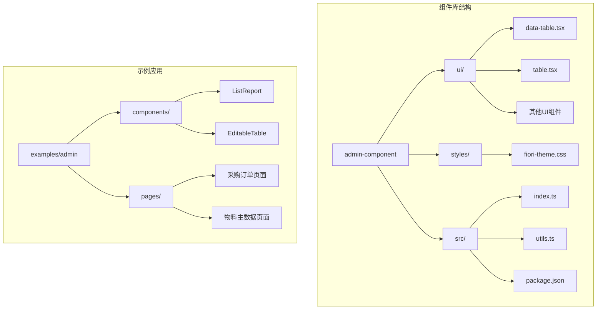
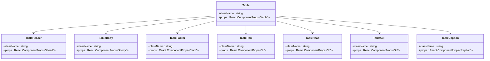
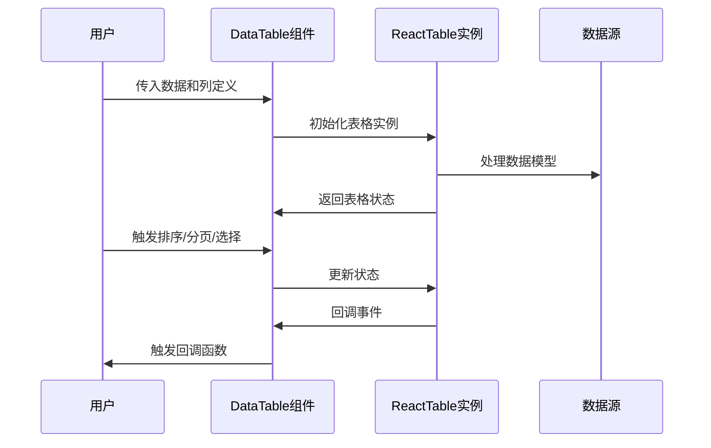
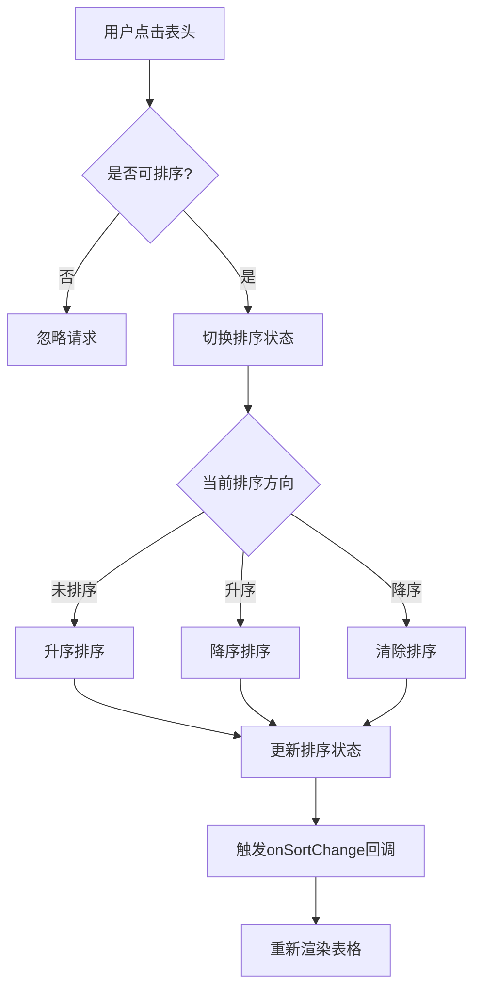
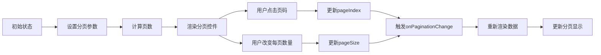
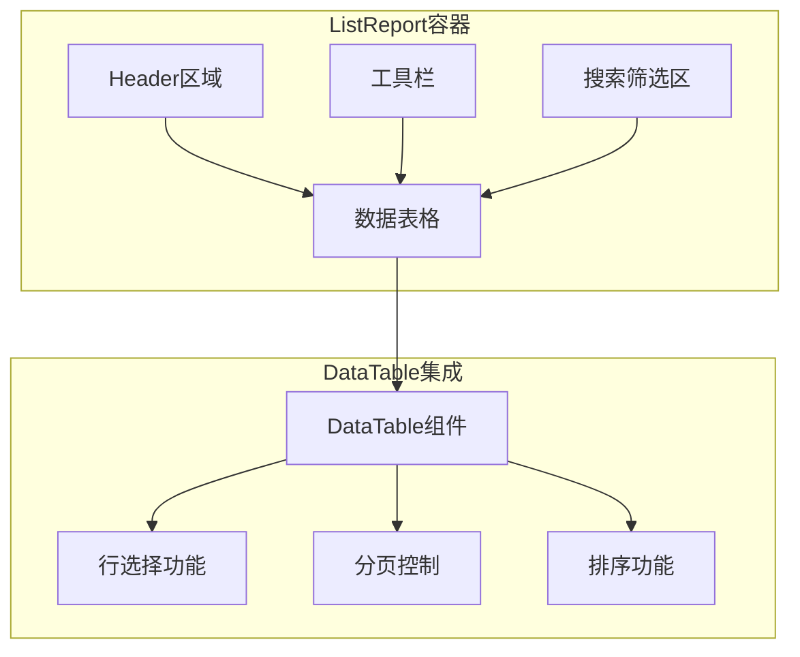
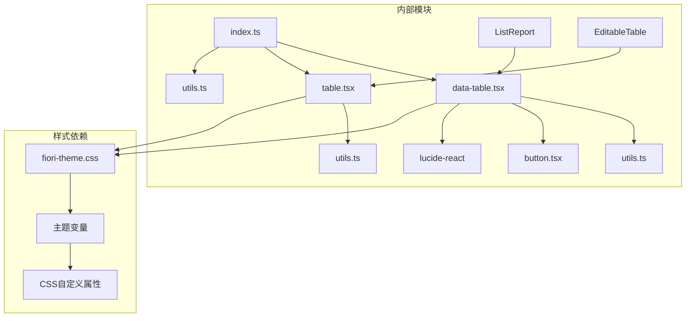
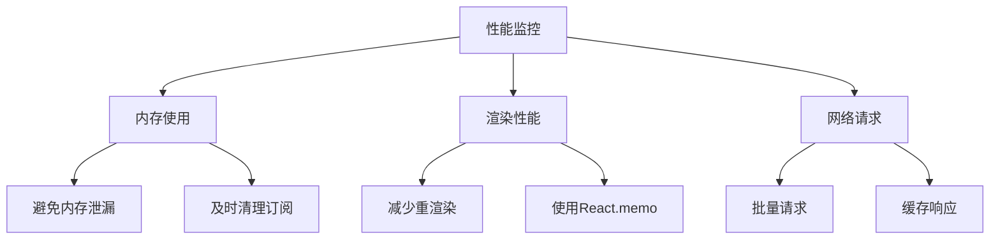

# 数据展示组件

<cite>
**本文档引用的文件**
- [data-table.tsx](file://app/framework/admin-component/src/ui/data-table.tsx)
- [table.tsx](file://app/framework/admin-component/src/ui/table.tsx)
- [index.ts](file://app/framework/admin-component/src/index.ts)
- [fiori-theme.css](file://app/framework/admin-component/src/styles/fiori-theme.css)
- [utils.ts](file://app/framework/admin-component/src/utils.ts)
- [package.json](file://app/framework/admin-component/package.json)
- [ListReport/index.tsx](file://app/examples/admin/src/components/ListReport/index.tsx)
- [ListPage.tsx (采购订单)](file://app/examples/admin/src/pages/purchase-orders/ListPage.tsx)
- [ListPage.tsx (物料主数据)](file://app/examples/admin/src/pages/master-data/materials/ListPage.tsx)
- [EditableTable/index.tsx](file://app/examples/admin/src/components/EditableTable/index.tsx)
</cite>

## 目录
1. [简介](#简介)
2. [项目结构](#项目结构)
3. [核心组件](#核心组件)
4. [架构概览](#架构概览)
5. [详细组件分析](#详细组件分析)
6. [依赖关系分析](#依赖关系分析)
7. [性能考虑](#性能考虑)
8. [故障排除指南](#故障排除指南)
9. [结论](#结论)
10. [附录](#附录)

## 简介

本项目提供了完整的数据展示组件解决方案，主要包含两个核心组件：`DataTable`（数据表格）和`Table`（基础表格）。这些组件基于现代前端技术栈构建，采用 SAP Fiori 设计语言，提供了丰富的数据展示功能和高度的可定制性。

组件库的核心特性包括：
- 基于 @tanstack/react-table 的高性能数据表格引擎
- 完整的 CRUD 操作支持
- 灵活的列配置和数据绑定
- 内置的排序、筛选、分页功能
- 支持虚拟滚动的大数据量处理
- 丰富的样式定制和主题适配
- 完善的可访问性支持

## 项目结构

数据展示组件位于 `app/framework/admin-component/src/ui/` 目录下，采用模块化设计：



**图表来源**
- [data-table.tsx](file://app/framework/admin-component/src/ui/data-table.tsx#L1-L375)
- [table.tsx](file://app/framework/admin-component/src/ui/table.tsx#L1-L117)
- [index.ts](file://app/framework/admin-component/src/index.ts#L1-L38)

**章节来源**
- [data-table.tsx](file://app/framework/admin-component/src/ui/data-table.tsx#L1-L375)
- [table.tsx](file://app/framework/admin-component/src/ui/table.tsx#L1-L117)
- [index.ts](file://app/framework/admin-component/src/index.ts#L1-L38)

## 核心组件

### DataTable 组件

`DataTable` 是本组件库的核心组件，基于 @tanstack/react-table 构建，提供了完整的数据表格功能。

#### 主要功能特性

1. **数据绑定**：支持静态数据、动态数据和异步数据加载
2. **排序功能**：支持单列和多列排序
3. **分页控制**：内置分页组件和自定义分页支持
4. **行选择**：支持单行和多行选择
5. **列配置**：灵活的列定义和渲染
6. **加载状态**：内置加载指示器
7. **响应式设计**：自动适应容器尺寸

#### 核心属性

| 属性名 | 类型 | 默认值 | 描述 |
|--------|------|--------|------|
| data | T[] | [] | 表格数据数组 |
| columns | DataTableColumn<T>[] | [] | 列定义数组 |
| loading | boolean | false | 加载状态 |
| enableRowSelection | boolean | false | 启用行选择 |
| pageSize | number | 25 | 每页显示数量 |
| pageIndex | number | 0 | 当前页码 |
| totalCount | number | undefined | 总记录数 |
| onSortChange | Function | undefined | 排序变更回调 |
| onPaginationChange | Function | undefined | 分页变更回调 |
| onSelectionChange | Function | undefined | 选择变更回调 |

**章节来源**
- [data-table.tsx](file://app/framework/admin-component/src/ui/data-table.tsx#L42-L69)

### Table 基础组件

`Table` 提供了基础的表格结构组件，作为更复杂组件的基础构建块。

#### 组件层次结构



**图表来源**
- [table.tsx](file://app/framework/admin-component/src/ui/table.tsx#L7-L116)

**章节来源**
- [table.tsx](file://app/framework/admin-component/src/ui/table.tsx#L1-L117)

## 架构概览

组件库采用了清晰的分层架构设计，确保了良好的可维护性和扩展性：

```mermaid
graph TB
subgraph "用户界面层"
A[DataTable]
B[Table]
C[ListReport]
D[EditableTable]
end
subgraph "业务逻辑层"
E[数据处理]
F[状态管理]
G[事件处理]
end
subgraph "样式层"
H[Fiori主题]
I[Tailwind CSS]
J[自定义样式]
end
subgraph "外部依赖"
K[@tanstack/react-table]
L[lucide-react]
M[react]
end
A --> E
A --> F
A --> G
B --> H
C --> A
D --> B
E --> K
F --> K
G --> K
H --> I
I --> J
```

**图表来源**
- [data-table.tsx](file://app/framework/admin-component/src/ui/data-table.tsx#L6-L26)
- [table.tsx](file://app/framework/admin-component/src/ui/table.tsx#L1-L20)
- [fiori-theme.css](file://app/framework/admin-component/src/styles/fiori-theme.css#L1-L140)

**章节来源**
- [data-table.tsx](file://app/framework/admin-component/src/ui/data-table.tsx#L1-L375)
- [table.tsx](file://app/framework/admin-component/src/ui/table.tsx#L1-L117)

## 详细组件分析

### DataTable 组件深度解析

#### 数据绑定机制

DataTable 通过 `useReactTable` Hook 实现了高效的数据绑定：



**图表来源**
- [data-table.tsx](file://app/framework/admin-component/src/ui/data-table.tsx#L149-L185)

#### 排序功能实现



**图表来源**
- [data-table.tsx](file://app/framework/admin-component/src/ui/data-table.tsx#L157-L163)

#### 分页系统设计

DataTable 实现了完整的分页控制机制：



**图表来源**
- [data-table.tsx](file://app/framework/admin-component/src/ui/data-table.tsx#L164-L170)

**章节来源**
- [data-table.tsx](file://app/framework/admin-component/src/ui/data-table.tsx#L73-L372)

### ListReport 组件集成

ListReport 是一个完整的业务场景组件，集成了 DataTable 和多种 UI 元素：

#### 组件架构



**图表来源**
- [ListReport/index.tsx](file://app/examples/admin/src/components/ListReport/index.tsx#L145-L392)

**章节来源**
- [ListReport/index.tsx](file://app/examples/admin/src/components/ListReport/index.tsx#L1-L398)

### EditableTable 组件

EditableTable 专为表单内嵌编辑场景设计：

#### 功能特性

1. **嵌入式设计**：支持无边框、无圆角的嵌入式布局
2. **可编辑单元格**：支持输入框、选择框、文本等多种编辑组件
3. **汇总行支持**：提供专门的汇总行组件
4. **删除操作**：内置删除按钮组件

**章节来源**
- [EditableTable/index.tsx](file://app/examples/admin/src/components/EditableTable/index.tsx#L1-L308)

## 依赖关系分析

### 外部依赖

组件库依赖于以下关键外部库：

```mermaid
graph LR
subgraph "核心依赖"
A[@tanstack/react-table] --> B[高性能表格引擎]
C[lucide-react] --> D[SVG图标库]
E[tailwind-merge] --> F[样式合并]
G[clsx] --> H[条件样式]
end
subgraph "开发依赖"
I[tsup] --> J[TypeScript打包]
K[react] --> L[React框架]
M[react-dom] --> N[DOM渲染]
end
subgraph "组件库"
O[DataTable]
P[Table]
Q[ListReport]
R[EditableTable]
end
A --> O
C --> O
E --> O
G --> O
L --> O
M --> O
```

**图表来源**
- [package.json](file://app/framework/admin-component/package.json#L19-L42)

**章节来源**
- [package.json](file://app/framework/admin-component/package.json#L1-L43)

### 内部依赖关系



**图表来源**
- [index.ts](file://app/framework/admin-component/src/index.ts#L6-L38)

**章节来源**
- [index.ts](file://app/framework/admin-component/src/index.ts#L1-L38)

## 性能考虑

### 大数据量优化策略

1. **虚拟滚动**：虽然当前版本未实现虚拟滚动，但 @tanstack/react-table 本身支持虚拟滚动
2. **分页加载**：推荐使用服务端分页处理大数据量
3. **懒加载**：只在需要时加载额外数据
4. **缓存策略**：合理使用 React.memo 和 useMemo

### 性能监控建议



### 最佳实践

1. **数据预处理**：在组件外部进行数据转换和格式化
2. **事件防抖**：对频繁触发的事件使用防抖
3. **条件渲染**：只渲染可见区域的数据
4. **资源管理**：及时清理定时器和事件监听器

## 故障排除指南

### 常见问题及解决方案

#### 数据不显示问题

**症状**：表格显示空白或只有表头

**可能原因**：
1. 数据格式不正确
2. 列定义缺失
3. 数据源为空

**解决方法**：
1. 检查数据格式是否符合预期
2. 确认列定义的 accessorKey 正确
3. 验证数据源不是 null 或 undefined

#### 排序功能失效

**症状**：点击表头无法排序

**可能原因**：
1. enableSorting 设置为 false
2. accessorKey 未正确配置
3. 数据类型不支持排序

**解决方法**：
1. 确保列定义中 enableSorting 为 true
2. 检查 accessorKey 指向正确的数据字段
3. 确认数据类型支持排序操作

#### 分页问题

**症状**：分页控件显示异常或无法跳转

**可能原因**：
1. totalCount 未设置
2. onPaginationChange 未正确处理
3. pageSizeOptions 配置错误

**解决方法**：
1. 设置正确的 totalCount 值
2. 在 onPaginationChange 中正确处理分页逻辑
3. 验证 pageSizeOptions 数组的有效性

**章节来源**
- [data-table.tsx](file://app/framework/admin-component/src/ui/data-table.tsx#L244-L256)

## 结论

本数据展示组件库提供了完整的企业级数据表格解决方案，具有以下优势：

1. **功能完整性**：涵盖了数据表格的所有核心功能
2. **性能优化**：基于成熟的 react-table 库，具备优秀的性能表现
3. **样式定制**：支持灵活的主题定制和样式适配
4. **可访问性**：遵循 WCAG 标准，支持键盘导航
5. **易于使用**：简洁的 API 设计，快速上手

通过合理的架构设计和丰富的示例，开发者可以轻松地在项目中集成和使用这些组件，满足各种复杂的数据展示需求。

## 附录

### 快速开始示例

#### 基础数据表格

```typescript
// 简单的数据表格使用示例
const columns = [
  {
    id: 'name',
    header: '姓名',
    accessorKey: 'name'
  },
  {
    id: 'age',
    header: '年龄',
    accessorKey: 'age'
  }
];

const data = [
  { id: 1, name: '张三', age: 25 },
  { id: 2, name: '李四', age: 30 }
];

// 在组件中使用
<DataTable
  data={data}
  columns={columns}
  enableRowSelection={true}
/>
```

#### 高级配置示例

```typescript
// 配置复杂的表格功能
<DataTable
  data={data}
  columns={columns}
  loading={loading}
  enableRowSelection={true}
  pageSize={50}
  totalCount={total}
  onSortChange={(field, direction) => console.log({ field, direction })}
  onPaginationChange={(page, size) => loadPage(page, size)}
  onSelectionChange={(rows) => setSelectedRows(rows)}
  getRowId={(row) => row.id}
/>
```

### 主题定制指南

组件库支持完整的 Fiori 主题定制，可以通过修改 CSS 变量来自定义外观：

```css
:root {
  --fiori-primary: 0 112 242;        /* 主色调 */
  --fiori-background: 245 246 247;    /* 背景色 */
  --fiori-text-primary: 29 45 62;    /* 主要文字色 */
  --fiori-border: 117 140 164;       /* 边框色 */
}
```