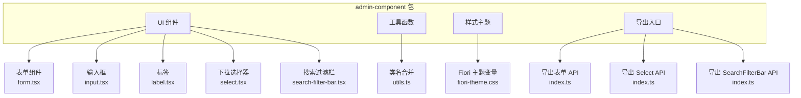
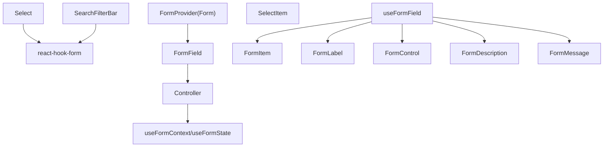
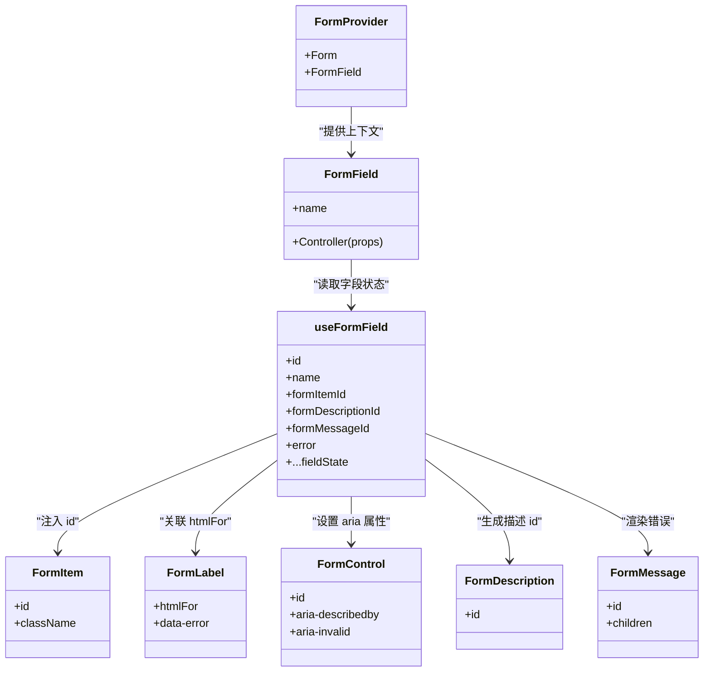
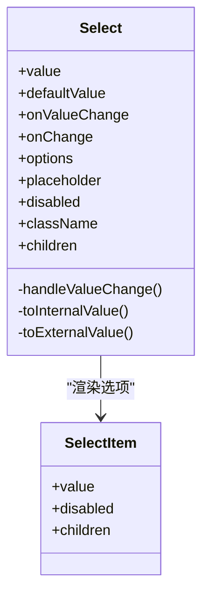
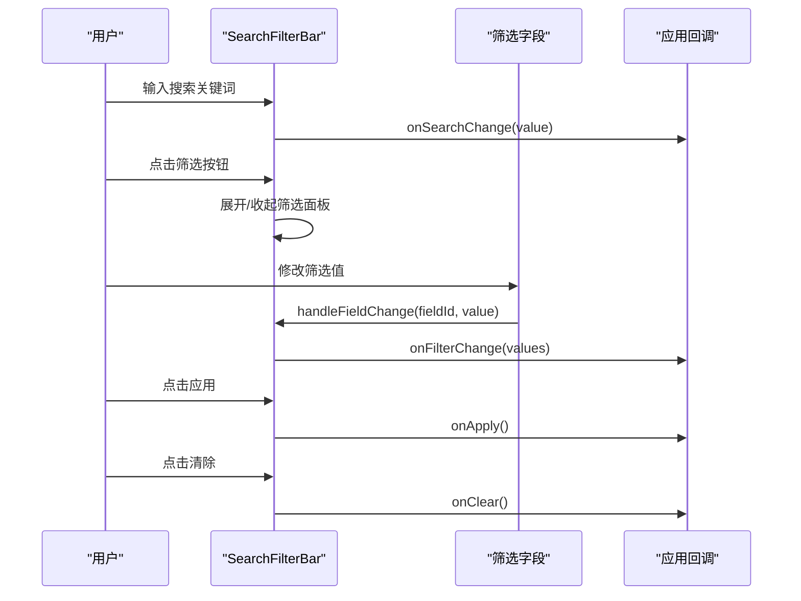
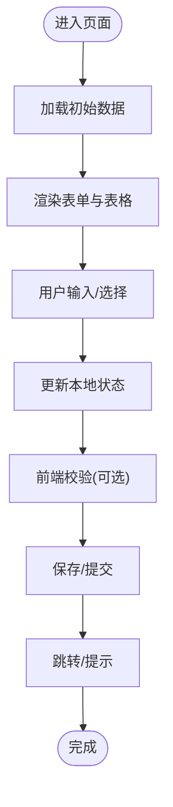
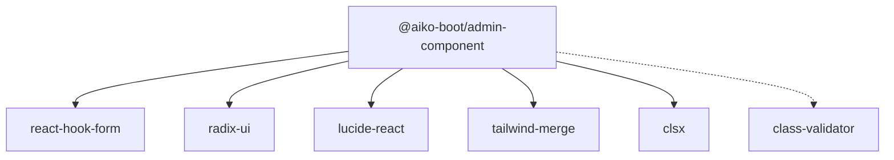
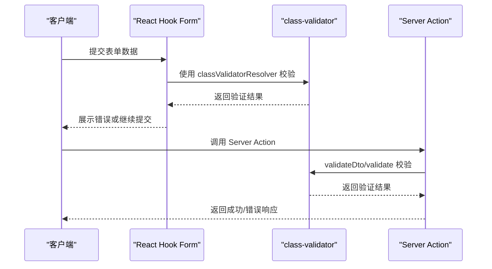

# 表单组件

<cite>
**本文档引用的文件**
- [form.tsx](file://app/framework/admin-component/src/ui/form.tsx)
- [select.tsx](file://app/framework/admin-component/src/ui/select.tsx)
- [search-filter-bar.tsx](file://app/framework/admin-component/src/ui/search-filter-bar.tsx)
- [input.tsx](file://app/framework/admin-component/src/ui/input.tsx)
- [label.tsx](file://app/framework/admin-component/src/ui/label.tsx)
- [index.ts](file://app/framework/admin-component/src/index.ts)
- [package.json](file://app/framework/admin-component/package.json)
- [utils.ts](file://app/framework/admin-component/src/utils.ts)
- [fiori-theme.css](file://app/framework/admin-component/src/styles/fiori-theme.css)
- [CreatePage.tsx](file://app/examples/admin/src/pages/purchase-requisitions/CreatePage.tsx)
- [EditPage.tsx](file://app/examples/admin/src/pages/purchase-requisitions/EditPage.tsx)
- [user-dto.ts](file://packages/aiko-boot-starter-validation/examples/user-dto.ts)
- [index.ts (validation)](file://packages/aiko-boot-starter-validation/src/index.ts)
- [server-action.ts](file://packages/aiko-boot-starter-validation/examples/server-action.ts)
</cite>

## 目录
1. [简介](#简介)
2. [项目结构](#项目结构)
3. [核心组件](#核心组件)
4. [架构概览](#架构概览)
5. [详细组件分析](#详细组件分析)
6. [依赖分析](#依赖分析)
7. [性能考虑](#性能考虑)
8. [故障排除指南](#故障排除指南)
9. [结论](#结论)
10. [附录](#附录)

## 简介
本文件为表单组件的全面使用文档，涵盖以下核心组件：
- 表单(Form)：基于 react-hook-form 的表单容器与字段封装，提供数据绑定、验证与错误展示能力
- 下拉选择器(Select)：基于 Radix UI 的可访问性友好的选择器，支持空值转换与样式定制
- 搜索过滤栏(SearchFilterBar)：用于列表页的搜索与筛选功能，支持多种筛选类型与状态管理

文档将深入讲解组件设计理念、实现方式、数据绑定与验证机制、错误处理策略、受控与非受控模式、布局与样式定制、与 class-validator 的集成、复杂表单场景与状态管理模式、可访问性支持与用户体验优化，并提供最佳实践与常见问题解决方案。

## 项目结构
该表单组件库位于 admin-component 包中，采用按功能模块划分的目录结构，核心文件包括：
- 表单相关：form.tsx、input.tsx、label.tsx
- 交互组件：select.tsx、search-filter-bar.tsx
- 导出入口：index.ts
- 样式与工具：utils.ts、fiori-theme.css
- 示例页面：CreatePage.tsx、EditPage.tsx
- 验证集成：user-dto.ts、index.ts (validation)

**图表来源**
- [index.ts](file://app/framework/admin-component/src/index.ts#L13-L37)
- [form.tsx](file://app/framework/admin-component/src/ui/form.tsx#L1-L168)
- [select.tsx](file://app/framework/admin-component/src/ui/select.tsx#L1-L154)
- [search-filter-bar.tsx](file://app/framework/admin-component/src/ui/search-filter-bar.tsx#L1-L276)
- [utils.ts](file://app/framework/admin-component/src/utils.ts#L1-L7)
- [fiori-theme.css](file://app/framework/admin-component/src/styles/fiori-theme.css#L1-L140)

**章节来源**
- [index.ts](file://app/framework/admin-component/src/index.ts#L1-L38)
- [package.json](file://app/framework/admin-component/package.json#L1-L43)

## 核心组件
本节概述三大核心组件的功能定位与协作关系：
- 表单(Form)：提供 FormProvider、FormField、FormItem、FormLabel、FormControl、FormDescription、FormMessage 等上下文与钩子，统一管理字段状态、错误信息与可访问性属性
- 下拉选择器(Select)：基于 Radix UI 的 Select 组件，提供空值占位符转换、选项渲染、触发器与内容面板样式
- 搜索过滤栏(SearchFilterBar)：提供搜索输入、筛选展开/收起、筛选字段渲染与应用/清除逻辑，支持多类型筛选字段

关键特性：
- 数据绑定：Form 通过 react-hook-form 提供受控与非受控模式的统一体验
- 验证机制：结合 class-validator 与 react-hook-form 的 resolver，实现前后端一致的验证规则
- 错误处理：FormMessage 统一展示字段错误，FormControl 与 FormLabel 自动关联 aria 属性
- 可访问性：使用 Radix UI 与 aria-* 属性，确保键盘导航与屏幕阅读器友好
- 样式定制：基于 Tailwind 与主题变量，支持 Fiori 风格与暗色模式

**章节来源**
- [form.tsx](file://app/framework/admin-component/src/ui/form.tsx#L1-L168)
- [select.tsx](file://app/framework/admin-component/src/ui/select.tsx#L1-L154)
- [search-filter-bar.tsx](file://app/framework/admin-component/src/ui/search-filter-bar.tsx#L1-L276)

## 架构概览
表单系统围绕 react-hook-form 构建，FormProvider 提供全局表单上下文，FormField 将每个字段包装为受控组件；Select 与 SearchFilterBar 作为表单内的输入组件，通过 onChange/value 与表单状态联动。

**图表来源**
- [form.tsx](file://app/framework/admin-component/src/ui/form.tsx#L19-L66)
- [select.tsx](file://app/framework/admin-component/src/ui/select.tsx#L41-L121)
- [search-filter-bar.tsx](file://app/framework/admin-component/src/ui/search-filter-bar.tsx#L52-L186)

## 详细组件分析

### 表单(Form)组件
- 设计理念：以 Context 与 Hook 的方式封装字段上下文，简化表单字段的状态读取与错误展示
- 数据绑定：通过 Controller 将任意输入组件接入 react-hook-form，支持受控与非受控模式
- 验证机制：结合 class-validator 的 resolver，实现前后端一致的验证规则
- 错误处理：useFormField 返回字段状态与错误信息，FormMessage 统一渲染
- 可访问性：FormControl 自动设置 aria-describedby/aria-invalid，FormLabel 与 htmlFor 关联

**图表来源**
- [form.tsx](file://app/framework/admin-component/src/ui/form.tsx#L21-L156)

**章节来源**
- [form.tsx](file://app/framework/admin-component/src/ui/form.tsx#L1-L168)

### 下拉选择器(Select)组件
- 设计理念：基于 Radix UI 的 Select，提供空值占位符转换，保证与表单状态的兼容性
- 数据绑定：value/defaultValue/onValueChange 与外部 onChange 统一，内部转换空值
- 验证机制：与 Form 控件组合使用，错误状态由 FormMessage 展示
- 可访问性：Select 触发器与内容面板使用 Radix UI 动画与定位，支持键盘导航
- 样式定制：通过 className 与 cn 合并，支持主题变量与 Tailwind 类

**图表来源**
- [select.tsx](file://app/framework/admin-component/src/ui/select.tsx#L16-L151)

**章节来源**
- [select.tsx](file://app/framework/admin-component/src/ui/select.tsx#L1-L154)

### 搜索过滤栏(SearchFilterBar)组件
- 设计理念：提供统一的搜索与筛选 UI，支持多种筛选类型与展开/收起交互
- 数据绑定：searchValue/onSearchChange 与 filterValues/onFilterChange 双向同步
- 验证机制：可与表单验证结合，在应用筛选时进行前端校验
- 可访问性：按钮与输入框具备 aria 属性，支持键盘操作
- 样式定制：基于 Fiori 主题变量，支持暗色模式

**图表来源**
- [search-filter-bar.tsx](file://app/framework/admin-component/src/ui/search-filter-bar.tsx#L52-L186)

**章节来源**
- [search-filter-bar.tsx](file://app/framework/admin-component/src/ui/search-filter-bar.tsx#L1-L276)

### 复杂表单场景与状态管理模式
- 示例页面展示了复杂的采购申请表单，包含表头信息与行项目表格，使用受控组件与本地状态管理
- CreatePage 与 EditPage 展示了不同模式下的表单布局与交互，包括保存、提交、取消等操作
- 行项目表格通过 EditableTable 与 TableInput/TableSelect 等组件实现动态增删改

**图表来源**
- [CreatePage.tsx](file://app/examples/admin/src/pages/purchase-requisitions/CreatePage.tsx#L103-L214)
- [EditPage.tsx](file://app/examples/admin/src/pages/purchase-requisitions/EditPage.tsx#L142-L252)

**章节来源**
- [CreatePage.tsx](file://app/examples/admin/src/pages/purchase-requisitions/CreatePage.tsx#L1-L567)
- [EditPage.tsx](file://app/examples/admin/src/pages/purchase-requisitions/EditPage.tsx#L1-L643)

## 依赖分析
- react-hook-form：提供表单状态管理与字段控制
- radix-ui：提供可访问性友好的基础 UI 原语（如 Select、Label）
- lucide-react：提供图标资源
- class-validator：提供装饰器风格的验证规则，与 react-hook-form 集成
- tailwind-merge/clsx：提供类名合并与主题化

**图表来源**
- [package.json](file://app/framework/admin-component/package.json#L19-L29)

**章节来源**
- [package.json](file://app/framework/admin-component/package.json#L1-L43)

## 性能考虑
- 事件处理：Select 的 onValueChange 与 onChange 仅做值转换与回调转发，避免额外状态更新
- 渲染优化：SearchFilterBar 在展开/收起时才渲染筛选面板，减少不必要的 DOM
- 样式合并：使用 cn 合并类名，避免重复样式导致的重绘
- 表单渲染：Form 组件通过 Context 传递字段状态，减少深层传递的开销

[本节为通用指导，无需特定文件分析]

## 故障排除指南
- 字段未显示错误：确认 FormMessage 是否包裹在 FormField 内，且 useFormField 正确调用
- 空值显示异常：Select 使用占位符转换，确保 value 与 defaultValue 的空值处理一致
- 可访问性问题：检查 FormControl 是否设置了 aria-describedby/aria-invalid，FormLabel 是否正确关联 htmlFor
- 样式冲突：确认主题变量与 Tailwind 配置是否正确引入，避免覆盖关键样式

**章节来源**
- [form.tsx](file://app/framework/admin-component/src/ui/form.tsx#L90-L156)
- [select.tsx](file://app/framework/admin-component/src/ui/select.tsx#L34-L61)

## 结论
本表单组件库以 react-hook-form 为核心，结合 Radix UI 与 class-validator，提供了可访问性友好、样式可定制、验证一致的表单解决方案。通过 Form、Select、SearchFilterBar 等组件的协同，能够满足从简单表单到复杂业务场景的需求。建议在实际项目中遵循受控模式、统一验证规则与错误展示、合理使用主题变量与样式定制，以获得更好的用户体验与开发效率。

[本节为总结，无需特定文件分析]

## 附录

### 与 class-validator 的集成使用
- 前端集成：在 React 表单中使用 classValidatorResolver，将 DTO 的装饰器规则映射到前端验证
- 后端集成：在 Next.js Server Action 中使用 validateDto 或 validate 对数据进行验证
- DTO 定义：参考 CreateUserDto/UpdateUserDto 的装饰器使用方式，确保前后端规则一致

**图表来源**
- [index.ts (validation)](file://packages/aiko-boot-starter-validation/src/index.ts#L120-L142)
- [server-action.ts](file://packages/aiko-boot-starter-validation/examples/server-action.ts#L13-L43)
- [user-dto.ts](file://packages/aiko-boot-starter-validation/examples/user-dto.ts#L70-L106)

**章节来源**
- [index.ts (validation)](file://packages/aiko-boot-starter-validation/src/index.ts#L1-L160)
- [server-action.ts](file://packages/aiko-boot-starter-validation/examples/server-action.ts#L1-L68)
- [user-dto.ts](file://packages/aiko-boot-starter-validation/examples/user-dto.ts#L1-L130)

### 表单布局与样式定制示例
- 基础布局：使用 Grid 与响应式断点，配合 FormItem 提供统一间距
- 主题变量：通过 fiori-theme.css 提供品牌色、文本色、边框色与阴影变量
- 暗色模式：.dark 类切换夜间主题，确保对比度与可读性

**章节来源**
- [fiori-theme.css](file://app/framework/admin-component/src/styles/fiori-theme.css#L1-L140)
- [CreatePage.tsx](file://app/examples/admin/src/pages/purchase-requisitions/CreatePage.tsx#L315-L380)
- [EditPage.tsx](file://app/examples/admin/src/pages/purchase-requisitions/EditPage.tsx#L358-L396)

### 可访问性支持与用户体验优化
- 可访问性：FormControl/FormLabel/Select 等组件均设置 aria-* 属性，支持键盘导航与屏幕阅读器
- 用户体验：SearchFilterBar 支持筛选计数、展开/收起动画、加载状态禁用按钮，提升交互反馈

**章节来源**
- [form.tsx](file://app/framework/admin-component/src/ui/form.tsx#L90-L156)
- [select.tsx](file://app/framework/admin-component/src/ui/select.tsx#L62-L121)
- [search-filter-bar.tsx](file://app/framework/admin-component/src/ui/search-filter-bar.tsx#L120-L186)

### 最佳实践与常见问题
- 最佳实践
  - 优先使用受控模式，确保表单状态集中管理
  - 将验证规则集中在 DTO 中，前后端复用
  - 使用 FormMessage 统一错误展示，避免分散处理
  - 为每个输入提供清晰的标签与描述
- 常见问题
  - 空值处理：Select 使用占位符转换，避免空字符串导致的 UI 异常
  - 样式冲突：避免直接覆盖主题变量，优先使用组件提供的 className 参数
  - 性能问题：避免在渲染过程中进行昂贵计算，必要时使用 useMemo/useCallback

[本节为通用指导，无需特定文件分析]