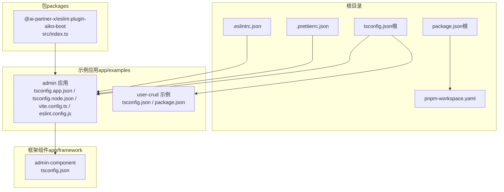
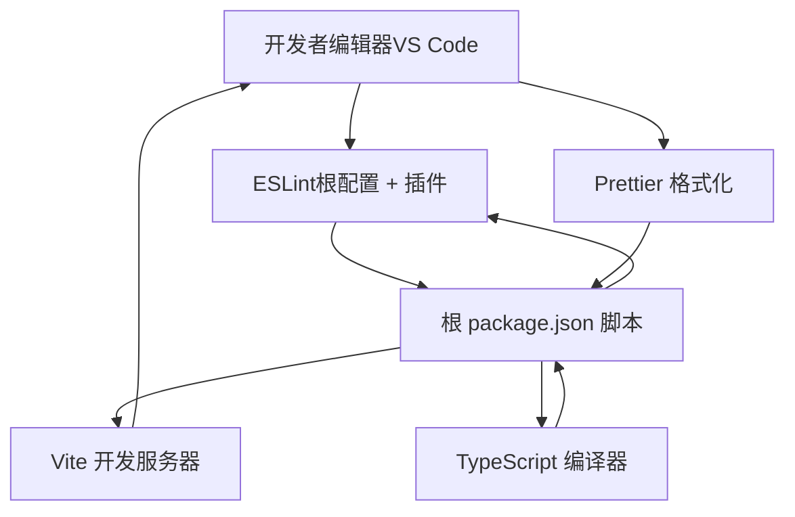
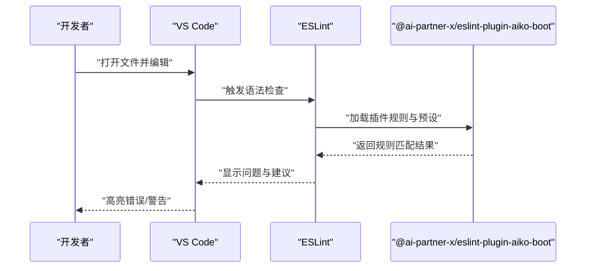
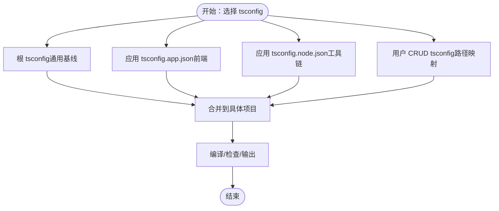
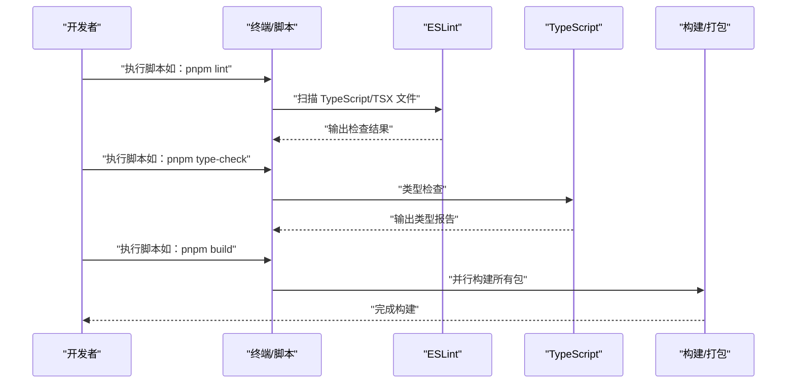
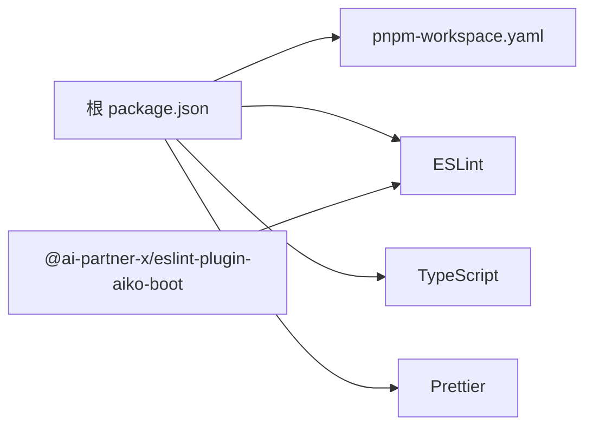

# 开发工具和规范

<cite>
**本文引用的文件**
- [.eslintrc.json](file://.eslintrc.json)
- [.prettierrc.json](file://.prettierrc.json)
- [tsconfig.json（根）](file://tsconfig.json)
- [package.json（根）](file://package.json)
- [pnpm-workspace.yaml](file://pnpm-workspace.yaml)
- [packages/eslint-plugin-aiko-boot/package.json](file://packages/eslint-plugin-aiko-boot/package.json)
- [packages/eslint-plugin-aiko-boot/src/index.ts](file://packages/eslint-plugin-aiko-boot/src/index.ts)
- [app/examples/admin/tsconfig.app.json](file://app/examples/admin/tsconfig.app.json)
- [app/examples/admin/tsconfig.node.json](file://app/examples/admin/tsconfig.node.json)
- [app/examples/admin/vite.config.ts](file://app/examples/admin/vite.config.ts)
- [app/examples/admin/package.json](file://app/examples/admin/package.json)
- [app/examples/admin/eslint.config.js](file://app/examples/admin/eslint.config.js)
- [app/framework/admin-component/tsconfig.json](file://app/framework/admin-component/tsconfig.json)
- [app/examples/user-crud/package.json](file://app/examples/user-crud/package.json)
- [app/examples/user-crud/tsconfig.json](file://app/examples/user-crud/tsconfig.json)
</cite>

## 目录
1. [简介](#简介)
2. [项目结构](#项目结构)
3. [核心组件](#核心组件)
4. [架构总览](#架构总览)
5. [详细组件分析](#详细组件分析)
6. [依赖分析](#依赖分析)
7. [性能考虑](#性能考虑)
8. [故障排查指南](#故障排查指南)
9. [结论](#结论)
10. [附录](#附录)

## 简介
本指南面向团队与个人开发者，系统性介绍本仓库的开发工具与规范配置，涵盖以下主题：
- ESLint 插件的使用方法：代码规范检查、自定义规则、推荐配置与 IDE 集成
- TypeScript 配置文件：编译选项、路径映射、类型声明与多项目 tsconfig 协作
- Prettier 代码格式化：配置项说明与与编辑器集成
- 开发环境完整配置：VS Code 推荐设置与插件配置
- 代码质量检查与自动化工具：脚本与工作流集成
- 团队协作的编码规范与最佳实践建议

## 项目结构
本仓库采用 monorepo 结构，使用 pnpm 工作区管理多个包与示例应用。根目录提供统一的 ESLint、TypeScript 与 Prettier 基线配置；各子包与示例应用可按需扩展或覆盖。

图表来源
- [pnpm-workspace.yaml](file://pnpm-workspace.yaml#L1-L6)
- [package.json（根）](file://package.json#L1-L32)
- [tsconfig.json（根）](file://tsconfig.json#L1-L33)
- [.eslintrc.json](file://.eslintrc.json#L1-L26)
- [.prettierrc.json](file://.prettierrc.json#L1-L10)
- [packages/eslint-plugin-aiko-boot/src/index.ts](file://packages/eslint-plugin-aiko-boot/src/index.ts#L1-L79)
- [app/examples/admin/tsconfig.app.json](file://app/examples/admin/tsconfig.app.json#L1-L29)
- [app/examples/admin/tsconfig.node.json](file://app/examples/admin/tsconfig.node.json#L1-L27)
- [app/examples/admin/vite.config.ts](file://app/examples/admin/vite.config.ts#L1-L16)
- [app/examples/admin/eslint.config.js](file://app/examples/admin/eslint.config.js#L1-L24)
- [app/examples/user-crud/tsconfig.json](file://app/examples/user-crud/tsconfig.json#L1-L37)
- [app/framework/admin-component/tsconfig.json](file://app/framework/admin-component/tsconfig.json#L1-L15)

章节来源
- [pnpm-workspace.yaml](file://pnpm-workspace.yaml#L1-L6)
- [package.json（根）](file://package.json#L1-L32)

## 核心组件
本节聚焦于开发工具链的核心配置与组件，帮助你快速上手并保持一致性。

- ESLint 基线配置
  - 解析器与语言特性：使用 TypeScript 解析器，启用 JSX 支持，目标环境为 ES2022
  - 扩展规则集：基于官方推荐与 TypeScript ESLint 推荐规则
  - 自定义规则：对未使用变量、显式 any、控制台输出进行分级处理
  - 环境变量：启用 node 与浏览器相关能力
  - 参考路径：[根 ESLint 配置](file://.eslintrc.json#L1-L26)

- ESLint 插件（@ai-partner-x/eslint-plugin-aiko-boot）
  - 规则集合：包含箭头方法、解构、对象展开、静态路由、REST 控制器、可选链、空值合并、显式返回类型、联合类型、内联对象类型等规则
  - 预设配置：recommended、strict、java-compat 三档，满足不同风格与目标平台需求
  - 使用方式：在项目中引入插件并在 extends 或 config 中启用对应预设
  - 参考路径：[插件入口与规则导出](file://packages/eslint-plugin-aiko-boot/src/index.ts#L1-L79)，[插件元信息与脚本](file://packages/eslint-plugin-aiko-boot/package.json#L1-L45)

- TypeScript 基线配置
  - 目标与模块：ES2022 目标、ESNext 模块、bundler 解析
  - 类型与检查：严格模式、未使用局部变量/参数、无显式返回、跳过库检查、装饰器支持
  - 输出与源码：生成声明与 sourcemap，指定 rootDir/outDir
  - 排除：默认排除 node_modules、dist 与测试文件
  - 参考路径：[根 tsconfig](file://tsconfig.json#L1-L33)

- Prettier 基线配置
  - 行尾分号、尾随逗号、单引号、行长、缩进宽度、Tab 策略、箭头函数括号
  - 参考路径：[Prettier 配置](file://.prettierrc.json#L1-L10)

- Vite 与 React 集成（示例应用）
  - 路径别名：@ 指向 src
  - CSS：集成 PostCSS
  - 参考路径：[Vite 配置](file://app/examples/admin/vite.config.ts#L1-L16)

章节来源
- [.eslintrc.json](file://.eslintrc.json#L1-L26)
- [packages/eslint-plugin-aiko-boot/src/index.ts](file://packages/eslint-plugin-aiko-boot/src/index.ts#L1-L79)
- [packages/eslint-plugin-aiko-boot/package.json](file://packages/eslint-plugin-aiko-boot/package.json#L1-L45)
- [tsconfig.json（根）](file://tsconfig.json#L1-L33)
- [.prettierrc.json](file://.prettierrc.json#L1-L10)
- [app/examples/admin/vite.config.ts](file://app/examples/admin/vite.config.ts#L1-L16)

## 架构总览
下图展示开发工具链在本仓库中的组织与交互关系，强调从编辑器到构建管线的端到端流程。

图表来源
- [.eslintrc.json](file://.eslintrc.json#L1-L26)
- [packages/eslint-plugin-aiko-boot/src/index.ts](file://packages/eslint-plugin-aiko-boot/src/index.ts#L1-L79)
- [tsconfig.json（根）](file://tsconfig.json#L1-L33)
- [.prettierrc.json](file://.prettierrc.json#L1-L10)
- [package.json（根）](file://package.json#L1-L32)
- [app/examples/admin/vite.config.ts](file://app/examples/admin/vite.config.ts#L1-L16)

## 详细组件分析

### ESLint 组件分析
- 规则与策略
  - 未使用变量：忽略以特定前缀开头的参数
  - 显式 any：警告级别，鼓励更严格的类型约束
  - 控制台输出：允许 warn/error，禁止 info
  - 参考路径：[根 ESLint 规则](file://.eslintrc.json#L16-L19)

- 插件规则与预设
  - 规则清单：涵盖方法体写法、解构与展开、路由常量、控制器注解、可选链与空值合并、返回类型、联合与内联对象类型
  - 预设等级：recommended（基础）、strict（更严格）、java-compat（Java 兼容）
  - 参考路径：[插件规则与配置](file://packages/eslint-plugin-aiko-boot/src/index.ts#L16-L66)

- IDE 集成（VS Code）
  - 安装 ESLint 扩展，确保编辑器加载项目级配置
  - 在工作区设置中启用“保存时自动修复”可提升效率
  - 参考路径：[示例应用 ESLint 配置（Flat Config）](file://app/examples/admin/eslint.config.js#L1-L24)

图表来源
- [packages/eslint-plugin-aiko-boot/src/index.ts](file://packages/eslint-plugin-aiko-boot/src/index.ts#L29-L66)
- [app/examples/admin/eslint.config.js](file://app/examples/admin/eslint.config.js#L8-L23)

章节来源
- [.eslintrc.json](file://.eslintrc.json#L16-L19)
- [packages/eslint-plugin-aiko-boot/src/index.ts](file://packages/eslint-plugin-aiko-boot/src/index.ts#L16-L66)
- [app/examples/admin/eslint.config.js](file://app/examples/admin/eslint.config.js#L1-L24)

### TypeScript 组件分析
- 根 tsconfig（通用基线）
  - 目标与模块解析：ESNext、bundler
  - 严格性与检查：严格模式、未使用变量/参数、无显式返回、跳过库检查
  - 输出：生成声明与 sourcemap，指定 rootDir/outDir
  - 排除：默认排除 node_modules、dist 与测试文件
  - 参考路径：[根 tsconfig](file://tsconfig.json#L2-L32)

- 应用级 tsconfig（示例）
  - tsconfig.app.json：Vite/React 场景，仅检查、不输出，启用 bundler 模式与严格选项
  - tsconfig.node.json：Node 工具链场景，含 Node 类型与严格选项
  - 参考路径：[应用 tsconfig.app.json](file://app/examples/admin/tsconfig.app.json#L1-L29)，[应用 tsconfig.node.json](file://app/examples/admin/tsconfig.node.json#L1-L27)

- 路径映射与类型声明
  - 用户 CRUD 示例：通过 paths 将 @/* 映射至 src/*
  - Next 插件：启用 Next 类型推断
  - 参考路径：[用户 CRUD tsconfig](file://app/examples/user-crud/tsconfig.json#L23-L25)

图表来源
- [tsconfig.json（根）](file://tsconfig.json#L1-L33)
- [app/examples/admin/tsconfig.app.json](file://app/examples/admin/tsconfig.app.json#L1-L29)
- [app/examples/admin/tsconfig.node.json](file://app/examples/admin/tsconfig.node.json#L1-L27)
- [app/examples/user-crud/tsconfig.json](file://app/examples/user-crud/tsconfig.json#L1-L37)

章节来源
- [tsconfig.json（根）](file://tsconfig.json#L1-L33)
- [app/examples/admin/tsconfig.app.json](file://app/examples/admin/tsconfig.app.json#L1-L29)
- [app/examples/admin/tsconfig.node.json](file://app/examples/admin/tsconfig.node.json#L1-L27)
- [app/examples/user-crud/tsconfig.json](file://app/examples/user-crud/tsconfig.json#L23-L25)

### Prettier 组件分析
- 配置项说明
  - 分号：保留
  - 尾随逗号：按环境策略
  - 单引号：启用
  - 行长：100
  - 缩进：2 空格，禁用 Tab
  - 箭头函数括号：始终添加
  - 参考路径：[Prettier 配置](file://.prettierrc.json#L1-L9)

- 与编辑器集成（VS Code）
  - 安装 Prettier 扩展，设置默认格式化程序为 Prettier
  - 在保存时自动格式化，避免手动干预
  - 参考路径：[Prettier 配置](file://.prettierrc.json#L1-L10)

章节来源
- [.prettierrc.json](file://.prettierrc.json#L1-L10)

### 开发环境配置（VS Code 推荐）
- 必装扩展
  - ESLint：实时检查与自动修复
  - Prettier：统一格式化
  - TypeScript Importer：自动导入
  - Tailwind CSS IntelliSense：CSS 类提示
  - EditorConfig：统一缩进与换行
- 工作区设置建议
  - 启用“保存时格式化”
  - 启用“保存时自动修复 ESLint 问题”
  - 设置默认格式化程序为 Prettier
  - 关闭“自动补全时插入函数调用”
- 参考路径
  - [根 ESLint 配置](file://.eslintrc.json#L1-L26)
  - [Prettier 配置](file://.prettierrc.json#L1-L10)

章节来源
- [.eslintrc.json](file://.eslintrc.json#L1-L26)
- [.prettierrc.json](file://.prettierrc.json#L1-L10)

### 自动化与脚本集成
- 根脚本（monorepo）
  - build：并行构建所有包
  - dev：并行启动所有包的开发服务
  - test：并行运行测试
  - lint：对 packages 下的 TypeScript/TSX 文件执行 ESLint
  - type-check：并行类型检查
  - clean：清理产物与依赖缓存
  - 参考路径：[根 package.json 脚本](file://package.json#L11-L17)

- 示例应用脚本
  - admin 应用：dev/build/lint/preview
  - user-crud：并行 dev 与按包 dev
  - 参考路径：[admin 应用脚本](file://app/examples/admin/package.json#L6-L10)，[user-crud 脚本](file://app/examples/user-crud/package.json#L5-L14)

图表来源
- [package.json（根）](file://package.json#L11-L17)
- [app/examples/admin/package.json](file://app/examples/admin/package.json#L6-L10)
- [app/examples/user-crud/package.json](file://app/examples/user-crud/package.json#L5-L14)

章节来源
- [package.json（根）](file://package.json#L11-L17)
- [app/examples/admin/package.json](file://app/examples/admin/package.json#L6-L10)
- [app/examples/user-crud/package.json](file://app/examples/user-crud/package.json#L5-L14)

## 依赖分析
- 工作区范围
  - packages、app/framework、app/examples、app/examples/*/packages
  - 参考路径：[pnpm-workspace.yaml](file://pnpm-workspace.yaml#L1-L6)

- 根依赖与版本要求
  - Node 与 pnpm 版本要求
  - 开发依赖：ESLint、TypeScript、Prettier、tsup、vitest 等
  - 参考路径：[根 package.json](file://package.json#L7-L29)

- 插件依赖
  - @ai-partner-x/eslint-plugin-aiko-boot 作为工作区包被引用
  - peerDependencies 与开发依赖版本约束
  - 参考路径：[插件 package.json](file://packages/eslint-plugin-aiko-boot/package.json#L28-L43)

图表来源
- [pnpm-workspace.yaml](file://pnpm-workspace.yaml#L1-L6)
- [package.json（根）](file://package.json#L1-L32)
- [packages/eslint-plugin-aiko-boot/package.json](file://packages/eslint-plugin-aiko-boot/package.json#L1-L45)

章节来源
- [pnpm-workspace.yaml](file://pnpm-workspace.yaml#L1-L6)
- [package.json（根）](file://package.json#L7-L29)
- [packages/eslint-plugin-aiko-boot/package.json](file://packages/eslint-plugin-aiko-boot/package.json#L28-L43)

## 性能考虑
- 编译与检查
  - 使用 bundler 模式与增量编译减少重编译开销
  - 在示例应用中启用严格选项但保持 noEmit，加速开发体验
  - 参考路径：[应用 tsconfig.app.json](file://app/examples/admin/tsconfig.app.json#L11-L25)

- 路径映射
  - 使用 @ 别名缩短导入路径，降低模块解析成本
  - 参考路径：[Vite 配置别名](file://app/examples/admin/vite.config.ts#L7-L11)

- 并行任务
  - 根脚本并行执行 dev/build/test，充分利用多核 CPU
  - 参考路径：[根 package.json 脚本](file://package.json#L12-L14)

章节来源
- [app/examples/admin/tsconfig.app.json](file://app/examples/admin/tsconfig.app.json#L11-L25)
- [app/examples/admin/vite.config.ts](file://app/examples/admin/vite.config.ts#L7-L11)
- [package.json（根）](file://package.json#L12-L14)

## 故障排查指南
- ESLint 报错“缺少解析器/插件”
  - 确认已安装 @typescript-eslint/parser、@typescript-eslint/eslint-plugin、eslint
  - 参考路径：[根 ESLint 配置](file://.eslintrc.json#L3-L11)

- TypeScript 类型错误
  - 检查 tsconfig 的严格选项与 moduleResolution 是否与项目一致
  - 参考路径：[根 tsconfig](file://tsconfig.json#L2-L6)

- Prettier 格式化冲突
  - 确保 VS Code 默认格式化程序为 Prettier，并关闭其他格式化扩展的冲突行为
  - 参考路径：[Prettier 配置](file://.prettierrc.json#L1-L9)

- Vite 别名无效
  - 确认 vite.config.ts 中 alias 正确指向 src，并在 ESLint/TS 中同步配置路径映射
  - 参考路径：[Vite 配置](file://app/examples/admin/vite.config.ts#L7-L11)

章节来源
- [.eslintrc.json](file://.eslintrc.json#L3-L11)
- [tsconfig.json（根）](file://tsconfig.json#L2-L6)
- [.prettierrc.json](file://.prettierrc.json#L1-L9)
- [app/examples/admin/vite.config.ts](file://app/examples/admin/vite.config.ts#L7-L11)

## 结论
本指南提供了从零到一的开发工具与规范配置方案，覆盖 ESLint 插件、TypeScript 多场景配置、Prettier 格式化、VS Code 集成与自动化脚本。遵循上述约定，团队可在保证一致性的同时显著提升开发效率与代码质量。

## 附录
- 团队协作建议
  - 统一使用根 ESLint 与 Prettier 配置，避免本地差异化
  - 在 PR 中强制执行 lint 与 type-check，确保提交质量
  - 对复杂业务逻辑编写单元测试，结合 vitest 运行
  - 使用 monorepo 脚本统一构建与发布流程

- 最佳实践清单
  - 优先使用显式类型，避免 any
  - 方法体内避免解构与对象展开，保持清晰
  - 路由常量与 REST 控制器命名规范化
  - 保存时自动格式化与修复，减少重复劳动