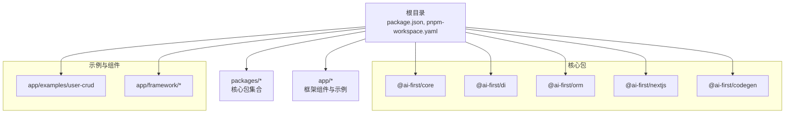
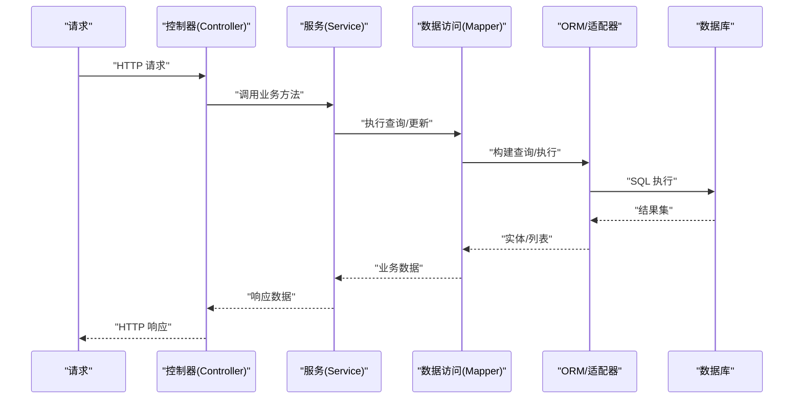
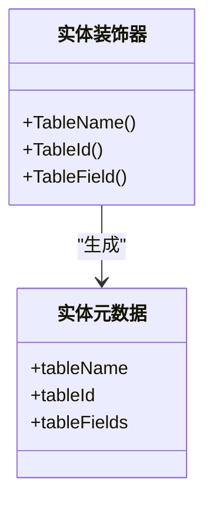
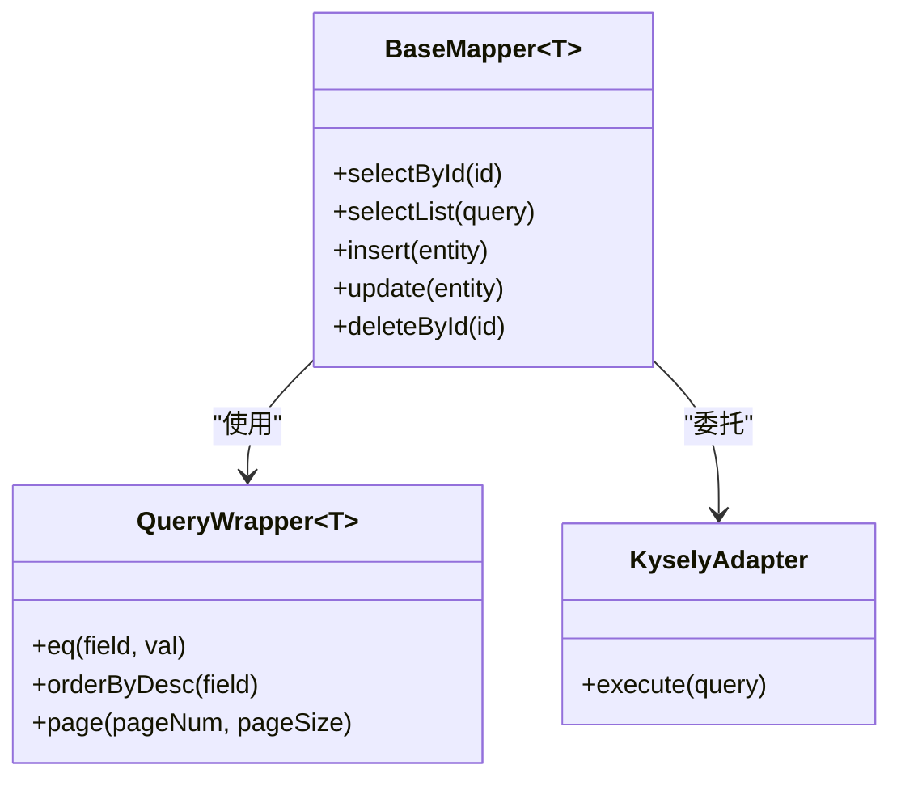
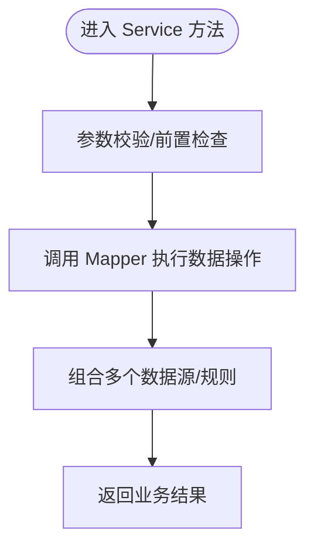
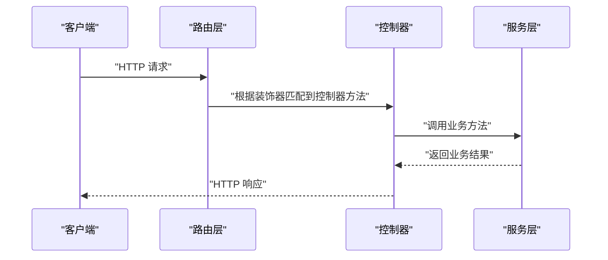
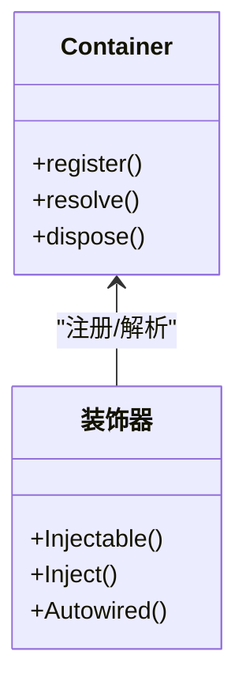
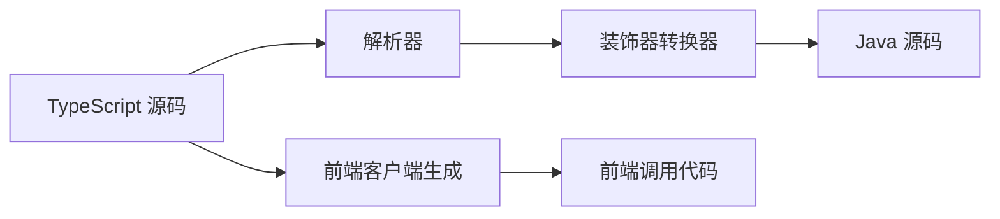
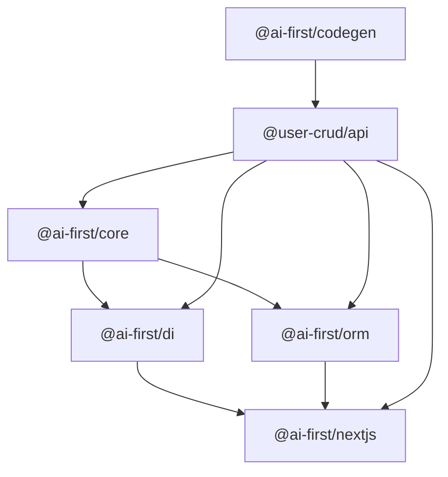

# 开发工作流程

<cite>
**本文引用的文件**
- [README.md](file://README.md)
- [package.json](file://package.json)
- [pnpm-workspace.yaml](file://pnpm-workspace.yaml)
- [@ai-first/core 包](file://packages/core/package.json)
- [@ai-first/di 包](file://packages/di/package.json)
- [@ai-first/orm 包](file://packages/orm/package.json)
- [@ai-first/codegen 包](file://packages/codegen/package.json)
- [@ai-first/nextjs 包](file://packages/nextjs/package.json)
- [@ai-first/core 导出入口](file://packages/core/src/index.ts)
- [@ai-first/di 导出入口](file://packages/di/src/index.ts)
- [@ai-first/orm 导出入口](file://packages/orm/src/index.ts)
- [@ai-first/codegen 导出入口](file://packages/codegen/src/index.ts)
- [用户 CRUD 示例 API 包](file://app/examples/user-crud/packages/api/package.json)
</cite>

## 目录
1. [简介](#简介)
2. [项目结构](#项目结构)
3. [核心组件](#核心组件)
4. [架构总览](#架构总览)
5. [详细组件分析](#详细组件分析)
6. [依赖分析](#依赖分析)
7. [性能考虑](#性能考虑)
8. [故障排查指南](#故障排查指南)
9. [结论](#结论)
10. [附录](#附录)

## 简介
本指南面向从需求分析到代码实现的完整开发流程，覆盖实体定义、数据访问层（Mapper）、业务逻辑（Service）、API 接口（Controller）与前端集成的全流程。结合框架提供的装饰器体系、依赖注入容器、ORM 与代码生成能力，帮助团队建立标准化的项目结构、文件命名规范与协作模式。文档同时解释各层之间的协作关系与数据流转过程，并提供常见开发场景的最佳实践。

## 项目结构
该仓库采用 monorepo 结构，通过工作区统一管理多个包与示例应用。顶层脚本提供构建、开发、测试、类型检查等命令；packages 目录下包含核心能力包：核心装饰器、依赖注入、ORM、校验、Next.js 适配、代码生成等；app 目录包含框架组件与示例项目（如 user-crud）。

图表来源
- [README.md](file://README.md#L14-L34)
- [package.json](file://package.json#L11-L18)
- [pnpm-workspace.yaml](file://pnpm-workspace.yaml#L1-L5)

章节来源
- [README.md](file://README.md#L14-L34)
- [package.json](file://package.json#L11-L18)
- [pnpm-workspace.yaml](file://pnpm-workspace.yaml#L1-L5)

## 核心组件
- 核心装饰器与元数据系统：提供领域层装饰器（如 Service、Transactional），并与 DI 容器协同工作。
- 依赖注入容器：基于 TSyringe 的 IoC 容器，支持构造函数/属性注入、生命周期控制与 React 集成。
- ORM（MyBatis-Plus 风格）：提供实体装饰器、Mapper 基类、条件构造器与多数据库适配。
- Next.js 适配层：提供 Spring Boot 风格的 HTTP 装饰器与路由集成。
- 代码生成：支持 TypeScript 到 Java 的一键转换与前端 API 客户端生成。
- 校验：数据验证装饰器与工具，保障请求参数与业务规则一致性。
- 类型定义与工具：统一的类型与工具集，确保跨包一致的类型安全。

章节来源
- [@ai-first/core 包](file://packages/core/package.json#L1-L39)
- [@ai-first/di 包](file://packages/di/package.json#L1-L53)
- [@ai-first/orm 包](file://packages/orm/package.json#L1-L54)
- [@ai-first/nextjs 包](file://packages/nextjs/package.json#L1-L59)
- [@ai-first/codegen 包](file://packages/codegen/package.json#L1-L28)

## 架构总览
下图展示了从“需求分析”到“运行时调用”的端到端流程：需求转化为实体与 DTO，通过装饰器与元数据驱动 ORM 与 DI；Service 层编排业务逻辑；Controller 暴露 API；Next.js 适配层将装饰器映射为路由；最终由 DI 容器完成依赖解析与实例化。

图表来源
- [@ai-first/nextjs 包](file://packages/nextjs/package.json#L31-L37)
- [@ai-first/orm 导出入口](file://packages/orm/src/index.ts#L37-L72)
- [@ai-first/di 导出入口](file://packages/di/src/index.ts#L9-L24)

## 详细组件分析

### 组件一：实体定义与数据模型
- 使用实体装饰器声明表结构与字段映射，支持主键、字段别名与列选项。
- 通过 ORM 提供的装饰器与元数据系统，实现类型安全的实体定义。
- 建议在实体层保持纯数据结构，避免业务逻辑，遵循 DDD 分层原则。

图表来源
- [@ai-first/orm 导出入口](file://packages/orm/src/index.ts#L15-L35)

章节来源
- [@ai-first/orm 导出入口](file://packages/orm/src/index.ts#L15-L35)

### 组件二：数据访问层（Mapper）
- 基于装饰器注册 Mapper，继承 BaseMapper 获取通用 CRUD 能力。
- 使用 QueryWrapper/LambdaQueryWrapper 构建复杂查询条件，支持链式调用与排序。
- 多数据库适配：通过 KyselyAdapter 与数据库工厂实现 PostgreSQL、SQLite、MySQL 的统一访问。

图表来源
- [@ai-first/orm 导出入口](file://packages/orm/src/index.ts#L37-L72)

章节来源
- [@ai-first/orm 导出入口](file://packages/orm/src/index.ts#L37-L72)

### 组件三：业务逻辑（Service）
- 使用 Service 装饰器声明服务组件，配合 Autowired 注入 Mapper 或其他 Service。
- 事务边界与一致性：通过事务注解与适配器确保跨操作的一致性。
- 业务编排：在 Service 中组合多个 Mapper 调用，实现复杂业务规则。

图表来源
- [@ai-first/di 导出入口](file://packages/di/src/index.ts#L12-L24)
- [@ai-first/core 导出入口](file://packages/core/src/index.ts#L14-L22)

章节来源
- [@ai-first/di 导出入口](file://packages/di/src/index.ts#L12-L24)
- [@ai-first/core 导出入口](file://packages/core/src/index.ts#L14-L22)

### 组件四：API 接口与路由（Controller）
- 使用 Next.js 适配层的 REST 控制器装饰器，声明路径与 HTTP 方法。
- 自动路由配置：装饰器元数据驱动路由注册，减少样板代码。
- 参数绑定：支持路径变量、请求体、查询参数等的自动解析。

图表来源
- [@ai-first/nextjs 包](file://packages/nextjs/package.json#L31-L37)
- [@ai-first/core 导出入口](file://packages/core/src/index.ts#L14-L22)

章节来源
- [@ai-first/nextjs 包](file://packages/nextjs/package.json#L31-L37)
- [@ai-first/core 导出入口](file://packages/core/src/index.ts#L14-L22)

### 组件五：依赖注入与自动装配
- 通过容器与装饰器实现自动注入，支持构造函数注入与属性注入。
- 生命周期管理：Singleton、Scoped 等生命周期策略，满足不同场景需求。
- React 集成：提供 DIProvider 与 hooks，便于在前端组件中使用注入的服务。

图表来源
- [@ai-first/di 导出入口](file://packages/di/src/index.ts#L9-L24)

章节来源
- [@ai-first/di 导出入口](file://packages/di/src/index.ts#L9-L24)

### 组件六：代码生成与兼容性
- TypeScript 到 Java 的一键转换：解析装饰器元数据，生成等价的 Java 类与注解。
- 前端 API 客户端生成：根据控制器与 DTO 自动生成前端调用代码，降低前后端耦合。
- 转换器与插件：提供源码转换器与构建插件，便于在构建流程中集成。

图表来源
- [@ai-first/codegen 导出入口](file://packages/codegen/src/index.ts#L1-L33)

章节来源
- [@ai-first/codegen 导出入口](file://packages/codegen/src/index.ts#L1-L33)

## 依赖分析
- 包间依赖：@ai-first/core 作为基础层被 @ai-first/di、@ai-first/orm、@ai-first/nextjs 等依赖；@ai-first/orm 再依赖 @ai-first/core 与 @ai-first/di。
- 运行时依赖：示例 API 包聚合了代码生成、核心装饰器、DI、ORM、Next.js 适配与校验等能力。
- 多数据库支持：ORM 通过适配器与数据库工厂抽象底层差异，统一上层接口。

图表来源
- [@ai-first/core 包](file://packages/core/package.json#L23-L26)
- [@ai-first/di 包](file://packages/di/package.json#L27-L30)
- [@ai-first/orm 包](file://packages/orm/package.json#L23-L29)
- [@ai-first/nextjs 包](file://packages/nextjs/package.json#L31-L37)
- [@ai-first/codegen 包](file://packages/codegen/package.json#L21-L23)
- [用户 CRUD 示例 API 包](file://app/examples/user-crud/packages/api/package.json#L20-L32)

章节来源
- [@ai-first/core 包](file://packages/core/package.json#L23-L26)
- [@ai-first/di 包](file://packages/di/package.json#L27-L30)
- [@ai-first/orm 包](file://packages/orm/package.json#L23-L29)
- [@ai-first/nextjs 包](file://packages/nextjs/package.json#L31-L37)
- [@ai-first/codegen 包](file://packages/codegen/package.json#L21-L23)
- [用户 CRUD 示例 API 包](file://app/examples/user-crud/packages/api/package.json#L20-L32)

## 性能考虑
- 查询优化：优先使用索引字段构建查询条件，避免 N+1 查询；合理分页与投影字段。
- 缓存策略：在 Service 层引入缓存（如内存/Redis），对热点读取进行缓存命中。
- 连接池与适配器：根据数据库类型选择合适的连接池与适配器，减少连接开销。
- 构建与打包：利用包的独立构建脚本与增量构建，缩短开发迭代周期。
- 日志与监控：在关键路径埋点日志与指标，便于定位性能瓶颈。

## 故障排查指南
- 装饰器未生效：确认已启用反射元数据与装饰器注册流程；检查包导出入口是否正确。
- 注入失败：核对生命周期与作用域设置；确保目标组件已注册到容器。
- 路由不生效：检查控制器装饰器路径与方法映射；确认路由注册顺序与中间件配置。
- 数据库连接异常：核对数据库配置与连接字符串；确认适配器与工厂初始化顺序。
- 代码生成异常：检查源码中装饰器的完整性与命名空间；确认转换器与插件版本兼容。

## 结论
本框架通过“装饰器 + 依赖注入 + ORM + 代码生成”的组合，实现了从需求到实现的高效率闭环。遵循本文档的开发流程与最佳实践，可在保证类型安全与可维护性的前提下，快速交付高质量的全栈应用，并具备向 Java 生态迁移的能力。

## 附录

### A. 从需求到实现的标准流程
- 需求分析 → 领域建模 → 实体定义 → Mapper 设计 → Service 编排 → Controller 暴露 → 路由注册 → 前后端联调 → 测试与发布
- 命名规范建议：实体类使用名词复数形式；Mapper 以实体名加 Mapper 结尾；Service 以业务领域命名；Controller 以资源路径命名；DTO 以请求/响应前缀区分。

### B. 常见开发场景与模板
- 用户登录：实体 + 登录 DTO + Service 校验 + Controller 接口 + JWT 令牌返回
- 分页查询：Controller 接收分页参数 → Service 组装 QueryWrapper → Mapper 分页查询 → 返回分页结果
- 批量导入：Service 逐条校验与入库，事务包裹；失败回滚并返回错误明细

### C. 示例参考
- 用户 CRUD 示例：包含实体、Mapper、Service、Controller 与数据库初始化脚本，可直接运行与扩展。

章节来源
- [README.md](file://README.md#L82-L159)
- [用户 CRUD 示例 API 包](file://app/examples/user-crud/packages/api/package.json#L12-L19)