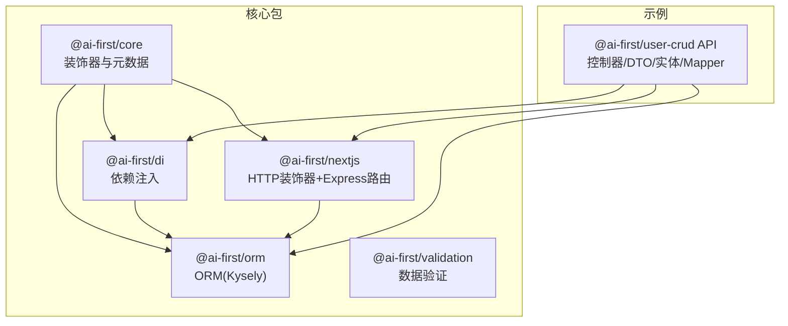
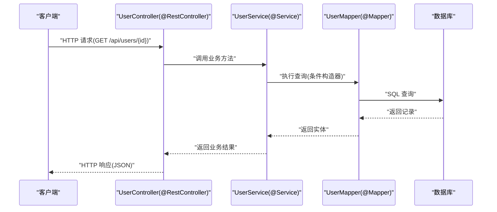
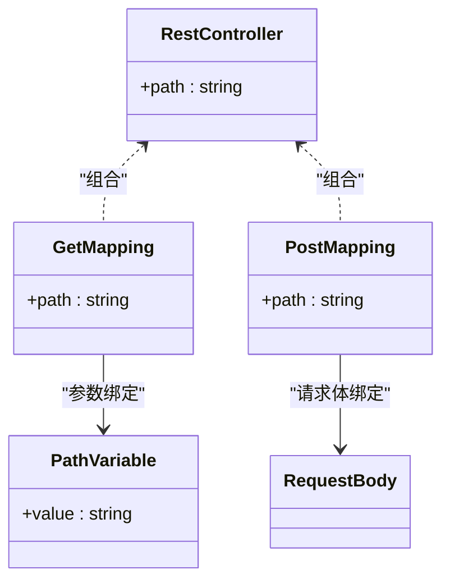
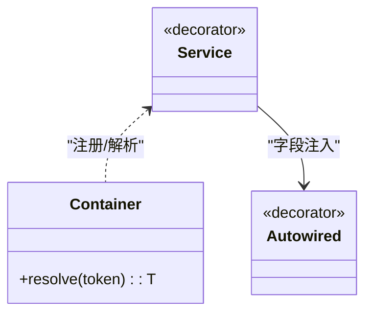
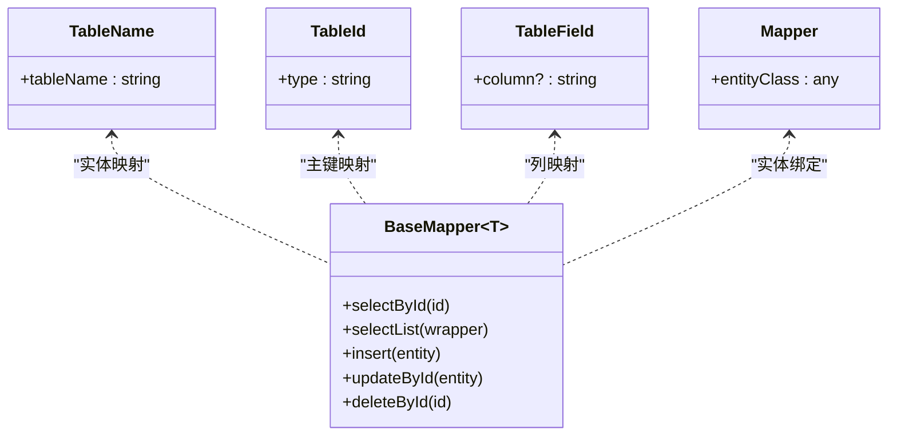
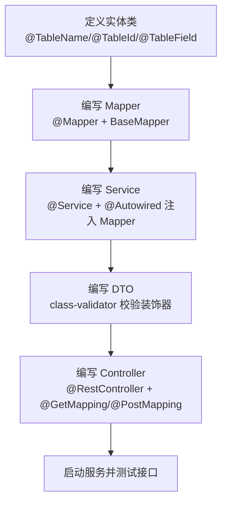
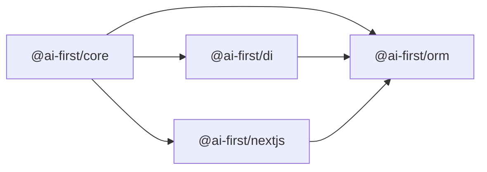

# 开发指南

<cite>
**本文引用的文件**
- [README.md](file://README.md)
- [package.json](file://package.json)
- [@ai-first/core 包配置](file://packages/core/package.json)
- [@ai-first/di 包配置](file://packages/di/package.json)
- [@ai-first/orm 包配置](file://packages/orm/package.json)
- [@ai-first/validation 包配置](file://packages/validation/package.json)
- [@ai-first/nextjs 包配置](file://packages/nextjs/package.json)
- [packages/core/src/decorators.ts](file://packages/core/src/decorators.ts)
- [packages/core/src/types.ts](file://packages/core/src/types.ts)
- [packages/core/src/index.ts](file://packages/core/src/index.ts)
- [packages/di/src/decorators.ts](file://packages/di/src/decorators.ts)
- [packages/di/src/container.ts](file://packages/di/src/container.ts)
- [packages/di/src/server.ts](file://packages/di/src/server.ts)
- [packages/orm/src/decorators.ts](file://packages/orm/src/decorators.ts)
- [packages/orm/src/base-mapper.ts](file://packages/orm/src/base-mapper.ts)
- [packages/orm/src/wrapper.ts](file://packages/orm/src/wrapper.ts)
- [packages/orm/src/adapters/kysely-adapter.ts](file://packages/orm/src/adapters/kysely-adapter.ts)
- [packages/nextjs/src/decorators.ts](file://packages/nextjs/src/decorators.ts)
- [packages/nextjs/src/express-router.ts](file://packages/nextjs/src/express-router.ts)
- [packages/nextjs/src/bootstrap.ts](file://packages/nextjs/src/bootstrap.ts)
- [app/examples/user-crud/packages/api/src/controller/user.controller.ts](file://app/examples/user-crud/packages/api/src/controller/user.controller.ts)
- [app/examples/user-crud/packages/api/src/dto/user.dto.ts](file://app/examples/user-crud/packages/api/src/dto/user.dto.ts)
</cite>

## 目录
1. [简介](#简介)
2. [项目结构](#项目结构)
3. [核心组件](#核心组件)
4. [架构总览](#架构总览)
5. [详细组件分析](#详细组件分析)
6. [依赖关系分析](#依赖关系分析)
7. [性能考虑](#性能考虑)
8. [故障排查指南](#故障排查指南)
9. [结论](#结论)
10. [附录](#附录)

## 简介
本指南面向使用 AI-First Framework 的开发者，目标是帮助你从零开始，高效完成“实体定义 → 数据访问层 → 业务层 → Web 层”的完整开发流程。文档覆盖三类装饰器的使用与最佳实践：Web 层装饰器（如 @RestController、@GetMapping 等）、业务层装饰器（如 @Service、@Autowired 等）与数据层装饰器（如 @TableName、@TableId、@TableField、@Mapper 等）。同时提供数据验证规则、错误处理策略、调试技巧以及性能优化建议。

## 项目结构
该仓库采用 monorepo 结构，核心包包括：
- @ai-first/core：核心装饰器与元数据系统
- @ai-first/di：依赖注入容器（TSyringe）
- @ai-first/orm：MyBatis-Plus 风格 ORM（Kysely 适配）
- @ai-first/validation：基于 class-validator 的数据验证
- @ai-first/nextjs：Spring Boot 风格 HTTP 装饰器与 Express 路由
- 示例工程：user-crud（API 控制器、DTO、实体与 Mapper）

图表来源
- [README.md](file://README.md#L14-L34)
- [packages/core/package.json](file://packages/core/package.json#L1-L39)
- [packages/di/package.json](file://packages/di/package.json#L1-L53)
- [packages/orm/package.json](file://packages/orm/package.json#L1-L54)
- [packages/nextjs/package.json](file://packages/nextjs/package.json#L1-L59)

章节来源
- [README.md](file://README.md#L14-L34)
- [package.json](file://package.json#L1-L31)

## 核心组件
本节概述三大层装饰器体系及其职责边界：
- Web 层装饰器：负责将类声明为控制器、映射 HTTP 方法与路径、提取请求参数与请求体。
- 业务层装饰器：负责服务类注册与依赖注入，实现事务与跨服务协作。
- 数据层装饰器：负责实体映射与数据访问抽象，提供通用 CRUD 与条件查询能力。

章节来源
- [README.md](file://README.md#L57-L81)
- [packages/nextjs/src/decorators.ts](file://packages/nextjs/src/decorators.ts)
- [packages/di/src/decorators.ts](file://packages/di/src/decorators.ts)
- [packages/orm/src/decorators.ts](file://packages/orm/src/decorators.ts)

## 架构总览
下图展示了从 Web 请求到数据库访问的端到端调用链路，体现三层装饰器如何协同工作：

图表来源
- [README.md](file://README.md#L139-L159)
- [app/examples/user-crud/packages/api/src/controller/user.controller.ts](file://app/examples/user-crud/packages/api/src/controller/user.controller.ts)
- [packages/nextjs/src/decorators.ts](file://packages/nextjs/src/decorators.ts)
- [packages/di/src/decorators.ts](file://packages/di/src/decorators.ts)
- [packages/orm/src/decorators.ts](file://packages/orm/src/decorators.ts)

## 详细组件分析

### Web 层装饰器（@RestController、@GetMapping 等）
- 作用：将类标记为控制器，将方法映射为 HTTP 接口，自动解析路径变量、请求体等。
- 关键点：
  - 控制器类上使用 @RestController 注解，指定基础路径。
  - 方法上使用 @GetMapping/@PostMapping 等映射具体 HTTP 方法与路径。
  - 参数通过 @PathVariable、@RequestBody 等装饰器注入。
- 最佳实践：
  - 将控制器仅作为“接口编排”，不直接操作数据库。
  - DTO 用于接口入参/出参的数据契约与校验。
  - 统一异常处理与响应包装，避免在控制器内处理业务细节。

图表来源
- [README.md](file://README.md#L139-L159)
- [packages/nextjs/src/decorators.ts](file://packages/nextjs/src/decorators.ts)

章节来源
- [README.md](file://README.md#L139-L159)
- [packages/nextjs/src/decorators.ts](file://packages/nextjs/src/decorators.ts)

### 业务层装饰器（@Service、@Autowired）
- 作用：将类注册为服务组件，支持构造函数与属性注入。
- 关键点：
  - 使用 @Service 标注服务类，交由 DI 容器管理生命周期。
  - 使用 @Autowired 注入 Mapper 或其他服务，实现松耦合。
- 最佳实践：
  - 业务逻辑集中在服务层，避免在控制器中直接访问数据层。
  - 对外暴露纯业务方法，内部复用 Mapper 与工具类。
  - 大事务拆分、幂等设计与异常隔离。

图表来源
- [packages/di/src/decorators.ts](file://packages/di/src/decorators.ts)
- [packages/di/src/container.ts](file://packages/di/src/container.ts)

章节来源
- [README.md](file://README.md#L112-L137)
- [packages/di/src/decorators.ts](file://packages/di/src/decorators.ts)
- [packages/di/src/container.ts](file://packages/di/src/container.ts)

### 数据层装饰器（@Entity、@Mapper、@TableName、@TableId、@TableField）
- 作用：将类映射为数据库表，字段映射为列，提供通用 Mapper 抽象。
- 关键点：
  - @TableName/@TableId/@TableField 用于实体元数据声明。
  - @Mapper 标注数据访问类，配合 BaseMapper 提供通用 CRUD。
  - QueryWrapper 用于构建复杂查询条件。
- 最佳实践：
  - 明确主键类型与自增策略，统一命名规范。
  - 优先使用 QueryWrapper 的链式方法，减少手写 SQL。
  - 分页查询时结合排序与索引设计。

图表来源
- [README.md](file://README.md#L84-L110)
- [packages/orm/src/decorators.ts](file://packages/orm/src/decorators.ts)
- [packages/orm/src/base-mapper.ts](file://packages/orm/src/base-mapper.ts)

章节来源
- [README.md](file://README.md#L84-L110)
- [packages/orm/src/decorators.ts](file://packages/orm/src/decorators.ts)
- [packages/orm/src/base-mapper.ts](file://packages/orm/src/base-mapper.ts)

### 数据验证（@ai-first/validation）
- 作用：基于 class-validator 的装饰器对 DTO 进行运行时校验。
- 关键点：
  - 在 DTO 字段上使用校验装饰器（如 IsString、IsEmail、MinLength 等）。
  - 在控制器中结合框架提供的校验机制进行参数校验。
- 最佳实践：
  - DTO 与实体分离，避免将数据库约束直接暴露到接口层。
  - 校验失败时返回明确的错误信息与状态码。
  - 与 Web 层装饰器配合，统一拦截与格式化校验异常。

章节来源
- [README.md](file://README.md#L21-L26)
- [packages/validation/package.json](file://packages/validation/package.json#L1-L40)

### 开发工作流程（从实体到 API 暴露）
以下流程图展示从实体定义到 API 暴露的完整步骤：

图表来源
- [README.md](file://README.md#L84-L159)
- [app/examples/user-crud/packages/api/src/controller/user.controller.ts](file://app/examples/user-crud/packages/api/src/controller/user.controller.ts)

章节来源
- [README.md](file://README.md#L84-L159)
- [app/examples/user-crud/packages/api/src/controller/user.controller.ts](file://app/examples/user-crud/packages/api/src/controller/user.controller.ts)

## 依赖关系分析
- @ai-first/core 为装饰器与元数据核心，被 @ai-first/di、@ai-first/orm、@ai-first/nextjs 所依赖。
- @ai-first/di 依赖 reflect-metadata，提供 TSyringe 容器能力。
- @ai-first/orm 依赖 @ai-first/core、@ai-first/di 与 Kysely，适配多数据库。
- @ai-first/nextjs 依赖 @ai-first/core、@ai-first/di、@ai-first/orm，提供 HTTP 装饰器与 Express 路由。
- 示例工程 user-crud 依赖上述包，形成端到端演示。

图表来源
- [packages/core/package.json](file://packages/core/package.json#L23-L26)
- [packages/di/package.json](file://packages/di/package.json#L27-L29)
- [packages/orm/package.json](file://packages/orm/package.json#L23-L28)
- [packages/nextjs/package.json](file://packages/nextjs/package.json#L31-L36)

章节来源
- [packages/core/package.json](file://packages/core/package.json#L1-L39)
- [packages/di/package.json](file://packages/di/package.json#L1-L53)
- [packages/orm/package.json](file://packages/orm/package.json#L1-L54)
- [packages/nextjs/package.json](file://packages/nextjs/package.json#L1-L59)

## 性能考虑
- 数据访问层
  - 使用 QueryWrapper 的条件拼接，避免 N+1 查询；合理使用分页与排序。
  - 为高频查询字段建立索引，结合 EXPLAIN 分析慢查询。
  - 复用连接池与事务边界，避免长事务占用资源。
- 业务层
  - 将耗时操作下沉至服务层，必要时引入异步任务队列。
  - 对热点数据使用缓存，注意缓存一致性策略。
- Web 层
  - 合理设置请求体大小限制与超时时间，避免资源滥用。
  - 使用 Gzip/压缩传输，减少网络开销。
- 依赖注入
  - 避免循环依赖，合理划分模块与服务粒度。
  - 使用单例服务缓存昂贵资源，减少重复初始化。

## 故障排查指南
- 装饰器未生效
  - 确认已安装 reflect-metadata 并在入口处导入。
  - 检查包导出是否正确，确保装饰器元数据在运行时可用。
- 注入失败
  - 确保服务类使用 @Service 注册，被注入字段使用 @Autowired。
  - 检查容器初始化顺序与模块加载顺序。
- 数据访问异常
  - 校验实体装饰器（@TableName/@TableId/@TableField）与表结构一致。
  - 使用 QueryWrapper 的 where/equal 等方法逐步缩小问题范围。
- HTTP 路由不生效
  - 确认控制器类使用 @RestController，方法使用对应 HTTP 映射装饰器。
  - 检查路由前缀与路径变量占位符是否匹配。
- 校验失败
  - 检查 DTO 字段上的校验装饰器是否正确配置。
  - 统一异常处理，将校验错误转换为标准响应格式。

章节来源
- [packages/core/package.json](file://packages/core/package.json#L24)
- [packages/di/src/decorators.ts](file://packages/di/src/decorators.ts)
- [packages/orm/src/decorators.ts](file://packages/orm/src/decorators.ts)
- [packages/nextjs/src/decorators.ts](file://packages/nextjs/src/decorators.ts)

## 结论
通过三层装饰器体系与清晰的依赖关系，AI-First Framework 将“代码即设计”的理念落地为可维护、可扩展的全栈开发体验。遵循本文的最佳实践与流程建议，你可以快速完成从实体到 API 的开发闭环，并在需要时一键转换为 Java Spring Boot 项目。

## 附录
- 快速开始
  - 安装依赖：pnpm install
  - 构建所有包：pnpm build
  - 运行示例：进入示例 API 包并启动开发服务器
- 示例参考
  - 控制器示例：[user.controller.ts](file://app/examples/user-crud/packages/api/src/controller/user.controller.ts)
  - DTO 示例：[user.dto.ts](file://app/examples/user-crud/packages/api/src/dto/user.dto.ts)

章节来源
- [README.md](file://README.md#L36-L56)
- [package.json](file://package.json#L11-L18)
- [app/examples/user-crud/packages/api/src/controller/user.controller.ts](file://app/examples/user-crud/packages/api/src/controller/user.controller.ts)
- [app/examples/user-crud/packages/api/src/dto/user.dto.ts](file://app/examples/user-crud/packages/api/src/dto/user.dto.ts)