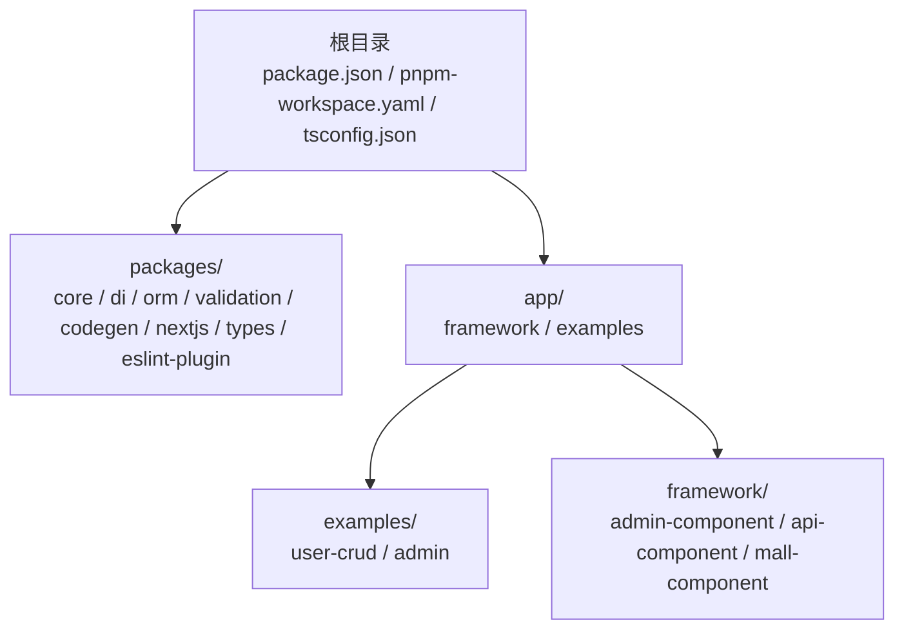
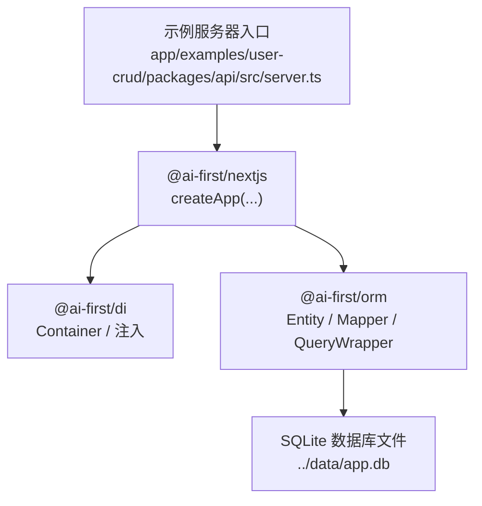
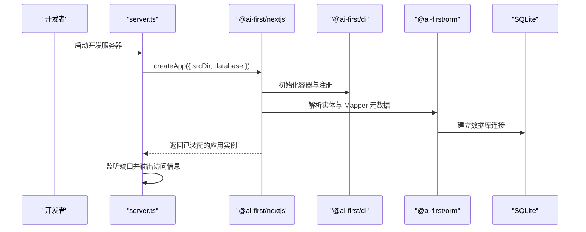
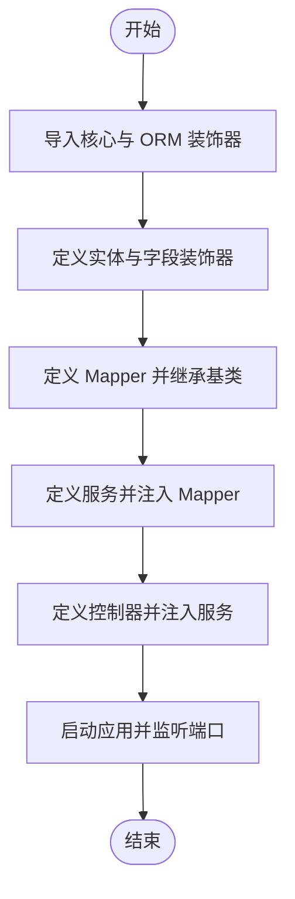
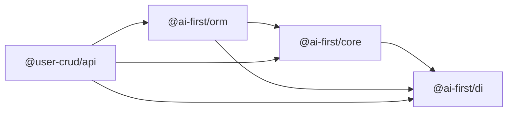

# 快速开始

<cite>
**本文引用的文件**
- [README.md](file://README.md)
- [package.json](file://package.json)
- [pnpm-workspace.yaml](file://pnpm-workspace.yaml)
- [tsconfig.json](file://tsconfig.json)
- [@ai-first/core 包 package.json](file://packages/core/package.json)
- [@ai-first/orm 包 package.json](file://packages/orm/package.json)
- [@ai-first/di 包 package.json](file://packages/di/package.json)
- [@user-crud/api 包 package.json](file://app/examples/user-crud/packages/api/package.json)
- [@ai-first/core 导出入口](file://packages/core/src/index.ts)
- [@ai-first/orm 导出入口](file://packages/orm/src/index.ts)
- [@ai-first/di 导出入口](file://packages/di/src/index.ts)
- [示例服务器入口](file://app/examples/user-crud/packages/api/src/server.ts)
</cite>

## 目录
1. [简介](#简介)
2. [项目结构](#项目结构)
3. [核心组件](#核心组件)
4. [架构总览](#架构总览)
5. [详细组件分析](#详细组件分析)
6. [依赖分析](#依赖分析)
7. [性能考虑](#性能考虑)
8. [故障排查指南](#故障排查指南)
9. [结论](#结论)
10. [附录](#附录)

## 简介
本指南面向希望快速上手 AI-First Framework 的开发者，目标是帮助你在最短时间内完成环境准备、依赖安装、构建与示例运行，并理解框架的核心概念与基本结构。该框架以 TypeScript/Next.js 为基础，提供“代码即设计”的开发体验，支持 MyBatis-Plus 风格的 ORM、依赖注入容器、以及一键转换为 Java Spring Boot + MyBatis-Plus 的能力。

## 项目结构
仓库采用 monorepo 结构，通过工作区统一管理多个包与示例项目。顶层脚本与配置定义了统一的构建、开发与测试流程；packages 目录下为核心功能包；app 下包含框架组件与示例项目。

图表来源
- [pnpm-workspace.yaml](file://pnpm-workspace.yaml#L1-L5)
- [README.md](file://README.md#L14-L34)

章节来源
- [README.md](file://README.md#L14-L34)
- [pnpm-workspace.yaml](file://pnpm-workspace.yaml#L1-L5)

## 核心组件
- @ai-first/core：核心装饰器与元数据系统，提供领域层注解（如组件、服务、事务等）。
- @ai-first/di：基于 TSyringe 的依赖注入容器，支持构造函数与属性注入、生命周期控制与 React 集成。
- @ai-first/orm：MyBatis-Plus 风格 ORM，提供实体装饰器、Mapper 基类、条件构造器与多数据库适配。
- @ai-first/nextjs：Next.js 适配层，提供应用创建与自动装配能力。
- @ai-first/validation：数据验证工具（在工作区中提供类型与规范）。
- @ai-first/codegen：TypeScript 到 Java Spring Boot + MyBatis-Plus 的代码生成器。
- 示例项目：user-crud 展示从实体到 API 的完整链路。

章节来源
- [README.md](file://README.md#L57-L81)
- [@ai-first/core 导出入口](file://packages/core/src/index.ts#L1-L22)
- [@ai-first/di 导出入口](file://packages/di/src/index.ts#L1-L34)
- [@ai-first/orm 导出入口](file://packages/orm/src/index.ts#L1-L72)

## 架构总览
下图展示了示例 API 服务的启动与依赖装配关系，体现从入口到数据库的调用路径。

图表来源
- [示例服务器入口](file://app/examples/user-crud/packages/api/src/server.ts#L1-L24)
- [@ai-first/orm 导出入口](file://packages/orm/src/index.ts#L1-L72)
- [@ai-first/di 导出入口](file://packages/di/src/index.ts#L1-L34)

## 详细组件分析

### 安装与初始化流程
- 环境要求
  - Node.js 版本需满足引擎约束（见根目录 package.json）。
  - 推荐使用 pnpm v9+，确保工作区解析一致。
- 步骤
  1) 安装依赖：在仓库根目录执行安装命令。
  2) 构建所有包：统一构建所有子包，确保产物可用。
  3) 运行示例：进入示例 API 包，启动开发服务器。
- 常见问题
  - Node 或 pnpm 版本过低：请升级至满足 engines 的版本。
  - 工作区未正确识别：确认 pnpm-workspace.yaml 中的包路径与实际目录一致。
  - 权限或端口占用：示例默认监听 3001，若被占用请调整环境变量或关闭冲突进程。

章节来源
- [README.md](file://README.md#L36-L56)
- [package.json](file://package.json#L7-L10)
- [package.json](file://package.json#L11-L18)
- [pnpm-workspace.yaml](file://pnpm-workspace.yaml#L1-L5)
- [示例服务器入口](file://app/examples/user-crud/packages/api/src/server.ts#L10-L18)

### 示例运行时序
以下序列图展示示例服务器启动的关键调用链，从入口到数据库连接的装配过程。

图表来源
- [示例服务器入口](file://app/examples/user-crud/packages/api/src/server.ts#L1-L24)
- [@ai-first/orm 导出入口](file://packages/orm/src/index.ts#L1-L72)
- [@ai-first/di 导出入口](file://packages/di/src/index.ts#L1-L34)

### 核心装饰器与数据流
- @ai-first/core 提供组件与服务级注解，配合 @ai-first/di 实现自动注入。
- @ai-first/orm 提供实体与 Mapper 的装饰器，结合 QueryWrapper 构造查询条件。
- 数据从控制器（由 @ai-first/nextjs 提供）进入服务层，再通过 ORM 访问数据库。

图表来源
- [@ai-first/core 导出入口](file://packages/core/src/index.ts#L14-L21)
- [@ai-first/orm 导出入口](file://packages/orm/src/index.ts#L16-L54)

章节来源
- [README.md](file://README.md#L82-L159)
- [@ai-first/core 导出入口](file://packages/core/src/index.ts#L1-L22)
- [@ai-first/orm 导出入口](file://packages/orm/src/index.ts#L1-L72)

## 依赖分析
- 工作区范围：packages/*、app/framework/*、app/examples/*。
- 核心包依赖关系：
  - @ai-first/core 依赖 @ai-first/di。
  - @ai-first/orm 依赖 @ai-first/core、@ai-first/di，并引入数据库驱动与 Kysely。
  - @user-crud/api 作为示例包，依赖上述核心包及运行时依赖（如 express、pg、better-sqlite3）。
- TypeScript 编译配置启用装饰器元数据与严格模式，确保类型安全与反射能力。

图表来源
- [@ai-first/core 包 package.json](file://packages/core/package.json#L23-L26)
- [@ai-first/orm 包 package.json](file://packages/orm/package.json#L23-L29)
- [@user-crud/api 包 package.json](file://app/examples/user-crud/packages/api/package.json#L20-L32)

章节来源
- [pnpm-workspace.yaml](file://pnpm-workspace.yaml#L1-L5)
- [@ai-first/core 包 package.json](file://packages/core/package.json#L1-L39)
- [@ai-first/orm 包 package.json](file://packages/orm/package.json#L1-L54)
- [@ai-first/di 包 package.json](file://packages/di/package.json#L1-L53)
- [@user-crud/api 包 package.json](file://app/examples/user-crud/packages/api/package.json#L1-L47)
- [tsconfig.json](file://tsconfig.json#L23-L29)

## 性能考虑
- 使用 pnpm 工作区统一管理依赖，减少磁盘占用与安装时间。
- 在开发阶段启用 watch 模式增量编译，缩短迭代周期。
- 数据库选择与连接池策略应根据场景评估（示例使用 SQLite，生产可选 PostgreSQL/MySQL）。
- 合理拆分服务与 Mapper，避免单点过载与长事务。

## 故障排查指南
- Node 或 pnpm 版本不满足要求
  - 症状：安装失败或构建报错。
  - 处理：升级 Node 至满足 engines 的版本，确保 pnpm 版本符合要求。
- 工作区包未被识别
  - 症状：构建或运行时找不到包。
  - 处理：检查 pnpm-workspace.yaml 中的包路径是否与实际目录一致。
- 端口占用
  - 症状：启动时报端口冲突。
  - 处理：修改示例中的端口环境变量或释放占用端口。
- 装饰器元数据缺失
  - 症状：反射读取不到元数据。
  - 处理：确认 tsconfig 启用了 emitDecoratorMetadata 与 experimentalDecorators。
- 数据库连接失败
  - 症状：启动后无法访问数据库。
  - 处理：检查示例中数据库配置（如 SQLite 文件路径），确保文件存在且可写。

章节来源
- [package.json](file://package.json#L7-L10)
- [pnpm-workspace.yaml](file://pnpm-workspace.yaml#L1-L5)
- [示例服务器入口](file://app/examples/user-crud/packages/api/src/server.ts#L10-L18)
- [tsconfig.json](file://tsconfig.json#L23-L29)

## 结论
通过本指南，你已经完成了环境准备、依赖安装、构建与示例运行，并对框架的核心包与示例项目有了整体认识。建议在掌握基础后，逐步阅读各包的导出入口与示例代码，深入理解装饰器、依赖注入与 ORM 的协作方式，并尝试将示例扩展为你的业务场景。

## 附录
- 快速命令参考
  - 安装依赖：在根目录执行安装命令。
  - 构建所有包：在根目录执行构建命令。
  - 运行示例：进入示例 API 包，启动开发服务器。
- 进一步阅读
  - 核心包导出入口与 API 概览。
  - 示例项目结构与启动逻辑。

章节来源
- [README.md](file://README.md#L36-L56)
- [@ai-first/core 导出入口](file://packages/core/src/index.ts#L1-L22)
- [@ai-first/di 导出入口](file://packages/di/src/index.ts#L1-L34)
- [@ai-first/orm 导出入口](file://packages/orm/src/index.ts#L1-L72)
- [示例服务器入口](file://app/examples/user-crud/packages/api/src/server.ts#L1-L24)