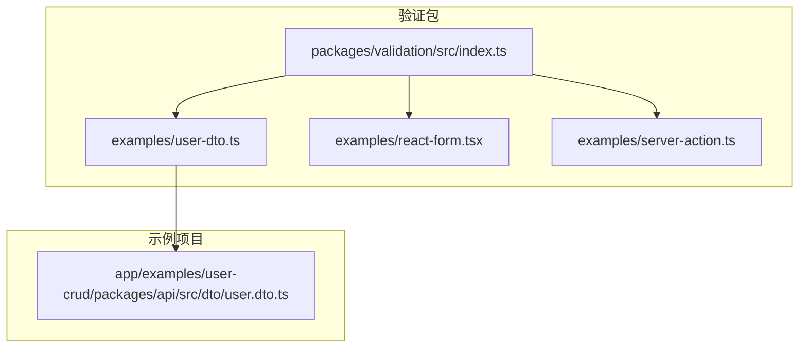
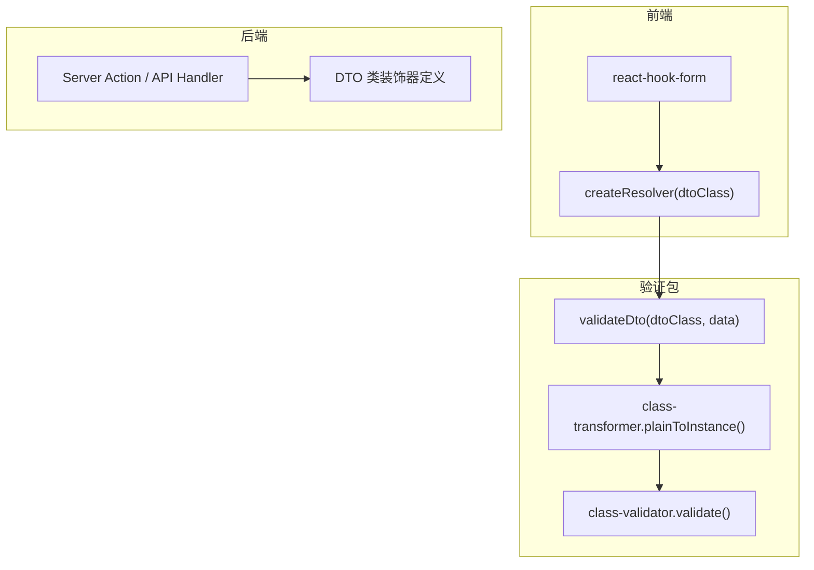
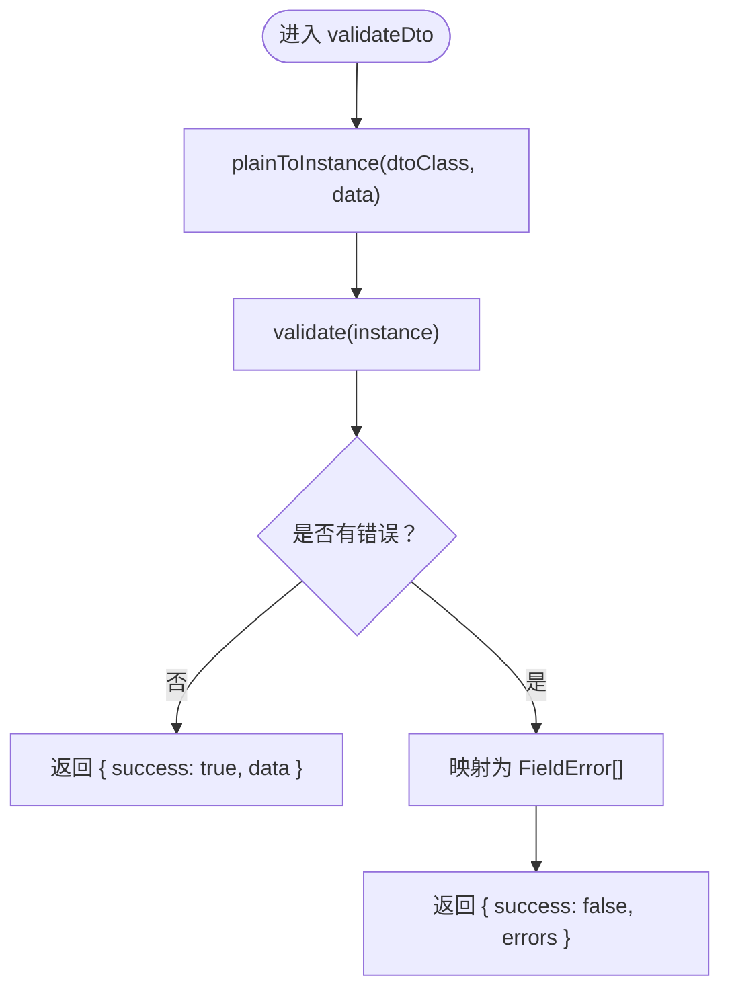
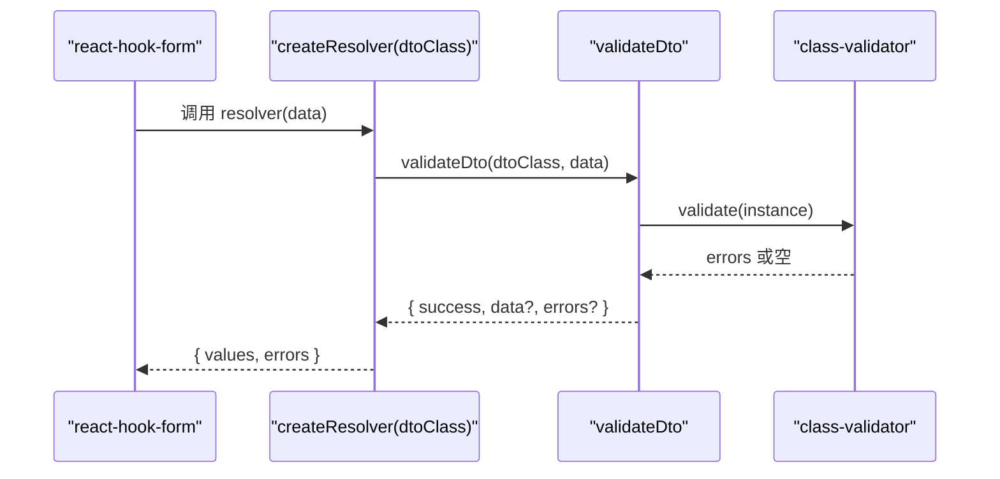
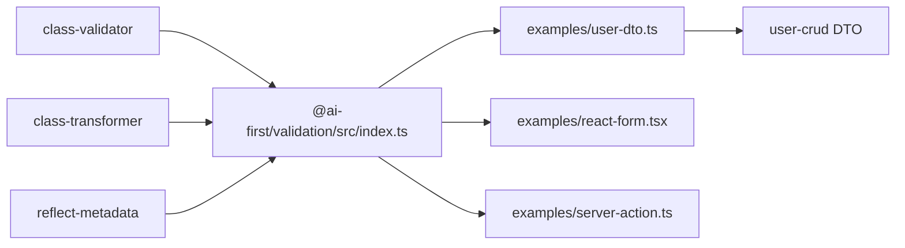

# 数据验证指南

<cite>
**本文引用的文件**
- [packages/validation/src/index.ts](file://packages/validation/src/index.ts)
- [packages/validation/examples/user-dto.ts](file://packages/validation/examples/user-dto.ts)
- [packages/validation/examples/react-form.tsx](file://packages/validation/examples/react-form.tsx)
- [packages/validation/examples/server-action.ts](file://packages/validation/examples/server-action.ts)
- [app/examples/user-crud/packages/api/src/dto/user.dto.ts](file://app/examples/user-crud/packages/api/src/dto/user.dto.ts)
- [packages/validation/package.json](file://packages/validation/package.json)
- [README.md](file://README.md)
</cite>

## 目录
1. [简介](#简介)
2. [项目结构](#项目结构)
3. [核心组件](#核心组件)
4. [架构总览](#架构总览)
5. [详细组件分析](#详细组件分析)
6. [依赖关系分析](#依赖关系分析)
7. [性能考虑](#性能考虑)
8. [故障排查指南](#故障排查指南)
9. [结论](#结论)
10. [附录](#附录)

## 简介
本指南面向使用 AI-First Framework 的开发者，系统讲解数据验证子系统的设计与使用方法。该子系统基于 class-validator 和 class-transformer，提供与 Spring Boot Validation 对齐的装饰器兼容能力，并支持一键转 Java（Jakarta Validation）。内容涵盖：
- 内置验证装饰器与参数配置
- 自定义验证器与验证时机控制
- 错误消息定制与统一返回结构
- 表单验证、API 参数验证、数据持久化验证的完整示例
- 验证管道工作原理与性能优化策略
- 常见场景最佳实践与错误处理方案

## 项目结构
AI-First Framework 将验证能力封装在独立包中，同时提供示例与在真实示例项目中的应用。

**图表来源**
- [packages/validation/src/index.ts](file://packages/validation/src/index.ts#L1-L225)
- [packages/validation/examples/user-dto.ts](file://packages/validation/examples/user-dto.ts#L1-L130)
- [packages/validation/examples/react-form.tsx](file://packages/validation/examples/react-form.tsx#L1-L75)
- [packages/validation/examples/server-action.ts](file://packages/validation/examples/server-action.ts#L1-L69)
- [app/examples/user-crud/packages/api/src/dto/user.dto.ts](file://app/examples/user-crud/packages/api/src/dto/user.dto.ts#L1-L33)

**章节来源**
- [README.md](file://README.md#L14-L34)
- [packages/validation/package.json](file://packages/validation/package.json#L1-L40)

## 核心组件
- 装饰器导出层：完全复用 class-validator 的装饰器集合，确保与 Spring Boot Validation 的一致性。
- 转换与验证层：通过 class-transformer 将普通对象转换为 DTO 实例，再由 class-validator 执行验证。
- 统一结果层：提供 validateDto 与 createResolver，统一错误格式并适配 react-hook-form。
- Java 映射层：提供 JAVA_VALIDATION_MAPPING，用于代码生成阶段将 TS 装饰器映射为 Java 注解。

关键接口与类型：
- ValidationResult<T>：统一的验证结果结构，包含 success、data、errors 字段。
- FieldError：字段级错误，包含 field、message、constraints。
- validateDto(dtoClass, data)：异步验证入口，返回标准化结果。
- createResolver(dtoClass)：为 react-hook-form 生成 resolver，直接对接 validateDto。

**章节来源**
- [packages/validation/src/index.ts](file://packages/validation/src/index.ts#L112-L191)
- [packages/validation/src/index.ts](file://packages/validation/src/index.ts#L142-L155)

## 架构总览
下图展示验证系统在不同场景下的调用链路与职责边界：

**图表来源**
- [packages/validation/src/index.ts](file://packages/validation/src/index.ts#L115-L137)
- [packages/validation/src/index.ts](file://packages/validation/src/index.ts#L173-L191)
- [packages/validation/examples/server-action.ts](file://packages/validation/examples/server-action.ts#L13-L43)

## 详细组件分析

### 装饰器与规则体系
- 覆盖范围：存在性、类型、字符串、数值、格式、日期、数组、对象、嵌套、自定义等。
- 参数配置：绝大多数装饰器均支持 message 字段来自定义错误信息；部分装饰器支持额外参数（如 Length、Min、Max、Matches 等）。
- 与 Spring Boot Validation 的对齐：通过 JAVA_VALIDATION_MAPPING 将 TS 装饰器映射为 Jakarta Validation 注解，便于 Java 侧复用。

示例参考：
- 用户 DTO（含嵌套、枚举、可选字段等）：[packages/validation/examples/user-dto.ts](file://packages/validation/examples/user-dto.ts#L70-L106)
- 在示例项目中的应用：[app/examples/user-crud/packages/api/src/dto/user.dto.ts](file://app/examples/user-crud/packages/api/src/dto/user.dto.ts#L3-L16)

**章节来源**
- [packages/validation/src/index.ts](file://packages/validation/src/index.ts#L32-L98)
- [packages/validation/examples/user-dto.ts](file://packages/validation/examples/user-dto.ts#L70-L106)
- [app/examples/user-crud/packages/api/src/dto/user.dto.ts](file://app/examples/user-crud/packages/api/src/dto/user.dto.ts#L1-L33)

### validateDto 验证流程
validateDto 是后端统一的验证入口，其执行步骤如下：
1) 使用 class-transformer 将原始数据转换为 DTO 实例（完成类型转换与映射）。
2) 使用 class-validator.validate 对实例进行验证。
3) 若无错误，返回 { success: true, data: 实例 }。
4) 若有错误，将 ValidationError 数组转换为统一的 FieldError[]，返回 { success: false, errors }。

**图表来源**
- [packages/validation/src/index.ts](file://packages/validation/src/index.ts#L115-L137)

**章节来源**
- [packages/validation/src/index.ts](file://packages/validation/src/index.ts#L112-L137)

### createResolver 与 react-hook-form 集成
- createResolver(dtoClass) 返回一个符合 react-hook-form resolver 接口的函数。
- 当验证通过时，返回 values 为 DTO 实例，errors 为空对象。
- 当验证失败时，将错误映射为 { [field]: { type: 'validation', message } } 形式，供表单显示。

**图表来源**
- [packages/validation/src/index.ts](file://packages/validation/src/index.ts#L173-L191)
- [packages/validation/examples/react-form.tsx](file://packages/validation/examples/react-form.tsx#L14-L24)

**章节来源**
- [packages/validation/src/index.ts](file://packages/validation/src/index.ts#L157-L191)
- [packages/validation/examples/react-form.tsx](file://packages/validation/examples/react-form.tsx#L14-L24)

### Java 代码生成映射
- JAVA_VALIDATION_MAPPING 提供 TS 装饰器到 Jakarta Validation 注解的映射，用于代码生成阶段。
- 例如：IsNotEmpty → @NotBlank，Length → @Size，Min → @Min，Matches → @Pattern 等。

**章节来源**
- [packages/validation/src/index.ts](file://packages/validation/src/index.ts#L196-L224)

## 依赖关系分析
- 外部依赖：class-validator、class-transformer、reflect-metadata。
- 前端集成：可选 peerDependencies react-hook-form 与 @hookform/resolvers，用于表单层面的验证集成。
- 内部协作：验证包被示例项目中的 DTO 使用，形成“装饰器定义—验证—业务处理”的闭环。

**图表来源**
- [packages/validation/package.json](file://packages/validation/package.json#L21-L25)
- [packages/validation/src/index.ts](file://packages/validation/src/index.ts#L26-L108)
- [packages/validation/examples/user-dto.ts](file://packages/validation/examples/user-dto.ts#L7-L19)
- [app/examples/user-crud/packages/api/src/dto/user.dto.ts](file://app/examples/user-crud/packages/api/src/dto/user.dto.ts#L1)

**章节来源**
- [packages/validation/package.json](file://packages/validation/package.json#L21-L37)

## 性能考虑
- 异步导入：validateDto 内部按需动态导入 class-transformer 与 class-validator，避免在模块初始化时引入额外开销。
- 转换与验证分离：先转换再验证，利用 class-transformer 的类型转换能力减少后续校验负担。
- 前端集成：react-hook-form 的 resolver 仅在提交或显式触发时运行，避免不必要的实时验证成本。
- 嵌套验证：合理使用 ValidateNested 与 Type，避免深层嵌套导致的验证深度增加。
- 错误收集：统一映射为 FieldError[]，便于前端快速定位与展示。

**章节来源**
- [packages/validation/src/index.ts](file://packages/validation/src/index.ts#L119-L120)
- [packages/validation/src/index.ts](file://packages/validation/src/index.ts#L173-L191)

## 故障排查指南
- 未安装 reflect-metadata：请确保在入口处引入 reflect-metadata，否则装饰器元数据无法生效。
- 前端未安装 react-hook-form 或 @hookform/resolvers：若使用 createResolver，请确认已安装对应依赖。
- 嵌套 DTO 未声明 Type：使用 ValidateNested 时，配合 Type(() => NestedDto) 可确保转换与验证正确。
- 错误消息为空：validateDto 默认会取第一个约束消息作为 message，若 constraints 为空，将回退为通用提示。
- 后端验证失败：检查 validateDto 返回的 errors 字段，逐项核对字段名与约束条件。

**章节来源**
- [packages/validation/src/index.ts](file://packages/validation/src/index.ts#L26)
- [packages/validation/package.json](file://packages/validation/package.json#L30-L37)
- [packages/validation/examples/user-dto.ts](file://packages/validation/examples/user-dto.ts#L103-L105)

## 结论
AI-First Framework 的验证子系统以 class-validator 为核心，提供与 Spring Boot Validation 一致的装饰器体验，并通过统一的结果结构与 resolver 集成，覆盖从前端表单到后端 API 的完整验证场景。配合 JAVA_VALIDATION_MAPPING，可实现 TypeScript 与 Java 的验证规则一致性，提升跨语言团队协作效率。

## 附录

### 常用装饰器与参数说明（节选）
- 存在性：IsDefined、IsOptional
- 类型：IsString、IsNumber、IsInt、IsBoolean、IsArray、IsObject、IsDate、IsEnum
- 字符串：IsNotEmpty、IsEmpty、Length、MinLength、MaxLength、Matches、Contains、IsAlpha、IsAlphanumeric、IsAscii、IsBase64、IsByteLength
- 数值：Min、Max、IsPositive、IsNegative
- 格式：IsEmail、IsUrl、IsUUID、IsIP、IsJSON、IsMobilePhone、IsPhoneNumber、IsCreditCard、IsCurrency、IsHexColor
- 日期：MinDate、MaxDate
- 数组：ArrayContains、ArrayNotContains、ArrayNotEmpty、ArrayMinSize、ArrayMaxSize、ArrayUnique
- 对象：IsInstance
- 嵌套：ValidateNested
- 自定义：Validate、ValidateIf、ValidateBy
- 核心：validate、validateSync、validateOrReject、ValidationError

以上装饰器均可传入 message 字段定制错误消息；部分装饰器支持额外参数（如 Length、Min、Max、Matches 等），请参考示例与 class-validator 文档。

**章节来源**
- [packages/validation/src/index.ts](file://packages/validation/src/index.ts#L32-L98)
- [packages/validation/examples/user-dto.ts](file://packages/validation/examples/user-dto.ts#L70-L106)

### 示例清单
- 用户 DTO（含嵌套、枚举、可选字段）：[packages/validation/examples/user-dto.ts](file://packages/validation/examples/user-dto.ts#L70-L106)
- 前端表单（react-hook-form + class-validator）：[packages/validation/examples/react-form.tsx](file://packages/validation/examples/react-form.tsx#L14-L24)
- 后端 Server Action 验证：[packages/validation/examples/server-action.ts](file://packages/validation/examples/server-action.ts#L13-L43)
- 示例项目中的 DTO 应用：[app/examples/user-crud/packages/api/src/dto/user.dto.ts](file://app/examples/user-crud/packages/api/src/dto/user.dto.ts#L3-L16)

**章节来源**
- [packages/validation/examples/user-dto.ts](file://packages/validation/examples/user-dto.ts#L1-L130)
- [packages/validation/examples/react-form.tsx](file://packages/validation/examples/react-form.tsx#L1-L75)
- [packages/validation/examples/server-action.ts](file://packages/validation/examples/server-action.ts#L1-L69)
- [app/examples/user-crud/packages/api/src/dto/user.dto.ts](file://app/examples/user-crud/packages/api/src/dto/user.dto.ts#L1-L33)