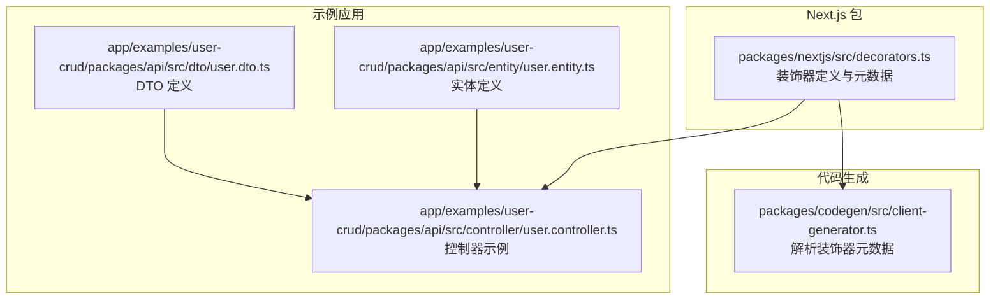
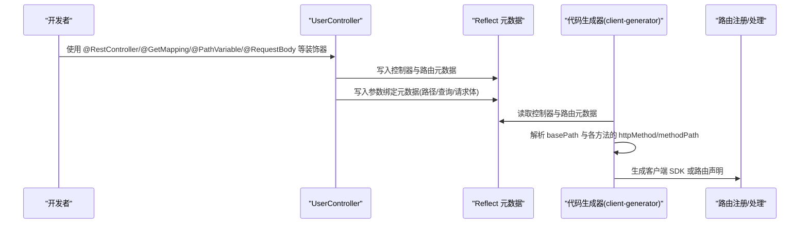
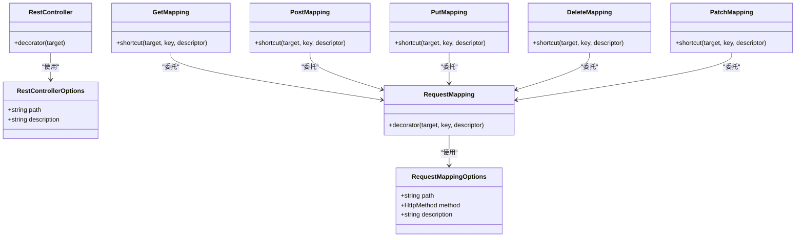
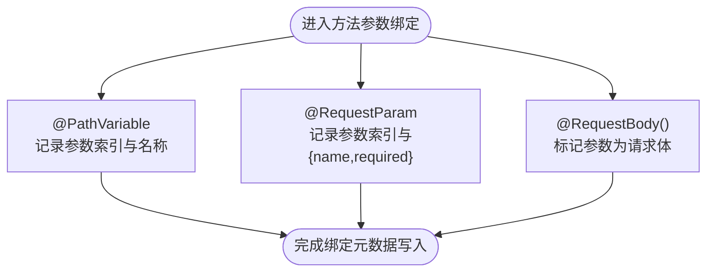
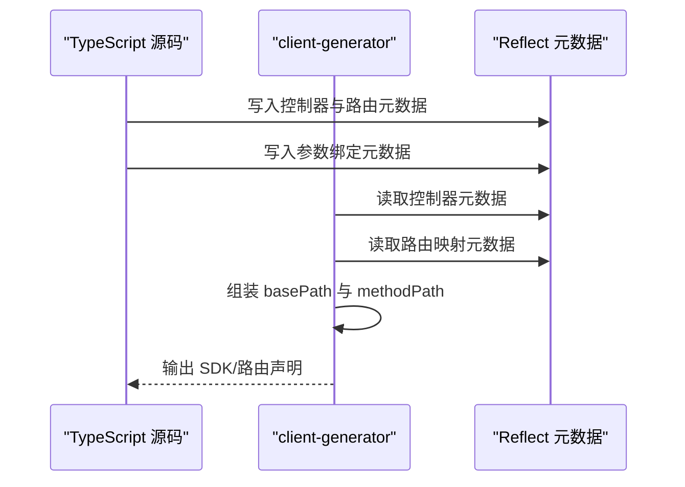
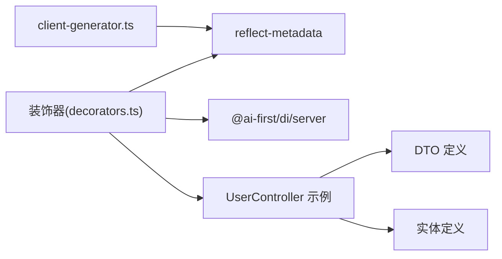

# Web 层装饰器

<cite>
**本文引用的文件**
- [packages/nextjs/src/decorators.ts](file://packages/nextjs/src/decorators.ts)
- [app/examples/user-crud/packages/api/src/controller/user.controller.ts](file://app/examples/user-crud/packages/api/src/controller/user.controller.ts)
- [app/examples/user-crud/packages/api/src/dto/user.dto.ts](file://app/examples/user-crud/packages/api/src/dto/user.dto.ts)
- [app/examples/user-crud/packages/api/src/entity/user.entity.ts](file://app/examples/user-crud/packages/api/src/entity/user.entity.ts)
- [packages/codegen/src/client-generator.ts](file://packages/codegen/src/client-generator.ts)
- [docs/packages.md](file://docs/packages.md)
</cite>

## 目录
1. [简介](#简介)
2. [项目结构](#项目结构)
3. [核心组件](#核心组件)
4. [架构总览](#架构总览)
5. [详细组件分析](#详细组件分析)
6. [依赖分析](#依赖分析)
7. [性能考虑](#性能考虑)
8. [故障排查指南](#故障排查指南)
9. [结论](#结论)
10. [附录](#附录)

## 简介
本文件系统性梳理 Web 层装饰器体系，覆盖以下主题：
- 控制器与路由装饰器：@RestController、@RequestMapping 及其派生装饰器（@GetMapping、@PostMapping、@PutMapping、@DeleteMapping、@PatchMapping）
- 参数绑定装饰器：@PathVariable、@RequestParam（含别名 @QueryParam）、@RequestBody
- 元数据系统与路由生成机制
- 在 Next.js 中的实现与使用范式
- 与 Spring Boot 的对应关系与差异
- 最佳实践与常见问题排查

## 项目结构
该仓库采用多包结构，Web 层装饰器位于 nextjs 包；示例工程位于 app/examples/user-crud，演示了如何在控制器中使用装饰器构建 RESTful API。

**图表来源**
- [packages/nextjs/src/decorators.ts](file://packages/nextjs/src/decorators.ts#L1-L196)
- [app/examples/user-crud/packages/api/src/controller/user.controller.ts](file://app/examples/user-crud/packages/api/src/controller/user.controller.ts#L1-L53)
- [app/examples/user-crud/packages/api/src/dto/user.dto.ts](file://app/examples/user-crud/packages/api/src/dto/user.dto.ts#L1-L33)
- [app/examples/user-crud/packages/api/src/entity/user.entity.ts](file://app/examples/user-crud/packages/api/src/entity/user.entity.ts#L1-L23)
- [packages/codegen/src/client-generator.ts](file://packages/codegen/src/client-generator.ts#L47-L78)

**章节来源**
- [packages/nextjs/src/decorators.ts](file://packages/nextjs/src/decorators.ts#L1-L196)
- [app/examples/user-crud/packages/api/src/controller/user.controller.ts](file://app/examples/user-crud/packages/api/src/controller/user.controller.ts#L1-L53)

## 核心组件
- 控制器装饰器
  - @RestController(options): 将类标记为 REST 控制器，并可设置基础路径等元信息；同时启用依赖注入与单例生命周期。
  - @RequestMapping(options): 通用请求映射装饰器，支持 path、method、description 等选项。
  - 派生装饰器：@GetMapping、@PostMapping、@PutMapping、@DeleteMapping、@PatchMapping，均为 @RequestMapping 的快捷封装。
- 参数绑定装饰器
  - @PathVariable(name?): 提取路径变量，支持自定义名称或默认命名。
  - @RequestParam(name?, required?): 提取查询参数，支持必填校验。
  - @QueryParam: @RequestParam 的别名。
  - @RequestBody(): 标记请求体参数，用于自动提取请求体内容。
- 元数据与工具
  - 内部使用 reflect-metadata 存储控制器与路由元数据，提供统一的元数据键值与读取器，便于上层框架或代码生成器消费。

**章节来源**
- [packages/nextjs/src/decorators.ts](file://packages/nextjs/src/decorators.ts#L26-L43)
- [packages/nextjs/src/decorators.ts](file://packages/nextjs/src/decorators.ts#L50-L88)
- [packages/nextjs/src/decorators.ts](file://packages/nextjs/src/decorators.ts#L93-L123)
- [packages/nextjs/src/decorators.ts](file://packages/nextjs/src/decorators.ts#L128-L135)
- [packages/nextjs/src/decorators.ts](file://packages/nextjs/src/decorators.ts#L140-L173)
- [packages/nextjs/src/decorators.ts](file://packages/nextjs/src/decorators.ts#L177-L195)

## 架构总览
下图展示了装饰器在运行期如何通过反射元数据记录路由与参数绑定信息，并在后续阶段被代码生成器或其他框架消费。

**图表来源**
- [packages/nextjs/src/decorators.ts](file://packages/nextjs/src/decorators.ts#L50-L88)
- [packages/nextjs/src/decorators.ts](file://packages/nextjs/src/decorators.ts#L128-L135)
- [packages/nextjs/src/decorators.ts](file://packages/nextjs/src/decorators.ts#L140-L173)
- [packages/codegen/src/client-generator.ts](file://packages/codegen/src/client-generator.ts#L47-L78)

## 详细组件分析

### 控制器与路由装饰器
- @RestController
  - 功能要点
    - 记录控制器元数据（含类名、基础路径等）
    - 自动注入构造函数依赖（基于设计时类型元数据）
    - 应用依赖注入与单例生命周期装饰
    - 包装构造函数以支持属性级 @Autowired 注入
  - 使用建议
    - 基础路径建议以“/”开头，避免重复拼接
    - 结合服务层进行业务解耦
- @RequestMapping
  - 功能要点
    - 作为通用映射入口，记录每个方法的路由选项
    - 支持 path、method、description 等
- 派生装饰器（@GetMapping/@PostMapping/@PutMapping/@DeleteMapping/@PatchMapping）
  - 功能要点
    - 快速指定 HTTP 方法，内部委托给 @RequestMapping
    - 适合快速声明标准 CRUD 路由

**图表来源**
- [packages/nextjs/src/decorators.ts](file://packages/nextjs/src/decorators.ts#L26-L43)
- [packages/nextjs/src/decorators.ts](file://packages/nextjs/src/decorators.ts#L50-L88)
- [packages/nextjs/src/decorators.ts](file://packages/nextjs/src/decorators.ts#L93-L123)
- [packages/nextjs/src/decorators.ts](file://packages/nextjs/src/decorators.ts#L128-L135)

**章节来源**
- [packages/nextjs/src/decorators.ts](file://packages/nextjs/src/decorators.ts#L26-L43)
- [packages/nextjs/src/decorators.ts](file://packages/nextjs/src/decorators.ts#L50-L88)
- [packages/nextjs/src/decorators.ts](file://packages/nextjs/src/decorators.ts#L93-L123)
- [packages/nextjs/src/decorators.ts](file://packages/nextjs/src/decorators.ts#L128-L135)

### 参数绑定装饰器
- @PathVariable(name?)
  - 功能要点
    - 从路径段中提取变量，支持自定义名称或默认命名规则
    - 通过方法参数索引建立映射
- @RequestParam(name?, required?)
  - 功能要点
    - 从查询字符串提取参数，支持必填校验
    - 通过方法参数索引建立映射
- @QueryParam
  - 功能要点
    - 与 @RequestParam 等价的别名
- @RequestBody()
  - 功能要点
    - 标记当前参数为请求体，用于自动提取 JSON/文本等请求体内容

**图表来源**
- [packages/nextjs/src/decorators.ts](file://packages/nextjs/src/decorators.ts#L140-L173)

**章节来源**
- [packages/nextjs/src/decorators.ts](file://packages/nextjs/src/decorators.ts#L140-L173)

### 元数据系统与路由生成机制
- 元数据键
  - CONTROLLER_METADATA：控制器元数据
  - REQUEST_MAPPING_METADATA：方法级路由映射
  - PATH_VARIABLE_METADATA / REQUEST_PARAM_METADATA / REQUEST_BODY_METADATA：参数绑定元数据
- 读取器
  - getControllerMetadata(target)
  - getRequestMappings(target)
  - getPathVariables(target, methodName)
  - getRequestParams(target, methodName)
  - getRequestBody(target, methodName)
- 代码生成流程
  - 解析控制器装饰器的 path 选项，形成 basePath
  - 遍历方法装饰器，识别 HTTP 方法与路径，生成路由清单
  - 读取参数绑定元数据，生成参数签名与校验规则

**图表来源**
- [packages/codegen/src/client-generator.ts](file://packages/codegen/src/client-generator.ts#L47-L78)
- [packages/nextjs/src/decorators.ts](file://packages/nextjs/src/decorators.ts#L177-L195)

**章节来源**
- [packages/nextjs/src/decorators.ts](file://packages/nextjs/src/decorators.ts#L8-L16)
- [packages/nextjs/src/decorators.ts](file://packages/nextjs/src/decorators.ts#L177-L195)
- [packages/codegen/src/client-generator.ts](file://packages/codegen/src/client-generator.ts#L47-L78)

### 与 Spring Boot 的对应关系与差异
- 对应关系
  - @RestController + @RequestMapping → @RestController + @RequestMapping
  - @GetMapping/@PostMapping/@PutMapping/@DeleteMapping/@PatchMapping → 各自对应的 Spring Boot 装饰器
  - @PathVariable/@RequestParam/@RequestBody → 对应的 Spring 注解
- 差异点
  - 本实现基于 TypeScript/JavaScript 的装饰器与 reflect-metadata，无需 Spring 容器即可工作
  - @RestController 在本实现中还承担了依赖注入与单例生命周期的职责，Spring Boot 通常由容器管理
  - 代码生成器可直接消费装饰器元数据，便于前端 SDK 或 OpenAPI 文档生成

**章节来源**
- [docs/packages.md](file://docs/packages.md#L297-L316)

## 依赖分析
- 装饰器对 reflect-metadata 的依赖：用于存储与读取元数据
- 装饰器对依赖注入（DI）的集成：在 @RestController 中自动注入构造函数依赖，并包装构造函数以支持属性注入
- 代码生成器对装饰器元数据的依赖：解析控制器与路由信息，生成客户端 SDK

**图表来源**
- [packages/nextjs/src/decorators.ts](file://packages/nextjs/src/decorators.ts#L5-L6)
- [packages/nextjs/src/decorators.ts](file://packages/nextjs/src/decorators.ts#L50-L88)
- [packages/codegen/src/client-generator.ts](file://packages/codegen/src/client-generator.ts#L47-L78)
- [app/examples/user-crud/packages/api/src/controller/user.controller.ts](file://app/examples/user-crud/packages/api/src/controller/user.controller.ts#L1-L53)

**章节来源**
- [packages/nextjs/src/decorators.ts](file://packages/nextjs/src/decorators.ts#L5-L6)
- [packages/nextjs/src/decorators.ts](file://packages/nextjs/src/decorators.ts#L50-L88)
- [packages/codegen/src/client-generator.ts](file://packages/codegen/src/client-generator.ts#L47-L78)

## 性能考虑
- 元数据访问成本低：装饰器仅在类/方法定义时写入元数据，运行期通过反射读取，开销可控
- 代码生成阶段离线处理：将装饰器解析与 SDK 生成放在构建期，减少运行时负担
- 路由匹配优化：建议在控制器层面合理组织 basePath 与方法级 path，避免过深嵌套导致匹配复杂度上升

## 故障排查指南
- 路由未生效
  - 检查是否正确使用 @RestController 与 @RequestMapping 派生装饰器
  - 确认 basePath 与方法级 path 拼接逻辑
- 参数绑定无效
  - 确认 @PathVariable/@RequestParam/@RequestBody 是否作用于正确的方法参数索引
  - 检查参数名称与 required 标记是否符合预期
- 代码生成结果异常
  - 确保装饰器元数据键存在且未被意外覆盖
  - 检查装饰器是否在编译后仍保留（TypeScript 编译配置需开启 emitDecoratorMetadata）

**章节来源**
- [packages/nextjs/src/decorators.ts](file://packages/nextjs/src/decorators.ts#L177-L195)
- [packages/codegen/src/client-generator.ts](file://packages/codegen/src/client-generator.ts#L47-L78)

## 结论
本装饰器体系以 Spring Boot 风格为蓝本，在 TypeScript/JavaScript 生态中实现了控制器与参数绑定的声明式能力，并通过 reflect-metadata 与代码生成器形成闭环。结合依赖注入与单例生命周期，可在 Next.js 等环境中高效构建 RESTful API 并输出配套 SDK。

## 附录

### 使用示例（路径指引）
- 控制器示例
  - [app/examples/user-crud/packages/api/src/controller/user.controller.ts](file://app/examples/user-crud/packages/api/src/controller/user.controller.ts#L1-L53)
- DTO 定义
  - [app/examples/user-crud/packages/api/src/dto/user.dto.ts](file://app/examples/user-crud/packages/api/src/dto/user.dto.ts#L1-L33)
- 实体定义
  - [app/examples/user-crud/packages/api/src/entity/user.entity.ts](file://app/examples/user-crud/packages/api/src/entity/user.entity.ts#L1-L23)

### 装饰器与元数据一览
- 控制器与路由
  - @RestController、@RequestMapping、@GetMapping、@PostMapping、@PutMapping、@DeleteMapping、@PatchMapping
- 参数绑定
  - @PathVariable、@RequestParam、@QueryParam、@RequestBody
- 元数据键与读取器
  - CONTROLLER_METADATA、REQUEST_MAPPING_METADATA、PATH_VARIABLE_METADATA、REQUEST_PARAM_METADATA、REQUEST_BODY_METADATA
  - getControllerMetadata、getRequestMappings、getPathVariables、getRequestParams、getRequestBody

**章节来源**
- [packages/nextjs/src/decorators.ts](file://packages/nextjs/src/decorators.ts#L177-L195)
- [docs/packages.md](file://docs/packages.md#L297-L316)