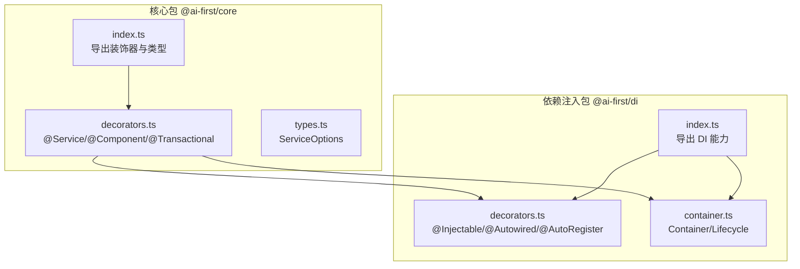
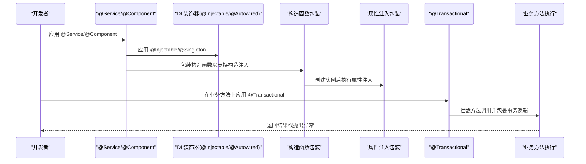
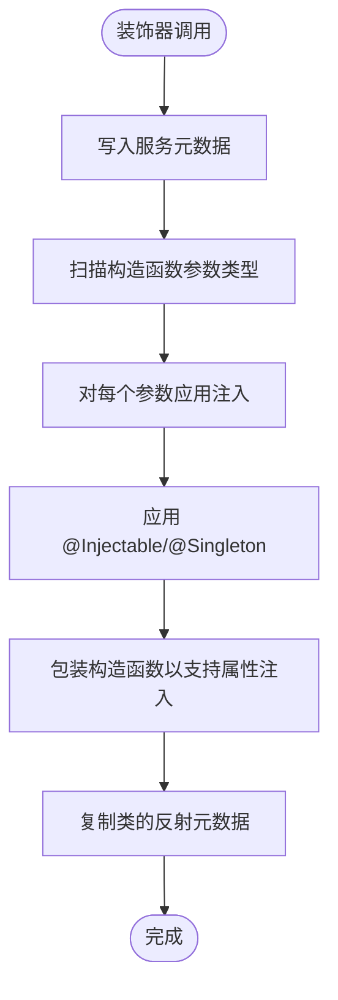
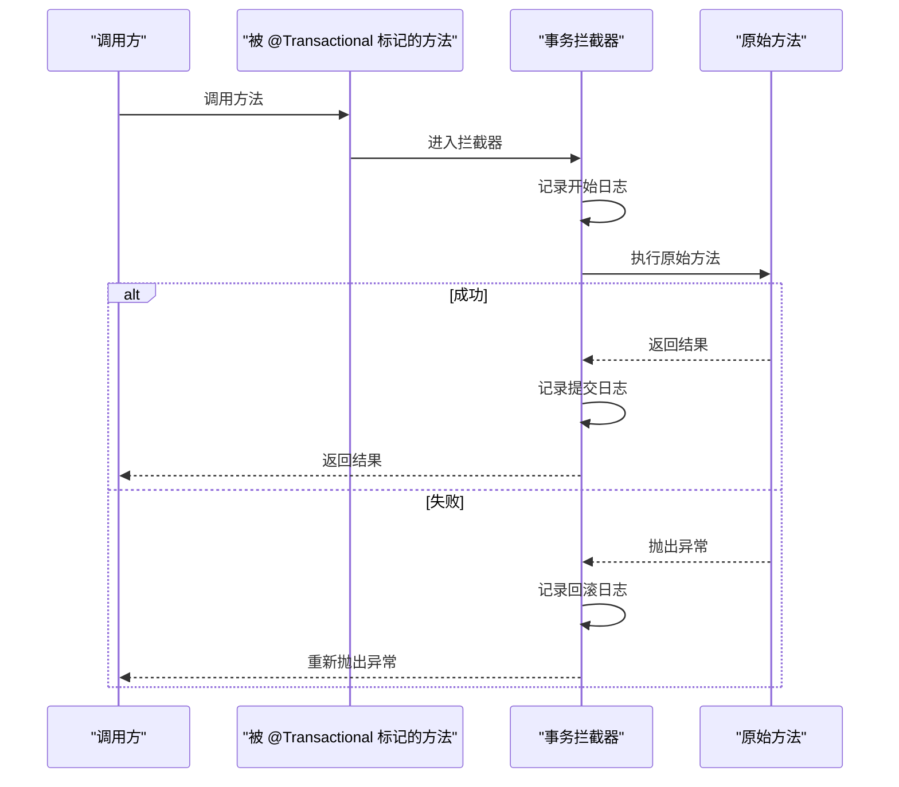
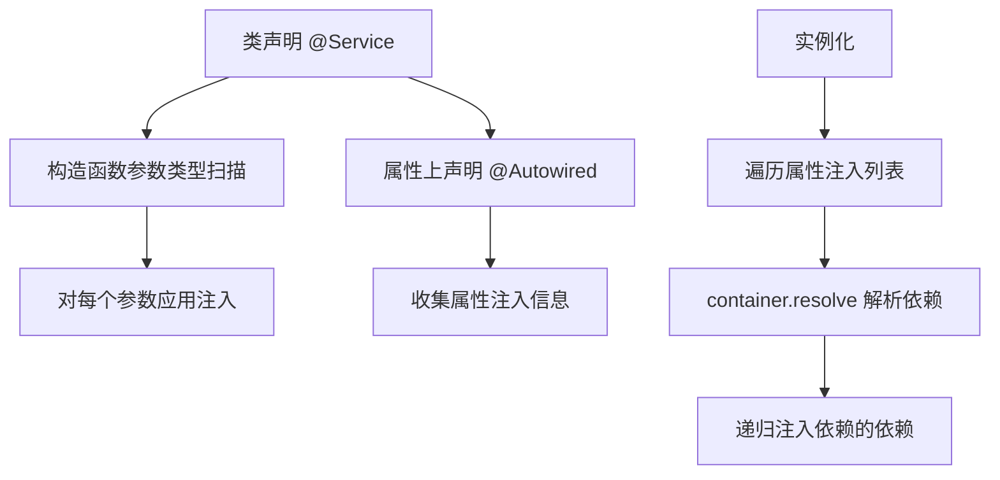
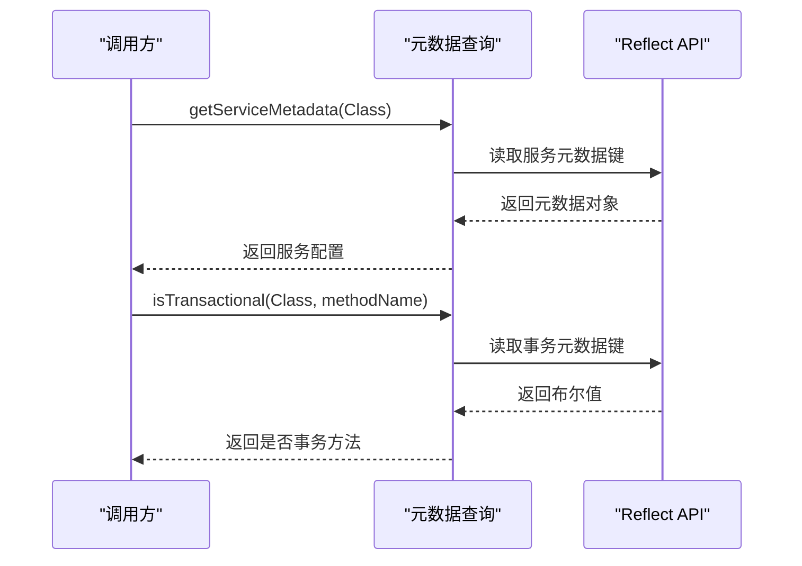
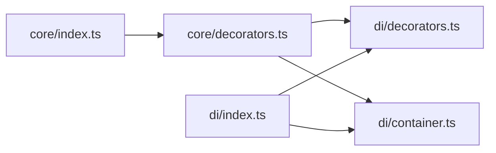

# 业务层装饰器

<cite>
**本文引用的文件**
- [packages/core/src/decorators.ts](file://packages/core/src/decorators.ts)
- [packages/core/src/index.ts](file://packages/core/src/index.ts)
- [packages/core/src/types.ts](file://packages/core/src/types.ts)
- [packages/di/src/decorators.ts](file://packages/di/src/decorators.ts)
- [packages/di/src/container.ts](file://packages/di/src/container.ts)
- [packages/di/src/index.ts](file://packages/di/src/index.ts)
- [README.md](file://README.md)
</cite>

## 目录
1. [简介](#简介)
2. [项目结构](#项目结构)
3. [核心组件](#核心组件)
4. [架构总览](#架构总览)
5. [详细组件分析](#详细组件分析)
6. [依赖关系分析](#依赖关系分析)
7. [性能考虑](#性能考虑)
8. [故障排查指南](#故障排查指南)
9. [结论](#结论)
10. [附录](#附录)

## 简介
本文件聚焦于业务层装饰器的设计与实现，系统性阐述以下能力：
- 业务层装饰器：@Service、@Component 的功能与用法
- 事务装饰器：@Transactional 的工作原理与使用方式
- 元数据收集机制：如何通过反射与符号键存储与查询装饰器元信息
- 依赖注入集成：装饰器如何与 DI 容器协作，实现构造函数注入与属性注入
- 生命周期管理：单例、作用域与瞬态生命周期策略
- 异常处理与性能优化建议
- 实际业务场景示例与最佳实践

## 项目结构
该仓库采用 monorepo 结构，业务层装饰器位于核心包中，依赖注入能力由独立的 DI 包提供。整体关系如下：

图表来源
- [packages/core/src/decorators.ts](file://packages/core/src/decorators.ts#L1-L158)
- [packages/core/src/types.ts](file://packages/core/src/types.ts#L1-L14)
- [packages/core/src/index.ts](file://packages/core/src/index.ts#L1-L22)
- [packages/di/src/decorators.ts](file://packages/di/src/decorators.ts#L1-L110)
- [packages/di/src/container.ts](file://packages/di/src/container.ts#L1-L105)
- [packages/di/src/index.ts](file://packages/di/src/index.ts#L1-L34)

章节来源
- [README.md](file://README.md#L14-L34)

## 核心组件
- 业务层装饰器
  - @Service：标记领域服务，自动注册到 DI 容器，支持构造函数注入与属性注入
  - @Component：标记通用组件，行为与 @Service 类似，便于在业务层复用
- 事务装饰器
  - @Transactional：标记方法级事务边界，拦截方法调用，统一处理提交与回滚
- 元数据与类型
  - ServiceOptions：服务选项（名称、描述等）
  - 元数据键：用于存储与查询装饰器信息的符号键
- 依赖注入装饰器
  - @Injectable、@Autowired、@AutoRegister：提供构造函数注入、属性注入与自动注册能力
- 容器与生命周期
  - Container：对 TSyringe 的封装，提供注册、解析、作用域与清理能力
  - Lifecycle：单例、作用域、瞬态三种生命周期

章节来源
- [packages/core/src/decorators.ts](file://packages/core/src/decorators.ts#L13-L158)
- [packages/core/src/types.ts](file://packages/core/src/types.ts#L8-L13)
- [packages/di/src/decorators.ts](file://packages/di/src/decorators.ts#L15-L110)
- [packages/di/src/container.ts](file://packages/di/src/container.ts#L10-L105)

## 架构总览
下图展示了装饰器如何与 DI 容器协作，完成服务注册、构造函数注入与属性注入，以及事务方法的拦截与执行。

图表来源
- [packages/core/src/decorators.ts](file://packages/core/src/decorators.ts#L30-L118)
- [packages/di/src/decorators.ts](file://packages/di/src/decorators.ts#L42-L84)

## 详细组件分析

### 组件 A：业务层装饰器（@Service 与 @Component）
- 功能要点
  - 定义元数据：记录服务名称与描述
  - 自动构造函数注入：扫描构造函数参数类型并注入
  - 应用 DI 装饰器：将类标记为可注入并默认单例
  - 包装构造函数：确保实例化后执行属性注入
  - 复制元数据：保持原类的反射元数据一致
- 关键流程（构造函数注入与属性注入）

图表来源
- [packages/core/src/decorators.ts](file://packages/core/src/decorators.ts#L81-L118)

章节来源
- [packages/core/src/decorators.ts](file://packages/core/src/decorators.ts#L30-L118)

### 组件 B：事务装饰器（@Transactional）
- 功能要点
  - 方法级事务标记：通过元数据键标识事务方法
  - 方法拦截：替换目标方法为带事务控制的包装函数
  - 统一提交/回滚：成功返回提交，异常时回滚并重新抛出
- 执行序列

图表来源
- [packages/core/src/decorators.ts](file://packages/core/src/decorators.ts#L125-L143)

章节来源
- [packages/core/src/decorators.ts](file://packages/core/src/decorators.ts#L120-L158)

### 组件 C：依赖注入装饰器与容器（@Injectable、@Autowired、Container）
- @Autowired
  - 收集属性注入信息：记录属性名与类型
  - 注入实现：解析容器中的依赖并递归注入
- Container
  - 生命周期：支持单例、作用域、瞬态
  - 批量注册：registerAll 一次注册多个服务
  - 解析与清理：resolve、isRegistered、clearAll
- 容器协作流程

图表来源
- [packages/di/src/decorators.ts](file://packages/di/src/decorators.ts#L42-L84)
- [packages/di/src/container.ts](file://packages/di/src/container.ts#L22-L105)

章节来源
- [packages/di/src/decorators.ts](file://packages/di/src/decorators.ts#L22-L110)
- [packages/di/src/container.ts](file://packages/di/src/container.ts#L19-L105)

### 组件 D：元数据收集与查询
- 元数据键
  - 服务元数据键：用于存储 @Service/@Component 的配置
  - 事务元数据键：用于标识方法是否需要事务包装
- 查询接口
  - getServiceMetadata：获取服务元数据
  - isTransactional：判断方法是否标记为事务
- 元数据查询序列

图表来源
- [packages/core/src/decorators.ts](file://packages/core/src/decorators.ts#L147-L157)

章节来源
- [packages/core/src/decorators.ts](file://packages/core/src/decorators.ts#L13-L158)

## 依赖关系分析
- 装饰器与容器的耦合
  - @Service/@Component 内部依赖 @Injectable/@Singleton 与构造函数注入
  - @Autowired 与 injectAutowiredProperties 依赖 TSyringe 容器进行解析与注入
  - @Transactional 仅依赖反射元数据，不直接依赖具体事务实现
- 导出与入口
  - @ai-first/core 导出装饰器与类型
  - @ai-first/di 导出容器与装饰器

图表来源
- [packages/core/src/decorators.ts](file://packages/core/src/decorators.ts#L9-L11)
- [packages/core/src/index.ts](file://packages/core/src/index.ts#L13-L21)
- [packages/di/src/index.ts](file://packages/di/src/index.ts#L12-L24)

章节来源
- [packages/core/src/index.ts](file://packages/core/src/index.ts#L10-L21)
- [packages/di/src/index.ts](file://packages/di/src/index.ts#L6-L24)

## 性能考虑
- 构造函数注入
  - 通过反射扫描参数类型，建议在生产环境避免过度复杂依赖链
- 属性注入
  - 递归注入依赖可能带来额外开销，建议控制注入层级深度
- 事务拦截
  - 包装方法会引入一层异步开销，建议仅对必要方法使用 @Transactional
- 生命周期选择
  - 单例适合无状态服务；作用域与瞬态按需选择，避免不必要的实例创建
- 元数据读取
  - 元数据查询为 O(1)，但频繁反射调用仍需注意

## 故障排查指南
- 无法注入依赖
  - 检查是否正确应用 @Injectable 或 @Service/@Component
  - 确认构造函数参数类型是否可被容器解析
  - 使用 Container.isRegistered 检查注册状态
- 属性注入未生效
  - 确认属性上已标注 @Autowired
  - 检查实例是否通过容器创建（构造函数注入）或手动触发属性注入
- 事务未生效
  - 确认方法已标注 @Transactional
  - 检查方法是否为异步且被正确拦截
- 循环依赖
  - 避免类之间互相注入导致的循环；可通过重构降低耦合

章节来源
- [packages/di/src/decorators.ts](file://packages/di/src/decorators.ts#L67-L84)
- [packages/di/src/container.ts](file://packages/di/src/container.ts#L79-L82)

## 结论
本装饰器体系以“反射 + 符号键 + TSyringe”为核心，实现了：
- 清晰的业务层装饰器（@Service/@Component）
- 明确的事务边界（@Transactional）
- 完整的依赖注入（构造函数注入与属性注入）
- 可扩展的元数据收集与查询
配合合理的生命周期与异常处理策略，可在保证可维护性的同时获得良好的性能表现。

## 附录

### 实际业务场景示例（步骤说明）
- 用户服务示例（来自 README）
  - 步骤 1：使用 @Service 标记领域服务类
  - 步骤 2：使用 @Autowired 注入数据访问层
  - 步骤 3：在业务方法上使用 @Transactional 标注事务边界
  - 步骤 4：通过 DI 容器解析服务并调用
- 参考路径
  - [README.md](file://README.md#L112-L137)

章节来源
- [README.md](file://README.md#L112-L137)